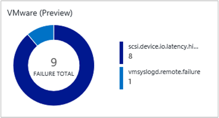
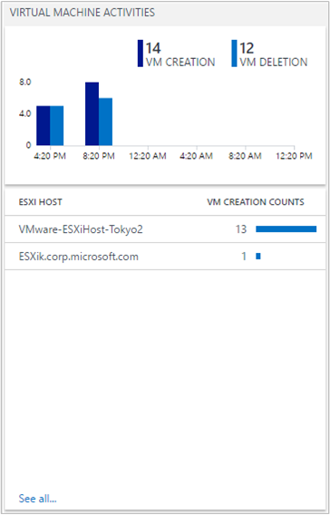

<properties
    pageTitle="Solution VMware surveillance dans journal Analytique | Microsoft Azure"
    description="Découvrez comment la solution VMware surveillance peut aider gérer les journaux et surveiller ESXi hosts."
    services="log-analytics"
    documentationCenter=""
    authors="bandersmsft"
    manager="jwhit"
    editor=""/>

<tags
    ms.service="log-analytics"
    ms.workload="na"
    ms.tgt_pltfrm="na"
    ms.devlang="na"
    ms.topic="article"
    ms.date="10/28/2016"
    ms.author="banders"/>

# <a name="vmware-monitoring-preview-solution-in-log-analytics"></a>Solution VMware surveillance (Preview) dans le journal Analytique

La solution VMware surveillance dans Analytique journal est une solution qui vous permet de créer une approche de surveillance pour des fichiers journaux VMware volumineux et journalisation centralisée. Cet article décrit comment vous pouvez résoudre les problèmes, capturer et gérer les hôtes ESXi dans un emplacement unique à l’aide de la solution. Avec la solution, vous pouvez afficher des données détaillées pour tous vos hôtes ESXi dans un emplacement unique. Vous pouvez voir détermine événement supérieure, l’état et les tendances des hôtes machine virtuelle et ESXi fournies dans les fichiers journaux hôte ESXi. Vous pouvez résoudre les problèmes en consultant et recherche les journaux de l’hôte ESXi centralisés. Et, vous pouvez créer des alertes basées sur les requêtes de recherche de journal.

La solution utilise la fonctionnalité de journal système natif de l’hôte ESXi à push des données pour une machine virtuelle, c'est-à-dire OMS Agent cible. Toutefois, la solution n’écrire des fichiers dans le journal système dans la machine virtuelle cible. L’agent OMS ouvre le port 1514 et écoute ceci. Une fois qu’elle reçoit les données, l’agent OMS envoie les données dans OMS.

## <a name="installing-and-configuring-the-solution"></a>Installation et configuration de la solution

Utilisez les informations suivantes pour installer et configurer la solution.

- Ajouter la solution VMware surveillance des mots clés dans votre espace de travail OMS à l’aide de la procédure décrite dans [solutions ajouter journal Analytique à partir de la galerie de Solutions](log-analytics-add-solutions.md).

#### <a name="supported-vmware-esxi-hosts"></a>Hôtes VMware ESXi pris en charge
vSphere ESXi hôte 5.5 et 6.0

#### <a name="prepare-a-linux-server"></a>Préparation d’un serveur Linux
Créer un système d’exploitation Linux machine virtuelle à recevoir toutes les données de journal système des hôtes ESXi. L' [Agent de Linux OMS](log-analytics-linux-agents.md) est le point de regroupement pour toutes les données de journal système ESXi hôte. Vous pouvez utiliser plusieurs hôtes ESXi pour transférer les fichiers journaux à un seul serveur Linux, comme dans l’exemple suivant.  

   

### <a name="configure-syslog-collection"></a>Configurer la collecte de journal système

1. Configurer le transfert du journal système pour VSphere. Pour plus d’informations pour aider à configurer le transfert du journal système, voir [Configuration journal système sur ESXi 5.x et 6.0 (2003322)](https://kb.vmware.com/selfservice/microsites/search.do?language=en_US&cmd=displayKC&externalId=2003322). Accédez à **la Configuration hôte ESXi** > **logiciel** > **Paramètres avancés** > **journal système**.
    

2. Dans le champ *Syslog.global.logHost* , ajoutez votre serveur Linux et le numéro de port *1514*. Par exemple, `tcp://hostname:1514` ou`tcp://123.456.789.101:1514`

3. Ouvrez le pare-feu hôte ESXi pour journal système. **Configuration de l’hôte ESXi** > **logiciel** > **Profil de sécurité** > **pare-feu** et ouvrir les **Propriétés**.  

      

      

4. Vérifier la vSphere Console pour vérifier que ce journal système est correctement configuré. Confirmer sur l’hôte ESXI ce port **1514** est configuré.

5. Tester la connectivité entre le serveur Linux et l’hôte ESXi à l’aide de la `nc` commande sur l’hôte ESXi. Par exemple :

    ```
    [root@ESXiHost:~] nc -z 123.456.789.101 1514
    Connection to 123.456.789.101 1514 port [tcp/*] succeeded!
    ```

6. Téléchargez et installez l’Agent OMS pour Linux sur le serveur Linux. Pour plus d’informations, consultez la [Documentation de l’Agent OMS pour Linux](https://github.com/Microsoft/OMS-Agent-for-Linux).

7. Une fois l’Agent OMS pour Linux est installé, accédez au répertoire /etc/opt/microsoft/omsagent/sysconf/omsagent.d et copiez le fichier vmware_esxi.conf dans le répertoire /etc/opt/microsoft/omsagent/conf/omsagent.d et la modification du propriétaire ou du groupe et les autorisations du fichier. Par exemple :

    ```
    sudo cp /etc/opt/microsoft/omsagent/sysconf/omsagent.d/vmware_esxi.conf /etc/opt/microsoft/omsagent/conf/omsagent.d
sudo chown omsagent:omiusers /etc/opt/microsoft/omsagent/conf/omsagent.d/vmware_esxi.conf
    ```

8.  Redémarrez l’Agent OMS pour Linux en exécutant `sudo /opt/microsoft/omsagent/bin/service_control restart`.

9. Dans le portail OMS, effectuer une recherche de journal de `Type=VMware_CL`. Quand OMS collecte les données de journal système, elle conserve la mise en forme de journal système. Dans le portail, certains des champs spécifiques sont capturés, telles que *nom d’hôte* et *ProcessName*.  

      

    Si vos résultats de recherche de journal de vue sont similaires à l’image ci-dessus, vous avez défini pour utiliser le tableau de bord solution OMS VMware surveillance.  

## <a name="vmware-data-collection-details"></a>Détails de la collection de sites VMware données

La solution VMware surveillance collecte diverses performances métriques et journal de données à partir des hôtes ESXi à l’aide d’Agents OMS pour Linux que vous avez activés.

Le tableau suivant montre les méthodes de collecte de données et autres informations sur la façon dont les données sont collectées.

| plateforme | Agent OMS pour Linux | Agent SCOM | Stockage Azure | SCOM obligatoire ? | Données de l’agent SCOM envoyées par groupe d’administration | fréquence de collection de sites |
|---|---|---|---|---|---|---|
|Linux||||            || toutes les trois minutes|


Le tableau suivant donnent des exemples de champs de données collectées par la solution VMware surveillance :

| nom de champ | Description |
| --- | --- |
| Device_s| Périphériques de stockage VMware |
| ESXIFailure_s | types d’échecs |
| EventTime_t | temps lorsque l’événement s’est produit |
| HostName_s | Nom d’hôte ESXi |
| Operation_s | créer des machines virtuelles ou supprimer machine virtuelle |
| ProcessName_s | nom de l’événement |
| ResourceId_s | nom de l’hôte VMware |
| ResourceLocation_s | VMware |
| ResourceName_s | VMware |
| ResourceType_s | Hyper-V |
| SCSIStatus_s | État SCSI VMware |
| SyslogMessage_s | Données du journal système |
| UserName_s | utilisateur qui a créé ou supprimés machine virtuelle |
| VMName_s | Nom de la machine virtuelle |
| Ordinateur | ordinateur hôte |
| TimeGenerated | heure que les données a été générées |
| DataCenter_s | Centre de données VMware |
| StorageLatency_s | latence de stockage (ms) |

## <a name="vmware-monitoring-solution-overview"></a>Présentation de la solution VMware surveillance

La vignette VMware apparaît dans le portail OMS. Il fournit une vue d’ensemble des échecs. Lorsque vous cliquez sur la vignette, vous accédez à un affichage tableau de bord.



#### <a name="navigate-the-dashboard-view"></a>Naviguer dans l’affichage tableau de bord

Dans l’affichage de tableau de bord **VMware** , cartes sont organisées par :

- Nombre d’échecs état
- Compte hôte supérieure au moyen d’événement
- Nombre d’événements supérieure
- Activités de Machine virtuelle
- Événements de disque ESXi hôte


Cliquez sur une carte pour ouvrir le volet de recherche journal Analytique qui affiche des informations détaillées spécifiques pour la carte.

De là, vous pouvez modifier la requête de recherche pour l’adapter à un élément spécifique. Pour un didacticiel sur les bases de la recherche OMS, consultez la [didacticiel de recherche de journal OMS.](log-analytics-log-searches.md)

#### <a name="find-esxi-host-events"></a>Rechercher des événements ESXi hôte

Un seul hôte ESXi génère plusieurs journaux, en fonction de leurs processus. La solution VMware surveillance les centralise et résume le nombre d’événements. Cet affichage centralisé permet d’identifier quel hôte ESXi comporte un volume élevé d’événements et les événements qui se produisent généralement dans votre environnement.


Vous pouvez extraire les autres en cliquant sur un hôte ESXi ou un type d’événement.

Lorsque vous cliquez sur un nom d’hôte ESXi, vous permet d’afficher des informations à partir de cet hôte ESXi. Si vous souhaitez affiner les résultats avec le type d’événement, ajoutez `“ProcessName_s=EVENT TYPE”` dans votre requête de recherche. Vous pouvez sélectionner **ProcessName** dans le filtre de recherche. Qui restreint les informations pour vous.


#### <a name="find-high-vm-activities"></a>Rechercher des activités machine virtuelle haute

Une machine virtuelle peuvent être créée et supprimée sur n’importe quel hôte ESXi. Il est utile pour un administrateur d’identifier le nombre de machines virtuelles crée un hôte ESXi. Ce tour, est utile de comprendre les performances et planification de la capacité. Il est essentiel d’effectuer le suivi des événements d’activité machine virtuelle lors de la gestion de votre environnement.



Si vous voulez voir ESXi hôte machine virtuelle la création des données supplémentaires, cliquez sur un nom d’hôte ESXi.


#### <a name="common-search-queries"></a>Requêtes de recherche courantes

La solution inclut d’autres requêtes utiles qui peuvent vous aider à gérer vos hôtes ESXi, tels qu’espace de stockage haute latence de stockage et Échec du chemin d’accès.


#### <a name="save-queries"></a>Enregistrer des requêtes

L’enregistrement des requêtes de recherche est une fonctionnalité standard de OMS et peut vous aider à toutes les requêtes que vous avez trouvé utile. Après avoir créé une requête que vous trouvez utile, enregistrez-le en cliquant sur les **Favoris**. Une requête enregistrée vous permet de facilement le réutiliser ultérieurement à partir de la page [Mon tableau de bord](log-analytics-dashboards.md) dans lequel vous pouvez créer vos propres tableaux de bord personnalisés.


#### <a name="create-alerts-from-queries"></a>Créer des alertes à partir de requêtes

Une fois que vous avez créé vos requêtes, vous souhaiterez peut-être utiliser les requêtes pour vous informer des événements spécifiques se produisent. Pour plus d’informations sur la façon de créer des alertes, voir [alertes dans le journal Analytique](log-analytics-alerts.md) . Pour obtenir des exemples d’alerte des requêtes et autres exemples de requête, consultez le [Moniteur VMware à l’aide de OMS journal Analytique](https://blogs.technet.microsoft.com/msoms/2016/06/15/monitor-vmware-using-oms-log-analytics) blog.

## <a name="frequently-asked-questions"></a>Forum aux questions

### <a name="what-do-i-need-to-do-on-the-esxi-host-setting-what-impact-will-it-have-on-my-current-environment"></a>Que dois-je faire sur la ESXi héberger paramètre ? Quel est l’impact qu’il aura sur mon environnement actuel ?
La solution utilise le journal d’hôte ESXi native système mécanisme de transfert. Vous n’avez pas besoin tout logiciel Microsoft supplémentaire sur l’hôte ESXi pour capturer les journaux. Il doit avoir un faible impact à votre environnement existant. Toutefois, vous n’avez pas besoin de configurer le transfert du journal système, qui est une fonctionnalité ESXI.

### <a name="do-i-need-to-restart-my-esxi-host"></a>Ai-je besoin redémarrer hôte de sites Mon ESXi ?
Non. Ce processus ne nécessite pas un redémarrage. Parfois, vSphere ne pas correctement met à jour le journal système. Dans ce cas, ouvrez une session sur l’hôte ESXi et recharger le journal système. Là encore, vous n’êtes pas obligé de redémarrer l’hôte, afin que ce processus n’est pas sans interruption de service à votre environnement.

### <a name="can-i-increase-or-decrease-the-volume-of-log-data-sent-to-oms"></a>Puis-je augmenter ou diminuer le volume de données du journal envoyés à OMS ?
Si, tu peux. Vous pouvez utiliser les paramètres de niveau de journalisation ESXi hôte dans vSphere. Collection de journal est basée sur le niveau *d’informations* . Par conséquent, si vous voulez auditer machine virtuelle création ou suppression, vous devez garder le niveau *d’informations* sur Hostd. Pour plus d’informations, voir la [Base de connaissances VMware](https://kb.vmware.com/selfservice/microsites/search.do?&cmd=displayKC&externalId=1017658).

### <a name="why-is-hostd-not-providing-data-to-oms-my-log-setting-is-set-to-info"></a>Pourquoi est Hostd pas fournir des données à OMS ? Mon journal est défini sur informations.
Un bogue hôte ESXi pour l’horodatage journal système s’est produite. Pour plus d’informations, voir la [Base de connaissances VMware](https://kb.vmware.com/selfservice/microsites/search.do?language=en_US&cmd=displayKC&externalId=2111202). Après avoir appliqué la solution de contournement, Hostd devraient fonctionner normalement.

### <a name="can-i-have-multiple-esxi-hosts-forwarding-syslog-data-to-a-single-vm-with-omsagent"></a>Puis-je avoir plusieurs hôtes ESXi transférer des données de journal système une seule machine virtuelle avec omsagent ?
Oui. Vous pouvez avoir plusieurs hôtes ESXi transférez à un seul ordinateur virtuel avec omsagent.

### <a name="why-dont-i-see-data-flowing-into-oms"></a>Pourquoi ne puis-je pas voir les données s’étalant dans OMS ?

Il peut y avoir plusieurs raisons :

- L’hôte ESXi est reçue pas correctement les données de la machine virtuelle en cours d’exécution omsagent. Pour tester, effectuez les opérations suivantes :
    1. Pour confirmer, ouvrez une session sur l’hôte ESXi à l’aide de ssh et exécutez la commande suivante :`nc -z ipaddressofVM 1514`

        Si ce n’est pas réussi, vSphere paramètres dans la Configuration avancée sont probables pas corriger. Pour plus d’informations sur la façon de configurer l’hôte ESXi pour le transfert du journal système, voir [configurer journal système collection](#configure-syslog-collection) .

    2. Si la connectivité de port journal système est correcte, mais vous ne voyez toujours pas toutes les données, puis recharger le journal système sur l’hôte ESXi à l’aide de ssh pour exécuter la commande suivante :` esxcli system syslog reload`

- La machine virtuelle avec l’Agent OMS n’est pas correctement définie. Pour tester votre animation, procédez comme suit :
    1. OMS écoute le port 1514 et envoie des données en OMS. Pour vérifier qu’elle est ouverte, exécutez la commande suivante :`netstat -a | grep 1514`
    2. Vous devriez voir port `1514/tcp` ouvrir. Si vous ne pas, vérifiez que l’omsagent est installé correctement. Si vous ne voyez pas les informations de port, puis le port journal système n’est pas ouvert sur l’ordinateur virtuel.
        1. Vérifiez que l’Agent OMS s’exécute à l’aide de `ps -ef | grep oms`. Si elle n’est pas en cours d’exécution, commencez le processus en exécutant la commande` sudo /opt/microsoft/omsagent/bin/service_control start`
        2. Ouvrir le `/etc/opt/microsoft/omsagent/conf/omsagent.d/vmware_esxi.conf` fichier.

            Vérifiez que l’utilisateur approprié et le paramètre de groupe est valide, similaire à :`-rw-r--r-- 1 omsagent omiusers 677 Sep 20 16:46 vmware_esxi.conf`

            Si le fichier n’existe pas ou que l’utilisateur et le paramètre de groupe est incorrect, surviennent en [Préparation d’un serveur Linux](#prepare-a-linux-server).

## <a name="next-steps"></a>Étapes suivantes

- Utilisez des [Recherches de journaux](log-analytics-log-searches.md) dans Analytique journal pour afficher les données de l’hôte VMware détaillées.
- [Créer vos propres tableaux de bord](log-analytics-dashboards.md) affichant des données de l’hôte VMware.
- [Créer alertes](log-analytics-alerts.md) lorsque surviennent certains événements hôte VMware spécifiques.
