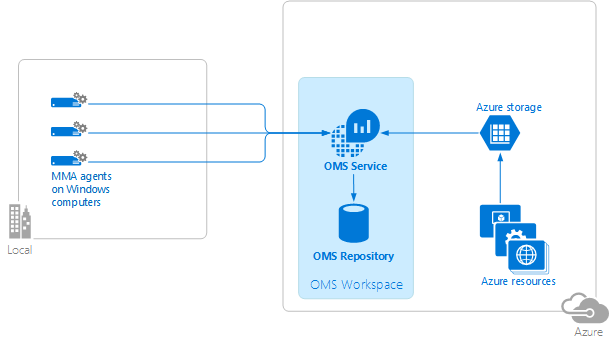
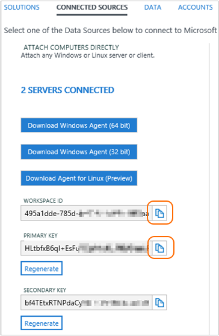
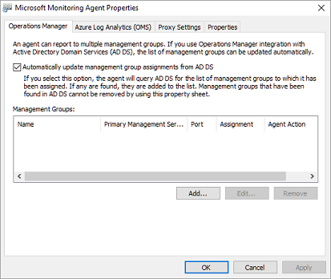

<properties
    pageTitle="Connecter des ordinateurs Windows à journal Analytique | Microsoft Azure"
    description="Cet article vous explique les étapes pour connecter les ordinateurs Windows dans votre infrastructure local directement à OMS en utilisant une version de Microsoft surveillance Agent (MMA) personnalisée."
    services="log-analytics"
    documentationCenter=""
    authors="bandersmsft"
    manager="jwhit"
    editor=""/>

<tags
    ms.service="log-analytics"
    ms.workload="na"
    ms.tgt_pltfrm="na"
    ms.devlang="na"
    ms.topic="article"
    ms.date="08/11/2016"
    ms.author="banders"/>


# <a name="connect-windows-computers-to-log-analytics"></a>Connecter des ordinateurs Windows à Analytique de journal

Cet article vous explique les étapes pour connecter les ordinateurs Windows dans votre infrastructure local directement aux espaces de travail OMS en utilisant une version de Microsoft surveillance Agent (MMA) personnalisée. Vous devez installer et se connecter agents pour tous les ordinateurs que vous voulez à intégré à OMS tapées à envoyer des données à OMS et d’afficher et agir sur ces données dans le portail OMS. Chaque agent peut signaler à plusieurs espaces de travail.

Vous pouvez installer des agents à l’aide de la configuration, ligne de commande, ou avec vous le souhaitez état Configuration (DSC) dans Azure Automation.  

>[AZURE.NOTE] Pour les machines virtuelles en cours d’exécution dans Azure vous pouvez simplifient l’installation en utilisant l' [extension de la machine virtuelle](log-analytics-azure-vm-extension.md).

Sur les ordinateurs avec une connectivité Internet, l’agent utilisera la connexion à Internet à envoyer des données à OMS. Pour les ordinateurs qui n’ont pas de connexion à Internet, vous pouvez utiliser un serveur proxy ou les redirecteurs OMS journal Analytique.

Connectez vos ordinateurs Windows à OMS est simple à l’aide de 3 étapes simples :

1. Télécharger le fichier de configuration de l’agent
2. Installer l’agent à l’aide de la méthode choisie
3. Configurer l’agent ou ajouter des espaces de travail supplémentaires, si nécessaire

Le diagramme suivant illustre la relation entre vos ordinateurs Windows et OMS une fois que vous avez installé et configuré agents.




## <a name="system-requirements-and-required-configuration"></a>Configuration système requise et configuration requise
Avant d’installer ou déployer des agents, passez en revue les détails suivants pour vous assurer que vous répondez aux conditions requises.

- Vous ne pouvez installer la OMS MMA sur les ordinateurs exécutant Windows Server 2008 SP 1 ou version ultérieure ou Windows 7 SP1 ou version ultérieure.
- Vous avez besoin d’un abonnement OMS.  Pour plus d’informations, voir [prise en main journal Analytique](log-analytics-get-started.md).
- Chaque ordinateur Windows doit être en mesure de vous connecter à Internet à l’aide de HTTPS. Cette connexion peut être directe, via un proxy, ou les redirecteurs OMS journal Analytique.
- Vous pouvez installer la OMS MMA sur ordinateurs autonomes, des serveurs et machines virtuelles. Si vous voulez vous connecter hébergé Azure des machines virtuelles OMS, voir [connecter Azure machines virtuelles journal Analytique](log-analytics-azure-vm-extension.md).
- L’agent doit utiliser le port TCP 443 pour différentes ressources. Pour plus d’informations, voir [configurer les paramètres de proxy et de pare-feu dans journal Analytique](log-analytics-proxy-firewall.md).

## <a name="download-the-agent-setup-file-from-oms"></a>Télécharger le fichier de configuration de l’agent de OMS
1. Dans le portail OMS, dans la page **vue d’ensemble** , cliquez sur la vignette **paramètres** .  Cliquez sur l’onglet **Sources connectées** dans la partie supérieure.  
    
2. Sous **Joindre directement des ordinateurs**, cliquez sur **Télécharger un Agent Windows** applicables à votre type de processeur d’ordinateur pour télécharger le fichier d’installation.
3. À droite de **l’ID de l’espace de travail**, cliquez sur l’icône Copier et coller le code dans le bloc-notes.
4. À droite de **Clé primaire**, cliquez sur l’icône Copier et coller la clé dans le bloc-notes.     
    

## <a name="install-the-agent-using-setup"></a>Installer l’agent en utilisant le programme d’installation
1. Exécutez le programme d’installation pour installer l’agent sur un ordinateur sur lequel vous voulez gérer.
2. Dans la page Bienvenue, cliquez sur **suivant**.
3. Dans la page Contrat de licence, lisez la licence, puis cliquez sur **J’accepte**.
4. Dans la page dossier de Destination, modifier ou conserver le dossier d’installation par défaut, puis sur **suivant**.
5. Dans la page Options de configuration de l’Agent, vous pouvez choisir pour vous connecter à l’agent à Azure journal Analytique (OMS), Operations Manager, ou vous pouvez laisser les choix vide si vous voulez configurer l’agent ultérieurement. Cliquez sur **suivant**.   
    - Si vous avez choisi pour vous connecter à Azure journal Analytique (OMS), collez **l’ID de l’espace de travail** et la **Clé d’espace de travail (clé primaire)** que vous avez copié dans le bloc-notes dans la procédure précédente, puis sur **suivant**.  
        
    - Si vous avez choisi pour vous connecter à Operations Manager, tapez le **Nom de groupe d’administration**, le nom de **Serveur de gestion** et **Port du serveur de gestion des**, puis cliquez sur **suivant**. Dans la page compte Action d’Agent, sélectionnez le compte système Local ou un compte de domaine local, puis sur **suivant**.  
        

6. Dans la page prêt à installer, passez en revue vos choix, puis sur **installer**.
7. Sur la Configuration terminée, cliquez sur **Terminer**.
8. Lorsque vous avez terminé, l' **Agent de surveillance Microsoft** s’affiche dans **Le panneau de configuration**. Vous pouvez vérifier votre configuration il et vérifiez que l’agent est connecté à perspectives opérationnelles (OMS). Lorsque connecté à OMS, l’agent affiche un message indiquant : **l’Agent de surveillance Microsoft a réussi à connecter au service Microsoft Operations Management Suite.**

## <a name="install-the-agent-using-the-command-line"></a>Installer l’agent à l’aide de la ligne de commande
- Modifier, puis utilisez l’exemple suivant pour installer l’agent à l’aide de la ligne de commande.

    >[AZURE.NOTE] Si vous voulez mettre à niveau un agent, vous devez utiliser l’Analytique journal API de script. Voir la section suivante pour mettre à niveau un agent.

    ```
    MMASetup-AMD64.exe /Q:A /R:N /C:"setup.exe /qn ADD_OPINSIGHTS_WORKSPACE=1 OPINSIGHTS_WORKSPACE_ID=<your workspace id> OPINSIGHTS_WORKSPACE_KEY=<your workspace key> AcceptEndUserLicenseAgreement=1"
    ```

## <a name="upgrade-the-agent-and-add-a-workspace-using-a-script"></a>L’agent de mise à niveau et ajouter un espace de travail à l’aide d’un script
Vous pouvez mettre à niveau un agent et ajoutez un espace de travail à l’aide de l’Analytique journal API de script avec l’exemple de PowerShell suivant.

```
$mma = New-Object -ComObject 'AgentConfigManager.MgmtSvcCfg'
$mma.AddCloudWorkspace($workspaceId, $workspaceKey)
$mma.ReloadConfiguration()
```

>[AZURE.NOTE] Si vous avez utilisé la ligne de commande ou un script précédemment installer et configurer l’agent `EnableAzureOperationalInsights` a été remplacé par `AddCloudWorkspace`.

## <a name="install-the-agent-using-dsc-in-azure-automation"></a>Installer l’agent à l’aide de DSC dans Azure Automation

>[AZURE.NOTE] Cet exemple de script et procédure ne met pas à niveau un agent existant.

1. Importer la Module DSC xPSDesiredStateConfiguration de [http://www.powershellgallery.com/packages/xPSDesiredStateConfiguration](http://www.powershellgallery.com/packages/xPSDesiredStateConfiguration) dans Azure Automation.  
2.  Créer des biens variables Automation Azure pour *OPSINSIGHTS_WS_ID* et *OPSINSIGHTS_WS_KEY*. Affectez *OPSINSIGHTS_WS_ID* à votre ID d’espace de travail OMS journal Analytique et *OPSINSIGHTS_WS_KEY* à la clé primaire de votre espace de travail.
3.  Utilisez le script ci-dessous et enregistrez-le en tant que MMAgent.ps1
4.  Modifier, puis utilisez l’exemple suivant pour installer l’agent à l’aide de DSC dans Azure Automation. Importer des MMAgent.ps1 dans Azure Automation à l’aide de l’interface Automation Azure ou l’applet de commande.
5.  Affecter un nœud à la configuration. Dans les 15 minutes, le nœud doit vérifier sa configuration et la MMA est poussée vers le nœud.

```
Configuration MMAgent
{
    $OIPackageLocalPath = "C:\MMASetup-AMD64.exe"
    $OPSINSIGHTS_WS_ID = Get-AutomationVariable -Name "OPSINSIGHTS_WS_ID"
    $OPSINSIGHTS_WS_KEY = Get-AutomationVariable -Name "OPSINSIGHTS_WS_KEY"


    Import-DscResource -ModuleName xPSDesiredStateConfiguration

    Node OMSnode {
        Service OIService
        {
            Name = "HealthService"
            State = "Running"
            DependsOn = "[Package]OI"
        }

        xRemoteFile OIPackage {
            Uri = "http://download.microsoft.com/download/0/C/0/0C072D6E-F418-4AD4-BCB2-A362624F400A/MMASetup-AMD64.exe"
            DestinationPath = $OIPackageLocalPath
        }

        Package OI {
            Ensure = "Present"
            Path  = $OIPackageLocalPath
            Name = "Microsoft Monitoring Agent"
            ProductId = "8A7F2C51-4C7D-4BFD-9014-91D11F24AAE2"
            Arguments = '/C:"setup.exe /qn ADD_OPINSIGHTS_WORKSPACE=1 OPINSIGHTS_WORKSPACE_ID=' + $OPSINSIGHTS_WS_ID + ' OPINSIGHTS_WORKSPACE_KEY=' + $OPSINSIGHTS_WS_KEY + ' AcceptEndUserLicenseAgreement=1"'
            DependsOn = "[xRemoteFile]OIPackage"
        }
    }
}  


```


## <a name="configure-an-agent-manually-or-add-additional-workspaces"></a>Configurer manuellement un agent ou ajouter des espaces de travail supplémentaires
Si vous avez installé agents mais n’avez ne pas configuré les ou si vous souhaitez que l’agent pour signaler à plusieurs espaces de travail, vous pouvez utiliser les informations suivantes pour activer un agent ou reconfigurer. Une fois que vous avez configuré l’agent, il vous sera enregistré avec le service agent et obtenir des informations de configuration nécessaires et packs d’administration qui contiennent des informations sur la solution.

1. Une fois que vous avez installé l’Agent de surveillance Microsoft, ouvrez **Le panneau de configuration**.
2. Ouvrir **l’Agent de surveillance Microsoft** , puis sur l’onglet **Azure journal Analytique (OMS)** .   
3. Cliquez sur **Ajouter** pour ouvrir la zone **Ajouter un espace de travail journal Analytique** .
4. Collez **l’ID de l’espace de travail** et la **Clé d’espace de travail (clé primaire)** que vous avez copié dans le bloc-notes dans une procédure précédente pour l’espace de travail que vous souhaitez ajouter, puis cliquez sur **OK**.  
    

Une fois collecte des données à partir d’ordinateurs analysés par l’agent, le nombre d’ordinateurs analysés par OMS apparaît dans le portail OMS sous l’onglet **Sources connectées** dans **paramètres** en tant que **Serveurs connectés**.


## <a name="to-disable-an-agent"></a>Pour désactiver un agent
1. Après avoir installé l’agent, ouvrez **Le panneau de configuration**.
2. Ouvrir l’Agent de surveillance Microsoft, puis sur l’onglet **Azure journal Analytique (OMS)** .
3. Sélectionnez un espace de travail, puis sur **Supprimer**. Répétez cette étape pour tous les autres espaces de travail.


## <a name="optionally-configure-agents-to-report-to-an-operations-manager-management-group"></a>Vous pouvez également configurer les agents pour signaler à un groupe d’administration Operations Manager

Si vous utilisez Operations Manager dans votre infrastructure informatique, vous pouvez également utiliser l’agent MMA comme un agent Operations Manager.

### <a name="to-configure-mma-agents-to-report-to-an-operations-manager-management-group"></a>Pour configurer les agents MMA pour signaler à un groupe d’administration Operations Manager
1.  Sur l’ordinateur sur lequel l’agent est installé, ouvrez **Le panneau de configuration**.
2.  Ouvrir **l’Agent de surveillance Microsoft** , puis sur l’onglet **Operations Manager** .
    
3.  Si vos serveurs Operations Manager disposent d’intégration avec Active Directory, cliquez sur **mettre à jour automatiquement les affectations de groupe de gestion de domaine Active Directory**.
4.  Cliquez sur **Ajouter** pour ouvrir la boîte de dialogue **Ajouter un groupe d’administration** .  
    
5.  Dans la zone **nom de groupe d’administration** , tapez le nom de votre groupe d’administration.
6.  Dans la zone **serveur d’administration principal** , tapez le nom du serveur d’administration principal.
7.  Dans la zone **port du serveur de gestion** , tapez le numéro de port TCP.
8.  Sous **Compte Action d’Agent**, sélectionnez le compte système Local ou un compte de domaine local.
9.  Cliquez sur **OK** pour fermer la boîte de dialogue **Ajouter un groupe d’administration** , puis cliquez sur **OK** pour fermer la boîte de dialogue **Propriétés de l’Agent de surveillance Microsoft** .

## <a name="optionally-configure-agents-to-use-the-oms-log-analytics-forwarder"></a>Vous pouvez également configurer les agents pour utiliser les redirecteurs OMS journal Analytique

Si vous avez des serveurs ou les clients qui n’ont pas d’une connexion à Internet, vous pouvez toujours faire en sorte que les données d’OMS à l’aide de la redirecteurs OMS journal Analytique.  Lorsque vous utilisez les redirecteurs, toutes les données à partir d’agents est envoyé par un serveur unique qui a accès à Internet. Les redirecteurs transfère les données provenant des agents vers OMS directement, sans l’analyse des données qui sont transférées.

Voir [OMS journal Analytique redirecteurs](https://blogs.technet.microsoft.com/msoms/2016/03/17/oms-log-analytics-forwarder) pour en savoir plus sur les redirecteurs, y compris le programme d’installation et de configuration.

Pour savoir comment configurer vos agents pour utiliser un serveur proxy, qui est dans ce cas le redirecteurs OMS, voir [configurer les paramètres de proxy et de pare-feu dans journal Analytique](log-analytics-proxy-firewall.md).

## <a name="optionally-configure-proxy-and-firewall-settings"></a>Vous pouvez également configurer les paramètres de proxy et de pare-feu
Si vous avez des serveurs proxy ou les pare-feu de votre environnement qui limiter l’accès à Internet, voir [configurer les paramètres de proxy et de pare-feu dans journal Analytique](log-analytics-proxy-firewall.md) pour activer votre agents communiquer avec le service OMS.

## <a name="next-steps"></a>Étapes suivantes

- [Solutions ajouter journal Analytique à partir de la galerie de Solutions](log-analytics-add-solutions.md) pour ajouter des fonctionnalités et recueillir des données.
- [Configurer les paramètres de proxy et de pare-feu dans journal Analytique](log-analytics-proxy-firewall.md) si votre organisation utilise un serveur proxy ou un pare-feu afin que les agents puissent communiquer avec le service de journal Analytique.
