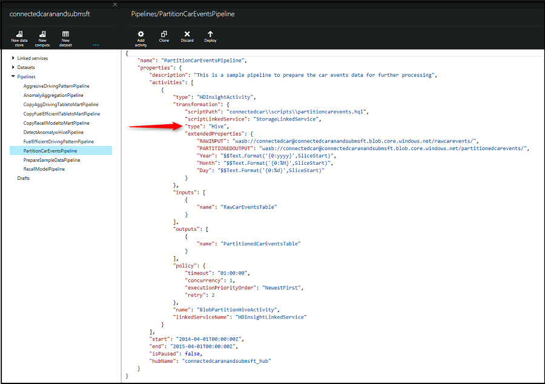
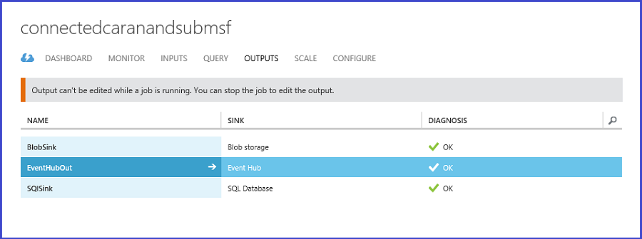
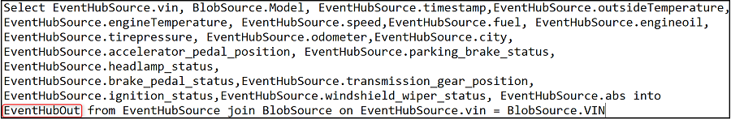
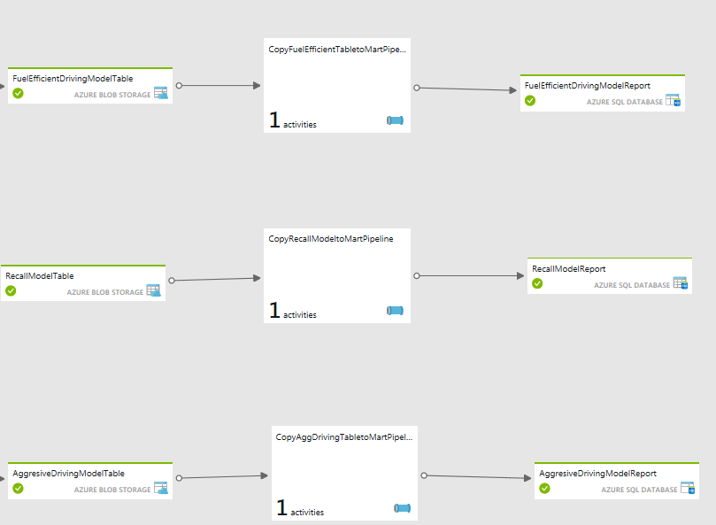
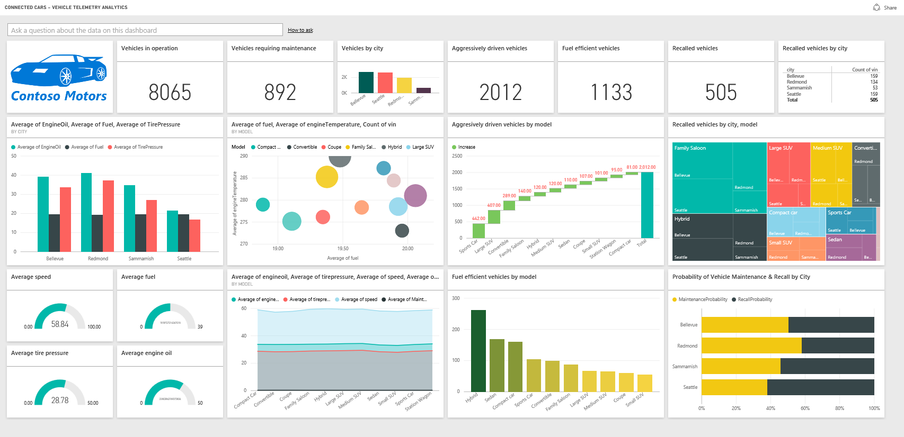

<properties 
    pageTitle="Manuel de solution véhicule télémétrie analytique : approfondie de la solution | Microsoft Azure" 
    description="Utiliser les fonctionnalités d’Intelligence Cortana pour Familiarisez-vous prédictive et en temps réel sur un véhicule santé et conduite habitudes." 
    services="machine-learning" 
    documentationCenter="" 
    authors="bradsev" 
    manager="jhubbard" 
    editor="cgronlun" />

<tags 
    ms.service="machine-learning" 
    ms.workload="data-services" 
    ms.tgt_pltfrm="na" 
    ms.devlang="na" 
    ms.topic="article" 
    ms.date="09/12/2016" 
    ms.author="bradsev" />

# Manuel de solution véhicule télémétrie analytique : approfondie de la solution

Cette **menu** fournit des liens vers les sections de ce manuel : 

[AZURE.INCLUDE [cap-vehicle-telemetry-playbook-selector](../../includes/cap-vehicle-telemetry-playbook-selector.md)]

Extrait de cette section vers le bas dans chacune des étapes représentées dans l’Architecture de Solution avec des instructions et des pointeurs pour la personnalisation. 

## Sources de données

La solution utilise deux différentes sources de données :

- **signaux véhicule simulé et dataset diagnostic** et 
- **catalogue de véhicule**

Un simulator télématique véhicule est inclus dans le cadre de cette solution. Il émet des informations de diagnostic et signale correspondant à l’état du véhicule et au modèle conduite à un moment donné dans le temps. Cliquez sur [Un véhicule télématique Simulator](http://go.microsoft.com/fwlink/?LinkId=717075) pour télécharger la **Solution véhicule télématique Simulator Visual Studio** pour les personnalisations selon vos besoins. Le catalogue de véhicule contient un dataset de référence avec un numéro d’identification au mappage de modèle.

*Figure 2-véhicule télématique Simulator*

Il s’agit d’un jeu de données au format JSON qui contient le schéma suivant.

Colonne | Description | Valeurs 
 ------- | ----------- | --------- 
NUMÉRO D’IDENTIFICATION | Numéro d’Identification généré aléatoirement véhicule | Ceci est obtenu à partir d’une liste principale des numéros d’identification de véhicule généré aléatoirement 10 000.
Température extérieure | La température extérieure où le véhicule est conduite | Numéro généré aléatoirement entre 0 et 100
Température du moteur | La température du moteur de véhicule | Généré aléatoirement comprise entre 0 et 500
Vitesse | La vitesse de rotation placent de véhicule | Numéro généré aléatoirement entre 0 et 100
Carburant | Le niveau de carburant de véhicule | Numéro généré aléatoirement entre 0 et 100 (indique le pourcentage du niveau de carburant)
EngineOil | Le niveau d’Oil mises moteur de véhicule | Numéro généré aléatoirement entre 0 et 100 (indique le pourcentage du niveau d’Oil mises moteur)
Pression pneumatique | La pression pneumatique du véhicule | Numéro généré aléatoirement à partir de 0 à 50 (indique le pourcentage du niveau de pression pneumatique)
Compteur kilométrique | Le compteur kilométrique du véhicule | Numéro généré aléatoirement à partir de 0 200000
Accelerator_pedal_position | La position de la pédale accelerator du véhicule | Numéro généré aléatoirement entre 0 et 100 (indique le pourcentage du niveau d’accelerator)
Parking_brake_status | Indique si le véhicule est mis en garde ou non | Vrai ou faux
Headlamp_status | Indique l’endroit où le projecteur est activé ou non | Vrai ou faux
Brake_pedal_status | Indique si la pédale de frein est activée ou non | Vrai ou faux
Transmission_gear_position | La position d’engrenage transmission de véhicule | États : premier, deuxième, troisième, quatrième, cinquième, sixième, septième, huitième
Ignition_status | Indique si le véhicule est en cours d’exécution ou arrêté | Vrai ou faux
Windshield_wiper_status | Indique si l’essuie-glace est activée ou non | Vrai ou faux
ABS | Indique si ABS est activé ou non | Vrai ou faux
Horodatage | L’horodatage lors de la création du point de données | Date
Ville | L’emplacement du véhicule | 4 villes dans cette solution : Bellevue, Redmond, Sammamish, Seattle

Le dataset de référence du modèle véhicule contient VIN au mappage de modèle. 

NUMÉRO D’IDENTIFICATION | Modèle |
--------------|------------------
FHL3O1SA4IEHB4WU1 | Berline |
8J0U8XCPRGW4Z3NQE | Environnement hybride |
WORG68Z2PLTNZDBI7 | Berline famille |
JTHMYHQTEPP4WBMRN | Berline |
W9FTHG27LZN1YWO0Y | Environnement hybride |
MHTP9N792PHK08WJM | Berline famille |
EI4QXI2AXVQQING4I | Berline |
5KKR2VB4WHQH97PF8 | Environnement hybride |
W9NSZ423XZHAONYXB | Berline famille |
26WJSGHX4MA5ROHNL | Convertible |
GHLUB6ONKMOSI7E77 | Console Wagon |
9C2RHVRVLMEJDBXLP | Petite voiture |
BRNHVMZOUJ6EOCP32 | Petite SUV |
VCYVW0WUZNBTM594J | Voiture de sport |
HNVCE6YFZSA5M82NY | SUV moyenne |
4R30FOR7NUOBL05GJ | Console Wagon |
WYNIIY42VKV6OQS1J | Grande SUV |
8Y5QKG27QET1RBK7I | Grande SUV |
DF6OX2WSRA6511BVG | Coupé |
Z2EOZWZBXAEW3E60T | Berline |
M4TV6IEALD5QDS3IR | Environnement hybride |
VHRA1Y2TGTA84F00H | Berline famille |
R0JAUHT1L1R3BIKI0 | Berline |
9230C202Z60XX84AU | Environnement hybride |
T8DNDN5UDCWL7M72H | Berline famille |
4WPYRUZII5YV7YA42 | Berline |
D1ZVY26UV2BFGHZNO | Environnement hybride |
XUF99EW9OIQOMV7Q7 | Berline famille
8OMCL3LGI7XNCC21U | Convertible |
…….  |   |

### Pour générer des données simulées
1.  Pour télécharger le package simulator de données, cliquez sur la flèche dans le coin supérieur droit du nœud véhicule télématique Simulator. Enregistrer et extraire les fichiers localement sur votre ordinateur. *Figure 3-véhicule télémétrie Analytique Solution plan*

2.  Sur votre ordinateur local, accédez au dossier où vous avez extrait le package véhicule télématique Simulator. *Figure 4 : dossier véhicule télématique Simulator*

3.  Exécutez l’application **CarEventGenerator.exe**.

### Références

[Solution de véhicule télématique Simulator Visual Studio](http://go.microsoft.com/fwlink/?LinkId=717075) 

[Concentrateur événement Azure](https://azure.microsoft.com/services/event-hubs/)

[Données Azure usine](https://azure.microsoft.com/documentation/learning-paths/data-factory/)

## Réception
Combinaisons de Azure événement Hubs, flux Analytique et Data Factory sont optimisées pour les signaux de véhicule, les événements de diagnostic, d’acquisition et en temps réel et par lots analytique. Tous ces composants sont créés et configurés dans le cadre du déploiement de la solution. 

### Analyse en temps réel
Les événements générés par le Simulator télématique véhicule sont publiés dans le Hub de l’événement à l’aide du Kit de développement événement concentrateur. La tâche de flux de données Analytique ingests ces événements à partir du Hub de l’événement et traite les données en temps réel pour analyser l’intégrité véhicule. 

 

*Figure 5 - tableau de bord concentrateur de l’événement*

 

*Figure 6 : traitement des données d’une tâche flux analytique*

La tâche analytique de flux de données ;

- ingests des données à partir du Hub de l’événement 
- effectue une jointure avec les données de référence pour établir une correspondance entre le véhicule VIN au modèle correspondant 
- conserve les dans le stockage blob Azure pour analytique lot enrichi. 

La requête analytique flux suivante permet de conserver les données au stockage d’objets blob Azure. 

 

*Figure 7 : flux analytique travail recherchez la réception de données*

### Analyse par lot
Nous avons également générer un volume supplémentaire de véhicule simulé signaux et diagnostic dataset pour analytique lot plus riche. Cela est nécessaire pour vous assurer un volume de bonnes données représentatives pour le traitement par lots. À cet effet, nous utilisons un pipeline nommé « PrepareSampleDataPipeline » dans le flux de travail Azure Data Factory pour générer année une de véhicule simulé signaux et diagnostic dataset. Cliquez sur [Data Factory une activité personnalisée](http://go.microsoft.com/fwlink/?LinkId=717077) pour télécharger l’activité DotNet Data Factory personnalisée solution Visual Studio pour les personnalisations selon vos besoins. 

 

*Figure 8 : préparer les données d’exemple du flux de travail du traitement par lots*

Le pipeline est constitué par un .net chargeur personnalisé activité, afficher ici :

 

*Figure 9 : PrepareSampleDataPipeline*

Une fois que le pipeline s’exécute correctement et dataset « RawCarEventsTable » est marquée comme « Prêt », un an intéressant de véhicule simulé signaux et de diagnostic données sont produites. Vous consultez le dossier et un fichier créé dans votre compte de stockage sous le conteneur « connectedcar » suivants :

 

*Figure 10 : sortie PrepareSampleDataPipeline*

### Références

[Azure événement concentrateur SDK pour la réception de flux de données](../event-hubs/event-hubs-csharp-ephcs-getstarted.md)

[Fonctionnalités de déplacement de données Data Factory Azure](../data-factory/data-factory-data-movement-activities.md)
[Azure données usine DotNet activité](../data-factory/data-factory-use-custom-activities.md)

[Solution de visual studio Azure données usine DotNet activité de préparation des exemples de données](http://go.microsoft.com/fwlink/?LinkId=717077) 

## Partition le jeu de données

Signaux brut véhicule semi-structurées et dataset diagnostic sont répartis dans l’étape de préparation des données dans un format mois/année. Cette répartition promeut interroger plus efficaces et stockage à long terme scalable en activant sur défaillance de compte un blob à l’autre comme le premier compte saturé. 

>[AZURE.NOTE] Cette étape de la solution s’applique uniquement au traitement par lots.

Entrée et sortie gestion des données de données :

- Les **données de sortie** (intitulée *PartitionedCarEventsTable*) doit être conservé pendant une longue période de temps comme formulaire de données dans le client « données Lake » notions de base / « rawest ». 
- Les **données d’entrée** à ce pipeline serait généralement être supprimé comme les données de sortie contient toujours une fidélité optimale pour l’entrée - il est juste stocké (partition) mieux pour une utilisation ultérieure.

*Figure 11 – flux de travail Partition voiture événements*

Les données brutes sont partition à l’aide d’une activité HDInsight ruche dans « PartitionCarEventsPipeline ». Les données d’exemple générées à l’étape 1 pour une année sont partition par mois/année. Les partitions sont utilisées pour générer un véhicule signaux et les données de diagnostic pour chaque mois (total 12 partitions) d’une année. 

*Figure 12 : PartitionCarEventsPipeline*

Le script Hive suivant, nommé « partitioncarevents.hql » est utilisé pour la partition et se trouve dans le dossier « \demo\src\connectedcar\scripts » de la zip téléchargés. 

    SET hive.exec.dynamic.partition=true;
    SET hive.exec.dynamic.partition.mode = nonstrict;
    set hive.cli.print.header=true;

    DROP TABLE IF EXISTS RawCarEvents; 
    CREATE EXTERNAL TABLE RawCarEvents 
    (
                vin                             string,
                model                           string,
                timestamp                       string,
                outsidetemperature              string,
                enginetemperature               string,
                speed                           string,
                fuel                            string,
                engineoil                       string,
                tirepressure                    string,
                odometer                        string,
                city                            string,
                accelerator_pedal_position      string,
                parking_brake_status            string,
                headlamp_status                 string,
                brake_pedal_status              string,
                transmission_gear_position      string,
                ignition_status                 string,
                windshield_wiper_status         string,
                abs                             string,
                gendate                         string
                
    ) ROW FORMAT DELIMITED FIELDS TERMINATED BY ',' LINES TERMINATED BY '10' STORED AS TEXTFILE LOCATION '${hiveconf:RAWINPUT}'; 

    DROP TABLE IF EXISTS PartitionedCarEvents; 
    CREATE EXTERNAL TABLE PartitionedCarEvents 
    (
                vin                             string,
                model                           string,
                timestamp                       string,
                outsidetemperature              string,
                enginetemperature               string,
                speed                           string,
                fuel                            string,
                engineoil                       string,
                tirepressure                    string,
                odometer                        string,
                city                            string,
                accelerator_pedal_position      string,
                parking_brake_status            string,
                headlamp_status                 string,
                brake_pedal_status              string,
                transmission_gear_position      string,
                ignition_status                 string,
                windshield_wiper_status         string,
                abs                             string,
                gendate                         string
    ) partitioned by (YearNo int, MonthNo int) ROW FORMAT DELIMITED FIELDS TERMINATED BY ',' LINES TERMINATED BY '10' STORED AS TEXTFILE LOCATION '${hiveconf:PARTITIONEDOUTPUT}';

    DROP TABLE IF EXISTS Stage_RawCarEvents; 
    CREATE TABLE IF NOT EXISTS Stage_RawCarEvents 
    (
                vin                             string,
                model                           string,
                timestamp                       string,
                outsidetemperature              string,
                enginetemperature               string,
                speed                           string,
                fuel                            string,
                engineoil                       string,
                tirepressure                    string,
                odometer                        string,
                city                            string,
                accelerator_pedal_position      string,
                parking_brake_status            string,
                headlamp_status                 string,
                brake_pedal_status              string,
                transmission_gear_position      string,
                ignition_status                 string,
                windshield_wiper_status         string,
                abs                             string,
                gendate                         string,
                YearNo                          int,
                MonthNo                         int) 
    ROW FORMAT delimited fields terminated by ',' LINES TERMINATED BY '10';

    INSERT OVERWRITE TABLE Stage_RawCarEvents
    SELECT
        vin,            
        model,
        timestamp,
        outsidetemperature,
        enginetemperature,
        speed,
        fuel,
        engineoil,
        tirepressure,
        odometer,
        city,
        accelerator_pedal_position,
        parking_brake_status,
        headlamp_status,
        brake_pedal_status,
        transmission_gear_position,
        ignition_status,
        windshield_wiper_status,
        abs,
        gendate,
        Year(gendate),
        Month(gendate)

    FROM RawCarEvents WHERE Year(gendate) = ${hiveconf:Year} AND Month(gendate) = ${hiveconf:Month}; 

    INSERT OVERWRITE TABLE PartitionedCarEvents PARTITION(YearNo, MonthNo) 
    SELECT
        vin,            
        model,
        timestamp,
        outsidetemperature,
        enginetemperature,
        speed,
        fuel,
        engineoil,
        tirepressure,
        odometer,
        city,
        accelerator_pedal_position,
        parking_brake_status,
        headlamp_status,
        brake_pedal_status,
        transmission_gear_position,
        ignition_status,
        windshield_wiper_status,
        abs,
        gendate,
        YearNo,
        MonthNo
    FROM Stage_RawCarEvents WHERE YearNo = ${hiveconf:Year} AND MonthNo = ${hiveconf:Month};

*Figure 13 : Hive PartitionConnectedCarEvents Script*

Une fois que le pipeline est exécuté avec succès, vous voyez les partitions suivantes générées dans votre compte de stockage sous le conteneur « connectedcar ».

*Figure 14 : sortie partitionnée*

Les données a été optimisé, est plus facile à gérer et prêt pour un traitement approfondi pour Familiarisez-vous lot enrichi. 

## Analyse des données

Dans cette section, vous allez apprendre à combiner Azure flux Analytique, apprentissage automatique Azure, Azure Data Factory et Azure HDInsight pour enrichi avancées analytique sur état véhicule et conduite habitudes. Il existe trois sous-sections ici :

1.  **Apprentissage automatique**: cette section contient des informations sur l’expérience de détection des anomalies que nous avons utilisé dans cette solution pour prévoir des véhicules nécessitant la maintenance maintenance et nécessitant des rappels en raison de problèmes de sécurité.
2.  **Analyse en temps réel**: cette section contient des informations concernant l’analytique en temps réel à l’aide du langage de requête Analytique flux et à mettre en application l’expérience d’apprentissage automatique en temps réel à l’aide d’une application personnalisée.
3.  **Analyse du lot**: cette section contient des informations sur la transformation et traitement des données par lots à l’aide de Azure HDInsight et apprentissage automatique Azure operationalized par Azure Data Factory.

### Apprentissage automatique

Notre objectif ici est de prédire véhicules nécessitant maintenance ou en fonction de certaines statistiques du bon fonctionnement de rappel. Garantie les hypothèses suivantes

- Si un des trois conditions suivantes est remplie, les véhicules requièrent **maintenance maintenance**:
    - La pression pneumatique est bas
    - Moteur oil mises niveau est faible
    - Température du moteur est élevé

- Si une des conditions suivantes est remplie, véhicules peuvent avoir un **problème de sécurité** et nécessitent **rappel**:
    - Température du moteur est élevé, mais température extérieure est faible
    - Température du moteur est faible mais température extérieure est élevé

Selon les conditions précédentes, nous avons créé deux modèles séparés pour détecter les anomalies, une pour détection de maintenance véhicule et l’autre pour la détection de rappel d’un véhicule. Dans les deux ces modèles, l’algorithme Principal composant analyse (Assistant Compatibilité des programmes) intégrée est utilisé pour détecter une anomalie. 

**Modèle de détection de maintenance**

Si un des trois indicateurs - la pression pneumatique, oil mises moteur ou température moteur - satisfait à son état respectif, le modèle de détection de maintenance signale une anomalie. Par conséquent, nous avons besoin uniquement à prendre en considération ces trois variables dans construction du modèle. Dans notre expérience dans l’apprentissage automatique Azure, nous avons d’abord utiliser un module de **Sélectionner des colonnes dans le jeu de données** pour extraire ces trois variables. Nous utilisons ensuite le module de détection des anomalies basée sur l’Assistant Compatibilité des programmes pour créer le modèle de détection des anomalies. 

Analyse par composantes principales (Assistant Compatibilité) est une technique établie dans l’apprentissage automatique qui peut être appliqué à la sélection de fonctionnalités, la classification et de détection des anomalies. Assistant Compatibilité convertit un ensemble de cas contenant des variables de corrélation éventuellement, dans une série de valeurs appelé principaux composants. L’idée principale de modélisation basés sur Assistant Compatibilité est aux données de projet sur un espace inférieur dimensionnelles afin que les fonctionnalités et les anomalies peuvent être plus facilement identifiés.
 
Pour chaque nouvelle entrée au modèle de détection, le programme de détection des anomalies calcule d’abord sa projection basée sur les vecteurs propres et puis calcule l’erreur reconstruction centrée réduite. Cette erreur normalisée est le score anomalie. L’erreur est élevée, plus anormale l’instance est. 

Dans le problème de détection de maintenance, chaque enregistrement peut être considéré comme un point dans un espace 3D défini par la pression pneumatique, oil mises moteur et moteur température coordonnées. Pour capturer ces anomalies, nous pouvons projeter les données d’origine dans l’espace 3D sur un espace 2D à l’aide d’Assistant Compatibilité des programmes. Par conséquent, nous définissez le paramètre nombre de composants à utiliser dans l’Assistant Compatibilité des programmes est 2. Ce paramètre s’avère particulièrement important dans l’application de détection des anomalies basée sur l’Assistant Compatibilité des programmes. Une fois les données projection à l’aide d’Assistant Compatibilité des programmes, nous pouvons identifier ces anomalies plus facilement.

**Rappeler modèle de détection des anomalies** Dans le modèle de détection des anomalies de rappel, nous utilisons les colonnes sélectionnez Dataset et anomalie basée sur l’Assistant Compatibilité modules de détection de façon similaire. Plus précisément, nous avons tout d’abord extraire trois variables - température moteur, température extérieure et la vitesse - l’utilisation du module de **Sélectionner des colonnes dans le jeu de données** . Nous avons également inclure la variable de vitesse dans la mesure où la température du moteur est généralement corrélation à la vitesse. Ensuite, nous utilisons module de détection des anomalies basée sur l’Assistant Compatibilité des programmes pour projeter les données à partir de l’espace 3D sur un espace 2D. Les critères de rappel sont satisfaites et véhicule exige rappel lorsque hautement négatif corrélation entre température moteur et température extérieure. À l’aide d’algorithme de détection des anomalies basée sur l’Assistant Compatibilité des programmes, nous pouvons capturer les anomalies après l’exécution d’Assistant Compatibilité des programmes. 

Lors de l’apprentissage soit modèle, nous avons besoin utiliser des données normales, qui ne nécessitent pas de maintenance ou le rappel en tant que les données d’entrée pour former le modèle de détection des anomalies basée sur l’Assistant Compatibilité des programmes. Dans l’expérience score, nous utilisent le modèle de détection des anomalies formé pour déterminer si le véhicule nécessite maintenance ou le rappel. 

### Analyse en temps réel

La requête SQL d’Analytique flux suivante est utilisée pour obtenir la moyenne de tous les paramètres d’un véhicule important, tels que vitesse véhicule niveau de carburant, température moteur, compteur kilométrique, la pression pneumatique, au niveau de moteur oil mises et d’autres personnes. Les moyennes servent à détecter des anomalies, émettre des alertes et de déterminer les conditions d’intégrité générale des véhicules gérées dans une région spécifique et puis le correspondent aux données démographiques. 

Figure 15 – requête analytique de flux de données pour le traitement en temps réel

Toutes les moyennes sont calculées en fonction d’un TumblingWindow 3 secondes. Nous utilisons TubmlingWindow dans ce cas étant donné que nous avons besoin d’intervalles de temps contigus et non superposés. 

Pour en savoir plus sur toutes les fonctionnalités de « Windowing » dans Azure flux Analytique, cliquez sur [Windowing (Azure flux Analytique)](https://msdn.microsoft.com/library/azure/dn835019.aspx).

**PRÉDICTION en temps réel**

Une application est incluse dans le cadre de la solution à effectuent le modèle d’apprentissage automatique en temps réel. Cette application appelée « RealTimeDashboardApp » est créée et configurée dans le cadre du déploiement de la solution. L’application effectue les opérations suivantes :

1.  Écoute sur une instance de l’événement concentrateur où flux Analytique publie les événements dans un modèle en permanence. *Figure 16 – requête analytique de flux de données pour les données de publication à une sortie instance concentrateur de l’événement* 

2.  Pour tous les événements qui reçoit cette application : 

    - Traite les données à l’aide de point de terminaison Machine apprentissage requête-réponse score (a). Le point de terminaison enregistrements est automatiquement publié dans le cadre du déploiement.
    - La sortie d’enregistrements de ressource est publiée sur un jeu de données PowerBI à l’aide de l’API push.

Ce modèle est également applicable aux scénarios dans lesquels vous voulez intégrer une application métier (métier) avec le flux analytique en temps réel, pour les scénarios tels que les alertes, les notifications et la messagerie.

Cliquez sur [RealtimeDashboardApp télécharger](http://go.microsoft.com/fwlink/?LinkId=717078) pour télécharger la solution RealtimeDashboardApp Visual Studio pour les personnalisations. 

**Pour exécuter l’Application de tableau de bord en temps réel**

1.  Cliquez sur le nœud PowerBI dans la vue de diagramme, puis cliquez sur le lien « Télécharger une Application en temps réel du tableau de bord » dans le volet de propriétés. *Figure 17 – PowerBI instructions de configuration du tableau de bord*
2.  Extraire et enregistrer localement  *Figure 18 – RealtimeDashboardApp dossier*
3.  Exécuter l’application RealtimeDashboardApp.exe
4.  Fournir des informations d’identification de Power BI valides, se connecter et cliquez sur Accepter  

*Figure 19 – RealtimeDashboardApp : Connectez-vous à PowerBI*

>[AZURE.NOTE] Si vous voulez vider le dataset PowerBI, exécutez la RealtimeDashboardApp avec le paramètre « flushdata » : 

    RealtimeDashboardApp.exe -flushdata

### Analyse par lot

L’objectif consiste à afficher comment Contoso auto utilise les fonctionnalités de cluster Azure pour exploiter les données volumineuses pour Familiarisez-vous enrichis sur la conduite motif, le comportement de l’utilisation et la santé véhicule. Cela permet de :

- Améliorer l’expérience client et le rendre plus économique en fournissant des perspectives habitudes et comportements conduite efficace carburant de conduite
- Découvrez le fait les clients et leurs connues conduites régissent des décisions commerciales, fournir les meilleurs produits et services

Dans cette solution, nous prévoyons les mesures suivantes :

1.  **Comportement conduite agressif**: identifie la tendance de la modèles, emplacements, conduite conditions et l’heure de l’année pour obtenir des informations sur les modèles de conduite agressifs. Moteurs de Contoso peuvent utiliser ces informations pour les campagnes marketing, tirant parti des nouvelles fonctionnalités personnalisées et assurance basée sur l’utilisation.
2.  **Comportement de conduite efficace carburant**: identifie la tendance de la modèles, emplacements, conduite conditions et l’heure de l’année pour obtenir des informations sur les modèles de conduite efficace carburant. Moteurs de Contoso peuvent utiliser ces informations pour campagnes marketing au volant de nouvelles fonctionnalités et reporting proactive pour les pilotes de coûts effet et environnement habitudes conduites conviviales. 
3.  **Rappeler modèles**: identifie les modèles nécessitant des rappels par l’ordinateur de détection des anomalies expérience d’apprentissage à mettre en application

Nous allons examiner les détails de chacune de ces métriques

**Motif de conduite agressif**

Signaux véhicule partitionnée et données de diagnostic sont traitées dans le pipeline nommé « AggresiveDrivingPatternPipeline » qui s’utilisant Hive pour déterminer les modèles, emplacement, véhicule, conditions de conduite et d’autres paramètres qui présente un motif de conduite agressif.

 
*La figure 20 – agressif au volant de flux de travail de motif*

Le script Hive nommé « aggresivedriving.hql » utilisés pour l’analyse agressif motif condition conduite se trouve dans le dossier « \demo\src\connectedcar\scripts » de la zip téléchargé. 

    DROP TABLE IF EXISTS PartitionedCarEvents; 
    CREATE EXTERNAL TABLE PartitionedCarEvents
    (
                vin                             string,
                model                           string,
                timestamp                       string,
                outsidetemperature              string,
                enginetemperature               string,
                speed                           string,
                fuel                            string,
                engineoil                       string,
                tirepressure                    string,
                odometer                        string,
                city                            string,
                accelerator_pedal_position      string,
                parking_brake_status            string,
                headlamp_status                 string,
                brake_pedal_status              string,
                transmission_gear_position      string,
                ignition_status                 string,
                windshield_wiper_status         string,
                abs                             string,
                gendate                         string
                                
    ) ROW FORMAT DELIMITED FIELDS TERMINATED BY ',' LINES TERMINATED BY '10' STORED AS TEXTFILE LOCATION '${hiveconf:PARTITIONEDINPUT}';

    DROP TABLE IF EXISTS CarEventsAggresive; 
    CREATE EXTERNAL TABLE CarEventsAggresive
    (
                vin                         string, 
                model                       string,
                timestamp                   string,
                city                        string,
                speed                       string,
                transmission_gear_position  string,
                brake_pedal_status          string,
                Year                        string,
                Month                       string
                                
    ) ROW FORMAT DELIMITED FIELDS TERMINATED BY ',' LINES TERMINATED BY '10' STORED AS TEXTFILE LOCATION '${hiveconf:AGGRESIVEOUTPUT}';

    INSERT OVERWRITE TABLE CarEventsAggresive
    select
    vin,
    model,
    timestamp,
    city,
    speed,
    transmission_gear_position,
    brake_pedal_status,
    "${hiveconf:Year}" as Year,
    "${hiveconf:Month}" as Month
    from PartitionedCarEvents
    where transmission_gear_position IN ('fourth', 'fifth', 'sixth', 'seventh', 'eight') AND brake_pedal_status = '1' AND speed >= '50'

*Figure 21 – agressif conduite requête Hive de motif*

Il utilise la combinaison de transmission ENGRENAGE position, état pédale frein et la vitesse du véhicule pour détecter reckless/agressif comportement conduite en fonction de freinage motif à haut débit. 

Une fois que le pipeline est exécuté avec succès, vous voyez les partitions suivantes générées dans votre compte de stockage sous le conteneur « connectedcar ».

 

*Figure 22 – sortie AggressiveDrivingPatternPipeline*

**Motif de conduite efficace carburant**

Signaux véhicule partitionnée et données de diagnostic sont traitées dans le pipeline nommé « FuelEfficientDrivingPatternPipeline ». Hive est utilisée pour déterminer les modèles, emplacement, véhicule, conditions de conduite et d’autres propriétés qui présentent motif conduite efficace carburant.

 

*Figure 23 – carburant efficace conduite motif du flux de travail*

Le script Hive nommé « fuelefficientdriving.hql » utilisés pour l’analyse agressif motif condition conduite se trouve dans le dossier « \demo\src\connectedcar\scripts » de la zip téléchargé. 

    DROP TABLE IF EXISTS PartitionedCarEvents; 
    CREATE EXTERNAL TABLE PartitionedCarEvents
    (
                vin                             string,
                model                           string,
                timestamp                       string,
                outsidetemperature              string,
                enginetemperature               string,
                speed                           string,
                fuel                            string,
                engineoil                       string,
                tirepressure                    string,
                odometer                        string,
                city                            string,
                accelerator_pedal_position      string,
                parking_brake_status            string,
                headlamp_status                 string,
                brake_pedal_status              string,
                transmission_gear_position      string,
                ignition_status                 string,
                windshield_wiper_status         string,
                abs                             string,
                gendate                         string
                                
    ) ROW FORMAT DELIMITED FIELDS TERMINATED BY ',' LINES TERMINATED BY '10' STORED AS TEXTFILE LOCATION '${hiveconf:PARTITIONEDINPUT}';

    DROP TABLE IF EXISTS FuelEfficientDriving; 
    CREATE EXTERNAL TABLE FuelEfficientDriving
    (
                vin                         string, 
                model                       string,
                city                        string,
                speed                       string,
                transmission_gear_position  string,                
                brake_pedal_status          string,            
                accelerator_pedal_position  string,                             
                Year                        string,
                Month                       string
                                
    ) ROW FORMAT DELIMITED FIELDS TERMINATED BY ',' LINES TERMINATED BY '10' STORED AS TEXTFILE LOCATION '${hiveconf:FUELEFFICIENTOUTPUT}';

    INSERT OVERWRITE TABLE FuelEfficientDriving
    select
    vin,
    model,
    city,
    speed,
    transmission_gear_position,
    brake_pedal_status,
    accelerator_pedal_position,
    "${hiveconf:Year}" as Year,
    "${hiveconf:Month}" as Month
    from PartitionedCarEvents
    where transmission_gear_position IN ('fourth', 'fifth', 'sixth', 'seventh', 'eight') AND parking_brake_status = '0' AND brake_pedal_status = '0' AND speed <= '60' AND accelerator_pedal_position >= '50'

*Figure 24 – efficace conduite requête de Hive motif carburant*

Il utilise la combinaison de position d’ENGRENAGE transmission du véhicule, état pédale frein, la vitesse et accelerator pédale position pour détecter des carburant efficace conduite en fonction de l’accélération, freinage et accélèrent les modèles. 

Une fois que le pipeline est exécuté avec succès, vous voyez les partitions suivantes générées dans votre compte de stockage sous le conteneur « connectedcar ».

 

*Figure 25 – sortie FuelEfficientDrivingPatternPipeline*

**Rappeler des prédictions**

L’apprentissage expérience de l’ordinateur est mis en service et publié comme un service web dans le cadre du déploiement de la solution. Le lot de point de terminaison de la notation est exploité dans ce flux de travail, enregistré en tant que données usine lié service et operationalized à l’aide de données usine lot notation activité.

 

*La figure 26 – apprentissage point de terminaison de l’ordinateur enregistré comme un service lié dans usine de données*

Utilisation du service lié enregistré dans le DetectAnomalyPipeline pour évaluer les données en utilisant le modèle de détection des anomalies. 

 

*Figure 27 – Azure Machine apprentissage lot notation activité dans usine de données* 

Il existe quelques étapes effectuées dans ce pipeline pour préparer les données afin qu’il peut être operationalized avec le lot de notation de service web. 

 

*Figure 28 – DetectAnomalyPipeline pour la prédiction de véhicules nécessitant des rappels* 

Une fois que le système d’évaluation est terminée, une activité HDInsight est utilisée pour traiter et agréger les données qui sont classés comme anomalies par le modèle avec une probabilité de 0,60 ou une version ultérieure.

    DROP TABLE IF EXISTS CarEventsAnomaly; 
    CREATE EXTERNAL TABLE CarEventsAnomaly 
    (
                vin                         string,
                model                       string,
                gendate                     string,
                outsidetemperature          string,
                enginetemperature           string,
                speed                       string,
                fuel                        string,
                engineoil                   string,
                tirepressure                string,
                odometer                    string,
                city                        string,
                accelerator_pedal_position  string,
                parking_brake_status        string,
                headlamp_status             string,
                brake_pedal_status          string,
                transmission_gear_position  string,
                ignition_status             string,
                windshield_wiper_status     string,
                abs                         string,
                maintenanceLabel            string,
                maintenanceProbability      string,
                RecallLabel                 string,
                RecallProbability           string
                                
    ) ROW FORMAT DELIMITED FIELDS TERMINATED BY ',' LINES TERMINATED BY '10' STORED AS TEXTFILE LOCATION '${hiveconf:ANOMALYOUTPUT}';

    DROP TABLE IF EXISTS RecallModel; 
    CREATE EXTERNAL TABLE RecallModel 
    (

                vin                         string,
                model                       string,
                city                        string,
                outsidetemperature          string,
                enginetemperature           string,
                speed                       string,
                Year                        string,
                Month                       string              
                                
    ) ROW FORMAT DELIMITED FIELDS TERMINATED BY ',' LINES TERMINATED BY '10' STORED AS TEXTFILE LOCATION '${hiveconf:RECALLMODELOUTPUT}';

    INSERT OVERWRITE TABLE RecallModel
    select
    vin,
    model,
    city,
    outsidetemperature,
    enginetemperature,
    speed,
    "${hiveconf:Year}" as Year,
    "${hiveconf:Month}" as Month
    from CarEventsAnomaly
    where RecallLabel = '1' AND RecallProbability >= '0.60'

Une fois que le pipeline est exécuté avec succès, vous voyez les partitions suivantes générées dans votre compte de stockage sous le conteneur « connectedcar ».

 

*La figure 30 – Figure 30 – DetectAnomalyPipeline sortie*

## Publier

### Analyse en temps réel

Une des requêtes dans le travail analytique flux publie les événements vers une sortie instance concentrateur de l’événement. 

*Figure 31 – flux de travail analytique publie vers une sortie instance concentrateur de l’événement*

*Figure 32 – flux analytique de requête pour publier la sortie instance concentrateur de l’événement*

Ce flux d’événements est utilisé par le RealTimeDashboardApp inclus dans la solution. Cette application s’appuie sur le service web Machine apprentissage requête-réponse pour notation en temps réel et publie les données résultantes dans un jeu de données PowerBI à la consommation. 

### Analyse par lot

Les résultats du lot et traitement en temps réel sont publiés dans les tables de base de données SQL Azure pour consommation. Le serveur SQL Azure, base de données et les tables sont automatiquement créés dans le cadre du script d’installation. 

*Figure 33 – copier les résultats dans le flux de travail données mart de traitement par lots*

*Figure 34 – flux de travail analytique publie sur mini-entrepôt*

*Figure 35 – mini-entrepôt définition dans travail analytique de flux de données*

## Consommer

Power BI vous donne cette solution un tableau de bord riche des données en temps réel et visualisations prédictive analytique. 

Cliquez ici pour obtenir des instructions détaillées sur la configuration de tableau de bord et les rapports PowerBI. Le tableau de bord final ressemble à ceci :

*Figure 36 - tableau de bord PowerBI*

## Résumé

Ce document contient une exploration détaillée de la Solution véhicule télémétrie Analytique. Cela présente un motif architecture lambda pour en temps réel et par lots analytique avec des prédictions et les actions. Ce modèle s’applique à un large éventail de cas d’utilisation qui requièrent chemin réactif (en temps réel) et analytique froid chemin d’accès (lot). 
