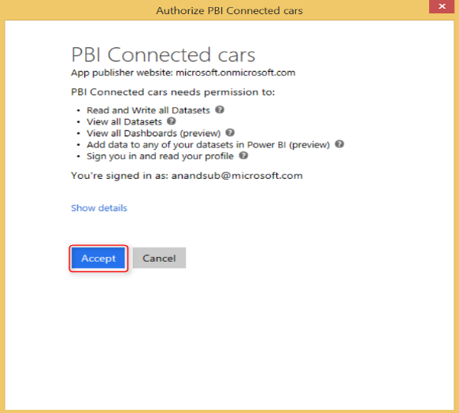
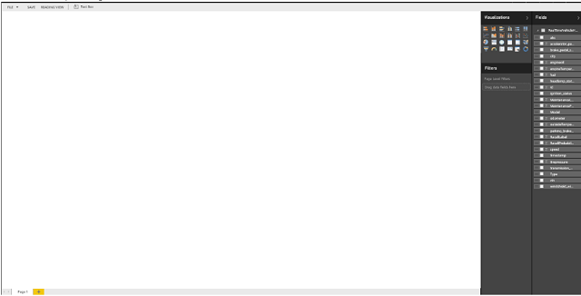
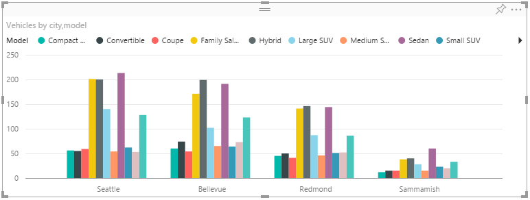
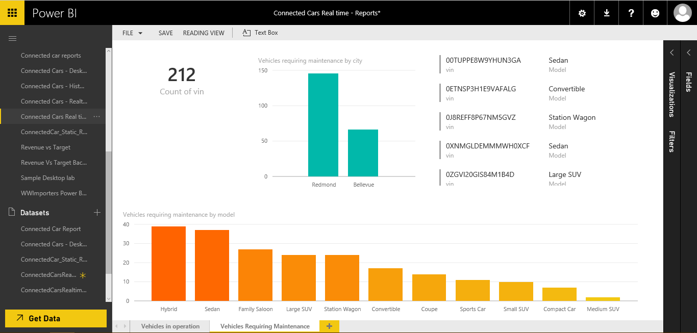
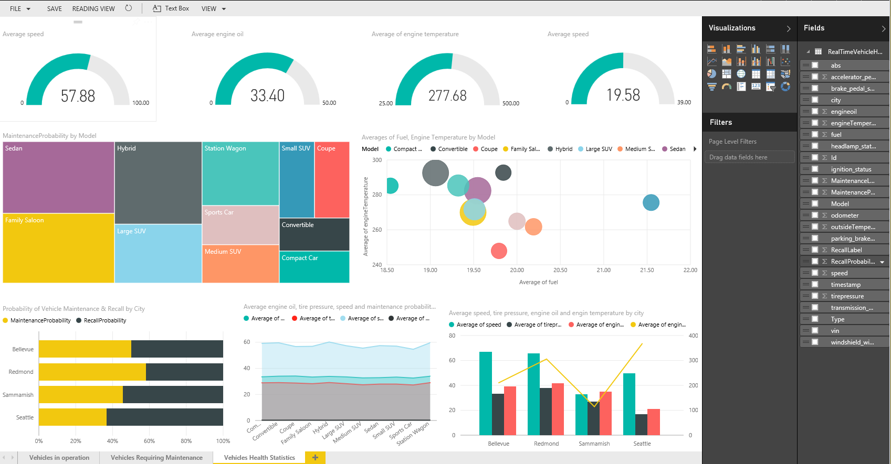
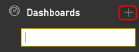
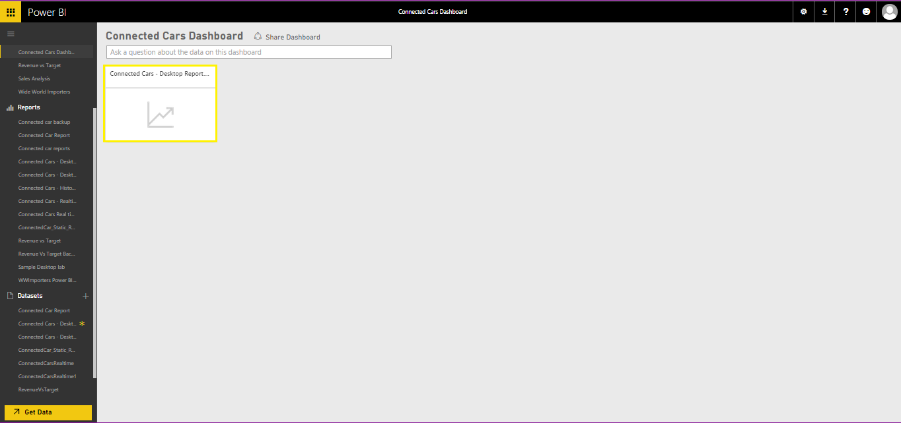
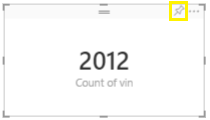
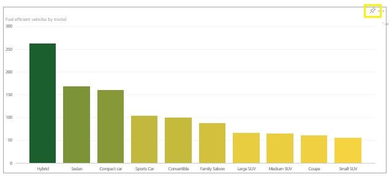
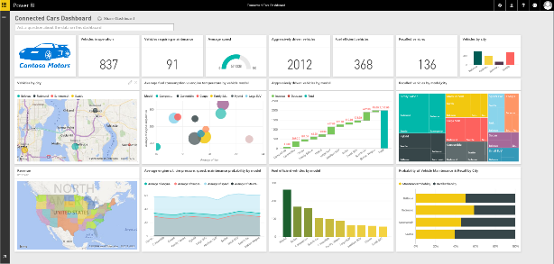

<properties 
    pageTitle="Instructions de configuration du modèle de solution véhicule télémétrie analytique du tableau de bord PowerBI | Microsoft Azure" 
    description="Utiliser les fonctionnalités d’Intelligence Cortana pour Familiarisez-vous prédictive et en temps réel sur un véhicule santé et conduite habitudes." 
    services="machine-learning" 
    documentationCenter="" 
    authors="bradsev" 
    manager="jhubbard" 
    editor="cgronlun" />

<tags 
    ms.service="machine-learning" 
    ms.workload="data-services" 
    ms.tgt_pltfrm="na" 
    ms.devlang="na" 
    ms.topic="article" 
    ms.date="09/12/2016" 
    ms.author="bradsev" />

# Instructions de configuration du tableau de bord PowerBI de modèle véhicule télémétrie analytique solution

Cette **menu** fournit des liens vers les chapitres de ce manuel. 

[AZURE.INCLUDE [cap-vehicle-telemetry-playbook-selector](../../includes/cap-vehicle-telemetry-playbook-selector.md)]

La solution véhicule télémétrie Analytique présente comment concessionnaires voiture, voiture fabricants et compagnies d’assurance peuvent exploiter les capacités d’Intelligence Cortana pour Familiarisez-vous prédictive et en temps réel sur état véhicule et rencontrez habitudes conduites d’apporter des améliorations dans la zone du client, R & D et campagnes marketing. Ce document contient des instructions étape par étape comment vous pouvez configurer le tableau de bord et rapports PowerBI une fois que la solution est déployée dans votre abonnement. 

## Conditions préalables
1.  Déployer la solution véhicule télémétrie Analytique en accédant à [https://gallery.cortanaanalytics.com/SolutionTemplate/Vehicle-Telemetry-Analytics-3](https://gallery.cortanaanalytics.com/SolutionTemplate/Vehicle-Telemetry-Analytics-3)  
2.  [Installation de Microsoft Power BI Desktop](http://www.microsoft.com/download/details.aspx?id=45331)
3.  Un [abonnement Azure](https://azure.microsoft.com/pricing/free-trial/). Si vous n’avez un abonnement Azure, prise en main avec abonnement gratuit Azure
4.  Compte Microsoft PowerBI
    

## Composants de la Suite Intelligence Cortana
Dans le cadre du modèle de solution véhicule télémétrie Analytique, les services de Cortana Intelligence suivants sont déployés dans votre abonnement.

- **Événement Hubs** pour traiter les millions d’événements de télémétrie véhicule dans Azure.
- **Flux analytique**s pour obtenir des idées en temps réel sur état véhicule et persiste ces données dans un espace de stockage à long terme pour analytique lot plus riche.
- **Apprentissage automatique** pour détecter une anomalie en temps réel et traitement par lots à Familiarisez-vous prédictive.
- **HDInsight** est exploité pour transformer les données à l’échelle
- **Data Factory** gère orchestration, planification, gestion des ressources et de surveillance du pipeline de traitement par lots.

**Power BI** vous donne cette solution un tableau de bord riche des données en temps réel et visualisations prédictive analytique. 

La solution utilise deux différentes sources de données : **signaux véhicule simulé et dataset diagnostic** et **véhicule catalogue**.

Un simulator télématique véhicule est inclus dans le cadre de cette solution. Il émet des informations de diagnostic et signale correspondant à l’état du véhicule et conduite motif à un moment donné dans le temps. 

Le catalogue de véhicule est un VIN référence dataset contenant au mappage de modèle

## Préparation d’un tableau de bord PowerBI

### Déploiement

Une fois le déploiement est terminé, vous devriez voir le diagramme suivant avec tous ces composants marqués en vert. 

- Pour accéder aux services correspondantes pour vérifier si tous ces éléments ont déployé avec succès, cliquez sur la flèche dans le coin supérieur droit des nœuds verts.
- Pour télécharger le package simulator de données, cliquez sur la flèche dans le coin supérieur droit sur le nœud de **Véhicule télématique Simulator** . Enregistrer et extraire les fichiers localement sur votre ordinateur. 

À présent, vous êtes prêt à configurer le tableau de bord PowerBI avec des visualisations enrichies pour obtenir en temps réel et analyse prédictive véhicule santé et conduite habituelles. Il permet d’accéder à une heure pour créer tous les rapports et configurer le tableau de bord environ 45 minutes. 

### Le programme d’installation Power BI tableau de bord en temps réel

**Générer des données simulées**

1. Sur votre ordinateur local, accédez au dossier où vous avez extrait le package véhicule télématique Simulator
2.  Exécutez l’application ***CarEventGenerator.exe***.
3.  Il émet des informations de diagnostic et signale correspondant à l’état du véhicule et conduite motif à un moment donné dans le temps. Ceci est publié sur une instance Azure événement concentrateur qui est configurée dans le cadre de votre déploiement.

     
**Démarrez l’application de tableau de bord en temps réel**

La solution inclut une application génère un tableau de bord en temps réel dans PowerBI. Cette application est à l’écoute sur une instance événement concentrateur, à partir de laquelle flux Analytique publie les événements en permanence. Pour tous les événements qui reçoit cette application, il traite les données à l’aide d’un point de terminaison score Machine apprentissage requête-réponse. Le jeu de données qui en résulte est publié sur la diffusion PowerBI API pour visualisation. 

Pour télécharger l’application :

1.  Cliquez sur le nœud PowerBI dans la vue de diagramme et cliquez sur l' **Application de tableau de bord en temps réel télécharger**' lien dans le volet de propriétés.
2.  Extraire et enregistrez l’application localement

3.  Exécuter l’application **RealtimeDashboardApp.exe**
4.  Fournir des informations d’identification de Power BI valides, se connecter et cliquez sur **Accepter**
    
    
    
    

### Configurer des rapports PowerBI
Tableau de bord et les rapports en temps réel prennent environ 30 à 45 minutes. Accédez à [http://powerbi.com](http://powerbi.com) et de la connexion.

Un nouveau groupe de données est généré dans Power BI. Cliquez sur le dataset **ConnectedCarsRealtime** .

Enregistrez le rapport vide à l’aide de **Ctrl + s**.

Fournir *des rapports en temps réel d’un véhicule télémétrie Analytique -*nom de l’état.

## Rapports en temps réel
Il existe trois rapports en temps réel dans cette solution :

1.  Véhicules dans opération
2.  Véhicules nécessiter de Maintenance
3.  Statistiques d’intégrité de véhicules

Vous pouvez choisir de configurer tous les rapports en temps réel trois ou arrêter après chaque étape et passez à la section suivante de la configuration des rapports lot. Nous vous recommandons de créer les trois rapports pour visualiser l’analyse complète le chemin d’accès en temps réel de la solution.  

### 1. opération véhicules
  
Double-cliquez sur la **Page 1** et renommez-le « Véhicules dans opération »  
      

Champ **vin** à partir des **champs** , sélectionnez type de visualisation sous la forme **« Carte »**.  

Visualisation de carte est créée comme illustré ci-dessous.  
    

Cliquez sur la zone vide pour ajouter la nouvelle visualisation.  

Sélectionner une **Ville** et le **numéro d’identification** des champs. Modifier la visualisation à **« Plan »**. Faites glisser **vin** dans la zone valeurs. Faites glisser **Ville** à partir des champs vers la zone de **légende** .   
    
  
Sélectionnez la section **format** de **visualisations**, cliquez sur **titre** et remplacez le **texte** **« Véhicules dans opération par ville »**.  
       

Visualisation finale recherche comme illustré ci-dessous.    
    

Cliquez sur la zone vide pour ajouter la nouvelle visualisation.  

Sélectionnez la **Ville** et **vin**, modifier le type de visualisation en **Histogramme groupé**. Vérifiez le champ **Ville** dans **la zone axe** et **vin** dans la **zone valeur**  

Trier graphique par **« Nombre vin »**  
      

Modifier le **titre** de graphique pour **« Opération par ville des véhicules »**  

Cliquez sur la section **Format** , puis sélectionnez les **Couleurs de données**, cliquez sur la **« Sous »** pour **Afficher tout**  
      

Modifier la couleur de ville individuel en cliquant sur l’icône de couleur.  
      

Cliquez sur la zone vide pour ajouter la nouvelle visualisation.  

Sélectionnez **Histogramme groupé** visualisation de visualisations, faites glisser le champ **ville** dans la zone **axe** , **modèle** dans la zone de **légende** et **vin** dans la zone **valeur** .  
      
    
  
Réorganiser tous les visualisation sur cette page comme illustré ci-dessous.  
    

Vous avez correctement configuré le rapport en temps réel « Véhicules dans opération ». Vous pouvez procéder à créer le rapport en temps réel suivant ou arrêter ici et configurer le tableau de bord. 

### 2. véhicules nécessiter de Maintenance
  
Cliquez sur  pour ajouter un nouveau rapport, renommez-le **« véhicules nécessitant la Maintenance »**

  

Sélectionnez champ **vin** et modifier le type de visualisation en **carte**.  
      

Nous avons un champ nommé « MaintenanceLabel » dans le groupe de données. Ce champ peut avoir une valeur de « 0 » ou « 1 ». » Il est défini par le modèle d’apprentissage automatique Azure sa mise en service dans le cadre de la solution et intégré avec le chemin d’accès en temps réel. La valeur « 1 » indique un véhicule nécessite de maintenance. 

Pour ajouter un filtre de **Niveau de la Page** pour afficher des données de véhicules, qui sont nécessiter de maintenance : 

1. Faites glisser le champ **« MaintenanceLabel »** dans **Les filtres au niveau de Page**.  
  

2. Cliquez sur menu présenter en bas du filtre de niveau MaintenanceLabel pages de **Filtrage de base** .  
  

3.  Définissez sa valeur de filtre sur **« 1 »**    
  

Cliquez sur la zone vide pour ajouter la nouvelle visualisation.  

Sélectionnez **Histogramme groupé** de visualisations  
  

Faites glisser le champ **modèle** dans la zone **axe** , **Vin** à la zone **valeur** . Trier ensuite la visualisation en fonction **du nombre de vin**.  Modifier le **titre** de graphique **«** véhicules nécessiter de maintenance par modèle »  

Faites glisser les champs de **vin** **Saturation des couleurs** de présenter en **champs**  section de l’onglet de **visualisation**  
  

Modifier les **Couleurs de données** dans des visualisations à partir de la section **Format**  
Modifier la couleur Minimum : **F2C812**  
Modifier la couleur Maximum : **FF6300**  
  
  

Cliquez sur la zone vide pour ajouter la nouvelle visualisation.  

Sélectionnez le **graphique en histogrammes groupées** de visualisations, faites glisser **vin** champ dans la zone **valeur** , faites glisser le champ **Ville** dans la zone **axe** . Triez graphique par **« Nombre vin »**. Modifier le **titre** de graphique **«** véhicules nécessiter de maintenance par ville »   
  

Cliquez sur la zone vide pour ajouter la nouvelle visualisation.  

Sélectionnez visualisation de **Carte de plusieurs lignes** de visualisations, faites glisser **modèle** et **vin** dans la zone **champs** .  
    

Réorganisation tous de la visualisation, le rapport final se présente comme suit :  
  

Vous avez correctement configuré le rapport en temps réel « Véhicules nécessitant la Maintenance ». Vous pouvez procéder à créer le rapport en temps réel suivant ou arrêter ici et configurer le tableau de bord. 

### 3. statistiques de la santé véhicules
  
Cliquez sur  pour ajouter un nouveau rapport, renommez-le **« véhicules santé statistiques »**  

Sélectionnez **jauge** visualisation de visualisations, puis faites glisser le champ **vitesse** dans les zones **valeur, valeur minimale, valeur maximale** .  
  

Modifier l’agrégation par défaut de **vitesse** dans la **zone valeur** en **moyenne** 

Modifier l’agrégation par défaut de **vitesse** dans la **zone Minimum** au **Minimum**

Modifier l’agrégation par défaut de **vitesse** dans la **zone Maximum** sur **Maximum**

  

Renommez le **Titre du gabarit** **« Vitesse moyenne »** 
 
  

Cliquez sur la zone vide pour ajouter la nouvelle visualisation.  

De même ajouter un **indicateur** pour **oil mises moteur moyenne**, **moyenne de carburant**et **moteur moyenne tempérée**.  

Modifier l’agrégation par défaut des champs dans chaque jauge comme indiqué ci-dessus procédure dans **« Vitesse moyenne »** évaluer.

Cliquez sur la zone vide pour ajouter la nouvelle visualisation.

Sélectionnez **courbes et histogramme groupé** dans visualisations, puis faites glisser le champ **ville** dans l' **Axe partagé**, faites glisser la **vitesse**, **champs tirepressure et engineoil** dans la zone **Valeurs de colonne** , définissez leur type d’agrégation sur **moyenne**. 

Faites glisser le champ **engineTemperature** dans la zone **Valeurs de la ligne** , modifiez le type d’agrégation par **moyenne**. 

Modifier le **titre** de graphique **« vitesse moyenne, la pression pneumatique, oil mises moteur**et température moteur ».  

Cliquez sur la zone vide pour ajouter la nouvelle visualisation.

Sélectionnez **compartimentage** visualisation dans visualisations, faites glisser le champ de **modèle** dans la zone de **groupe** , puis faites glisser le champ **MaintenanceProbability** dans la zone **valeurs** .

Modifier le **titre** de graphique à **« Modèles de véhicule nécessiter de maintenance »**.

Cliquez sur la zone vide pour ajouter la nouvelle visualisation.

Sélectionnez le **graphique à barres empilées 100 %** de visualisation, faites glisser le champ **ville** dans la zone **axe** et faites glisser la **MaintenanceProbability**, **RecallProbability** champs dans la zone **valeur** .

Cliquez sur **Format**, sélectionnez les **Couleurs de données**et définissez la couleur **MaintenanceProbability** avec la valeur **« F2C80F »**.

Modifier le **titre** du graphique **« probabilité de véhicule Maintenance & rappeler par**ville ».

Cliquez sur la zone vide pour ajouter la nouvelle visualisation.

Sélectionnez **Graphique en aires** dans visualisation de visualisations, faites glisser le champ de **modèle** dans la zone **axe** , puis faites glisser les champs **engineOil, tirepressure, la vitesse et MaintenanceProbability** dans la zone **valeurs** . Modifier leur type d’agrégation à **« Moyenne »**. 

Modifier le titre du graphique à **« Moyenne oil mises moteur, pneumatique probabilité pression, la vitesse et maintenance par modèle »**.

Cliquez sur la zone vide pour ajouter la nouvelle visualisation :

1. Sélectionnez visualisation **Graphique en nuages de points** de visualisations.
2. Faites glisser le champ **modèle** dans la zone **Détails** et **légende** .
3. Faites glisser le champ **carburant** dans la zone **axe des abscisses** , modifiez l’agrégation par **moyenne**.
4. Faites glisser **engineTemparature** dans **la zone axe des ordonnées**, modifiez l’agrégation en **moyenne**
5. Faites glisser le champ **vin** dans la zone **taille** .

Modifier le **titre** du graphique pour **« Moyennes du carburant, température moteur par modèle »**.

Le rapport final se présentera comme comme illustré ci-dessous.

### Visualisations de code confidentiel provenant de rapports au tableau de bord en temps réel
  
Créer un tableau de bord vide en cliquant sur l’icône plu en regard de tableaux de bord. Vous pouvez nommer « Bord d’un véhicule télémétrie Analytique »

Épingler la visualisation des rapports ci-dessus au tableau de bord. 
 

Le tableau de bord doit se présenter comme suit lorsque les trois rapports sont créées et les visualisations correspondantes sont épinglées au tableau de bord. Si vous n’avez pas créé tous les rapports, votre tableau de bord peut ressembler différent. 

Félicitations ! Vous avez créé le tableau de bord en temps réel. Lorsque vous continuez à exécuter CarEventGenerator.exe et RealtimeDashboardApp.exe, vous devriez voir live mises à jour dans le tableau de bord. Il doit prendre environ 10 à 15 minutes pour effectuer les étapes suivantes.

 
##  Configuration du tableau de bord Power BI lot traitement

>[AZURE.NOTE] Il faut environ deux heures (à partir de la réussite du déploiement) pour le pipeline de traitement par lots de bout en bout terminer l’exécution et traiter une année de données générées. Attendez ainsi que le traitement se termine avant de passer aux étapes suivantes. 

**Télécharger le fichier du concepteur PowerBI**

-   Un fichier de concepteur PowerBI préconfiguré est inclus dans le cadre du déploiement
-   Cliquez sur le nœud PowerBI dans la vue de diagramme et cliquez sur **Télécharger le fichier du concepteur PowerBI** lien dans le volet Propriétés

-   Enregistrer localement

**Configurer des rapports PowerBI**

-   Ouvrez le fichier concepteur « VehicleTelemetryAnalytics - Report.pbix Bureau » à l’aide de bureau PowerBI. Si vous n’avez pas déjà, installez l’application de bureau PowerBI à partir de [Bureau PowerBI installer](http://www.microsoft.com/download/details.aspx?id=45331). 

-   Cliquez sur **Modifier les requêtes**.

- Double-cliquez sur la **Source**.

- Mettre à jour la chaîne de connexion serveur avec le serveur SQL Azure que vous avez configuré dans le cadre du déploiement. Cliquez sur le nœud SQL Azure sur le diagramme et d’afficher le nom du serveur du volet Propriétés.

- Conservez la **base de données** en tant que *connectedcar*.

- Cliquez sur **OK**.
- Vous verrez **les informations d’identification Windows** onglet sélectionné par défaut, modifiez **les informations d’identification** de la base de données en cliquant sur l’onglet de la **base de données** sur la droite.
- Indiquez le **nom d’utilisateur** et le **mot de passe** de votre base de données SQL Azure qui a été spécifié lors de son installation déploiement.

- Cliquez sur **se connecter**
- Répétez les étapes ci-dessus pour chacune des trois requêtes restants présents au volet de droite, puis mettez à jour les détails de connexion de source de données.
- Cliquez sur **Fermer et charger**. Jeux de données Power BI Desktop fichier est liées aux tables de base de données SQL Azure.
- **Fermer** Fichier de Power BI Desktop.

- Cliquez sur **Enregistrer** pour enregistrer les modifications. 
 
Vous avez configuré tous les rapports correspondant au chemin d’accès de traitement par lots de la solution. 

## Télécharger sur *powerbi.com*
 
1.  Accédez au portail web PowerBI sur http://powerbi.com et connectez-vous.
2.  Cliquez sur **obtenir des données**  
3.  Télécharger Power BI Desktop.  
4.  Pour télécharger, cliquez sur **obtenir des données -> fichiers Get -> fichier Local**  
5.  Accédez à la **« VehicleTelemetryAnalytics – Report.pbix bureau »**  
6.  Une fois que le fichier est téléchargé, vous accédez à votre espace de travail de Power BI.  

Un jeu de données, rapport et un tableau de bord vide est créées pour vous.  
 

Graphiques à épingler au tableau de bord existant **Analytique de bord de télémétrie véhicule** dans **Power BI**. Cliquez sur le tableau de bord vide créé précédemment, puis naviguez vers le clic de la section **rapports** du rapport que vous venez de télécharger.  

 

**Remarque le rapport comprend six pages :**  
Page 1 : Densité de véhicule  
Page 2 : État du véhicule en temps réel  
Page 3 : Véhicules à moteur agressif   
Page 4 : Rappeler véhicules  
Page 5 : Carburant efficacement par l’effort véhicules  
Page 6 : Logo de Contoso  

 

**À partir de Page 3**, code confidentiel ce qui suit :  

1.  Nombre de VIN  
     

2.  Agressif par l’effort véhicules par modèle – graphique en cascade  
    

**À partir de Page 5**, code confidentiel ce qui suit : 
 
1.  Nombre de vin    
      
2.  Carburant véhicules efficaces par modèle : Histogramme groupé  
    

**À partir de Page 4**, code confidentiel ce qui suit :  

1.  Nombre de vin  
     

2.  Modèle de véhicules rappelés par ville, : compartimentage  
      

**À partir de la Page 6**, code confidentiel ce qui suit :  

1.  Logo de moteurs de Contoso  
    

**Organiser le tableau de bord**  

1.  Accédez au tableau de bord
2.  Pointez sur chaque graphique et renommer, selon l’appellation fournies dans l’image du tableau de bord achevé ci-dessous. Également déplacer les graphiques à l’aspect du tableau de bord ci-dessous.  
      
    
3.  Si vous avez créé tous les rapports comme mentionné dans ce document, le tableau de bord finale doit ressembler à l’illustration suivante. 

Félicitations ! Vous avez créé les rapports et le tableau de bord à gagner en temps réel, prédictive et insights véhicule santé et au volant de commandes habituelles.  
