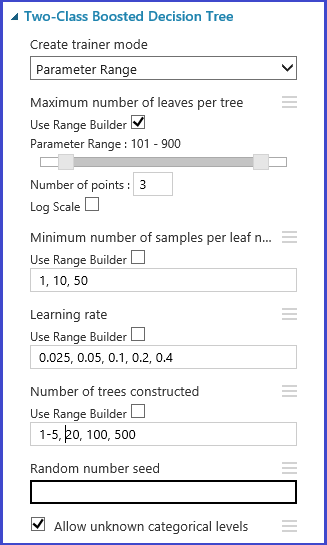

<properties
    pageTitle="Choisissez les paramètres pour optimiser vos algorithmes dans l’apprentissage automatique de Azure | Microsoft Azure"
    description="Explique comment choisir le paramètre optimal pour un algorithme d’apprentissage d’ordinateur Azure."
    services="machine-learning"
    documentationCenter=""
    authors="bradsev"
    manager="jhubbard"
    editor="cgronlun"/>

<tags
    ms.service="machine-learning"
    ms.workload="data-services"
    ms.tgt_pltfrm="na"
    ms.devlang="na"
    ms.topic="article"
    ms.date="09/12/2016"
    ms.author="bradsev" />

# Choisissez les paramètres pour optimiser vos algorithmes dans l’apprentissage automatique de Azure

Cette rubrique décrit comment choisir le droit hyperparameter pour un algorithme d’apprentissage d’ordinateur Azure. La plupart des algorithmes d’apprentissage machine ont des paramètres à définir. Lorsque vous vous formez un modèle, vous devez fournir des valeurs pour ces paramètres. Les paramètres de modèle que vous choisissez dépend de l’efficacité du modèle formé. Le processus de recherche de l’ensemble optimal de paramètres est appelé *sélection du modèle*.

[AZURE.INCLUDE [machine-learning-free-trial](../../includes/machine-learning-free-trial.md)]

Il existe différentes façons de du modèle sélection. Dans l’apprentissage automatique, validation croisée est une des méthodes la plus largement utilisées pour la sélection du modèle, et c’est le mécanisme de sélection de modèle par défaut dans Azure Machine d’apprentissage. Étant donné que la formation de Machine Azure prend en charge à la fois R et les Python, vous pouvez toujours implémenter leurs propres mécanismes de sélection de modèle en utilisant R ou Python.

Il existe quatre étapes dans le processus de recherche du meilleur ensemble de paramètre :

1.  **Définir l’espace de paramètre**: pour l’algorithme, d’abord déterminer les valeurs de paramètre exacte que vous souhaitez prendre en compte.
2.  **Définir la validation croisée des paramètres**: décider comment choisir les plis de validation croisée pour le groupe de données.
3.  **Définir la métrique**: déterminer la signification à utiliser pour déterminer le meilleur ensemble de paramètres, tels l’exactitude, la moyenne de la racine carré erreur, précision, rappel ou f-score.
4.  **Train, évaluer et comparer**: pour chaque combinaison des valeurs de paramètre, validation croisée est effectuée par et en fonction de la métrique d’erreur que vous définissez. Après l’évaluation et la comparaison, vous pouvez choisir le modèle de meilleures performances.

L’image suivante illustre la montre comment ceci peut être réalisé dans l’apprentissage automatique de Azure.

## Définition de l’espace du paramètre
Vous pouvez définir le paramètre défini à l’étape d’initialisation de modèle. Le volet Paramètres de tous les algorithmes d’apprentissage machine possède deux modes de l’instructeur : *Seul paramètre* et le *Paramètre de plage*. Choisissez le mode de la plage de paramètres. En mode de plage de paramètres, vous pouvez entrer plusieurs valeurs pour chaque paramètre. Vous pouvez entrer des valeurs séparées par des virgules dans la zone de texte.

 Alternativement, vous pouvez définir les points maximum et minimum de la grille et le nombre total de points à l’aide **d’Utiliser le Générateur de plage**. Par défaut, les valeurs des paramètres sont générés sur une échelle linéaire. Mais si **l’Échelle logarithmique** est activée, les valeurs sont générées dans l’échelle logarithmique (c'est-à-dire le rapport entre les points adjacents est constante et non de leur différence). Pour les paramètres de nombre entier, vous pouvez définir une plage à l’aide d’un trait d’union. Par exemple, « 10-1 » signifie que tous les entiers compris entre 1 et 10 (tous deux inclus) constituent le jeu de paramètres. Un mode mixte est également pris en charge. Par exemple, le paramètre la valeur « 1-10, 20, 50 » inclurait entiers de 1 à 10, 20 et 50.

## Définir la validation croisée pliures
[Partition et l’exemple] [ partition-and-sample] module peut être utilisé pour affecter au hasard des plis aux données. Dans la configuration d’exemple suivant pour le module, nous définir cinq plis et au hasard affecter un numéro de pliage pour les instances d’exemple.

## Définissez la mesure
Le [Réglage des Hyperparameters de modèle] [ tune-model-hyperparameters] module prend en charge les choix de manière empirique du meilleur ensemble de paramètres pour un algorithme donné et le groupe de données. En plus d’autres informations concernant le modèle, le volet des **Propriétés** de ce module de formation inclut la métrique pour déterminer le meilleur paramètre défini. Il a deux zones de liste différentes pour les algorithmes de classification et de régression, respectivement. Si l’algorithme en question est un algorithme de classification, la mesure de la droite de régression est ignorée et vice versa. Dans cet exemple, la métrique est la **précision**.   

## Former, évaluer et comparer  
La même [Régler des Hyperparameters modèle] [ tune-model-hyperparameters] module exerce tous les modèles qui correspondent à l’ensemble de paramètres, évalue diverses métriques et crée ensuite le modèle le mieux formé selon la métrique que vous choisissez. Ce module comporte deux entrées obligatoires :

* Le stagiaire non formé
* Le groupe de données

Le module dispose également d’un groupe de données facultatif d’entrée. Connectez le groupe de données avec les informations de pliage à l’entrée du groupe de données obligatoires. Si le groupe de données n’est pas affecté les informations de pliage, puis une validation croisée multipliée par 10 est exécutée automatiquement par défaut. Si l’affectation de pliage n’est pas effectuée et un groupe de données de validation est fourni au port facultatif dataset, un mode d’apprentissage-test est sélectionné, puis le premier ensemble de données utilisée pour exercer le modèle pour chaque combinaison de paramètres.

Le modèle est ensuite évalué sur le groupe de validation des données. Le port de sortie gauche du module indique différentes mesures en tant que fonctions des valeurs de paramètre. Le port de sortie droit donne le modèle formé qui correspond au modèle de meilleures performances en fonction de la mesure choisie (**précision** dans ce cas).  

Vous pouvez voir exactement aux paramètres choisis en visualisant le port de sortie de droite. Ce modèle utilisable dans un ensemble test de notation ou dans un service web operationalized après l’enregistrement sous la forme d’un modèle formé.

<!-- Module References -->
[partition-and-sample]: https://msdn.microsoft.com/library/azure/a8726e34-1b3e-4515-b59a-3e4a475654b8/
[tune-model-hyperparameters]: https://msdn.microsoft.com/library/azure/038d91b6-c2f2-42a1-9215-1f2c20ed1b40/
