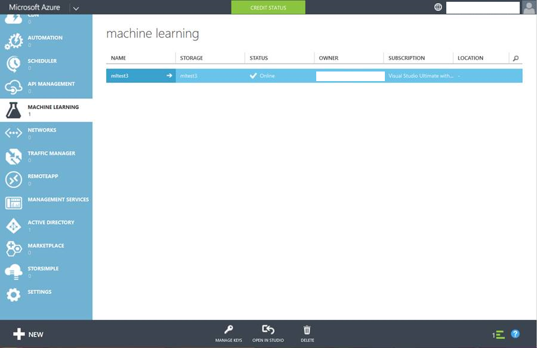
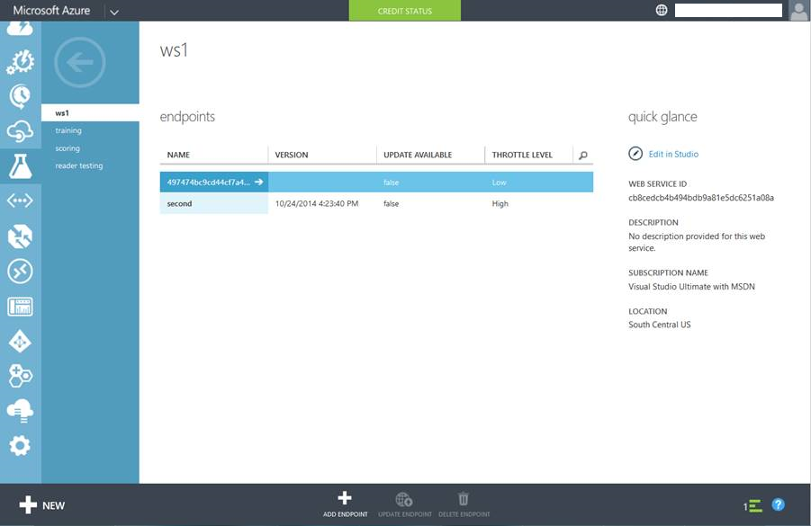

<properties
    pageTitle="Création de points de terminaison de service Web dans l’apprentissage automatique | Microsoft Azure"
    description="Création de points de terminaison de service Web dans l’apprentissage automatique Azure"
    services="machine-learning"
    documentationCenter=""
    authors="hiteshmadan"
    manager="padou"
    editor="cgronlun"/>

<tags
    ms.service="machine-learning"
    ms.devlang="multiple"
    ms.topic="article"
    ms.tgt_pltfrm="na"
    ms.workload="tbd"
    ms.date="10/04/2016"
    ms.author="himad"/>

# Création de points de terminaison

>[AZURE.NOTE] Cette rubrique décrit les techniques applicables à un service Web classique.

Lorsque vous créez des services Web que vous voulez vendre transférer à vos clients, vous devez activer des modèles de formation pour chaque client sont toujours liés à l’expérience à partir de laquelle le service Web a été créé. En outre, les mises à jour à l’expérience doivent être appliqués de manière sélective à un point de terminaison sans remplacer les personnalisations.

Pour ce faire, apprentissage automatique Azure permet de créer plusieurs points de terminaison pour un service Web déployé. Chaque point de terminaison du service Web est indépendamment adressé, limitée et géré. Chaque point de terminaison est une URL unique et la clé d’autorisation que vous pouvez distribuer à vos clients.

[AZURE.INCLUDE [machine-learning-free-trial](../../includes/machine-learning-free-trial.md)]

## Ajout de points de terminaison à un service Web

Il existe trois manières d’ajouter un point de terminaison à un service Web.

* Par programme
* À partir du portail Azure Machine Learning Web Services
* Bien que le portail classique Azure

Une fois que le point de terminaison est créé, vous pouvez consommer via des API synchrone, lot API et feuilles de calcul excel. Outre l’ajout de points de terminaison de cette interface, vous pouvez également utiliser les API de gestion de point de terminaison pour ajouter des points de terminaison par programme.

 >[AZURE.NOTE] Si vous avez ajouté des points de terminaison supplémentaires au service Web, vous ne pouvez pas supprimer le point de terminaison par défaut.

## Ajout d’un point de terminaison par programmation

Vous pouvez ajouter un point de terminaison à votre service Web par programme à l’aide de l’exemple de code [AddEndpoint](https://github.com/raymondlaghaeian/AML_EndpointMgmt/blob/master/Program.cs) .

## Ajout d’un point de terminaison à l’aide du portail Azure Machine Learning Web Services

1. Dans Machine apprentissage Studio, dans la colonne de navigation de gauche, cliquez sur Services Web.
2. En bas du tableau de bord de service Web, cliquez sur **les points de terminaison gérer**. Le portail Azure Machine Learning Services Web s’ouvre à la page points de terminaison du service Web.
3. Cliquez sur **Nouveau**.
4. Tapez un nom et une description pour le nouveau point de terminaison. Les noms de point de terminaison doivent être 24 caractères ou moins de longueur et doivent être composés d’alphabets en minuscules ou des nombres. Sélectionnez le niveau de journalisation et si les exemples de données sont activées. Pour plus d’informations sur la journalisation, voir [Activer la journalisation pour les services Web de formation Machine](machine-learning-web-services-logging.md).

## Ajout d’un point de terminaison à l’aide du portail classique Azure

1. Connectez-vous au [portail classique Azure](http://manage.windowsazure.com), cliquez sur **Apprentissage automatique** dans la colonne de gauche. Cliquez sur l’espace de travail qui contient le service Web qui vous intéresse.

    

2. Cliquez sur **Services Web**.

    

3. Cliquez sur le service Web que qui vous intéresse pour afficher la liste des points de terminaison disponibles.

    

4. Dans la partie inférieure de la page, cliquez sur **Ajouter un point de terminaison**. Tapez un nom et une description, vous assurer qu’aucun autre point de terminaison portant le même nom dans ce service Web. Laissez le niveau de limitation avec sa valeur par défaut, sauf si vous avez des exigences particulières. Pour en savoir plus sur la limitation, voir [Mise à l’échelle d’API de points de terminaison](machine-learning-scaling-webservice.md).

    

## Étapes suivantes

[L’utilisation d’un service Web de formation Azure Machine publié](machine-learning-consume-web-services.md).
