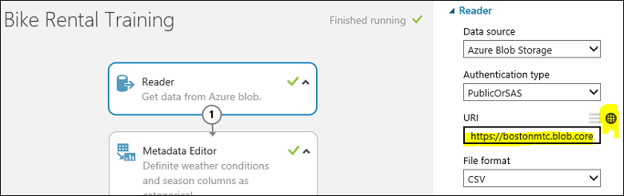
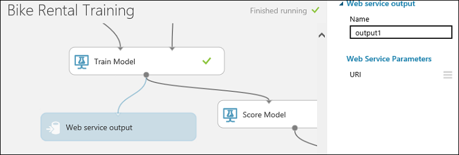

<properties
pageTitle="Créer plusieurs modèles à partir d’une expérience | Microsoft Azure"
description="Utiliser PowerShell pour créer plusieurs modèles d’apprentissage automatique et web points de terminaison de service avec le même algorithme mais formation différent des groupes de données."
services="machine-learning"
documentationCenter=""
authors="hning86"
manager="jhubbard"
editor="cgronlun"/>

<tags
ms.service="machine-learning"
ms.workload="data-services"
ms.tgt_pltfrm="na"
ms.devlang="na"
ms.topic="article"
ms.date="10/03/2016"
ms.author="garye;haining"/>

# Créer de nombreux modèles d’apprentissage automatique et web points de terminaison de service à partir d’une expérience à l’aide de PowerShell

Voici un problème d’apprentissage machine courant : vous voulez créer de nombreux modèles qui ont le même flux de travail de formation et utilisent le même algorithme, mais ont formation différents jeux de données d’entrée. Cet article vous explique comment procéder à l’échelle dans Azure Machine apprentissage Studio à l’aide de simplement une expérience unique.

Par exemple, supposons que vous possédez une entreprise de franchise location vélo global. Vous voulez créer un modèle de régression pour prévoir la demande location basée sur des données historiques. Vous disposez de 1 000 location emplacements dans le monde entier et que vous avez collectées un jeu de données pour chaque emplacement qui inclut des fonctionnalités importantes telles que les date, heure, météo et le trafic qui sont spécifiques à chaque emplacement.

Vous pouvez former votre modèle une fois en utilisant une version fusionnée de tous les jeux de données sur tous les sites. Mais parce que chacune de vos emplacements comporte un environnement unique, une meilleure approche serait former votre modèle de régression séparément en utilisant le jeu de données pour chaque emplacement. De cette façon, chaque modèle formé peut prendre en considération le magasin de différentes tailles, en volume, géographie, population, environnement vélo employez le trafic, *etc.*.

Qui peut être la meilleure approche, mais vous ne voulez pas créer de 1 000 expériences formation dans l’apprentissage automatique Azure avec chacun d'entre eux représentant un emplacement unique. Outre l’une tâche écrasante, il est également semble assez inefficace dans la mesure où chaque expérience aurait les mêmes composants à l’exception du dataset formation.

Peut être effectué en, nous pouvons pour ce faire à l’aide de l' [apprentissage automatique Azure reconversion API](machine-learning-retrain-models-programmatically.md) et d’automatiser la tâche avec [Azure Machine apprentissage PowerShell](machine-learning-powershell-module.md).

> [AZURE.NOTE] Pour que notre exemple s’exécuter plus vite, nous allons réduire le nombre d’emplacements à partir de 1 000 à 10. Mais les mêmes principes et procédures s’appliquent à 1 000 emplacements. La seule différence est que si vous souhaitez former à partir de 1 000 jeux de données vous voudrez probablement réflexion de l’exécution de scripts PowerShell suivants en parallèle. Procédure à suivre est dépasse le cadre de cet article, mais vous pouvez rechercher des exemples de PowerShell multi-thread sur Internet.  

## Configurer l’expérience de formation

Nous allons utiliser un exemple [formation expérimenter](https://gallery.cortanaintelligence.com/Experiment/Bike-Rental-Training-Experiment-1) que nous avons déjà créé dans la [Galerie d’Intelligence Cortana](http://gallery.cortanaintelligence.com). Ouvrez cette expérience dans votre espace de travail [Azure Machine apprentissage Studio](https://studio.azureml.net) .

>[AZURE.NOTE] Pour suivre en même temps que cet exemple, vous souhaiterez peut-être utiliser un espace de travail standard plutôt que dans un espace de travail gratuit. Nous allons créer un point de terminaison pour chaque client - pour un total de 10 points de terminaison - et qui requièrent un espace de travail standard dans la mesure où un espace de travail gratuit est limitée aux 3 points de terminaison. Si vous disposez d’un espace de travail libre, il suffit de modifier les scripts ci-dessous afin de permettre uniquement 3 emplacements.

L’expérience utilise un module **d’Importer des données** pour importer le jeu de données de formation *customer001.csv* à partir d’un compte de stockage Azure. Supposons que nous avons collectées jeux de données de formation de tous les emplacements de location vélo et les stockées dans le même emplacement de stockage blob des noms de fichier comprise entre *rentalloc001.csv* et *rentalloc10.csv*.

Notez qu’un module de **Sortie du Service Web** a été ajouté au **Modèle de Train** module.
Lorsque cette expérience est déployée comme un service web, le point de terminaison associé à que sortie renverra le modèle formé dans le format d’un fichier .ilearner.

Notez également que nous configurer un paramètre du service web pour l’URL qui utilise le module **Importer des données** . Cela permet d’utiliser le paramètre pour spécifier les jeux de données formation individuels pour former le modèle pour chaque emplacement.
Il existe d’autres façons que nous avons effectuées, par exemple à l’aide d’une requête SQL avec un paramètre du service web pour obtenir des données à partir d’une base de données SQL Azure, ou simplement à l’aide d’un module **D’entrée de Service Web** pour passer dans un jeu de données au service web.

À présent, nous allons exécuter cette expérience de formation à l’aide de la valeur de par défaut *rental001.csv* sous la formation de dataset. Si vous affichez le résultat du module **évaluer** (cliquez sur la sortie et sélectionnez **visualiser**), vous pouvez voir la bonne un performances correctes de *AUC* = 0.91. À ce stade, nous sommes prêts à déployer un service web déconnecter cette expérience de formation.

## Déploiement de la formation et notation des services web

Pour déployer le service web de formation, cliquez sur le bouton **Définir le serviceWeb** située sous la zone expérience et sélectionnez **Déployer un Service Web**. Appeler ce service web « « vélo location formation ».

Maintenant, nous avons besoin de déployer le service web score.
Pour ce faire, nous pouvons cliquez sur **Définir le serviceWeb** située sous la zone et sélectionnez **Prédictive Service Web**. Cela crée une expérience score.
Nous devons apporter quelques ajustements secondaires afin qu’elle fonctionne comme un service web, telles que la suppression de la colonne étiquette « cnt » à partir des données d’entrée et de limiter la sortie uniquement l’id de l’instance et les valeurs prédites valeur.

Pour vous faire gagner acceptés, vous pouvez simplement ouvrir l' [expérience prédictive](https://gallery.cortanaintelligence.com/Experiment/Bike-Rental-Predicative-Experiment-1) dans la galerie qui est déjà été préparée.

Pour déployer le service web, exécutez l’expérience prédictive, puis cliquez sur le bouton **Déployer un Service Web** située sous la zone. Nommez le service web notation « Vélo location notation » ».

## Créer des 10 points de terminaison de service web identiques avec PowerShell

Ce service web est fourni avec un point de terminaison par défaut. Mais nous n'intéresse pas comme le point de terminaison par défaut dans la mesure où il ne peut pas être mis à jour. Nous devons consiste à créer 10 extrémités supplémentaires, une pour chaque emplacement. Pour cela, nous allons utiliser PowerShell.

Tout d’abord, nous configurer notre environnement PowerShell :

    Import-Module .\AzureMLPS.dll
    # Assume the default configuration file exists and is properly set to point to the valid Workspace.
    $scoringSvc = Get-AmlWebService | where Name -eq 'Bike Rental Scoring'
    $trainingSvc = Get-AmlWebService | where Name -eq 'Bike Rental Training'

Ensuite, exécutez la commande PowerShell suivante :

    # Create 10 endpoints on the scoring web service.
    For ($i = 1; $i -le 10; $i++){
        $seq = $i.ToString().PadLeft(3, '0');
        $endpointName = 'rentalloc' + $seq;
        Write-Host ('adding endpoint ' + $endpointName + '...')
        Add-AmlWebServiceEndpoint -WebServiceId $scoringSvc.Id -EndpointName $endpointName -Description $endpointName     
    }

Maintenant, nous avons créé 10 points de terminaison et ils sont tous contient le même modèle formé une formation sur *customer001.csv*. Vous pouvez les afficher dans le portail de gestion Azure.

## Mettre à jour les points de terminaison pour utiliser des jeux de données formation distincte à l’aide de PowerShell

L’étape suivante consiste à mettre à jour les points de terminaison avec les modèles de façon unique une formation sur les données individuels de chaque client. Mais tout d’abord, nous devons produire ces modèles à partir du service web **Vélo location formation** . Retournons au service web **Vélo location formation** . Nous devons appeler son point de terminaison BES 10 fois avec 10 jeux de données différents formation pour produire 10 différents modèles. Nous allons utiliser l’applet de commande PowerShell **InovkeAmlWebServiceBESEndpoint** pour effectuer cette action.

Vous devrez également fournir des informations d’identification pour votre compte de stockage blob dans `$configContent`, à savoir, les champs `AccountName`, `AccountKey` et `RelativeLocation`. La `AccountName` peut s’agir de noms de votre compte, comme illustré dans le **Portail de gestion classique Azure** (onglet*stockage* ). Une fois que vous cliquez sur un compte de stockage, son `AccountKey` soient retrouvés en appuyant sur le bouton **Gérer les touches d’accès** dans la partie inférieure et copier le *Principal touche d’accès rapide*. La `RelativeLocation` est le chemin d’accès par rapport à votre espace de stockage à l’emplacement de stockage un nouveau modèle. Par exemple, le chemin d’accès `hai/retrain/bike_rental/` dans le script sous pointe vers un conteneur nommé `hai`, et `/retrain/bike_rental/` des sous-dossiers. Pour l’instant, vous ne pouvez pas créer des sous-dossiers via le portail d’interface utilisateur, mais il existe [Plusieurs explorateurs de stockage Azure](../storage/storage-explorers.md) qui vous permettent de le faire. Il est recommandé de créer un nouveau conteneur dans votre espace de stockage pour stocker les nouveaux modèles formés (fichiers .ilearner) comme suit : à partir de votre page de stockage, cliquez sur le bouton **Ajouter** en bas et nommez-la `retrain`. En résumé, les modifications nécessaires pour le script ci-dessous relatives à `AccountName`, `AccountKey` et `RelativeLocation` ( :`"retrain/model' + $seq + '.ilearner"`).

    # Invoke the retraining API 10 times
    # This is the default (and the only) endpoint on the training web service
    $trainingSvcEp = (Get-AmlWebServiceEndpoint -WebServiceId $trainingSvc.Id)[0];
    $submitJobRequestUrl = $trainingSvcEp.ApiLocation + '/jobs?api-version=2.0';
    $apiKey = $trainingSvcEp.PrimaryKey;
    For ($i = 1; $i -le 10; $i++){
        $seq = $i.ToString().PadLeft(3, '0');
        $inputFileName = 'https://bostonmtc.blob.core.windows.net/hai/retrain/bike_rental/BikeRental' + $seq + '.csv';
        $configContent = '{ "GlobalParameters": { "URI": "' + $inputFileName + '" }, "Outputs": { "output1": { "ConnectionString": "DefaultEndpointsProtocol=https;AccountName=<myaccount>;AccountKey=<mykey>", "RelativeLocation": "hai/retrain/bike_rental/model' + $seq + '.ilearner" } } }';
        Write-Host ('training regression model on ' + $inputFileName + ' for rental location ' + $seq + '...');
        Invoke-AmlWebServiceBESEndpoint -JobConfigString $configContent -SubmitJobRequestUrl $submitJobRequestUrl -ApiKey $apiKey
    }

>[AZURE.NOTE] Le point de terminaison BES est le seul mode pris en charge pour cette opération. Enregistrements de ressource ne peut pas servir de production modèles formés.

Comme vous pouvez le voir ci-dessus, au lieu de construction 10 BES travail configuration json fichiers différents, nous dynamiquement créer la configuration de la chaîne à la place et flux au paramètre *jobConfigString* de l’applet de commande **InvokeAmlWebServceBESEndpoint** , car il n’existe pas nécessaire de conserver une copie sur le disque.

Si tout se passe bien, après un certain temps, vous devriez voir 10 fichiers .ilearner, à partir de *model001.ilearner* à *model010.ilearner*, dans votre compte de stockage Azure. Nous sommes maintenant prêts à mettre à jour notre 10 terminaison des services web score avec ces modèles à l’aide de l’applet de commande PowerShell **Correctif AmlWebServiceEndpoint** . N’oubliez pas à nouveau que nous pouvons correctif uniquement les points de terminaison ceux par défaut que nous avons créé par programme.

    # Patch the 10 endpoints with respective .ilearner models
    $baseLoc = 'http://bostonmtc.blob.core.windows.net/'
    $sasToken = '<my_blob_sas_token>'
    For ($i = 1; $i -le 10; $i++){
        $seq = $i.ToString().PadLeft(3, '0');
        $endpointName = 'rentalloc' + $seq;
        $relativeLoc = 'hai/retrain/bike_rental/model' + $seq + '.ilearner';
        Write-Host ('Patching endpoint ' + $endpointName + '...');
        Patch-AmlWebServiceEndpoint -WebServiceId $scoringSvc.Id -EndpointName $endpointName -ResourceName 'Bike Rental [trained model]' -BaseLocation $baseLoc -RelativeLocation $relativeLoc -SasBlobToken $sasToken
    }

Cela doit s’exécuter assez rapidement. Une fois l’exécution, nous allons avez créé 10 extrémités de service web prédictive, chacun d’eux contenant un modèle formé de façon unique une formation sur le jeu de données spécifique à un endroit location, à partir d’une expérience de formation unique. Pour ce faire, vous pouvez essayer ces points de terminaison à l’aide de l’applet de commande **InvokeAmlWebServiceRRSEndpoint** , l’appel leur fournissant les mêmes données d’entrée, et vous devriez voir les résultats des prévisions différentes dans la mesure où les modèles sont formés avec formation différents jeux.

## Script PowerShell complet

Voici la liste de l’intégralité du code source :

    Import-Module .\AzureMLPS.dll
    # Assume the default configuration file exists and properly set to point to the valid workspace.
    $scoringSvc = Get-AmlWebService | where Name -eq 'Bike Rental Scoring'
    $trainingSvc = Get-AmlWebService | where Name -eq 'Bike Rental Training'

    # Create 10 endpoints on the scoring web service
    For ($i = 1; $i -le 10; $i++){
        $seq = $i.ToString().PadLeft(3, '0');
        $endpointName = 'rentalloc' + $seq;
        Write-Host ('adding endpoint ' + $endpontName + '...')
        Add-AmlWebServiceEndpoint -WebServiceId $scoringSvc.Id -EndpointName $endpointName -Description $endpointName     
    }

    # Invoke the retraining API 10 times to produce 10 regression models in .ilearner format
    $trainingSvcEp = (Get-AmlWebServiceEndpoint -WebServiceId $trainingSvc.Id)[0];
    $submitJobRequestUrl = $trainingSvcEp.ApiLocation + '/jobs?api-version=2.0';
    $apiKey = $trainingSvcEp.PrimaryKey;
    For ($i = 1; $i -le 10; $i++){
        $seq = $i.ToString().PadLeft(3, '0');
        $inputFileName = 'https://bostonmtc.blob.core.windows.net/hai/retrain/bike_rental/BikeRental' + $seq + '.csv';
        $configContent = '{ "GlobalParameters": { "URI": "' + $inputFileName + '" }, "Outputs": { "output1": { "ConnectionString": "DefaultEndpointsProtocol=https;AccountName=<myaccount>;AccountKey=<mykey>", "RelativeLocation": "hai/retrain/bike_rental/model' + $seq + '.ilearner" } } }';
        Write-Host ('training regression model on ' + $inputFileName + ' for rental location ' + $seq + '...');
        Invoke-AmlWebServiceBESEndpoint -JobConfigString $configContent -SubmitJobRequestUrl $submitJobRequestUrl -ApiKey $apiKey
    }

    # Patch the 10 endpoints with respective .ilearner models
    $baseLoc = 'http://bostonmtc.blob.core.windows.net/'
    $sasToken = '?test'
    For ($i = 1; $i -le 10; $i++){
        $seq = $i.ToString().PadLeft(3, '0');
        $endpointName = 'rentalloc' + $seq;
        $relativeLoc = 'hai/retrain/bike_rental/model' + $seq + '.ilearner';
        Write-Host ('Patching endpoint ' + $endpointName + '...');
        Patch-AmlWebServiceEndpoint -WebServiceId $scoringSvc.Id -EndpointName $endpointName -ResourceName 'Bike Rental [trained model]' -BaseLocation $baseLoc -RelativeLocation $relativeLoc -SasBlobToken $sasToken
    }
