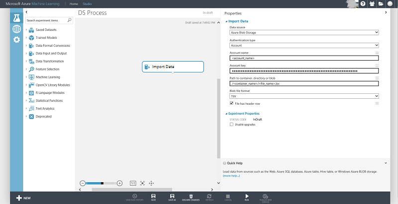

<properties
    pageTitle="Créer des fonctions pour les données de stockage blob Azure à l’aide de Panda | Microsoft Azure"
    description="Découvrez comment créer des fonctions pour les données qui sont stockées dans le conteneur blob Azure avec le package Panda Python."
    services="machine-learning,storage"
    documentationCenter=""
    authors="bradsev"
    manager="jhubbard"
    editor="cgronlun" />

<tags
    ms.service="machine-learning"
    ms.workload="data-services"
    ms.tgt_pltfrm="na"
    ms.devlang="na"
    ms.topic="article"
    ms.date="09/19/2016"
    ms.author="bradsev;garye" />

#Créer des fonctions pour les données de stockage blob Azure à l’aide de Panda

Ce document montre comment créer des fonctions pour les données qui sont stockées dans le conteneur blob Azure à l’aide du package [Pandas](http://pandas.pydata.org/) Python. Après avoir expliquant comment charger les données dans une trame de données Panda, il montre comment générer des fonctionnalités par catégorie à l’aide des scripts Python avec les valeurs de l’indicateur et groupement des fonctionnalités.

[AZURE.INCLUDE [cap-create-features-data-selector](../../includes/cap-create-features-selector.md)]Cette **menu** fournit des liens vers des rubriques qui décrivent comment créer des fonctions pour les données dans différents environnements. Cette tâche est une étape de l' [Équipe données scientifique processus (TDSP)](https://azure.microsoft.com/documentation/learning-paths/cortana-analytics-process/).

## Conditions préalables

Cet article suppose que vous avez créé un compte de stockage blob Azure et stockées vos données. Si vous avez besoin d’obtenir des instructions pour configurer un compte, voir [créer un compte de stockage Azure](../storage/storage-create-storage-account.md#create-a-storage-account)

## Charger les données dans une trame de données Pandas
Afin d’Explorer et manipuler un jeu de données, il doit être téléchargé à partir de la source d’objets blob dans un fichier local qui peut ensuite être chargé dans un cadre de données Pandas. Voici les étapes à suivre pour cette procédure :

1. Télécharger les données à partir d’Azure blob avec le code Python suivant à l’aide du service d’objets blob. Remplacez la variable dans le code suivant avec vos valeurs spécifiques :

        from azure.storage.blob import BlobService
        import tables

        STORAGEACCOUNTNAME= <storage_account_name>
        STORAGEACCOUNTKEY= <storage_account_key>
        LOCALFILENAME= <local_file_name>        
        CONTAINERNAME= <container_name>
        BLOBNAME= <blob_name>

        #download from blob
        t1=time.time()
        blob_service=BlobService(account_name=STORAGEACCOUNTNAME,account_key=STORAGEACCOUNTKEY)
        blob_service.get_blob_to_path(CONTAINERNAME,BLOBNAME,LOCALFILENAME)
        t2=time.time()
        print(("It takes %s seconds to download "+blobname) % (t2 - t1))

2. Lire les données dans une trame de données Pandas à partir du fichier téléchargé.

        #LOCALFILE is the file path
        dataframe_blobdata = pd.read_csv(LOCALFILE)

Vous êtes maintenant prêt à Explorer les données et générer des fonctionnalités dans ce groupe de données.

##Génération de fonctionnalité

Les deux sections suivantes indiquent comment générer des fonctionnalités par catégorie avec les valeurs de l’indicateur et mise au rebus à l’aide des scripts Python.

###Valeur de l’indicateur en fonction de génération de fonctionnalité

Fonctionnalités par catégorie peuvent être créées comme suit :

1. Inspecter la distribution de la colonne par catégorie :

        dataframe_blobdata['<categorical_column>'].value_counts()

2. Générer des valeurs de l’indicateur pour chacune des valeurs de colonne

        #generate the indicator column
        dataframe_blobdata_identity = pd.get_dummies(dataframe_blobdata['<categorical_column>'], prefix='<categorical_column>_identity')

3. Participer à la colonne des indicateurs par la trame de données d’origine

            #Join the dummy variables back to the original data frame
            dataframe_blobdata_with_identity = dataframe_blobdata.join(dataframe_blobdata_identity)

4. Supprimer la variable d’origine lui-même :

        #Remove the original column rate_code in df1_with_dummy
        dataframe_blobdata_with_identity.drop('<categorical_column>', axis=1, inplace=True)

###Groupement de génération de fonctionnalité

Pour générer des fonctionnalités binned, nous procéder comme suit :

1. Ajouter une séquence de colonnes à l’emplacement d’une colonne numérique

        bins = [0, 1, 2, 4, 10, 40]
        dataframe_blobdata_bin_id = pd.cut(dataframe_blobdata['<numeric_column>'], bins)

2. Convertir le groupement à une séquence de variables booléennes

        dataframe_blobdata_bin_bool = pd.get_dummies(dataframe_blobdata_bin_id, prefix='<numeric_column>')

3. Enfin, rejoindre les variables factices revenir à la trame de données d’origine

        dataframe_blobdata_with_bin_bool = dataframe_blobdata.join(dataframe_blobdata_bin_bool)

##Réécriture des données dans les objets blob Azure et l’utilisation dans l’apprentissage automatique Azure

Une fois que vous avez exploré les données et créé les fonctionnalités nécessaires, vous pouvez télécharger les données (échantillonnée ou featurized) vers un Azure blob et consommer dans l’apprentissage automatique Azure à l’aide de la procédure suivante : Notez que des fonctionnalités supplémentaires peuvent être créées dans Azure Machine apprentissage Studio également.
1. Écrire la trame de données dans le fichier local

        dataframe.to_csv(os.path.join(os.getcwd(),LOCALFILENAME), sep='\t', encoding='utf-8', index=False)

2. Téléchargez les données blob Azure comme suit :

        from azure.storage.blob import BlobService
        import tables

        STORAGEACCOUNTNAME= <storage_account_name>
        LOCALFILENAME= <local_file_name>
        STORAGEACCOUNTKEY= <storage_account_key>
        CONTAINERNAME= <container_name>
        BLOBNAME= <blob_name>

        output_blob_service=BlobService(account_name=STORAGEACCOUNTNAME,account_key=STORAGEACCOUNTKEY)    
        localfileprocessed = os.path.join(os.getcwd(),LOCALFILENAME) #assuming file is in current working directory

        try:

        #perform upload
        output_blob_service.put_block_blob_from_path(CONTAINERNAME,BLOBNAME,localfileprocessed)

        except:         
            print ("Something went wrong with uploading blob:"+BLOBNAME)

3. Maintenant les données peuvent être lus à partir du blob l’utilisation du module Azure Machine apprentissage [Importer les données](https://msdn.microsoft.com/library/azure/4e1b0fe6-aded-4b3f-a36f-39b8862b9004/) comme indiqué dans l’écran ci-dessous :

