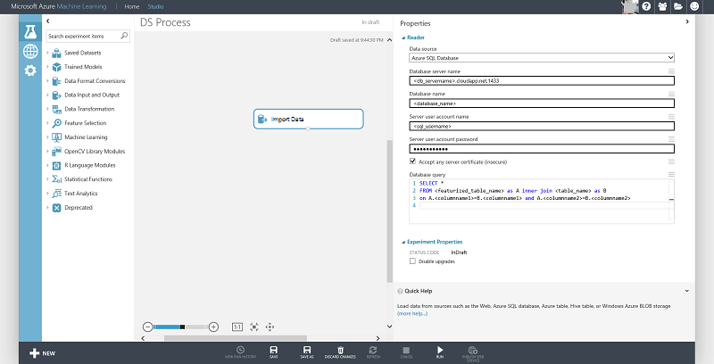

<properties
    pageTitle="Créer des fonctions pour les données dans SQL Server à l’aide de SQL et Python | Microsoft Azure"
    description="Processus données SQL Azure"
    services="machine-learning"
    documentationCenter=""
    authors="bradsev"
    manager="jhubbard"
    editor="" />

<tags
    ms.service="machine-learning"
    ms.workload="data-services"
    ms.tgt_pltfrm="na"
    ms.devlang="na"
    ms.topic="article"
    ms.date="09/19/2016"
    ms.author="bradsev;fashah;garye" />

# Créer des fonctions pour les données dans SQL Server à l’aide de SQL et Python

Ce document montre comment générer des fonctionnalités pour les données stockées dans un serveur machine virtuelle SQL sur Azure aider algorithmes plus efficacement à partir des données. Vous pouvez faire en utilisant SQL ou en utilisant un langage de programmation comme Python, qui sont illustrés ici.

[AZURE.INCLUDE [cap-create-features-data-selector](../../includes/cap-create-features-selector.md)]Cette **menu** fournit des liens vers des rubriques qui décrivent comment créer des fonctions pour les données dans différents environnements. Cette tâche est une étape de l' [Équipe données scientifique processus (TDSP)](https://azure.microsoft.com/documentation/learning-paths/cortana-analytics-process/).

> [AZURE.NOTE] Pour obtenir un exemple pratique, vous pouvez consulter le [jeu de données NYC Taxi](http://www.andresmh.com/nyctaxitrips/) et faire référence à la IPNB intitulé [NYC données ensuivirent à l’aide de bloc-notes IPython et SQL Server](https://github.com/Azure/Azure-MachineLearning-DataScience/blob/master/Misc/DataScienceProcess/iPythonNotebooks/machine-Learning-data-science-process-sql-walkthrough.ipynb) pour une étape par étape de bout en bout.

## Conditions préalables
Cet article suppose que vous avez :

* Créer un compte de stockage Azure. Si vous avez besoin d’instructions, voir [créer un compte de stockage Azure](../storage/storage-create-storage-account.md#create-a-storage-account)
* Stocker vos données dans SQL Server. Si vous n’avez pas le cas, voir [déplacer des données à une base de données SQL Azure pour apprentissage automatique Azure](machine-learning-data-science-move-sql-azure.md) pour obtenir des instructions sur la façon de déplacer les données il.

## Génération de fonctionnalité avec SQL

Dans cette section, nous décrire les méthodes de génération de fonctions à l’aide de SQL :  

1. [Compter en fonction de génération de fonctionnalité](#sql-countfeature)
2. [Groupement de génération de fonctionnalité](#sql-binningfeature)
3. [Découvrez les fonctionnalités des yeux à partir d’une seule colonne](#sql-featurerollout)

> [AZURE.NOTE] Une fois que vous générez des fonctionnalités supplémentaires, vous pouvez les ajouter en tant que colonnes à la table existante ou créer une table avec les autres fonctionnalités de clé primaire, qui peut être jointes à la table d’origine.

### Compter en fonction de génération de fonctionnalité

Ce document montre deux manières de générer des fonctionnalités de nombre. La première méthode utilise Somme conditionnelle et la deuxième méthode utilise la clause « where ». Ils peuvent être joints avec la table d’origine (à l’aide de colonnes de clé primaire) pour que les fonctions NB en parallèle avec les données d’origine.

    select <column_name1>,<column_name2>,<column_name3>, COUNT(*) as Count_Features from <tablename> group by <column_name1>,<column_name2>,<column_name3>

    select <column_name1>,<column_name2> , sum(1) as Count_Features from <tablename>
    where <column_name3> = '<some_value>' group by <column_name1>,<column_name2>

### Groupement de génération de fonctionnalité

L’exemple suivant montre comment générer des fonctionnalités binned par groupement (à l’aide de 5 emplacements) une colonne numérique qui peut être utilisée comme une fonctionnalité à la place :

    `SELECT <column_name>, NTILE(5) OVER (ORDER BY <column_name>) AS BinNumber from <tablename>`

### Découvrez les fonctionnalités des yeux à partir d’une seule colonne

Dans cette section, nous vous montrer comment pellicule indépendante une seule colonne dans une table pour générer des fonctionnalités supplémentaires. L’exemple suppose qu’il existe une colonne latitude ou de longitude dans la table à partir de laquelle vous essayez de générer des fonctionnalités.

Voici une brève introduction sur les données de localisation latitude/longitude (allocation des ressources à partir de stackoverflow `http://gis.stackexchange.com/questions/8650/how-to-measure-the-accuracy-of-latitude-and-longitude`). Il est utile de connaître avant featurizing le champ emplacement :

- Le signe nous indique que nous sommes Nord ou sud, Moyen-Orient ou ouest sur le globe.
- Un centaines différente de zéro chiffre nous indique que nous utilisons longitude et latitude pas !
- Les dizaines chiffre donne une position à environ 1 000 kilomètres. Il nous donne des informations utiles sur quel continent ou océan nous situés.
- Le chiffre des unités (un degré décimal) donne une position 111 kilomètres (60 milles, environ 69 miles). Il peut donner à peu près état grand ou pays dans que nous sommes.
- La première décimale vaut jusqu'à 11.1 kilomètres : elle peut distinguer la position d’une grande ville à partir d’une grande ville voisine.
- La deuxième décimale vaut jusqu'à 1.1 kilomètres : il peut séparer un peuvent être omises du suivant.
- La troisième décimale vaut jusqu'à 110 m : il peut identifier un grand champ agricole ou un campus institutions.
- La quatrième décimale vaut m jusqu'à 11, il peut identifier une superficie de terre. Elle s’apparente à la précision d’une unité GPS corrigée classique sans avoir intervenir.
- La cinquième décimale est-il important de m jusqu'à 1.1 distinguer les uns des autres et les arborescences. Précision à ce niveau avec unités GPS professionnelle est possible uniquement avec correction différentielle.
- La sixième décimale vaut jusqu'à 0,11 m : vous pouvez l’utiliser pour disposer les structures de façon plus détaillée, pour la conception de paysages, créez des routes. Il doit être plus de suffisant pour le suivi des mouvements d’enneigées et terminaux. Pour cela, en prenant des mesures soignés avec GPS, par exemple GPS DIFFERENTIELLE corrigé.

Les informations d’emplacement peuvent peuvent être featurized comme suit, séparer les région, emplacement et d’informations sur la ville. Notez qu’une seule fois peut également appeler le point de terminaison de reste comme API Bing Maps disponibles dans la page `https://msdn.microsoft.com/library/ff701710.aspx` pour récupérer les informations de région/secteur.

    select
        <location_columnname>
        ,round(<location_columnname>,0) as l1       
        ,l2=case when LEN (PARSENAME(round(ABS(<location_columnname>) - FLOOR(ABS(<location_columnname>)),6),1)) >= 1 then substring(PARSENAME(round(ABS(<location_columnname>) - FLOOR(ABS(<location_columnname>)),6),1),1,1) else '0' end     
        ,l3=case when LEN (PARSENAME(round(ABS(<location_columnname>) - FLOOR(ABS(<location_columnname>)),6),1)) >= 2 then substring(PARSENAME(round(ABS(<location_columnname>) - FLOOR(ABS(<location_columnname>)),6),1),2,1) else '0' end     
        ,l4=case when LEN (PARSENAME(round(ABS(<location_columnname>) - FLOOR(ABS(<location_columnname>)),6),1)) >= 3 then substring(PARSENAME(round(ABS(<location_columnname>) - FLOOR(ABS(<location_columnname>)),6),1),3,1) else '0' end     
        ,l5=case when LEN (PARSENAME(round(ABS(<location_columnname>) - FLOOR(ABS(<location_columnname>)),6),1)) >= 4 then substring(PARSENAME(round(ABS(<location_columnname>) - FLOOR(ABS(<location_columnname>)),6),1),4,1) else '0' end     
        ,l6=case when LEN (PARSENAME(round(ABS(<location_columnname>) - FLOOR(ABS(<location_columnname>)),6),1)) >= 5 then substring(PARSENAME(round(ABS(<location_columnname>) - FLOOR(ABS(<location_columnname>)),6),1),5,1) else '0' end     
        ,l7=case when LEN (PARSENAME(round(ABS(<location_columnname>) - FLOOR(ABS(<location_columnname>)),6),1)) >= 6 then substring(PARSENAME(round(ABS(<location_columnname>) - FLOOR(ABS(<location_columnname>)),6),1),6,1) else '0' end     
    from <tablename>

Les fonctionnalités selon l’emplacement ci-dessus peuvent servir davantage pour générer des fonctionnalités count supplémentaires comme décrit plus haut.

> [AZURE.TIP] Vous pouvez insérer par programmation les enregistrements à l’aide de la langue de votre choix. Vous devrez peut-être insérer les données dans des segments pour améliorer l’efficacité écriture [extraction de l’exemple de la procédure à suivre à l’aide de pyodbc ici](https://code.google.com/p/pypyodbc/wiki/A_HelloWorld_sample_to_access_mssql_with_python).
Une autre solution consiste à insérer des données dans la base de données à l’aide de [utilitaire BCP](https://msdn.microsoft.com/library/ms162802.aspx)

### Connexion à apprentissage automatique Azure

La fonctionnalité nouvellement créée peut être ajoutée sous forme de colonne à une table existante ou stockée dans une nouvelle table et rejoint avec la table d’origine pour apprentissage automatique. Fonctionnalités pouvant être générées ou accessible si vous avez déjà créé, à l’aide du module [Importer des données](https://msdn.microsoft.com/library/azure/4e1b0fe6-aded-4b3f-a36f-39b8862b9004/) dans Azure ML comme indiqué ci-dessous :

## À l’aide d’un langage de programmation comme Python

À l’aide de Python pour générer des fonctionnalités lorsque les données sont dans SQL Server est similaire au traitement des données d’objets blob Azure à l’aide de Python comme indiqué dans les [données d’objets Blob Azure processus dans environnement scientifique données](machine-learning-data-science-process-data-blob.md). Les données devant être chargées à partir de la base de données dans une trame de données pandas et puis peuvent être poursuivies. Nous documenter le processus de connexion à la base de données et charger les données dans le cadre de données dans cette section.

Au format de la chaîne de connexion peut être utilisé pour vous connecter à une base de données SQL Server à partir de Python à l’aide de pyodbc (nom du serveur de remplacer, dbname, nom d’utilisateur et mot de passe avec vos valeurs spécifiques) :

    #Set up the SQL Azure connection
    import pyodbc
    conn = pyodbc.connect('DRIVER={SQL Server};SERVER=<servername>;DATABASE=<dbname>;UID=<username>;PWD=<password>')

La [bibliothèque Pandas](http://pandas.pydata.org/) dans Python fournit un large éventail de structures de données et outils d’analyse des données pour manipulation des données pour la programmation Python. Le code ci-dessous lit les résultats renvoyés à partir d’une base de données SQL Server dans un bloc de données Pandas :

    # Query database and load the returned results in pandas data frame
    data_frame = pd.read_sql('''select <columnname1>, <cloumnname2>... from <tablename>''', conn)

Maintenant, vous pouvez travailler avec la trame de données Pandas comme décrit dans les rubriques [créer des fonctions pour les données de stockage blob Azure à l’aide de Panda](machine-learning-data-science-create-features-blob.md).
