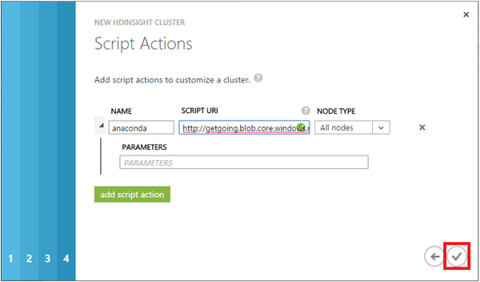

<properties 
    pageTitle="Personnaliser les clusters Hadoop pour le processus d’équipe données scientifique | Microsoft Azure" 
    description="Modules Python populaires à disposition personnalisée Azure HDInsight Hadoop clusters."
    services="machine-learning" 
    documentationCenter="" 
    authors="bradsev" 
    manager="jhubbard" 
    editor="cgronlun"  />

<tags 
    ms.service="machine-learning" 
    ms.workload="data-services" 
    ms.tgt_pltfrm="na" 
    ms.devlang="na" 
    ms.topic="article" 
    ms.date="09/19/2016" 
    ms.author="hangzh;bradsev" />

# Personnaliser les clusters Azure HDInsight Hadoop pour le processus d’équipe données scientifique 

Cet article décrit comment personnaliser un cluster HDInsight Hadoop en installant Anaconda 64 bits (Python 2.7) sur chaque nœud lorsque le cluster est configuré comme un service HDInsight. Il indique également comment accéder à la headnode pour soumettre les tâches personnalisés pour le cluster. Cette personnalisation permet de nombreux modules Python populaires qui sont inclus dans Anaconda facilement être utilisés dans des fonctions définies par l’utilisateur (UDF) qui ont été conçues pour traiter les enregistrements Hive dans le cluster. Pour obtenir des instructions sur les procédures utilisées dans ce scénario, voir [comment envoyer les requêtes Hive](machine-learning-data-science-move-hive-tables.md#submit).

Le menu en dessous des liens vers des rubriques qui décrivent comment configurer les différents environnements de science données utilisés par l' [Équipe données scientifique processus (TDSP)](data-science-process-overview.md).

[AZURE.INCLUDE [data-science-environment-setup](../../includes/cap-setup-environments.md)]

## Personnaliser Azure HDInsight Hadoop Cluster

Pour créer un cluster HDInsight Hadoop personnalisée, les utilisateurs doivent ouvrir une session sur le [**Portail d’Azure classique**](https://manage.windowsazure.com/), cliquez sur **Nouveau** dans le coin inférieur gauche et puis sélectionnez DATA SERVICES -> HDINSIGHT -> **Créer personnalisée** pour faire apparaître la fenêtre **Détails de Cluster** . 

Entrez le nom du cluster doit être créé sur la page de configuration 1, puis acceptez les valeurs par défaut pour les autres champs. Cliquez sur la flèche pour accéder à la page suivante de la configuration. 

Sur la page de configuration 2, entrer le nombre de **Nœuds de données**, sélectionnez le **Réseau virtuel/région**, puis sélectionnez la taille du **Serveur de nœud** et le **Nœud de données**. Cliquez sur la flèche pour accéder à la page suivante de la configuration.

>[AZURE.NOTE] Le **Réseau virtuel/région** est identique à la région du compte de stockage doit être utilisé pour le cluster HDInsight Hadoop. Dans le cas contraire, dans la quatrième page de configuration, le compte de stockage que les utilisateurs à utiliser s’affichent pas dans la liste déroulante **Nom**du compte.

Dans la page configuration 3, fournissent un nom d’utilisateur et mot de passe pour le cluster HDInsight Hadoop. **Ne** sélectionnez pas l' _entrée du Metastore Hive/Oozie_. Ensuite, cliquez sur la flèche pour accéder à la page suivante de la configuration. 

Sur la page de configuration 4, spécifiez le nom de compte de stockage, le conteneur par défaut du cluster HDInsight Hadoop. Si les utilisateurs sélectionnent _créer conteneur par défaut_ dans la liste déroulante **Conteneur par défaut** , un conteneur portant le même nom que le cluster sera créé. Cliquez sur la flèche pour accéder à la dernière page de configuration.

Dans la dernière page de configuration des **Actions de Script** , cliquez sur le bouton **Ajouter une action de script** et remplissez les champs de texte avec les valeurs suivantes.
 
* **Nom** : n’importe quelle chaîne en tant que le nom de cette action de script. 
* **TYPE de nœud** - sélectionner **tous les nœuds**. 
* **SCRIPT URI** - *http://getgoing.blob.core.windows.net/publicscripts/Azure_HDI_Setup_Windows.ps1* 
    * *publicscripts* est un conteneur public dans un compte de stockage 
    * *getgoing* que nous permet de partager des fichiers de script PowerShell afin de faciliter aux utilisateurs de travailler dans Azure. 
* **Paramètres** - (laisser vide)

Pour finir, cliquez sur la case à cocher pour commencer la création du cluster HDInsight Hadoop personnalisée. 

## Accéder au nœud de tête du Cluster Hadoop

Les utilisateurs doivent activer l’accès à distance au cluster Hadoop dans Azure avant de pouvoir accéder le nœud de tête du cluster Hadoop via RDP. 

1. Connectez-vous sur [**Portail classique de Azure**](https://manage.windowsazure.com/) **HDInsight** sur la gauche, sélectionnez votre cluster Hadoop dans la liste des clusters, cliquez sur l’onglet **CONFIGURATION** et sélectionnez puis cliquez sur l’icône **Activer à distance** en bas de la page.
    
    

2. Dans la fenêtre **Configurer le Bureau à distance** , entrez les champs nom d’utilisateur et mot de passe, puis sélectionnez la date d’expiration pour l’accès à distance. Puis cliquez sur la case à cocher pour activer l’accès à distance pour le nœud de tête du cluster Hadoop.

    
    
>[AZURE.NOTE] Le nom d’utilisateur et mot de passe pour l’accès à distance ne sont pas le nom d’utilisateur et mot de passe que vous utilisez lorsque vous avez créé le cluster Hadoop. Il s’agit d’un ensemble distinct d’informations d’identification. En outre, la date d’expiration de l’accès à distance doit se trouver dans 7 jours après la date actuelle.

Une fois que l’accès à distance est activé, cliquez sur **se connecter** au bas de la page à distance dans le nœud de tête. Vous ouvrez une session le nœud de tête du cluster Hadoop en entrant les informations d’identification pour l’utilisateur d’accès à distance que vous avez spécifiée précédemment.

Les étapes du processus analytique avancées sont mappées dans l' [Équipe données scientifique processus (TDSP)](https://azure.microsoft.com/documentation/learning-paths/cortana-analytics-process/) et peuvent inclure les étapes qui déplacement des données dans HDInsight, processus et aperçu en vue de la formation à partir des données avec Azure Machine d’apprentissage.

Découvrez [comment soumettre des requêtes Hive](machine-learning-data-science-move-hive-tables.md#submit) pour obtenir des instructions sur l’accès aux modules Python qui sont inclus dans Anaconda du nœud de tête du cluster dans des fonctions définies par l’utilisateur (UDF) qui sont utilisés pour traiter les enregistrements Hive stockées dans le cluster.

 
