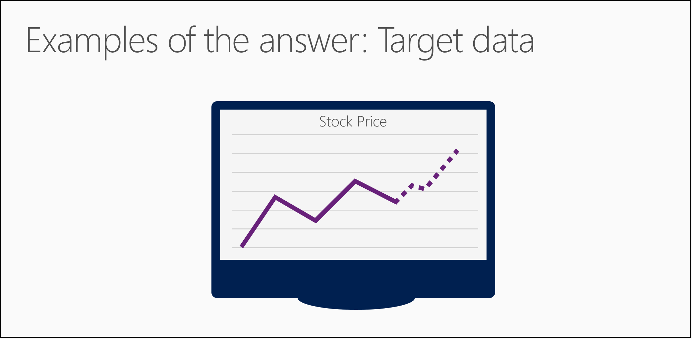

<properties
   pageTitle="Poser une question vous pouvez répondre à des données - formuler des questions | Microsoft Azure"
   description="Découvrez comment formuler une question scientifique des données dans des données pour les débutants vidéo 3. Inclut une comparaison des questions sur la classification et de régression."
   keywords="questions science de données, formuler des questions, questions de régression, questions classification, une question"
   services="machine-learning"
   documentationCenter="na"
   authors="cjgronlund"
   manager="jhubbard"
   editor="cjgronlund"/>

<tags
   ms.service="machine-learning"
   ms.devlang="na"
   ms.topic="article"
   ms.tgt_pltfrm="na"
   ms.workload="na"
   ms.date="10/20/2016"
   ms.author="cgronlun;garye"/>

# Poser une question, vous pouvez répondre à des données

## Vidéo 3 : Données scientifique pour série débutants

Découvrez comment formuler une question scientifique des données dans des données pour les débutants vidéo 3. Cette vidéo propose une comparaison des questions sur les algorithmes de classification et de régression.

Pour tirer le meilleur parti de la série, regardez tous les. [Accédez à la liste des vidéos](#other-videos-in-this-series)

> [AZURE.VIDEO data-science-for-beginners-ask-a-question-you-can-answer-with-data]

## Autres vidéos dans cette série

*Données scientifique pour les débutants* est une brève introduction aux science de données à cinq courtes vidéos.

  * Vidéo 1 : [Les réponses aux 5 questions données scientifique](machine-learning-data-science-for-beginners-the-5-questions-data-science-answers.md) *(5 s 14 min)*
  * Vidéo 2 : [vos données n’est prêt pour scientifique données ?](machine-learning-data-science-for-beginners-is-your-data-ready-for-data-science.md) *(4 s 56 min)*
  * Vidéo 3 : Poser une question que vous pouvez répondre à des données
  * Vidéo 4 : [Prévoir une réponse qui contient un modèle simple](machine-learning-data-science-for-beginners-predict-an-answer-with-a-simple-model.md) *(7 min 42 s)*
  * Vidéo 5 : [Copier le travail d’autres personnes pour effectuer scientifique de données](machine-learning-data-science-for-beginners-copy-other-peoples-work-to-do-data-science.md) *(3 min 18 s)*

## Transcription : Poser une question que vous pouvez répondre à des données

Bienvenue dans la troisième vidéo de la série « Données scientifique pour les débutants ».  

Dans celle-ci, vous obtiendrez quelques conseils pour formuler une question, vous pouvez répondre à des données.

Vous pouvez obtenir plus déconnecter cette vidéo, si vous regardez tout d’abord les vidéos antérieures deux dans cette série : « la science de données 5 questions peut répondre à » et « Est vos données sont prêtes pour scientifique de données ? »

## Poser une question dièse

Nous avons vu comment scientifique de données est le processus de l’utilisation de noms (également appelés catégories ou étiquettes) et les numéros de prédire une réponse à une question. Mais il ne peut pas être n’importe quelle question ; Il doit être un *question dièse.*

Une question vague n’est doit répondre avec un nom ou un nombre. Doit être une question dièse.

Imaginons que vous avez trouvé un feu magic avec un genie qui répondra bien toute question que vous posez. Mais il s’agit d’un genie partir et il essaierez rendre sa réponse aussi vague et confus comme il accessible absent (e) avec. Vous voulez lui épingler vers le bas avec une question donc étanche qu’il ne peut pas vous aider mais vous dire ce que vous voulez en savoir.

Si vous deviez poser une question vague, telles que « Que va-t-il se passer avec mon papier ? », le genie peut-être répondre, « le prix change ». Qui est une réponse honnête, mais il n’est pas très utile.

Mais si vous aviez poser une question nette, comme « Quel prix de vente de mon stock sera semaine prochaine ? », le genie ne peut pas vous aider mais vous donne une spécifique répond et prédire un prix de vente.

## Exemples de réponse à vos questions : cibler les données

Une fois que vous pouvez formuler votre question, vérifiez si vous avez des exemples de la réponse dans vos données.

Si votre question est « Quel prix de vente de mon stock sera semaine prochaine ? » Nous devons ensuite vous assurer que nos données comprennent l’historique de cotation.

Si votre question est « quel voiture dans mon flotte va échouer tout d’abord ? » Nous avons puis pour vous assurer que nos données incluent des informations sur les échecs précédents.

Ces exemples de réponses sont appelés une cible. Une cible est ce que nous essayons à prévoir sur les points de données futures, qu’il s’agisse d’une catégorie ou un nombre.

Si vous n’avez pas toutes les données cible, vous devez utiliser certaines. Il se peut que vous ne pourrez pas répondre à votre question sans lui.

## Reformulez votre question

Parfois, vous pouvez reformuler votre question pour obtenir une réponse plus utile.

La question « Est présente un point de données ou B ? » prévoit la catégorie (ou nom ou l’étiquette) d’un élément. Pour répondre à celle-ci, nous utilisons un *algorithme de classification*.

La question « Combien ? » ou « Combien » ? prévoit un montant. Pour répondre à il nous utilisent un *algorithme de régression*.

Pour voir comment nous pouvons transformer celles-ci, nous allons étudier la question, « quel de presse est particulièrement intéressantes pour ce lecteur ? » Il vous invite à fournir une prévision d’un choix unique à partir de nombreuses possibilités - en d’autres termes « Est cette A B ou C ou D ? » - et utilisez un algorithme de classification.

Mais, cette question peut être plus facile de répondre si vous reformuler en tant que « comment intéressante est chaque article se trouve sur cette liste pour ce lecteur ? » Maintenant que vous pouvez donner chaque article un résultat numérique, puis, il est facile d’identifier l’article le plus élevé au score. Il s’agit d’un reformulant de la question de classification dans une question de régression ou combien ?

Comment poser qu'une question est un indice à l’algorithme peut vous fournir une réponse.

Vous trouverez que certaines familles des algorithmes - comme ceux présentés dans notre exemple article de news - sont étroitement liées. Vous pouvez reformulez votre question pour utiliser l’algorithme qui vous donne la réponse plus utile.

Mais, plus important, demandez à cette question nette - la question à laquelle vous pouvez répondre à des données. Et vérifiez que vous avez les bonnes données répondre.

Nous avons parlé de quelques principes de base pour posez une question à laquelle vous pouvez répondre à des données.

Veillez à consulter les autres vidéos dans « Données scientifique pour les débutants » de Microsoft Azure Machine Learning.

## Étapes suivantes

  * [Essayez d’une expérience scientifique données première avec Machine apprentissage Studio](machine-learning-create-experiment.md)
  * [Découvrez apprentissage automatique sur Microsoft Azure](machine-learning-what-is-machine-learning.md)
