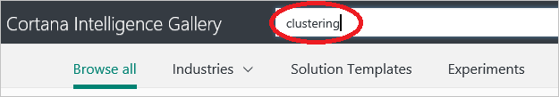

<properties
   pageTitle="Copier des autres personnes données scientifique travail - exemple de machine d’apprentissage | Microsoft Azure"
   description="Secret commercial scientifique de données : obtenir d’autres personnes pour effectuer vos tâches à votre place. Consultez des exemples de Cortana Analytique galerie comme un exemple d’algorithme de cluster."
   keywords="exemples de données scientifique, exemple apprentissage machine, cluster algorithme, cluster exemple algorithme"
   services="machine-learning"
   documentationCenter="na"
   authors="cjgronlund"
   manager="jhubbard"
   editor="cjgronlund"/>

<tags
   ms.service="machine-learning"
   ms.devlang="na"
   ms.topic="article"
   ms.tgt_pltfrm="na"
   ms.workload="na"
   ms.date="10/20/2016"
   ms.author="cgronlun;garye"/>

# Copier le travail d’autres personnes pour effectuer scientifique de données

## Vidéo 5 : Données scientifique pour série débutants

Un des codes secrets trade scientifique données consiste à obtenir d’autres personnes pour effectuer vos tâches à votre place. Rechercher un exemple d’algorithme de cluster à utiliser pour votre propre ordinateur expérience d’apprentissage.

Pour tirer le meilleur parti de la série, regardez tous les. [Accédez à la liste des vidéos](#other-videos-in-this-series)

> [AZURE.VIDEO data-science-for-beginners-series-copy-other-peoples-work-to-do-data-science]

## Autres vidéos dans cette série

*Données scientifique pour les débutants* est une brève introduction aux science de données à cinq courtes vidéos.

  * Vidéo 1 : [Les réponses aux 5 questions données scientifique](machine-learning-data-science-for-beginners-the-5-questions-data-science-answers.md) *(5 s 14 min)*
  * Vidéo 2 : [vos données n’est prêt pour scientifique données ?](machine-learning-data-science-for-beginners-is-your-data-ready-for-data-science.md) *(4 s 56 min)*
  * Vidéo 3 : [Poser une question, vous pouvez répondre à des données](machine-learning-data-science-for-beginners-ask-a-question-you-can-answer-with-data.md) *(sec 17 min 4)*
  * Vidéo 4 : [Prévoir une réponse qui contient un modèle simple](machine-learning-data-science-for-beginners-predict-an-answer-with-a-simple-model.md) *(7 min 42 s)*
  * Vidéo 5 : Copier le travail d’autres personnes pour effectuer scientifique de données

## Transcription : Copier le travail d’autres personnes pour effectuer scientifique de données

Bienvenue dans la cinquième vidéo de la série « Données scientifique pour les débutants ».

Dans celle-ci, vous découvrirez un emplacement pour rechercher les exemples que vous pouvez demander aux comme point de départ pour votre travail. Vous pouvez obtenir le meilleur parti de cette vidéo vous regardez tout d’abord les vidéos antérieures dans cette série.

Un des codes secrets trade scientifique données consiste à obtenir d’autres personnes pour effectuer vos tâches à votre place.

## Rechercher des exemples dans la galerie d’Intelligence Cortana

Microsoft dispose d’un service en nuage appelé [Apprentissage automatique Azure]( https://azure.microsoft.com/services/machine-learning/) que vous êtes invité à un essai gratuit. Il vous offre un espace de travail où vous pouvez tester les algorithmes d’apprentissage automatique différentes, et, lorsque vous avez votre solution élaborée, vous pouvez le démarrer comme un service web.

Partie de ce service ce qui est appelé la **[Galerie d’Intelligence Cortana](http://aka.ms/CortanaIntelligenceGallery)**. Il contient une variété de ressources, y compris un ensemble d’expériences d’apprentissage automatique Azure ou les modèles, que les utilisateurs ont créé et collaboré à d’autres utilisateurs. Ces expériences constituent un excellent moyen d’exploiter la réflexion et le travail d’autres personnes puissent vous aider à démarrer sur vos propres solutions.

Vous pouvez trouver la galerie à [aka.ms/CortanaIntelligenceGallery]( http://aka.ms/CortanaIntelligenceGallery). Tout le monde a accueil permet de parcourir celui-ci.

Si vous cliquez sur **expériences** en haut, vous verrez un nombre d’essais les plus récents et les plus consultés dans la galerie. Vous pouvez parcourir le reste des expériences en cliquant sur **Rechercher tout** en haut de l’écran, et il vous pouvez entrer des termes de recherche et sélectionnez les filtres de recherche.

## Rechercher et utiliser un exemple d’algorithme de cluster

Par conséquent, par exemple, supposons que vous voulez voir un exemple d’utilisation fonctionne, afin de rechercher des expériences **« cluster »** .

Voici un intéressant quelqu'un impliquées dans la galerie.

Cliquez sur cette expérience, vous obtenez une page web qui décrit le travail qui s’est chargée de ce collaborateur, ainsi que certains de leurs résultats.

Notez le lien indiquant **ouvert dans Studio**.

Je peux cliquer sur qui et il me faut droite à **Azure Machine apprentissage Studio**. Il crée une copie de l’expérience et la place dans mon propre espace de travail. Il s’agit dataset de la collaboration, tout le traitement c’était le cas, tous les algorithmes qu’il a utilisé, et comment ils enregistrés les résultats.

Et maintenant j’ai un point de départ. J’ai puis-je remplacer les données pour mon propre et effectuez mienne peaufinage du modèle. J’obtiens une longueur d’avance, et il me permet d’appuyer sur le travail de personnes connaissant vraiment ce qu’ils vous faites.

## Rechercher des expériences qui illustrent des techniques d’apprentissage automatique

Il existe d’autres expériences dans la [Galerie d’Intelligence Cortana](http://aka.ms/CortanaIntelligenceGallery) fournies spécifiquement pour fournir des exemples de procédures pour les personnes nouvelles sciences de données. Par exemple, il existe une expérience dans la galerie qui montre comment traiter les valeurs manquantes ([méthodes de gestion des valeurs manquantes](https://gallery.cortanaintelligence.com/Experiment/Methods-for-handling-missing-values-1)). Il allant de 15 différentes façons de remplacer les valeurs vides et présente les avantages de chaque méthode et quand l’utiliser.

[Cortana Intelligence galerie](http://aka.ms/CortanaIntelligenceGallery) est un endroit où se trouvent les expériences de travail que vous pouvez utiliser comme point de départ pour vos propres solutions.

Veillez à consulter les autres vidéos dans « Données scientifique pour les débutants » de Microsoft Azure Machine Learning.

## Étapes suivantes

  * [Essayez de votre première expérience scientifique de données avec apprentissage automatique Azure](machine-learning-create-experiment.md)
  * [Découvrez apprentissage automatique sur Microsoft Azure](machine-learning-what-is-machine-learning.md)
