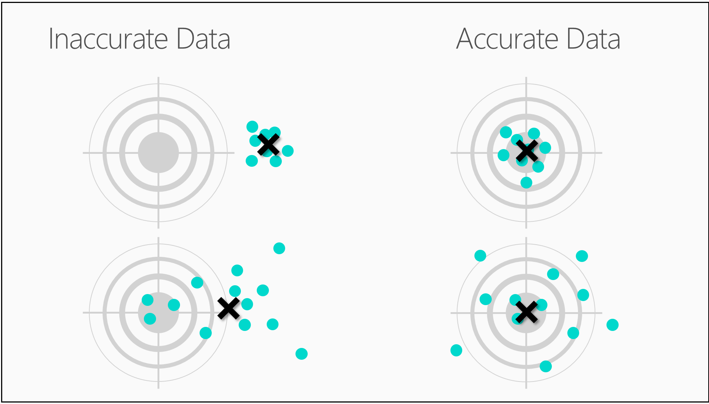

<properties
   pageTitle="Vos données est prêt pour scientifique de données ? Évaluation des données | Microsoft Azure"
   description="Découvrez les 4 critères de données soit prêt pour scientifique de données. Données scientifique pour les débutants vidéo 2 a bétonnée exemples pour vous aider à l’évaluation des données de base."
   keywords="données pertinentes, évaluer les données, préparer des données, des critères de données, des données prêtes"
   services="machine-learning"
   documentationCenter="na"
   authors="cjgronlund"
   manager="jhubbard"
   editor="cjgronlund"/>

<tags
   ms.service="machine-learning"
   ms.devlang="na"
   ms.topic="article"
   ms.tgt_pltfrm="na"
   ms.workload="na"
   ms.date="10/20/2016"
   ms.author="cgronlun;garye"/>

# Vos données est prêt pour scientifique de données ?

## Vidéo 2 : Données scientifique pour série débutants

Apprenez à évaluer vos données pour vous assurer qu’il répond aux critères de base pour être prêt pour scientifique de données.

Pour tirer le meilleur parti de la série, regardez tous les. [Accédez à la liste des vidéos](#other-videos-in-this-series)

> [AZURE.VIDEO data-science-for-beginners-series-is-your-data-ready-for-data-science]

## Autres vidéos dans cette série

*Données scientifique pour les débutants* est une brève introduction aux science de données à cinq courtes vidéos.

  * Vidéo 1 : [Les réponses aux 5 questions données scientifique](machine-learning-data-science-for-beginners-the-5-questions-data-science-answers.md) *(5 s 14 min)*
  * Vidéo 2 : Est vos données prêt pour scientifique de données ?
  * Vidéo 3 : [Poser une question, vous pouvez répondre à des données](machine-learning-data-science-for-beginners-ask-a-question-you-can-answer-with-data.md) *(sec 17 min 4)*
  * Vidéo 4 : [Prévoir une réponse qui contient un modèle simple](machine-learning-data-science-for-beginners-predict-an-answer-with-a-simple-model.md) *(7 min 42 s)*
  * Vidéo 5 : [Copier le travail d’autres personnes pour effectuer scientifique de données](machine-learning-data-science-for-beginners-copy-other-peoples-work-to-do-data-science.md) *(3 min 18 s)*

## Transcription : Soit vos données prêt scientifique de données ?

Bienvenue dans « Est vos données prêt pour scientifique de données » ? la deuxième vidéo dans la série de *Données scientifique pour les débutants*.  

Avant scientifique de données peut vous fournir les réponses souhaitées, vous devez lui donner certaines matières premières haute qualité pour l’utiliser avec. Comme effectue une pizza, plus les composants de que départ, plus le produit final.

## Critères pour les données

Par conséquent, dans le cas de scientifique de données, il existe certains composants que nous devons rassembler.

Nous avons besoin de données sont :

  * Pertinents
  * Connecté
  * Précis
  * Pour travailler avec

## Vos données est pertinent ?

Pour que la première principe - nous avons besoin de données qui s’appliquent.

Examinez la table sur la gauche. Nous allons remplie sept personnes en dehors de barres Boston, mesurée leur niveau d’ALCOOLÉMIE, la BattingAverage Red Sox dans leur dernière partie et le prix de laitiers dans le magasin de commodité le plus proche.

Il s’agit de toutes les données parfaitement légitimes. Il est seule défaillance est qu’il n’est pas pertinente. Il n’y a aucun lien évident entre ces nombres. Si je vous a communiqué le prix actuel de laitiers et la BattingAverage Sox rouge, il n’existe aucun moyen vous pouvez deviner mon contenu alcool contrôleur.

Observez la table de droite. Cette fois nous mesurée chaque personne corps de masse et compter le nombre de boissons qui ont été.  Les nombres dans chaque ligne sont désormais pertinentes pour eux. Si je vous a communiqué mon corps masse et le nombre de Margaritas que j’ai eu, vous pouvez créer une estimation à mon contrôleur alcool contenu.

## Procédez comme vous avez connectés des données ?

Le principe suivant est données connectées.

Voici certaines données pertinentes concernant la qualité des hamburgers : grille température, l’épaisseur de GALETTES et évaluation dans les produits alimentaires local magazines. Mais notez les espaces vides dans la table située à gauche.

Il manque certaines valeurs de la plupart des jeux de données. Il est courant d’avoir holes ainsi et manières pour les contourner. Mais s’il existe trop de manquants, vos données commencent à ressembler à PASSOIRE.

Si vous examinez la table de gauche, il est quantité de données manquant, il est difficile à parvenir à n’importe quel type de relation entre poids température et GALETTES grille. Il s’agit d’un exemple de données hors connexion.

La table sur la droite, cependant, est saturée et terminé - un exemple de données connectées.

## Vos données sont exactes ?

Le principe suivant, de que nous avons besoin est précision. Voici quatre cibles nous aimerions deviez avec des flèches.

Examinez la cible dans le coin supérieur droit. Nous avons un regroupement rapproché droite autour du bullseye. Bien entendu, c'est-à-dire précis. Façon étrange, dans la langue de science de données, nos performances droite cible juste en dessous est également considéré comme précis.

Si vous deviez mapper le centre de ces flèches, vous verrez qu’il est très près de la bullseye. Les flèches sont réparties tout autour de la cible, afin qu’ils sont considérés comme précise, mais qu’elles sont centrées autour de la bullseye, elles sont considérées comme exactes.

Observez la cible supérieur gauche. Ici notre flèches d’accès très proches, un regroupement rapproché. Qu’elles soient précis, mais ils sont incorrectes, car le centre est moyen désactiver la bullseye. Et, bien entendu, les flèches dans le coin inférieur gauche cible sont inexactes et précise. Cette archer doit plus pratique.

## Vous disposez de suffisamment des données ?

Enfin, principe #4 : nous devons disposer de suffisamment de données.

Pensez à chaque point de données dans votre table comme étant un trait de pinceau dans un dessin. Si vous avez seulement certains d'entre eux, la peinture peut être assez floue, c’est difficile de dire qu’il est.

Si vous ajoutez quelques autres traits de pinceau, votre peinture commence à obtenir un peu plus nette.

Lorsque vous avez à peine suffisamment traits, vous pouvez voir suffisamment pour certaines décisions large. Est un emplacement que j’aime visitez ? Il semble lumineux, qui ressemble à l’eau propre – Oui, qui est l’endroit où je vais congés.

Lorsque vous ajoutez davantage de données, l’image devient plus claire et vous pouvez prendre des décisions plus détaillées. Maintenant que je puis-je examiner les trois hôtel de la banque de gauche. Vous connaissez, vraiment tels que les fonctionnalités architecturales de l’objet au premier plan. Ce que je vais reste, au troisième étage.

Avec les données pertinentes, connecté et exactes et suffisamment, nous faire tous les composants que nous avons besoin de faire certaines scientifique de données de haute qualité.

Veillez à consulter les autres vidéos quatre *Scientifique de données pour les débutants* de Microsoft Azure Machine Learning.

## Étapes suivantes

  * [Essayez d’une expérience scientifique données première avec Machine apprentissage Studio](machine-learning-create-experiment.md)
  * [Découvrez apprentissage automatique sur Microsoft Azure](machine-learning-what-is-machine-learning.md)
