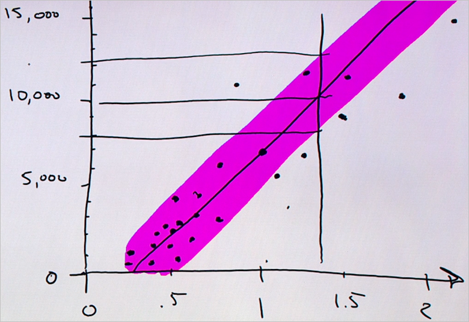

<properties
   pageTitle="Prévoir une réponse qui contient un modèle simple - modèle de régression | Microsoft Azure"
   description="Comment créer un modèle de régression simple pour prévoir un prix en sciences de données pour les débutants vidéo 4. Inclut une régression linéaire avec les données cible."                                  
   keywords="Créez un modèle, modèle simple, prédiction de prix, un modèle de régression simple"
   services="machine-learning"
   documentationCenter="na"
   authors="cjgronlund"
   manager="jhubbard"
   editor="cjgronlund"/>

<tags
   ms.service="machine-learning"
   ms.devlang="na"
   ms.topic="article"
   ms.tgt_pltfrm="na"
   ms.workload="na"
   ms.date="10/20/2016"
   ms.author="cgronlun;garye"/>

# Prévoir une réponse qui contient un modèle simple

## Vidéo 4 : Données scientifique pour série débutants

Découvrez comment créer un modèle de régression simple pour prévoir le prix d’un losange en sciences de données pour les débutants vidéo 4. Nous allons dessiner un modèle de régression avec les données cible.

Pour tirer le meilleur parti de la série, regardez tous les. [Accédez à la liste des vidéos](#other-videos-in-this-series)

> [AZURE.VIDEO data-science-for-beginners-series-predict-an-answer-with-a-simple-model]

## Autres vidéos dans cette série

*Données scientifique pour les débutants* est une brève introduction aux science de données à cinq courtes vidéos.

  * Vidéo 1 : [Les réponses aux 5 questions données scientifique](machine-learning-data-science-for-beginners-the-5-questions-data-science-answers.md) *(5 s 14 min)*
  * Vidéo 2 : [vos données n’est prêt pour scientifique données ?](machine-learning-data-science-for-beginners-is-your-data-ready-for-data-science.md) *(4 s 56 min)*
  * Vidéo 3 : [Poser une question, vous pouvez répondre à des données](machine-learning-data-science-for-beginners-ask-a-question-you-can-answer-with-data.md) *(sec 17 min 4)*
  * Vidéo 4 : Prévoir une réponse qui contient un modèle simple
  * Vidéo 5 : [Copier le travail d’autres personnes pour effectuer scientifique de données](machine-learning-data-science-for-beginners-copy-other-peoples-work-to-do-data-science.md) *(3 min 18 s)*

## Transcription : Prévoir une réponse qui contient un modèle simple

Bienvenue dans la vidéo dans le « données scientifique pour les débutants » quatrième série. Dans celle-ci, nous allons créer un modèle simple et établir une prévision.

Un *modèle* est un article simplifié sur nos données. Je vais vous montrer à ce que je veux dire.

## Collecter pertinent, précise connecté, suffisamment de données

Supposons que je souhaite un magasin pour un losange. J’ai un anneau appartenant à mon Mamie... avec un facteur d’un losange accent circonflexe 1,35, et je veux faire une idée de quel coût. J’ai effectuez un bloc-notes et du stylet dans le magasin bijoux, et je Notez le prix de toutes les losanges dans la casse et combien ils évaluer vos dans nombre de carats. En commençant par le premier losange - nombre de 1,01 carats ses et $7,366.

Vous pouvez traitée et procédez comme suit pour tous les autres losanges dans le magasin.

Notez que notre liste possède deux colonnes. Chaque colonne comporte un attribut différent : épaisseur dans nombre de carats et prix - et chaque ligne est un point de données qui représente un losange unique.

Nous avons créé en réalité un petit ensemble de données ici - une table. Notez qu’il répondre à des critères de qualité :

* Les données sont **pertinentes** - poids est certainement lié au prix
* Il s’agit **précis** - nous à double contrôle les prix nous écrire vers le bas
* Il est **connecté** , il y a aucun espace vide dans une de ces colonnes
* Et, comme nous allons le voir, il est **assez** de données pour répondre à notre question

## Poser une question dièse

À présent, nous allons poser votre question de façon à forte : « combien est le coût pour acheter un losange accent circonflexe 1,35 ? »

Notre liste n’est un losange accent circonflexe 1,35 qu’il contient, afin que nous allez devoir le reste de nos données permet d’obtenir une réponse à la question.

## Tracer les données existantes

Nous allons commencer par est dessiner une ligne horizontale de nombre, appelée un axe, pour les poids du graphique. La plage des poids est 0 à 2, commençons par dessiner un trait qui recouvre plage et placer des graduations pour chaque demi-pouce accent circonflexe.

Ensuite, nous allons dessiner un axe vertical pour enregistrer le prix et vous connecter à l’axe horizontal épaisseur. Il s’agit en unités de dollars. Nous avons un ensemble d’axes de coordonnées.

Nous allons pour effectuer ces données maintenant et transformer en une *tracer en nuages de points*. Il s’agit d’un excellent moyen pour visualiser des ensembles de données numériques.

Pour le premier point de données, nous se rendre compte une ligne verticale au nombre de carats 1,01. Ensuite, nous se rendre compte une ligne horizontale en $7,366. L’emplacement dans lequel ils répondent aux, nous dessiner un point. Il s’agit de notre premier losange.

Maintenant, nous traitée chaque losange sur cette liste et faire la même chose. Lorsque nous sommes via, il s’agit de ce que nous recevons : un certain nombre de points, un pour chaque losange.

## Dessiner le modèle à travers les points de données

Si vous examinez les points et squint, la collection ressemble maintenant à une ligne floue, graisse. Nous pouvons prendre notre marque et dessiner une ligne droite traversé.

En traçant un trait, nous avons créé un *modèle*. Considérer ceci comme prises réels et effectuer une version simple animé. Maintenant l’animation est incorrecte : la ligne n’aboutit pas tous les points de données. Mais, il s’agit d’une simplification utile.

Le fait que tous les points ne passent pas exactement par la ligne est OK. Scientifiques données expliquent cela en indiquant qu’il est le modèle - qui correspond à la ligne - et puis chaque point ou doit être certaines *bruit* *variation* associé. Il est la relation sous-jacente qui vous convient, il est le monde réel, détails qui ajoute bruit et incertitude

Étant donné que nous essayons de répondre à la question *quantité ?* il s’agit d’une *régression*. Et étant donné que nous utilisons une ligne droite, il s’agit d’une *régression linéaire*.

## Utiliser le modèle pour trouver la réponse

À présent nous disposons d’un modèle et nous demandez à votre question : combien coûteront losange accent circonflexe 1,35 ?

Pour répondre à votre question, nous se rendre compte le nombre de carats 1,35 et dessiner une ligne verticale. Intersection de la ligne de modèle, il et nous se rendre compte d’une ligne horizontale à l’axe en euros. Il atteigne droite à 10 000. Flèche ! C’est la réponse : losange accent circonflexe 1,35 coûte environ 10 000 $.

## Créer un intervalle de confiance

Il est naturel de vous demander comment précis cette prévision est. Il est utile de savoir si le losange accent circonflexe 1,35 est très près de 10 000 $, ou bien supérieur ou inférieur. Pour déterminer ce que, nous allons dessiner la ligne de régression qui inclut la plupart des points d’une enveloppe. Cette enveloppe est appelée notre *intervalle de confiance*: nous sommes assez sûr que les prix sont compris dans cette enveloppe, car la plus ancienne d'entre elles ont. Nous pouvons dessiner deux lignes horizontaux supplémentaires à partir de l’intersection de la ligne accent circonflexe 1,35 haut et bas qu’elle contient.

À présent, nous pouvons fournir des informations sur notre intervalle de confiance : nous pouvons dire en toute confiance que le prix d’un losange accent circonflexe 1,35 est environ $ 10 000 -, mais cela peut être jusqu'à 8 000 $ et il peut être aussi élevée que 12 000 $.

## Nous avons terminé, sans mathématiques ou ordinateurs

Nous l’avons fait quels scientifiques données obtenir payés faire et nous l’avons fait simplement en dessinant :

* Nous envoie une question que nous pourrions répondre à des données
* Nous avons créé un *modèle* à l’aide de *régression linéaire.*
* Nous avons apporté une *prévision*, procédez comme avec un *intervalle de confiance*

Et nous n’a pas été utiliser mathématiques ou ordinateurs au pour faire.

Maintenant si nous avions avait plus d’informations, telle que...

* Couper du losange
* variations de couleurs (comment fermer le losange est en cours blanc)
* le nombre d’inclusions dans le losange

… puis nous aurait dû davantage de colonnes. Dans ce cas, mathématiques devient utiles. Si vous avez plus de deux colonnes, il est difficile à dessiner points sur du papier. Ces opérations mathématiques vous permet de tenir parfaitement cette ligne ou ce plan à vos données.

En outre, si au lieu de quelques-unes des losanges, nous avons rencontré deux mille ou deux millions, puis vous pouvez faire ce travail beaucoup plus rapidement avec un ordinateur.

Aujourd'hui, sur la droite de régression linéaire, nous avons, et nous avons apporté une prévision à l’aide de données.

Veillez à consulter les autres vidéos dans « Données scientifique pour les débutants » de Microsoft Azure Machine Learning.

## Étapes suivantes

  * [Essayez d’une expérience scientifique données première avec Machine apprentissage Studio](machine-learning-create-experiment.md)
  * [Découvrez apprentissage automatique sur Microsoft Azure](machine-learning-what-is-machine-learning.md)
