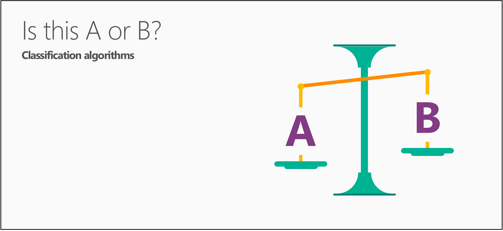
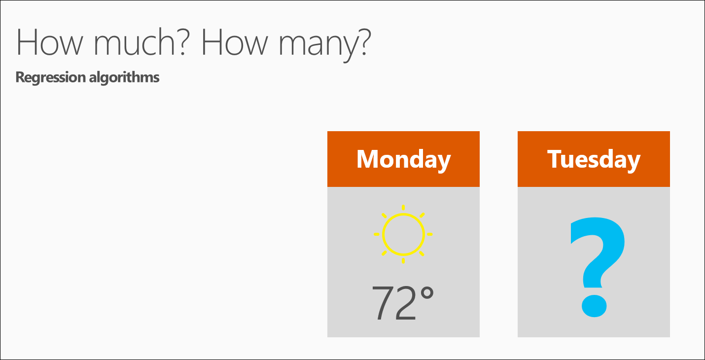

<properties
   pageTitle="Les questions science 5 données - scientifique de données pour les débutants | Microsoft Azure"
   description="Obtenir une brève introduction aux scientifique de données à partir des données pour les débutants, cinq courtes vidéos qui commencent par la 5 Questions données scientifique réponses."
   keywords="effectuant scientifique de données, les débutants données scientifique, scientifique de données pour les débutants, les types de questions, questions science de données, les appels données scientifique vidéo"
   services="machine-learning"
   documentationCenter="na"
   authors="cjgronlund"
   manager="jhubbard"
   editor="cjgronlund"/>

<tags
   ms.service="machine-learning"
   ms.devlang="na"
   ms.topic="article"
   ms.tgt_pltfrm="na"
   ms.workload="na"
   ms.date="10/20/2016"
   ms.author="cgronlun;garye"/>

# Données scientifique pour les débutants vidéo 1 : 5 les questions réponses scientifique de données

Obtenir une brève introduction aux scientifique de données à partir *Des données pour les débutants* dans cinq courtes vidéos à partir d’un scientifique données supérieure. Ces vidéos sont simple mais utile, si vous êtes intéressé effectuant scientifique de données ou vous travaillez avec des scientifiques de données.

Cette vidéo première fait sur les types de questions science données peut répondre. Pour tirer le meilleur parti de la série, regardez tous les. [Accédez à la liste des vidéos](#other-videos-in-this-series)

> [AZURE.VIDEO data-science-for-beginners-series-the-5-questions-data-science-answers]

## Autres vidéos dans cette série

*Données scientifique pour les débutants* est une brève introduction aux données scientifique prise total de 25 minutes. Consultez les quatre autres vidéos :

  * Vidéo 1 : Les 5 questions réponses scientifique de données
  * Vidéo 2 : [vos données n’est prêt pour scientifique données ?](machine-learning-data-science-for-beginners-is-your-data-ready-for-data-science.md) *(4 s 56 min)*
  * Vidéo 3 : [Poser une question, vous pouvez répondre à des données](machine-learning-data-science-for-beginners-ask-a-question-you-can-answer-with-data.md) *(sec 17 min 4)*
  * Vidéo 4 : [Prévoir une réponse qui contient un modèle simple](machine-learning-data-science-for-beginners-predict-an-answer-with-a-simple-model.md) *(7 min 42 s)*
  * Vidéo 5 : [Copier le travail d’autres personnes pour effectuer scientifique de données](machine-learning-data-science-for-beginners-copy-other-peoples-work-to-do-data-science.md) *(3 min 18 s)*

## Transcription : Les 5 questions réponses scientifique de données

Salut ! Bienvenue dans la série de vidéos *Scientifique de données pour les débutants*.

Données scientifique peut être intimidant, donc je vais présenter ici les notions de base sans équations ou programmation jargon informatique.

Dans cette première vidéo, nous aborderons « les 5 questions réponses scientifique de données ».

Données scientifique utilise numéros et noms (également appelé catégories ou étiquettes) pour prévoir des réponses aux questions.

Il peut vous surprendre, mais *il existe cinq uniquement aux questions que réponses scientifique de données*:

  * Est-ce A ou B ?
  * S’agit-il étrange ?
  * Quantité – ou – combien ?
  * Comment est organisé ?
  * Que dois-je faire ensuite ?

  Chacune de ces questions réponse est fournie par une famille de méthodes d’apprentissage machine, appelés algorithmes distincte.

Il est important de réfléchir à un algorithme à une recette et vos données en tant que les composants. Un algorithme explique comment permet de combiner et combiner les données afin d’obtenir une réponse. Ordinateurs ressemblent à un mélangeur. Ils effectuent la plus grande partie du travail de l’algorithme pour vous et ce assez rapidement.

## Question 1 : Est cette A ou B ? utilise des algorithmes classification

Commençons par la question : est cette A ou B ?

Cette famille d’algorithmes est appelée classification deux cours.

Il est utile pour toute question avec deux réponses possibles.

Par exemple :

  * Cette pneumatique échouera dans les 1 000 miles suivantes : Oui ou non ?
  * Ce qui amène dans davantage de clients : un coupon $5 ou une remise de 25 % ?

Cette question peut également être rephrased pour inclure plus de deux options : est cette A B ou C ou D, etc.. ?  Cette option est appelée classification multiclass et il est utile lorsque vous avez plusieurs — ou plusieurs milliers — réponses possibles. Classification multiclass choisit celle probablement.

## Question 2 : S’agit-il étrange ? utilise des algorithmes de détection des anomalies

La question suivante scientifique données peut répondre à est : est cette étrange ? Cette réponse est fournie par une famille d’algorithmes appelés détection des anomalies.

Si vous avez une carte de crédit, vous avez déjà bénéficié de détection des anomalies. Votre société de carte de crédit analyse vos habitudes d’achat, afin qu’ils vous avertit fraude possible. Frais qui sont « étrange » peuvent être un achat auprès d’un magasin dans laquelle vous n’achetez normalement ou acheter un élément inhabituelle inutile.

Cette question peut être utile dans d’autres ressources. Par exemple :

  * Si vous avez une voiture avec indicateurs de pression, vous voudrez : est cette jauge de pression lecture normale ?
  * Si vous êtes surveillance internet, vous avez besoin : est ce message à partir d’internet classique ?

Détection des anomalies indicateurs événements inattendus ou inhabituels ou comportements. Elle vous donne indices où rechercher les problèmes.

## Question 3 : Quantité ? ou comment nombreux ? utilise des algorithmes de régression

Apprentissage automatique permet également de prédire la réponse qu’il faut beaucoup ? ou comment nombreux ? Famille d’algorithmes qui répond à cette question est appelée régression.

Algorithmes de régression rendre des prédictions numériques, tels que :

  * Quel sera la température mardi prochain ?  
  * Quel sera mon quatrième ventes du trimestre ?

Ils vous permettent de répondre à une question à laquelle vous invite à fournir un nombre.

## Question 4 : Comment cela organisation ? utilisations algorithmes de groupement

Les deux derniers questions sont désormais un peu plus avancé.

Vous souhaitez parfois comprendre la structure d’un jeu de données - comment cela organisée ? Pour cette question, vous n’avez pas exemples que vous connaissez déjà des résultats pour.

Il existe de nombreuses façons de se déconnecter la structure des données. L’une des approches cluster. Il sépare les données en Natural Keyboard » rassemble, » pour simplifier l’interprétation. Avec mise en cluster, il n’est pas une bonne réponse.

Exemples de questions cluster sont :

  * Les visionneuses tels que les mêmes types de vidéos ?
  * Les modèles d’imprimante échouent la même façon ?

Comprenez l’organisation des données, vous pouvez mieux comprendre - et prévoir - comportements et événements.  

## Question 5 : Que dois-je faire maintenant ? utilise ARMATURE algorithmes d’apprentissage

La dernière question : que dois-je faire maintenant ? – utilise une famille d’algorithmes appelés apprentissage armature.

Formation ARMATURE a été inspirée par la façon dont le cerveau de rats et l’homme répondre aux peine et des avantages. Ces algorithmes tirer les enseignements de résultats, puis décider de l’action suivante.

En règle générale, l’apprentissage ARMATURE est adaptée aux systèmes automatisés qui doivent effectuer un nombre important de petites décisions sans l’aide humaine.

Il fournit des réponses à des questions sont toujours sur les mesures devraient être prises - généralement par un ordinateur ou d’un robot. Les exemples sont :

  * Si je suis un système de contrôle de température d’une maison : ajuster la température ou laissez-la où il est ?  
  * Si je suis une voiture automatique conduite : en orange, frein ou accélérer ?  
  * Pour vide robot : conservez ramasse-miettes ou revenir à la console en charge ?

Algorithmes d’apprentissage ARMATURE collectent des données qu’ils accéder, apprentissage à partir de la version d’évaluation et d’erreurs.

C’est qu’il - scientifique de données 5 les questions peut répondre.

## Étapes suivantes

  * [Essayez d’une expérience scientifique données première avec Machine apprentissage Studio](machine-learning-create-experiment.md)
  * [Découvrez apprentissage automatique sur Microsoft Azure](machine-learning-what-is-machine-learning.md)
