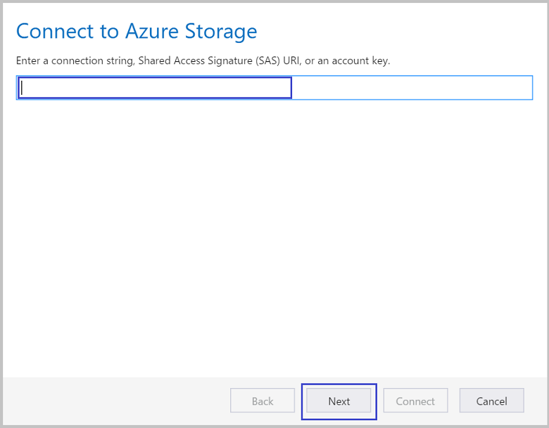

<properties 
    pageTitle="Déplacer des données vers et depuis le stockage Blob Azure à l’aide de l’Explorateur de stockage Azure | Microsoft Azure" 
    description="Déplacer des données vers et depuis le stockage Blob Azure à l’aide de l’Explorateur de stockage Azure" 
    services="machine-learning,storage" 
    documentationCenter="" 
    authors="bradsev" 
    manager="jhubbard" 
    editor="cgronlun" />

<tags 
    ms.service="machine-learning" 
    ms.workload="data-services" 
    ms.tgt_pltfrm="na" 
    ms.devlang="na" 
    ms.topic="article" 
    ms.date="08/31/2016"
    ms.author="bradsev" />

# Déplacer des données vers et depuis le stockage Blob Azure à l’aide de l’Explorateur de stockage Azure

Explorateur de stockage Azure est un outil gratuit de Microsoft qui permet de travailler avec des données de stockage Azure sous Windows, Mac OS et Linux. Cette rubrique explique comment l’utiliser pour charger et télécharger des données depuis le stockage blob Azure. L’outil peut être téléchargé à partir de [l’Explorateur de stockage de Microsoft Azure](http://storageexplorer.com/).

Conseils sur les technologies utilisées pour déplacer des données à portée de main et/ou depuis le stockage Blob Azure sont liées ici :
 
[AZURE.INCLUDE [blob-storage-tool-selector](../../includes/machine-learning-blob-storage-tool-selector.md)]   

 
> [AZURE.NOTE] Si vous utilisez un ordinateur virtuel qui a été créée avec les scripts fournis par [données scientifique Virtual machines dans Azure](machine-learning-data-science-virtual-machines.md), Explorateur de stockage Azure est déjà installé sur l’ordinateur virtuel.
 
> [AZURE.NOTE] Pour une présentation complète de stockage d’objets blob Azure, reportez-vous à [Concepts de base Blob Azure](../storage/storage-dotnet-how-to-use-blobs.md) et [Service d’objets Blob Azure](https://msdn.microsoft.com/library/azure/dd179376.aspx).   

## Conditions préalables

Ce document suppose que vous avez un abonnement Azure, un compte de stockage et la clé de stockage correspondante pour ce compte. Avant de télécharger/télécharger des données, vous devez connaître votre clé de compte et nom de compte stockage Azure. 

- Pour configurer un abonnement Azure, consultez la [version d’évaluation gratuite d’un mois](https://azure.microsoft.com/pricing/free-trial/).
- Pour obtenir des instructions sur la création d’un compte de stockage et pour obtenir des informations de compte et clées, voir [comptes de stockage sur Azure](../storage/storage-create-storage-account.md). Notez la touche d’accès rapide pour votre compte de stockage dont vous avez besoin cette clé pour vous connecter à ce compte avec l’outil Explorateur de stockage Azure.
- L’outil Azure Storage Explorer peut être téléchargé à partir de [l’Explorateur de stockage de Microsoft Azure](http://storageexplorer.com/). Acceptez les paramètres par défaut lors de l’installation.

## Utilisez l’Explorateur de stockage Azure 

Les étapes suivantes expliquer comment télécharger des données à l’aide de l’Explorateur de stockage Azure. 

1.  Lancer l’Explorateur d’espace de stockage de Microsoft Azure.
2.  Pour faire apparaître l’Assistant **se connecter à votre compte...** , sélectionnez l’icône **paramètres de compte Azure** , puis **Ajouter un compte** et que vous entrez des informations d’identification. 
3.  Pour faire apparaître l’Assistant **se connecter au stockage Azure** , sélectionnez l’icône de **se connecter au stockage Azure** . 
4. Entrez la touche d’accès rapide à partir de votre compte de stockage Azure dans l’Assistant de **se connecter au stockage Azure** puis cliquez sur **suivant**. 
5. Entrez le nom de compte de stockage dans la zone **nom de compte** , puis sélectionnez **suivant**. 
6. Ajouté le compte de stockage doit maintenant être affiché. Pour créer un conteneur blob dans un compte de stockage, cliquez sur le nœud de **Conteneurs Blob** dans ce compte, sélectionnez **Créer un conteneur Blob**et entrez un nom.
7. Pour télécharger des données dans un conteneur, sélectionnez le conteneur cible, puis cliquez sur le bouton **Télécharger** .
8. Cliquez sur le bouton **...** à droite de la zone de **fichiers** , sélectionnez un ou plusieurs fichiers à télécharger du système de fichiers, puis cliquez sur **Télécharger** pour commencer à télécharger les fichiers.
7. Pour télécharger des données, sélectionnez l’objet blob dans le conteneur correspondant à télécharger, puis cliquez sur **Télécharger**. 

