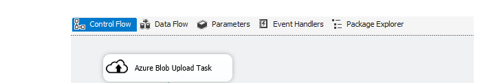

<properties
    pageTitle="Déplacer des données vers ou à partir de stockage d’objets Blob Azure à l’aide de connecteurs SSIS | Microsoft Azure"
    description="Déplacer des données vers ou à partir de stockage d’objets Blob Azure à l’aide de connecteurs SSIS."
    services="machine-learning,storage"
    documentationCenter=""
    authors="bradsev"
    manager="jhubbard"
    editor="cgronlun" />

<tags
    ms.service="machine-learning"
    ms.workload="data-services"
    ms.tgt_pltfrm="na"
    ms.devlang="na"
    ms.topic="article"
    ms.date="09/14/2016"
    ms.author="bradsev" />

# Déplacer des données vers ou à partir de stockage d’objets Blob Azure à l’aide de connecteurs SSIS

Le [SQL Server Integration Services Feature Pack pour Azure](https://msdn.microsoft.com/library/mt146770.aspx) fournit des composants pour vous connecter à Azure, transfèrent des données entre Azure et sources de données locales et traiter les données stockées dans Azure.

Conseils sur les technologies utilisées pour déplacer des données à portée de main et/ou depuis le stockage Blob Azure sont liées ici :

[AZURE.INCLUDE [blob-storage-tool-selector](../../includes/machine-learning-blob-storage-tool-selector.md)]

Une fois que les clients ont été déplacées données locales dans le nuage, ils peuvent y parvenir à partir de n’importe quel service de tirer parti de la puissance de la gamme de technologies d’assistance Azure Azure. Il peut être utilisé, par exemple, dans l’apprentissage d’automatique Azure ou sur un cluster HDInsight.

Il s’agit généralement être la première étape pour les procédures [SQL](machine-learning-data-science-process-sql-walkthrough.md) et [HDInsight](machine-learning-data-science-process-hive-walkthrough.md) .

Pour connaître les scénarios canoniques qui utilisent SSIS pour obtenir les besoins professionnels courants dans les scénarios d’intégration de données hybride, consultez le blog de [faire plus avec SQL Server Integration Services Feature Pack pour Azure](http://blogs.msdn.com/b/ssis/archive/2015/06/25/doing-more-with-sql-server-integration-services-feature-pack-for-azure.aspx) .

> [AZURE.NOTE] Pour une présentation complète de stockage d’objets blob Azure, reportez-vous à [Concepts de base Blob Azure](../storage/storage-dotnet-how-to-use-blobs.md) et au [Service d’objets Blob Azure](https://msdn.microsoft.com/library/azure/dd179376.aspx).

## Conditions préalables

Pour effectuer les tâches décrites dans cet article, vous devez disposer d’un abonnement Azure et un compte de stockage Azure configuré. Vous devez connaître votre stockage Azure nom et compte clé de compte à charger ou télécharger des données.

- Pour configurer un **abonnement Azure**, consultez la [version d’évaluation gratuite d’un mois](https://azure.microsoft.com/pricing/free-trial/).

- Pour obtenir des instructions sur la création d’un **compte de stockage** et pour obtenir des informations de compte et clées, voir [comptes de stockage sur Azure](../storage/storage-create-storage-account.md).

Pour utiliser les **connecteurs SSIS**, vous devez télécharger :

- **SQL Server 2014 ou 2016 Standard (ou version ultérieure)**: installation comprend SQL Server Integration Services.
- **Microsoft SQL Server 2014 ou 2016 Integration Services Feature Pack pour Azure**: ils peuvent être téléchargés, respectivement, dans les pages de [SQL Server 2014 Integration Services](http://www.microsoft.com/download/details.aspx?id=47366) et [SQL Server 2016 Integration Services](https://www.microsoft.com/download/details.aspx?id=49492) .

> [AZURE.NOTE] SSIS est installé avec SQL Server, mais n’est pas inclus dans la version Express. Pour plus d’informations sur quelles applications sont incluses dans les différentes éditions de SQL Server, voir [Éditions de SQL Server](http://www.microsoft.com/en-us/server-cloud/products/sql-server-editions/)

Pour les supports de cours de formation sur SSIS, reportez-vous à la [Formation sur mains pour SSIS](http://www.microsoft.com/download/details.aspx?id=20766)

Pour plus d’informations sur l’obtention d’accès et d’exécution utilisation SISS pour créer d’extraction, transformation et chargement (ETL) packages, simple, voir [SSIS didacticiel : créer un Package ETL Simple](https://msdn.microsoft.com/library/ms169917.aspx).

## Télécharger NYC Taxi dataset  
L’exemple décrit ici utilise un jeu de données accessible au public--dataset [NYC Taxi voyages](http://www.andresmh.com/nyctaxitrips/) . Le jeu de données est constitué d’environ 173 millions taxi trajets dans NYC dans l’année 2013. Il existe deux types de données : voyage détails des données de données et de prix. Comme un fichier pour chaque mois, nous avons 24 fichiers dans l’ensemble, chacun d’eux étant environ 2 Go sans compression.

## Télécharger des données à Azure blob storage
Pour déplacer des données à l’aide de SSIS du feature pack locales à Azure blob storage, nous utilisons une instance de la [**Tâche de télécharger Blob Azure**](https://msdn.microsoft.com/library/mt146776.aspx), illustré ici :

Les paramètres de la tâche sont décrites ici :

Champ|Description|
----------------------|----------------|
**AzureStorageConnection**|Spécifie un gestionnaire de connexions de stockage Azure existant ou crée un nouveau qui fait référence à un compte de stockage Azure qui pointe vers l’endroit où se trouvent les fichiers blob.|
**BlobContainer**|Spécifie le nom du conteneur blob qui contiennent les fichiers téléchargés comme des objets BLOB.|
**BlobDirectory**|Spécifie le répertoire blob où se trouve le fichier téléchargé comme blob bloc. Le répertoire blob est une structure hiérarchique virtuelle. Si le blob existe déjà, il a ia remplacé.|
**LocalDirectory**|Spécifie le répertoire local qui contient les fichiers à télécharger.|
**Nom de fichier**|Spécifie un filtre de nom pour sélectionner des fichiers avec le modèle de nom spécifié. Par exemple, MySheet\*.xls\* inclut les fichiers tels que MySheet001.xls et MySheetABC.xlsx|
**TimeRangeFrom/TimeRangeTo**|Spécifie un filtre plage horaire. Fichiers modifiés après *TimeRangeFrom* et avant *TimeRangeTo* sont incluses.|

> [AZURE.NOTE] Les informations d’identification **AzureStorageConnection** doivent être correctes et le **BlobContainer** doivent exister avant du transfert.

## Télécharger des données depuis le stockage blob Azure

Pour télécharger des données depuis le stockage blob Azure stockage avec SSIS sur site, utilisez une instance de la [Tâche de télécharger Blob Azure](https://msdn.microsoft.com/library/mt146779.aspx).

##Scénarios SSIS Azure plus avancées
Nous Notez ici que le feature pack SSIS permet aux flux plus complexes à être gérés par des tâches emballage ensemble. Par exemple, les données blob pourraient flux directement à un cluster de HDInsight, dont la sortie pu être téléchargée à un blob, puis vers le stockage sur site. SSIS peuvent s’exécuter travaux Hive et cochon sur un cluster de HDInsight à l’aide des connecteurs SSIS supplémentaires :

- Pour exécuter un script Hive sur un cluster Azure HDInsight avec SSIS, utilisez [Azure HDInsight ruche tâche](https://msdn.microsoft.com/library/mt146771.aspx).
- Pour exécuter un script cochon sur un cluster Azure HDInsight avec SSIS, utilisez [Azure HDInsight cochon tâche](https://msdn.microsoft.com/library/mt146781.aspx).
