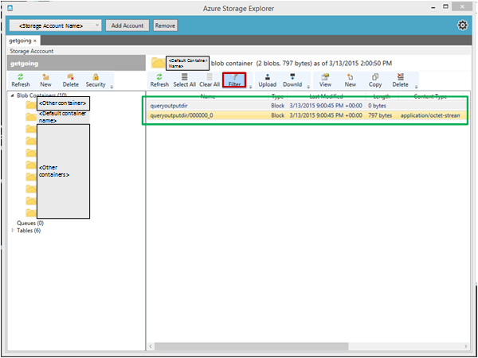

<properties
    pageTitle="Créer et charger les données en tables Hive depuis le stockage Blob | Microsoft Azure"
    description="Créer des tables Hive et charger les données dans blob vers la ruche tables"
    services="machine-learning,storage"
    documentationCenter=""
    authors="bradsev"
    manager="jhubbard"
    editor="cgronlun" />

<tags
    ms.service="machine-learning"
    ms.workload="data-services"
    ms.tgt_pltfrm="na"
    ms.devlang="na"
    ms.topic="article"
    ms.date="09/14/2016"
    ms.author="bradsev" />

#Créer et charger les données en tables Hive depuis le stockage blob Azure

Cette rubrique présente les requêtes Hive génériques créer les tables Hive et chargent les données depuis le stockage blob Azure. Quelques recommandations sont également disponible sur partition Hive tables et sur l’utilisation de l’optimisée ligne en colonnes (ORC) mise en forme pour améliorer les performances des requêtes.

Cette **menu** fournit des liens vers des rubriques qui décrivent l’acquisition de données dans des environnements cible où les données peuvent être stockées et traitées pendant le processus de Science de données (TDSP) d’équipe.

[AZURE.INCLUDE [cap-ingest-data-selector](../../includes/cap-ingest-data-selector.md)]

## Conditions préalables
Cet article suppose que vous avez :

* Créer un compte de stockage Azure. Si vous avez besoin d’instructions, voir [comptes de stockage sur Azure](../storage/storage-create-storage-account.md). 
* Mise en service un cluster Hadoop personnalisée avec le service HDInsight.  Si vous avez besoin d’instructions, voir [Personnaliser Azure HDInsight Hadoop clusters pour analytique avancées](machine-learning-data-science-customize-hadoop-cluster.md).
* Accès à distance activés pour le cluster, connecté et ouvert la console de ligne de commande Hadoop. Si vous avez besoin d’instructions, voir [le nœud de tête de Hadoop Cluster l’accès](machine-learning-data-science-customize-hadoop-cluster.md#headnode).

## Télécharger des données à Azure blob storage
Si vous avez créé une machine virtuelle Azure en suivant les instructions fournies dans [configurer une machine virtuelle Azure analytique avancées](machine-learning-data-science-setup-virtual-machine.md), ce fichier de script doit ont été téléchargé vers le *C:\\utilisateurs\\\<nom d’utilisateur\>\\Documents\\données scientifique Scripts* répertoire sur l’ordinateur virtuel. Ces requêtes Hive uniquement exigent que vous branchez votre propre schéma de données et la configuration du stockage blob Azure dans les champs appropriés pour être prêt pour la présentation.

Nous part du principe que les données des tables Hive soient dans un format tabulaire **compressées** et que les données ont été téléchargées par défaut (ou plus) conteneur du compte de stockage utilisé par le cluster Hadoop.

Si vous voulez exercices pratiques dans les **Données de voyage NYC Taxi**, vous devez :

- fichiers de [Données de voyage NYC Taxi](http://www.andresmh.com/nyctaxitrips) **Télécharger** les 24 (12 fichiers voyage et 12 fichiers tarif),
- **décompressez** tous les fichiers dans des fichiers .csv, puis
- **Télécharger** les par défaut (ou conteneur approprié) du compte de stockage Azure qui a été créé par la procédure décrites dans la rubrique [clusters personnaliser Azure HDInsight Hadoop pour avancées Analytique processus et technologie](machine-learning-data-science-customize-hadoop-cluster.md) . Vous trouverez la procédure à suivre pour télécharger les fichiers .csv dans le conteneur par défaut sur le compte de stockage sur cette [page](machine-learning-data-science-process-hive-walkthrough.md#upload).

## Comment envoyer les requêtes Hive

Requêtes Hive peuvent être soumises à l’aide de :

1. [Soumettre des requêtes Hive par ligne de commande Hadoop dans headnode d’Hadoop cluster](#headnode)
2. [Soumettre des requêtes Hive avec l’éditeur ruche](#hive-editor)
3. [Soumettre des requêtes Hive avec des commandes PowerShell Azure](#ps)

Les requêtes Hive sont similaire à SQL. Si vous êtes habitué à SQL, vous trouverez peut-être la [ruche pour SQL utilisateurs aide-mémoire](http://hortonworks.com/wp-content/uploads/2013/05/hql_cheat_sheet.pdf) utiles.

Lorsque vous envoyez une requête Hive, vous pouvez également contrôler la destination de la sortie à partir de requêtes Hive, qu’il s’agisse dans l’écran ou dans un fichier local sur le nœud principal ou à un blob Azure.

###1. Entrez des requêtes de Hive par ligne de commande Hadoop dans headnode d’Hadoop cluster

Si la requête Hive est complexe, soumettre directement dans le nœud principal de la Hadoop cluster généralement permet d’accéder à contourner plus rapidement à l’envoi avec un éditeur ruche ou Azure PowerShell scripts.

Se connecter au nœud de tête du cluster Hadoop, ouvrez la ligne de commande Hadoop sur le bureau du nœud principal et entrez la commande `cd %hive_home%\bin`.

Vous avez trois manières de soumettre Hive requêtes dans la ligne de commande Hadoop :

* directement
* utiliser des fichiers .hql
* Grâce à la console de commande Hive

#### Envoyer des requêtes Hive directement dans Hadoop ligne de commande.

Vous pouvez exécuter la commande comme `hive -e "<your hive query>;` à soumettre des requêtes simples Hive directement dans Hadoop ligne de commande. Voici un exemple, où la zone rouge présente la commande qui envoie la requête Hive, et la zone verte présente le résultat de la requête Hive.

#### Soumettre des requêtes Hive dans les fichiers .hql

Lorsque la requête Hive est plus complexe et comporte plusieurs lignes, la modification de requêtes dans la ligne de commande ou console de commande Hive n’est pas pratique. Une alternative consiste à utiliser un éditeur de texte dans le nœud de tête du cluster Hadoop pour enregistrer les requêtes Hive dans un fichier .hql dans un répertoire local du nœud principal. Puis la requête Hive dans le fichier .hql peut être soumise à l’aide de la `-f` argument comme suit :

    hive -f "<path to the .hql file>"

**Supprimer l’impression d’écran état de l’avancement de requêtes Hive**

Par défaut, une fois Hive requête envoyée en ligne de commande Hadoop, la progression de la tâche de mappage/réduction est imprimée sur écran. Pour supprimer l’impression de l’écran de l’avancement de tâche de mappage/réduction, vous pouvez utiliser un argument `-S` (« S » en majuscules) dans la commande ligne comme suit :

    hive -S -f "<path to the .hql file>"
    hive -S -e "<Hive queries>"

#### Envoyer des requêtes Hive dans console de commande Hive.

Vous pouvez également tout d’abord accéder à la console de commande Hive en exécutant la commande `hive` en ligne de commande Hadoop, puis soumettez requêtes Hive dans console de commande Hive. Voici un exemple. Dans cet exemple, les deux cases rouge mettez en surbrillance les commandes utilisées pour accéder à la console de commande Hive et la requête Hive envoyés dans la console de commande Hive, respectivement. La zone verte met en surbrillance le résultat de la requête Hive.

Les exemples précédents représentation directement les résultats de la requête Hive sur écran. Vous pouvez également écrire la sortie dans un fichier local sur le nœud de tête, ou pour un blob Azure. Ensuite, vous pouvez utiliser d’autres outils pour analyser la sortie de requêtes Hive.

**Représentation Hive résultats de la requête dans un fichier local.**

Pour exporter les résultats de la requête Hive dans un répertoire local sur le nœud principal, vous devez soumettre la requête Hive dans la ligne de commande Hadoop comme suit :

    hive -e "<hive query>" > <local path in the head node>

Dans l’exemple suivant, la sortie de requête Hive est écrite dans un fichier `hivequeryoutput.txt` dans le répertoire `C:\apps\temp`.

**Résultats de la requête Hive sortie à un blob Azure**

Vous pouvez également exporter les résultats de la requête Hive à un blob Azure, dans le conteneur par défaut du cluster Hadoop. La requête Hive pour cela est la suivante :

    insert overwrite directory wasb:///<directory within the default container> <select clause from ...>

Dans l’exemple suivant, la sortie de requête Hive est écrite dans un répertoire blob `queryoutputdir` dans le conteneur par défaut du cluster Hadoop. Dans ce cas, il vous suffit fournir le nom du répertoire, sans le nom du blob. Une erreur est renvoyée si vous fournissez des noms de répertoire et blob, tel que `wasb:///queryoutputdir/queryoutput.txt`.

Si vous ouvrez le conteneur par défaut du cluster Hadoop à l’aide de l’Explorateur de stockage Azure, vous pouvez voir le résultat de la requête Hive comme indiqué dans l’illustration suivante. Vous pouvez appliquer le filtre (en surbrillance en cadre rouge) pour récupérer uniquement l’objets blob avec lettres spécifiées dans les noms.

###2. soumettre Hive requêtes avec l’éditeur ruche

Vous pouvez également utiliser la Console de requête (ruche éditeur) en entrant une URL de l’écran *https://&#60 ; Nom du cluster Hadoop >.azurehdinsight.net/Home/HiveEditor* dans un navigateur web. Vous devez être connecté le voir cette console et vous pouvez donc vos informations d’identification Hadoop le cluster.

###3. soumettre des requêtes Hive avec des commandes PowerShell Azure

Vous pouvez également utiliser PowerShell pour soumettre des requêtes Hive. Pour obtenir des instructions, voir [soumettre la ruche des travaux à l’aide de PowerShell](../hdinsight/hdinsight-submit-hadoop-jobs-programmatically.md#hive-powershell).

## Créer des tables et base de données Hive

Les requêtes Hive sont partagées dans le [référentiel Github](https://github.com/Azure/Azure-MachineLearning-DataScience/tree/master/Misc/DataScienceProcess/DataScienceScripts/sample_hive_create_db_tbls_load_data_generic.hql) et peuvent être téléchargés à partir de cet emplacement.

Voici la requête Hive qui crée une table Hive.

    create database if not exists <database name>;
    CREATE EXTERNAL TABLE if not exists <database name>.<table name>
    (
        field1 string,
        field2 int,
        field3 float,
        field4 double,
        ...,
        fieldN string
    )
    ROW FORMAT DELIMITED FIELDS TERMINATED BY '<field separator>' lines terminated by '<line separator>'
    STORED AS TEXTFILE LOCATION '<storage location>' TBLPROPERTIES("skip.header.line.count"="1");

Voici les descriptions des champs dont vous avez besoin de plug-in et les autres configurations :

- **& #60 ; nom de la base de données >**: le nom de la base de données que vous voulez créer. Si vous souhaitez simplement utiliser la base de données par défaut, la requête *Création de base de données...* peut être omis.
- **& #60 ; nom de la table >**: le nom de la table que vous voulez créer au sein de la base de données spécifiée. Si vous souhaitez utiliser la base de données par défaut, la table peut être directement référencée par *& #60 ; nom de la table >* sans & #60 ; nom de la base de données >.
- **& #60 ; séparateur de champ >**: le séparateur qui délimite les champs dans le fichier de données à télécharger dans la table Hive.
- **& #60 ; séparateur de ligne >**: le séparateur qui délimite des lignes dans le fichier de données.
- **& #60 ; emplacement de stockage >**: l’emplacement de stockage Azure pour enregistrer les données de tables Hive. Si vous ne spécifiez pas *emplacement & #60 ; emplacement de stockage >*, la base de données et les tables sont stockés dans *hive/entrepôt/* répertoire dans le conteneur par défaut du cluster Hive par défaut. Si vous souhaitez spécifier l’emplacement de stockage, l’emplacement de stockage doit se trouver dans le conteneur par défaut pour la base de données et les tables. Cet emplacement a d’être désignés en tant qu’emplacement par rapport au conteneur par défaut du cluster dans le format de *' wasb : / / / & #60 ; répertoire 1 > /'* ou *' wasb : / / / & #60 ; répertoire 1 > / & répertoire 2 ; #60 > /'*, etc.. Une fois que la requête est exécutée, les répertoires relatives sont créés dans le conteneur par défaut.
- **TBLPROPERTIES("Skip.Header.Line.Count"="1")**: si le fichier de données comporte une ligne d’en-tête, vous devez ajouter cette propriété **à la fin** de la requête *Création de table* . Sinon, la ligne d’en-tête est chargée en tant qu’un enregistrement à la table. Si le fichier de données n’a pas d’une ligne d’en-tête, cette configuration peut être omise dans la requête.

## Charger les données aux tables Hive
Voici la requête Hive qui charge des données dans une table Hive.

    LOAD DATA INPATH '<path to blob data>' INTO TABLE <database name>.<table name>;

- **& #60 ; chemin d’accès aux données blob >**: si le fichier blob être téléchargé vers la table Hive se trouve dans le conteneur par défaut du cluster HDInsight Hadoop, la *& #60 ; chemin d’accès aux données blob >* doit se trouver dans le format *' wasb : / / / & #60 ; répertoire dans ce conteneur > / & #60 ; nom de fichier blob >'*. Le fichier blob peut également être dans un conteneur supplémentaire du cluster HDInsight Hadoop. Dans ce cas, *& #60 ; chemin d’accès aux données blob >* doit se trouver dans le format *' wasb : / / & #60 ; conteneur name>@&#60;storage nom du compte >.blob.core.windows.net/ & #60 ; nom de fichier blob >'*.

    >[AZURE.NOTE] Les données blob être téléchargé vers table Hive doit se trouver dans un conteneur supplémentaire du compte de stockage pour le cluster Hadoop ou par défaut. Dans le cas contraire, la requête de *Chargement de données* échoue réclamation qu’il ne peut pas accéder aux données.

## Informations complémentaires : partition table et banque de données Hive au format ORC

Si les données sont volumineuses, partition la table est utile pour les requêtes seulement vous avez besoin pour analyser plusieurs partitions de la table. Par exemple, il est judicieux de partition les données du journal d’un site web par date.

Outre partition Hive tables, il est également judicieux de stocker les données Hive au format optimisé ligne en colonnes (ORC). Pour plus d’informations sur la mise en forme ORC, voir <a href="https://cwiki.apache.org/confluence/display/Hive/LanguageManual+ORC#LanguageManualORC-ORCFiles" target="_blank">ORC à l’aide de fichiers améliore les performances lorsque Hive est en train de lire, d’écriture et traitement des données</a>.

### Table partitionnée
Voici la requête Hive qui crée une table partitionnée et charge les données.

    CREATE EXTERNAL TABLE IF NOT EXISTS <database name>.<table name>
    (field1 string,
    ...
    fieldN string
    )
    PARTITIONED BY (<partitionfieldname> vartype) ROW FORMAT DELIMITED FIELDS TERMINATED BY '<field separator>'
         lines terminated by '<line separator>' TBLPROPERTIES("skip.header.line.count"="1");
    LOAD DATA INPATH '<path to the source file>' INTO TABLE <database name>.<partitioned table name>
        PARTITION (<partitionfieldname>=<partitionfieldvalue>);

Lorsque vous interrogez tables partitionnées, il est recommandé d’ajouter la condition partition au **début** de la `where` clause que ce améliore l’efficacité de la recherche de manière significative.

    select
        field1, field2, ..., fieldN
    from <database name>.<partitioned table name>
    where <partitionfieldname>=<partitionfieldvalue> and ...;

### Stocker des données Hive au format ORC

Vous ne pouvez pas directement charger les données depuis le stockage blob dans Hive tables qui sont stockées dans le format ORC. Voici les étapes que vous devez suivre pour charger les données à partir d’Azure BLOB aux tables Hive ORC au format.

Créer une table externe **Stocké le fichier en tant que texte** et chargement des données depuis le stockage blob à la table.

        CREATE EXTERNAL TABLE IF NOT EXISTS <database name>.<external textfile table name>
        (
            field1 string,
            field2 int,
            ...
            fieldN date
        )
        ROW FORMAT DELIMITED FIELDS TERMINATED BY '<field separator>'
            lines terminated by '<line separator>' STORED AS TEXTFILE
            LOCATION 'wasb:///<directory in Azure blob>' TBLPROPERTIES("skip.header.line.count"="1");

        LOAD DATA INPATH '<path to the source file>' INTO TABLE <database name>.<table name>;

Créer une table interne avec le même schéma que la table externe à l’étape 1, avec le même séparateur et stocker les données Hive au format ORC.

        CREATE TABLE IF NOT EXISTS <database name>.<ORC table name>
        (
            field1 string,
            field2 int,
            ...
            fieldN date
        )
        ROW FORMAT DELIMITED FIELDS TERMINATED BY '<field separator>' STORED AS ORC;

Sélectionner les données de la table externe à l’étape 1 et l’insérer dans la table ORC

        INSERT OVERWRITE TABLE <database name>.<ORC table name>
            SELECT * FROM <database name>.<external textfile table name>;

>[AZURE.NOTE] Si la table de fichier texte *& #60 ; nom de la base de données >. & #60 ; nom de la table fichier texte externe >* comporte des partitions, à l’étape 3, la `SELECT * FROM <database name>.<external textfile table name>` commande sélectionne la variable partition en tant que champ dans l’ensemble de données retourné. Insérez le *& #60 ; nom de la base de données >. & #60 ; nom de la table ORC >* échoue depuis *& #60 ; nom de la base de données >. & #60 ; nom de la table ORC >* n’a pas la variable partition en tant que champ dans le schéma de table. Dans ce cas, vous devez sélectionner plus précisément les champs doit être insérée à *& #60 ; nom de la base de données >. & #60 ; nom de la table ORC >* comme suit :

        INSERT OVERWRITE TABLE <database name>.<ORC table name> PARTITION (<partition variable>=<partition value>)
           SELECT field1, field2, ..., fieldN
           FROM <database name>.<external textfile table name>
           WHERE <partition variable>=<partition value>;

Il est recommandé d’abandonner la *& #60 ; nom de la table fichier texte externe >* quand une fois que toutes les données à l’aide de la requête suivante a été inséré dans *& #60 ; nom de la base de données >. & #60 ; nom de la table ORC >*:

        DROP TABLE IF EXISTS <database name>.<external textfile table name>;

Après avoir suivi cette procédure, vous devez disposer d’une table avec des données dans le format ORC prête à utiliser.  
