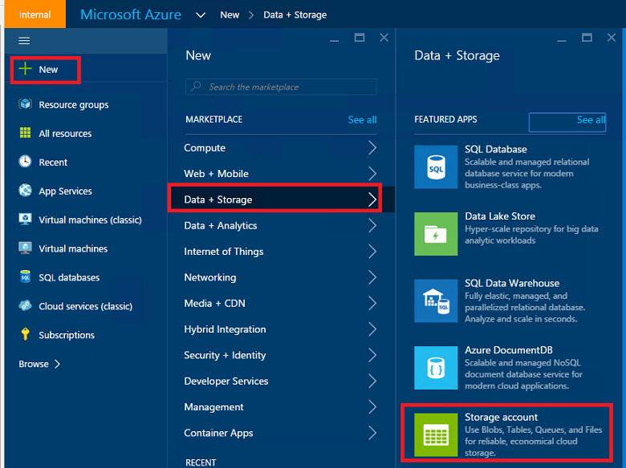
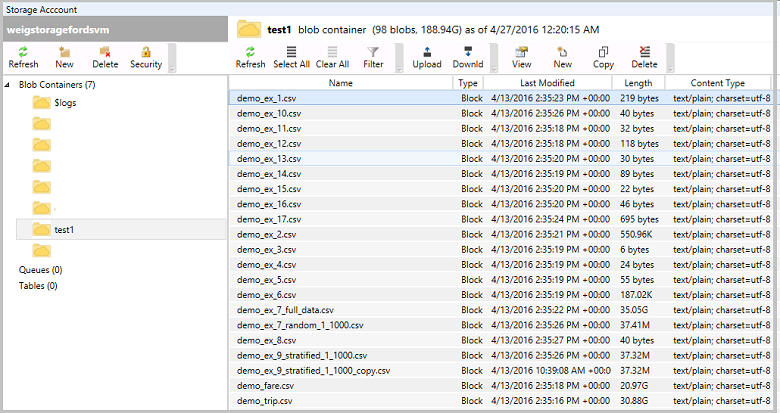
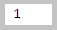
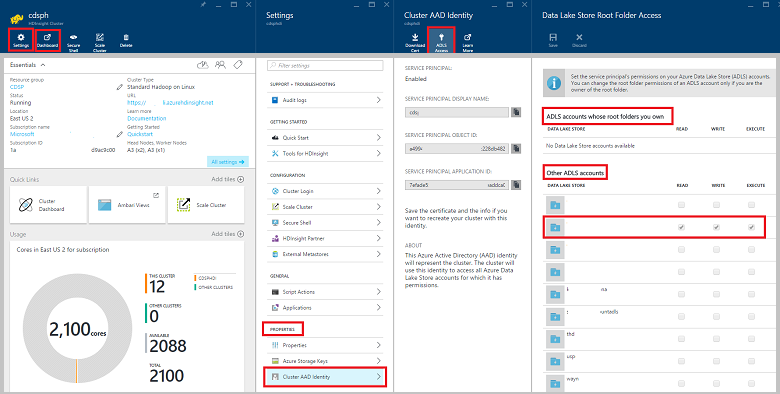
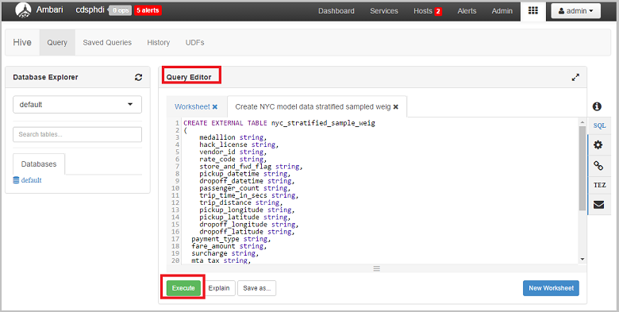
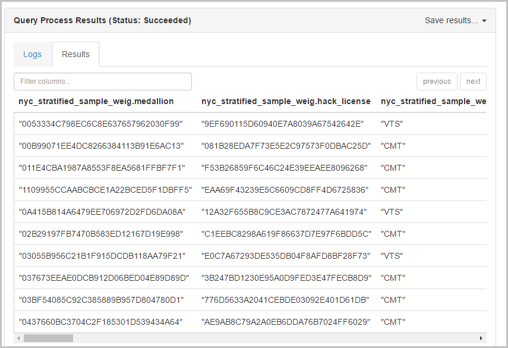
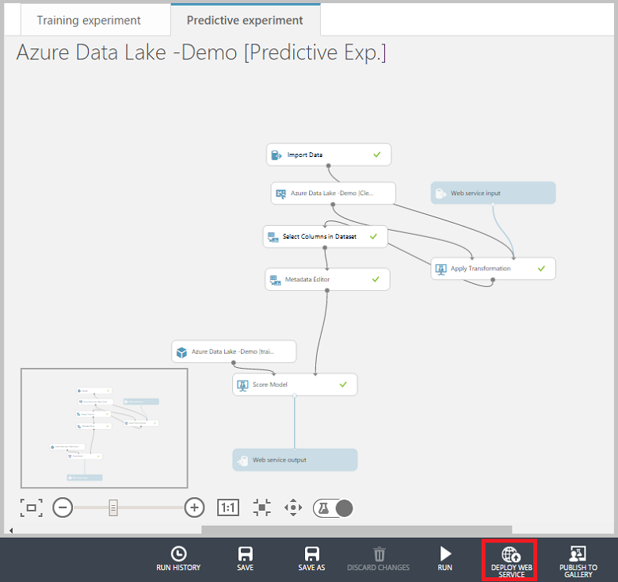

<properties
    pageTitle="Format SVG données scientifique dans Azure données Lake : une procédure pas à pas de bout en bout | Microsoft Azure"
    description="Comment utiliser Azure données Lake d’effectuer des tâches de classification des binaire et l’exploration des données dans un jeu de données."  
    services="machine-learning"
    documentationCenter=""
    authors="bradsev"
    manager="jhubbard"
    editor="cgronlun" />

<tags
    ms.service="machine-learning"
    ms.workload="data-services"
    ms.tgt_pltfrm="na"
    ms.devlang="na"
    ms.topic="article"
    ms.date="09/19/2016"
    ms.author="bradsev;weig"/>

# Format SVG données scientifique dans Azure données Lake : une procédure pas à pas de bout en bout

Cette procédure montre comment utiliser Azure données Lake à suivre des données et vos tâches classification binaire sur un échantillon de voyage taxi NYC et dataset pour prévoir ou non une info-bulle sera payée par un tarif du prix. Il vous guide dans les étapes du [Processus de scientifique des données d’équipe](http://aka.ms/datascienceprocess), de bout en bout, de l’acquisition de données au modèle de formation, puis vers le déploiement d’un service web qui publie le modèle.

### Données Azure Lake Analytique

Le [Microsoft Azure données Lake](https://azure.microsoft.com/solutions/data-lake/) contient toutes les fonctionnalités requises pour faciliter la scientifiques de données pour stocker des données de toute taille, la forme et la vitesse et pour diriger traitement des données, analytique avancée et machine d’apprentissage modélisation avec extensibilité élevées élevée de façon économique.   Vous payez sur une base par projet, uniquement lorsque des données sont en réalité en cours de traitement. Azure données Lake Analytique inclut U-SQL, une langue qui fusionne la nature déclarative de SQL avec la puissance expressif de c# pour fournir scalable distribué fonctionnalité de requête. Il vous permet de traiter des données non structurées en appliquant schéma lors de la lecture, insérer une logique personnalisée et des fonctions définies par l’utilisateur (UDF) et inclut l’extensibilité pour permettre à grains fins optimiser contrôler comment exécuter à l’échelle. Pour en savoir plus sur la philosophie de conception derrière U-SQL, consultez le [blog de Visual Studio publier](https://blogs.msdn.microsoft.com/visualstudio/2015/09/28/introducing-u-sql-a-language-that-makes-big-data-processing-easy/).

Données Lake Analytique est également un élément essentiel de Cortana Analytique Suite et fonctionne avec Azure SQL Data Warehouse, Power BI et Data Factory. Cela vous donne un nuage complète big data et plateforme analytique avancées.

Cette procédure pas à pas commence par décrire les conditions préalables et les ressources qui sont nécessaires pour accomplir les tâches avec des données Lake Analytique qui constituent le processus scientifique des données et comment les installer. Ensuite, elle décrit les étapes de traitement des données à l’aide de U SQL et se termine en affichant l’utilisation Python et Hive avec Azure Machine apprentissage Studio pour créer et déployer les modèles de prévision. 

### U-SQL et Visual Studio

Cette procédure pas à pas recommande l’utilisation de Visual Studio afin de modifier les scripts U-SQL pour traiter le jeu de données. Les scripts U SQL sont décrites ici et dans un fichier séparé. Le processus comprend traiter, exploration et les données d’échantillonnage. Il indique également comment exécuter une tâche de script U-SQL à partir du portail Azure. Tables Hive sont créées pour les données dans un cluster HDInsight associé pour faciliter la création et le déploiement d’un modèle de classement binaire dans Azure Machine apprentissage Studio.  

### Python

Cette procédure pas à pas contient également une section qui montre comment créer et déployer un modèle de prévision à l’aide de Python avec Azure Machine apprentissage Studio.  Nous fournissons un bloc-notes Jupyter avec les scripts Python pour ces étapes de cette procédure. Le bloc-notes inclut du code pour certaines fonctionnalités supplémentaires ingénierie étapes et les modèles de construction écologique tels que classification multiclass et régression modélisation en plus du modèle de classement binaire décrit ici. La tâche de régression consiste à prévoir la quantité de l’info-bulle basée sur d’autres fonctionnalités de Conseil. 

### Apprentissage automatique Azure
Azure Machine apprentissage Studio est utilisé pour créer et déployer les modèles de prévision. Pour cela, à l’aide de deux approches : tout d’abord avec scripts Python, puis avec des tableaux Hive sur un cluster HDInsight (Hadoop).

### Scripts

Uniquement les étapes principales sont décrites dans cette procédure pas à pas. Vous pouvez télécharger complet **script U-SQL** et **Bloc-notes Jupyter** depuis [GitHub](https://github.com/Azure/Azure-MachineLearning-DataScience/tree/master/Misc/AzureDataLakeWalkthrough).

## Conditions préalables

Avant de commencer ces rubriques, vous devez disposer des éléments suivants :

- Un abonnement Azure. Si vous n’en avez pas déjà, voir [Azure obtenir la version d’évaluation gratuite](https://azure.microsoft.com/documentation/videos/get-azure-free-trial-for-testing-hadoop-in-hdinsight/).

- [Recommandé] Visual Studio 2013 ou 2015. Si vous ne figure pas une de ces versions installées, vous pouvez télécharger une édition de communauté gratuite [ici](https://www.visualstudio.com/visual-studio-homepage-vs.aspx). Cliquez sur le bouton **Télécharger Communauté 2015** sous la section Visual Studio. 

>[AZURE.NOTE] Au lieu de Visual Studio, vous pouvez également utiliser le portail Azure à soumettre des requêtes Lake de données Azure. Nous fournissons des instructions sur la façon d’y parvenir à la fois avec Visual Studio et dans le portail dans la section intitulée **traiter les données avec U-SQL**. 

- Inscription à des données Azure Lake Preview

>[AZURE.NOTE] Vous devez obtenir l’approbation d’utiliser Azure données Lake Store (ADLS) et Azure données Lake Analytique (ADLA) comme ces services sont dans l’aperçu. Vous devrez inscrire lorsque vous créez votre premier ADLS ou ADLA. Pour sigh vers le haut, cliquez sur **s’inscrire pour afficher un aperçu**, lisez le contrat, puis cliquez sur **OK**. Voici, par exemple, la page inscription ADLS :

 

## Préparer l’environnement scientifique de données pour Lake de données Azure
Pour préparer l’environnement scientifique de données pour cette procédure pas à pas, créez les ressources suivantes :

- Magasin de Lake données Azure (ADLS) 
- Données Azure Lake Analytique (ADLA)
- Compte de stockage Blob Azure
- Compte d’ordinateur apprentissage Studio Azure
- Données Azure Lake Tools pour Visual Studio (recommandé)

Cette section fournit des instructions sur la création de chacune de ces ressources. Si vous choisissez d’utiliser des tableaux Hive avec apprentissage automatique Azure, au lieu de Python, pour créer un modèle, vous devrez également configurer un cluster HDInsight (Hadoop). Cette procédure de remplacement dans décrite dans la section appropriée ci-dessous.
 
>AZURE. Remarque : le **Magasin de Lake données Azure** peuvent être créés séparément ou lorsque vous créez **Azure données Lake Analytique** comme le stockage par défaut. Instructions sont référencées pour la création de chacune de ces ressources séparément ci-dessous, mais le compte de stockage de données Lake pas besoin d’être créé séparément.
 
### Créer un magasin Lake de données Azure

Créer un ADLS à partir du [portail Azure](http://portal.azure.com). Pour plus d’informations, voir [créer un cluster HDInsight avec données Lake Store à l’aide de portail Azure](../data-lake-store/data-lake-store-hdinsight-hadoop-use-portal.md). Veillez à configurer l’identité AAD Cluster dans la carte de **source de données** de la cuillère **Configuration facultative** y. 

 

### Créer un compte Azure données Lake Analytique
Créez un compte ADLA à partir du [Portail Azure](http://portal.azure.com). Pour plus d’informations, voir [didacticiel : prise en main Azure données Lake Analytique à l’aide du portail Azure](../data-lake-analytics/data-lake-analytics-get-started-portal.md). 

 

### Créer un compte de stockage Blob Azure
Créez un compte de stockage Blob Azure à partir du [Portail Azure](http://portal.azure.com). Pour plus d’informations, voir la création d’une section de compte de stockage de [comptes de stockage sur Azure](../storage/storage-create-storage-account.md).
    
 

### Configurer un compte Azure Machine apprentissage Studio
Connectez-vous haut/dans Azure Machine apprentissage Studio à partir de la page [d’Apprentissage automatique Azure](https://azure.microsoft.com/services/machine-learning/) . Cliquez sur le bouton **Démarrer maintenant** , puis choisissez un « Espace de travail gratuit » ou « Standard Workspace ». Après cela, vous ne pourrez pas à créer des expériences dans Azure ML Studio.  

### Installer les outils de données Azure Lake [recommandé]
Installer les outils de Lake de données Azure correspondant à votre version de Visual Studio à partir [d’Azure données Lake Tools pour Visual Studio](https://www.microsoft.com/download/details.aspx?id=49504).

 

Une fois l’installation terminée avec succès, ouvrir Visual Studio. Vous devriez voir les données Lake le menu en haut de l’onglet. Vos ressources Azure doivent apparaître dans le volet gauche lorsque vous vous connectez à votre compte Azure.

 

## Le jeu de données NYC Taxi voyages
Le jeu de données, nous avons utilisé ici est un jeu de données accessible au public-- [NYC Taxi voyages dataset](http://www.andresmh.com/nyctaxitrips/). Les données NYC Taxi voyage se composent d’environ 20 Go de fichiers CSV compressés (~ 48 Go sans compression), l’enregistrement de plus de 173 millions individuels voyages et les tarifs payé pour chaque voyage. Chaque enregistrement voyage comprend les emplacements de collecte et remise et heures, numéro de licence piratage rendue (pilote) et le nombre de medallion (id unique de taxi). Les données couvre tous les déplacements de l’année 2013 et sont fournies dans les deux jeux de données suivants pour chaque mois :

 - CSV 'trip_data' contient des informations de voyage, telles que nombre de voyageurs, collecte et cette chute points, la durée du voyage et longueur de voyage. Voici quelques exemples d’enregistrements :

        medallion,hack_license,vendor_id,rate_code,store_and_fwd_flag,pickup_datetime,dropoff_datetime,passenger_count, trip_time_in_secs,trip_distance,pickup_longitude,pickup_latitude,dropoff_longitude,dropoff_latitude
        89D227B655E5C82AECF13C3F540D4CF4,BA96DE419E711691B9445D6A6307C170,CMT,1,N,2013-01-01 15:11:48,2013-01-01 15:18:10,4,382,1.00,-73.978165,40.757977,-73.989838,40.751171
        0BD7C8F5BA12B88E0B67BED28BEA73D8,9FD8F69F0804BDB5549F40E9DA1BE472,CMT,1,N,2013-01-06 00:18:35,2013-01-06 00:22:54,1,259,1.50,-74.006683,40.731781,-73.994499,40.75066
        0BD7C8F5BA12B88E0B67BED28BEA73D8,9FD8F69F0804BDB5549F40E9DA1BE472,CMT,1,N,2013-01-05 18:49:41,2013-01-05 18:54:23,1,282,1.10,-74.004707,40.73777,-74.009834,40.726002
        DFD2202EE08F7A8DC9A57B02ACB81FE2,51EE87E3205C985EF8431D850C786310,CMT,1,N,2013-01-07 23:54:15,2013-01-07 23:58:20,2,244,.70,-73.974602,40.759945,-73.984734,40.759388
        DFD2202EE08F7A8DC9A57B02ACB81FE2,51EE87E3205C985EF8431D850C786310,CMT,1,N,2013-01-07 23:25:03,2013-01-07 23:34:24,1,560,2.10,-73.97625,40.748528,-74.002586,40.747868

 - Le « trip_fare' CSV contient des informations de tarif payé pour chaque voyage, telles que type de paiement, prix, surcharge et taxes, conseils et péages et le montant total payé. Voici quelques exemples d’enregistrements :

        medallion, hack_license, vendor_id, pickup_datetime, payment_type, fare_amount, surcharge, mta_tax, tip_amount, tolls_amount, total_amount
        89D227B655E5C82AECF13C3F540D4CF4,BA96DE419E711691B9445D6A6307C170,CMT,2013-01-01 15:11:48,CSH,6.5,0,0.5,0,0,7
        0BD7C8F5BA12B88E0B67BED28BEA73D8,9FD8F69F0804BDB5549F40E9DA1BE472,CMT,2013-01-06 00:18:35,CSH,6,0.5,0.5,0,0,7
        0BD7C8F5BA12B88E0B67BED28BEA73D8,9FD8F69F0804BDB5549F40E9DA1BE472,CMT,2013-01-05 18:49:41,CSH,5.5,1,0.5,0,0,7
        DFD2202EE08F7A8DC9A57B02ACB81FE2,51EE87E3205C985EF8431D850C786310,CMT,2013-01-07 23:54:15,CSH,5,0.5,0.5,0,0,6
        DFD2202EE08F7A8DC9A57B02ACB81FE2,51EE87E3205C985EF8431D850C786310,CMT,2013-01-07 23:25:03,CSH,9.5,0.5,0.5,0,0,10.5

La clé unique à rejoindre voyage\_des données et voyage\_tarif est composée de trois champs suivants : medallion, hack\_licence et capture\_date/heure. Les fichiers CSV brutes sont accessibles à partir d’un blob de stockage Azure public. Le script U-SQL pour ce type de jointure est dans la section [tables de voyage et tarif de jointure](#join) .

## Traiter les données avec U-SQL

Les tâches de traitement des données illustrées dans cette section incluent traiter, la vérification de la qualité, exploration et les données d’échantillonnage. Nous affichons également comment relier des tables de voyage et de prix. La dernière section montre exécuter une tâche de script U-SQL à partir du portail Azure. Voici des liens vers chaque section :

- [Réception de données : lecture de données à partir d’objets blob public](#ingest)
- [Contrôles de la qualité des données](#quality)
- [Exploration de données](#explore)
- [Joindre des tables de voyage et tarifs](#join)
- [Échantillon de données](#sample)
- [Exécuter des travaux U-SQL](#run)

Les scripts U SQL sont décrites ici et dans un fichier séparé. Vous pouvez télécharger les **scripts U-SQL** complète depuis [GitHub](https://github.com/Azure/Azure-MachineLearning-DataScience/tree/master/Misc/AzureDataLakeWalkthrough).

Pour exécuter U-SQL, ouvrez Visual Studio, cliquez sur **fichier--> Nouveau--> projet**, cliquez sur **Projet U SQL**, nommez et enregistrez dans un dossier.

>[AZURE.NOTE] Il est possible d’utiliser le portail Azure pour exécuter U-SQL au lieu de Visual Studio. Vous pouvez accéder à la ressource Azure données Lake Analytique dans le portail et soumettre des requêtes comme illustré dans l’illustration suivante.

### Réception de données : Lecture de données à partir d’objets blob public

L’emplacement des données dans le blob Azure est référencée en tant que **wasb://container_name@blob_storage_account_name.blob.core.windows.net/blob_name** et peuvent être extraites à l’aide de **Extractors.Csv()**. Remplacer par votre propre nom de conteneur et le nom de compte de stockage dans les scripts suivants pour container_name@blob_storage_account_name dans l’adresse wasb. Étant donné que les noms de fichiers sont dans la même mise en forme, nous pouvons utiliser **voyage\_data_ {\*\}.csv** à lire dans tous les fichiers de voyage 12. 

    ///Read in Trip data
    @trip0 =
        EXTRACT 
        medallion string,
        hack_license string,
        vendor_id string,
        rate_code string,
        store_and_fwd_flag string,
        pickup_datetime string,
        dropoff_datetime string,
        passenger_count string,
        trip_time_in_secs string,
        trip_distance string,
        pickup_longitude string,
        pickup_latitude string,
        dropoff_longitude string,
        dropoff_latitude string
    // This is reading 12 trip data from blob
    FROM "wasb://container_name@blob_storage_account_name.blob.core.windows.net/nyctaxitrip/trip_data_{*}.csv"
    USING Extractors.Csv();

Étant donné que la première ligne contient des en-têtes, nous avons besoin de supprimer les en-têtes et modifier les types de colonne dans celles qui sont appropriées. Vous pouvez soit enregistrer les données traitées au stockage de Lake données Azure à l’aide de **swebhdfs://data_lake_storage_name.azuredatalakestorage.net/folder_name/file_name**_ ou à Azure Blob storage à l’aide du compte **wasb://container_name@blob_storage_account_name.blob.core.windows.net/blob_name**. 

    // change data types
    @trip =
        SELECT 
        medallion,
        hack_license,
        vendor_id,
        rate_code,
        store_and_fwd_flag,
        DateTime.Parse(pickup_datetime) AS pickup_datetime,
        DateTime.Parse(dropoff_datetime) AS dropoff_datetime,
        Int32.Parse(passenger_count) AS passenger_count,
        Double.Parse(trip_time_in_secs) AS trip_time_in_secs,
        Double.Parse(trip_distance) AS trip_distance,
        (pickup_longitude==string.Empty ? 0: float.Parse(pickup_longitude)) AS pickup_longitude,
        (pickup_latitude==string.Empty ? 0: float.Parse(pickup_latitude)) AS pickup_latitude,
        (dropoff_longitude==string.Empty ? 0: float.Parse(dropoff_longitude)) AS dropoff_longitude,
        (dropoff_latitude==string.Empty ? 0: float.Parse(dropoff_latitude)) AS dropoff_latitude
    FROM @trip0
    WHERE medallion != "medallion";

    ////output data to ADL
    OUTPUT @trip   
    TO "swebhdfs://data_lake_storage_name.azuredatalakestore.net/nyctaxi_folder/demo_trip.csv"
    USING Outputters.Csv(); 

    ////Output data to blob
    OUTPUT @trip   
    TO "wasb://container_name@blob_storage_account_name.blob.core.windows.net/demo_trip.csv"
    USING Outputters.Csv();  

De même, nous pouvons lue dans les jeux de données de prix. Cliquez avec le bouton avec le bouton droit sur Azure données Lake Store, vous pouvez choisir de consulter vos données dans le **portail Azure--> Explorateur de données** ou **L’Explorateur de fichiers** dans Visual Studio. 

 

 

### Contrôles de la qualité des données

Une fois voyage et tarif tables lues dans, contrôles de la qualité des données peuvent être effectuées de la manière suivante. Les fichiers CSV qui en résulte peuvent être dirigé vers stockage d’objets Blob Azure ou Azure données Lake Store. 

Trouver le nombre de medallions et numéro unique de medallions :

    ///check the number of medallions and unique number of medallions
    @trip2 =
        SELECT
        medallion,
        vendor_id,
        pickup_datetime.Month AS pickup_month
        FROM @trip;
    
    @ex_1 =
        SELECT
        pickup_month, 
        COUNT(medallion) AS cnt_medallion,
        COUNT(DISTINCT(medallion)) AS unique_medallion
        FROM @trip2
        GROUP BY pickup_month;
        OUTPUT @ex_1   
    TO "wasb://container_name@blob_storage_account_name.blob.core.windows.net/demo_ex_1.csv"
    USING Outputters.Csv(); 

Rechercher ces medallions ayant plus de 100 voyages :

    ///find those medallions that had more than 100 trips
    @ex_2 =
        SELECT medallion,
               COUNT(medallion) AS cnt_medallion
        FROM @trip2
        //where pickup_datetime >= "2013-01-01t00:00:00.0000000" and pickup_datetime <= "2013-04-01t00:00:00.0000000"
        GROUP BY medallion
        HAVING COUNT(medallion) > 100;
        OUTPUT @ex_2   
    TO "wasb://container_name@blob_storage_account_name.blob.core.windows.net/demo_ex_2.csv"
    USING Outputters.Csv(); 

Rechercher les enregistrements en termes de pickup_longitude non valides :

    ///find those invalid records in terms of pickup_longitude
    @ex_3 =
        SELECT COUNT(medallion) AS cnt_invalid_pickup_longitude
        FROM @trip
        WHERE
        pickup_longitude <- 90 OR pickup_longitude > 90;
        OUTPUT @ex_3   
    TO "wasb://container_name@blob_storage_account_name.blob.core.windows.net/demo_ex_3.csv"
    USING Outputters.Csv(); 

Trouver des valeurs manquantes pour certaines variables :

    //check missing values
    @res =
        SELECT *,
               (medallion == null? 1 : 0) AS missing_medallion
        FROM @trip;
    
    @trip_summary6 =
        SELECT 
            vendor_id,
        SUM(missing_medallion) AS medallion_empty, 
        COUNT(medallion) AS medallion_total,
        COUNT(DISTINCT(medallion)) AS medallion_total_unique  
        FROM @res
        GROUP BY vendor_id;
    OUTPUT @trip_summary6
    TO "wasb://container_name@blob_storage_account_name.blob.core.windows.net/demo_ex_16.csv"
    USING Outputters.Csv();

### Exploration de données

Nous pouvons faire certaines exploration de données pour mieux comprendre les données.

Accédez à la distribution de déplacements Bonhomme de neige et non incliné :

    ///tipped vs. not tipped distribution
    @tip_or_not =
        SELECT *,
               (tip_amount > 0 ? 1: 0) AS tipped
        FROM @fare;
    
    @ex_4 =
        SELECT tipped,
               COUNT(*) AS tip_freq
        FROM @tip_or_not
        GROUP BY tipped;
        OUTPUT @ex_4   
    TO "wasb://container_name@blob_storage_account_name.blob.core.windows.net/demo_ex_4.csv"
    USING Outputters.Csv(); 

Rechercher la distribution des montants des info-bulle avec les valeurs limites : 0,5,10 et 20 dollars.

    //tip class/range distribution
    @tip_class =
        SELECT *,
               (tip_amount >20? 4: (tip_amount >10? 3:(tip_amount >5 ? 2:(tip_amount > 0 ? 1: 0)))) AS tip_class
        FROM @fare;
    @ex_5 =
        SELECT tip_class,
               COUNT(*) AS tip_freq
        FROM @tip_class
        GROUP BY tip_class;
        OUTPUT @ex_5   
    TO "wasb://container_name@blob_storage_account_name.blob.core.windows.net/demo_ex_5.csv"
    USING Outputters.Csv(); 

Rechercher les statistiques de base de la distance de voyage :

    // find basic statistics for trip_distance
    @trip_summary4 =
        SELECT 
            vendor_id,
            COUNT(*) AS cnt_row,
            MIN(trip_distance) AS min_trip_distance,
            MAX(trip_distance) AS max_trip_distance,
            AVG(trip_distance) AS avg_trip_distance 
        FROM @trip
        GROUP BY vendor_id;
    OUTPUT @trip_summary4
    TO "wasb://container_name@blob_storage_account_name.blob.core.windows.net/demo_ex_14.csv"
    USING Outputters.Csv();

Rechercher les centiles de distance de voyage :

    // find percentiles of trip_distance
    @trip_summary3 =
        SELECT DISTINCT vendor_id AS vendor,
                        PERCENTILE_DISC(0.25) WITHIN GROUP(ORDER BY trip_distance) OVER(PARTITION BY vendor_id) AS median_trip_distance_disc,
                        PERCENTILE_DISC(0.5) WITHIN GROUP(ORDER BY trip_distance) OVER(PARTITION BY vendor_id) AS median_trip_distance_disc,
                        PERCENTILE_DISC(0.75) WITHIN GROUP(ORDER BY trip_distance) OVER(PARTITION BY vendor_id) AS median_trip_distance_disc
        FROM @trip;
       // group by vendor_id;
    OUTPUT @trip_summary3
    TO "wasb://container_name@blob_storage_account_name.blob.core.windows.net/demo_ex_13.csv"
    USING Outputters.Csv(); 

### Joindre des tables de voyage et tarifs

Déplacement et tarif tables peuvent être jointes en medallion, hack_license et pickup_time.

    //join trip and fare table

    @model_data_full =
    SELECT t.*, 
    f.payment_type, f.fare_amount, f.surcharge, f.mta_tax, f.tolls_amount,  f.total_amount, f.tip_amount,
    (f.tip_amount > 0 ? 1: 0) AS tipped,
    (f.tip_amount >20? 4: (f.tip_amount >10? 3:(f.tip_amount >5 ? 2:(f.tip_amount > 0 ? 1: 0)))) AS tip_class
    FROM @trip AS t JOIN  @fare AS f
    ON   (t.medallion == f.medallion AND t.hack_license == f.hack_license AND t.pickup_datetime == f.pickup_datetime)
    WHERE   (pickup_longitude != 0 AND dropoff_longitude != 0 );

    //// output to blob
    OUTPUT @model_data_full   
    TO "wasb://container_name@blob_storage_account_name.blob.core.windows.net/demo_ex_7_full_data.csv"
    USING Outputters.Csv(); 

    ////output data to ADL
    OUTPUT @model_data_full   
    TO "swebhdfs://data_lake_storage_name.azuredatalakestore.net/nyctaxi_folder/demo_ex_7_full_data.csv"
    USING Outputters.Csv(); 

Pour chaque niveau de count voyageurs, calculer le nombre d’enregistrements, le montant de conseil moyenne, variation des montants des info-bulle, pourcentage de déplacements Bonhomme de neige.

    // contigency table
    @trip_summary8 =
        SELECT passenger_count,
               COUNT(*) AS cnt,
               AVG(tip_amount) AS avg_tip_amount,
               VAR(tip_amount) AS var_tip_amount,
               SUM(tipped) AS cnt_tipped,
               (float)SUM(tipped)/COUNT(*) AS pct_tipped
        FROM @model_data_full
        GROUP BY passenger_count;
        OUTPUT @trip_summary8
    TO "wasb://container_name@blob_storage_account_name.blob.core.windows.net/demo_ex_17.csv"
    USING Outputters.Csv();

### Échantillon de données

Tout d’abord, nous allons sélectionner aléatoirement 0,1 % des données à partir de la table jointe :

    //random select 1/1000 data for modeling purpose
    @addrownumberres_randomsample =
    SELECT *,
            ROW_NUMBER() OVER() AS rownum
    FROM @model_data_full;
    
    @model_data_random_sample_1_1000 =
    SELECT *
    FROM @addrownumberres_randomsample
    WHERE rownum % 1000 == 0;
    
    OUTPUT @model_data_random_sample_1_1000   
    TO "wasb://container_name@blob_storage_account_name.blob.core.windows.net/demo_ex_7_random_1_1000.csv"
    USING Outputters.Csv(); 

Puis nous faire échantillonnages stratifié, tip_class variable binaire :

    //stratified random select 1/1000 data for modeling purpose
    @addrownumberres_stratifiedsample =
    SELECT *,
            ROW_NUMBER() OVER(PARTITION BY tip_class) AS rownum
    FROM @model_data_full;
    
    @model_data_stratified_sample_1_1000 =
    SELECT *
    FROM @addrownumberres_stratifiedsample
    WHERE rownum % 1000 == 0;
    //// output to blob
    OUTPUT @model_data_stratified_sample_1_1000   
    TO "wasb://container_name@blob_storage_account_name.blob.core.windows.net/demo_ex_9_stratified_1_1000.csv"
    USING Outputters.Csv(); 
    ////output data to ADL
    OUTPUT @model_data_stratified_sample_1_1000   
    TO "swebhdfs://data_lake_storage_name.azuredatalakestore.net/nyctaxi_folder/demo_ex_9_stratified_1_1000.csv"
    USING Outputters.Csv(); 

### Exécuter des travaux U-SQL

Lorsque vous avez terminé de modifier les scripts U-SQL, vous pouvez les envoyer au serveur à l’aide de votre compte Azure données Lake Analytique. Cliquez sur **Données Lake**, **Envoyer une tâche**, sélectionnez votre **Compte Analytique**, choisissez **parallélisme**et cliquez sur le bouton **Envoyer** .  

 

Lorsque la tâche est remplie avec succès, l’état de votre travail s’affichera dans Visual Studio pour le contrôle. Une fois que la tâche termine en cours d’exécution, vous pouvez même relire le processus de l’exécution de tâches et découvrez les étapes critique pour améliorer l’efficacité de votre travail. Vous pouvez également accéder au portail Azure pour vérifier l’état de vos projets U-SQL.

 

 

Désormais, vous pouvez vérifier les fichiers de sortie de stockage d’objets Blob Azure ou portail Azure. Nous allons utiliser les données d’exemple stratifié pour notre modélisation dans l’étape suivante.

 

 

## Créer et déployer des modèles d’apprentissage automatique Azure

Nous vous montrer deux options disponibles pour extraire des données en apprentissage automatique Azure pour créer et 

- Dans la première option, vous utilisez les données échantillonnées qui ont été écrites dans un Blob Azure (dans l’étape **d’échantillonnage des données** ci-dessus) et Python pour créer et déployer des modèles à partir d’apprentissage automatique Azure. 
- Dans la deuxième option, vous interrogez les données dans Azure données Lake directement à l’aide d’une requête Hive. Cette option nécessite que vous créez un nouveau cluster HDInsight ou que vous utilisez un cluster HDInsight existant dans lequel les tables Hive pointent vers les données Taxi NY dans le stockage de Lake données Azure.  Nous aborderons ces deux options ci-dessous. 

## Option 1 : Python utiliser pour créer et déployer des modèles de formation de l’ordinateur

Pour créer et déployer des modèles de formation machine à l’aide de Python, créez un bloc-notes Jupyter sur votre ordinateur local ou dans Azure Machine d’apprentissage Studio. Le bloc-notes Jupyter fourni sur [GitHub](https://github.com/Azure/Azure-MachineLearning-DataScience/tree/master/Misc/AzureDataLakeWalkthrough) contient le code complet pour Explorer, visualiser des données, ingénierie fonctionnalité, modélisation et déploiement. Dans cet article, nous affichons simplement la modélisation et le déploiement. 

### Python bibliothèques d’importation

Pour exécuter l’exemple Jupyter bloc-notes ou Python fichier de script, Python suivant packages sont nécessaires. Si vous utilisez le service AzureML bloc-notes, ces packages ont été préinstallés.

    import pandas as pd
    from pandas import Series, DataFrame
    import numpy as np
    import matplotlib.pyplot as plt
    from time import time
    import pyodbc
    import os
    from azure.storage.blob import BlobService
    import tables
    import time
    import zipfile
    import random
    import sklearn
    from sklearn.linear_model import LogisticRegression
    from sklearn.cross_validation import train_test_split
    from sklearn import metrics
    from __future__ import division
    from sklearn import linear_model
    from azureml import services

### Lire les données à partir d’objets blob

- Chaîne de connexion   

        CONTAINERNAME = 'test1'
        STORAGEACCOUNTNAME = 'XXXXXXXXX'
        STORAGEACCOUNTKEY = 'YYYYYYYYYYYYYYYYYYYYYYYYYYYY'
        BLOBNAME = 'demo_ex_9_stratified_1_1000_copy.csv'
        blob_service = BlobService(account_name=STORAGEACCOUNTNAME,account_key=STORAGEACCOUNTKEY)
    
- Lire dans en tant que texte

        t1 = time.time()
        data = blob_service.get_blob_to_text(CONTAINERNAME,BLOBNAME).split("\n")
        t2 = time.time()
        print(("It takes %s seconds to read in "+BLOBNAME) % (t2 - t1))

     
 
- Ajouter des noms de colonnes et de séparer les colonnes

        colnames = ['medallion','hack_license','vendor_id','rate_code','store_and_fwd_flag','pickup_datetime','dropoff_datetime',
        'passenger_count','trip_time_in_secs','trip_distance','pickup_longitude','pickup_latitude','dropoff_longitude','dropoff_latitude',
        'payment_type', 'fare_amount', 'surcharge', 'mta_tax', 'tolls_amount',  'total_amount', 'tip_amount', 'tipped', 'tip_class', 'rownum']
        df1 = pd.DataFrame([sub.split(",") for sub in data], columns = colnames)
    

- Modifier certaines colonnes à numérique

        cols_2_float = ['trip_time_in_secs','pickup_longitude','pickup_latitude','dropoff_longitude','dropoff_latitude',
        'fare_amount', 'surcharge','mta_tax','tolls_amount','total_amount','tip_amount', 'passenger_count','trip_distance'
        ,'tipped','tip_class','rownum']
        for col in cols_2_float:
            df1[col] = df1[col].astype(float)

### Créer des modèles d’apprentissage automatique

Ici, nous créons un modèle de classement binaire pour prévoir si un voyage est incliné ou non. Dans le bloc-notes Jupyter vous pouvez trouver des deux autres modèles : classification multiclass et les modèles de régression.

- Tout d’abord nous avons besoin de créer des variables factices pouvant être utilisées dans scikit-Découvrez des modèles

        df1_payment_type_dummy = pd.get_dummies(df1['payment_type'], prefix='payment_type_dummy')
        df1_vendor_id_dummy = pd.get_dummies(df1['vendor_id'], prefix='vendor_id_dummy')

- Créer la trame de données pour la modélisation

        cols_to_keep = ['tipped', 'trip_distance', 'passenger_count']
        data = df1[cols_to_keep].join([df1_payment_type_dummy,df1_vendor_id_dummy])
        
        X = data.iloc[:,1:]
        Y = data.tipped

- Formation et de test 60-40 double affichage

        X_train, X_test, Y_train, Y_test = train_test_split(X, Y, test_size=0.4, random_state=0)

- Régression logistique jeu d’exercice

        model = LogisticRegression()
        logit_fit = model.fit(X_train, Y_train)
        print ('Coefficients: \n', logit_fit.coef_)
        Y_train_pred = logit_fit.predict(X_train)

       

- Score du jeu de données de test

        Y_test_pred = logit_fit.predict(X_test)

- Calculer les mesures d’évaluation

        fpr_train, tpr_train, thresholds_train = metrics.roc_curve(Y_train, Y_train_pred)
        print fpr_train, tpr_train, thresholds_train
        
        fpr_test, tpr_test, thresholds_test = metrics.roc_curve(Y_test, Y_test_pred) 
        print fpr_test, tpr_test, thresholds_test
        
        #AUC
        print metrics.auc(fpr_train,tpr_train)
        print metrics.auc(fpr_test,tpr_test)
        
        #Confusion Matrix
        print metrics.confusion_matrix(Y_train,Y_train_pred)
        print metrics.confusion_matrix(Y_test,Y_test_pred)

       

 
### Créer des API de Service Web et consommer dans Python

Nous voulons effectuent la machine apprentissage du modèle après avoir été compilée. Ici, nous utilisons le modèle binaire logistique par exemple. Vérifiez que la scikit-découvrir version sur votre ordinateur local est 0.15.1. Vous n’avez plus à vous soucier ceci si vous utilisez Azure ML studio service.

- Rechercher vos informations d’identification de l’espace de travail à partir des paramètres de studio Azure ML. Dans Azure Machine apprentissage Studio, cliquez sur **paramètres** --> **nom** --> **Jetons d’autorisation**. 

    

        workspaceid = 'xxxxxxxxxxxxxxxxxxxxxxxxxxx'
        auth_token = 'xxxxxxxxxxxxxxxxxxxxxxxxxxx'

- Créer le Service Web

        @services.publish(workspaceid, auth_token) 
        @services.types(trip_distance = float, passenger_count = float, payment_type_dummy_CRD = float, payment_type_dummy_CSH=float, payment_type_dummy_DIS = float, payment_type_dummy_NOC = float, payment_type_dummy_UNK = float, vendor_id_dummy_CMT = float, vendor_id_dummy_VTS = float)
        @services.returns(int) #0, or 1
        def predictNYCTAXI(trip_distance, passenger_count, payment_type_dummy_CRD, payment_type_dummy_CSH,payment_type_dummy_DIS, payment_type_dummy_NOC, payment_type_dummy_UNK, vendor_id_dummy_CMT, vendor_id_dummy_VTS ):
            inputArray = [trip_distance, passenger_count, payment_type_dummy_CRD, payment_type_dummy_CSH, payment_type_dummy_DIS, payment_type_dummy_NOC, payment_type_dummy_UNK, vendor_id_dummy_CMT, vendor_id_dummy_VTS]
            return logit_fit.predict(inputArray)

- Obtenir des informations d’identification du service web

        url = predictNYCTAXI.service.url
        api_key =  predictNYCTAXI.service.api_key
        
        print url
        print api_key

        @services.service(url, api_key)
        @services.types(trip_distance = float, passenger_count = float, payment_type_dummy_CRD = float, payment_type_dummy_CSH=float,payment_type_dummy_DIS = float, payment_type_dummy_NOC = float, payment_type_dummy_UNK = float, vendor_id_dummy_CMT = float, vendor_id_dummy_VTS = float)
        @services.returns(float)
        def NYCTAXIPredictor(trip_distance, passenger_count, payment_type_dummy_CRD, payment_type_dummy_CSH,payment_type_dummy_DIS, payment_type_dummy_NOC, payment_type_dummy_UNK, vendor_id_dummy_CMT, vendor_id_dummy_VTS ):
            pass

- Appel API de service Web. Vous devez attendre 5 à 10 secondes après l’étape précédente.

        NYCTAXIPredictor(1,2,1,0,0,0,0,0,1)

       

## Option 2 : Créer et déployer des modèles de directement d’apprentissage automatique Azure

Azure Machine apprentissage Studio peut lire les données directement à partir d’Azure données Lake Store et ensuite être utilisé pour créer et déployer des modèles. Cette approche utilise une table Hive qui pointe sur Azure données Lake Store. Cela nécessite qu’un cluster séparé Azure HDInsight être mis en service, sur lequel la table Hive est créée. Les sections suivantes montrent comment effectuer cette opération. 

### Créer un Cluster Linux HDInsight

Créer un Cluster HDInsight (Linux) à partir du [portail Azure](http://portal.azure.com). Pour plus d’informations, voir la section **créer un cluster HDInsight avec accès au magasin Lake des données Azure** dans [créer un cluster HDInsight avec données Lake Store à l’aide de portail Azure](../data-lake-store/data-lake-store-hdinsight-hadoop-use-portal.md).

 

### Créer la table Hive dans HDInsight

Créons maintenant Hive tables à utiliser dans Azure Machine apprentissage Studio dans le cluster HDInsight en utilisant les données stockées dans le magasin de Lake données Azure à l’étape précédente. Atteindre le cluster HDInsight venez de créer. Cliquez sur **paramètres** --> **Propriétés** --> **Cluster AAD identité** --> **ADLS Access**, vérifiez que votre compte Azure données Lake Store est ajouté dans la liste en lecture, écriture et les droits d’exécution. 

 

Puis cliquez sur **tableau de bord** en regard du bouton **paramètres** et une fenêtre s’affiche. Cliquez sur **Afficher la ruche** dans le coin supérieur à droite de la page et vous verrez l' **Éditeur de requête**.

 

 

Collez les scripts Hive suivants pour créer une table. L’emplacement de source de données est référence Azure données Lake Store de cette façon : **adl://data_lake_store_name.azuredatalakestore.net:443/dossier/file_name**.

    CREATE EXTERNAL TABLE nyc_stratified_sample
    (
        medallion string,
        hack_license string,
        vendor_id string,
        rate_code string,
        store_and_fwd_flag string,
        pickup_datetime string,
        dropoff_datetime string,
        passenger_count string,
        trip_time_in_secs string,
        trip_distance string,
        pickup_longitude string,
        pickup_latitude string,
        dropoff_longitude string,
        dropoff_latitude string,
      payment_type string,
      fare_amount string,
      surcharge string,
      mta_tax string,
      tolls_amount string,
      total_amount string,
      tip_amount string,
      tipped string,
      tip_class string,
      rownum string
      )
    ROW FORMAT DELIMITED FIELDS TERMINATED BY ',' lines terminated by '\n'
    LOCATION 'adl://data_lake_storage_name.azuredatalakestore.net:443/nyctaxi_folder/demo_ex_9_stratified_1_1000_copy.csv';

Une fois la requête en cours d’exécution, vous verrez les résultats comme suit :

 

### Créer et déployer des modèles dans Azure Machine apprentissage Studio

Nous êtes maintenant prêts à créer et déployer un modèle qui prévoit est ou non une info-bulle est payée avec apprentissage automatique Azure. Les données d’exemple stratifié sont prêtes à être utilisé dans cette classification binaire (Conseil ou non) problème. Les modèles de prévision utilisant classification multiclass (tip_class) et régression (tip_amount) peuvent également être générés et déployés avec Azure Machine apprentissage Studio, mais ici nous uniquement montrent comment gérer le cas d’utilisation du modèle de classement binaire.

1. Importer les données dans Azure ML l’utilisation du module **Importer des données** , disponible dans la section **données d’entrée et de sortie** . Pour plus d’informations, voir la page de référence [du module importer des données](https://msdn.microsoft.com/library/azure/4e1b0fe6-aded-4b3f-a36f-39b8862b9004/) .
2. Sélectionnez **La ruche la requête** comme **source de données** dans le volet de **Propriétés** .
3. Collez le script Hive suivant dans l’éditeur de **requête de base de données de la ruche**

        select * from nyc_stratified_sample;

4. Entrez le cluster URI de HDInsight (vous pouvez trouver dans Azure Portal), les informations d’identification Hadoop, l’emplacement des données de sortie et nom de nom / / conteneur de clé de compte de stockage Azure.

   

Exemple d’une expérience de classification binaire la lecture de données à partir de la table Hive est indiqué dans l’illustration ci-dessous.

 

Une fois l’expérience est créée, cliquez sur **Définir le serviceWeb** --> **Prédictive Service Web**

 

Exécuter automatiquement créé score expérience, lorsqu’il a terminé, cliquez sur **Déployer un Service Web**

 

Le tableau de bord de service web s’affichera peu de temps :

 

## Résumé

En procédant de cette procédure pas à pas, vous avez créé un environnement scientifique de données pour créer des solutions de bout en bout scalable dans Azure données Lake. Cet environnement a été utilisé pour analyser un grand public jeu de données, en tenant à travers les étapes du processus des données, de l’acquisition de données par la formation de modèle, puis vers le déploiement du modèle comme un service web canoniques. U-SQL a été utilisé pour traiter, Explorer et exemples de données. Python et Hive ont été utilisés avec Azure Machine apprentissage Studio pour créer et déployer des modèles de prévision.

## Quoi d’autre ?

Rubriques d’apprentissage pour l' [Équipe données scientifique processus (TDSP)](http://aka.ms/datascienceprocess) fournit des liens vers des rubriques qui décrivent chaque étape du processus analytique avancées. Il existe une série de procédures pas à pas détaillé dans la page [d’équipe données scientifique processus procédures pas à pas](data-science-process-walkthroughs.md) qui montrent comment utiliser des ressources et des services dans différents scénarios analytique prédictive :

- [Le processus d’équipe données scientifique en action : à l’aide de Data Warehouse SQL](machine-learning-data-science-process-sqldw-walkthrough.md)
- [Le processus d’équipe données scientifique en action : utilisation des clusters HDInsight Hadoop](machine-learning-data-science-process-hive-walkthrough.md)
- [Le processus scientifique des données d’équipe : à l’aide de SQL Server](machine-learning-data-science-process-sql-walkthrough.md)
- [Vue d’ensemble du processus des données à l’aide d’explosion sur Azure HDInsight](machine-learning-data-science-spark-overview.md)

