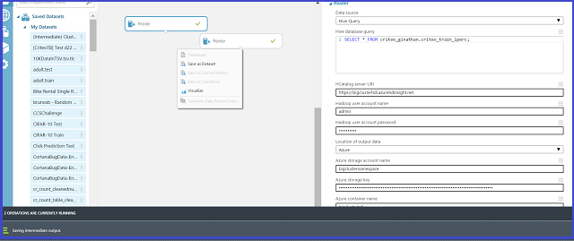
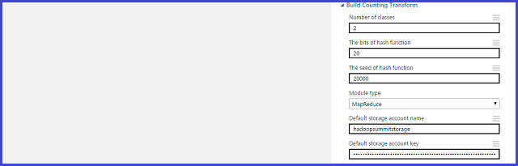
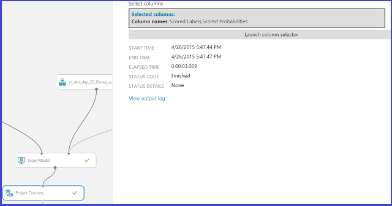

<properties
    pageTitle="Le processus d’équipe données scientifique en action : à l’aide de HDInsight Hadoop clusters sur le jeu de données 1 to Criteo | Microsoft Azure"
    description="À l’aide du processus scientifique des données d’équipe pour un scénario de bout en bout utilisant un cluster HDInsight Hadoop pour créer et déployer un modèle à l’aide d’un jeu de données accessible au public (1 To) volumineux"
    services="machine-learning,hdinsight"
    documentationCenter=""
    authors="bradsev"
    manager="jhubbard"
    editor="cgronlun" />

<tags
    ms.service="machine-learning"
    ms.workload="data-services"
    ms.tgt_pltfrm="na"
    ms.devlang="na"
    ms.topic="article"
    ms.date="09/13/2016"
    ms.author="bradsev" />

# Le processus d’équipe données scientifique en action - utilisation du clustering Azure HDInsight Hadoop sur un jeu de données de 1 to

Dans cette procédure, nous illustrent l’utilisation du processus d’équipe données scientifiques dans un scénario de bout en bout avec un [cluster Azure HDInsight Hadoop](https://azure.microsoft.com/services/hdinsight/) pour stocker, Explorer, technicien de fonctionnalité et vers le bas des exemples de données à partir d’un des jeux de données [Criteo](http://labs.criteo.com/downloads/download-terabyte-click-logs/) accessible au public. Nous utilisons apprentissage automatique Azure pour créer un modèle de classement binaire sur ces données. Nous avons également montrer comment publier un de ces modèles sous la forme d’un service Web.

Il est également possible d’utiliser un bloc-notes IPython pour accomplir les tâches présentées dans cette procédure pas à pas. Les utilisateurs qui souhaitent utiliser cette méthode doivent consulter la rubrique [procédure pas à pas Criteo à l’aide d’une connexion ODBC ruche](https://github.com/Azure/Azure-MachineLearning-DataScience/blob/master/Misc/DataScienceProcess/iPythonNotebooks/machine-Learning-data-science-process-hive-walkthrough-criteo.ipynb) .

## Description du jeu de données Criteo

La Criteo données sont un jeu de données de prévision clic qui correspond à environ 370 Go de fichiers TSV gzip compressées (~1.3TB décompressé), comprenant plusieurs 4.3 milliards d’enregistrements. Il est extrait de 24 jours de cliquez sur données mises à disposition par [Criteo](http://labs.criteo.com/downloads/download-terabyte-click-logs/). Pour faciliter la tâche de scientifiques de données, nous avons décompressés dont nous disposons pour tester les données.

Chaque enregistrement de ce groupe de données contient 40 colonnes :

- la première colonne contient une colonne d’étiquette qui indique si un utilisateur clique sur une **Ajouter** (valeur 1) ou ne clique une (valeur 0)
- suivant 13 colonnes sont numériques, et
- dernière 26 sont colonnes par catégorie

Les colonnes sont anonymes et utilise une série de noms énumérées : « Col1 » (pour la colonne étiquette) à « Col40 » (pour la dernière colonne par catégorie).            

Voici un extrait des 20 premières colonnes de deux observations (lignes) à partir de ce groupe de données :

    Col1    Col2    Col3    Col4    Col5    Col6    Col7    Col8    Col9    Col10   Col11   Col12   Col13   Col14   Col15           Col16           Col17           Col18           Col19       Col20

    0       40      42      2       54      3       0       0       2       16      0       1       4448    4       1acfe1ee        1b2ff61f        2e8b2631        6faef306        c6fc10d3    6fcd6dcb           
    0               24              27      5               0       2       1               3       10064           9a8cb066        7a06385f        417e6103        2170fc56        acf676aa    6fcd6dcb                      

Il existe des valeurs manquantes dans les colonnes numériques et par catégorie dans le jeu de données. Nous décrivent une méthode simple pour gérer les valeurs manquantes. Les données des détails supplémentaires sont décrites quand nous les stocker en tables Hive.

**Définition :** *Taux de clics (clic) :* Il s’agit le pourcentage de clics dans les données. Dans ce groupe de données Criteo le clic est sur le point 3.3 % ou 0.033.

## Exemples de tâches de prévision
Cette procédure pas à pas aborde les problèmes de prévision deux exemples :

1. **Classement binaire**: prévoit si un utilisateur a cliqué sur un module complémentaire :
    - Classe 0 : Aucun clic
    - Classe 1 : cliquez sur

2. **Régression**: prévoit est la probabilité d’un Active Directory, cliquez sur à partir des fonctionnalités de l’utilisateur.

## Vers le haut un HDInsight Hadoop cluster pour scientifique de données

**Remarque :** Il s’agit d’une tâche de **l’administrateur** .

Configurer votre environnement scientifique de données Azure pour créer des solutions analytique prédictive avec groupes HDInsight dans trois étapes :

1. [Créer un compte de stockage](../storage/storage-create-storage-account.md): ce compte de stockage est utilisé pour stocker les données dans le stockage Blob Azure. Les données utilisées dans les clusters HDInsight sont stockées ici.

2. [Personnaliser Azure HDInsight Hadoop Clusters pour des données](machine-learning-data-science-customize-hadoop-cluster.md): cette étape crée un cluster Azure HDInsight Hadoop avec 64 bits Anaconda Python 2.7 installés sur tous les nœuds. Il existe deux étapes importantes (décrites dans cette rubrique) pour effectuer lors de la personnalisation du cluster HDInsight.

    * Vous devez lier le compte de stockage créé à l’étape 1 avec votre cluster HDInsight lorsqu’elle est créée. Ce compte de stockage est utilisé pour accéder aux données qui peuvent être traitées au sein du cluster.

    * Vous devez activer l’accès à distance pour le nœud de tête du cluster après sa création. N’oubliez pas les informations d’identification d’accès à distance que vous spécifiez ici (différent de ceux qui sont spécifiés pour le cluster lors de sa création) : vous avez besoin pour effectuer les procédures suivantes.

3. [Créer un espace de travail Azure ML](machine-learning-create-workspace.md): espace de travail ce Azure Machine formation est utilisé pour la création de modèles d’apprentissage machine après une exploration de données initiales et vers le bas d’échantillonnage sur le cluster HDInsight.

## Obtenir et utiliser des données à partir d’une source publique

Le dataset [Criteo](http://labs.criteo.com/downloads/download-terabyte-click-logs/) est accessible en cliquant sur le lien, acceptez les conditions d’utilisation et donnez un nom. Voici un instantané de quoi cela ressemble :

Cliquez sur **Continuer pour téléchargement** pour en savoir plus sur le jeu de données et sa disponibilité.

Les données se trouvent dans un lieu public [Azure stockage blob](../storage/storage-dotnet-how-to-use-blobs.md) : wasb://criteo@azuremlsampleexperiments.blob.core.windows.net/raw/. Le « wasb » fait référence à l’emplacement de stockage d’objets Blob Azure. 

1. Les données de ce stockage blob public est composée de trois sous-dossiers de données décompressées.

    1. Le sous-dossier */nombre brut/* contient les premières 21 jours de données, à partir du jour\_00 au jour\_20
    2. Le sous-dossier *brut/train/* se compose d’une même journée de données, jour\_21
    3. Le sous-dossier *brut/test/* se compose de deux jours de données, jour\_22 et le jour\_23

2. Pour ceux qui veulent commencer avec les données brutes gzip, elles sont également disponibles dans le dossier principal *brut /* en tant que day_NN.gz, où NN accède à partir de 00 à 23.

Une autre méthode pour accéder aux, Explorer et modèle de ces données, qui ne nécessitent pas les téléchargements locales sont expliquées plus loin dans cette procédure pas à pas lorsque vous créez des tables Hive.

## Se connecter à la headnode cluster

Pour vous connecter à la headnode du cluster, utilisez le [portail Azure](https://ms.portal.azure.com) pour localiser le cluster. Cliquez sur l’icône éléphant HDInsight sur la gauche, puis sur le nom de votre cluster. Accédez à l’onglet **Configuration** , double-cliquez sur l’icône de se connecter au bas de la page, puis entrez vos informations d’identification d’accès à distance lorsque vous y êtes invité. Cela vous permet d’accéder à la headnode du cluster.

Voici ce à quoi ressemble une classique première connexion à la headnode cluster :

Sur la gauche, nous voyons « Hadoop ligne de commande », qui est notre pour l’exploration de données. Nous voyons également deux URL utiles - « Hadoop fils état » et « Hadoop nom nœud ». L’URL d’état fils affiche la progression de la tâche et l’URL du nœud nom fournit des détails sur la configuration du cluster.

Maintenant nous sont configurés et prêt à commencer la première partie de la procédure pas à pas : exploration de données à l’aide de Hive et vous préparer les données d’apprentissage automatique Azure.

## Créer des tables et base de données Hive

Pour créer des tables Hive pour notre dataset Criteo, ouvrez la ***ligne de commande Hadoop*** sur le bureau du nœud principal, entrez le répertoire Hive en entrant la commande

    cd %hive_home%\bin

>[AZURE.NOTE] Exécuter toutes les commandes Hive dans cette procédure pas à pas à partir de l’emplacement Hive / invite du répertoire. Cette méthode s’occupe des problèmes chemin d’accès automatiquement. Nous utilisons les termes « Invite du répertoire Hive », « Hive bin / invite du répertoire » et « ligne de commande Hadoop » manière interchangeable.

>[AZURE.NOTE]  Pour exécuter des requêtes Hive, une pouvez toujours utiliser les commandes suivantes :

        cd %hive_home%\bin
        hive

Une fois la réplication Hive s’affiche avec un « hive > « se, il vous suffit coupez et collez la requête pour l’exécuter.

Le code suivant crée une base de données « criteo » et puis génère 4 tables :

* une *table pour générer des nombres* créée jour jours\_00 au jour\_20,
* une *table à utiliser comme le dataset train* créée jour\_21, et
* deux *tables pour utilisent comme les jeux de données de test* intégré jour\_22 et le jour\_23 respectivement.

Nous fractionnez notre dataset test en deux tables différentes, car un jour est un jour férié et nous voulons déterminer si le modèle peut détecter les différences entre un jour férié et non à partir du taux de clics.

Le script [exemple #95 ; hive & #95 ; créer & #95 ; criteo & #95 ; base de données et #95 ; et & #95;tables.hql](https://github.com/Azure/Azure-MachineLearning-DataScience/blob/master/Misc/DataScienceProcess/DataScienceScripts/sample_hive_create_criteo_database_and_tables.hql) est affiché ici pour faciliter la tâche :

    CREATE DATABASE IF NOT EXISTS criteo;
    DROP TABLE IF EXISTS criteo.criteo_count;
    CREATE TABLE criteo.criteo_count (
    col1 string,col2 double,col3 double,col4 double,col5 double,col6 double,col7 double,col8 double,col9 double,col10 double,col11 double,col12 double,col13 double,col14 double,col15 string,col16 string,col17 string,col18 string,col19 string,col20 string,col21 string,col22 string,col23 string,col24 string,col25 string,col26 string,col27 string,col28 string,col29 string,col30 string,col31 string,col32 string,col33 string,col34 string,col35 string,col36 string,col37 string,col38 string,col39 string,col40 string)
    ROW FORMAT DELIMITED FIELDS TERMINATED BY '\t'
    LINES TERMINATED BY '\n'
    STORED AS TEXTFILE LOCATION 'wasb://criteo@azuremlsampleexperiments.blob.core.windows.net/raw/count';

    DROP TABLE IF EXISTS criteo.criteo_train;
    CREATE TABLE criteo.criteo_train (
    col1 string,col2 double,col3 double,col4 double,col5 double,col6 double,col7 double,col8 double,col9 double,col10 double,col11 double,col12 double,col13 double,col14 double,col15 string,col16 string,col17 string,col18 string,col19 string,col20 string,col21 string,col22 string,col23 string,col24 string,col25 string,col26 string,col27 string,col28 string,col29 string,col30 string,col31 string,col32 string,col33 string,col34 string,col35 string,col36 string,col37 string,col38 string,col39 string,col40 string)
    ROW FORMAT DELIMITED FIELDS TERMINATED BY '\t'
    LINES TERMINATED BY '\n'
    STORED AS TEXTFILE LOCATION 'wasb://criteo@azuremlsampleexperiments.blob.core.windows.net/raw/train';

    DROP TABLE IF EXISTS criteo.criteo_test_day_22;
    CREATE TABLE criteo.criteo_test_day_22 (
    col1 string,col2 double,col3 double,col4 double,col5 double,col6 double,col7 double,col8 double,col9 double,col10 double,col11 double,col12 double,col13 double,col14 double,col15 string,col16 string,col17 string,col18 string,col19 string,col20 string,col21 string,col22 string,col23 string,col24 string,col25 string,col26 string,col27 string,col28 string,col29 string,col30 string,col31 string,col32 string,col33 string,col34 string,col35 string,col36 string,col37 string,col38 string,col39 string,col40 string)
    ROW FORMAT DELIMITED FIELDS TERMINATED BY '\t'
    LINES TERMINATED BY '\n'
    STORED AS TEXTFILE LOCATION 'wasb://criteo@azuremlsampleexperiments.blob.core.windows.net/raw/test/day_22';

    DROP TABLE IF EXISTS criteo.criteo_test_day_23;
    CREATE TABLE criteo.criteo_test_day_23 (
    col1 string,col2 double,col3 double,col4 double,col5 double,col6 double,col7 double,col8 double,col9 double,col10 double,col11 double,col12 double,col13 double,col14 double,col15 string,col16 string,col17 string,col18 string,col19 string,col20 string,col21 string,col22 string,col23 string,col24 string,col25 string,col26 string,col27 string,col28 string,col29 string,col30 string,col31 string,col32 string,col33 string,col34 string,col35 string,col36 string,col37 string,col38 string,col39 string,col40 string)
    ROW FORMAT DELIMITED FIELDS TERMINATED BY '\t'
    LINES TERMINATED BY '\n'
    STORED AS TEXTFILE LOCATION 'wasb://criteo@azuremlsampleexperiments.blob.core.windows.net/raw/test/day_23';

Vous constatez que toutes ces tables sont externes que nous indiquons simplement des emplacements de stockage d’objets Blob Azure (wasb).

**Il existe deux façons d’exécuter la requête n’importe quelle ruche qui nous mentionnent maintenant.**

1. **À l’aide de la ligne de commande de réplication Hive**: la première consiste à émettre une commande « hive » et copier et coller une requête à la ligne de commande de réplication Hive. Pour ce faire, effectuez :

        cd %hive_home%\bin
        hive

    À la réplication de ligne de commande, couper et coller la requête s’exécute maintenant il.

2. **Enregistrer les requêtes vers un fichier et en exécutant la commande**: la seconde consiste à enregistrer les requêtes dans un fichier .hql ([exemple #95 ; hive & #95 ; créer & #95 ; criteo & #95 ; base de données et #95 ; et & #95;tables.hql](https://github.com/Azure/Azure-MachineLearning-DataScience/blob/master/Misc/DataScienceProcess/DataScienceScripts/sample_hive_create_criteo_database_and_tables.hql)) et puis exécutez la commande suivante pour exécuter la requête :

        hive -f C:\temp\sample_hive_create_criteo_database_and_tables.hql

### Confirmer la création de table et de base de données

Ensuite, nous confirmer la création de la base de données avec la commande suivante à partir de l’emplacement Hive / invite du répertoire :

        hive -e "show databases;"

Celle-ci permet de :

        criteo
        default
        Time taken: 1.25 seconds, Fetched: 2 row(s)

Cela permet de confirmer la création de la base de données, « criteo ».

Pour afficher les tables que nous avons créé, nous tapez ici la commande à partir de l’emplacement Hive / invite du répertoire :

        hive -e "show tables in criteo;"

Nous voyons ensuite le résultat suivant :

        criteo_count
        criteo_test_day_22
        criteo_test_day_23
        criteo_train
        Time taken: 1.437 seconds, Fetched: 4 row(s)

##Explorer les données dans Hive

Nous êtes maintenant prêts à effectuer certaines exploration de données de base dans Hive. Nous commencent à partir du nombre d’exemples dans le train et tester les tables de données.

### Nombre d’exemples de train

Le contenu [d’exemple #95 ; hive & #95 ; count & #95 ; train & #95 ; table & #95;examples.hql](https://github.com/Azure/Azure-MachineLearning-DataScience/blob/master/Misc/DataScienceProcess/DataScienceScripts/sample_hive_count_train_table_examples.hql) est présenté ici :

        SELECT COUNT(*) FROM criteo.criteo_train;

Cela donne :

        192215183
        Time taken: 264.154 seconds, Fetched: 1 row(s)

Vous pouvez également une peut également émettre la commande suivante à partir de l’emplacement Hive / invite du répertoire :

        hive -f C:\temp\sample_hive_count_criteo_train_table_examples.hql

### Nombre d’exemples de test dans les deux jeux de données de test

Maintenant, nous compter le nombre d’exemples dans les deux jeux de données de test. Le contenu de [exemple & 95 # ; hive & #95 ; count & #95 ; criteo & #95 ; test & #95 ; jour & #95 ; 22 & #95 ; table & #95;examples.hql](https://github.com/Azure/Azure-MachineLearning-DataScience/blob/master/Misc/DataScienceProcess/DataScienceScripts/sample_hive_count_criteo_test_day_22_table_examples.hql) sont ici :

        SELECT COUNT(*) FROM criteo.criteo_test_day_22;

Cela donne :

        189747893
        Time taken: 267.968 seconds, Fetched: 1 row(s)

Comme d’habitude, nous pouvons également appeler le script à partir de l’emplacement Hive / répertoire invite en exécutant la commande :

        hive -f C:\temp\sample_hive_count_criteo_test_day_22_table_examples.hql

Pour finir, nous examinons le nombre d’exemples de test dans le jeu de données de test sur base du jour\_23.

La commande pour effectuer cette action est similaire à celui ci-dessus (voir [exemple 95 # ; hive & #95 ; count & #95 ; criteo & #95 ; test & #95 ; jour & #95 ; 23](https://github.com/Azure/Azure-MachineLearning-DataScience/blob/master/Misc/DataScienceProcess/DataScienceScripts/sample_hive_count_criteo_test_day_23_examples.hql)& #95;examples.hql) :

        SELECT COUNT(*) FROM criteo.criteo_test_day_23;

Celle-ci permet de :

        178274637
        Time taken: 253.089 seconds, Fetched: 1 row(s)

### Distribution étiquette du DataSet train

La distribution étiquette du DataSet train est d’intérêt. Pour cela, nous afficher le contenu des [exemples & #95 ; hive & #95 ; criteo & #95 ; étiquette 95 # ; distribution & #95 ; train & #95;table.hql](https://github.com/Azure/Azure-MachineLearning-DataScience/blob/master/Misc/DataScienceProcess/DataScienceScripts/sample_hive_criteo_label_distribution_train_table.hql):

        SELECT Col1, COUNT(*) AS CT FROM criteo.criteo_train GROUP BY Col1;

Cela donne la distribution étiquette :

        1       6292903
        0       185922280
        Time taken: 459.435 seconds, Fetched: 2 row(s)

Notez que le pourcentage d’étiquettes positifs est sur le point 3.3 % (cohérentes avec le dataset d’origine).

### Distribution de certaines variables numériques dans le dataset train histogramme

Nous pouvons utiliser natif de Hive « histogramme\_numérique « fonction pour déterminer ce à quoi ressemble la distribution des variables numériques. Voici le contenu [d’exemple #95 ; hive & #95 ; criteo & #95 ; histogramme & #95;numeric.hql](https://github.com/Azure/Azure-MachineLearning-DataScience/blob/master/Misc/DataScienceProcess/DataScienceScripts/sample_hive_criteo_histogram_numeric.hql):

        SELECT CAST(hist.x as int) as bin_center, CAST(hist.y as bigint) as bin_height FROM
            (SELECT
            histogram_numeric(col2, 20) as col2_hist
            FROM
            criteo.criteo_train
            ) a
            LATERAL VIEW explode(col2_hist) exploded_table as hist;

Cela donne les éléments suivants :

        26      155878415
        2606    92753
        6755    22086
        11202   6922
        14432   4163
        17815   2488
        21072   1901
        24113   1283
        27429   1225
        30818   906
        34512   723
        38026   387
        41007   290
        43417   312
        45797   571
        49819   428
        53505   328
        56853   527
        61004   160
        65510   3446
        Time taken: 317.851 seconds, Fetched: 20 row(s)

Le mode - latérale éclater combinaison Hive a pour produire une sortie similaire à SQL au lieu de la liste habituelle. Notez que dans cette table, la première colonne correspond au centre de l’emplacement et le second à la fréquence d’emplacement.

### Centiles approximatives de certaines variables numériques dans le dataset train

Également utiles avec des variables numériques est le calcul de centiles approximatives. Hive du native « centile\_environ » pour cela, pour que nous puissions. Le contenu de [exemple #95 ; hive & #95 ; criteo & #95 ; approximative & #95;percentiles.hql](https://github.com/Azure/Azure-MachineLearning-DataScience/blob/master/Misc/DataScienceProcess/DataScienceScripts/sample_hive_criteo_approximate_percentiles.hql) sont :

        SELECT MIN(Col2) AS Col2_min, PERCENTILE_APPROX(Col2, 0.1) AS Col2_01, PERCENTILE_APPROX(Col2, 0.3) AS Col2_03, PERCENTILE_APPROX(Col2, 0.5) AS Col2_median, PERCENTILE_APPROX(Col2, 0.8) AS Col2_08, MAX(Col2) AS Col2_max FROM criteo.criteo_train;

Cela donne :

        1.0     2.1418600917169246      2.1418600917169246    6.21887086390288 27.53454893115633       65535.0
        Time taken: 564.953 seconds, Fetched: 1 row(s)

Nous Remarque que la distribution de centiles est étroitement liée à la distribution histogramme de n’importe quelle variable numérique généralement.        

### Trouver le nombre de valeurs uniques pour certaines colonnes du DataSet train par catégorie

Poursuivre l’exploration de données, nous maintenant supplémentaires, certaines colonnes par catégorie, le nombre de valeurs uniques qu’ils prennent. Pour ce faire, nous afficher le contenu des [exemple #95 ; hive & #95 ; criteo & #95 ; uniques & #95 ; valeurs & #95;categoricals.hql](https://github.com/Azure/Azure-MachineLearning-DataScience/blob/master/Misc/DataScienceProcess/DataScienceScripts/sample_hive_criteo_unique_values_categoricals.hql):

        SELECT COUNT(DISTINCT(Col15)) AS num_uniques FROM criteo.criteo_train;

Cela donne :

        19011825
        Time taken: 448.116 seconds, Fetched: 1 row(s)

Vous constatez que Col15 contient des valeurs uniques 19M ! À l’aide de techniques naïve comme « hot un codage » pour coder ces variables par catégorie haute dimensionnelles est impossible. En particulier, nous Expliquez et montrez une technique puissante et fiable appelée [Apprentissage avec compte](http://blogs.technet.com/b/machinelearning/archive/2015/02/17/big-learning-made-easy-with-counts.aspx) efficacement capables de résoudre ce problème.

Nous mettre fin à cette partie en consultant le nombre de valeurs uniques pour d’autres colonnes par catégorie également. Le contenu de [exemple #95 ; hive & #95 ; criteo & #95 ; uniques & #95 ; valeurs & #95 ; multiple & #95;categoricals.hql](https://github.com/Azure/Azure-MachineLearning-DataScience/blob/master/Misc/DataScienceProcess/DataScienceScripts/sample_hive_criteo_unique_values_multiple_categoricals.hql) sont :

        SELECT COUNT(DISTINCT(Col16)), COUNT(DISTINCT(Col17)),
        COUNT(DISTINCT(Col18), COUNT(DISTINCT(Col19), COUNT(DISTINCT(Col20))
        FROM criteo.criteo_train;

Cela donne :

        30935   15200   7349    20067   3
        Time taken: 1933.883 seconds, Fetched: 1 row(s)

À nouveau, nous voyons qu’à l’exception des Col20, toutes les autres colonnes ont le nombre de valeurs unique.

### Les comptes de co-création occurrence de paires de variables par catégorie dans le groupe de données train

Le nombre de paires de variables par catégorie d’occurrences de co-création est également utiles. Cela peut être déterminé en utilisant le code dans [exemple #95 ; hive & #95 ; criteo & #95 ; appariés & #95 ; par catégorie & #95;counts.hql](https://github.com/Azure/Azure-MachineLearning-DataScience/blob/master/Misc/DataScienceProcess/DataScienceScripts/sample_hive_criteo_paired_categorical_counts.hql):

        SELECT Col15, Col16, COUNT(*) AS paired_count FROM criteo.criteo_train GROUP BY Col15, Col16 ORDER BY paired_count DESC LIMIT 15;

Nous inverse trier les nombres en leur occurrence et examiner les 15 premiers dans ce cas. Celle-ci permet de :

        ad98e872        cea68cd3        8964458
        ad98e872        3dbb483e        8444762
        ad98e872        43ced263        3082503
        ad98e872        420acc05        2694489
        ad98e872        ac4c5591        2559535
        ad98e872        fb1e95da        2227216
        ad98e872        8af1edc8        1794955
        ad98e872        e56937ee        1643550
        ad98e872        d1fade1c        1348719
        ad98e872        977b4431        1115528
        e5f3fd8d        a15d1051        959252
        ad98e872        dd86c04a        872975
        349b3fec        a52ef97d        821062
        e5f3fd8d        a0aaffa6        792250
        265366bf        6f5c7c41        782142
        Time taken: 560.22 seconds, Fetched: 15 row(s)

## Vers le bas exemple les jeux de données d’apprentissage automatique Azure

Avoir examiné les jeux de données et montre comment nous pouvons faire ce type d’exploration pour toutes les variables (y compris combinaisons), nous maintenant enfoncée exemple les jeux de données afin que nous puissions élaborer modèles d’apprentissage automatique Azure. Rappelez-vous que le problème que nous concentrer sur est : reçoivent un ensemble d’exemple d’attributs (valeurs fonctionnalité Col2 - Col40), nous prédire si Col1 est égal à 0 (sans cliquer) ou 1 (clic).

Pour le bas exemple notre train et tester les jeux de données pour 1 % de la taille d’origine, nous utilisons la fonction ALEA () native de Hive. Le script suivant, [exemple #95 ; hive & #95 ; criteo & #95 ; sous-échantillonner & #95 ; train & #95;dataset.hql](https://github.com/Azure/Azure-MachineLearning-DataScience/blob/master/Misc/DataScienceProcess/DataScienceScripts/sample_hive_criteo_downsample_train_dataset.hql) effectue cette opération pour le dataset train :

        CREATE TABLE criteo.criteo_train_downsample_1perc (
        col1 string,col2 double,col3 double,col4 double,col5 double,col6 double,col7 double,col8 double,col9 double,col10 double,col11 double,col12 double,col13 double,col14 double,col15 string,col16 string,col17 string,col18 string,col19 string,col20 string,col21 string,col22 string,col23 string,col24 string,col25 string,col26 string,col27 string,col28 string,col29 string,col30 string,col31 string,col32 string,col33 string,col34 string,col35 string,col36 string,col37 string,col38 string,col39 string,col40 string)
        ROW FORMAT DELIMITED FIELDS TERMINATED BY '\t'
        LINES TERMINATED BY '\n'
        STORED AS TEXTFILE;

        ---Now downsample and store in this table

        INSERT OVERWRITE TABLE criteo.criteo_train_downsample_1perc SELECT * FROM criteo.criteo_train WHERE RAND() <= 0.01;

Cela donne :

        Time taken: 12.22 seconds
        Time taken: 298.98 seconds

Le script [exemple #95 ; hive & #95 ; criteo & #95 ; sous-échantillonner & #95 ; test & #95 ; jour & #95 ; 22 & #95;dataset.hql](https://github.com/Azure/Azure-MachineLearning-DataScience/blob/master/Misc/DataScienceProcess/DataScienceScripts/sample_hive_criteo_downsample_test_day_22_dataset.hql) le fait pour les données de test, jour\_22 :

        --- Now for test data (day_22)

        CREATE TABLE criteo.criteo_test_day_22_downsample_1perc (
        col1 string,col2 double,col3 double,col4 double,col5 double,col6 double,col7 double,col8 double,col9 double,col10 double,col11 double,col12 double,col13 double,col14 double,col15 string,col16 string,col17 string,col18 string,col19 string,col20 string,col21 string,col22 string,col23 string,col24 string,col25 string,col26 string,col27 string,col28 string,col29 string,col30 string,col31 string,col32 string,col33 string,col34 string,col35 string,col36 string,col37 string,col38 string,col39 string,col40 string)
        ROW FORMAT DELIMITED FIELDS TERMINATED BY '\t'
        LINES TERMINATED BY '\n'
        STORED AS TEXTFILE;

        INSERT OVERWRITE TABLE criteo.criteo_test_day_22_downsample_1perc SELECT * FROM criteo.criteo_test_day_22 WHERE RAND() <= 0.01;

Cela donne :

        Time taken: 1.22 seconds
        Time taken: 317.66 seconds

Enfin, le script [exemple #95 ; hive & #95 ; criteo & #95 ; sous-échantillonner & #95 ; test & #95 ; jour & #95 ; 23 & #95;dataset.hql](https://github.com/Azure/Azure-MachineLearning-DataScience/blob/master/Misc/DataScienceProcess/DataScienceScripts/sample_hive_criteo_downsample_test_day_23_dataset.hql) le fait pour les données de test, jour\_23 :

        --- Finally test data day_23
        CREATE TABLE criteo.criteo_test_day_23_downsample_1perc (
        col1 string,col2 double,col3 double,col4 double,col5 double,col6 double,col7 double,col8 double,col9 double,col10 double,col11 double,col12 double,col13 double,col14 double,col15 string,col16 string,col17 string,col18 string,col19 string,col20 string,col21 string,col22 string,col23 string,col24 string,col25 string,col26 string,col27 string,col28 string,col29 string,col30 string,col31 string,col32 string,col33 string,col34 string,col35 string,col36 string,col37 string,col38 string,col39 string,col40 srical feature; tring)
        ROW FORMAT DELIMITED FIELDS TERMINATED BY '\t'
        LINES TERMINATED BY '\n'
        STORED AS TEXTFILE;

        INSERT OVERWRITE TABLE criteo.criteo_test_day_23_downsample_1perc SELECT * FROM criteo.criteo_test_day_23 WHERE RAND() <= 0.01;

Cela donne :

        Time taken: 1.86 seconds
        Time taken: 300.02 seconds

Cela, nous sommes prêts à utiliser notre train échantillonnée vers le bas et tester les jeux de données pour la création de modèles d’apprentissage automatique Azure.

Il existe un composant important final avant de continuer à apprentissage automatique Azure, ce qui correspond à ce qui concerne la table count. Dans la section suivante, nous aborderons cela en détail.

##Une brève présentation de la table count

Comme nous l’avons vu, plusieurs variables par catégorie ont une dimension très haute. Dans notre procédure pas à pas, nous vous présentons une puissante technique appelée [Apprentissage avec compte](http://blogs.technet.com/b/machinelearning/archive/2015/02/17/big-learning-made-easy-with-counts.aspx) pour coder ces variables de manière efficace, robuste. Plus d’informations sur cette technique se trouve dans le lien fourni.

**Remarque :** Dans cette procédure, nous concentrer sur l’utilisation de tables NB pour générer des représentations compacte des fonctionnalités par catégorie haute dimensionnelles. Ce n’est pas la seule façon de coder les fonctions par catégorie ; Pour plus d’informations sur d’autres techniques, les utilisateurs concernés peuvent consulter [celui-hot-codage](http://en.wikipedia.org/wiki/One-hot) et [fonctionnalité hachage](http://en.wikipedia.org/wiki/Feature_hashing).

Pour créer les tables de compter des données Nb, nous utilisons les données dans le dossier brut/nombre. Dans la section modélisation, nous Montrez aux utilisateurs comment créer ces tables NB pour les fonctionnalités par catégorie à partir de zéro, ou vous pouvez également utiliser une table count prédéfinies pour leurs explorations. Dans ce qui suit, quand nous, reportez-vous aux « tableaux Nb prédéfinies », nous moyenne en utilisant les tables compter que nous fournissons. Obtenir des instructions détaillées sur la façon d’accéder à ces tables sont fournies dans la section suivante.

## Créez un modèle avec apprentissage automatique Azure

Notre modèle de processus dans l’apprentissage automatique Azure de construction procédez comme suit :

1. [Importer les données de tables Hive dans apprentissage automatique Azure](#step1)
2. [Créer l’expérience : nettoyer les données, choisissez un étudiant et Créer fonction avec des tableaux de nombre](#step2)
3. [Former le modèle](#step3)
4. [Score du modèle de données de test](#step4)
5. [Évaluer le modèle](#step5)
6. [Publier le modèle en tant qu’un service web à consommer](#step6)

Nous êtes maintenant prêts à créer des modèles dans studio d’apprentissage automatique Azure. Nos exemples de données vers le bas sont enregistrés en tant que tables Hive dans le cluster. Nous utilisons le module d’apprentissage automatique Azure **Importer des données** pour lire ces données. Les informations d’identification pour accéder au compte de stockage de ce cluster sont fournies dans ce qui suit.

### Étape 1 : Obtenir des données de tables Hive dans Azure Machine apprentissage de l’utilisation du module importer des données et sélectionnez pour une machine expérience d’apprentissage

Commencez par sélectionner un **+ Nouveau** -> **expérience** -> **Expérience vide**. Puis, dans la zone de **recherche** dans le coin supérieur gauche, recherchez « Importer des données ». Glisser-déplacer du module **Importer des données** à la zone de dessin expérience (la partie du milieu de l’écran) pour utiliser le module pour accéder aux données.

Voici à quoi ressemble l' **Importation de données** lors de l’obtention de données à partir de la table Hive :

Pour le module **Importer des données** , les valeurs des paramètres qui sont proposées dans le graphique sont quelques exemples de trier les valeurs que vous devez fournir. Voici quelques recommandations générales sur la façon de remplir le paramètre défini pour le module **Importer des données** .

1. Cliquez sur « Requête Hive » pour la **Source de données**
2. Dans la zone **ruche requête de base de données** , un simple SELECT * FROM < votre\_base de données\_name.your\_table\_nom >-est suffisant.
3. **URI du serveur Hcatalog**: Si votre cluster est « abc », puis il s’agit simplement : https://abc.azurehdinsight.net
4. **Nom du compte utilisateur Hadoop**: le nom d’utilisateur choisi au moment de la mise en service le cluster. (Pas le nom d’accès à distance utilisateur !)
5. **Mot de passe utilisateur Hadoop**: le mot de passe pour le nom d’utilisateur choisi au moment de la mise en service le cluster. (Pas l’accès à distance mot de passe !)
6. **Emplacement des données de sortie**: choisissez « Azure »
7. **Nom de compte de stockage Azure**: le compte de stockage associé au cluster
8. **Clé de compte de stockage Azure**: la clé du compte de stockage associé au cluster.
9. **Nom du conteneur Azure**: si le nom du cluster est « abc », puis il s’agit généralement simplement « abc ».

Une fois que les **Données d’importation** se termine à l’obtention de données (vous voyez la coche verte sur le Module), enregistrer ces données sous forme d’un jeu de données (avec un nom de votre choix). Cela ressemble à :

Clic droit sur le port de sortie du module **Importer des données** . Cela fait apparaître une option **Enregistrer en tant que jeu de données** et une option de **visualiser** . L’option **visualiser** , si vous cliquez dessus, affiche les 100 lignes de données, ainsi qu’un volet de droite est utile pour certaines statistiques récapitulatives. Pour enregistrer les données, il vous suffit sélectionnez **Enregistrer en tant que jeu de données** et suivez les instructions.

Pour sélectionner le jeu de données enregistré pour une utilisation dans une expérience d’apprentissage automatique, recherchez les jeux de données à l’aide de la zone de **recherche** figurant dans l’illustration suivante. Puis simplement taper le nom que vous a communiqué dataset partiellement à y accéder et faites glisser le jeu de données sur le panneau principal. Déplacée dans le panneau de configuration principale sélectionne à utiliser dans la modélisation apprentissage machine.

>[AZURE.NOTE] Procédez comme suit pour le train et les jeux de données de test. En outre, n’oubliez pas d’utiliser le nom de base de données et les noms des tables que vous avez donné à cet effet. Les valeurs utilisées dans l’illustration sont uniquement pour illustration purposes.* *

### Étape 2 : Créer une expérience simple dans l’apprentissage automatique de Azure pour prévoir les clics / aucun clic

Notre expérience Azure ML ressemble à ceci :

Examinons maintenant les composants clés de cette expérience. En tant que rappel, nous avons besoin de faire glisser notre train enregistré et tester d’abord des jeux de données à notre zone de dessin expérience.

#### Effacer les données manquantes

Le module de **Données manquants EPURAGE** signifie que son nom l’indique : il supprime des données manquantes d’une manière qui peut être défini par l’utilisateur. Vous recherchez dans ce module, nous voir ceci :

Ici, nous avons choisi remplacer toutes les valeurs manquantes par un 0. D’autres options sont également, qui peuvent être vus en consultant les menus déroulants dans le module.

#### Ingénierie fonctionnalité sur les données

Il peut y avoir des millions de valeurs uniques pour certaines fonctionnalités de grands volumes de données par catégorie. À l’aide des méthodes de naïve telles que hot un codage permettant de représenter des fonctionnalités par catégorie haute dimensionnelles est entièrement impossible. Dans cette procédure, nous vous montrer comment utiliser les fonctionnalités de nombre à l’aide de modules d’apprentissage automatique Azure intégrés à générer des représentations compacte de ces variables par catégorie haute dimensionnelles. Le résultat final est une plus petite taille du modèle, les durées d’apprentissage plus rapides et de performances qui sont tout à fait comparable à l’utilisation d’autres techniques.

##### Comptage des transformations de construction

Pour générer des fonctionnalités de nombre, nous utilisons le module **Créer en comptant transformer** qui est disponible dans l’apprentissage automatique Azure. Le module ressemble à ceci :

**Note importante** : dans la zone **nombre de colonnes** , nous Entrez ces colonnes que nous souhaitons effectuer détermine sur. En règle générale, il s’agit des (comme mentionné) haute dimensionnelles colonnes par catégorie. Au début, nous avons mentionné que le dataset Criteo contient 26 colonnes par catégorie : à partir de Col15 à Col40. Ici, nous compter sur chacun d'entre eux et envoyer leurs index (de 15 à 40 séparées par des virgules comme indiqué).

Pour utiliser le module dans le mode MapReduce (appropriées pour les grands ensembles de données), nous avons besoin de l’accès à un cluster HDInsight Hadoop (celui utilisé pour l’exploration de fonctionnalité peut être réutilisée à cet effet ainsi) et ses informations d’identification. Dans les précédentes figures quels les renseignés valeurs ressemble (remplacer les valeurs fournies pour représentation avec celles adaptées à votre propre cas d’utilisation).

Dans la figure ci-dessus, nous montrent comment Entrez l’emplacement d’objets blob d’entrée. Cet emplacement comporte les données réservées pour créer des tables de compter sur.

Une fois ce module terminée, nous pouvons enregistrer la transformation d’ultérieurement par clic droit sur le module, puis en sélectionnant l’option **Enregistrer en tant que transformation** :

Dans notre architecture expérience ci-dessus, le jeu de données « ytransform2 » correspond précisément à une transformation Nb enregistré. Pour le reste de cette expérience, nous part du principe que le lecteur d’utilisée un module **Créer en comptant transformer** sur des données pour générer des nombres et pouvez alors utiliser ces comptes pour générer des fonctionnalités de nombre dans le train et tester les jeux de données.

##### Choisir le nombre de fonctionnalités pour inclure dans le cadre des jeux de données train et test

Une fois que nous disposons d’un compteur transformer prêt, l’utilisateur peut choisir quelles sont les fonctionnalités à inclure dans leur train et tester les jeux de données à l’aide du module de **Modifier les paramètres de tableaux Count** . Nous allons vous montrer uniquement ce module ici pour plus de précision, mais centres d’intérêt de simplicité ne pas réellement l’utilisez dans notre expérience.

Dans ce cas, comme vous pouvez le voir, nous avons choisi en utilisant simplement les chances journal et ignorer la colonne d’interruption. Nous pouvons également définir des paramètres tels que le seuil d’emplacement garbage, combien exemples pseudo-préalable ajouter pour lissage et si vous voulez utiliser les bruits LAPLACIEN. Tous ces sont des fonctionnalités avancées et il est à noter que les valeurs par défaut sont un bon point de départ pour les utilisateurs qui débutent avec ce type de génération de fonctionnalité.

##### Transformation de données avant de générer les fonctionnalités de nombre

Maintenant, nous concentrer sur un point important sur la transformation de notre train et tester des données avant de générer réellement les fonctionnalités de nombre. Notez qu’il existe deux modules **d’Exécuter le Script R** utilisés avant que nous appliquer la transformation count à nos données.

Voici le premier script R :

Dans ce script R, nous renommez notre colonnes noms « Col1 » à « Col40 ». C’est parce que la transformation Nb attend de noms de ce format.

Dans le deuxième script R, nous équilibrer la distribution entre classes positifs et négatifs (classes 1 et 0 respectivement) par sous-échantillonnage la classe négatif. Le script R ici montre comment procéder :

Dans ce script R simple, nous utilisons « pos\_neg\_ratio » pour définir la quantité d’équilibre entre positif et négatifs classes. Ceci est important améliorer déséquilibre classe généralement ayant des avantages de performance pour les problèmes de classification où se trouve la distribution de classe incliné (n’oubliez pas que dans notre exemple, nous avons classes positif 3.3 % et 96,7 % négatif).

##### Appliquer la transformation count dans nos données

Pour finir, nous pouvons utiliser le module de **Transformation appliquer** pour appliquer les transformations count dans notre train et tester les jeux de données. Ce module prend la transformation Nb enregistré en tant qu’une seule entrée et les jeux de données train ou test en tant que l’autre entrée et renvoie des données avec des fonctionnalités de nombre. Il est indiqué ici :

##### Un extrait de quelles fonctionnalités Nb ressemblent

Il est utile de voir à quoi ressembleront les fonctionnalités count dans notre cas. Ici, nous allons vous montrer un extrait de ceci :

Dans cet extrait, nous affichons que pour les colonnes qui nous comptés sur, nous obtenir les nombres et se connecter chances en plus de n’importe quel backoffs pertinentes.

Nous êtes maintenant prêts à créer un modèle d’apprentissage automatique Azure à l’aide de ces jeux de données transformées de manière logarithmique. Dans la section suivante, nous affichons comment vous pouvez le faire.

#### Construction d’un modèle apprentissage automatique Azure

##### Choix de l’étudiant

Tout d’abord, nous avons besoin choisir un étudiant. Nous allons utiliser un arbre de décision deux cours augmentée comme notre étudiant. Voici les options par défaut pour cet utilisateur :

Comme notre expérience, nous allons utiliser pour choisir les valeurs par défaut. Vous constatez que les valeurs par défaut sont généralement significatifs et un bon moyen pour obtenir des plannings de référence rapides sur les performances. Vous pouvez améliorer les performances en balayant paramètres si vous choisissez une fois que vous avez un planning de référence.

#### Former le modèle

Formation, nous suffit d’appeler un module **Train modèle** . Les deux entrées qui lui sont Initiation arbre de décision augmentée deux cours et notre dataset train. Cela est illustré ici :

#### Score du modèle

Une fois que nous disposons d’un modèle de formation, vous êtes prêt à score général sur le jeu de données de test et d’évaluer ses performances. Pour cela, nous l’utilisation du module **Score modèle** indiqué dans l’illustration suivante, ainsi que d’un module **d’Évaluer le modèle** :

### Étape 5 : Évaluer le modèle

Pour finir, nous aimerions analyser les performances de modèle. En règle générale, les problèmes de classification (binaire) classe deux, une bonne mesure est la AUC. Pour représenter ceci, nous sociaux le module **Score modèle** à un module de **Modèle doit être évaluée** pour cela. En cliquant sur **visualiser** dans le module **Modèle évaluer** donne un graphique comme celui ci-dessous :

De fichier binaire (ou deux cours) problèmes de classification, une bonne mesure de précision de prévision est la zone sous courbe (AUC). Dans ce qui suit, nous affichons nos résultats à l’aide de ce modèle sur notre dataset test. Pour obtenir un résultat, cliquez sur le port de sortie du module **Évaluer le modèle** , puis **visualiser**.

### Étape 6 : Publier le modèle en tant qu’un service Web
La possibilité de publier un modèle d’apprentissage automatique Azure en tant que services web avec un minimum de problème est une fonctionnalité utile pour rendre accessible. Une fois que cela est fait, tout le monde peut effectuer des appels au service web avec des données d’entrée dont elles ont besoin des prédictions pour que le service web utilise le modèle pour renvoyer ces prévisions.

Pour ce faire, nous d’abord enregistrer notre modèle formé sous forme d’un objet de modèle formé. Ceci est émise par clic droit sur le module **Modèle Train** et à l’aide de l’option **Enregistrer en tant que modèle formé** .

Ensuite, nous avons besoin de créer d’entrée et sortie ports pour notre service web :

* un port d’entrée prend des données dans la même forme que les données dont nous avons besoin des prédictions pour
* un port de sortie renvoie les étiquettes a obtenu et les probabilités associées.

#### Sélectionnez plusieurs lignes de données pour le port d’entrée

Il est judicieux d’utiliser un module **d’Appliquer la Transformation de SQL** pour sélectionner seulement 10 lignes comme les données de port d’entrée. Sélectionnez uniquement ces lignes de données pour notre port d’entrée à l’aide de la requête SQL illustrée ici :

#### Service Web
Nous sommes maintenant prêts à exécuter une petite expérience qui peut être utilisée pour publier notre service web.

#### Générer des données d’entrée pour webservice

Comme une étape placée, étant donné que la table count est volumineuse, nous prendre quelques lignes de données de test et générer des données de sortie à partir de celui-ci avec des fonctionnalités de nombre. Cela peut servir le format des données d’entrée pour notre serviceWeb. Cela est illustré ici :

>[AZURE.NOTE] Pour le format de données d’entrée, nous utilisons maintenant la sortie du module **Count Featurizer** . Une fois que cette expérience est terminée, enregistrer la sortie à partir du module **Count Featurizer** comme un jeu de données. Ce groupe de données est utilisé pour les données d’entrée dans le service Web.

#### Les notes expérience serviceWeb publication

Tout d’abord, nous affichons quoi il ressemble. La structure essentielle est un module **Score modèle** qui accepte notre objet modèle formé et quelques lignes de données d’entrée que nous avons généré lors des étapes précédentes l’utilisation du module **Count Featurizer** . Nous utilisons « Sélectionner les colonnes dans Dataset » pour projeter les étiquettes Scored et les probabilités Score.

Notez comment le module de **Sélectionner des colonnes dans le jeu de données** peut être utilisé pour le « filtrage' données provenant d’un dataset. Nous afficher le contenu ici :

Pour obtenir le bleue ports entrée et sortie, vous cliquez simplement sur **préparer serviceWeb** en bas à droite. En cours d’exécution cette expérience permet également de publier le service web : cliquez sur l’icône de **Publier un SERVICE WEB** en bas à droite, illustré ici :

Une fois que le service Web est publié, nous utilisée comme redirigés vers une page qui se présente ainsi :

Nous voyons deux liens pour les services Web sur le côté gauche :

* Le Service de **Demande/réponse** (ou les enregistrements de ressource) est destiné aux prévisions unique et est ce que nous allons utiliser dans cet atelier.
* Le Service de **L’exécution par lots** (BES) est utilisé pour les prévisions lot et nécessite que les données d’entrée utilisé pour réaliser des prévisions résident dans le stockage Blob Azure.

Cliquez sur le lien **Que demande/réponse** nous mène à une page qui permet de créer conserve préalable code dans c#, python et R. Ce code peut être utilisé pour passer des appels au webservice. Notez que la clé de l’API sur cette page doit être utilisé pour l’authentification.

Il est judicieux de copiez le code python sur vers une nouvelle cellule dans le bloc-notes IPython.

Ici, nous affichons un segment de code python avec la clé API correcte.

Notez que nous remplacé la clé API par défaut avec notre Exp de l’API. En cliquant sur **exécuter** dans cette cellule dans un bloc-notes IPython donne la réponse suivante :

Nous voyons que pour les deux exemples de test que nous posées (dans le cadre JSON du script python), nous revenir réponses sont disponibles dans le formulaire « Scored les étiquettes, Scored probabilités ». Notez que dans ce cas, nous avons choisi les valeurs par défaut que le code prédéfini fournit (0 pour toutes les colonnes numériques et la chaîne « valeur » pour toutes les colonnes par catégorie).

Exercice pratique notre bout en bout procédure pas à pas expliquant comment traiter les dataset à grande échelle à l’aide d’apprentissage automatique Azure. Nous en main avec un To de données, construit un modèle de prévision et déployé comme un service web dans le cloud.
