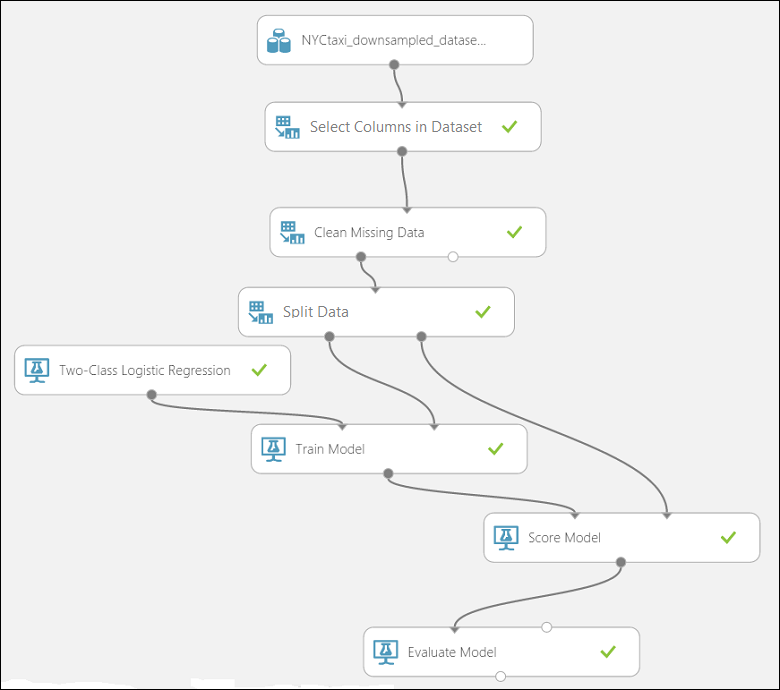
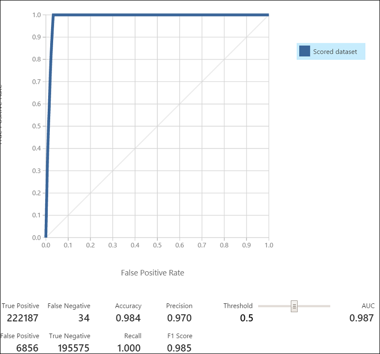
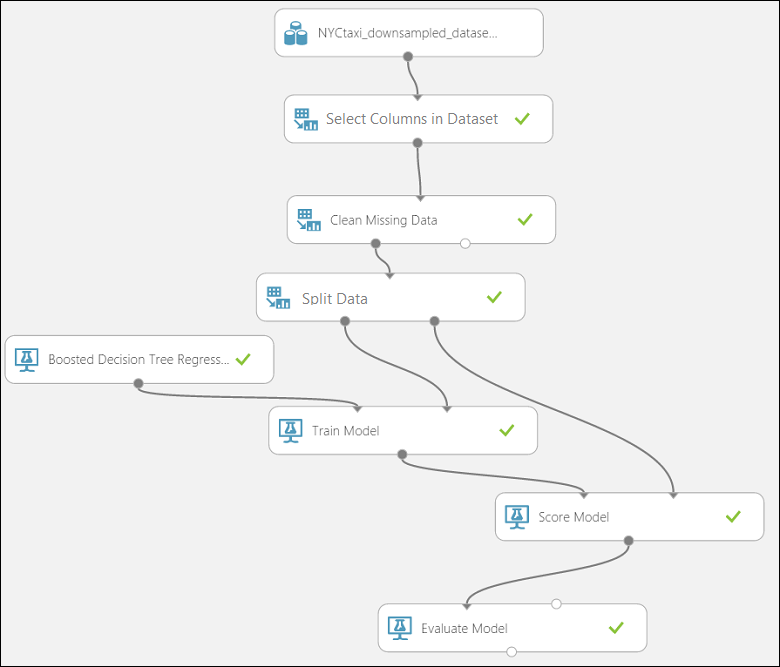

<properties
    pageTitle="Le processus d’équipe données scientifique en action : utilisation Hadoop clusters | Microsoft Azure"
    description="À l’aide du processus scientifique des données d’équipe pour un scénario de bout en bout utilisant un cluster HDInsight Hadoop pour créer et déployer un modèle à l’aide d’un jeu de données accessible au public."
    services="machine-learning,hdinsight"
    documentationCenter=""
    authors="bradsev"
    manager="jhubbard"
    editor="cgronlun" />

<tags
    ms.service="machine-learning"
    ms.workload="data-services"
    ms.tgt_pltfrm="na"
    ms.devlang="na"
    ms.topic="article"
    ms.date="09/19/2016"
    ms.author="hangzh;bradsev" />

# Le processus d’équipe données scientifique en action : utilisation des clusters HDInsight Hadoop

Dans cette procédure, nous utilisons l' [Équipe données scientifique processus (TDSP)](data-science-process-overview.md) dans un scénario de bout en bout à l’aide d’un [cluster Azure HDInsight Hadoop](https://azure.microsoft.com/services/hdinsight/) pour stocker, Explorer et fonctionnalité technicien les données à partir du dataset [NYC Taxi voyages](http://www.andresmh.com/nyctaxitrips/) disponible publiquement et vers le bas les données d’exemple. Modèles de données sont générées avec Azure Machine apprentissage pour traiter les binaires et multiclass tâches prédictives de classification et de régression.

Pour une procédure pas à pas qui montre comment gérer un jeu de données (1 To) supérieure d’un scénario similaire à l’aide de clusters HDInsight Hadoop pour traitement de données, voir [Équipe données scientifique processus - utilisation du clustering Azure HDInsight Hadoop sur un jeu de données de 1 to](machine-learning-data-science-process-hive-criteo-walkthrough.md).

Il est également possible d’utiliser un bloc-notes IPython permettant d’accomplir certaines tâches présentées la procédure pas à pas à l’aide du dataset de 1 To. Les utilisateurs qui souhaitent utiliser cette méthode doivent consulter la rubrique [procédure pas à pas Criteo à l’aide d’une connexion ODBC ruche](https://github.com/Azure/Azure-MachineLearning-DataScience/blob/master/Misc/DataScienceProcess/iPythonNotebooks/machine-Learning-data-science-process-hive-walkthrough-criteo.ipynb) .

## Description NYC Taxi voyages Dataset

Les données NYC Taxi voyage sont environ 20 Go de fichiers compressés valeurs séparées par des virgules (CSV) (~ 48 Go sans compression), comprenant plus de 173 millions individuels voyages et les tarifs payé pour chaque voyage. Chaque enregistrement voyage comprend les collecte et remise l’emplacement et heure, piratage rendue (pilote) licence numéros et medallion (id unique de taxi). Les données couvre tous les déplacements de l’année 2013 et sont fournies dans les deux jeux de données suivants pour chaque mois :

1. Les fichiers CSV 'trip_data' contiennent des informations de voyage, telles que nombre de voyageurs, collecte et cette chute points, la durée du voyage et longueur de voyage. Voici quelques exemples d’enregistrements :

        medallion,hack_license,vendor_id,rate_code,store_and_fwd_flag,pickup_datetime,dropoff_datetime,passenger_count,trip_time_in_secs,trip_distance,pickup_longitude,pickup_latitude,dropoff_longitude,dropoff_latitude
        89D227B655E5C82AECF13C3F540D4CF4,BA96DE419E711691B9445D6A6307C170,CMT,1,N,2013-01-01 15:11:48,2013-01-01 15:18:10,4,382,1.00,-73.978165,40.757977,-73.989838,40.751171
        0BD7C8F5BA12B88E0B67BED28BEA73D8,9FD8F69F0804BDB5549F40E9DA1BE472,CMT,1,N,2013-01-06 00:18:35,2013-01-06 00:22:54,1,259,1.50,-74.006683,40.731781,-73.994499,40.75066
        0BD7C8F5BA12B88E0B67BED28BEA73D8,9FD8F69F0804BDB5549F40E9DA1BE472,CMT,1,N,2013-01-05 18:49:41,2013-01-05 18:54:23,1,282,1.10,-74.004707,40.73777,-74.009834,40.726002
        DFD2202EE08F7A8DC9A57B02ACB81FE2,51EE87E3205C985EF8431D850C786310,CMT,1,N,2013-01-07 23:54:15,2013-01-07 23:58:20,2,244,.70,-73.974602,40.759945,-73.984734,40.759388
        DFD2202EE08F7A8DC9A57B02ACB81FE2,51EE87E3205C985EF8431D850C786310,CMT,1,N,2013-01-07 23:25:03,2013-01-07 23:34:24,1,560,2.10,-73.97625,40.748528,-74.002586,40.747868

2. Les fichiers CSV 'trip_fare' contiennent des détails sur le tarif payé pour chaque voyage, telles que type de paiement, prix, surcharge et taxes, conseils et péages et le montant total payé. Voici quelques exemples d’enregistrements :

        medallion, hack_license, vendor_id, pickup_datetime, payment_type, fare_amount, surcharge, mta_tax, tip_amount, tolls_amount, total_amount
        89D227B655E5C82AECF13C3F540D4CF4,BA96DE419E711691B9445D6A6307C170,CMT,2013-01-01 15:11:48,CSH,6.5,0,0.5,0,0,7
        0BD7C8F5BA12B88E0B67BED28BEA73D8,9FD8F69F0804BDB5549F40E9DA1BE472,CMT,2013-01-06 00:18:35,CSH,6,0.5,0.5,0,0,7
        0BD7C8F5BA12B88E0B67BED28BEA73D8,9FD8F69F0804BDB5549F40E9DA1BE472,CMT,2013-01-05 18:49:41,CSH,5.5,1,0.5,0,0,7
        DFD2202EE08F7A8DC9A57B02ACB81FE2,51EE87E3205C985EF8431D850C786310,CMT,2013-01-07 23:54:15,CSH,5,0.5,0.5,0,0,6
        DFD2202EE08F7A8DC9A57B02ACB81FE2,51EE87E3205C985EF8431D850C786310,CMT,2013-01-07 23:25:03,CSH,9.5,0.5,0.5,0,0,10.5

La clé unique à rejoindre voyage\_des données et voyage\_tarif est composée des champs : medallion, hack\_licence et capture\_date/heure.

Pour accéder à tous les détails pertinents pour un voyage particulier, il suffit de participation avec trois clés : « medallion », « piratage\_licence » et « collecte\_datetime ».

Nous décrivent plus de certains détails des données quand nous les stocker en tables Hive peu de temps.

## Exemples de tâches de prévision
Lorsque approche des données, en déterminant le type de prévisions que vous souhaitez rendre basé sur son analyse permet de clarifier les tâches dont vous aurez besoin à inclure dans votre processus.
Voici trois exemples de problèmes de prévision qui nous permettent de traiter dans cette procédure pas à pas dont formulation est basée sur le *Conseil\_montant*:

1. **Classification binaire**: prévoir ou non une info-bulle payée pour un voyage, c'est-à-dire un *Conseil\_montant* qui est supérieure à 0 f est un exemple positif, tandis que vous une *Conseil\_montant* de 0 € est un exemple négatif.

        Class 0 : tip_amount = $0
        Class 1 : tip_amount > $0

2. **Classification multiclass**: prévoir la plage de conseil montants payés pour le voyage. Nous diviser la *Conseil\_montant* dans cinq emplacements ou classes :

        Class 0 : tip_amount = $0
        Class 1 : tip_amount > $0 and tip_amount <= $5
        Class 2 : tip_amount > $5 and tip_amount <= $10
        Class 3 : tip_amount > $10 and tip_amount <= $20
        Class 4 : tip_amount > $20

3. **Tâche de régression**: prévoir la quantité de l’info-bulle payé pour un voyage.  

## Configurer un cluster HDInsight Hadoop pour analytique avancées

>[AZURE.NOTE] Il s’agit d’une tâche de **l’administrateur** .

Vous pouvez configurer un environnement Azure pour avancées analytique qui utilise un cluster HDInsight en trois étapes :

1. [Créer un compte de stockage](../storage/storage-create-storage-account.md): ce compte de stockage est utilisé pour le stockage de données dans le stockage Blob Azure. Les données utilisées dans les clusters HDInsight résident également ici.

2. [Personnaliser Azure HDInsight Hadoop clusters pour le processus d’Analytique avancée et la technologie](machine-learning-data-science-customize-hadoop-cluster.md). Cette étape crée un HDInsight Hadoop Azure cluster avec 64 bits Anaconda Python 2.7 installé sur tous les nœuds. Il existe deux étapes importantes à l’esprit lors de la personnalisation de votre cluster HDInsight.

    * N’oubliez pas de lier le compte de stockage créé à l’étape 1 avec votre cluster HDInsight lors de sa création. Ce compte de stockage est utilisé pour accéder aux données traitées au sein du cluster.

    * Une fois que le cluster est créé, activer l’accès à distance pour le nœud de tête du cluster. Accédez à l’onglet **Configuration** , puis cliquez sur **Activer à distance**. Cette étape spécifie les informations d’identification utilisateur utilisées pour la connexion à distance.

3. [Créer un espace de travail Azure Machine d’apprentissage](machine-learning-create-workspace.md): espace de travail ce Azure Machine formation sert à créer des modèles d’apprentissage automatique. Cette tâche est résolue à la fin une exploration de données initiales et vers le bas échantillonnage à l’aide du cluster HDInsight.

## Obtenir les données à partir d’une source publique

>[AZURE.NOTE] Il s’agit d’une tâche de **l’administrateur** .

Pour obtenir le dataset [NYC Taxi voyages](http://www.andresmh.com/nyctaxitrips/) à partir de son emplacement public, vous pouvez utiliser une des méthodes décrites à [Déplacer les données vers et depuis le stockage Blob Azure](machine-learning-data-science-move-azure-blob.md) pour copier les données sur votre ordinateur.

L’exemple suivant décrit comment utiliser AzCopy pour transférer des fichiers contenant des données. Pour télécharger et installer AzCopy suivez les instructions sur la [Mise en route avec l’utilitaire de ligne de commande AzCopy](../storage/storage-use-azcopy.md).

1. Dans une fenêtre d’invite de commandes, exécutez les commandes AzCopy suivantes en remplaçant *< path_to_data_folder >* par la destination souhaitée :

        "C:\Program Files (x86)\Microsoft SDKs\Azure\AzCopy\azcopy" /Source:https://nyctaxitrips.blob.core.windows.net/data /Dest:<path_to_data_folder> /S

2. Une fois la copie terminée, un total de 24 fichiers compressés sont dans le dossier de données choisi. Décompressez les fichiers téléchargés dans le même répertoire sur votre ordinateur local. Notez le dossier où se trouvent les fichiers décompressés. Ce dossier est appelé le *< chemin d’accès\_à\_unzipped_data\_fichiers\> * est ce qui suit.

## Télécharger les données dans le conteneur par défaut d’Azure HDInsight Hadoop cluster

>[AZURE.NOTE] Il s’agit d’une tâche de **l’administrateur** .

Dans les commandes suivantes AzCopy, remplacez les paramètres suivants avec les valeurs réelles que vous avez spécifié lors de la création du cluster Hadoop et décompresser les fichiers de données.

* ***& #60 ; path_to_data_folder >*** le répertoire (ainsi que le chemin d’accès) sur votre ordinateur qui contiennent les fichiers de données décompressés  
* ***& #60 ; nom de compte de stockage de cluster Hadoop >*** le compte de stockage associé à votre cluster HDInsight
* ***& #60 ; conteneur par défaut du cluster Hadoop >*** le conteneur par défaut utilisé par votre cluster. Notez que le nom du conteneur par défaut est généralement le même nom que le cluster lui-même. Par exemple, si le cluster est appelé « abc123.azurehdinsight.net », le conteneur par défaut est abc123.
* ***& #60 ; clé de compte de stockage >*** la clé pour le compte de stockage utilisé par votre cluster

À partir d’une invite de commandes ou une fenêtre de Windows PowerShell dans votre ordinateur, exécutez les deux commandes AzCopy suivantes.

Cette commande transfère les données de voyage au répertoire ***nyctaxitripraw*** dans le conteneur par défaut du cluster Hadoop.

        "C:\Program Files (x86)\Microsoft SDKs\Azure\AzCopy\azcopy" /Source:<path_to_unzipped_data_files> /Dest:https://<storage account name of Hadoop cluster>.blob.core.windows.net/<default container of Hadoop cluster>/nyctaxitripraw /DestKey:<storage account key> /S /Pattern:trip_data_*.csv

Cette commande transfère les données de prix au répertoire ***nyctaxifareraw*** dans le conteneur par défaut du cluster Hadoop.

        "C:\Program Files (x86)\Microsoft SDKs\Azure\AzCopy\azcopy" /Source:<path_to_unzipped_data_files> /Dest:https://<storage account name of Hadoop cluster>.blob.core.windows.net/<default container of Hadoop cluster>/nyctaxifareraw /DestKey:<storage account key> /S /Pattern:trip_fare_*.csv

Les données doivent maintenant dans le stockage Blob Azure et prête à être consommées au sein du cluster HDInsight.

## Connectez-vous au nœud de tête Hadoop cluster et et le préparer pour l’analyse de données exploratoires

>[AZURE.NOTE] Il s’agit d’une tâche de **l’administrateur** .

Pour accéder au nœud de tête du cluster pour l’analyse de données exploratoires et vers le bas d’échantillonnage des données, suivez la procédure décrite dans [Access Hadoop Cluster tête nœuds](machine-learning-data-science-customize-hadoop-cluster.md#headnode).

Dans cette procédure, nous utilisent principalement requêtes écrites dans [la ruche](https://hive.apache.org/), un langage de requête de type SQL, pour effectuer explorations données préliminaires. Les requêtes Hive sont stockés dans des fichiers .hql. Nous puis vers le bas exemples de ces données à utiliser au sein d’apprentissage automatique Azure pour la création de modèles.

Pour préparer le cluster analyse exploratoire, nous télécharger les fichiers de .hql contenant des scripts Hive pertinents à partir de [github](https://github.com/Azure/Azure-MachineLearning-DataScience/tree/master/Misc/DataScienceProcess/DataScienceScripts) dans un répertoire local (C:\temp) sur le nœud principal. Pour ce faire, ouvrez l' **invite de commande** à partir de dans le nœud de tête du cluster et exécutez les deux commandes suivantes :

    set script='https://raw.githubusercontent.com/Azure/Azure-MachineLearning-DataScience/master/Misc/DataScienceProcess/DataScienceScripts/Download_DataScience_Scripts.ps1'

    @powershell -NoProfile -ExecutionPolicy unrestricted -Command "iex ((new-object net.webclient).DownloadString(%script%))"

Ces deux commandes télécharge tous les fichiers .hql nécessaires dans cette procédure pas à pas dans le répertoire local ***C:\temp & #92 ;*** dans le nœud de tête.

## Créer des tableaux partitionnée par mois et base de données Hive

>[AZURE.NOTE] Il s’agit d’une tâche de **l’administrateur** .

Nous êtes maintenant prêts à créer des tables Hive pour notre dataset taxi NYC.
Dans le nœud de tête du cluster Hadoop, ouvrez la ***ligne de commande Hadoop*** sur le bureau du nœud principal, puis entrez le répertoire Hive en entrant la commande

    cd %hive_home%\bin

>[AZURE.NOTE] **Exécuter toutes les commandes Hive dans cette procédure pas à pas à partir de l’emplacement Hive ci-dessus / invite du répertoire. Cela se charge des problèmes chemin d’accès automatiquement. Nous utilisons les termes « Invite du répertoire Hive », « Hive bin / invite du répertoire » et « ligne de commande Hadoop « manière interchangeable dans cette procédure.**

À partir de l’invite du répertoire Hive, entrez la commande suivante dans Hadoop ligne de commande du nœud principal pour soumettre la requête Hive pour créer des tables et base de données Hive :

    hive -f "C:\temp\sample_hive_create_db_and_tables.hql"

Voici le contenu de la ***C:\temp\sample\_hive\_créer\_db\_et\_tables.hql*** fichier qui crée Hive de base de données ***nyctaxidb*** et des tables ***voyage*** et ***tarif***.

    create database if not exists nyctaxidb;

    create external table if not exists nyctaxidb.trip
    (
        medallion string,
        hack_license string,
        vendor_id string,
        rate_code string,
        store_and_fwd_flag string,
        pickup_datetime string,
        dropoff_datetime string,
        passenger_count int,
        trip_time_in_secs double,
        trip_distance double,
        pickup_longitude double,
        pickup_latitude double,
        dropoff_longitude double,
        dropoff_latitude double)  
    PARTITIONED BY (month int)
    ROW FORMAT DELIMITED FIELDS TERMINATED BY ',' lines terminated by '\n'
    STORED AS TEXTFILE LOCATION 'wasb:///nyctaxidbdata/trip' TBLPROPERTIES('skip.header.line.count'='1');

    create external table if not exists nyctaxidb.fare
    (
        medallion string,
        hack_license string,
        vendor_id string,
        pickup_datetime string,
        payment_type string,
        fare_amount double,
        surcharge double,
        mta_tax double,
        tip_amount double,
        tolls_amount double,
        total_amount double)
    PARTITIONED BY (month int)
    ROW FORMAT DELIMITED FIELDS TERMINATED BY ',' lines terminated by '\n'
    STORED AS TEXTFILE LOCATION 'wasb:///nyctaxidbdata/fare' TBLPROPERTIES('skip.header.line.count'='1');

Ce script Hive crée deux tables :

* la table « voyage » contient des informations de voyage de chaque portés (détails du pilote, heure d’extraction, distance de voyage et heures)
* la table « frais » contient des informations de prix (montant tarif, le montant de l’info-bulle, péages et suppléments).

Si vous avez besoin d’une aide supplémentaire sur les procédures suivantes ou souhaitez examiner les autres possibles, consultez la section [Soumettre ruche requêtes directement à partir de la ligne de commande de Hadoop ](machine-learning-data-science-move-hive-tables.md#submit).

## Charger les données aux tables Hive par partitions

>[AZURE.NOTE] Il s’agit d’une tâche de **l’administrateur** .

Le dataset de taxi NYC possède une partition naturel par mois, ce qui nous permet d’activer courts de traitement et la requête. Les commandes PowerShell ci-dessous (émis à partir du répertoire Hive à l’aide de la **ligne de commande Hadoop**) chargement les données aux tables Hive « voyage » et « frais » partitionnées par mois.

    for /L %i IN (1,1,12) DO (hive -hiveconf MONTH=%i -f "C:\temp\sample_hive_load_data_by_partitions.hql")

La *exemple\_hive\_charger\_données\_par\_partitions.hql* fichier contient les commandes suivantes **charger** .

    LOAD DATA INPATH 'wasb:///nyctaxitripraw/trip_data_${hiveconf:MONTH}.csv' INTO TABLE nyctaxidb.trip PARTITION (month=${hiveconf:MONTH});
    LOAD DATA INPATH 'wasb:///nyctaxifareraw/trip_fare_${hiveconf:MONTH}.csv' INTO TABLE nyctaxidb.fare PARTITION (month=${hiveconf:MONTH});

Notez qu’un certain nombre de requêtes Hive que nous utilisons ici dans le processus d’exploration implique la recherche au qu’une seule partition ou uniquement quelques partitions. Mais ces requêtes peuvent s’exécuter sur les données entiers.

### Afficher les bases de données dans le cluster HDInsight Hadoop

Pour afficher les bases de données créés dans HDInsight Hadoop cluster à l’intérieur de la fenêtre de ligne de commande Hadoop, exécutez la commande suivante en ligne de commande Hadoop :

    hive -e "show databases;"

### Afficher les tables Hive dans la base de données nyctaxidb

Pour afficher les tables de la base de données nyctaxidb, exécutez la commande suivante en ligne de commande Hadoop :

    hive -e "show tables in nyctaxidb;"

Nous pouvons confirmer que les tables sont répartis en utilisant la commande ci-dessous :

    hive -e "show partitions nyctaxidb.trip;"

Le résultat attendu est indiqué ci-dessous :

    month=1
    month=10
    month=11
    month=12
    month=2
    month=3
    month=4
    month=5
    month=6
    month=7
    month=8
    month=9
    Time taken: 2.075 seconds, Fetched: 12 row(s)

De même, nous pouvons vous assurer que la table tarif est partition en utilisant la commande ci-dessous :

    hive -e "show partitions nyctaxidb.fare;"

Le résultat attendu est indiqué ci-dessous :

    month=1
    month=10
    month=11
    month=12
    month=2
    month=3
    month=4
    month=5
    month=6
    month=7
    month=8
    month=9
    Time taken: 1.887 seconds, Fetched: 12 row(s)

## Ingénierie fonctionnalité dans Hive et l’exploration de données

>[AZURE.NOTE] Il s’agit d’une tâche de **Données scientifique** .

La fonction tâches pour les données chargées dans les tables Hive d’ingénierie et exploration de données peuvent être effectuées à l’aide de requêtes Hive. Voici quelques exemples de tâches, telles que nous vous guident dans cette section :

- Afficher les 10 premiers enregistrements dans les deux tables.
- Explorez globales pour les données de plusieurs champs dans différentes fenêtres de temps.
- Examinez la qualité des données des champs de longitude et latitude.
- Générer des étiquettes de classification binaire et multiclass selon la **Conseil\_montant**.
- Générer des fonctionnalités par computing la distance voyage direct.

### Exploration : Afficher les enregistrements 10 principaux de déplacement du tableau

>[AZURE.NOTE] Il s’agit d’une tâche de **Données scientifique** .

Pour afficher un aperçu de données, nous examinons 10 enregistrements de chaque table. Exécuter les deux requêtes suivantes séparément à partir de l’invite du répertoire Hive dans la console de ligne de commande Hadoop à inspecter les enregistrements.

Pour obtenir les 10 premiers enregistrements dans la table « voyage » à partir du premier mois :

    hive -e "select * from nyctaxidb.trip where month=1 limit 10;"

Pour obtenir les 10 premiers enregistrements dans la table « frais » à partir du premier mois :

    hive -e "select * from nyctaxidb.fare where month=1 limit 10;"

Il est souvent utile d’enregistrer les enregistrements dans un fichier pour l’affichage pratique. Une petite modification à la requête ci-dessus permet de réaliser ceci :

    hive -e "select * from nyctaxidb.fare where month=1 limit 10;" > C:\temp\testoutput

### Exploration : Afficher le nombre d’enregistrements dans chacune des 12 partitions

>[AZURE.NOTE] Il s’agit d’une tâche de **Données scientifique** .

Utiles est la façon dont le nombre de déplacements varie au cours de l’année civile. Regroupement par mois permet de voir ce à quoi ressemble cette distribution de déplacements.

    hive -e "select month, count(*) from nyctaxidb.trip group by month;"

Nous donne le résultat :

    1       14776615
    2       13990176
    3       15749228
    4       15100468
    5       15285049
    6       14385456
    7       13823840
    8       12597109
    9       14107693
    10      15004556
    11      14388451
    12      13971118
    Time taken: 283.406 seconds, Fetched: 12 row(s)

Dans ce cas, la première colonne est le mois et le second est le nombre de déplacements pour ce mois.

Nous pouvons également compter le nombre total d’enregistrements dans notre jeu de données de voyage à l’aide de la commande suivante à l’invite du répertoire Hive.

    hive -e "select count(*) from nyctaxidb.trip;"

Cela donne :

    173179759
    Time taken: 284.017 seconds, Fetched: 1 row(s)

À l’aide des commandes similaires à ceux indiqués pour le jeu de données de voyage, nous pouvons émettre Hive requêtes à partir de l’invite du répertoire Hive pour le jeu de données tarif valider le nombre d’enregistrements.

    hive -e "select month, count(*) from nyctaxidb.fare group by month;"

Nous donne le résultat :

    1       14776615
    2       13990176
    3       15749228
    4       15100468
    5       15285049
    6       14385456
    7       13823840
    8       12597109
    9       14107693
    10      15004556
    11      14388451
    12      13971118
    Time taken: 253.955 seconds, Fetched: 12 row(s)

Notez que le même nombre exact de voyages par mois est renvoyé pour les deux jeux de données. Ainsi, la première validation que les données ont été chargées correctement.

Compter le nombre total d’enregistrements dans le jeu de données tarif peut être effectuée à l’aide de la commande ci-dessous à partir de l’invite du répertoire Hive :

    hive -e "select count(*) from nyctaxidb.fare;"

Cela donne :

    173179759
    Time taken: 186.683 seconds, Fetched: 1 row(s)

Le nombre total d’enregistrements dans les deux tables est également identique. Cela fournit une deuxième validation que les données ont été chargées correctement.

### Exploration : Distribution de voyage par medallion

>[AZURE.NOTE] Il s’agit d’une tâche de **Données scientifique** .

Cet exemple identifie la medallion (nombres taxi) avec plus de 100 voyages au sein d’une période donnée. Les avantages de la requête à partir de l’accès à la table partitionnée dans la mesure où elle est soumise par la variable partition **mois**. Résultats de la requête sont écrits sur un queryoutput.tsv fichier local dans `C:\temp` sur le nœud principal.

    hive -f "C:\temp\sample_hive_trip_count_by_medallion.hql" > C:\temp\queryoutput.tsv

Voici le contenu de *exemple\_hive\_voyage\_count\_par\_medallion.hql* fichier pour l’inspection.

    SELECT medallion, COUNT(*) as med_count
    FROM nyctaxidb.fare
    WHERE month<=3
    GROUP BY medallion
    HAVING med_count > 100
    ORDER BY med_count desc;

La medallion dans le jeu de données taxi NYC identifie un cab unique. Nous pouvons identifier les fichiers CAB est « occupé » en demandant quels sont ceux qui plus de choses qu’un certain nombre de déplacements effectués dans une période donnée. L’exemple suivant identifie les fichiers CAB qui a créé plus de cent voyages dans la première trois mois et enregistre les résultats de requête dans un fichier local, C:\temp\queryoutput.tsv.

Voici le contenu de *exemple\_hive\_voyage\_count\_par\_medallion.hql* fichier pour l’inspection.

    SELECT medallion, COUNT(*) as med_count
    FROM nyctaxidb.fare
    WHERE month<=3
    GROUP BY medallion
    HAVING med_count > 100
    ORDER BY med_count desc;

À partir de l’invite du répertoire Hive, exécutez la commande suivante :

    hive -f "C:\temp\sample_hive_trip_count_by_medallion.hql" > C:\temp\queryoutput.tsv

### Exploration : Distribution de voyage en medallion et hack_license

>[AZURE.NOTE] Il s’agit d’une tâche de **Données scientifique** .

Lors de l’exploration un jeu de données, nous voulons fréquemment examiner le nombre de co-création-occurrences des groupes de valeurs. Cette section fournit un exemple de cette procédure pour les organismes et les pilotes.

La *exemple\_hive\_voyage\_count\_par\_medallion\_license.hql* fichier regroupe le jeu de données tarif sur « medallion » et « hack_license » et renvoie le nombre de chaque combinaison. Vous trouverez ci-dessous son contenu.

    SELECT medallion, hack_license, COUNT(*) as trip_count
    FROM nyctaxidb.fare
    WHERE month=1
    GROUP BY medallion, hack_license
    HAVING trip_count > 100
    ORDER BY trip_count desc;

Cette requête renvoie cab et combinaisons pilote particulier classés par nombre décroissant de déplacements.

À partir de l’invite du répertoire Hive, exécutez :

    hive -f "C:\temp\sample_hive_trip_count_by_medallion_license.hql" > C:\temp\queryoutput.tsv

Résultats de la requête sont écrits dans un fichier local C:\temp\queryoutput.tsv.

### Exploration : Évaluer la qualité des données en recherchant les enregistrements latitude/longitude incorrecte

>[AZURE.NOTE] Il s’agit d’une tâche de **Données scientifique** .

Un objectif commun d’analyse de données exploratoire consiste à éliminer les enregistrements non valides ou incorrectes. L’exemple dans cette section détermine si les longitude latitude champs ou contiennent une valeur en dehors de la zone NYC. Dans la mesure où il est probable que ces enregistrements avec une latitude-longitude erronée de valeurs, nous voulons les éliminer des données qui doit être utilisé pour une modélisation.

Voici le contenu de *exemple\_hive\_qualité\_assessment.hql* fichier pour l’inspection.

        SELECT COUNT(*) FROM nyctaxidb.trip
        WHERE month=1
        AND  (CAST(pickup_longitude AS float) NOT BETWEEN -90 AND -30
        OR    CAST(pickup_latitude AS float) NOT BETWEEN 30 AND 90
        OR    CAST(dropoff_longitude AS float) NOT BETWEEN -90 AND -30
        OR    CAST(dropoff_latitude AS float) NOT BETWEEN 30 AND 90);

À partir de l’invite du répertoire Hive, exécutez :

    hive -S -f "C:\temp\sample_hive_quality_assessment.hql"

L’argument *-s* inclus dans cette commande supprime l’impression écran état des tâches ruche carte/réduire. Ceci est utile, car cela permet l’écran impression du résultat de la requête Hive plus lisible.

### Exploration : Distribution de classe binaire des conseils de voyage

> [AZURE.NOTE] Il s’agit d’une tâche de **Données scientifique** .

Pour le problème de classification binaire sous forme de plan dans la section [exemples de tâches de prévision](machine-learning-data-science-process-hive-walkthrough.md#mltasks) , il est utile de savoir si une info-bulle a été donnée ou non. Cette distribution des conseils est binaire :

* Conseil donné (classe 1, Conseil\_montant > $0)  
* aucune info-bulle (classe 0, Conseil\_montant = 0 $).

La *exemple\_hive\_incliné\_frequencies.hql* pour cela, fichier illustré ci-dessous.

    SELECT tipped, COUNT(*) AS tip_freq
    FROM
    (
        SELECT if(tip_amount > 0, 1, 0) as tipped, tip_amount
        FROM nyctaxidb.fare
    )tc
    GROUP BY tipped;

À partir de l’invite du répertoire Hive, exécutez :

    hive -f "C:\temp\sample_hive_tipped_frequencies.hql"

### Exploration : Classe répartitions dans le paramètre multiclass

> [AZURE.NOTE] Il s’agit d’une tâche de **Données scientifique** .

Pour le problème de classification multiclass décrit dans la section [exemples de tâches de prévision](machine-learning-data-science-process-hive-walkthrough.md#mltasks) cet ensemble de données également prête à une classification naturelle dans lequel nous aimerions pour prévoir la quantité des conseils fournis. Nous pouvons utiliser des emplacements pour définir des plages de Conseil dans la requête. Pour obtenir les globales pour les cours pour les différents Conseil plages, nous utilisons la *exemple\_hive\_Conseil\_plage\_frequencies.hql* fichier. Vous trouverez ci-dessous son contenu.

    SELECT tip_class, COUNT(*) AS tip_freq
    FROM
    (
        SELECT if(tip_amount=0, 0,
            if(tip_amount>0 and tip_amount<=5, 1,
            if(tip_amount>5 and tip_amount<=10, 2,
            if(tip_amount>10 and tip_amount<=20, 3, 4)))) as tip_class, tip_amount
        FROM nyctaxidb.fare
    )tc
    GROUP BY tip_class;

Depuis la console de ligne de commande Hadoop, exécutez la commande suivante :

    hive -f "C:\temp\sample_hive_tip_range_frequencies.hql"

### Exploration : Calculer Direct Distance entre deux emplacements Longitude Latitude

> [AZURE.NOTE] Il s’agit d’une tâche de **Données scientifique** .

Ayant une mesure de la distance directe permet de déterminer la différence entre elle et la distance voyage réel. Nous inciter cette fonctionnalité en expliquant qu’un voyageurs peuvent être moins susceptibles de Conseil Si elles identifier que le pilote a eu intentionnellement les par un itinéraire beaucoup plus de temps.

Pour afficher la comparaison entre distance réellement parcouru et la [distance Haversine](http://en.wikipedia.org/wiki/Haversine_formula) entre deux points longitude latitude (la distance « plus grand cercle »), nous utilisons les fonctions trigonométriques disponibles dans Hive, ainsi :

    set R=3959;
    set pi=radians(180);

    insert overwrite directory 'wasb:///queryoutputdir'

    select pickup_longitude, pickup_latitude, dropoff_longitude, dropoff_latitude, trip_distance, trip_time_in_secs,
    ${hiveconf:R}*2*2*atan((1-sqrt(1-pow(sin((dropoff_latitude-pickup_latitude)
     *${hiveconf:pi}/180/2),2)-cos(pickup_latitude*${hiveconf:pi}/180)
     *cos(dropoff_latitude*${hiveconf:pi}/180)*pow(sin((dropoff_longitude-pickup_longitude)*${hiveconf:pi}/180/2),2)))
     /sqrt(pow(sin((dropoff_latitude-pickup_latitude)*${hiveconf:pi}/180/2),2)
     +cos(pickup_latitude*${hiveconf:pi}/180)*cos(dropoff_latitude*${hiveconf:pi}/180)*
     pow(sin((dropoff_longitude-pickup_longitude)*${hiveconf:pi}/180/2),2))) as direct_distance
    from nyctaxidb.trip
    where month=1
    and pickup_longitude between -90 and -30
    and pickup_latitude between 30 and 90
    and dropoff_longitude between -90 and -30
    and dropoff_latitude between 30 and 90;

Dans la requête ci-dessus, R est le rayon de la terre en miles et pi est convertie en radians. Notez que les points de longitude latitude sont « filtrés » pour supprimer les valeurs qui sont loin de la zone NYC.

Dans ce cas, nous écrire nos résultats dans un répertoire appelé « queryoutputdir ». La séquence de commandes ci-dessous crée tout d’abord ce répertoire de sortie, puis exécute la commande Hive.

À partir de l’invite du répertoire Hive, exécutez :

    hdfs dfs -mkdir wasb:///queryoutputdir

    hive -f "C:\temp\sample_hive_trip_direct_distance.hql"

Résultats de la requête sont écrits sur 9 BLOB Azure ***queryoutputdir/000000\_0*** à ***queryoutputdir/000008\_0*** sous le conteneur par défaut du cluster Hadoop.

Pour afficher la taille des BLOB individuels, nous exécutez la commande suivante à partir de l’invite du répertoire Hive :

    hdfs dfs -ls wasb:///queryoutputdir

Pour afficher le contenu d’un fichier donné, par exemple 000000\_0, nous utilisons de Hadoop `copyToLocal` commande, et donc.

    hdfs dfs -copyToLocal wasb:///queryoutputdir/000000_0 C:\temp\tempfile

> [AZURE.WARNING] `copyToLocal`peut être très lente pour les fichiers volumineux et n’est pas recommandé d’utiliser avec eux.  

Des principaux avantages d’avoir ces données se trouvent dans un blob Azure sont que nous pouvons Explorer les données au sein d’apprentissage automatique Azure à l’aide de l' [Importation de données] [ import-data] module.

## Exemples de modèles de données et générer dans l’apprentissage automatique Azure vers le bas

> [AZURE.NOTE] Il s’agit d’une tâche de **Données scientifique** .

Après la phase d’analyse des données exploratoires, nous sommes maintenant prêts vers le bas exemple les données pour la création de modèles d’apprentissage automatique Azure. Dans cette section, nous montrent comment utiliser une requête Hive vers le bas exemple les données, puis accessible à partir de l' [Importation de données] [ import-data] module dans l’apprentissage automatique Azure.

### Vers le bas les données d’échantillonnage

Il existe deux étapes dans cette procédure. Tout d’abord nous joignez les tables **nyctaxidb.trip** et **nyctaxidb.fare** sur trois clés présents dans tous les enregistrements : « medallion », « piratage\_licence », et « collecte\_datetime ». Nous puis générer une étiquette à classification binaire **incliné** et une étiquette de classification de classe à plusieurs **Conseil\_classe**.

Pour pouvoir vers le bas exemples de données directement à partir de l' [Importation de données] [ import-data] module dans l’apprentissage automatique Azure, il est nécessaire stocker les résultats de la requête ci-dessus à une table Hive interne. Dans ce qui suit, nous créer une table Hive interne et remplir son contenu avec la jointure et vers le bas des exemples de données.

La requête s’applique standards fonctions Hive directement pour générer l’heure du jour, semaine de l’année, jour de la semaine (1 correspond à lundi et 7 correspond à dimanche) à partir de la « collecte\_datetime « champ et la distance entre les emplacements de collecte et cette chute directe. Les utilisateurs peuvent désigner [LanguageManual UDF](https://cwiki.apache.org/confluence/display/Hive/LanguageManual+UDF) pour obtenir une liste complète de ces fonctions.

La requête puis vers le bas exemples de données afin que les résultats de la requête pouvant être affiché dans un Studio apprentissage Machine Azure. Seulement en est-il de 1 % du jeu de données d’origine sont importée dans le Studio.

Voici le contenu de *exemple\_hive\_préparer\_pour\_agréés\_full.hql* fichier qui prépare les données de construction dans l’apprentissage automatique Azure de modèle.

        set R = 3959;
        set pi=radians(180);

        create table if not exists nyctaxidb.nyctaxi_downsampled_dataset (

        medallion string,
        hack_license string,
        vendor_id string,
        rate_code string,
        store_and_fwd_flag string,
        pickup_datetime string,
        dropoff_datetime string,
        pickup_hour string,
        pickup_week string,
        weekday string,
        passenger_count int,
        trip_time_in_secs double,
        trip_distance double,
        pickup_longitude double,
        pickup_latitude double,
        dropoff_longitude double,
        dropoff_latitude double,
        direct_distance double,
        payment_type string,
        fare_amount double,
        surcharge double,
        mta_tax double,
        tip_amount double,
        tolls_amount double,
        total_amount double,
        tipped string,
        tip_class string
        )
        row format delimited fields terminated by ','
        lines terminated by '\n'
        stored as textfile;

        --- now insert contents of the join into the above internal table

        insert overwrite table nyctaxidb.nyctaxi_downsampled_dataset
        select
        t.medallion,
        t.hack_license,
        t.vendor_id,
        t.rate_code,
        t.store_and_fwd_flag,
        t.pickup_datetime,
        t.dropoff_datetime,
        hour(t.pickup_datetime) as pickup_hour,
        weekofyear(t.pickup_datetime) as pickup_week,
        from_unixtime(unix_timestamp(t.pickup_datetime, 'yyyy-MM-dd HH:mm:ss'),'u') as weekday,
        t.passenger_count,
        t.trip_time_in_secs,
        t.trip_distance,
        t.pickup_longitude,
        t.pickup_latitude,
        t.dropoff_longitude,
        t.dropoff_latitude,
        t.direct_distance,
        f.payment_type,
        f.fare_amount,
        f.surcharge,
        f.mta_tax,
        f.tip_amount,
        f.tolls_amount,
        f.total_amount,
        if(tip_amount>0,1,0) as tipped,
        if(tip_amount=0,0,
        if(tip_amount>0 and tip_amount<=5,1,
        if(tip_amount>5 and tip_amount<=10,2,
        if(tip_amount>10 and tip_amount<=20,3,4)))) as tip_class

        from
        (
        select
        medallion,
        hack_license,
        vendor_id,
        rate_code,
        store_and_fwd_flag,
        pickup_datetime,
        dropoff_datetime,
        passenger_count,
        trip_time_in_secs,
        trip_distance,
        pickup_longitude,
        pickup_latitude,
        dropoff_longitude,
        dropoff_latitude,
        ${hiveconf:R}*2*2*atan((1-sqrt(1-pow(sin((dropoff_latitude-pickup_latitude)
        *${hiveconf:pi}/180/2),2)-cos(pickup_latitude*${hiveconf:pi}/180)
        *cos(dropoff_latitude*${hiveconf:pi}/180)*pow(sin((dropoff_longitude-pickup_longitude)*${hiveconf:pi}/180/2),2)))
        /sqrt(pow(sin((dropoff_latitude-pickup_latitude)*${hiveconf:pi}/180/2),2)
        +cos(pickup_latitude*${hiveconf:pi}/180)*cos(dropoff_latitude*${hiveconf:pi}/180)*pow(sin((dropoff_longitude-pickup_longitude)*${hiveconf:pi}/180/2),2))) as direct_distance,
        rand() as sample_key

        from nyctaxidb.trip
        where pickup_latitude between 30 and 90
            and pickup_longitude between -90 and -30
            and dropoff_latitude between 30 and 90
            and dropoff_longitude between -90 and -30
        )t
        join
        (
        select
        medallion,
        hack_license,
        vendor_id,
        pickup_datetime,
        payment_type,
        fare_amount,
        surcharge,
        mta_tax,
        tip_amount,
        tolls_amount,
        total_amount
        from nyctaxidb.fare
        )f
        on t.medallion=f.medallion and t.hack_license=f.hack_license and t.pickup_datetime=f.pickup_datetime
        where t.sample_key<=0.01

Pour exécuter cette requête à partir de l’invite du répertoire Hive :

    hive -f "C:\temp\sample_hive_prepare_for_aml_full.hql"

Nous avons maintenant une table interne « nyctaxidb.nyctaxi_downsampled_dataset » est accessible à l’aide de l' [Importation de données] [ import-data] module d’apprentissage automatique Azure. En outre, nous pouvons utiliser ce groupe de données pour la création de modèles d’apprentissage automatique.  

### Utiliser le module importer des données dans l’apprentissage automatique Azure pour accéder aux données échantillonnées vers le bas

En tant que conditions préalables pour les requêtes Hive dans les [Importer des données] [ import-data] module d’apprentissage automatique Azure, nous avons besoin d’accès à un ordinateur Azure espace de travail de formation et les informations d’identification du cluster et son compte de stockage associé.

Certains détails sur l' [Importation de données] [ import-data] module et les paramètres d’entrée :

**URI du serveur HCatalog**: si le nom du cluster est abc123, alors qu’il s’agit simplement : https://abc123.azurehdinsight.net

**Nom du compte utilisateur Hadoop** : le nom d’utilisateur choisi pour le cluster (**pas** le nom d’utilisateur d’accès à distance)

**Mot de passe du compte de service Hadoop** : le mot de passe choisi pour le cluster (**pas** le mot de passe d’accès à distance)

**Emplacement des données de sortie** : cela est choisie pour être Azure.

**Nom de compte de stockage Azure** : nom du compte de stockage par défaut associé au cluster.

**Nom du conteneur Azure** : cette est le nom du conteneur par défaut pour le cluster et est généralement le même que le nom du cluster. Pour un cluster appelé « abc123 », il s’agit d’abc123 seulement.

> [AZURE.IMPORTANT] **N’importe quelle table nous souhaitons interroger à l’aide de l' [Importation de données] [ import-data] module dans l’apprentissage automatique Azure doit être une table interne.** Voici une astuce pour déterminer si une table T dans une base de données D.db est une table interne.

À partir de l’invite du répertoire Hive, exécutez la commande :

    hdfs dfs -ls wasb:///D.db/T

Si la table est une table interne et il est rempli, son contenu doit indiquer ici. Un autre moyen de déterminer si une table est une table interne consiste à utiliser l’Explorateur d’espace de stockage Azure. Utilisez-le pour rechercher le nom du conteneur par défaut du cluster, puis filtrer par le nom de table. Si le tableau et son contenu s’affiche, confirmez ainsi qu’il est une table interne.

Voici un aperçu de la requête Hive et les [Importer des données] [ import-data] module :

Notez que depuis notre vers le bas exemples de données se trouve dans le conteneur par défaut, la requête Hive obtenue à partir d’apprentissage automatique Azure est très simple est simplement un « sélectionnez * à partir de nyctaxidb.nyctaxi\_sous-échantillonnées\_données ».

Le dataset peut désormais être utilisé comme point de départ pour la création de modèles d’apprentissage automatique.

### Créer des modèles dans l’apprentissage automatique Azure

Nous sommes maintenant en mesure de procéder à la création de modèles et déploiement de modèles dans [l’Apprentissage automatique Azure](https://studio.azureml.net). Les données sont prêtes pour que nous puissions utiliser à résoudre les problèmes de prévision identifiés ci-dessus :

**1. classification binaire**: prévoir ou non une info-bulle a été payée pour un voyage.

**Étudiant utilisé :** Régression logistique deux cours

un. Pour résoudre ce problème, notre étiquette cible (ou classe) est « inclinée ». Notre dataset échantillonnée vers le bas d’origine constituée plusieurs colonnes qui sont pertes cible pour cette expérience classification. En particulier : Conseil\_de classes, de conseil\_montant et total\_montant révéler d’informations sur l’étiquette cible qui n’est pas disponible à l’heure de test. Nous supprimer ces colonnes prise en compte à l’aide de la [Sélection des colonnes dans le jeu de données] [ select-columns] module.

L’instantané ci-dessous montre notre expérience de prédire ou non une info-bulle payée pour un voyage donné.

b. Pour cette expérience, notre répartitions étiquette cible étaient à peu près 1:1.

L’instantané ci-dessous montre la distribution des info-bulle des étiquettes de classe pour le problème de classification binaire.

Par conséquent, nous obtenir un AUC de 0.987 comme le montre l’illustration suivante.

**2. classification multiclass**: prévoir la plage de conseil montants payés pendant votre voyage, en utilisant les classes définis précédemment.

**Étudiant utilisé :** Multiclass régression logistique

un. Pour résoudre ce problème, notre étiquette cible (ou classe) est « Conseil\_classe » qui peut prendre une des cinq valeurs (0,1,2,3,4). Comme dans le cas de classification binaire, nous avons quelques colonnes sont pertes cible pour cette expérience. En particulier : Bonhomme de neige, Conseil\_montant total\_montant révéler d’informations sur l’étiquette cible qui n’est pas disponible à l’heure de test. Nous supprimer ces colonnes à l’aide de la [Sélection des colonnes dans le jeu de données] [ select-columns] module.

L’instantané ci-dessous montre notre expérience de prédire emplacement dans lequel une info-bulle est susceptible de relever (classe 0 : Conseil = 0 $, classe 1 : Conseil > $0 et Conseil < = $5, classe 2 : Conseil 5 > $ et Conseil < = $10, classe 3 : Conseil 10 > $ et Conseil < = 20, classe 4 : Conseil > $20)

Maintenant, nous affichons ce à quoi ressemble notre distribution de classe test réel. Nous voyons que classe 0 et 1 pour les cours sont courants, les autres classes sont rares.

b. Pour cette expérience, nous utilisons une matrice confusion pour consulter notre précisions de prévision. Cela est indiqué ci-dessous.

Notez que tandis que notre précisions de cours sur les classes courants est assez bonne, le modèle n’effectue pas un bon travail de « apprentissage » sur les classes rares.

**3. tâche régression**: prévoir la quantité de conseil payé pour un voyage.

**Étudiant utilisé :** Arbre de décision augmentée

un. Pour résoudre ce problème, notre étiquette cible (ou classe) est « Conseil\_montant ». Notre pertes cible sont dans ce cas : Bonhomme de neige, Conseil\_cours, total\_montant ; toutes ces variables divulguer des informations sur la quantité de Conseil est généralement pas disponible à l’heure de test. Nous supprimer ces colonnes à l’aide de la [Sélection des colonnes dans le jeu de données] [ select-columns] module.

La belows instantané affiche notre expérience pour prévoir la quantité de l’info-bulle donnée.

b. Les problèmes de régression, nous mesurer les précisions de notre prévision en consultant la valeur d’erreur dans les prévisions, le coefficient de détermination et j’aime. Nous affichons ces ci-dessous.

Nous voyons que sur le coefficient de détermination est 0.709, impliquant environ 71 % de la variance est expliqué par notre coefficients du modèle.

> [AZURE.IMPORTANT] Pour en savoir plus sur l’apprentissage automatique Azure et comment accéder et l’utiliser, reportez-vous à [Nouveautés apprentissage automatique ?](machine-learning-what-is-machine-learning.md). Une ressource très utile pour jouer avec quelques expériences d’apprentissage automatique sur apprentissage automatique Azure est la [Galerie d’Intelligence Cortana](https://gallery.cortanaintelligence.com/). La galerie couvre une gamme d’expériences et fournit une introduction approfondie dans la gamme des fonctionnalités d’apprentissage automatique Azure.

## Informations de licence

Cette procédure pas à pas exemples et ses scripts accompagnent sont partagées par Microsoft sous licence. Veuillez archiver ce fichier dans le répertoire des exemples de code sur GitHub pour plus d’informations.

## Références

• [Andrés Monroy NYC Taxi voyages Page de téléchargement](http://www.andresmh.com/nyctaxitrips/)  
• [Blocage des données de voyage de NYC Taxi par Chris Whong](http://chriswhong.com/open-data/foil_nyc_taxi/)   
• [NYC Taxi et briefings Commission recherche ainsi que les statistiques](https://www1.nyc.gov/html/tlc/html/about/statistics.shtml)

[2]: ./media/machine-learning-data-science-process-hive-walkthrough/output-hive-results-3.png
[11]: ./media/machine-learning-data-science-process-hive-walkthrough/hive-reader-properties.png
[12]: ./media/machine-learning-data-science-process-hive-walkthrough/binary-classification-training.png
[13]: ./media/machine-learning-data-science-process-hive-walkthrough/create-scoring-experiment.png
[14]: ./media/machine-learning-data-science-process-hive-walkthrough/binary-classification-scoring.png
[15]: ./media/machine-learning-data-science-process-hive-walkthrough/amlreader.png

<!-- Module References -->
[select-columns]: https://msdn.microsoft.com/library/azure/1ec722fa-b623-4e26-a44e-a50c6d726223/
[import-data]: https://msdn.microsoft.com/library/azure/4e1b0fe6-aded-4b3f-a36f-39b8862b9004/
