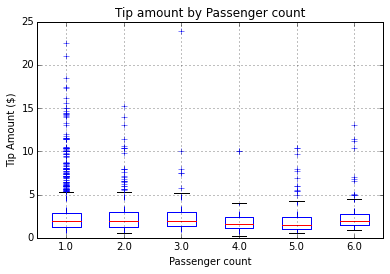
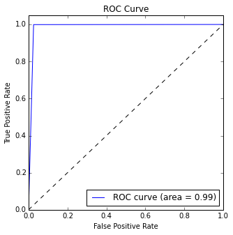

<properties
    pageTitle="Scientifique de données à l’aide de Scala et explosion sur Azure | Microsoft Azure"
    description="Comment utiliser Scala pour les tâches d’apprentissage machine contrôlés avec les packages explosion les MLlib ML explosion scalable sur un cluster Azure HDInsight explosion."  
    services="machine-learning"
    documentationCenter=""
    authors="bradsev"
    manager="jhubbard"
    editor="cgronlun" />

<tags
    ms.service="machine-learning"
    ms.workload="data-services"
    ms.tgt_pltfrm="na"
    ms.devlang="na"
    ms.topic="article"
    ms.date="08/01/2016"
    ms.author="bradsev;deguhath"/>

# Scientifique de données à l’aide de Scala et explosion sur Azure

Cet article vous explique comment utiliser Scala pour les tâches d’apprentissage machine contrôlés avec les packages explosion les MLlib ML explosion scalable sur un cluster Azure HDInsight explosion. Il vous guide dans les tâches qui constituent le [processus de données scientifique](http://aka.ms/datascienceprocess): réception de données et exploration, la visualisation, ingénierie fonctionnalité, modélisation et consommation de modèle. Les modèles dans l’article sont régression linéaire et logistique, aléatoires forêts et les arborescences augmentée de dégradé (GBTs), en plus de deux tâches d’apprentissage machine contrôlés courantes :

- Problème de régression : prédiction montant de l’info-bulle ($) pour un voyage taxi
- Classement binaire : prédiction de Conseil ou aucune info-bulle (1/0) pour un voyage taxi

Le processus de modélisation requiert une formation et évaluation dans un jeu de données de test et d’indicateurs de précision pertinents. Dans cet article, vous pouvez en savoir comment stocker ces modèles dans le stockage Blob Azure et score général et d’évaluer leurs performances prédictive. Cet article traite également les rubriques plus avancées de l’optimisation des modèles à l’aide de validation croisée et hyper-paramètre balayage. Les données utilisées sont un échantillon 2013 NYC taxi voyage et tarif jeu de données disponible sur GitHub.

[Scala](http://www.scala-lang.org/), un langage basé sur la machine virtuelle, intègre les concepts du langage fonctionnel et orientée objet. Il est un langage scalable qui est adapté au traitement distribué dans le cloud et s’exécute sur Azure explosion clusters.

[Explosion](http://spark.apache.org/) est une infrastructure de traitement parallèle open source qui prend en charge le traitement en mémoire pour améliorer les performances des données volumineuses analytique applications. Le moteur de traitement et intégré pour la vitesse, facilité d’utilisation et sophistiquées analytique. Calcul distribué en mémoire fonctionnalités du explosion rendent un bon choix pour algorithmes itératifs dans les calculs de graphique et l’apprentissage machine. Le package [spark.ml](http://spark.apache.org/docs/latest/ml-guide.html) fournit un jeu de haut niveau API basées sur des données cadres qui peuvent vous aider à créer et analyser les pratiques d’apprentissage automatique pipelines uniforme. [MLlib](http://spark.apache.org/mllib/) est bibliothèque d’apprentissage automatique scalable d’explosion, qui donne des fonctions de modélisation à cet environnement distribué.

[HDInsight explosion](../hdinsight/hdinsight-apache-spark-overview.md) est l’offre hébergé Azure d’explosion open source. Il prend en charge les blocs-notes Jupyter Scala sur le cluster explosion et vous pouvez exécuter des requêtes interactives SQL explosion pour transformer, filtrer et visualiser des données stockées dans le stockage Blob Azure. Extraits de code Scala dans cet article qui fournissent les solutions et indique les tracés pertinents pour visualiser les données s’exécutent dans les blocs-notes Jupyter installés sur les groupes d’explosion. Les étapes de modélisation dans ces rubriques posséder un code qui vous montre comment former, évaluer, enregistrer et consommer chaque type de modèle.

Les étapes de configuration et le code dans cet article sont appliquent aux Azure HDInsight 3.4 explosion 1,6. Toutefois, le code dans cet article et dans le [Bloc-notes de Jupyter Scala](https://github.com/Azure/Azure-MachineLearning-DataScience/blob/master/Misc/Spark/Scala/Exploration%20Modeling%20and%20Scoring%20using%20Scala.ipynb) sont générique et devraient fonctionner sur n’importe quel cluster explosion. Les étapes de configuration et la gestion de cluster peuvent être légèrement différents de celui présenté dans cet article si vous n’utilisez pas HDInsight Spark.

> [AZURE.NOTE] Pour une rubrique qui vous montre comment utiliser les Python plutôt que Scala pour effectuer les tâches d’un processus de données scientifique de bout en bout, voir [Des données à l’aide d’explosion sur Azure HDInsight](machine-learning-data-science-spark-overview.md).

## Conditions préalables

-   Vous devez posséder un abonnement Azure. Si vous ne figure pas un, [Obtenez un essai gratuit Azure](https://azure.microsoft.com/documentation/videos/get-azure-free-trial-for-testing-hadoop-in-hdinsight/).

-   Vous avez besoin d’un cluster Azure HDInsight 3.4 explosion 1,6 à effectuer les procédures suivantes. Pour créer un cluster, consultez les instructions dans [prise en main : créer Apache explosion sur Azure HDInsight](../hdinsight/hdinsight-apache-spark-jupyter-spark-sql.md). Définir le type de cluster et la version dans le menu **Sélectionner un Type de Cluster** .

>[AZURE.INCLUDE [delete-cluster-warning](../../includes/hdinsight-delete-cluster-warning.md)]

Pour obtenir une description des données de voyage NYC taxi et des instructions sur la façon d’exécuter du code d’un bloc-notes Jupyter sur le cluster explosion, consultez les sections correspondantes en [Vue d’ensemble de données sciences à l’aide d’explosion sur Azure HDInsight](machine-learning-data-science-spark-overview.md).  

## Exécuter du code Scala d’un bloc-notes Jupyter sur le cluster d’explosion

Vous pouvez lancer un bloc-notes Jupyter à partir du portail Azure. Trouver le cluster explosion dans votre tableau de bord, puis cliquez dessus pour accéder à la page de gestion de votre cluster. Ensuite, cliquez sur **Tableaux de bord Cluster**, puis cliquez sur **Bloc-notes Jupyter** pour ouvrir le bloc-notes associé au cluster explosion.

Vous pouvez également accéder à blocs-notes Jupyter en https://&lt;nomducluster&gt;.azurehdinsight.net/jupyter. Remplacez *nomducluster* par le nom de votre cluster. Vous devez le mot de passe pour votre compte d’administrateur accéder aux blocs-notes Jupyter.

Sélectionnez **Scala** pour afficher un répertoire avec quelques exemples des blocs-notes intégrées qui utilisent l’API PySpark. L’Exploration de modélisation et score à l’aide de bloc-notes Scala.ipynb qui contient les exemples de code pour cette suite de rubriques explosion est disponible sur [GitHub](https://github.com/Azure/Azure-MachineLearning-DataScience/tree/master/Misc/Spark/Scala).

Vous pouvez télécharger le bloc-notes directement à partir de GitHub sur le serveur Jupyter bloc-notes sur votre cluster explosion. Dans votre page d’accueil Jupyter, cliquez sur le bouton **Télécharger** . Dans l’Explorateur de fichiers, collez l’URL (contenu brut) GitHub du bloc-notes Scala, puis cliquez sur **Ouvrir**. Le bloc-notes Scala est disponible à l’adresse suivante :

[Exploration-Modeling-and-Scoring-using-Scala.ipynb](https://github.com/Azure/Azure-MachineLearning-DataScience/blob/master/Misc/Spark/Scala/Exploration-Modeling-and-Scoring-using-Scala.ipynb)

## Installation : Contextes explosion prédéfini et Hive magics explosion et bibliothèques d’explosion

### Contextes explosion et Hive prédéfinis

    # SET THE START TIME
    import java.util.Calendar
    val beginningTime = Calendar.getInstance().getTime()

Les noyaux explosion qui sont fournis avec des blocs-notes Jupyter ont prédéfinis contextes. Vous n’avez pas besoin de définir explicitement l’explosion ou contextes Hive avant de commencer à utiliser l’application que vous développez. Les contextes prédéfinis sont :

- `sc`pour SparkContext
- `sqlContext`pour HiveContext

### Magics d’explosion

Le noyau explosion fournit certaines prédéfinis « magics », qui sont des commandes spéciales que vous pouvez appeler avec `%%`. Deux de ces commandes sont utilisées dans les exemples de code suivantes.

- `%%local`Spécifie que le code dans les lignes suivantes sera exécuté localement. Le code doit être code Scala valide.
- `%%sql -o <variable name>`exécute une requête Hive sur `sqlContext`. Si la `-o` paramètre est passé, le résultat de la requête est conservé dans le `%%local` Scala contexte comme une trame de données explosion.

Pour plus d’informations sur les noyaux pour Jupyter blocs-notes et leurs prédéfini « magics » qui vous appelez avec `%%` (par exemple, `%%local`), voir [noyaux disponibles pour les blocs-notes Jupyter avec des clusters HDInsight explosion Linux sur HDInsight](../hdinsight/hdinsight-apache-spark-jupyter-notebook-kernels.md).

### Bibliothèques d’importation

Importer l’explosion, MLlib et autres bibliothèques que vous devez en utilisant le code suivant.

    # IMPORT SPARK AND JAVA LIBRARIES
    import org.apache.spark.sql.SQLContext
    import org.apache.spark.sql.functions._
    import java.text.SimpleDateFormat
    import java.util.Calendar
    import sqlContext.implicits._
    import org.apache.spark.sql.Row

    # IMPORT SPARK SQL FUNCTIONS
    import org.apache.spark.sql.types.{StructType, StructField, StringType, IntegerType, FloatType, DoubleType}
    import org.apache.spark.sql.functions.rand

    # IMPORT SPARK ML FUNCTIONS
    import org.apache.spark.ml.Pipeline
    import org.apache.spark.ml.feature.{StringIndexer, VectorAssembler, OneHotEncoder, VectorIndexer, Binarizer}
    import org.apache.spark.ml.tuning.{ParamGridBuilder, TrainValidationSplit, CrossValidator}
    import org.apache.spark.ml.regression.{LinearRegression, LinearRegressionModel, RandomForestRegressor, RandomForestRegressionModel, GBTRegressor, GBTRegressionModel}
    import org.apache.spark.ml.classification.{LogisticRegression, LogisticRegressionModel, RandomForestClassifier, RandomForestClassificationModel, GBTClassifier, GBTClassificationModel}
    import org.apache.spark.ml.evaluation.{BinaryClassificationEvaluator, RegressionEvaluator, MulticlassClassificationEvaluator}

    # IMPORT SPARK MLLIB FUNCTIONS
    import org.apache.spark.mllib.linalg.{Vector, Vectors}
    import org.apache.spark.mllib.util.MLUtils
    import org.apache.spark.mllib.classification.{LogisticRegressionWithLBFGS, LogisticRegressionModel}
    import org.apache.spark.mllib.regression.{LabeledPoint, LinearRegressionWithSGD, LinearRegressionModel}
    import org.apache.spark.mllib.tree.{GradientBoostedTrees, RandomForest}
    import org.apache.spark.mllib.tree.configuration.BoostingStrategy
    import org.apache.spark.mllib.tree.model.{GradientBoostedTreesModel, RandomForestModel, Predict}
    import org.apache.spark.mllib.evaluation.{BinaryClassificationMetrics, MulticlassMetrics, RegressionMetrics}

    # SPECIFY SQLCONTEXT
    val sqlContext = new SQLContext(sc)

## Réception de données

La première étape du processus de données scientifique est envoyer les données que vous souhaitez analyser. Vous importer les données à partir de sources externes ou des systèmes dans lequel il réside dans votre environnement d’exploration et modélisation de données. Dans cet article, les données que vous d’acquisition sont un exemple de 0,1 % joints du taxi voyage et tarif de fichier (stocké sous forme de fichier .tsv). L’environnement d’exploration et modélisation de données est explosion. Cette section contient le code pour compléter la série de tâches suivante :

1. Définir les chemins d’accès pour le stockage des données et le modèle.
2. Lisez dans le jeu de données d’entrée (stocké sous forme de fichier .tsv).
3. Définir un schéma pour les données et effacer les données.
4. Créer une trame de données nettoyé et mettre en cache en mémoire.
5. Enregistrer les données sous forme de tableau temporaire dans SQLContext.
6. Interroger la table et importer les résultats dans une trame de données.

### Définir les chemins d’accès pour les emplacements de stockage dans le stockage Blob Azure

Explosion peut lire et écrire au stockage d’objets Blob Azure. Vous pouvez utiliser explosion pour traiter tous vos données existantes et puis stocker les résultats à nouveau dans le stockage Blob.

Pour enregistrer les modèles ou les fichiers dans le stockage Blob, vous devez spécifier correctement le chemin d’accès. Référencer le conteneur par défaut lié au cluster explosion à l’aide d’un chemin d’accès commence par `wasb:///`. Faire référence à d’autres emplacements à l’aide de `wasb://`.

L’exemple de code suivant indique l’emplacement des données d’entrée pour la lecture et le chemin d’accès au stockage d’objets Blob est joint au cluster explosion où le modèle doit être enregistré.

    # SET PATHS TO DATA AND MODEL FILE LOCATIONS
    # INGEST DATA AND SPECIFY HEADERS FOR COLUMNS
    val taxi_train_file = sc.textFile("wasb://mllibwalkthroughs@cdspsparksamples.blob.core.windows.net/Data/NYCTaxi/JoinedTaxiTripFare.Point1Pct.Train.tsv")
    val header = taxi_train_file.first;

    # SET THE MODEL STORAGE DIRECTORY PATH
    # NOTE THAT THE FINAL BACKSLASH IN THE PATH IS REQUIRED.
    val modelDir = "wasb:///user/remoteuser/NYCTaxi/Models/";

### Importer des données, créer une RDD et définir une trame de données par rapport au schéma

    # RECORD THE START TIME
    val starttime = Calendar.getInstance().getTime()

    # DEFINE THE SCHEMA BASED ON THE HEADER OF THE FILE
    val sqlContext = new SQLContext(sc)
    val taxi_schema = StructType(
        Array(
            StructField("medallion", StringType, true),
            StructField("hack_license", StringType, true),
            StructField("vendor_id", StringType, true),
            StructField("rate_code", DoubleType, true),
            StructField("store_and_fwd_flag", StringType, true),
            StructField("pickup_datetime", StringType, true),
            StructField("dropoff_datetime", StringType, true),
            StructField("pickup_hour", DoubleType, true),
            StructField("pickup_week", DoubleType, true),
            StructField("weekday", DoubleType, true),
            StructField("passenger_count", DoubleType, true),
            StructField("trip_time_in_secs", DoubleType, true),
            StructField("trip_distance", DoubleType, true),
            StructField("pickup_longitude", DoubleType, true),
            StructField("pickup_latitude", DoubleType, true),
            StructField("dropoff_longitude", DoubleType, true),
            StructField("dropoff_latitude", DoubleType, true),
            StructField("direct_distance", StringType, true),
            StructField("payment_type", StringType, true),
            StructField("fare_amount", DoubleType, true),
            StructField("surcharge", DoubleType, true),
            StructField("mta_tax", DoubleType, true),
            StructField("tip_amount", DoubleType, true),
            StructField("tolls_amount", DoubleType, true),
            StructField("total_amount", DoubleType, true),
            StructField("tipped", DoubleType, true),
            StructField("tip_class", DoubleType, true)
            )
        )

    # CAST VARIABLES ACCORDING TO THE SCHEMA
    val taxi_temp = (taxi_train_file.map(_.split("\t"))
                            .filter((r) => r(0) != "medallion")
                            .map(p => Row(p(0), p(1), p(2),
                                p(3).toDouble, p(4), p(5), p(6), p(7).toDouble, p(8).toDouble, p(9).toDouble, p(10).toDouble,
                                p(11).toDouble, p(12).toDouble, p(13).toDouble, p(14).toDouble, p(15).toDouble, p(16).toDouble,
                                p(17), p(18), p(19).toDouble, p(20).toDouble, p(21).toDouble, p(22).toDouble,
                                p(23).toDouble, p(24).toDouble, p(25).toDouble, p(26).toDouble)))

    # CREATE AN INITIAL DATA FRAME AND DROP COLUMNS, AND THEN CREATE A CLEANED DATA FRAME BY FILTERING FOR UNWANTED VALUES OR OUTLIERS
    val taxi_train_df = sqlContext.createDataFrame(taxi_temp, taxi_schema)

    val taxi_df_train_cleaned = (taxi_train_df.drop(taxi_train_df.col("medallion"))
            .drop(taxi_train_df.col("hack_license")).drop(taxi_train_df.col("store_and_fwd_flag"))
            .drop(taxi_train_df.col("pickup_datetime")).drop(taxi_train_df.col("dropoff_datetime"))
            .drop(taxi_train_df.col("pickup_longitude")).drop(taxi_train_df.col("pickup_latitude"))
            .drop(taxi_train_df.col("dropoff_longitude")).drop(taxi_train_df.col("dropoff_latitude"))
            .drop(taxi_train_df.col("surcharge")).drop(taxi_train_df.col("mta_tax"))
            .drop(taxi_train_df.col("direct_distance")).drop(taxi_train_df.col("tolls_amount"))
            .drop(taxi_train_df.col("total_amount")).drop(taxi_train_df.col("tip_class"))
            .filter("passenger_count > 0 and passenger_count < 8 AND payment_type in ('CSH', 'CRD') AND tip_amount >= 0 AND tip_amount < 30 AND fare_amount >= 1 AND fare_amount < 150 AND trip_distance > 0 AND trip_distance < 100 AND trip_time_in_secs > 30 AND trip_time_in_secs < 7200"));

    # CACHE AND MATERIALIZE THE CLEANED DATA FRAME IN MEMORY
    taxi_df_train_cleaned.cache()
    taxi_df_train_cleaned.count()

    # REGISTER THE DATA FRAME AS A TEMPORARY TABLE IN SQLCONTEXT
    taxi_df_train_cleaned.registerTempTable("taxi_train")

    # GET THE TIME TO RUN THE CELL
    val endtime = Calendar.getInstance().getTime()
    val elapsedtime =  ((endtime.getTime() - starttime.getTime())/1000).toString;
    println("Time taken to run the above cell: " + elapsedtime + " seconds.");

**Résultat :**

Temps d’exécution de la cellule : 8 secondes.

### Interroger la table et importer les résultats dans une trame de données

Ensuite, interrogez la table pour les prix, voyageurs et données Conseil ; filtrer les données endommagées et isolées ; et imprimer plusieurs lignes.

    # QUERY THE DATA
    val sqlStatement = """
        SELECT fare_amount, passenger_count, tip_amount, tipped
        FROM taxi_train
        WHERE passenger_count > 0 AND passenger_count < 7
        AND fare_amount > 0 AND fare_amount < 200
        AND payment_type in ('CSH', 'CRD')
        AND tip_amount > 0 AND tip_amount < 25
    """
    val sqlResultsDF = sqlContext.sql(sqlStatement)

    # SHOW ONLY THE TOP THREE ROWS
    sqlResultsDF.show(3)

**Résultat :**

fare_amount|passenger_count|tip_amount|Bonhomme de neige
-----------|---------------|----------|------
       13.5|            1.0|       égal à 2,9|   1.0
       16.0|            2.0|       3.4|   1.0
       10.5|            2.0|       1.0|   1.0

## Visualisation et l’exploration de données

Une fois que vous importez les données dans explosion, l’étape suivante dans le processus de données scientifique consiste à mieux comprendre les données par le biais de détails et de visualisation. Dans cette section, vous examinez les données taxi à l’aide de requêtes SQL. Ensuite, importer les résultats dans une trame de données à tracer les variables cibles et les fonctionnalités potentiels d’inspection visuelle en utilisant la fonctionnalité automatique visualisation de Jupyter.

### Permet de tracer les données locales et magie SQL

Par défaut, la sortie de n’importe quel extrait de code que vous exécutez à partir d’un bloc-notes Jupyter est disponible dans le contexte de la session est conservé sur les nœuds de travail. Si vous souhaitez enregistrer un voyage dans les nœuds de travail pour chaque calcul, et si toutes les données que vous avez besoin pour votre calcul est disponible localement sur le nœud du serveur Jupyter (qui est le nœud de tête), vous pouvez utiliser la `%%local` magie pour exécuter l’extrait de code sur le serveur Jupyter.

- **Magie SQL** (`%%sql`). Le noyau HDInsight Spark prend en charge inline facile HiveQL requêtes sur SQLContext. La (`-o VARIABLE_NAME`) argument persiste le résultat de la requête SQL comme une trame de données Pandas sur le serveur Jupyter. Cela signifie qu’il soit disponible dans le mode local.
- `%%local`**magie**. La `%%local` magie s’exécute le code localement sur le serveur Jupyter, qui est le nœud de tête du cluster HDInsight. En règle générale, vous utilisez `%%local` magique conjointement avec la `%%sql` magique avec la `-o` paramètre. La `-o` paramètre serait conserver le résultat de la requête SQL localement, puis `%%local` magie susceptibles de déclencher l’ensemble d’être exécutés localement sur la sortie des requêtes SQL qui est conservée localement extrait de code suivant.

### Interroger les données à l’aide de SQL
Cette requête extrait les déplacements taxi par montant tarif, le nombre de voyageurs et montant de Conseil.

    # RUN THE SQL QUERY
    %%sql -q -o sqlResults
    SELECT fare_amount, passenger_count, tip_amount, tipped FROM taxi_train WHERE passenger_count > 0 AND passenger_count < 7 AND fare_amount > 0 AND fare_amount < 200 AND payment_type in ('CSH', 'CRD') AND tip_amount > 0 AND tip_amount < 25

Dans le code suivant, la `%%local` magie crée une trame de données locale, sqlResults. Vous pouvez utiliser sqlResults pour tracer à l’aide de matplotlib.

> [AZURE.TIP] Magie local est utilisé plusieurs fois dans cet article. Si votre jeu de données est volumineuse, veuillez des exemples pour créer une trame de données pouvant être affiché dans la mémoire locale.

### Tracer les données

Vous pouvez tracer à l’aide de code Python après que la trame de données se trouve dans le contexte local comme une trame de données Pandas.

    # RUN THE CODE LOCALLY ON THE JUPYTER SERVER
    %%local

    # USE THE JUPYTER AUTO-PLOTTING FEATURE TO CREATE INTERACTIVE FIGURES.
    # CLICK THE TYPE OF PLOT TO GENERATE (LINE, AREA, BAR, ETC.)
    sqlResults

 Le noyau explosion visualise automatiquement la sortie des requêtes SQL (HiveQL) une fois que vous exécutez le code. Vous pouvez choisir entre plusieurs types de visualisations :
 
- Table
- Graphique en secteurs
- Ligne
- Zone
- Barre

Voici le code pour tracer les données :

    # RUN THE CODE LOCALLY ON THE JUPYTER SERVER AND IMPORT LIBRARIES
    %%local
    import matplotlib.pyplot as plt
    %matplotlib inline

    # PLOT TIP BY PAYMENT TYPE AND PASSENGER COUNT
    ax1 = sqlResults[['tip_amount']].plot(kind='hist', bins=25, facecolor='lightblue')
    ax1.set_title('Tip amount distribution')
    ax1.set_xlabel('Tip Amount ($)')
    ax1.set_ylabel('Counts')
    plt.suptitle('')
    plt.show()

    # PLOT TIP BY PASSENGER COUNT
    ax2 = sqlResults.boxplot(column=['tip_amount'], by=['passenger_count'])
    ax2.set_title('Tip amount by Passenger count')
    ax2.set_xlabel('Passenger count')
    ax2.set_ylabel('Tip Amount ($)')
    plt.suptitle('')
    plt.show()

    # PLOT TIP AMOUNT BY FARE AMOUNT; SCALE POINTS BY PASSENGER COUNT
    ax = sqlResults.plot(kind='scatter', x= 'fare_amount', y = 'tip_amount', c='blue', alpha = 0.10, s=5*(sqlResults.passenger_count))
    ax.set_title('Tip amount by Fare amount')
    ax.set_xlabel('Fare Amount ($)')
    ax.set_ylabel('Tip Amount ($)')
    plt.axis([-2, 80, -2, 20])
    plt.show()

**Résultat :**

## Créer des fonctions et transformer les fonctionnalités et puis préparer les données pour l’entrée en fonctions de modélisation

Pour les fonctions de modélisation basés sur arborescence d’explosion ML et MLlib, vous devez préparer cible et les fonctionnalités à l’aide de différentes techniques, tels que groupement l’indexation, hot un codage et vectorisation. Voici les procédures à suivre dans cette section :

1. Créer une nouvelle fonctionnalité de **groupement** des heures dans les plages de temps le trafic.
2. Appliquer **l’indexation et hot un codage** des fonctions par catégorie.
3. **Exemple et fractionner le jeu de données** en fractions de formation et de test.
4. **Fonctionnalités et spécifier la variable de formation**et puis créer indexés ou hot celui codé de formation et test d’entrée point libellée résistant distribué jeux de données (RDDs) ou de trames de données.
5. Automatiquement **classer et transforme les fonctionnalités et les cibles** à utiliser comme entrées pour les modèles d’apprentissage automatique.

### Créer une nouvelle fonctionnalité de mise au rebus heures dans les plages de temps le trafic

Ce code vous montre comment créer une nouvelle fonctionnalité de mise au rebus heures dans les plages de temps le trafic et mettre en cache la trame de données qui en résulte en mémoire. Où les images RDDs et les données sont utilisées à plusieurs reprises, la mise en cache prospects à amélioré temps d’exécution. En conséquence, vous devez mettre en cache RDDs et trames de données en plusieurs étapes de la procédure suivante.

    # CREATE FOUR BUCKETS FOR TRAFFIC TIMES
    val sqlStatement = """
        SELECT *,
        CASE
         WHEN (pickup_hour <= 6 OR pickup_hour >= 20) THEN "Night"
         WHEN (pickup_hour >= 7 AND pickup_hour <= 10) THEN "AMRush"
         WHEN (pickup_hour >= 11 AND pickup_hour <= 15) THEN "Afternoon"
         WHEN (pickup_hour >= 16 AND pickup_hour <= 19) THEN "PMRush"
        END as TrafficTimeBins
        FROM taxi_train
    """
    val taxi_df_train_with_newFeatures = sqlContext.sql(sqlStatement)

    # CACHE THE DATA FRAME IN MEMORY AND MATERIALIZE THE DATA FRAME IN MEMORY
    taxi_df_train_with_newFeatures.cache()
    taxi_df_train_with_newFeatures.count()

### Indexation et hot un codage des fonctionnalités par catégorie

La modélisation et prévoir les fonctions de MLlib nécessitent des fonctionnalités avec des données d’entrée par catégorie être indexées ou codé avant d’être utilisés. Cette section vous montre comment indexer ou coder des fonctionnalités par catégorie pour les entrées dans les fonctions de modélisation.

Vous devez indexer ou coder vos modèles de différentes manières, selon le modèle. Par exemple, les modèles de régression linéaire et logistique requièrent hot un codage. Par exemple, une fonctionnalité avec trois catégories peut être développée en trois colonnes de fonctionnalité. Chaque colonne contient 0 ou 1 selon la catégorie d’une observation. MLlib fournit la fonction [OneHotEncoder](http://scikit-learn.org/stable/modules/generated/sklearn.preprocessing.OneHotEncoder.html#sklearn.preprocessing.OneHotEncoder) pour hot un codage. Cet encodeur mappe une colonne d’index de l’étiquette à une colonne de vecteurs binaires avec au moins une celui-valeur unique. Avec ce codage, algorithmes qu’attendez des fonctionnalités à plusieurs valeurs numériques, telles que de régression logistique, peuvent être appliqués aux fonctionnalités par catégorie.

Ici, vous transformez uniquement quatre variables pour afficher des exemples, qui sont des chaînes de caractères. Vous pouvez également indexer d’autres variables, telles que la semaine, représentées par des valeurs numériques, comme des variables par catégorie.

Pour l’indexation, utilisez `StringIndexer()`et pour les hot un codage, utilisez `OneHotEncoder()` fonctions à partir de MLlib. Voici le code d’indexation et de coder des fonctionnalités par catégorie :

    # CREATE INDEXES AND ONE-HOT ENCODED VECTORS FOR SEVERAL CATEGORICAL FEATURES

    # RECORD THE START TIME
    val starttime = Calendar.getInstance().getTime()

    # INDEX AND ENCODE VENDOR_ID
    val stringIndexer = new StringIndexer().setInputCol("vendor_id").setOutputCol("vendorIndex").fit(taxi_df_train_with_newFeatures)
    val indexed = stringIndexer.transform(taxi_df_train_with_newFeatures)
    val encoder = new OneHotEncoder().setInputCol("vendorIndex").setOutputCol("vendorVec")
    val encoded1 = encoder.transform(indexed)

    # INDEX AND ENCODE RATE_CODE
    val stringIndexer = new StringIndexer().setInputCol("rate_code").setOutputCol("rateIndex").fit(encoded1)
    val indexed = stringIndexer.transform(encoded1)
    val encoder = new OneHotEncoder().setInputCol("rateIndex").setOutputCol("rateVec")
    val encoded2 = encoder.transform(indexed)

    # INDEX AND ENCODE PAYMENT_TYPE
    val stringIndexer = new StringIndexer().setInputCol("payment_type").setOutputCol("paymentIndex").fit(encoded2)
    val indexed = stringIndexer.transform(encoded2)
    val encoder = new OneHotEncoder().setInputCol("paymentIndex").setOutputCol("paymentVec")
    val encoded3 = encoder.transform(indexed)

    # INDEX AND TRAFFIC TIME BINS
    val stringIndexer = new StringIndexer().setInputCol("TrafficTimeBins").setOutputCol("TrafficTimeBinsIndex").fit(encoded3)
    val indexed = stringIndexer.transform(encoded3)
    val encoder = new OneHotEncoder().setInputCol("TrafficTimeBinsIndex").setOutputCol("TrafficTimeBinsVec")
    val encodedFinal = encoder.transform(indexed)

    # GET THE TIME TO RUN THE CELL
    val endtime = Calendar.getInstance().getTime()
    val elapsedtime =  ((endtime.getTime() - starttime.getTime())/1000).toString;
    println("Time taken to run the above cell: " + elapsedtime + " seconds.");

**Résultat :**

Temps d’exécution de la cellule : 4 secondes.

### Exemple et fractionner le jeu de données en fractions de formation et d’essai

Ce code crée un sondage des données (dans cet exemple, 25 %). Bien qu’il n’est pas obligatoire dans cet exemple en raison de la taille du jeu de données, l’article vous explique comment vous pouvez exemple de sorte que vous savez comment l’utiliser pour vos propres problèmes lorsque cela est nécessaire. Lorsque des échantillons sont volumineux, cela permet de gagner beaucoup de temps lorsque vous affinez modèles. Fractionner ensuite l’échantillon dans un composant de formation (dans cet exemple, 75 %) et un composant de test (dans cet exemple, 25 %) pour utiliser de classement de la modélisation de régression.

Ajouter un nombre aléatoire (entre 0 et 1) pour chaque ligne (dans une colonne « ALEA ») qui peut être utilisée pour sélectionner validation croisée pliage au cours de formation.

    # RECORD THE START TIME
    val starttime = Calendar.getInstance().getTime()

    # SPECIFY SAMPLING AND SPLITTING FRACTIONS
    val samplingFraction = 0.25;
    val trainingFraction = 0.75;
    val testingFraction = (1-trainingFraction);
    val seed = 1234;
    val encodedFinalSampledTmp = encodedFinal.sample(withReplacement = false, fraction = samplingFraction, seed = seed)
    val sampledDFcount = encodedFinalSampledTmp.count().toInt

    val generateRandomDouble = udf(() => {
        scala.util.Random.nextDouble
    })

    # ADD A RANDOM NUMBER FOR CROSS-VALIDATION
    val encodedFinalSampled = encodedFinalSampledTmp.withColumn("rand", generateRandomDouble());

    # SPLIT THE SAMPLED DATA FRAME INTO TRAIN AND TEST, WITH A RANDOM COLUMN ADDED FOR DOING CROSS-VALIDATION (SHOWN LATER)
    # INCLUDE A RANDOM COLUMN FOR CREATING CROSS-VALIDATION FOLDS
    val splits = encodedFinalSampled.randomSplit(Array(trainingFraction, testingFraction), seed = seed)
    val trainData = splits(0)
    val testData = splits(1)

    # GET THE TIME TO RUN THE CELL
    val endtime = Calendar.getInstance().getTime()
    val elapsedtime =  ((endtime.getTime() - starttime.getTime())/1000).toString;
    println("Time taken to run the above cell: " + elapsedtime + " seconds.");

**Résultat :**

Temps d’exécution de la cellule : 2 secondes.

### Spécifier les fonctionnalités et la variable de formation et créez indexés ou hot celui codé formation et de test d’entrée intitulée cadres RDDs point ou des données

Cette section contient le code qui vous montre comment indexer des données de texte par catégorie comme type de données point libellée et comment l’encoder afin que vous pouvez l’utiliser pour former et test de régression logistique MLlib et autres modèles de classement. Objets point libellée sont RDDs mises en forme d’une manière qui est nécessaire en tant que données d’entrée par la plupart des apprentissage algorithmes dans MLlib de l’ordinateur. Un [point avec légende](https://spark.apache.org/docs/latest/mllib-data-types.html#labeled-point) est un vecteur local, dense ou incomplet, associé à une étiquette/réponse.

Dans ce code, vous spécifiez la variable (dépendants) cible et les fonctionnalités à utiliser pour former des modèles. Ensuite, vous créez ou non indexés hot celui codé formation et de test d’entrée intitulée cadres RDDs point ou des données.

    # RECORD THE START TIME
    val starttime = Calendar.getInstance().getTime()

    # MAP NAMES OF FEATURES AND TARGETS FOR CLASSIFICATION AND REGRESSION PROBLEMS
    val featuresIndOneHot = List("paymentVec", "vendorVec", "rateVec", "TrafficTimeBinsVec", "pickup_hour", "weekday", "passenger_count", "trip_time_in_secs", "trip_distance", "fare_amount").map(encodedFinalSampled.columns.indexOf(_))
    val featuresIndIndex = List("paymentIndex", "vendorIndex", "rateIndex", "TrafficTimeBinsIndex", "pickup_hour", "weekday", "passenger_count", "trip_time_in_secs", "trip_distance", "fare_amount").map(encodedFinalSampled.columns.indexOf(_))

    # SPECIFY THE TARGET FOR CLASSIFICATION ('tipped') AND REGRESSION ('tip_amount') PROBLEMS
    val targetIndBinary = List("tipped").map(encodedFinalSampled.columns.indexOf(_))
    val targetIndRegression = List("tip_amount").map(encodedFinalSampled.columns.indexOf(_))

    # CREATE INDEXED LABELED POINT RDD OBJECTS
    val indexedTRAINbinary = trainData.rdd.map(r => LabeledPoint(r.getDouble(targetIndBinary(0).toInt), Vectors.dense(featuresIndIndex.map(r.getDouble(_)).toArray)))
    val indexedTESTbinary = testData.rdd.map(r => LabeledPoint(r.getDouble(targetIndBinary(0).toInt), Vectors.dense(featuresIndIndex.map(r.getDouble(_)).toArray)))
    val indexedTRAINreg = trainData.rdd.map(r => LabeledPoint(r.getDouble(targetIndRegression(0).toInt), Vectors.dense(featuresIndIndex.map(r.getDouble(_)).toArray)))
    val indexedTESTreg = testData.rdd.map(r => LabeledPoint(r.getDouble(targetIndRegression(0).toInt), Vectors.dense(featuresIndIndex.map(r.getDouble(_)).toArray)))

    # CREATE INDEXED DATA FRAMES THAT YOU CAN USE TO TRAIN BY USING SPARK ML FUNCTIONS
    val indexedTRAINbinaryDF = indexedTRAINbinary.toDF()
    val indexedTESTbinaryDF = indexedTESTbinary.toDF()
    val indexedTRAINregDF = indexedTRAINreg.toDF()
    val indexedTESTregDF = indexedTESTreg.toDF()

    # CREATE ONE-HOT ENCODED (VECTORIZED) DATA FRAMES THAT YOU CAN USE TO TRAIN BY USING SPARK ML FUNCTIONS
    val assemblerOneHot = new VectorAssembler().setInputCols(Array("paymentVec", "vendorVec", "rateVec", "TrafficTimeBinsVec", "pickup_hour", "weekday", "passenger_count", "trip_time_in_secs", "trip_distance", "fare_amount")).setOutputCol("features")
    val OneHotTRAIN = assemblerOneHot.transform(trainData)
    val OneHotTEST = assemblerOneHot.transform(testData)

    # GET THE TIME TO RUN THE CELL
    val endtime = Calendar.getInstance().getTime()
    val elapsedtime =  ((endtime.getTime() - starttime.getTime())/1000).toString;
    println("Time taken to run the above cell: " + elapsedtime + " seconds.");

**Résultat :**

Temps d’exécution de la cellule : 4 secondes.

### Classer automatiquement et transforme les fonctionnalités et les cibles à utiliser comme entrées d’apprentissage des modèles de l’ordinateur

Utiliser ML explosion pour catégoriser la cible et les fonctionnalités à utiliser dans des fonctions de modélisation basés sur arborescence. Le code s’exécute deux tâches :

-   Crée une cible binaire pour la classification en attribuant une valeur de 0 ou de 1 à chaque point de données compris entre 0 et 1 à l’aide d’une valeur de seuil de 0,5.
- Pour classer automatiquement les fonctionnalités. Si le nombre de valeurs numériques distinctes dans n’importe quelle fonctionnalité est inférieur à 32, cette fonctionnalité est classée par catégorie.

Voici le code de ces deux tâches.

    # CATEGORIZE FEATURES AND BINARIZE THE TARGET FOR THE BINARY CLASSIFICATION PROBLEM

    # TRAIN DATA
    val indexer = new VectorIndexer().setInputCol("features").setOutputCol("featuresCat").setMaxCategories(32)
    val indexerModel = indexer.fit(indexedTRAINbinaryDF)
    val indexedTrainwithCatFeat = indexerModel.transform(indexedTRAINbinaryDF)
    val binarizer: Binarizer = new Binarizer().setInputCol("label").setOutputCol("labelBin").setThreshold(0.5)
    val indexedTRAINwithCatFeatBinTarget = binarizer.transform(indexedTrainwithCatFeat)

    # TEST DATA
    val indexerModel = indexer.fit(indexedTESTbinaryDF)
    val indexedTrainwithCatFeat = indexerModel.transform(indexedTESTbinaryDF)
    val binarizer: Binarizer = new Binarizer().setInputCol("label").setOutputCol("labelBin").setThreshold(0.5)
    val indexedTESTwithCatFeatBinTarget = binarizer.transform(indexedTrainwithCatFeat)

    # CATEGORIZE FEATURES FOR THE REGRESSION PROBLEM
    # CREATE PROPERLY INDEXED AND CATEGORIZED DATA FRAMES FOR TREE-BASED MODELS

    # TRAIN DATA
    val indexer = new VectorIndexer().setInputCol("features").setOutputCol("featuresCat").setMaxCategories(32)
    val indexerModel = indexer.fit(indexedTRAINregDF)
    val indexedTRAINwithCatFeat = indexerModel.transform(indexedTRAINregDF)

    # TEST DATA
    val indexerModel = indexer.fit(indexedTESTbinaryDF)
    val indexedTESTwithCatFeat = indexerModel.transform(indexedTESTregDF)

## Modèle de classement binaire : prévoir si une info-bulle doit être payée

Dans cette section, vous créez trois types de modèles de classement binaire pour prévoir ou non une info-bulle doit être payée :

- Un **modèle de régression logistique** à l’aide de la ML explosion `LogisticRegression()` fonction
- Un **modèle de classement forêt aléatoires** à l’aide de la ML explosion `RandomForestClassifier()` fonction
- Un **modèle de classement d’arborescence augmentation dégradé** à l’aide de la MLlib `GradientBoostedTrees()` fonction

### Créer un modèle de régression logistique

Ensuite, créez un modèle de régression logistique à l’aide de la ML explosion `LogisticRegression()` fonction. Vous créez le modèle de construction de code dans une série d’étapes :

1. **Train le modèle de** données avec un paramètre défini.
2. **Évaluer le modèle** sur un jeu de données de test avec indicateurs.
3. **Enregistrez le modèle** dans le stockage Blob de consommation future.
4. **Score du modèle** par rapport aux données de test.
5. **Tracer les résultats** avec récepteur courbes caractéristique (ROC).

Voici le code pour les procédures suivantes :

    # CREATE A LOGISTIC REGRESSION MODEL
    val lr = new LogisticRegression().setLabelCol("tipped").setFeaturesCol("features").setMaxIter(10).setRegParam(0.3).setElasticNetParam(0.8)
    val lrModel = lr.fit(OneHotTRAIN)

    # PREDICT ON THE TEST DATA SET
    val predictions = lrModel.transform(OneHotTEST)

    # SELECT `BinaryClassificationEvaluator()` TO COMPUTE THE TEST ERROR
    val evaluator = new BinaryClassificationEvaluator().setLabelCol("tipped").setRawPredictionCol("probability").setMetricName("areaUnderROC")
    val ROC = evaluator.evaluate(predictions)
    println("ROC on test data = " + ROC)

    # SAVE THE MODEL
    val datestamp = Calendar.getInstance().getTime().toString.replaceAll(" ", ".").replaceAll(":", "_");
    val modelName = "LogisticRegression__"
    val filename = modelDir.concat(modelName).concat(datestamp)
    lrModel.save(filename);

Charger, score général et enregistrer les résultats.

    # RECORD THE START TIME
    val starttime = Calendar.getInstance().getTime()

    # LOAD THE SAVED MODEL AND SCORE THE TEST DATA SET
    val savedModel = org.apache.spark.ml.classification.LogisticRegressionModel.load(filename)
    println(s"Coefficients: ${savedModel.coefficients} Intercept: ${savedModel.intercept}")

    # SCORE THE MODEL ON THE TEST DATA
    val predictions = savedModel.transform(OneHotTEST).select("tipped","probability","rawPrediction")
    predictions.registerTempTable("testResults")

    # SELECT `BinaryClassificationEvaluator()` TO COMPUTE THE TEST ERROR
    val evaluator = new BinaryClassificationEvaluator().setLabelCol("tipped").setRawPredictionCol("probability").setMetricName("areaUnderROC")
    val ROC = evaluator.evaluate(predictions)

    # GET THE TIME TO RUN THE CELL
    val endtime = Calendar.getInstance().getTime()
    val elapsedtime =  ((endtime.getTime() - starttime.getTime())/1000).toString;
    println("Time taken to run the above cell: " + elapsedtime + " seconds.");

    # PRINT THE ROC RESULTS
    println("ROC on test data = " + ROC)

**Résultat :**

ROC sur des données de test = 0.9827381497557599

Utiliser Python sur les images de données locales Pandas pour tracer la courbe ROC.

    # QUERY THE RESULTS
    %%sql -q -o sqlResults
    SELECT tipped, probability from testResults

    # RUN THE CODE LOCALLY ON THE JUPYTER SERVER AND IMPORT LIBRARIES
    %%local
    %matplotlib inline
    from sklearn.metrics import roc_curve,auc

    sqlResults['probFloat'] = sqlResults.apply(lambda row: row['probability'].values()[0][1], axis=1)
    predictions_pddf = sqlResults[["tipped","probFloat"]]

    # PREDICT THE ROC CURVE
    # predictions_pddf = sqlResults.rename(columns={'_1': 'probability', 'tipped': 'label'})
    prob = predictions_pddf["probFloat"]
    fpr, tpr, thresholds = roc_curve(predictions_pddf['tipped'], prob, pos_label=1);
    roc_auc = auc(fpr, tpr)

    # PLOT THE ROC CURVE
    plt.figure(figsize=(5,5))
    plt.plot(fpr, tpr, label='ROC curve (area = %0.2f)' % roc_auc)
    plt.plot([0, 1], [0, 1], 'k--')
    plt.xlim([0.0, 1.0])
    plt.ylim([0.0, 1.05])
    plt.xlabel('False Positive Rate')
    plt.ylabel('True Positive Rate')
    plt.title('ROC Curve')
    plt.legend(loc="lower right")
    plt.show()

**Résultat :**

### Créer un modèle de classement aléatoire forêt

Ensuite, créez un modèle de classement forêt aléatoire à l’aide de la ML explosion `RandomForestClassifier()` fonctionnent et puis évaluer le modèle de données de test.

    # RECORD THE START TIME
    val starttime = Calendar.getInstance().getTime()

    # CREATE THE RANDOM FOREST CLASSIFIER MODEL
    val rf = new RandomForestClassifier().setLabelCol("labelBin").setFeaturesCol("featuresCat").setNumTrees(10).setSeed(1234)

    # FIT THE MODEL
    val rfModel = rf.fit(indexedTRAINwithCatFeatBinTarget)
    val predictions = rfModel.transform(indexedTESTwithCatFeatBinTarget)

    # EVALUATE THE MODEL
    val evaluator = new MulticlassClassificationEvaluator().setLabelCol("label").setPredictionCol("prediction").setMetricName("f1")
    val Test_f1Score = evaluator.evaluate(predictions)
    println("F1 score on test data: " + Test_f1Score);

    # GET THE TIME TO RUN THE CELL
    val endtime = Calendar.getInstance().getTime()
    val elapsedtime =  ((endtime.getTime() - starttime.getTime())/1000).toString;
    println("Time taken to run the above cell: " + elapsedtime + " seconds.");

    # CALCULATE BINARY CLASSIFICATION EVALUATION METRICS
    val evaluator = new BinaryClassificationEvaluator().setLabelCol("label").setRawPredictionCol("probability").setMetricName("areaUnderROC")
    val ROC = evaluator.evaluate(predictions)
    println("ROC on test data = " + ROC)

**Résultat :**

ROC sur des données de test = 0.9847103571552683

### Créer un modèle de classement GBT

Ensuite, créez un modèle de classement GBT à l’aide de MLlib `GradientBoostedTrees()` fonctionnent et puis évaluer le modèle de données de test.

    # TRAIN A GBT CLASSIFICATION MODEL BY USING MLLIB AND A LABELED POINT

    # RECORD THE START TIME
    val starttime = Calendar.getInstance().getTime()

    # DEFINE THE GBT CLASSIFICATION MODEL
    val boostingStrategy = BoostingStrategy.defaultParams("Classification")
    boostingStrategy.numIterations = 20
    boostingStrategy.treeStrategy.numClasses = 2
    boostingStrategy.treeStrategy.maxDepth = 5
    boostingStrategy.treeStrategy.categoricalFeaturesInfo = Map[Int, Int]((0,2),(1,2),(2,6),(3,4))

    # TRAIN THE MODEL
    val gbtModel = GradientBoostedTrees.train(indexedTRAINbinary, boostingStrategy)

    # SAVE THE MODEL IN BLOB STORAGE
    val datestamp = Calendar.getInstance().getTime().toString.replaceAll(" ", ".").replaceAll(":", "_");
    val modelName = "GBT_Classification__"
    val filename = modelDir.concat(modelName).concat(datestamp)
    gbtModel.save(sc, filename);

    # EVALUATE THE MODEL ON TEST INSTANCES AND THE COMPUTE TEST ERROR
    val labelAndPreds = indexedTESTbinary.map { point =>
      val prediction = gbtModel.predict(point.features)
      (point.label, prediction)
    }
    val testErr = labelAndPreds.filter(r => r._1 != r._2).count.toDouble / indexedTRAINbinary.count()
    //println("Learned classification GBT model:\n" + gbtModel.toDebugString)
    println("Test Error = " + testErr)

    # USE BINARY AND MULTICLASS METRICS TO EVALUATE THE MODEL ON THE TEST DATA
    val metrics = new MulticlassMetrics(labelAndPreds)
    println(s"Precision: ${metrics.precision}")
    println(s"Recall: ${metrics.recall}")
    println(s"F1 Score: ${metrics.fMeasure}")

    val metrics = new BinaryClassificationMetrics(labelAndPreds)
    println(s"Area under PR curve: ${metrics.areaUnderPR}")
    println(s"Area under ROC curve: ${metrics.areaUnderROC}")

    # GET THE TIME TO RUN THE CELL
    val endtime = Calendar.getInstance().getTime()
    val elapsedtime =  ((endtime.getTime() - starttime.getTime())/1000).toString;
    println("Time taken to run the above cell: " + elapsedtime + " seconds.");

    # PRINT THE ROC METRIC
    println(s"Area under ROC curve: ${metrics.areaUnderROC}")

**Résultat :**

Zone située sous ROC courbe : 0.9846895479241554

## Modèle de régression : prévoir la quantité de Conseil

Dans cette section, vous créez deux types de modèles de régression pour prévoir la quantité de Conseil :

- Un **être régularisée modèle de régression linéaire** à l’aide de la ML explosion `LinearRegression()` fonction. Vous enregistrez le modèle et évaluer le modèle de données de test.
- Un **modèle de régression arborescence augmentation de dégradé** à l’aide de la ML explosion `GBTRegressor()` fonction.

### Créer un modèle de régression linéaire REGULARISES

    # RECORD THE START TIME
    val starttime = Calendar.getInstance().getTime()

    # CREATE A REGULARIZED LINEAR REGRESSION MODEL BY USING THE SPARK ML FUNCTION AND DATA FRAMES
    val lr = new LinearRegression().setLabelCol("tip_amount").setFeaturesCol("features").setMaxIter(10).setRegParam(0.3).setElasticNetParam(0.8)

    # FIT THE MODEL BY USING DATA FRAMES
    val lrModel = lr.fit(OneHotTRAIN)
    println(s"Coefficients: ${lrModel.coefficients} Intercept: ${lrModel.intercept}")

    # SUMMARIZE THE MODEL OVER THE TRAINING SET AND PRINT METRICS
    val trainingSummary = lrModel.summary
    println(s"numIterations: ${trainingSummary.totalIterations}")
    println(s"objectiveHistory: ${trainingSummary.objectiveHistory.toList}")
    trainingSummary.residuals.show()
    println(s"RMSE: ${trainingSummary.rootMeanSquaredError}")
    println(s"r2: ${trainingSummary.r2}")

    # SAVE THE MODEL IN AZURE BLOB STORAGE
    val datestamp = Calendar.getInstance().getTime().toString.replaceAll(" ", ".").replaceAll(":", "_");
    val modelName = "LinearRegression__"
    val filename = modelDir.concat(modelName).concat(datestamp)
    lrModel.save(filename);

    # PRINT THE COEFFICIENTS
    println(s"Coefficients: ${lrModel.coefficients} Intercept: ${lrModel.intercept}")

    # SCORE THE MODEL ON TEST DATA
    val predictions = lrModel.transform(OneHotTEST)

    # EVALUATE THE MODEL ON TEST DATA
    val evaluator = new RegressionEvaluator().setLabelCol("tip_amount").setPredictionCol("prediction").setMetricName("r2")
    val r2 = evaluator.evaluate(predictions)
    println("R-sqr on test data = " + r2)

    # GET THE TIME TO RUN THE CELL
    val endtime = Calendar.getInstance().getTime()
    val elapsedtime =  ((endtime.getTime() - starttime.getTime())/1000).toString;
    println("Time taken to run the above cell: " + elapsedtime + " seconds.");

**Résultat :**

Temps d’exécution de la cellule : 13 secondes.

    # LOAD A SAVED LINEAR REGRESSION MODEL FROM BLOB STORAGE AND SCORE A TEST DATA SET

    # RECORD THE START TIME
    val starttime = Calendar.getInstance().getTime()

    # LOAD A SAVED LINEAR REGRESSION MODEL FROM AZURE BLOB STORAGE
    val savedModel = org.apache.spark.ml.regression.LinearRegressionModel.load(filename)
    println(s"Coefficients: ${savedModel.coefficients} Intercept: ${savedModel.intercept}")

    # SCORE THE MODEL ON TEST DATA
    val predictions = savedModel.transform(OneHotTEST).select("tip_amount","prediction")
    predictions.registerTempTable("testResults")

    # EVALUATE THE MODEL ON TEST DATA
    val evaluator = new RegressionEvaluator().setLabelCol("tip_amount").setPredictionCol("prediction").setMetricName("r2")
    val r2 = evaluator.evaluate(predictions)
    println("R-sqr on test data = " + r2)

    # GET THE TIME TO RUN THE CELL
    val endtime = Calendar.getInstance().getTime()
    val elapsedtime =  ((endtime.getTime() - starttime.getTime())/1000).toString;
    println("Time taken to run the above cell: " + elapsedtime + " seconds.");

    # PRINT THE RESULTS
    println("R-sqr on test data = " + r2)

**Résultat :**

R-sqr sur des données de test = 0.5960320470835743

Ensuite, les résultats des tests de requête comme une trame de données et utilisez AutoVizWidget et matplotlib à le visualiser.

    # RUN A SQL QUERY
    %%sql -q -o sqlResults
    select * from testResults

    # RUN THE CODE LOCALLY ON THE JUPYTER SERVER
    %%local

    # USE THE JUPYTER AUTO-PLOTTING FEATURE TO CREATE INTERACTIVE FIGURES
    # CLICK THE TYPE OF PLOT TO GENERATE (LINE, AREA, BAR, AND SO ON)
    sqlResults

Le code crée une trame de données locale à partir de la sortie de requête et trace les données. La `%%local` magie crée une trame de données locale, `sqlResults`, que vous pouvez utiliser pour tracer avec matplotlib.

>[AZURE.NOTE] Cette magie explosion est utilisé plusieurs fois dans cet article. Si la quantité de données est volumineuse, vous devez exemples pour créer une trame de données pouvant être affiché dans la mémoire locale.

Créer des tracés à l’aide de Python matplotlib.

    # RUN THE CODE LOCALLY ON THE JUPYTER SERVER AND IMPORT LIBRARIES
    %%local
    sqlResults
    %matplotlib inline
    import numpy as np

    # PLOT THE RESULTS
    ax = sqlResults.plot(kind='scatter', figsize = (6,6), x='tip_amount', y='prediction', color='blue', alpha = 0.25, label='Actual vs. predicted');
    fit = np.polyfit(sqlResults['tip_amount'], sqlResults['prediction'], deg=1)
    ax.set_title('Actual vs. Predicted Tip Amounts ($)')
    ax.set_xlabel("Actual")
    ax.set_ylabel("Predicted")
    #ax.plot(sqlResults['tip_amount'], fit[0] * sqlResults['prediction'] + fit[1], color='magenta')
    plt.axis([-1, 15, -1, 8])
    plt.show(ax)

**Résultat :**

### Créer un modèle de régression GBT

Créer un modèle de régression GBT en utilisant les ML explosion `GBTRegressor()` fonctionnent et puis évaluer le modèle de données de test.

[Arborescences augmentée de dégradé](http://spark.apache.org/docs/latest/ml-classification-regression.html#gradient-boosted-trees-gbts) (GBTs) sont ensembles arbres de décision. GBTs former arbres de décision itératif pour réduire une fonction perte. Vous pouvez utiliser GBTs de régression et classification. Ils peuvent gérer des fonctionnalités par catégorie, ne nécessitent pas de mise à l’échelle de fonctionnalité et peuvent capturer non-linéarités et interactions de fonctionnalité. Vous pouvez également utiliser les un paramètre multiclass classification.

    # RECORD THE START TIME
    val starttime = Calendar.getInstance().getTime()

    # TRAIN A GBT REGRESSION MODEL
    val gbt = new GBTRegressor().setLabelCol("label").setFeaturesCol("featuresCat").setMaxIter(10)
    val gbtModel = gbt.fit(indexedTRAINwithCatFeat)

    # MAKE PREDICTIONS
    val predictions = gbtModel.transform(indexedTESTwithCatFeat)

    # COMPUTE TEST SET R2
    val evaluator = new RegressionEvaluator().setLabelCol("label").setPredictionCol("prediction").setMetricName("r2")
    val Test_R2 = evaluator.evaluate(predictions)

    # GET THE TIME TO RUN THE CELL
    val endtime = Calendar.getInstance().getTime()
    val elapsedtime =  ((endtime.getTime() - starttime.getTime())/1000).toString;
    println("Time taken to run the above cell: " + elapsedtime + " seconds.");

    # PRINT THE RESULTS
    println("Test R-sqr is: " + Test_R2);

**Résultat :**

Test R-sqr est : 0.7655383534596654

## Utilitaires de modélisation avancées pour l’optimisation

Dans cette section, vous utilisez utilitaires apprentissage machine que les développeurs utilisent fréquemment pour l’optimisation du modèle. En particulier, vous pouvez optimiser les modèles d’apprentissage machines différentes manières à l’aide de paramètre balayer et validation croisée :

-   Fractionner les données en train et la validation jeux, optimiser le modèle à l’aide de balayage hyper-paramètre un ensemble de formation et d’évaluer un ensemble de validation (régression linéaire)
-   Optimiser le modèle à l’aide de validation croisée et hyper-paramètre balayant à l’aide CrossValidator fonction d’explosion ML (classification binaire)
-   Optimiser le modèle à l’aide de code de validation croisée et paramètre balayage personnalisé à utiliser n’importe quel ordinateur apprentissage ensemble de la fonction et paramètre (régression linéaire)

**Validation croisée** est une technique qui évalue degré généralise pour prévoir les fonctionnalités des ensembles de données sur lequel il n'a pas été configuré un modèle de formation sur un jeu de données connu. L’idée générale derrière cette technique est qu’un modèle est une formation sur une série de données de données connues et puis la précision de ses prédictions testée avec un jeu de données indépendant. Une implémentation commune consiste à diviser une série de données en *k*-prise en charge et puis former le modèle de façon cyclique sur tout sauf une le pliage.

**Optimisation Hyper-le paramètre** est le problème de la sélection d’un jeu d’hyper-paramètres pour un algorithme d’apprentissage, généralement dans le but d’optimiser une mesure des performances de l’algorithme sur un jeu de données indépendant. Un hyper-le paramètre est une valeur que vous devez spécifier à l’extérieur de la procédure de formation de modèle. Hypothèses sur les valeurs de paramètre hyper peuvent affecter la flexibilité et la précision du modèle. Arborescences de décision ont hyper-paramètres, par exemple, telles que la profondeur souhaité et le nombre de feuilles dans l’arborescence. Vous devez définir un terme de baisse mauvaise classification pour une machine à vecteur prise en charge (SVM).

Une pratique courante pour effectuer l’optimisation hyper-paramètre consiste à utiliser une recherche de la grille, également appelée un **balayage de paramètre**. Dans une recherche de la grille, une recherche exhaustive est effectuée par les valeurs d’un sous-ensemble de l’espace hyper-le paramètre pour un algorithme d’apprentissage spécifié. Validation croisée peut fournir une métrique de performances pour trier les résultats optimaux obtenus par l’algorithme de recherche de la grille. Si vous utilisez validation croisée hyper-le paramètre balayage, vous permettent de limite les problèmes comme overfitting un modèle de données d’apprentissage. De cette façon, le modèle conserve la capacité à appliquer à l’ensemble général de données à partir de laquelle les données de formation a été extrait.

### Optimiser un modèle de régression linéaire avec hyper-le paramètre balayage

Ensuite, fractionner des données en ensembles de train et la validation, hyper-paramètre use balayant un ensemble de formation pour optimiser le modèle et évaluer un ensemble de validation (régression linéaire).

    # RECORD THE START TIME
    val starttime = Calendar.getInstance().getTime()

    # RENAME `tip_amount` AS A LABEL
    val OneHotTRAINLabeled = OneHotTRAIN.select("tip_amount","features").withColumnRenamed(existingName="tip_amount",newName="label")
    val OneHotTESTLabeled = OneHotTEST.select("tip_amount","features").withColumnRenamed(existingName="tip_amount",newName="label")
    OneHotTRAINLabeled.cache()
    OneHotTESTLabeled.cache()

    # DEFINE THE ESTIMATOR FUNCTION: `THE LinearRegression()` FUNCTION
    val lr = new LinearRegression().setLabelCol("label").setFeaturesCol("features").setMaxIter(10)

    # DEFINE THE PARAMETER GRID
    val paramGrid = new ParamGridBuilder().addGrid(lr.regParam, Array(0.1, 0.01, 0.001)).addGrid(lr.fitIntercept).addGrid(lr.elasticNetParam, Array(0.1, 0.5, 0.9)).build()

    # DEFINE THE PIPELINE WITH A TRAIN/TEST VALIDATION SPLIT (75% IN THE TRAINING SET), AND THEN THE SPECIFY ESTIMATOR, EVALUATOR, AND PARAMETER GRID
    val trainPct = 0.75
    val trainValidationSplit = new TrainValidationSplit().setEstimator(lr).setEvaluator(new RegressionEvaluator).setEstimatorParamMaps(paramGrid).setTrainRatio(trainPct)

    # RUN THE TRAIN VALIDATION SPLIT AND CHOOSE THE BEST SET OF PARAMETERS
    val model = trainValidationSplit.fit(OneHotTRAINLabeled)

    # MAKE PREDICTIONS ON THE TEST DATA BY USING THE MODEL WITH THE COMBINATION OF PARAMETERS THAT PERFORMS THE BEST
    val testResults = model.transform(OneHotTESTLabeled).select("label", "prediction")

    # COMPUTE TEST SET R2
    val evaluator = new RegressionEvaluator().setLabelCol("label").setPredictionCol("prediction").setMetricName("r2")
    val Test_R2 = evaluator.evaluate(testResults)

    # GET THE TIME TO RUN THE CELL
    val endtime = Calendar.getInstance().getTime()
    val elapsedtime =  ((endtime.getTime() - starttime.getTime())/1000).toString;
    println("Time taken to run the above cell: " + elapsedtime + " seconds.");

    println("Test R-sqr is: " + Test_R2);

**Résultat :**

Test R-sqr est : 0.6226484708501209

### Optimiser le modèle de classement binaire à l’aide de validation croisée et hyper-paramètre balayage

Cette section vous montre comment optimiser un modèle de classement binaire à l’aide de validation croisée et hyper-paramètre balayage. Cet exemple utilise la ML explosion `CrossValidator` fonction.

    # RECORD THE START TIME
    val starttime = Calendar.getInstance().getTime()

    # CREATE DATA FRAMES WITH PROPERLY LABELED COLUMNS TO USE WITH THE TRAIN AND TEST SPLIT
    val indexedTRAINwithCatFeatBinTargetRF = indexedTRAINwithCatFeatBinTarget.select("labelBin","featuresCat").withColumnRenamed(existingName="labelBin",newName="label").withColumnRenamed(existingName="featuresCat",newName="features")
    val indexedTESTwithCatFeatBinTargetRF = indexedTESTwithCatFeatBinTarget.select("labelBin","featuresCat").withColumnRenamed(existingName="labelBin",newName="label").withColumnRenamed(existingName="featuresCat",newName="features")
    indexedTRAINwithCatFeatBinTargetRF.cache()
    indexedTESTwithCatFeatBinTargetRF.cache()

    # DEFINE THE ESTIMATOR FUNCTION
    val rf = new RandomForestClassifier().setLabelCol("label").setFeaturesCol("features").setImpurity("gini").setSeed(1234).setFeatureSubsetStrategy("auto").setMaxBins(32)

    # DEFINE THE PARAMETER GRID
    val paramGrid = new ParamGridBuilder().addGrid(rf.maxDepth, Array(4,8)).addGrid(rf.numTrees, Array(5,10)).addGrid(rf.minInstancesPerNode, Array(100,300)).build()

    # SPECIFY THE NUMBER OF FOLDS
    val numFolds = 3

    # DEFINE THE TRAIN/TEST VALIDATION SPLIT (75% IN THE TRAINING SET)
    val CrossValidator = new CrossValidator().setEstimator(rf).setEvaluator(new BinaryClassificationEvaluator).setEstimatorParamMaps(paramGrid).setNumFolds(numFolds)

    # RUN THE TRAIN VALIDATION SPLIT AND CHOOSE THE BEST SET OF PARAMETERS
    val model = CrossValidator.fit(indexedTRAINwithCatFeatBinTargetRF)

    # MAKE PREDICTIONS ON THE TEST DATA BY USING THE MODEL WITH THE COMBINATION OF PARAMETERS THAT PERFORMS THE BEST
    val testResults = model.transform(indexedTESTwithCatFeatBinTargetRF).select("label", "prediction")

    # COMPUTE THE TEST F1 SCORE
    val evaluator = new MulticlassClassificationEvaluator().setLabelCol("label").setPredictionCol("prediction").setMetricName("f1")
    val Test_f1Score = evaluator.evaluate(testResults)

    # GET THE TIME TO RUN THE CELL
    val endtime = Calendar.getInstance().getTime()
    val elapsedtime =  ((endtime.getTime() - starttime.getTime())/1000).toString;
    println("Time taken to run the above cell: " + elapsedtime + " seconds.");

**Résultat :**

Temps d’exécution de la cellule : 33 secondes.

### Optimiser le modèle de régression linéaire à l’aide de code de validation croisée et paramètre balayage personnalisé

Ensuite, optimiser le modèle à l’aide de code personnalisé et d’identifier les paramètres de modèle meilleures à l’aide du critère de précision le plus élevé. Ensuite, créez le modèle final, évaluer le modèle de données de test et enregistrez le modèle dans le stockage Blob. Pour finir, charger le modèle, score général des données de test et évaluer la précision.

    # RECORD THE START TIME
    val starttime = Calendar.getInstance().getTime()

    # DEFINE THE PARAMETER GRID AND THE NUMBER OF FOLDS
    val paramGrid = new ParamGridBuilder().addGrid(rf.maxDepth, Array(5,10)).addGrid(rf.numTrees, Array(10,25,50)).build()

    val nFolds = 3
    val numModels = paramGrid.size
    val numParamsinGrid = 2

    # SPECIFY THE NUMBER OF CATEGORIES FOR CATEGORICAL VARIABLES
    val categoricalFeaturesInfo = Map[Int, Int]((0,2),(1,2),(2,6),(3,4))

    var maxDepth = -1
    var numTrees = -1
    var param = ""
    var paramval = -1
    var validateLB = -1.0
    var validateUB = -1.0
    val h = 1.0 / nFolds;
    val RMSE  = Array.fill(numModels)(0.0)

    # CREATE K-FOLDS
    val splits = MLUtils.kFold(indexedTRAINbinary, numFolds = nFolds, seed=1234)

    # LOOP THROUGH K-FOLDS AND THE PARAMETER GRID TO GET AND IDENTIFY THE BEST PARAMETER SET BY LEVEL OF ACCURACY
    for (i <- 0 to (nFolds-1)) {
        validateLB = i * h
        validateUB = (i + 1) * h
        val validationCV = trainData.filter($"rand" >= validateLB  && $"rand" < validateUB)
        val trainCV = trainData.filter($"rand" < validateLB  || $"rand" >= validateUB)
        val validationLabPt = validationCV.rdd.map(r => LabeledPoint(r.getDouble(targetIndRegression(0).toInt), Vectors.dense(featuresIndIndex.map(r.getDouble(_)).toArray)));
        val trainCVLabPt = trainCV.rdd.map(r => LabeledPoint(r.getDouble(targetIndRegression(0).toInt), Vectors.dense(featuresIndIndex.map(r.getDouble(_)).toArray)));
        validationLabPt.cache()
        trainCVLabPt.cache()

        for (nParamSets <- 0 to (numModels-1)) {
            for (nParams <- 0 to (numParamsinGrid-1)) {
                param = paramGrid(nParamSets).toSeq(nParams).param.toString.split("__")(1)
                paramval = paramGrid(nParamSets).toSeq(nParams).value.toString.toInt
                if (param == "maxDepth") {maxDepth = paramval}
                if (param == "numTrees") {numTrees = paramval}
            }
            val rfModel = RandomForest.trainRegressor(trainCVLabPt, categoricalFeaturesInfo=categoricalFeaturesInfo,
                                                      numTrees=numTrees, maxDepth=maxDepth,
                                                      featureSubsetStrategy="auto",impurity="variance", maxBins=32)
            val labelAndPreds = validationLabPt.map { point =>
                                                     val prediction = rfModel.predict(point.features)
                                                     ( prediction, point.label )
                                                    }
            val validMetrics = new RegressionMetrics(labelAndPreds)
            val rmse = validMetrics.rootMeanSquaredError
            RMSE(nParamSets) += rmse
        }
        validationLabPt.unpersist();
        trainCVLabPt.unpersist();
    }
    val minRMSEindex = RMSE.indexOf(RMSE.min)

    # GET THE BEST PARAMETERS FROM A CROSS-VALIDATION AND PARAMETER SWEEP
    var best_maxDepth = -1
    var best_numTrees = -1
    for (nParams <- 0 to (numParamsinGrid-1)) {
        param = paramGrid(minRMSEindex).toSeq(nParams).param.toString.split("__")(1)
        paramval = paramGrid(minRMSEindex).toSeq(nParams).value.toString.toInt
        if (param == "maxDepth") {best_maxDepth = paramval}
        if (param == "numTrees") {best_numTrees = paramval}
    }

    # CREATE THE BEST MODEL WITH THE BEST PARAMETERS AND A FULL TRAINING DATA SET
    val best_rfModel = RandomForest.trainRegressor(indexedTRAINreg, categoricalFeaturesInfo=categoricalFeaturesInfo,
                                                      numTrees=best_numTrees, maxDepth=best_maxDepth,
                                                      featureSubsetStrategy="auto",impurity="variance", maxBins=32)

    # SAVE THE BEST RANDOM FOREST MODEL IN BLOB STORAGE
    val datestamp = Calendar.getInstance().getTime().toString.replaceAll(" ", ".").replaceAll(":", "_");
    val modelName = "BestCV_RF_Regression__"
    val filename = modelDir.concat(modelName).concat(datestamp)
    best_rfModel.save(sc, filename);

    # PREDICT ON THE TRAINING SET WITH THE BEST MODEL AND THEN EVALUATE
    val labelAndPreds = indexedTESTreg.map { point =>
                                            val prediction = best_rfModel.predict(point.features)
                                            ( prediction, point.label )
                                           }

    val test_rmse = new RegressionMetrics(labelAndPreds).rootMeanSquaredError
    val test_rsqr = new RegressionMetrics(labelAndPreds).r2

    # GET THE TIME TO RUN THE CELL
    val endtime = Calendar.getInstance().getTime()
    val elapsedtime =  ((endtime.getTime() - starttime.getTime())/1000).toString;
    println("Time taken to run the above cell: " + elapsedtime + " seconds.");

    # LOAD THE MODEL
    val savedRFModel = RandomForestModel.load(sc, filename)

    val labelAndPreds = indexedTESTreg.map { point =>
                                            val prediction = savedRFModel.predict(point.features)
                                            ( prediction, point.label )
                                           }
    # TEST THE MODEL
    val test_rmse = new RegressionMetrics(labelAndPreds).rootMeanSquaredError
    val test_rsqr = new RegressionMetrics(labelAndPreds).r2

**Résultat :**

Temps d’exécution de la cellule : 61 secondes.

## Utilisation de modèles d’apprentissage machine intégré à explosion automatiquement à l’aide Scala

Pour une vue d’ensemble des rubriques qui vous guident dans les tâches qui constituent le processus de données scientifique dans Azure, voir [Processus scientifique des données d’équipe](http://aka.ms/datascienceprocess).

[Procédures pas à pas d’équipe données scientifique processus](data-science-process-walkthroughs.md) décrit d’autres procédures de bout en bout qui illustrent les étapes décrites dans le processus d’équipe données scientifique pour des scénarios spécifiques. Les procédures illustrent également combiner des outils cloud et en local et services dans un flux de travail ou pipeline pour créer une application intelligente.

[Machine intégré à explosion score modèles d’apprentissage](machine-learning-data-science-spark-model-consumption.md) vous montre comment utiliser Scala code pour charger automatiquement et score général de nouveaux jeux de données avec les modèles d’apprentissage automatique intégré à explosion et enregistrées dans le stockage Blob Azure. Vous pouvez suivre les instructions fournies et simplement la remplacer le code Python avec code Scala dans cet article pour la consommation automatique.
