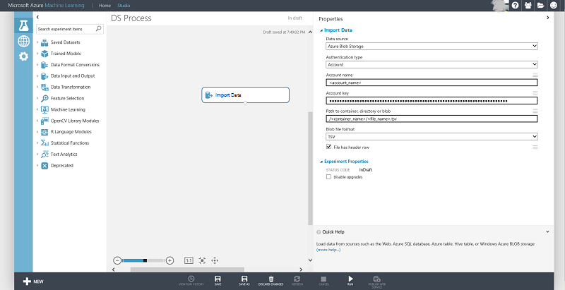

<properties 
    pageTitle="Exemples de données dans Azure blob storage | Microsoft Azure" 
    description="Exemples de données dans le stockage Blob Azure" 
    services="machine-learning,storage" 
    documentationCenter="" 
    authors="bradsev" 
    manager="jhubbard" 
    editor="cgronlun" />

<tags 
    ms.service="machine-learning" 
    ms.workload="data-services" 
    ms.tgt_pltfrm="na" 
    ms.devlang="na" 
    ms.topic="article" 
    ms.date="09/19/2016" 
    ms.author="fashah;garye;bradsev" /> 

#Exemples de données dans Azure blob storage

Ce document traite des données d’échantillonnage stockées dans le stockage blob Azure en téléchargeant par programme, puis d’échantillonnage à l’aide des procédures écrites dans Python.

**Pourquoi des exemples de vos données ?**
Si le jeu de données que vous souhaitez analyser est volumineux, il est généralement judicieux de sélectionner les données pour réduire la taille de plus petite taille, mais représentatives et plus facile à gérer échantillons vers le bas. Cela facilite la compréhension des données, exploration et ingénierie de fonctionnalité. Son rôle dans le processus Analytique Cortana consiste à activer prototypage rapide de la machine modèles d’apprentissage et de fonctions de traitement des données.

Le **menu** en dessous des liens vers des rubriques qui décrivent l’échantillon de données de différents environnements de stockage. 

[AZURE.INCLUDE [cap-sample-data-selector](../../includes/cap-sample-data-selector.md)]

Cette tâche d’échantillonnage est une étape de l' [Équipe données scientifique processus (TDSP)](https://azure.microsoft.com/documentation/learning-paths/cortana-analytics-process/).

## Téléchargez et vers le bas-exemples de données
1. Télécharger les données à partir du stockage blob Azure au moyen du service blob à partir de l’exemple de code Python suivant : 

        from azure.storage.blob import BlobService
        import tables
        
        STORAGEACCOUNTNAME= <storage_account_name>
        STORAGEACCOUNTKEY= <storage_account_key>
        LOCALFILENAME= <local_file_name>        
        CONTAINERNAME= <container_name>
        BLOBNAME= <blob_name>

        #download from blob
        t1=time.time()
        blob_service=BlobService(account_name=STORAGEACCOUNTNAME,account_key=STORAGEACCOUNTKEY)
        blob_service.get_blob_to_path(CONTAINERNAME,BLOBNAME,LOCALFILENAME)
        t2=time.time()
        print(("It takes %s seconds to download "+blobname) % (t2 - t1))

2. Lire les données dans une trame de données Pandas à partir du fichier téléchargé plus haut.

        import pandas as pd

        #directly ready from file on disk
        dataframe_blobdata = pd.read_csv(LOCALFILE)

3. Bas-sample les données à l’aide de la `numpy`de `random.choice` comme suit :

        # A 1 percent sample
        sample_ratio = 0.01 
        sample_size = np.round(dataframe_blobdata.shape[0] * sample_ratio)
        sample_rows = np.random.choice(dataframe_blobdata.index.values, sample_size)
        dataframe_blobdata_sample = dataframe_blobdata.ix[sample_rows]

Maintenant que vous pouvez travailler avec la trame de données ci-dessus avec l’exemple de 1 % pour une exploration plus approfondie et la fonctionnalité génération.

##Télécharger des données et le lire en apprentissage automatique Azure

Vous pouvez utiliser le code suivant vers le bas échantillons les données et d’utiliser directement dans Azure ML :

1. Écrire la trame de données dans un fichier local

        dataframe.to_csv(os.path.join(os.getcwd(),LOCALFILENAME), sep='\t', encoding='utf-8', index=False)

2. Téléchargez le fichier local dans un blob Azure en utilisant le code suivant :

        from azure.storage.blob import BlobService
        import tables

        STORAGEACCOUNTNAME= <storage_account_name>
        LOCALFILENAME= <local_file_name>
        STORAGEACCOUNTKEY= <storage_account_key>
        CONTAINERNAME= <container_name>
        BLOBNAME= <blob_name>

        output_blob_service=BlobService(account_name=STORAGEACCOUNTNAME,account_key=STORAGEACCOUNTKEY)    
        localfileprocessed = os.path.join(os.getcwd(),LOCALFILENAME) #assuming file is in current working directory
        
        try:
       
        #perform upload
        output_blob_service.put_block_blob_from_path(CONTAINERNAME,BLOBNAME,localfileprocessed)
        
        except:         
            print ("Something went wrong with uploading to the blob:"+ BLOBNAME)

3. Lire les données à partir du blob Azure à l’aide de ML Azure [Importer les données](https://msdn.microsoft.com/library/azure/4e1b0fe6-aded-4b3f-a36f-39b8862b9004/) comme indiqué dans l’image ci-dessous :
 

 
