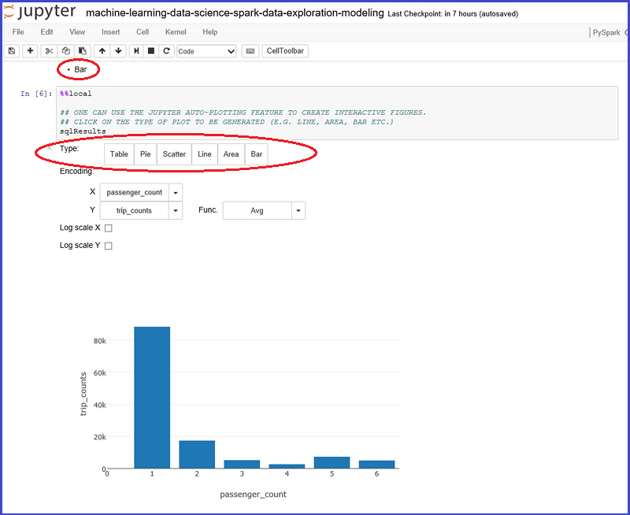

<properties
    pageTitle="Vue d’ensemble des données scientifique à l’aide d’explosion sur Azure HDInsight | Microsoft Azure"
    description="La boîte à outils MLlib explosion réunissant apprentissage automatique considérable fonctions à l’environnement HDInsight distribué de modélisation."
    services="machine-learning"
    documentationCenter=""
    authors="bradsev"
    manager="jhubbard"
    editor="cgronlun"  />

<tags
    ms.service="machine-learning"
    ms.workload="data-services"
    ms.tgt_pltfrm="na"
    ms.devlang="na"
    ms.topic="article"
    ms.date="10/07/2016"
    ms.author="deguhath;bradsev;gokuma" />

# Vue d’ensemble des données scientifique à l’aide d’explosion sur Azure HDInsight

[AZURE.INCLUDE [machine-learning-spark-modeling](../../includes/machine-learning-spark-modeling.md)]

Cette suite de rubriques montre comment utiliser HDInsight Spark pour effectuer des tâches courantes de scientifique des données telles que réception de données, ingénierie fonctionnalité, modélisation et d’évaluation de modèle. Les données utilisées sont un échantillon de 2013 NYC taxi voyage et tarif dataset. Les modèles intégrées sont régression linéaire et logistique, aléatoires forêts et les arborescences augmentées dégradés. Les rubriques expliquent également comment stocker ces modèles dans le stockage blob Azure (WASB) et score général et évaluer leurs performances prédictive. Rubriques plus avancées expliquer comment les modèles peuvent être formées à l’aide de validation croisée et hyper-paramètre balayage. Vue d’ensemble décrit également comment configurer le cluster explosion dont vous avez besoin d’effectuer les étapes dans les trois procédures fournis. 

[Explosion](http://spark.apache.org/) est un traitement framework qui prend en charge de traitement en mémoire pour améliorer les performances des applications analytiques données volumineuses en parallèle open source. Moteur de traitement et intégré pour la vitesse, facilité d’utilisation et sophistiquées analytique. Calcul distribué en mémoire fonctionnalités du explosion rendent un bon choix pour algorithmes itératifs dans les calculs de graphique et l’apprentissage machine. [MLlib](http://spark.apache.org/mllib/) est bibliothèque d’apprentissage machine scalable d’explosion réunissant des fonctions de modélisation à cet environnement distribué. 

[HDInsight explosion](../hdinsight/hdinsight-apache-spark-overview.md) est l’offre Azure hébergée d’explosion open source. Il inclut également prise en charge des **blocs-notes Jupyter PySpark** sur le cluster explosion qui peut exécuter des requêtes interactives explosion SQL pour vous permettra de transformer, de filtrage et de visualisation des données stockées dans les objets BLOB Azure (WASB). PySpark est l’API Python pour explosion. Extraits de code qui fournissent les solutions et indique les tracés pertinents pour visualiser les données ici exécutée dans les blocs-notes Jupyter installés sur les groupes d’explosion. Les étapes de modélisation dans ces rubriques contient du code qui montre comment former, évaluer, enregistrer et consommer chaque type de modèle. 

Les étapes de configuration et le code fournies dans cette procédure s’applique à HDInsight 3.4 explosion 1,6. Toutefois, le code ici et dans les blocs-notes est générique et devez travailler sur un cluster explosion. Si vous n’utilisez pas HDInsight Spark, les étapes de configuration et la gestion de cluster peuvent être légèrement différents de ce qui est affiché ici.

## Conditions préalables

1 vous devez posséder un abonnement Azure. Si vous n’en avez pas déjà, voir [Azure obtenir la version d’évaluation gratuite](https://azure.microsoft.com/documentation/videos/get-azure-free-trial-for-testing-hadoop-in-hdinsight/).

2.Cliquez vous avez besoin d’un cluster HDInsight 3.4 explosion 1,6 pour effectuer cette procédure. Pour en créer un, reportez-vous aux instructions fournies dans [prise en main : créer explosion Apache sur Azure HDInsight](../hdinsight/hdinsight-apache-spark-jupyter-spark-sql.md). Le type de cluster et la version est spécifié dans le menu **Sélectionner un Type de Cluster** . 

<!-- -->

> [AZURE.NOTE] Pour une rubrique qui montre comment utiliser Scala plutôt que Python pour effectuer les tâches d’un processus scientifique des données de bout en bout, voir [Science de données à l’aide de Scala avec explosion dans Azure](machine-learning-data-science-process-scala-walkthrough.md).

<!-- -->

>[AZURE.INCLUDE [delete-cluster-warning](../../includes/hdinsight-delete-cluster-warning.md)]

## Les données NYC 2013 Taxi

Les données NYC Taxi voyage sont environ 20 Go de fichiers compressés valeurs séparées par des virgules (CSV) (~ 48 Go sans compression), comprenant plus de 173 millions individuels voyages et les tarifs payé pour chaque voyage. Chaque enregistrement voyage mentionne la sélection et emplacement de remise et heure, piratage rendue (pilote) licence numéros et medallion (id unique de taxi). Les données couvre tous les déplacements de l’année 2013 et sont fournies dans les deux jeux de données suivants pour chaque mois :

1. Les fichiers CSV 'trip_data' contiennent les détails de voyage, tels que nombre des voyageurs, décrochez et cette chute observations, déclenchement durée et la durée de voyage. Voici quelques exemples d’enregistrements :

        medallion,hack_license,vendor_id,rate_code,store_and_fwd_flag,pickup_datetime,dropoff_datetime,passenger_count,trip_time_in_secs,trip_distance,pickup_longitude,pickup_latitude,dropoff_longitude,dropoff_latitude
        89D227B655E5C82AECF13C3F540D4CF4,BA96DE419E711691B9445D6A6307C170,CMT,1,N,2013-01-01 15:11:48,2013-01-01 15:18:10,4,382,1.00,-73.978165,40.757977,-73.989838,40.751171
        0BD7C8F5BA12B88E0B67BED28BEA73D8,9FD8F69F0804BDB5549F40E9DA1BE472,CMT,1,N,2013-01-06 00:18:35,2013-01-06 00:22:54,1,259,1.50,-74.006683,40.731781,-73.994499,40.75066
        0BD7C8F5BA12B88E0B67BED28BEA73D8,9FD8F69F0804BDB5549F40E9DA1BE472,CMT,1,N,2013-01-05 18:49:41,2013-01-05 18:54:23,1,282,1.10,-74.004707,40.73777,-74.009834,40.726002
        DFD2202EE08F7A8DC9A57B02ACB81FE2,51EE87E3205C985EF8431D850C786310,CMT,1,N,2013-01-07 23:54:15,2013-01-07 23:58:20,2,244,.70,-73.974602,40.759945,-73.984734,40.759388
        DFD2202EE08F7A8DC9A57B02ACB81FE2,51EE87E3205C985EF8431D850C786310,CMT,1,N,2013-01-07 23:25:03,2013-01-07 23:34:24,1,560,2.10,-73.97625,40.748528,-74.002586,40.747868

2. Les fichiers CSV 'trip_fare' contiennent des détails sur le tarif payé pour chaque voyage, telles que type de paiement, prix, surcharge et taxes, conseils et péages et le montant total payé. Voici quelques exemples d’enregistrements :

        medallion, hack_license, vendor_id, pickup_datetime, payment_type, fare_amount, surcharge, mta_tax, tip_amount, tolls_amount, total_amount
        89D227B655E5C82AECF13C3F540D4CF4,BA96DE419E711691B9445D6A6307C170,CMT,2013-01-01 15:11:48,CSH,6.5,0,0.5,0,0,7
        0BD7C8F5BA12B88E0B67BED28BEA73D8,9FD8F69F0804BDB5549F40E9DA1BE472,CMT,2013-01-06 00:18:35,CSH,6,0.5,0.5,0,0,7
        0BD7C8F5BA12B88E0B67BED28BEA73D8,9FD8F69F0804BDB5549F40E9DA1BE472,CMT,2013-01-05 18:49:41,CSH,5.5,1,0.5,0,0,7
        DFD2202EE08F7A8DC9A57B02ACB81FE2,51EE87E3205C985EF8431D850C786310,CMT,2013-01-07 23:54:15,CSH,5,0.5,0.5,0,0,6
        DFD2202EE08F7A8DC9A57B02ACB81FE2,51EE87E3205C985EF8431D850C786310,CMT,2013-01-07 23:25:03,CSH,9.5,0.5,0.5,0,0,10.5

Nous avons pris un échantillon de 0,1 % de ces fichiers et rejoint le voyage\_des données et voyage\_du prix fichiers CSV en un seul dataset à utiliser comme le jeu de données d’entrée pour cette procédure pas à pas. La clé unique à rejoindre voyage\_des données et voyage\_tarif est composée des champs : medallion, hack\_licence et capture\_date/heure. Chaque enregistrement du dataset contient les attributs suivants représentant un voyage NYC Taxi :

|Champ| Brève Description
|------|---------------------------------
| medallion |Medallion taxi rendues (id taxi unique)
| hack_license |    Nombre de licence Hackney retours rendue
| vendor_id |   Id de fournisseur taxi
| rate_code | Taux de taxi NYC de frais
| store_and_fwd_flag | Stocker et transférer indicateur
| pickup_datetime | Sélectionnez la date et heure
| dropoff_datetime | Cette chute date et heure
| pickup_hour | Sélectionnez les horaires
| pickup_week | Sélectionnez la semaine de l’année
| jour de la semaine | JOURSEM (plage 1 à 7)
| passenger_count | Nombre de personnes dans un voyage taxi
| trip_time_in_secs | Durée de voyage en secondes
| trip_distance | Distance voyage parcourus dans miles
| pickup_longitude | Décrochez longitude
| pickup_latitude | Décrochez latitude
| dropoff_longitude | Cette chute longitude
| dropoff_latitude | Cette chute latitude
| direct_distance | Diriger distance entre sélectionnez vers le haut et les emplacements de cette chute
| payment_type | Type de paiement (autorités de certification, carte de crédit etc.).
| fare_amount | Montant tarif dans
| supplément | Supplément
| mta_tax | Taxe MTA
| tip_amount | Conseil montant
| tolls_amount | Montant péages
| total_amount | Montant total
| Bonhomme de neige | Bonhomme de neige (1/0 pour non ou Oui)
| tip_class | Conseil pour les cours (0 : $0, 1 : 0-5 $ 2 : $6 à 10, 3 : 11-20, 4 : 20 >)

## Exécuter du code d’un bloc-notes Jupyter sur le cluster d’explosion 

Vous pouvez lancer le bloc-notes Jupyter à partir du portail Azure. Recherchez votre cluster explosion dans votre tableau de bord et cliquez dessus pour entrer la page Gestion du service pour votre cluster. Pour ouvrir le bloc-notes associé au cluster explosion, cliquez sur **Tableaux de bord Cluster** -> **Jupyter bloc-notes** .

Vous pouvez également accéder à ***https://CLUSTERNAME.azurehdinsight.net/jupyter*** pour accéder aux blocs-notes Jupyter. Remplacer la partie NOMDUCLUSTER de cette URL par le nom de votre propre cluster. Vous devez le mot de passe pour votre compte d’administrateur accéder aux blocs-notes.

Sélectionnez PySpark pour afficher un répertoire qui contient quelques exemples des blocs-notes prédéfinis qui utilisent l’API PySpark. Les blocs-notes qui contiennent les exemples de code pour cette suite de rubrique explosion sont disponibles dans la page [Github](https://github.com/Azure/Azure-MachineLearning-DataScience/tree/master/Misc/Spark/pySpark)

Vous pouvez télécharger les blocs-notes directement à partir de Github sur le serveur de bloc-notes Jupyter sur votre cluster explosion. Dans la page d’accueil de votre Jupyter, cliquez sur le bouton **Télécharger** dans la partie droite de l’écran. Il s’ouvre un Explorateur de fichiers. Ici, vous pouvez coller l’URL Github (contenu brut) du bloc-notes, cliquez sur **Ouvrir**. Les blocs-notes PySpark sont disponibles aux URL suivantes :

1.  [pySpark-machine-learning-data-science-spark-data-exploration-modeling.ipynb](https://github.com/Azure/Azure-MachineLearning-DataScience/blob/master/Misc/Spark/pySpark/pySpark-machine-learning-data-science-spark-data-exploration-modeling.ipynb)
2.  [pySpark-machine-learning-data-science-spark-model-consumption.ipynb](https://github.com/Azure/Azure-MachineLearning-DataScience/blob/master/Misc/Spark/pySpark/pySpark-machine-learning-data-science-spark-model-consumption.ipynb)
3.  [pySpark-machine-learning-data-science-spark-advanced-data-exploration-modeling.ipynb](https://github.com/Azure/Azure-MachineLearning-DataScience/blob/master/Misc/Spark/pySpark/pySpark-machine-learning-data-science-spark-advanced-data-exploration-modeling.ipynb)

Vous voyez le nom du fichier sur votre liste de fichiers Jupyter avec le bouton **Télécharger** à nouveau. Cliquez sur ce bouton **Télécharger** . Maintenant que vous avez importé le bloc-notes. Répétez ces étapes pour télécharger les autres blocs-notes à partir de cette procédure.

> [AZURE.TIP] Vous pouvez cliquez sur les liens dans votre navigateur et cliquez sur **Copier le lien** pour obtenir l’URL de contenu brutes github. Vous pouvez coller cette URL dans la boîte de dialogue explorer Jupyter télécharger des fichiers.

Vous pouvez maintenant :

- Visualiser le code en cliquant sur le bloc-notes.
- Exécutez chaque cellule en appuyant sur **MAJ + ENTRÉE**.
- Exécuter le bloc-notes entier en cliquant sur **cellule** -> **exécuter**.
- Utiliser la visualisation automatique de requêtes.

> [AZURE.TIP] Le noyau PySpark visualise automatiquement la sortie des requêtes SQL (HiveQL). Vous disposez de l’option sélectionner parmi des différents types de visualisations (Table, en secteurs, courbes, zone ou barre) en utilisant les boutons de menu **Type** dans le bloc-notes :

## Quoi d’autre ?

À présent que vous sont configurés avec un cluster HDInsight Spark et que vous avez téléchargées les blocs-notes Jupyter, vous êtes prêt à utiliser les rubriques qui correspondent aux blocs-notes PySpark trois. Ils affichent comment Explorer vos données, puis comment créer et utiliser des modèles. Le bloc-notes exploration et modélisation de données avancées montre comment inclure validation croisée, hyper-paramètre balayant et le modèle d’évaluation. 

**Des données et modélisation avec explosion :** Explorer le groupe de données et créer, score et évaluent l’apprentissage des modèles en passant par la rubrique [créer classification binaire et les modèles de régression des données avec la boîte à outils MLlib explosion](machine-learning-data-science-spark-data-exploration-modeling.md) de l’ordinateur.

**Consommation de modèle :** Pour savoir comment évaluer les modèles de classement et de régression créés dans cette rubrique, voir [Score et évaluer des modèles d’apprentissage machine intégré à explosion](machine-learning-data-science-spark-model-consumption.md).

**Validation croisée et hyperparameter balayant**: afficher [des données et modélisation avec explosion avancées](machine-learning-data-science-spark-advanced-data-exploration-modeling.md) sur la façon dont les modèles peuvent être formées à l’aide de validation croisée et hyper-paramètre balayage

