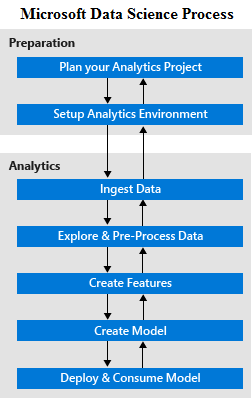

<properties 
    pageTitle="Quel est le processus scientifique des données d’équipe ?  | Microsoft Azure" 
    description="Le processus d’équipe données scientifique est une méthode systématique pour créer des applications intelligentes qui s’appuient sur analytique avancées." 
    services="machine-learning" 
    documentationCenter="" 
    authors="bradsev"
    manager="jhubbard" 
    editor="cgronlun" />

<tags 
    ms.service="machine-learning" 
    ms.workload="data-services" 
    ms.tgt_pltfrm="na" 
    ms.devlang="na" 
    ms.topic="article" 
    ms.date="09/19/2016" 
    ms.author="bradsev" /> 

# Quel est le processus de scientifique des données (TDSP) d’équipe ?

L' [Équipe données scientifique processus (TDSP)](data-science-process-overview.md) fournit une approche systématique à la création d’applications intelligentes qui permet aux équipes de scientifiques de données de collaborer efficacement sur le cycle de vie des activités nécessaire pour activer ces applications dans les produits. La TDSP présente une séquence d’étapes qui fournissent des **instructions** sur la définition du problème, configurer les outils et l’environnement si nécessaire, analyser les données pertinentes, créer et évaluer des modèles prédictives, puis déployer ces modèles dans les applications d’entreprise. 

Voici les étapes dans le **Processus scientifique des données d’équipe**:  

Le processus est **itératif**: la compréhension de nouveaux et existants ou affinements dans le modèle évolue et requiert retravaillant étapes effectuées précédemment dans la séquence. Développement d’organisation existant et processus de planification de projet sont **facilement adapté** pour fonctionner avec la séquence définie par le TDSP des étapes. 

Les étapes décrites dans le processus sont représentée par un diagramme et liées dans la [rubrique d’apprentissage TDSP](https://azure.microsoft.com/documentation/learning-paths/cortana-analytics-process/) et décrit ci-dessous.  

## Étapes de préparation 

## P1. Planifier le projet analytique 

Démarrer un projet analytique en définissant vos objectifs d’entreprise et résoudre les problèmes. Ils sont spécifiées en fonction des **besoins de l’entreprise**. Un objectif central de cette étape consiste à identifier les variables de clés de l’entreprise (les prévisions de vente ou la probabilité d’une commande être frauduleuse, par exemple) devant l’analyse prédire pour satisfaire ces exigences. Planification supplémentaire est généralement essentiel à comprendre les **sources de données** nécessaires pour résoudre les objectifs du projet à partir d’un point de vue analytique. Il n’est pas rare, par exemple, pour que les systèmes existants deviez collecter et consigner d’autres types de données afin de résoudre le problème et atteindre les objectifs de projet. Pour des instructions, voir [planifier votre environnement pour le processus d’équipe données Science](machine-learning-data-science-plan-your-environment.md) et [scénarios d’analytique avancée dans l’apprentissage automatique Azure](machine-learning-data-science-plan-sample-scenarios.md).  

## P2. D’installer l’environnement analytique 

Un environnement analytique pour le processus d’équipe données scientifique implique plusieurs composants : 

- **espaces de travail de données** dans lequel les données sont mis en place pour l’analyse et modélisation, 
- une **infrastructure de traitement** pour prétraitement, Explorer et modélisation de données
- une **infrastructure runtime** effectuent les modèles d’analyse et exécuter les applications clientes intelligentes qui utilisent les modèles.  

L’infrastructure analytique qui doit être configuré est souvent partie d’un environnement distinct de systèmes opérationnels core. Mais il utilise généralement des données à partir de plusieurs systèmes au sein de l’entreprise et à partir de sources externes à l’entreprise. L’infrastructure analytique peut être purement sur le nuage, ou une installation locale, ou un mélange des deux. Pour les options, voir [configurer des environnements scientifique de données à utiliser dans le processus d’équipe données scientifique](machine-learning-data-science-environment-setup.md).

## Étapes Analytique :  

## 1. acquisition de données dans l’environnement analytique 

La première étape consiste à importer les données correspondantes provenant de diverses sources, soit à partir d’ou d’en dehors de l’entreprise, dans des environnements analytique où les données peuvent être traitées. **Mettre en forme** les données source peut différer au format requis par la destination. Si certaines transformation de données peut-être aussi avoir être effectuée par les outils de réception. Pour les options, voir [charger les données dans des environnements de stockage pour analytique](machine-learning-data-science-ingest-data.md)

Outre l’acquisition initiale de données, de nombreuses applications intelligentes sont requises pour actualiser les données régulièrement dans le cadre d’un processus en cours de formation. Pour ce faire, vous pouvez configurer un **pipeline de données** ou un flux de travail. Cela fait partie de la partie itérative du processus qui inclut la reconstruction et ré-évaluer les modèles analytiques utilisés par l’application intelligente déployer la solution. Par exemple, voir [déplacer des données d’un serveur SQL localement à SQL Azure avec Azure Data Factory](machine-learning-data-science-move-sql-azure-adf.md).

## 2. Explorer et traiter des données 

L’étape suivante consiste à obtenir une bonne compréhension des données en une solution ses **statistiques récapitulatives** , relations et en utilisant des techniques de cette **visualisation**. C’est également l’endroit où les problèmes de **qualité des données** et d’intégrité, tels que les valeurs manquantes et relations entre les données n’est pas cohérente, incompatibilité de type de données sont traités. Prétraitement transformations sont utilisées pour effacer les données brutes avant de poursuivre analytique et modélisation puisse avoir lieu. Pour obtenir une description, voir [tâches pour préparer des données pour une machine améliorée d’apprentissage](machine-learning-data-science-prepare-data.md).

## 3. développer des fonctionnalités 

Scientifiques de données, en collaboration avec des experts de domaine, doivent identifier les fonctionnalités qui capturer les propriétés utiles jeu de données et qui peut être mieux utilisé pour prévoir les variables métiers clés identifiés lors de la planification. Ces nouvelles fonctionnalités peuvent provenir de données existantes ou peuvent nécessiter des données supplémentaires à collecter. Ce processus est appelé **ingénierie fonctionnalité** et figure parmi les principales étapes de création d’un système analytique prédictive efficace. Cette étape nécessite une combinaison de domaine d’expertise créative et des idées qu’obtenues à partir de l’étape d’exploration de données. Pour des instructions, voir [fonction ingénierie dans le processus d’équipe données scientifique](machine-learning-data-science-create-features.md).

## 4. créer des modèles prédictives 

Scientifiques données créer des modèles analytiques permettant de prévoir les variables clés identifiées par les exigences métiers définies dans l’étape à l’aide de données a été nettoyées et featurized planification. Systèmes d’apprentissage machine prend en charge plusieurs **algorithmes de modélisation** qui s’appliquent à un large éventail de cas. Pour des instructions, voir [comment choisir des algorithmes pour l’équipe Azure Machine apprentissage](machine-learning-algorithm-choice.md).

Scientifiques données doivent choisir le modèle le plus approprié à leur tâche prédiction et il n’est pas rare que les résultats à partir de plusieurs modèles doivent être combinés pour obtenir les meilleurs résultats. Les données d’entrée pour une modélisation sont généralement divisées aléatoirement en trois parties :

- une série de données de formation 
- une série de données de validation 
- une série de données test 

Les modèles sont créés à l’aide du **jeu de données**. Optimiser la combinaison de modèles (avec paramètres réglés) est sélectionnée en exécutant les modèles et les erreurs de prévision pour le **jeu de données de validation**de mesure. Pour finir le **test d’un jeu de données** est utilisé pour évaluer les performances du modèle choisi à des données indépendantes qui n’a pas été utilisés pour former ou valider le modèle.  Pour plus d’informations, voir [l’évaluation des performances de modèle dans l’apprentissage automatique Azure](machine-learning-evaluate-model-performance.md).

## 5. déployer et utiliser des modèles 

Une fois que nous disposons d’un jeu de modèles qui fonctionnent bien, ils peuvent être **operationalized** pour d’autres applications de consommer. Selon les besoins, des prédictions sont effectuées en **temps réel** ou sur une base de **lot** . Pour être operationalized, les modèles doivent être exposés avec un **Ouvrir interface API** qui est facilement consommées dans différentes applications ce site Web en ligne, des feuilles de calcul, des tableaux de bord ou des applications d’entreprise et serveur principal. Voir [déploiement d’un service web d’apprentissage automatique Azure](machine-learning-publish-a-machine-learning-web-service.md).

## Résumé et étapes suivantes

Le [Processus de scientifique des données d’équipe](https://azure.microsoft.com/documentation/learning-paths/cortana-analytics-process/) équivaut à une séquence d’étapes itérés qui **fournissent des conseils** sur les tâches nécessaires à l’utilisation analytique avancé pour créer des applications intelligentes. Chaque étape fournit également des détails sur l’utilisation des différentes technologies Microsoft pour effectuer les tâches décrites. 

Pendant que TDSP n’impose pas de types spécifiques d’objets **documentation** , il est recommandé de documenter les résultats de l’exploration de données, la modélisation et l’évaluation, et pour enregistrer le code pertinent pour que l’analyse peut itération lorsque cela est nécessaire. Ceci permet également réutiliser du travail analytique lorsque vous travaillez sur d’autres applications impliquant des données similaires et tâches de prévision.

Procédures pas à pas complète de bout en bout illustrant les différentes étapes de la procédure pour **des scénarios spécifiques** sont également disponibles. Voir, par exemple :

- [Le processus d’équipe données scientifique en action : à l’aide de SQL Server](machine-learning-data-science-process-sql-walkthrough.md)
- [Le processus scientifique des données d’équipe en action : utilisation des clusters HDInsight Hadoop](machine-learning-data-science-process-hive-walkthrough.md).
- [Scientifique de données à l’aide d’explosion sur HD.mdnsight Azure](machine-learning-data-science-spark-overview.md)
- [Format SVG données scientifique dans Azure données Lake : une procédure pas à pas de bout en bout](machine-learning-data-science-process-data-lake-walkthrough.md)

 
