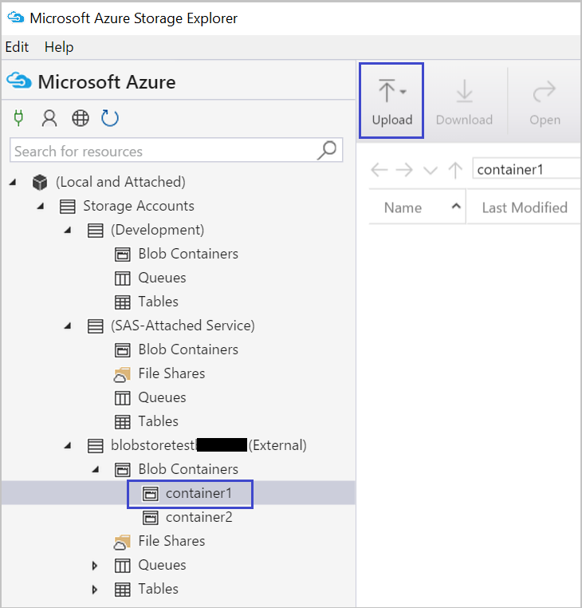
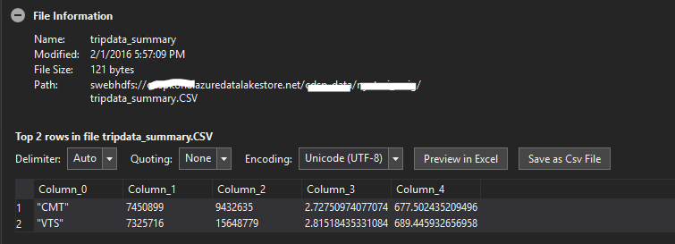
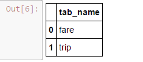
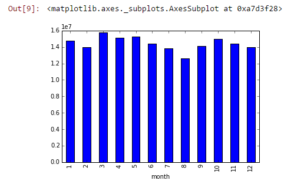

<properties
    pageTitle="Dix pouvant être exécutées sur la science données Machine virtuelle | Microsoft Azure"
    description="Effectuer diverses des données et modélisation de tâche sur la science données Machine virtuelle."
    services="machine-learning"
    documentationCenter=""
    authors="bradsev"
    manager="jhubbard"
    editor="cgronlun"  />

<tags
    ms.service="machine-learning"
    ms.workload="data-services"
    ms.tgt_pltfrm="na"
    ms.devlang="na"
    ms.topic="article"
    ms.date="08/29/2016"
    ms.author="gokuma;weig;bradsev" />

# <a name="ten-things-you-can-do-on-the-data-science-virtual-machine"></a>Dix pouvant être exécutées sur la science données Machine virtuelle

La Machine virtuelle de scientifique des données de Microsoft (DSVM) est un environnement de développement scientifique puissantes qui vous permet d’effectuer diverses tâches d’exploration et modélisation de données. L’environnement est fourni déjà généré et fourni avec plusieurs outils analytique données courants qui facilitent la prise en main rapidement votre analyse pour local, déploiements Cloud ou hybride. La DSVM travaille en étroite collaboration avec de nombreux services Azure et est en mesure de lire et traiter des données qui sont trouve déjà sur Azure, dans un magasin de données SQL Azure, Lake de données Azure, le stockage Azure ou dans DocumentDB. Il peut également exploiter les autres outils analytique tels qu’apprentissage automatique Azure et Azure Data Factory.


Dans cet article nous vous expliquant comment utiliser votre DSVM pour effectuer diverses tâches scientifique de données et d’interagir avec d’autres services Azure. Voici quelques éléments que vous pouvez effectuer sur le DSVM :

1. Explorer les données et développer des modèles localement sur la DSVM à l’aide de Microsoft R Server, Python
2. Utiliser un bloc-notes Jupyter pour tester vos données dans un navigateur à l’aide de Microsoft Python 2, 3 Python, R une version prêt entreprise de R conçu pour les performances et extensibilité élevées
3. Effectuent des modèles créés à l’aide R et Python sur apprentissage automatique Azure afin que les applications clientes peuvent accéder à vos modèles à l’aide d’une interface de services web simple
4. Administrer vos ressources Azure à l’aide du portail Azure ou Powershell
5. Étendre votre espace de stockage et partager des jeux de données à grande échelle pays au sein de votre équipe entier en créant un stockage de fichiers Azure comme un lecteur monter sur votre DSVM
6. Partager du code avec votre équipe à l’aide de Github et accéder à votre référentiel à l’aide des préinstallé Git clients - Git Bash, Git graphique.
7. Accéder aux différentes Azure données analytique services et comme stockage blob Azure, Lake de données Azure, Azure HDInsight (Hadoop), DocumentDB Azure, SQL Azure Data Warehouse et les bases de données
8. Créer des rapports et tableau de bord à l’aide de Power BI Desktop préinstallés sur le DSVM et les déployer sur le nuage
9. Évoluer dynamiquement votre DSVM afin de répondre aux besoins de votre projet
10. Installer d’autres outils sur votre ordinateur virtuel   


>[AZURE.NOTE] Frais d’utilisation supplémentaires seront appliquent pour la plupart des autres services de données de stockage et analytique répertoriés dans cet article. Reportez-vous à la page [Azure tarification](https://azure.microsoft.com/pricing/) pour plus d’informations.


**Conditions préalables**

- Vous avez besoin d’un abonnement Azure. Vous pouvez vous inscrire pour un gratuit d’évaluation [ici](https://azure.microsoft.com/free/).

- Instructions pour une machine données scientifique virtuelle dans le portail Azure sont disponibles à la [Création d’une machine virtuelle](https://portal.azure.com/#create/microsoft-ads.standard-data-science-vmstandard-data-science-vm).

## <a name="1-explore-data-and-develop-models-using-microsoft-r-server-or-python"></a>1. Explorer les données et développer des modèles à l’aide de Microsoft R Server ou Python

Vous pouvez utiliser langues telles que R et Python pour effectuer votre analytique données directement sur le DSVM.

Pour R, vous pouvez utiliser un IDE appelé « Révolution R Enterprise 8.0 » que vous pouvez trouver sur le menu Démarrer ou le bureau. Microsoft fournit des bibliothèques supplémentaires en haut de l’ouvrir source/CRAN-r pour activer le format SVG analytique et la possibilité d’analyser des données dépassent la taille de mémoire autorisée en effectuant l’analyse en bloc parallèle. Vous pouvez également installer un IDE R de votre choix comme [RStudio](https://www.rstudio.com/products/rstudio-desktop/).

Pour Python, vous pouvez utiliser un IDE comme Visual Studio Community Edition doté des outils pour l’extension Visual Studio (PTVS) préinstallés Python. Par défaut, uniquement une base 2.7 Python est configuré sur PTVS (sans une bibliothèque analytique comme SciKit, Pandas). Pour activer Anaconda Python 2.7 et 3.5, vous devez effectuer les opérations suivantes :

* Créer des environnements personnalisés pour chaque version, accédez à **Outils** -> **Outils Python** -> **Environnements Python** , puis en cliquant sur «**+ personnalisé**» dans l’édition de communauté Visual Studio 2015
* Donner une description et définir les chemins d’accès du préfixe environnement comme *c:\anaconda* pour Anaconda Python 2.7 ou *c:\anaconda\envs\py35* pour Anaconda Python 3.5
* Cliquez sur **La détection automatique** , puis sur **Appliquer** pour enregistrer l’environnement.

Voici à quoi ressemble l’installation de l’environnement personnalisé dans Visual Studio.


Consultez la [documentation PTVS](https://github.com/Microsoft/PTVS/wiki/Selecting-and-Installing-Python-Interpreters#hey-i-already-have-an-interpreter-on-my-machine-but-ptvs-doesnt-seem-to-know-about-it) pour plus d’informations sur la façon de créer des environnements Python.

À présent vous sont configurés pour créer un nouveau projet Python. Naviguez jusqu’au **fichier** -> **Nouveau** -> **projet** -> **Python** et sélectionnez le type d’application Python vous créez. Vous pouvez configurer l’environnement Python pour le projet actuel à la version souhaitée (Anaconda 2.7 ou 3.5) : avec le bouton droit de l' **environnement Python**, sélectionnez **Ajouter/supprimer Python environnements**, puis l’environnement désiré à associer au projet. Vous trouverez plus d’informations sur l’utilisation des PTVS dans la page de la [documentation](https://github.com/Microsoft/PTVS/wiki) produit.

## <a name="2-using-a-jupyter-notebook-to-explore-and-model-your-data-with-python-or-r"></a>2. Utilisation d’un bloc-notes Jupyter pour Explorer et de modèle de vos données avec les Python ou R

Le bloc-notes Jupyter est un environnement puissant qui propose un via un navigateur « IDE » pour Explorer les données et de modélisation. Vous pouvez utiliser Python 2, 3 Python ou R (ouvrir la Source et le serveur R Microsoft) dans un bloc-notes Jupyter.

Pour lancer le clic Jupyter bloc-notes sur l’icône du menu Démarrer / l’icône intitulé **Jupyter bloc-notes**. Dans la DSVM vous pouvez également accéder à « https://localhost:9999 / » pour accéder au bloc-notes Jupiter. S’il vous demande un mot de passe, utilisez les instructions fournies dans la section de ***la création d’un mot de passe sur le serveur de bloc-notes Jupyter*** de la rubrique [mise en service de la Machine virtuelle Microsoft données scientifique](machine-learning-data-science-provision-vm.md) pour créer un mot de passe pour accéder à l’ordinateur portable Jupyter. 

Une fois que vous avez ouvert le bloc-notes, vous verrez un répertoire contenant plusieurs blocs-notes exemple qui sont intégrées dans la DSVM. Vous pouvez maintenant :

- Cliquez sur le bloc-notes pour afficher le code.
- Exécutez chaque cellule en appuyant sur **MAJ + ENTRÉE**.
- exécuter le bloc-notes entier en cliquant sur **cellule** -> **exécuter**
- créer un bloc-notes en cliquant sur l’icône Jupyter (coin supérieur gauche) et puis en cliquant sur **Nouveau** bouton sur la droite, puis en choisissant la langue du bloc-notes (également appelé noyaux).   


>[AZURE.NOTE] Nous pris en charge 2.7 Python, Python 3.5 et R. Le noyau R prend en charge la programmation libres R, ainsi que l’entreprise scalable Microsoft R Server.   


Une fois que vous êtes dans le bloc-notes que vous pouvez Explorer vos données, créer le modèle, le modèle à l’aide de votre choix de bibliothèques de test.


## <a name="3-build-models-using-r-or-python-and-operationalize-them-using-azure-machine-learning"></a>3. créer des modèles à l’aide de R ou Python et mettre à l’aide d’apprentissage automatique Azure

Une fois que vous avez créé et validé votre modèle de l’étape suivante consiste généralement à déployer en production. Cela permet à votre client applications appeler les prévisions de modèle sur un en temps réel ou sur une base de mode de traitement par lots. Apprentissage automatique Azure fournit un mécanisme pour mettre un modèle intégré R ou Python.

Lorsque vous effectuent votre modèle dans l’apprentissage automatique Azure, un service web est exposé qui permet aux clients émettre des appels reste passent les paramètres d’entrée et de recevoir des prévisions à partir du modèle en tant que sorties.   


>[AZURE.NOTE] Si vous n’avez pas encore inscrit à AzureML, vous pouvez obtenir un espace de travail gratuit ou un espace de travail standard visiter la page d’accueil [AzureML Studio](https://studio.azureml.net/) en cliquant sur « Prise en main ».   


### <a name="build-and-operationalize-python-models"></a>Créer et Python effectuent des modèles

Voici un extrait de code développé dans un bloc-notes Jupyter Python qui crée un modèle simple à l’aide de la bibliothèque en savoir plus SciKit.

    #IRIS classification
    from sklearn import datasets
    from sklearn import svm
    clf = svm.SVC()
    iris = datasets.load_iris()
    X, y = iris.data, iris.target
    clf.fit(X, y)

La méthode utilisée pour déployer vos modèles python sur apprentissage automatique Azure à la ligne la prévision du modèle dans une fonction et décoration avec attributs fournies par la bibliothèque de python apprentissage automatique Azure préinstallée qui indiquent votre ID d’espace de travail apprentissage automatique Azure, clé d’API et l’entrée et retournent des paramètres.  

    from azureml import services
    @services.publish(workspaceid, auth_token)
    @services.types(sep_l = float, sep_w = float, pet_l=float, pet_w=float)
    @services.returns(int) #0, or 1, or 2
    def predictIris(sep_l, sep_w, pet_l, pet_w):
    inputArray = [sep_l, sep_w, pet_l, pet_w]
    return clf.predict(inputArray)

Un client peut passer des appels au service web. Il n’y a wrappers commodité que les demandes d’API REST de construction. Voici un exemple de code pour consommer le service web.

    # Consume through web service URL and keys
    from azureml import services
    @services.service(url, api_key)
    @services.types(sep_l = float, sep_w = float, pet_l=float, pet_w=float)
    @services.returns(float)
    def IrisPredictor(sep_l, sep_w, pet_l, pet_w):
    pass

    IrisPredictor(3,2,3,4)


>[AZURE.NOTE] La bibliothèque d’apprentissage automatique Azure prend uniquement en charge Python 2.7 actuellement.   


### <a name="build-and-operationalize-r-models"></a>Créer et R effectuent des modèles

Vous pouvez déployer des modèles de R intégrés sur la Machine virtuelle de données scientifique ou un autre emplacement sur apprentissage automatique Azure d’une manière similaire à comment procéder pour Python. Ses étapes :

- créer un fichier settings.json comme indiqué ci-dessous à fournir votre ID de l’espace de travail et auth jeton.
- écrire un emballage pour le modèle prédiction de fonction.
- appeler ```publishWebService``` dans la bibliothèque d’apprentissage automatique Azure pour passer dans l’emballage de fonction.  

Voici les extraits de code et procédure pouvant être utilisées pour configurer, créer, publier et utiliser un modèle comme un service web dans l’apprentissage automatique Azure.

#### <a name="setup"></a>Programme d’installation

1.  Installez le package AzureML R en tapant ```install.packages("AzureML")``` dans révolution R Enterprise 8.0 IDE ou votre IDE R.
2.  Téléchargez RTools à partir de [ici](https://cran.r-project.org/bin/windows/Rtools/). Vous devez l’utilitaire zip dans le chemin d’accès (et zip.exe nommée) pour mettre votre package R dans AzureML.
3.  Créer un fichier settings.json sous un répertoire appelé ```.azureml``` sous votre répertoire de base et entrez les paramètres de votre espace de travail Azure ML :

structure du fichier Settings.JSON :

    {"workspace":{
    "id"                  : "ENTER YOUR AZUREML WORKSPACE ID",
    "authorization_token" : "ENTER YOUR AZUREML AUTH TOKEN"
    }}


#### <a name="build-a-model-in-r-and-publish-it-in-azure-ml"></a>Créez un modèle dans R, publier dans Azure ML

    library(AzureML)
    ws <- workspace(config="~/.azureml/settings.json")

    if(!require("lme4")) install.packages("lme4")
    library(lme4)
    set.seed(1)
    train <- sleepstudy[sample(nrow(sleepstudy), 120),]
    m <- lm(Reaction ~ Days + Subject, data = train)

    # Define a prediction function to publish based on the model:
    sleepyPredict <- function(newdata){
        predict(m, newdata=newdata)
    }

    ep <- publishWebService(ws, fun = sleepyPredict, name="sleepy lm", inputSchema = sleepstudy, data.frame=TRUE)

#### <a name="consume-the-model-deployed-in-azure-ml"></a>Utiliser le modèle déployé dans Azure ML

Pour utiliser le modèle à partir d’une application cliente, nous utilisons la bibliothèque d’apprentissage automatique Azure pour rechercher le service web publiés par nom à l’aide du `services` appel à l’API pour déterminer le point de terminaison. Vous venez d’appeler le `consume` fonction et passez dans le cadre de données à prévoir.
Le code suivant est utilisé pour utiliser le modèle publié sous la forme d’un service web d’apprentissage automatique Azure.


    library(AzureML)
    library(lme4)
    ws <- workspace(config="~/.azureml/settings.json")

    s <-  services(ws, name = "sleepy lm")
    s <- tail(s, 1) # use the last published function, in case of duplicate function names

    ep <- endpoints(ws, s)

    # OK, try this out, and compare with raw data
    ans = consume(ep, sleepstudy)$ans

Vous pouvez trouver plus d’informations sur la bibliothèque Azure Machine apprentissage R [ici](https://cran.r-project.org/web/packages/AzureML/AzureML.pdf).


## <a name="4-administer-your-azure-resources-using-azure-portal-or-powershell"></a>4. administrer vos ressources Azure à l’aide du portail Azure ou Powershell

La DSVM non seulement vous permet de créer votre solution analytique localement sur l’ordinateur virtuel, mais vous permet également d’accéder aux services de cloud Azure de Microsoft. Azure fournit plusieurs cluster, stockage, services Business data analytique et autres services que vous pouvez gérer et accéder à partir de votre DSVM.

Pour administrer votre abonnement et cloud les ressources Azure, vous pouvez utiliser votre navigateur et pointez sur le [portail Azure](https://portal.azure.com). Vous pouvez également utiliser Azure Powershell pour gérer votre abonnement Azure et des ressources via un script.
Vous pouvez exécuter Azure Powershell à partir d’un raccourci sur le bureau ou dans le menu Démarrer intitulé « Microsoft Azure Powershell ». Pour plus d’informations sur la façon dont vous pouvez administrer votre abonnement Azure et les ressources à l’aide de scripts Windows Powershell, reportez-vous à la [documentation de Microsoft Azure Powershell](../powershell-azure-resource-manager.md) .


## <a name="5-extend-your-storage-space-with-a-shared-file-system"></a>5. étendre votre espace de stockage avec un système de fichiers partagés

Scientifiques de données peuvent partager grands ensembles de données, code ou d’autres ressources de l’équipe. La DSVM lui-même a environ 70 Go d’espace disponible. Pour étendre votre espace de stockage, vous pouvez utiliser le Service de fichier Azure et soit monter dans la DSVM ou accédez-y en utilisant une API REST.   


>[AZURE.NOTE] L’espace maximum de la part de Service de fichiers Azure est 5 To et limite de taille de fichier individuel est de 1 To.   


Vous pouvez utiliser Powershell Azure pour créer un partage de Service de fichiers Azure. Voici le script s’exécute sous Azure PowerShell pour créer un partage de service fichier Azure.

    # Authenticate to Azure.
    Login-AzureRmAccount
    # Select your subscription
    Get-AzureRmSubscription –SubscriptionName "<your subscription name>" | Select-AzureRmSubscription
    # Create a new resource group.
    New-AzureRmResourceGroup -Name <dsvmdatarg>
    # Create a new storage account. You can reuse existing storage account if you wish.
    New-AzureRmStorageAccount -Name <mydatadisk> -ResourceGroupName <dsvmdatarg> -Location "<Azure Data Center Name For eg. South Central US>" -Type "Standard_LRS"
    # Set your current working storage account
    Set-AzureRmCurrentStorageAccount –ResourceGroupName "<dsvmdatarg>" –StorageAccountName <mydatadisk>

    # Create a Azure File Service Share
    $s = New-AzureStorageShare <<teamsharename>>
    # Create a directory under the FIle share. You can give it any name
    New-AzureStorageDirectory -Share $s -Path <directory name>
    # List the share to confirm that everything worked
    Get-AzureStorageFile -Share $s


Maintenant que vous avez créé un partage de fichiers Azure, vous pouvez le monter dans n’importe quel ordinateur virtuel dans Azure. Il est vivement recommandé que la machine virtuelle se trouve dans le même centre de données Azure du compte de stockage pour éviter des frais de transfert de données et de latence. Voici les commandes pour monter le lecteur DSVM que vous pouvez exécuter sur Powershell Azure.


    # Get storage key of the storage account that has the Azure file share from Azure portal. Store it securely on the VM to avoid prompted in next command.
    cmdkey /add:<<mydatadisk>>.file.core.windows.net /user:<<mydatadisk>> /pass:<storage key>

    # Mount the Azure file share as Z: drive on the VM. You can chose another drive letter if you wish
    net use z:  \\<mydatadisk>.file.core.windows.net\<<teamsharename>>


Vous pouvez désormais accéder ce lecteur comme vous le feriez pour n’importe quel lecteur normal sur l’ordinateur virtuel.

## <a name="6-share-code-with-your-team-using-github"></a>6. code partager avec votre équipe à l’aide de Github

Github est un référentiel de code où vous trouverez un grand nombre de sources et des exemples de code pour différents outils à l’aide de diverses technologies partagées par la Communauté de développeurs. Il utilise Git comme la technologie pour effectuer le suivi et stocker des versions des fichiers de code. Github est également une plateforme dans lequel vous pouvez créer votre propre référentiel pour stocker code partagé et la documentation de votre équipe, implémenter le contrôle de version et également contrôler qui ont accès à afficher et y contribuer code. Visitez les [pages d’aide Github](https://help.github.com/) pour plus d’informations sur l’utilisation de Git. Vous pouvez utiliser Github comme une des façons de collaborer avec votre équipe, utilisez le code développé par la Communauté et contribuer code revenir à la Communauté.

La DSVM déjà est fournie avec les outils clients sur les deux ligne de commande en tant que graphique bien accéder Github référentiel. L’outil de ligne de commande pour l’utiliser avec Git et Github est appelé Git Bash. Visual Studio installée sur le DSVM comporte les extensions Git. Vous pouvez trouver des icônes de démarrage pour ces outils dans le menu Démarrer et le bureau.

Pour télécharger le code à partir d’un référentiel Github vous allez utiliser la ```git clone``` commande. Par exemple pour télécharger un référentiel de données scientifique publié par Microsoft dans le répertoire actif, vous pouvez exécuter la commande suivante une fois que vous êtes dans ```git-bash```.

    git clone https://github.com/Azure/Azure-MachineLearning-DataScience.git

Dans Visual Studio, vous pouvez effectuer la même opération cloner. L’écran ci-dessous montre comment accéder aux outils Git et Github dans Visual Studio.


Vous trouverez plus d’informations sur l’utilisation de Git pour travailler avec votre référentiel Github à partir de plusieurs ressources disponibles sur github.com. La [Fiche récapitulative](https://training.github.com/kit/downloads/github-git-cheat-sheet.pdf) est une référence utile.


## <a name="7-access-various-azure-data-and-analytics-services"></a>7. accéder à divers services de données et analytique Azure

### <a name="azure-blob"></a>Objets Blob Azure

Objets blob Azure est un stockage cloud fiables, économique pour les données de tailles. Examinons comment vous pouvez déplacer des données Blob Azure et accéder aux données stockées dans un Blob Azure.

**Conditions préalables**

- **Créer votre compte de stockage Blob Azure à partir [d’Azure portail](https://portal.azure.com).**


- Vérifiez que l’outil AzCopy préinstallé ligne de commande se trouve à ```C:\Program Files (x86)\Microsoft SDKs\Azure\AzCopy\azcopy.exe```. Vous pouvez ajouter le répertoire contenant le azcopy.exe à votre variable d’environnement PATH afin d’éviter à taper le chemin d’accès de l’intégralité de la commande lors de l’exécution de cet outil. Pour plus d’informations sur l’outil AzCopy reportez-vous à la [documentation AzCopy](../storage/storage-use-azcopy.md)

- Démarrez l’outil Explorateur de stockage Azure. Il peut être téléchargé à partir de [l’Explorateur de stockage de Microsoft Azure](http://storageexplorer.com/). 


**Déplacer des données à partir de la machine virtuelle vers Blob Azure : AzCopy**

Pour déplacer des données entre vos fichiers locaux et le stockage d’objets blob, vous pouvez utiliser AzCopy dans la ligne de commande ou PowerShell :

    AzCopy /Source:C:\myfolder /Dest:https://<mystorageaccount>.blob.core.windows.net/<mycontainer> /DestKey:<storage account key> /Pattern:abc.txt

Remplacez **C:\MyFolder** le chemin d’accès où se trouve votre fichier, **mystorageaccount** votre nom de compte de stockage blob, **mycontainer** sur le nom de conteneur **clé de compte de stockage** pour votre clé d’accès de stockage blob. Vous trouverez vos informations d’identification du compte de stockage [Azure](https://portal.azure.com)portail.


Exécuter la commande AzCopy en PowerShell ou à partir d’une invite de commande. Voici quelques exemples d’utilisation de la commande AzCopy :


    # Copy *.sql from local machine to a Azure Blob
    "C:\Program Files (x86)\Microsoft SDKs\Azure\AzCopy\azcopy" /Source:"c:\Aaqs\Data Science Scripts" /Dest:https://[ENTER STORAGE ACCOUNT].blob.core.windows.net/[ENTER CONTAINER] /DestKey:[ENTER STORAGE KEY] /S /Pattern:*.sql

    # Copy back all files from Azure Blob container to Local machine

    "C:\Program Files (x86)\Microsoft SDKs\Azure\AzCopy\azcopy" /Dest:"c:\Aaqs\Data Science Scripts\temp" /Source:https://[ENTER STORAGE ACCOUNT].blob.core.windows.net/[ENTER CONTAINER] /SourceKey:[ENTER STORAGE KEY] /S


Une fois que vous exécutez la commande AzCopy pour copier vers un blob Azure vous consultez votre fichier s’affiche dans l’Explorateur de stockage Azure peu de temps.


**Déplacer des données à partir de la machine virtuelle vers Blob Azure : Explorateur de stockage Azure**

Vous pouvez également télécharger des données à partir du fichier local dans votre machine virtuelle à l’aide de l’Explorateur de stockage Azure :

- Pour télécharger des données dans un conteneur, sélectionnez le conteneur cible, puis cliquez sur le bouton **Télécharger** .
- Cliquez sur le bouton **...** à droite de la zone de **fichiers** , sélectionnez un ou plusieurs fichiers à télécharger du système de fichiers, puis cliquez sur **Télécharger** pour commencer à télécharger les fichiers.


**Lire les données d’objets Blob Azure : module de lecteur agréés**

Dans Azure Machine apprentissage Studio, vous pouvez utiliser un **module d’importer des données** pour lire les données à partir de votre objet.


**Lire les données d’objets Blob Azure : Python ODBC**

Vous pouvez utiliser la bibliothèque **BlobService** pour lire les données directement à partir d’objets blob dans un programme Jupyter bloc-notes ou Python.

Tout d’abord, importation des packages requis :

    import pandas as pd
    from pandas import Series, DataFrame
    import numpy as np
    import matplotlib.pyplot as plt
    from time import time
    import pyodbc
    import os
    from azure.storage.blob import BlobService
    import tables
    import time
    import zipfile
    import random

Plug-in vos informations d’identification du compte Azure Blob, puis lire les données d’objets Blob :

    CONTAINERNAME = 'xxx'
    STORAGEACCOUNTNAME = 'xxxx'
    STORAGEACCOUNTKEY = 'xxxxxxxxxxxxxxxx'
    BLOBNAME = 'nyctaxidataset/nyctaxitrip/trip_data_1.csv'
    localfilename = 'trip_data_1.csv'
    LOCALDIRECTORY = os.getcwd()
    LOCALFILE =  os.path.join(LOCALDIRECTORY, localfilename)

    #download from blob
    t1 = time.time()
    blob_service = BlobService(account_name=STORAGEACCOUNTNAME,account_key=STORAGEACCOUNTKEY)
    blob_service.get_blob_to_path(CONTAINERNAME,BLOBNAME,LOCALFILE)
    t2 = time.time()
    print(("It takes %s seconds to download "+BLOBNAME) % (t2 - t1))

    #unzipping downloaded files if needed
    #with zipfile.ZipFile(ZIPPEDLOCALFILE, "r") as z:
    #    z.extractall(LOCALDIRECTORY)

    df1 = pd.read_csv(LOCALFILE, header=0)
    df1.columns = ['medallion','hack_license','vendor_id','rate_code','store_and_fwd_flag','pickup_datetime','dropoff_datetime','passenger_count','trip_time_in_secs','trip_distance','pickup_longitude','pickup_latitude','dropoff_longitude','dropoff_latitude']
    print 'the size of the data is: %d rows and  %d columns' % df1.shape

Les données soient lues dans comme une trame de données :


### <a name="azure-data-lake"></a>Lake de données Azure

Stockage de Lake données Azure est un référentiel hyper-échelle pour les charges de travail données volumineuses analytique et compatible avec Hadoop Distributed fichier système (HDFS). Il fonctionne avec le réseau Hadoop et l’Analytique Lake de données Azure. Nous montrent comment vous pouvez déplacer des données dans le magasin de Lake données Azure et exécuter analytique à l’aide d’Azure données Lake Analytique.

**Conditions préalables**

- Créer votre Analytique Lake de données Azure [Azure](https://portal.azure.com)portail.


- Les **Outils de Lake données Azure** dans **Visual Studio** , consultez ce [lien](https://www.microsoft.com/download/details.aspx?id=49504) est déjà installé sur l’édition de communauté Visual Studio qui se trouve sur la machine virtuelle. Après avoir démarrer Visual Studio et journalisation dans votre abonnement Azure, vous verrez votre compte Azure données Analytique et stockage dans le volet gauche de Visual Studio.


**Déplacer des données à partir de la machine virtuelle vers données Lake : Azure données Lake Explorer**

Vous pouvez utiliser **L’Explorateur de Lake données Azure** pour télécharger des données à partir des fichiers locales sur votre ordinateur virtuel au stockage de données Lake.


Vous pouvez également créer un pipeline de données pour productionize votre déplacement de données vers ou à partir d’Azure données Lake à l’aide de la [Factory(ADF) de données Azure](https://azure.microsoft.com/services/data-factory/). Nous vous consultez cet [article](https://azure.microsoft.com/blog/creating-big-data-pipelines-using-azure-data-lake-and-azure-data-factory/) vous guide dans les étapes pour générer les pipelines de données.

**Lire les données d’objets Blob Azure aux données Lake : U-SQL**

Si vos données se trouvent dans le stockage Blob Azure, vous pouvez lire directement les données à partir d’objets blob Azure stockage dans la requête SQL-U. Avant de vous composez votre requête U SQL, vérifiez que votre compte de stockage blob est lié à votre Lake données Azure. Accédez au **portail Azure**, recherchez votre tableau de bord Azure données Lake Analytique, cliquez sur **Ajouter une Source de données**, sélectionnez type de stockage au **Stockage Azure** et branchez votre nom de compte de stockage Azure et la clé. Ensuite, vous pourrez référencer les données stockées dans le compte de stockage.


Dans Visual Studio, vous pouvez lire les données depuis le stockage blob, suivre certaines manipulation des données, fonctions d’ingénierie et les données correspondantes à Azure données Lake ou stockage d’objets Blob Azure de sortie. Lorsque vous référencez les données dans le stockage blob, utilisez **wasb : / /**; Lorsque vous référencez les données dans Azure données Lake, utilisez **swbhdfs : / /**


Vous pouvez utiliser les requêtes U-SQL suivantes dans Visual Studio :

    @a =
        EXTRACT medallion string,
                hack_license string,
                vendor_id string,
                rate_code string,
                store_and_fwd_flag string,
                pickup_datetime string,
                dropoff_datetime string,
                passenger_count int,
                trip_time_in_secs double,
                trip_distance double,
                pickup_longitude string,
                pickup_latitude string,
                dropoff_longitude string,
                dropoff_latitude string

        FROM "wasb://<Container name>@<Azure Blob Storage Account Name>.blob.core.windows.net/<Input Data File Name>"
        USING Extractors.Csv();

    @b =
        SELECT vendor_id,
        COUNT(medallion) AS cnt_medallion,
        SUM(passenger_count) AS cnt_passenger,
        AVG(trip_distance) AS avg_trip_dist,
        MIN(trip_distance) AS min_trip_dist,
        MAX(trip_distance) AS max_trip_dist,
        AVG(trip_time_in_secs) AS avg_trip_time
        FROM @a
        GROUP BY vendor_id;

    OUTPUT @b   
    TO "swebhdfs://<Azure Data Lake Storage Account Name>.azuredatalakestore.net/<Folder Name>/<Output Data File Name>"
    USING Outputters.Csv();

    OUTPUT @b   
    TO "wasb://<Container name>@<Azure Blob Storage Account Name>.blob.core.windows.net/<Output Data File Name>"
    USING Outputters.Csv();


Une fois votre requête est envoyée au serveur, un diagramme affichant l’état de votre travail s’afficheront.


**Interroger des données situées données Lake : U-SQL**

Une fois que le jeu de données est intégré dans Azure données Lake, vous pouvez utiliser le [langage U-SQL](../data-lake-analytics/data-lake-analytics-u-sql-get-started.md) pour interroger et Explorer les données. Langage SQL-U est similaire à T-SQL, mais combine certaines fonctionnalités de c# afin que les utilisateurs peuvent écrire modules personnalisés, les fonctions définies par l’utilisateur et etc.. Vous pouvez utiliser les scripts dans l’étape précédente.

Après la requête est envoyée au serveur, tripdata_summary. Vous trouverez CSV peu de temps dans **l’Explorateur de Lake de données Azure**, vous pouvez afficher les données par clic droit du fichier.


Pour afficher les informations du fichier :




### <a name="hdinsight-hadoop-clusters"></a>HDInsight Hadoop Clusters

Azure HDInsight est un service Apache Hadoop, explosion, HBase et vague de gérée sur le nuage. Vous pouvez travailler facilement avec clusters Azure HDInsight à partir de l’ordinateur données scientifique virtuel.

**Conditions préalables**

- Créer votre compte de stockage Blob Azure à partir [d’Azure portail](https://portal.azure.com). Ce compte de stockage est utilisé pour stocker des données pour les clusters HDInsight.


- Personnaliser Azure HDInsight Hadoop Clusters à partir [d’Azure portal](machine-learning-data-science-customize-hadoop-cluster.md)

  - Vous devez lier le compte de stockage créé avec votre cluster HDInsight lorsqu’elle est créée. Ce compte de stockage est utilisé pour accéder aux données qui peuvent être traitées au sein du cluster.


  - Vous devez activer **l’Accès à distance** pour le nœud de tête du cluster après sa création. N’oubliez pas les informations d’identification d’accès à distance que vous spécifiez ici (différent de ceux qui sont spécifiés pour le cluster lors de sa création) : vous en aurez besoin ci-dessous.


  - Créer un espace de travail ML Azure. Vos expériences d’apprentissage Machine sera stocké dans cet espace de travail ML. Sélectionnez les options en surbrillance dans le portail comme le montre la capture d’écran ci-dessous.


  - Puis entrez les paramètres pour votre espace de travail ML Azure


  - Télécharger des données à l’aide de IPython bloc-notes. Tout d’abord importer packages requis, plug-in informations d’identification, créer une base de données dans votre compte de stockage, puis charger les données aux clusters HDI.


        #Import required Packages
        import pyodbc
        import time as time
        import json
        import os
        import urllib
        import urllib2
        import warnings
        import re
        import pandas as pd
        import matplotlib.pyplot as plt
        from azure.storage.blob import BlobService
        warnings.filterwarnings("ignore", category=UserWarning, module='urllib2')


        #Create the connection to Hive using ODBC
        SERVER_NAME='xxx.azurehdinsight.net'
        DATABASE_NAME='nyctaxidb'
        USERID='xxx'
        PASSWORD='xxxx'
        DB_DRIVER='Microsoft Hive ODBC Driver'
        driver = 'DRIVER={' + DB_DRIVER + '}'
        server = 'Host=' + SERVER_NAME + ';Port=443'
        database = 'Schema=' + DATABASE_NAME
        hiveserv = 'HiveServerType=2'
        auth = 'AuthMech=6'
        uid = 'UID=' + USERID
        pwd = 'PWD=' + PASSWORD
        CONNECTION_STRING = ';'.join([driver,server,database,hiveserv,auth,uid,pwd])
        connection = pyodbc.connect(CONNECTION_STRING, autocommit=True)
        cursor=connection.cursor()


        #Create Hive database and tables
        queryString = "create database if not exists nyctaxidb;"
        cursor.execute(queryString)

        queryString = """
                        create external table if not exists nyctaxidb.trip
                        (
                            medallion string,
                            hack_license string,
                            vendor_id string,
                            rate_code string,
                            store_and_fwd_flag string,
                            pickup_datetime string,
                            dropoff_datetime string,
                            passenger_count int,
                            trip_time_in_secs double,
                            trip_distance double,
                            pickup_longitude double,
                            pickup_latitude double,
                            dropoff_longitude double,
                            dropoff_latitude double)  
                        PARTITIONED BY (month int)
                        ROW FORMAT DELIMITED FIELDS TERMINATED BY ',' lines terminated by '\\n'
                        STORED AS TEXTFILE LOCATION 'wasb:///nyctaxidbdata/trip' TBLPROPERTIES('skip.header.line.count'='1');
                    """
        cursor.execute(queryString)

        queryString = """
                        create external table if not exists nyctaxidb.fare
                        (
                            medallion string,
                            hack_license string,
                            vendor_id string,
                            pickup_datetime string,
                            payment_type string,
                            fare_amount double,
                            surcharge double,
                            mta_tax double,
                            tip_amount double,
                            tolls_amount double,
                            total_amount double)
                        PARTITIONED BY (month int)
                        ROW FORMAT DELIMITED FIELDS TERMINATED BY ',' lines terminated by '\\n'
                        STORED AS TEXTFILE LOCATION 'wasb:///nyctaxidbdata/fare' TBLPROPERTIES('skip.header.line.count'='1');
                    """
        cursor.execute(queryString)


        #Upload data from blob storage to HDI cluster
        for i in range(1,13):
            queryString = "LOAD DATA INPATH 'wasb:///nyctaxitripraw2/trip_data_%d.csv' INTO TABLE nyctaxidb2.trip PARTITION (month=%d);"%(i,i)
            cursor.execute(queryString)
            queryString = "LOAD DATA INPATH 'wasb:///nyctaxifareraw2/trip_fare_%d.csv' INTO TABLE nyctaxidb2.fare PARTITION (month=%d);"%(i,i)  
            cursor.execute(queryString)


- Sinon, vous pouvez suivre cette [procédure pas à pas](machine-learning-data-science-process-hive-walkthrough.md) pour télécharger des données NYC Taxi sur cluster HDI. Étapes principales sont les suivantes :

    - AzCopy : Téléchargez de CSV zippé s’ouvre à partir de blob public dans votre dossier local
    - AzCopy : télécharger décompressés CSV dossier local vers cluster HDI
    - Connectez-vous au nœud de tête Hadoop cluster et le préparer pour l’analyse de données exploratoires

Une fois les données chargées à cluster HDI, vous pouvez vérifier vos données dans l’Explorateur de stockage Azure. Et que vous avez une nyctaxidb de base de données créé dans HDI cluster.


**Exploration de données : requêtes Hive dans Python**

Dans la mesure où les données se trouvent dans cluster Hadoop, vous pouvez utiliser le package pyodbc pour vous connecter à la base de données Hadoop Clusters et requête à l’aide de Hive à suivre exploration et fonctionnalité ingénierie. Vous pouvez afficher les tables existantes que nous avons créé à l’étape prérequis.

    queryString = """
        show tables in nyctaxidb2;
        """
    pd.read_sql(queryString,connection)




Nous allons étudier le nombre d’enregistrements dans chaque mois et la fréquence des Bonhomme de neige ou non dans la table de voyage :

    queryString = """
        select month, count(*) from nyctaxidb.trip group by month;
        """
    results = pd.read_sql(queryString,connection)

    %matplotlib inline

    results.columns = ['month', 'trip_count']
    df = results.copy()
    df.index = df['month']
    df['trip_count'].plot(kind='bar')





    queryString = """
        SELECT tipped, COUNT(*) AS tip_freq
        FROM
        (
            SELECT if(tip_amount > 0, 1, 0) as tipped, tip_amount
            FROM nyctaxidb.fare
        )tc
        GROUP BY tipped;
        """
    results = pd.read_sql(queryString,connection)

    results.columns = ['tipped', 'trip_count']
    df = results.copy()
    df.index = df['tipped']
    df['trip_count'].plot(kind='bar')


Nous pouvons également calculer la distance entre l’emplacement de collecte et l’emplacement de cette chute et comparer à la distance de voyage.

    queryString = """
                    select pickup_longitude, pickup_latitude, dropoff_longitude, dropoff_latitude, trip_distance, trip_time_in_secs,
                        3959*2*2*atan((1-sqrt(1-pow(sin((dropoff_latitude-pickup_latitude)
                        *radians(180)/180/2),2)-cos(pickup_latitude*radians(180)/180)
                        *cos(dropoff_latitude*radians(180)/180)*pow(sin((dropoff_longitude-pickup_longitude)*radians(180)/180/2),2)))
                        /sqrt(pow(sin((dropoff_latitude-pickup_latitude)*radians(180)/180/2),2)
                        +cos(pickup_latitude*radians(180)/180)*cos(dropoff_latitude*radians(180)/180)*
                        pow(sin((dropoff_longitude-pickup_longitude)*radians(180)/180/2),2))) as direct_distance
                        from nyctaxidb.trip
                        where month=1
                            and pickup_longitude between -90 and -30
                            and pickup_latitude between 30 and 90
                            and dropoff_longitude between -90 and -30
                            and dropoff_latitude between 30 and 90;
                """
    results = pd.read_sql(queryString,connection)
    results.head(5)


    results.columns = ['pickup_longitude', 'pickup_latitude', 'dropoff_longitude',
                       'dropoff_latitude', 'trip_distance', 'trip_time_in_secs', 'direct_distance']
    df = results.loc[results['trip_distance']<=100] #remove outliers
    df = df.loc[df['direct_distance']<=100] #remove outliers
    plt.scatter(df['direct_distance'], df['trip_distance'])


Maintenant nous allons préparer un jeu (1 %) échantillonnée vers le bas de données pour une modélisation. Nous pouvons utiliser ces données dans le module de lecteur agréés.


        queryString = """
        create  table if not exists nyctaxi_downsampled_dataset_testNEW (
        medallion string,
        hack_license string,
        vendor_id string,
        rate_code string,
        store_and_fwd_flag string,
        pickup_datetime string,
        dropoff_datetime string,
        pickup_hour string,
        pickup_week string,
        weekday string,
        passenger_count int,
        trip_time_in_secs double,
        trip_distance double,
        pickup_longitude double,
        pickup_latitude double,
        dropoff_longitude double,
        dropoff_latitude double,
        direct_distance double,
        payment_type string,
        fare_amount double,
        surcharge double,
        mta_tax double,
        tip_amount double,
        tolls_amount double,
        total_amount double,
        tipped string,
        tip_class string
        )
        row format delimited fields terminated by ','
        lines terminated by '\\n'
        stored as textfile;
        """
        cursor.execute(queryString)

        --- now insert contents of the join into the above internal table

        queryString = """
        insert overwrite table nyctaxi_downsampled_dataset_testNEW
        select
        t.medallion,
        t.hack_license,
        t.vendor_id,
        t.rate_code,
        t.store_and_fwd_flag,
        t.pickup_datetime,
        t.dropoff_datetime,
        hour(t.pickup_datetime) as pickup_hour,
        weekofyear(t.pickup_datetime) as pickup_week,
        from_unixtime(unix_timestamp(t.pickup_datetime, 'yyyy-MM-dd HH:mm:ss'),'u') as weekday,
        t.passenger_count,
        t.trip_time_in_secs,
        t.trip_distance,
        t.pickup_longitude,
        t.pickup_latitude,
        t.dropoff_longitude,
        t.dropoff_latitude,
        t.direct_distance,
        f.payment_type,
        f.fare_amount,
        f.surcharge,
        f.mta_tax,
        f.tip_amount,
        f.tolls_amount,
        f.total_amount,
        if(tip_amount>0,1,0) as tipped,
        if(tip_amount=0,0,
        if(tip_amount>0 and tip_amount<=5,1,
        if(tip_amount>5 and tip_amount<=10,2,
        if(tip_amount>10 and tip_amount<=20,3,4)))) as tip_class
        from
        (
        select
        medallion,
        hack_license,
        vendor_id,
        rate_code,
        store_and_fwd_flag,
        pickup_datetime,
        dropoff_datetime,
        passenger_count,
        trip_time_in_secs,
        trip_distance,
        pickup_longitude,
        pickup_latitude,
        dropoff_longitude,
        dropoff_latitude,
        3959*2*2*atan((1-sqrt(1-pow(sin((dropoff_latitude-pickup_latitude)
        radians(180)/180/2),2)-cos(pickup_latitude*radians(180)/180)
        *cos(dropoff_latitude*radians(180)/180)*pow(sin((dropoff_longitude-pickup_longitude)*radians(180)/180/2),2)))
        /sqrt(pow(sin((dropoff_latitude-pickup_latitude)*radians(180)/180/2),2)
        +cos(pickup_latitude*radians(180)/180)*cos(dropoff_latitude*radians(180)/180)*pow(sin((dropoff_longitude-pickup_longitude)*radians(180)/180/2),2))) as direct_distance,
        rand() as sample_key

        from trip
        where pickup_latitude between 30 and 90
            and pickup_longitude between -90 and -30
            and dropoff_latitude between 30 and 90
            and dropoff_longitude between -90 and -30
        )t
        join
        (
        select
        medallion,
        hack_license,
        vendor_id,
        pickup_datetime,
        payment_type,
        fare_amount,
        surcharge,
        mta_tax,
        tip_amount,
        tolls_amount,
        total_amount
        from fare
        )f
        on t.medallion=f.medallion and t.hack_license=f.hack_license and t.pickup_datetime=f.pickup_datetime
        where t.sample_key<=0.01
        """
        cursor.execute(queryString)

Après un certain temps, vous pouvez voir que les données a été chargées dans Hadoop clusters :

    queryString = """
        select * from nyctaxi_downsampled_dataset limit 10;
        """
    cursor.execute(queryString)
    pd.read_sql(queryString,connection)


**Lire les données HDI à l’aide d’agréés : module reader**

Vous pouvez utiliser également le module de **lecteur de** dans studio agréés pour accéder à la base de données Hadoop cluster. Branchez les informations d’identification de vos clusters HDI et un compte de stockage Azure et vous ne pourrez pas à créer des modèles d’apprentissage machine à l’aide de la base de données dans les clusters HDI.


Le jeu de données évaluée puis peut être affiché :


### <a name="azure-sql-data-warehouse--databases"></a>Azure SQL Data Warehouse et les bases de données

Magasin de données SQL Azure est un élastique data warehouse en tant que service expérience de SQL Server entreprise.

Vous pouvez configurer votre SQL Azure Data Warehouse en suivant les instructions fournies dans cet [article](../sql-data-warehouse/sql-data-warehouse-get-started-provision.md). Une fois que vous devez configurer votre entrepôt de données SQL Azure, vous pouvez utiliser cette [procédure pas à pas](machine-learning-data-science-process-sqldw-walkthrough.md) pour effectuer le téléchargement des données, l’exploration et modélisation de données utilisées dans le magasin de données SQL.

#### <a name="azure-documentdb"></a>DocumentDB Azure

DocumentDB Azure est une base de données NoSQL dans le cloud. Il vous permet de travailler avec des documents comme JSON et vous permet de stocker et les documents de la requête.

Vous devez effectuer les étapes suivantes par requis pour accéder à DocumentDB à partir de la DSVM.

1. Installez DocumentDB Python SDK (exécuter ```pip install pydocumentdb``` à partir de l’invite de commandes)
1. Créer des DocumentDB compte et base de données de Document à partir [d’Azure portail](https://portal.azure.com)
1. Téléchargez « Outil de Migration DocumentDB » [ici](http://www.microsoft.com/downloads/details.aspx?FamilyID=cda7703a-2774-4c07-adcc-ad02ddc1a44d) et extraire vers un répertoire de votre choix
1. Importer des données JSON (données îles) stockées sur un [public blob](https://cahandson.blob.core.windows.net/samples/volcano.json) dans DocumentDB avec suivant les paramètres de la commande à l’outil de migration (dtui.exe à partir du répertoire où vous avez installé l’outil de Migration DocumentDB). Entrez la source et cibles des paramètres d’emplacement ci-dessous.

    /s:JsonFile /s.Files:https://cahandson.blob.core.windows.net/samples/volcano.json /t:DocumentDBBulk /t.ConnectionString:AccountEndpoint=https://[DocDBAccountName].documents.azure.com:443/ ; AccountKey = [[KEY] ; base de données = îles /t.Collection:volcano1

Une fois que vous importez les données, vous pouvez accéder à Jupyter et ouvrez le bloc-notes intitulé *DocumentDBSample* qui contient du code python pour accéder à DocumentDB et effectuer des requêtes de base. Vous pouvez en savoir plus sur DocumentDB en accédant à la [page de la documentation](https://azure.microsoft.com/documentation/learning-paths/documentdb/) de service


## <a name="8-build-reports-and-dashboard-using-the-power-bi-desktop"></a>8. générer des rapports et tableaux de bord à l’aide de Power BI Desktop

Laissez-nous visualiser le fichier îles JSON que nous l’avons vu dans l’exemple DocumentDB ci-dessus dans Power BI à comprendre visuelle des données. Les étapes détaillées sont disponibles dans l' [article Power BI](../documentdb/documentdb-powerbi-visualize.md). Étapes de haut niveau sont ci-dessous :

1. Ouvrez Power BI Desktop et procédez « Obtenir des données ». Spécifier l’URL en tant que : https://cahandson.blob.core.windows.net/samples/volcano.json
2. Vous devriez voir les enregistrements JSON importées sous forme de liste
3. Convertir la liste en tableau afin que PowerBI pouvez travailler avec la même
4. Développer les colonnes en cliquant sur l’icône Développer (celui avec l’icône « flèche vers la gauche et une flèche vers la droite » de la colonne à droite)
5. Notez qu’emplacement est un champ « Enregistrement ». Développez l’enregistrement, puis sélectionnez uniquement les coordonnées. Coordonnées sont une colonne de liste
6. Ajouter une nouvelle colonne pour convertir la colonne coordonnées de liste dans une colonne LatLong distincte virgule concaténant les deux éléments dans le champ liste de coordonnées à l’aide de la formule ```Text.From([coordinates]{1})&","&Text.From([coordinates]{0})```.
7. Convertissez le ```Elevation``` colonne à décimale, puis sélectionnez le **Fermer** et **l’Appliquer**.

Au lieu de la procédure ci-dessus, vous pouvez coller le code suivant que le script des étapes ci-dessus dans l’éditeur avancé dans PowerBI qui vous permet d’écrire les transformations de données dans un langage de requête.


    let
        Source = Json.Document(Web.Contents("https://cahandson.blob.core.windows.net/samples/volcano.json")),
        #"Converted to Table" = Table.FromList(Source, Splitter.SplitByNothing(), null, null, ExtraValues.Error),
        #"Expanded Column1" = Table.ExpandRecordColumn(#"Converted to Table", "Column1", {"Volcano Name", "Country", "Region", "Location", "Elevation", "Type", "Status", "Last Known Eruption", "id"}, {"Volcano Name", "Country", "Region", "Location", "Elevation", "Type", "Status", "Last Known Eruption", "id"}),
        #"Expanded Location" = Table.ExpandRecordColumn(#"Expanded Column1", "Location", {"coordinates"}, {"coordinates"}),
        #"Added Custom" = Table.AddColumn(#"Expanded Location", "LatLong", each Text.From([coordinates]{1})&","&Text.From([coordinates]{0})),
        #"Changed Type" = Table.TransformColumnTypes(#"Added Custom",{{"Elevation", type number}})
    in
        #"Changed Type"


Vous avez maintenant les données dans votre modèle de données Power BI. Votre bureau Power BI doit se présenter comme illustré ci-dessous.


Vous pouvez commencer à créer des rapports et visualisations à l’aide du modèle de données. Vous pouvez suivre les étapes décrites dans cet [article Power BI](../documentdb/documentdb-powerbi-visualize.md#build-the-reports) pour créer un rapport. Le résultat final sera un état qui ressemble à ceci.


## <a name="9-dynamically-scale-your-dsvm-to-meet-your-project-needs"></a>9. évoluer dynamiquement votre DSVM afin de répondre aux besoins de votre projet

Vous pouvez mettre à l’échelle haut et bas la DSVM pour répondre aux besoins de votre projet. Si vous n’avez pas besoin d’utiliser la machine virtuelle dans le soir ou les week-ends, vous pouvez simplement arrêter la machine virtuelle à partir du [portail Azure](https://portal.azure.com).

>[AZURE.NOTE]  Vous implique des frais de cluster si vous utilisez simplement le bouton d’arrêt système d’exploitation sur la machine virtuelle.  

Si vous devez gérer une analyse de grande échelle et le besoin de davantage de capacité UC et/ou mémoire et/ou disque vous pouvez trouver un grand choix de tailles de mémoire virtuelle en termes de processeur cœurs, capacité de mémoire et types de disque (y compris les disques) qui répondent à vos besoins budgétaires et cluster. La liste complète des machines virtuelles ainsi que leurs horaires calculer tarifs est disponible dans la page [Azure Machines virtuelles tarifs](https://azure.microsoft.com/pricing/details/virtual-machines/) .

De même, si votre besoin de capacité de traitement machine virtuelle réduit (par exemple : vous avez déplacé une charge de travail principal vers un Hadoop ou un cluster explosion), vous pouvez mettre à l’échelle vers le bas le cluster à partir du [portail Azure](https://portal.azure.com) et accéder aux paramètres de votre instance machine virtuelle. Voici une capture d’écran.


## <a name="10-install-additional-tools-on-your-virtual-machine"></a>10. installer d’autres outils sur votre ordinateur virtuel

Nous avons empaqueté plusieurs outils que nous seront en mesure de résoudre une grande partie des données communes analytique doit et que doit gagner du temps en évitant d’avoir à installer et configurer votre environnement un par un et que vous faites des économies en payant uniquement pour les ressources que vous utilisez.

Vous pouvez tirer parti d’autres services de données et analytique Azure profil définis dans cet article pour améliorer votre environnement analytique. Bien que dans certains cas, vos besoins peuvent nécessiter des outils supplémentaires, notamment certains outils tiers propriétaires. Vous avez accès administratif total sur l’ordinateur virtuel pour installer de nouveaux outils que vous avez besoin. Vous pouvez également installer des packages supplémentaires dans Python et R qui ne sont pas préinstallés. Pour Python, vous pouvez utiliser des options ```conda``` ou ```pip```. Pour R, vous pouvez utiliser la ```install.packages()``` dans le R de la console ou utilisez l’outil et choisissez «**Packages** -> **Installer un package**».

## <a name="summary"></a>Résumé
Voici quelques exemples des pouvant être exécutées sur la Machine virtuelle Microsoft données scientifique. Il existe beaucoup plus vaste, que vous pouvez faire pour rendre un environnement analytique efficace.
