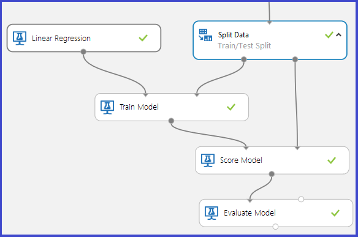

<properties 
    pageTitle="Déboguer votre modèle dans l’apprentissage automatique Azure | Microsoft Azure" 
    description="Explique comment comment déboguer votre modèle dans l’apprentissage automatique Azure." 
    services="machine-learning"
    documentationCenter="" 
    authors="garyericson" 
    manager="jhubbard" 
    editor="cgronlun"/>

<tags 
    ms.service="machine-learning" 
    ms.workload="data-services" 
    ms.tgt_pltfrm="na" 
    ms.devlang="na" 
    ms.topic="article" 
    ms.date="09/09/2016" 
    ms.author="bradsev;garye" />

# Déboguer votre modèle dans l’apprentissage automatique Azure

Cet article explique comment déboguer vos modèles dans l’apprentissage de Microsoft Azure automatique. En particulier, il traite les raisons possibles pourquoi une des deux scénarios de panne suivants peut se produire lors de l’exécution d’un modèle :

* le [Modèle de Train] [ train-model] module génère une erreur 
* le [Modèle de Score] [ score-model] module génère des résultats incorrects 

[AZURE.INCLUDE [machine-learning-free-trial](../../includes/machine-learning-free-trial.md)]

## Module de modèle train génère une erreur

Le [Modèle de Train] [ train-model] Module attend 2 entrées suivantes :

1. Le type de modèle de classement/régression à partir de la collection de modèles fournies par l’apprentissage automatique Azure
2. Les données de formation avec une colonne étiquette spécifiée. La colonne étiquette spécifie la variable de prédire. Le reste des colonnes comprises par défaut sont les fonctionnalités.

Ce module génère une erreur dans les cas suivants :

1. La colonne étiquette est incorrect, car l’étiquette sélectionnée est plus d’une colonne ou un index de colonne incorrecte est sélectionné. Par exemple, le second cas appliquera si un index de colonne de 30 a été utilisé avec un groupe de données d’entrée qui avait uniquement 25 colonnes.

2. Le jeu de données ne contient pas toutes les colonnes fonctionnalité. Par exemple, si le jeu de données d’entrée comporte uniquement 1 colonne, qui est marquée comme étant la colonne étiquette, il ne serait aucuns fonctionnalités avec lesquelles vous pouvez créer le modèle. Dans ce cas, le [Modèle de Train] [ train-model] module génère une erreur.

3. Le dataset d’entrée (fonctionnalités ou étiquette) contient l’infini en tant que valeur.

## Module de modèle score ne génère pas de résultats corrects

Dans un graphique de test/formation typique pour contrôlés d’apprentissage, les [Données fractionnées] [ split] module divise le dataset d’origine en deux parties : la partie qui est utilisée pour former le modèle et la partie réservée pour score degré le modèle formé effectue sur les données qu’il ne pas former sur. Le modèle formé, est utilisé pour évaluer les données de test après laquelle les résultats sont évaluées pour déterminer la précision du modèle.

Le [Modèle de Score] [ score-model] module requiert deux entrées :

1. Une sortie de modèle formé de [Modèle Train] [ train-model] module
2. Un jeu de données score pas le modèle a été pas formé sur

Il peut arriver que, même si l’expérience a réussi, le [Modèle de Score] [ score-model] module génère des résultats incorrects. Plusieurs scénarios peuvent provoquer cette situation :

1. Si l’étiquette spécifiée est par catégorie et un modèle de régression est une formation sur les données, une produit une sortie incorrecte aurait générée par le [Modèle de Score] [ score-model] module. C’est parce que régression nécessite une variable une réponse continue. Dans ce cas elle doit être plus appropriée utiliser un modèle de classement. 
2. De même, si un modèle de classement est une formation sur un jeu de données que vous rencontrez des nombres à virgule flottante dans la colonne étiquette, il peut donner des résultats indésirables. C’est parce que la classification nécessite une variable réponse discrète qui autorise uniquement les valeurs cette plage sur un jeu de classes déterminée et généralement un peu petit.
3. Si le dataset score ne contient pas toutes les fonctionnalités utilisées pour former le modèle, le [Modèle de Score] [ score-model] génère une erreur.
4. Le [Modèle de Score] [ score-model] ne donnent pas de résultat correspondant à une ligne dans le dataset score qui contient une valeur manquante ou une valeur infinie pour une de ses fonctionnalités.
5. Le [Modèle de Score] [ score-model] peut générer des sorties identiques pour toutes les lignes du DataSet score. Cela peut se produire, par exemple, lors de l’essayer classification à l’aide de décision forêts si le nombre minimal d’échantillons par nœud feuille est choisi pour être plus que le nombre d’exemples de formation disponibles.

<!-- Module References -->
[score-model]: https://msdn.microsoft.com/library/azure/401b4f92-e724-4d5a-be81-d5b0ff9bdb33/
[split]: https://msdn.microsoft.com/library/azure/70530644-c97a-4ab6-85f7-88bf30a8be5f/
[train-model]: https://msdn.microsoft.com/library/azure/5cc7053e-aa30-450d-96c0-dae4be720977/
 
