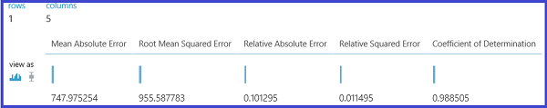
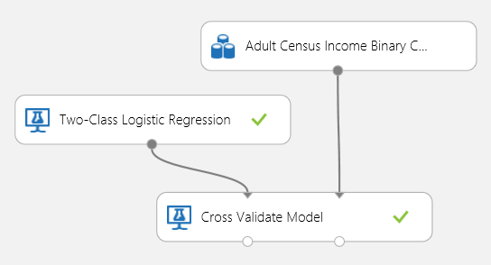
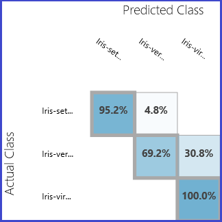
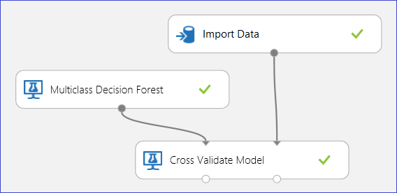

<properties 
    pageTitle="Évaluer les performances du modèle dans l’apprentissage automatique | Microsoft Azure" 
    description="Explique comment évaluer les performances du modèle dans l’apprentissage automatique Azure." 
    services="machine-learning"
    documentationCenter="" 
    authors="garyericson" 
    manager="jhubbard" 
    editor="cgronlun"/>

<tags 
    ms.service="machine-learning" 
    ms.workload="data-services" 
    ms.tgt_pltfrm="na" 
    ms.devlang="na" 
    ms.topic="article" 
    ms.date="08/19/2016" 
    ms.author="bradsev;garye" />

# Comment faire pour évaluer les performances du modèle dans l’apprentissage automatique Azure

Cette rubrique montre comment évaluer les performances d’un modèle dans Azure Machine apprentissage Studio et fournit une brève description des mesures disponibles pour cette tâche. Trois scénarios d’apprentissage contrôlés courants sont présentés : 

* régression
* classification binaire 
* classement multiclass

[AZURE.INCLUDE [machine-learning-free-trial](../../includes/machine-learning-free-trial.md)]

Évaluer les performances d’un modèle est une des étapes principales du processus de données scientifique. Il indique les notation (prévisions) d’un dataset a réussi par un modèle formé. 

Formation Machine Azure prend en charge d’évaluation de modèle à deux de sa machine principale modules de formation : [Modèle évaluer] [ evaluate-model] et [Valider entre le modèle][cross-validate-model]. Ces modules permettent de voir comment votre modèle s’exécute en termes d’un nombre d’indicateurs couramment utilisés dans des statistiques et apprentissage automatique.

##Évaluation comparatif entre Validation##
Évaluation et la validation croisée manières standard de mesurer les performances de votre modèle. Ils sont tous deux génèrent les mesures d’évaluation que vous pouvez inspecter ou comparer par rapport à celles d’autres modèles.

[Évaluation du modèle] [ evaluate-model] attend un jeu de données évaluée comme entrée (ou 2 en cas de modification que vous voulez comparer les performances de 2 différents modèles). Cela signifie que vous devez former votre modèle en utilisant le [Modèle de former] [ train-model] module et apportez prévisions sur certains dataset à l’aide du [Modèle de Score] [ score-model] module, avant de pouvoir évaluer les résultats. L’évaluation est fonction d’étiquettes/probabilités évaluées ainsi que les étiquettes trues, ce qui sont générés par le [Modèle de Score] [ score-model] module.

Vous pouvez également utiliser automatiquement des validation croisée pour effectuer une série d’opérations évaluer train-score (10 pliage) sur différents sous-groupes des données d’entrée. Les données d’entrée sont divisées en 10 composants, où une est réservée au test, et les autres 9 formation. Ce processus se répète 10 fois et les mesures d’évaluation moyenne. Cela vous aide à déterminer le degré un modèle serait généralisation pour les nouveaux groupes de données. Le [Modèle valider entre] [ cross-validate-model] module prend un modèle non formé et certains dataset libellée et renvoie les résultats de l’évaluation de chacun des 10 pliage, outre les résultats de la moyennes.

Dans les sections suivantes, nous créer des modèles de régression et classification simples et évaluer leurs performances, à l’aide à la fois le [Modèle évaluer] [ evaluate-model] et le [Valider entre le modèle] [ cross-validate-model] modules.

##L’évaluation d’un modèle de régression##
Supposons que vous souhaitiez prévoir les prix d’une voiture en utilisant certaines fonctionnalités telles que les dimensions, puissance, caractéristiques du moteur et ainsi de suite. Il s’agit d’un problème de régression classique, où la variable cible (*prix*) est une valeur numérique continue. Nous pouvons faire tenir un modèle de régression linéaire simple que, étant donné les valeurs de la fonctionnalité d’une certaine voiture, pouvez prévoir le prix de cette voiture. Ce modèle de régression peut servir à score même dataset sur que nous une formation. Une fois que nous avons les prix prévues pour toutes les voitures, nous pouvons évaluer les performances du modèle en consultant combien les prévisions écartent les prix réels en moyenne. Pour illustrer cela, nous utilisons le *jeu de données (vierge) données voiture prix* disponibles dans la section **Jeux de données enregistré** dans Azure Machine apprentissage Studio.
 
###Création de l’expérience###
Ajouter les modules suivants à votre espace de travail dans Azure Machine apprentissage Studio :

- Données de prix voiture (vierge)
- [Régression linéaire.][linear-regression]
- [Modèle de train][train-model]
- [Modèle de note][score-model]
- [Évaluation du modèle][evaluate-model]

Connecter les ports comme indiqué ci-dessous dans la Figure 1 et définissez la colonne étiquette du [Modèle Train] [ train-model] module au *prix*.
 

Figure 1. L’évaluation d’un modèle de régression.

###Inspecter les résultats d’évaluation###
Après avoir exécuté l’expérience, vous pouvez cliquer sur le port de sortie du [Modèle évaluer] [ evaluate-model] module et sélectionnez *visualiser* pour afficher les résultats d’évaluation. Les mesures d’évaluation disponibles pour les modèles de régression sont : *Signifie d’erreur absolue*, *Racine signifie d’erreur absolue*, *Erreur absolue Relative*, *Erreur Relative au carré*et le *Coefficient de détermination*.

Le terme « erreur » correspondant à la différence entre la valeur prévue et la valeur true. La valeur absolue ou le carré de cette différence sont généralement calculé pour capturer l’amplitude total d’erreur dans toutes les instances, comme la différence entre la valeur true et prévue peut être négative dans certains cas. Les indicateurs d’erreur mesurent les performances prédictive d’un modèle de régression en ce qui concerne l’écart-type de la moyenne de ses prévisions à partir des valeurs trues. Les valeurs d’erreur inférieurs signifient que le modèle est plus précis dans des prévisions. Une métrique erreur globales 0 signifie que le modèle de données est parfaitement adaptée aux.

Coefficient de détermination, qui est également appelé R au carré, est également un moyen standard de mesure de la façon dont le modèle adapté aux données. Il peut être interprété comme la proportion de variation expliquée par le modèle. Une version ultérieure proportion est préférable dans ce cas, où 1 indique une solution idéale.
 

Figure 2. Mesures d’évaluation de régression linéaire.

###À l’aide de croisée Validation###
Comme mentionné précédemment, vous pouvez effectuer formation répétée, notation et évaluations automatiquement à l’aide de la [Valider entre le modèle] [ cross-validate-model] module. Vous avez seulement besoin dans ce cas est un jeu de données, un modèle non formé et un [Modèle valider entre] [ cross-validate-model] module (voir l’illustration ci-dessous). Notez que vous devez définir la colonne étiquette au *prix* dans le [Modèle valider entre] [ cross-validate-model] propriétés du module.

Figure 3. Entre-validation d’un modèle de régression.

Après avoir exécuté l’expérience, vous pouvez vérifier les résultats d’évaluation en cliquant sur le port de sortie droite du [Valider entre le modèle] de[ cross-validate-model] module. Ceci fournira une vue détaillée des mesures pour chaque itération (avec pliure sur), ainsi que les résultats moyennes de chacun des indicateurs (Figure 4).
 

Figure 4. Validation croisée les résultats d’un modèle de régression.

##L’évaluation d’un modèle de classement binaire##
Dans un scénario de classification binaire, la variable cible comporte uniquement deux réponses possibles, par exemple : {0, 1} ou {faux, vrai}, {négatif, positif}. Supposons que vous disposez d’un jeu de données des employés gros avec certains démographiques et emploi variables, et que vous êtes invité à prévoir le niveau de revenu variable binaire avec les valeurs {« < = 50 Ko », « > 50 Ko »}. En d’autres termes, la classe négative représente les employés qui font inférieure ou égale à 50 Ko par an, et la classe positive représente tous les autres employés. Comme dans le scénario de régression, nous serait former un modèle de score général des données et évaluer les résultats. La différence principale ici est le choix d’apprentissage automatique Azure calcule les mesures et de sorties. Pour illustrer le scénario de prévision niveau revenus, nous utiliserons le dataset [gros](http://archive.ics.uci.edu/ml/datasets/Adult) pour créer une expérience d’apprentissage automatique Azure et évaluer les performances d’un modèle de régression logistique deux cours, un classifieur binaire fréquemment utilisé.

###Création de l’expérience###
Ajouter les modules suivants à votre espace de travail dans Azure Machine apprentissage Studio :

- Gros dataset recensement revenus binaire Classification
- [Régression logistique deux cours][two-class-logistic-regression]
- [Modèle de train][train-model]
- [Modèle de note][score-model]
- [Évaluation du modèle][evaluate-model]

Connecter les ports comme indiqué ci-dessous dans la Figure 5 et définissez la colonne étiquette du [Modèle Train] [ train-model] module au *résultat*.

Figure 5. L’évaluation d’un modèle de classement binaire.

###Inspecter les résultats d’évaluation###
Après avoir exécuté l’expérience, vous pouvez cliquer sur le port de sortie du [Modèle évaluer] [ evaluate-model] module et sélectionnez *visualiser* pour afficher les résultats d’évaluation (Figure 7). Les mesures d’évaluation disponibles pour les modèles de classement binaire sont : *précision*, *précision*, *rappeler*, *Score F1*et *AUC*. En outre, le module renvoie une matrice confusion affichant le nombre de positifs vrais, faux négatifs, fausses et négatifs trues, ainsi que courbes *ROC*, *Précision/rappel*et *lever* .

Précision est simplement la proportion d’instances correctement classés. Il s’agit généralement de la première symétrique examiner lors de l’évaluation classifieur. Toutefois, lorsque les données de test sont asymétrique (où la plupart des instances appartiennent à l’une des classes), ou si vous êtes plus d’informations sur les performances sur l’une des classes, précision ne capture vraiment l’efficacité d’un classifieur. Dans le scénario de la classification des niveaux revenus, supposons que vous testez sur certaines données où 99 % des instances représentent des personnes qui gagner inférieure ou égale à 50 Ko par an. Il est possible d’atteindre une précision 0,99 par la prédiction de la classe » < = 50 Ko » pour toutes les instances. Le classifieur apparaît dans ce cas qu’il faut pour un bon travail global, mais en réalité, il ne parvient pas à un des personnes à revenus élevés (1 %) classer correctement.

Pour cette raison, il est utile calculer des mesures supplémentaires pour évaluer les aspects plus spécifiques de l’évaluation de capturer. Avant d’aborder les détails de ces indicateurs, il est important de comprendre la matrice confusion d’interprétation classification binaire. Les étiquettes de classe dans l’ensemble d’apprentissage peuvent prendre sur seulement 2 valeurs possibles, que nous appelons généralement comme positif ou négatif. Les instances positifs et négatifs classifieur prévoit est correctement sont appelés positifs trues (pt) et trues négatifs (TN), respectivement. De même, les instances incorrectement classées sont appelés fausses (PF) et faux négatifs (FN). La matrice confusion est simplement une table affichant le nombre d’instances appartenant à chacune de ces 4 catégories. Azure apprentissage automatique décide automatiquement parmi les deux classes dans le groupe de données est la classe positive. Si les étiquettes de classe sont booléen ou entiers, les instances libellées « true » ou « 1 » sont affectées la classe positive. Si les étiquettes sont des chaînes, comme dans le cas du dataset revenus, les étiquettes sont triées par ordre alphabétique et le premier niveau est choisi pour être la classe négative alors que le deuxième niveau est la classe positive.

Figure 6. Classement binaire Confusion matrice.

Pour revenir au problème classification revenus, nous voulons poser quelques questions d’évaluation que nous aident à comprennent les performances du classifieur utilisé. Est une question très naturelle : « se déconnecter de toutes les personnes qui le modèle prédites pour gagner > 50 K (pt + PF), combien ont été classés correctement (pt) ? » Peut répondre à cette question en consultant la **précision** du modèle, ce qui correspond à la proportion de positifs sont classés correctement : TP/(TP+FP). Une autre question commune est « déconnecter tous les haute rapportant employés avec revenu > 50 k (pt + FN), combien classifieur classer correctement (pt) ». Il s’agit réellement le **rappeler**, ou le taux positif true : TP/(TP+FN) du classifieur. Vous remarquerez peut-être qu’il y a un compromis évident entre la précision et rappel. Par exemple, étant donné un jeu de données relativement équilibrée, classifieur qui prévoit est principalement positifs instances, c’est un rappel haut, mais une précision plutôt faible autant des instances négatifs serait classée résultant dans un grand nombre de fausses. Pour afficher un traçage de la manière dont ces deux mesures peuvent varier, vous pouvez cliquer sur la courbe ' Précision/rappel' dans la page de sortie de résultat d’évaluation (haut à gauche de la Figure 7).

 Figure 7. Résultats de l’évaluation Classification binaire.

Un autre métrique associée qui est souvent utilisé est le **Score F1**, qui prend la précision et rappel en considération. C’est la moyenne harmonique de ces 2 métriques et est calculée en tant que tel : F1 = 2 (rappel précision x) / (précision + rappel). Le score F1 est un bon moyen de résumer l’évaluation un nombre unique, mais il est toujours une bonne pratique d’examiner précision et rappel ensemble afin de mieux comprendre comment se comporte un classifieur.

En outre, une pouvez inspecter le taux vrai positif et le taux de faux positifs dans la courbe **Récepteur d’exploitation caractéristique (ROC)** et la valeur correspondante de la **Zone sous la courbe (AUC)** . Cette courbe est proche le coin supérieur gauche, améliore les performances de classifieur sont (qui est optimiser le taux positif true tout en réduisant le taux de faux positifs). Courbes qui sont près de la diagonale du tracé, résultat classifieurs tendent à réaliser des prévisions sont près de prédiction aléatoire.

###À l’aide de croisée Validation###
Comme dans l’exemple de régression, nous pouvons effectuer validation croisée pour former, score et évaluer différents sous-groupes des données automatiquement à plusieurs reprises. De même, nous pouvons utiliser le [Modèle valider entre] [ cross-validate-model] module, un modèle de régression logistique non formé et un jeu de données. La colonne étiquette doit être définie à *revenus* dans le [Modèle valider entre] [ cross-validate-model] propriétés du module. Après l’exécution de l’expérience et en cliquant sur le port de sortie droite du [Valider entre le modèle] de[ cross-validate-model] module, nous pouvons voir les valeurs métriques classification binaire pour chaque pliure en outre à la moyenne et l’écart type de chacun. 
 

Figure 8. Entre-validation d’un modèle de classement binaire.

Figure 9. Validation croisée les résultats d’un classifieur binaire.

##L’évaluation d’un modèle de classement Multiclass##
Dans cette expérience nous utiliserons dataset(http://archive.ics.uci.edu/ml/datasets/Iris "Iris") [Iris]populaires qui contient des instances de 3 différents types (classes) de l’établissement iris. Il existe 4 valeurs fonctionnalité (sépales longueur/largeur et la longueur/largeur des pétales) pour chaque instance. Dans les précédentes expériences nous formé et testé les modèles à l’aide de la même jeux de données. Ici, nous allons utiliser les [Données fractionnées] [ split] module pour créer des 2 sous-groupes des données, former la première et score général et évaluer sur la seconde. Le dataset Iris est disponible publiquement sur le [Référentiel d’apprentissage UCI Machine](http://archive.ics.uci.edu/ml/index.html)et peuvent être téléchargé à l’aide d’une [Importation de données] [ import-data] module.

###Création de l’expérience###
Ajouter les modules suivants à votre espace de travail dans Azure Machine apprentissage Studio :

- [Importer des données][import-data]
- [Multiclass décision forêt][multiclass-decision-forest]
- [Fractionner des données][split]
- [Modèle de train][train-model]
- [Modèle de note][score-model]
- [Évaluation du modèle][evaluate-model]

Connecter les ports comme indiqué ci-dessous dans la Figure 10.

Définir l’index de colonne étiquette du [Modèle Train] [ train-model] module à 5. Le jeu de données ne comporte aucune ligne d’en-tête, mais nous savoir que les étiquettes de classe se trouvent dans la cinquième colonne.

Cliquez sur [Importer des données] [ import-data] module et définissez la propriété *source de données* à *l’URL Web via le protocole HTTP*et l' *URL* http://archive.ics.uci.edu/ml/machine-learning-databases/iris/iris.data.

Définir la fraction d’instances à utiliser pour la formation dans les [Données fractionnées] [ split] module (0,7 par exemple).
 

Figure 10. L’évaluation d’un classifieur Multiclass

###Inspecter les résultats d’évaluation###
Exécutez l’expérience et cliquez sur le port de sortie du [Modèle évaluer][evaluate-model]. Résultats de l’évaluation sont présentées sous la forme d’une matrice toute confusion, dans ce cas. La matrice affiche le chiffre réel par rapport à des instances prévues pour toutes les 3 catégories.
 

Figure 11. Résultats de l’évaluation Classification multiclass.

###À l’aide de croisée Validation###
Comme mentionné précédemment, vous pouvez effectuer formation répétée, notation et évaluations automatiquement à l’aide de la [Valider entre le modèle] [ cross-validate-model] module. Vous devriez un jeu de données, un modèle non formé et un [Modèle valider entre] [ cross-validate-model] module (voir l’illustration ci-dessous). À nouveau, vous devez définir la colonne étiquette de la [Valider entre le modèle] [ cross-validate-model] module (index de colonne 5 dans le cas présent). Une fois que vous exécutez l’expérience et en cliquant sur la droite port du [Valider entre le modèle]de sortie[cross-validate-model], vous pouvez examiner les valeurs métriques pour chaque pliage, ainsi que l’écart type d’une moyenne et standard. Les mesures affichés ici sont similaires à celles mentionnées dans le cas de classification binaire. Toutefois, notez que dans classification multiclass, informatique la positifs/négatifs vrais et faux positifs/négatifs exécuté en comptant sur une base par classe, car il n’existe aucune classe global positif ou négatif. Par exemple, lors du calcul de la précision ou le rappel de la classe 'Iris-setosa', il est supposé qu’il s’agit de la classe positive et tous les autres comme négative.
 

La figure 12. Entre-validation d’un modèle de classement Multiclass.

Figure 13. Validation croisée les résultats d’un modèle de classement Multiclass.

<!-- Module References -->
[cross-validate-model]: https://msdn.microsoft.com/library/azure/75fb875d-6b86-4d46-8bcc-74261ade5826/
[evaluate-model]: https://msdn.microsoft.com/library/azure/927d65ac-3b50-4694-9903-20f6c1672089/
[linear-regression]: https://msdn.microsoft.com/library/azure/31960a6f-789b-4cf7-88d6-2e1152c0bd1a/
[multiclass-decision-forest]: https://msdn.microsoft.com/library/azure/5e70108d-2e44-45d9-86e8-94f37c68fe86/
[import-data]: https://msdn.microsoft.com/library/azure/4e1b0fe6-aded-4b3f-a36f-39b8862b9004/
[score-model]: https://msdn.microsoft.com/library/azure/401b4f92-e724-4d5a-be81-d5b0ff9bdb33/
[split]: https://msdn.microsoft.com/library/azure/70530644-c97a-4ab6-85f7-88bf30a8be5f/
[train-model]: https://msdn.microsoft.com/library/azure/5cc7053e-aa30-450d-96c0-dae4be720977/
[two-class-logistic-regression]: https://msdn.microsoft.com/library/azure/b0fd7660-eeed-43c5-9487-20d9cc79ed5d/
 
