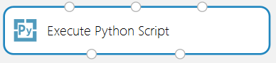
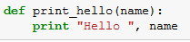
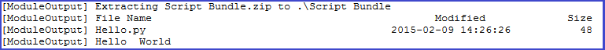
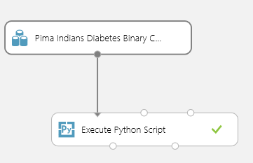
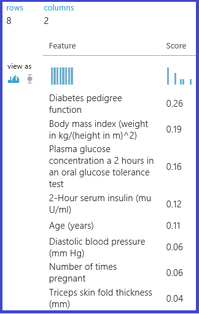

<properties 
    pageTitle="Exécuter des scripts d’apprentissage Python machine | Microsoft Azure" 
    description="Plans de conception principes de prise en charge pour les scripts Python d’apprentissage automatique Azure et scénarios d’utilisation de base, fonctionnalités et limitations." 
    keywords="machine Python d’apprentissage, pandas, pandas python, scripts python, exécuter les scripts python"
    services="machine-learning"
    documentationCenter="" 
    authors="bradsev" 
    manager="jhubbard" 
    editor="cgronlun"/>

<tags 
    ms.service="machine-learning" 
    ms.workload="data-services" 
    ms.tgt_pltfrm="na" 
    ms.devlang="na" 
    ms.topic="article" 
    ms.date="09/12/2016" 
    ms.author="bradsev" />

# Exécuter des scripts de formation Python machine dans Azure Machine d’apprentissage Studio

Cette rubrique décrit les principes de conception sous-jacent la prise en charge actuelle des scripts Python dans l’apprentissage automatique Azure. Les principales fonctionnalités sont également sous forme de plan, y compris la prise en charge pour l’importation de code existant, l’exportation de visualisations et, pour finir, certaines limitations et les travaux en cours sont traitées.

[Python](https://www.python.org/) est un outil indispensable dans la poitrine outil de nombreux scientifiques de données. Il comporte :

-  une syntaxe élégante et concise, 
-  prise en charge de la disponibilité sur plusieurs plateformes, 
-  une grande collection de puissantes bibliothèques, et 
-  outils de développement de maturité. 

Python est utilisé dans toutes les phases du flux de travail généralement utilisé à la modélisation apprentissage machine, à partir des données d’acquisition et traitement construction fonctionnalité et formation du modèle, puis validation et déploiement de modèles. 

Azure Machine d’apprentissage Studio prend en charge l’incorporation scripts Python dans différentes parties d’un ordinateur expérience d’apprentissage et également en toute transparence publiant en tant que services web scalable, operationalized sur Microsoft Azure.

[AZURE.INCLUDE [machine-learning-free-trial](../../includes/machine-learning-free-trial.md)]

## Principes de conception de scripts Python dans l’apprentissage automatique
L’interface principale à Python dans Azure Machine apprentissage Studio est via le [Exécuter le Script Python] [ execute-python-script] module illustré Figure 1.

Figure 1. Le module **Exécuter le Script Python** .

[Exécuter le Script Python] [ execute-python-script] module accepte jusqu'à trois entrées et produit jusqu'à deux sorties (voir ci-dessous), comme son analogique R, le [Exécuter le Script R] [ execute-r-script] module. L’exécution de code Python est entré dans la zone paramètre comme spéciale nommée point d’entrée fonction appelée `azureml_main`. Voici quelques principes de conception clé utilisés pour implémenter ce module :

1.  *Doit être idiomatiques pour les utilisateurs de Python.* La plupart des utilisateurs Python facteur leur code en tant que fonctions contenues dans les modules, afin de placer un grand nombre d’instructions exécutables dans un module de niveau supérieur est relativement rare. Par conséquent, la zone de script prend également une fonction Python spéciale nommée au lieu de simplement une séquence d’instructions. Les objets présentés dans la fonction sont des types de bibliothèques Python standards tels que des trames de données [Pandas](http://pandas.pydata.org/) et les matrices de [NumPy](http://www.numpy.org/) .
2.  *Doit avoir haute fidélité entre local et en nuage exécutions.* Le serveur principal utilisé pour exécuter le code Python est basé sur [Anaconda](https://store.continuum.io/cshop/anaconda/) 2.1, une distribution Python scientifique disponibilité sur plusieurs plateformes largement utilisée. Il est fourni avec près de 200 des packages Python plus courants. Par conséquent, données scientifiques peuvent déboguer et qualifier leur code sur leur environnement local Machine Azure apprentissage compatible Anaconda. Utiliser les environnements de développement existant comme [IPython](http://ipython.org/) bloc-notes ou [Python Tools pour Visual Studio](http://aka.ms/ptvs) pour exécuter dans le cadre d’une expérience d’apprentissage automatique Azure en toute sécurité haute. En outre, la `azureml_main` point d’entrée est une fonction Python classique et peut être créée sans code spécifique d’apprentissage automatique Azure ou le Kit de développement installé.
3.  *Doit être composite en toute transparence avec d’autres modules d’apprentissage automatique Azure.* [Exécuter le Script Python] [ execute-python-script] module accepte, comme entrées et sorties, jeux de données Azure Machine apprentissage standard. L’infrastructure sous-jacente efficacement et en toute transparence relie les exécutions d’apprentissage automatique Azure et Python (prenant en charge des fonctionnalités telles que les valeurs manquantes). Python utilisable par conséquent conjointement avec workflows apprentissage automatique Azure existants, y compris ceux qui appeler R et SQLite. Une pouvez donc envisager des flux de travail qui :
  * Utilisez les Python et Pandas pour les données de prétraitement et de nettoyage, 
  * flux de données à une transformation SQL, participation à plusieurs jeux de données aux fonctionnalités de formulaire, 
  * former des modèles à l’aide de la collection complète des algorithmes dans l’apprentissage automatique Azure, et 
  * évaluer et postérieures à la traiter les résultats à l’aide de R.

## Scénarios d’utilisation de base dans l’apprentissage automatique des scripts Python
Dans cette section, nous enquête quelques-unes des utilisations base du [Exécuter le Script Python] [ execute-python-script] module.
Comme mentionné précédemment, les entrées dans le module Python sont présentées sous forme de trames de données Pandas. Plus d’informations sur les Python Pandas et comment elle peut être utilisée pour manipuler efficacement les données sont accessibles dans *Python pour l’analyse de données* (o ' Reilly, 2012) par McKinney ouest. La fonction doit renvoyer une seule image données Pandas empaquetée à l’intérieur d’une [séquence](https://docs.python.org/2/c-api/sequence.html) de Python tel qu’un tuple, une liste ou une matrice NumPy. Le premier élément de cette séquence est ensuite renvoyé dans le premier port de sortie du module. Ce modèle est présentée dans la Figure 2.

Figure 2. Mise en correspondance des voies aux paramètres d’entrée et la valeur de retour à port de sortie.

Plus de sémantique de comment mapper les ports d’entrée aux paramètres de la `azureml_main` fonction apparaissent dans le tableau 1 :

Tableau 1. Mise en correspondance des ports d’entrée aux paramètres de fonction.

La mise en correspondance entre les ports d’entrée et les paramètres de la fonction est de position. Le premier port d’entrée connecté est mappé au premier paramètre de la fonction et la seconde entrée (si connecté) est mappée au deuxième paramètre de la fonction.

## Traduction de types d’entrée et de sortie
Comme indiqué précédemment, jeux de données d’entrée dans l’apprentissage automatique Azure est converties en blocs dans Pandas et les blocs de données de sortie sont converties en jeux de données Azure Machine apprentissage de données. Les conversions suivantes sont exécutées :

1.  Les colonnes numériques et de chaîne sont converties en tant que-est et les valeurs manquantes dans un jeu de données sont converties en valeurs « NA » dans Pandas. La conversion même s’exécute sur la façon dont précédent (valeurs NA dans Pandas sont converties en valeurs manquantes dans l’apprentissage automatique Azure).
2.  Index vecteurs dans Pandas ne sont pas prises en charge dans l’apprentissage automatique Azure. Toutes les images de données d’entrée dans la fonction Python ont toujours un index numérique 64 bits comprise entre 0 et le nombre de lignes moins 1. 
3.  Jeux de données Azure apprentissage automatique ne peut pas contenir des noms de colonne en double et les noms de colonnes qui ne sont pas des chaînes. Si une trame de données de sortie contient des colonnes non numérique, l’infrastructure appelle `str` sur les noms de colonne. De même, les noms de colonne en double sont tronqués automatiquement pour vous assurer que les noms sont uniques. Le suffixe (2) est ajouté à la première dupliquer, (3) pour la deuxième etc. en double.

## Amélioration des scripts Python
Tout [Exécuter le Script Python] [ execute-python-script] modules utilisés dans une expérience score sont appelées lors de la publication comme un service web. Par exemple, Figure 3 montre une expérience score contenant le code pour évaluer une expression Python unique. 

Figure 3. Service Web pour l’évaluation d’une expression Python.

Un service web créé à partir de cette expérience prend comme entrée une expression Python (sous forme de chaîne), il envoie pour le relais Python et retourne une table qui contient l’expression et le résultat calculé.

## L’importation des modules de script Python
Un cas d’utilisation courant nombreux scientifiques données consiste à incorporer des scripts Python existants expériences d’apprentissage automatique Azure. Au lieu de concaténation et collez tout le code dans une zone de script unique, le [Exécuter le Script Python] [ execute-python-script] module accepte un troisième port d’entrée à laquelle un fichier zip qui contient les modules Python pouvant être connecté. Le fichier est décompressé puis à l’infrastructure d’exécution en cours d’exécution et le contenu est ajouté au chemin d’accès de la bibliothèque de l’interprète Python. La `azureml_main` point d’entrée fonction peut ensuite importer ces modules directement.

Par exemple, vous pouvez le fichier Hello.py contenant une fonction simple « Bonjour, monde ».

Figure 4. Fonction définie par l’utilisateur.

Ensuite, nous créons un fichier Hello.zip contenant Hello.py :

Figure 5. Fichier ZIP contenant le code de Python définies par l’utilisateur.

Télécharger puis, cela comme un jeu de données dans Azure Machine apprentissage Studio. Créer et exécuter une expérience simple qui utilise le code Python dans le fichier Hello.zip en pièce jointe dans le troisième port d’entrée du Script Python exécuter, comme montré dans cette illustration.

Figure 6. Exemple Expérimentez définies par l’utilisateur le code Python téléchargé en tant que fichier zip.

Le module de sortie indique que le fichier zip a été donnée et la fonction `print_hello` a bien été exécuté.
 

 
Figure 7. Fonction définie par l’utilisateur en cours d’utilisation à l’intérieur de l' [Exécuter le Script Python] [ execute-python-script] module.

## Utilisation des visualisations
Tracés créés à l’aide de MatplotLib qui peut être affiché dans le navigateur peuvent être retournées par le [Script de Python exécuter][execute-python-script]. Mais les tracés ne sont pas redirigés automatiquement aux images qu’ils sont lors de l’utilisation de R. Si l’utilisateur doit enregistrer explicitement les tracés vers des fichiers PNG s’ils doivent être renvoyés à apprentissage automatique Azure. 

Pour générer des images à partir de MatplotLib, vous devez compétition la procédure suivante :

* Atteindre le serveur principal « Agrégation » du convertisseur en fonction Qt par défaut 
* créer un nouvel objet figure 
* obtenir de l’axe et générer tous les tracés dedans 
* Enregistrer l’illustration dans un fichier PNG 

Ce processus est illustré dans la Figure suivante 8 qui crée une matrice de traçage en nuages de points à l’aide de la fonction scatter_matrix dans Pandas.
 

Figure 8. Enregistrer des illustrations MatplotLib sur images.

Figure 9 montre une expérience qui utilise le script indiqué précédemment pour renvoyer trace via le second port de sortie.

 
     
 

Figure 9. Visualisation de tracés générés à partir de code Python.

Il est possible de retourner plusieurs chiffres en les enregistrant en images différents, le runtime apprentissage automatique Azure sélectionne toutes les images et les concatène pour visualisation.

## Exemples avancés
L’environnement Anaconda installé dans Azure Machine d’apprentissage contient packages courantes telles que NumPy, SciPy et découvrez Scikits et ces peuvent être utilisées efficacement pour différentes tâches de traitement des données dans un pipeline de formation machine classique. Par exemple, essais suivant et le script illustre l’utilisation d’apprenants ensemble dans Découvrez Scikits pour calculer des scores importance de fonctionnalité d’un dataset. Les notes peuvent, être utilisés pour effectuer une sélection de fonctionnalité contrôlés avant l’alimentation dans un autre modèle d’apprentissage automatique.

La fonction Python pour calculer les scores importance et l’ordre les fonctionnalités basées sur lui est indiquée ci-dessous :

Figure 10. Fonction afin de fonctionnalités classement par scores.
 L’expérience suivant calcule et renvoie les résultats de l’importance des fonctionnalités dans le dataset « Pima indiennes DIABÈTE » dans l’apprentissage automatique Azure :

    
    
Figure 11. Essayer des fonctions classement dans le dataset Pima indiennes diabète.

## Limitations 
[Exécuter le Script Python] [ execute-python-script] actuellement présente les limitations suivantes :

1.  *Exécution en mode sandbox.* Le runtime Python est actuellement en mode sandbox et, par conséquent, n’autorise pas l’accès au réseau ou au système de fichiers local de manière permanente. Tous les fichiers enregistrés localement sont isolés et supprimées lorsque le module est terminée. Le code Python ne peuvent pas accéder à la plupart des répertoires sur un ordinateur qu'il s’exécute sur, l’exception en cours le répertoire actuel et ses sous-répertoires.
2.  *Absence de développement sophistiquées et le support de débogage.* Le module Python n’autorise pas actuellement fonctionnalités IDE tels qu’intellisense et le débogage. En outre, si le module échoue lors de l’exécution, la trace de pile Python complète est disponible, mais doit être affichée dans le journal de résultat pour le module. Nous vous recommandons actuellement développer et déboguer leurs scripts Python dans un environnement tels que IPython et puis importer le code dans le module.
3.  *Sortie du cadre de données unique.* Le point d’entrée Python n’est autorisé pour renvoyer une trame de données unique sous forme de sortie. Il n’est pas actuellement possible retourner arbitraires objets Python tels que des modèles formés directement à l’exécution d’apprentissage automatique Azure. Comme [Exécuter le Script R][execute-r-script], qui présente les mêmes restrictions, il est toutefois possible dans de nombreux cas aux objets marinade dans un tableau d’octets et puis retournez cette à l’intérieur d’une trame de données.
4.  *Impossibilité de personnaliser l’installation Python*. Pour l’instant, la seule façon d’ajouter des modules Python personnalisés est via le mécanisme de fichier zip décrit plus haut. Cela est réalisable pour les modules petites, mais il est difficile pour les modules volumineux (notamment celles avec des DLL natives) ou un grand nombre de modules. 

##Conclusions
[Exécuter le Script Python] [ execute-python-script] module permet scientifique données pour incorporer code Python existant dans des flux de travail apprentissage machine hébergé sur le nuage dans Azure Machine d’apprentissage et en toute transparence effectuent les dans le cadre d’un service web. Le module de script Python naturellement interagit avec d’autres modules dans l’apprentissage automatique Azure et peut être utilisé pour une plage de tâches de l’exploration de données à prétraitement, à extraction fonctionnalité d’évaluation et traitement des résultats. Le runtime principal utilisé pour l’exécution repose sur Anaconda, une distribution Python bien testée et couramment utilisée. Cela facilite pour vous à des ressources de code existantes intégrée dans le cloud.

Nous prévoyons d’offrir des fonctionnalités supplémentaires pour [Exécuter le Script Python] [ execute-python-script] module telles que la possibilité pour former et effectuent des modèles dans Python et ajouter une meilleure prise en charge pour le développement et déboguer le code dans Azure Machine apprentissage Studio.

## Étapes suivantes

Pour plus d’informations, voir le [Centre de développement Python](/develop/python/).

<!-- Module References -->
[execute-python-script]: https://msdn.microsoft.com/library/azure/cdb56f95-7f4c-404d-bde7-5bb972e6f232/
[execute-r-script]: https://msdn.microsoft.com/library/azure/30806023-392b-42e0-94d6-6b775a6e0fd5/
