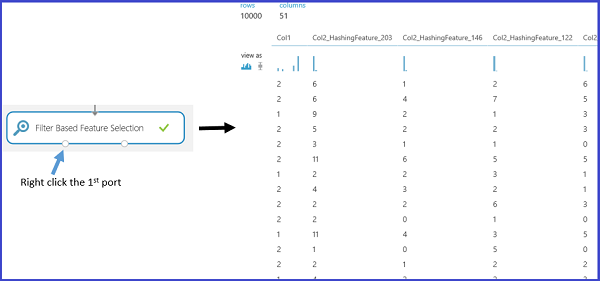

<properties
    pageTitle="Fonctionnalité d’ingénierie et sélection dans l’apprentissage automatique Azure | Microsoft Azure"
    description="Explique dans le cadre de sélection de fonctionnalités et ingénierie fonctionnalité et fournit des exemples de leur rôle dans le processus d’enrichissement des données d’apprentissage automatique."
    services="machine-learning"
    documentationCenter=""
    authors="bradsev"
    manager="jhubbard"
    editor="cgronlun"/>

<tags
    ms.service="machine-learning"
    ms.workload="data-services"
    ms.tgt_pltfrm="na"
    ms.devlang="na"
    ms.topic="article"
    ms.date="09/12/2016"
    ms.author="zhangya;bradsev" />

# Fonctionnalité ingénierie et la sélection dans l’apprentissage automatique Azure

Cette rubrique explique dans le cadre de la fonctionnalité ingénierie et sélection de fonctionnalités dans le processus d’enrichissement des données d’apprentissage automatique. Il montre ce que ces processus impliquent en utilisant les exemples fournis par Azure Machine apprentissage Studio.

[AZURE.INCLUDE [machine-learning-free-trial](../../includes/machine-learning-free-trial.md)]

Les données de formation utilisées dans l’apprentissage automatique peuvent souvent être améliorées par la sélection ou l’extraction des fonctionnalités à partir des données brutes collectées. Exemple d’une fonction d’ingénierie dans le contexte d’apprendre à classer les images de caractères manuscrites est une carte de densité de bits construite à partir des données brutes bit distribution. Ce mappage permettent de localiser plus efficacement que la distribution brute les bords des caractères.

Fonctionnalités d’ingénierie et sélectionnées accroître l’efficacité de la formation, qui tente d’extraire des informations clées contenues dans les données. Ils améliorent également la puissance de ces modèles pour classer les données d’entrée avec précision et pour prévoir de manière plus fiable issues d’intérêt. Fonctionnalité ingénierie et sélection peuvent également combiner pour rendre l’apprentissage plus de calculs souple. Il fait en améliorer et puis réduire le nombre de fonctionnalités nécessaires pour étalonner ou former un modèle. Strictement mathématique, les fonctionnalités sélectionnées pour former le modèle sont un ensemble minimal de variables indépendantes qui expliquent les modèles dans les données et puis prédire issues avec succès.

L’ingénierie et la sélection des fonctionnalités est une partie d’un processus plus large, qui est généralement constitué de quatre étapes :

* Collecte de données
* Amélioration des données
* Construction de modèle
* Traitement du résultat

Ingénierie et sélection composent l’étape d’enrichissement des données d’apprentissage automatique. Trois aspects de ce processus peuvent être distinguent notre fins :

* **Prétraitement des données**: ce processus tente de vous assurer que les données collectées soient cohérent. Il inclut les tâches telles que l’intégration de plusieurs jeux de données, la gestion des données manquantes, gestion des données n’est pas cohérente et conversion des types de données.
* **Fonctions d’ingénierie**: tente de ce processus pour créer des fonctionnalités pertinentes supplémentaires dans les fonctionnalités de brutes existantes dans les données et augmenter prédictive power à l’algorithme d’apprentissage.
* **Sélection de fonctionnalités**: ce processus sélectionne le sous-ensemble des fonctionnalités de données d’origine afin de réduire la dimension du problème formation clé.

Cette rubrique couvre uniquement les aspects de sélection de fonctionnalité du processus d’enrichissement des données et ingénierie de fonctionnalité. Pour plus d’informations sur l’étape prétraitement des données, voir [prétraitement des données dans Azure Machine apprentissage Studio](https://azure.microsoft.com/documentation/videos/preprocessing-data-in-azure-ml-studio/).

## Création de fonctions à partir de vos données--fonctionnalité ingénierie

Les données d’apprentissage se composent d’une matrice composée d’exemples (enregistrements ou observations stockées dans des lignes), chacun d'entre eux comporte un ensemble de fonctionnalités (variables ou les champs stockées dans des colonnes). Les fonctionnalités spécifiées dans la conception expérience devraient caractérisation les modèles dans les données. Bien que la plupart des champs de données brutes peuvent être incluses directement dans l’ensemble des fonctionnalités sélectionné utilisé pour former un modèle, conçu des fonctionnalités supplémentaires est souvent besoin d’être créé à partir des fonctionnalités dans les données brutes pour générer un jeu de données amélioré.

Quel type de fonctionnalités doit être créé afin d’améliorer le jeu de données lors de l’apprentissage d’un modèle ? Ingénierie fonctionnalités qui permettent d’améliorer la formation fournissent des informations qui mieux différencient les modèles dans les données. Vous prévoyez que les nouvelles fonctionnalités pour fournir des informations supplémentaires qui ne sont pas capturées clairement ou facilement apparente dans l’ensemble des fonctionnalités existantes ou d’origine, mais ce processus est une image clipart. Son et productives décisions nécessitent souvent certaines compétences de domaine.

Lorsque vous démarrez avec apprentissage automatique Azure, il est plus facile à comprendre concrètement ce processus à l’aide des exemples fournis dans Machine apprentissage Studio. Deux exemples sont présentés ici :

* Un exemple de régression ([prédiction du nombre de mensualités vélo](http://gallery.cortanaintelligence.com/Experiment/Regression-Demand-estimation-4)) dans une expérience contrôlé où les valeurs cible sont connues
* Un exemple de classification de texte-exploration de données à l’aide de la [Fonctionnalité de hachage][feature-hashing]

### Exemple 1 : Ajouter des fonctionnalités temporelles pour un modèle de régression ###

Pour vous montrer comment concevoir des fonctionnalités pour une tâche de régression, nous allons utiliser l’expérience « prévision de la demande de vélos » dans Azure Machine apprentissage Studio. L’objectif de cette expérience consiste à prévoir la demande de vélos, c'est-à-dire le nombre de mensualités de vélo d’un mois donné, jour, ou une heure. Le jeu de données **jeu de données vélo location UCI** est utilisé comme les données d’entrée brutes.

Cette série de données est basé sur des données réelles à partir de la société Bikeshare majuscule qui met à jour un réseau location vélo de Washington DC aux États-Unis. Le jeu de données représente le nombre de mensualités vélo au sein d’une heure spécifique d’un jour, à partir de 2011 vers 2012, et qu’il contient 17379 lignes et 17 colonnes. L’ensemble des fonctionnalités brutes contient les conditions météo (température, humidité, vent) et le type du jour (jour férié ou jour de la semaine). Le champ à prévoir est **cnt**, un nombre qui représente les mensualités vélo au sein d’une heure spécifique et qui est comprise entre 1 et 977.

Pour créer des fonctionnalités efficaces dans les données de formation, quatre modèles de régression sont créés à l’aide de l’algorithme de même, mais avec quatre jeux de données de formation différents. Les quatre jeux de données représentent les mêmes données d’entrée brutes, mais avec un nombre croissant de fonctionnalités définir. Ces fonctionnalités sont regroupées en quatre catégories :

1. A = météo congés + weekday + week-end fonctionnalités pour le jour prévu
2. B = nombre de vélos qui ont été louer dans chacune des 12 dernières heures
3. C = nombre de vélos qui ont été louer dans chacune des jours à la même heure 12 précédents
4. D = nombre de vélos qui ont été louer dans chacune des 12 semaines à la même heure et même jour précédents

Outre la fonctionnalité jeu A, qui se trouve déjà dans les données brutes d’origine, les trois autres ensembles de fonctionnalités sont créés via la fonctionnalité de processus d’ingénierie. Ensemble de fonctionnalités captures B la demande récente pour les vélos. Fonction définie C captures à la demande pour bikes en une heure spécifique. Fonction définie à la demande de captures D pour bikes en particulier heures et jours particuliers de la semaine. Chacune des quatre jeux de données formation inclut des ensembles de fonctionnalités A, A + B, A + B + C et A + B + C + D, respectivement.

Dans l’expérience d’apprentissage automatique Azure, ces quatre jeux de données de formation sont formées via quatre branches le traitement préalable d’entrée jeu de données. À l’exception de la branche plus à gauche, chacun de ces branches contient un [Exécuter le Script R] [ execute-r-script] module dans lequel un ensemble d’extraite fonctionnalités (fonctionnalité définit B, C et D) est respectivement construit et ajoutée à l’ensemble de données importée. La figure suivante illustre le script R permet de créer un ensemble de fonctionnalités B dans la deuxième branche gauche.

Le tableau suivant résume la comparaison des résultats de performances des quatre modèles. Obtenir les meilleurs résultats sont représentées par des fonctionnalités A + B + C. Notez que le taux d’erreur diminue lorsque les ensembles de fonctionnalités supplémentaires sont inclus dans les données de formation. Cela permet de vérifier notre présomption que les groupes de fonctionnalités B et C fournissent des informations pertinentes supplémentaires pour la tâche de régression. Ajout de l’ensemble des fonctionnalités D ne semble pas fournir une réduction supplémentaire dans le taux d’erreur.

### Exemple 2 : Création de fonctionnalités dans l’exploration de données texte  

Fonctionnalité ingénierie est largement appliquée dans les tâches liées à l’exploration de texte, tel que document classification et opinion l’analyse. Par exemple, lorsque vous souhaitez classer des documents dans plusieurs catégories, une hypothèse classique est que les mots ou phrases inclus dans une catégorie de document sont moins susceptibles de se produire dans une autre catégorie de document. En d’autres termes, la fréquence de la distribution du mot ou une expression est en mesure de caractérisation catégories autre document. Dans les applications d’exploration du texte, la fonctionnalité de processus d’ingénierie est nécessaires pour créer les fonctionnalités impliquant fréquence mot ou une phrase, car les éléments individuels de contenu de texte servent généralement les données d’entrée.

Pour ce faire, une technique appelée *fonction de hachage* est appliquée pour transformer efficacement les fonctionnalités de texte arbitraire en indices. Au lieu d’associer chaque fonctionnalité texte (mots ou phrases) à un index particulier, cette méthode fonctionne en appliquant une fonction de hachage pour les fonctionnalités et à l’aide de leurs valeurs de hachage comme indices directement.

Dans l’apprentissage automatique Azure, il est une [Fonctionnalité hachage] [ feature-hashing] module qui crée ces fonctionnalités mot ou une expression. La figure suivante montre un exemple de l’utilisation de ce module. Le jeu de données d’entrée contient deux colonnes : l’évaluation de livre comprise entre 1 à 5 et réels consulter le contenu. L’objectif de cette [Fonctionnalité hachage] [ feature-hashing] module consiste à extraire les nouvelles fonctionnalités qui la fréquence d’apparition des correspondantes mots ou phrases au sein de la révision livre donné. Pour utiliser ce module, vous devez effectuer les étapes suivantes :

1. Sélectionnez la colonne qui contient le texte d’entrée (**Col2** dans cet exemple).
2. Définissez *hachage bitsize* 8, ce qui signifie que 2 ^ 8 = 256 fonctionnalités sont créées. Le mot ou la phrase dans le texte est hachée puis 256 indices. Le paramètre *bitsize hachage* comprise entre 1 et 31. Si le paramètre est défini sur un plus grand nombre, les mots ou expressions sont moins susceptibles d’être haché dans le même index.
3. Définissez le paramètre *N-g* à 2. Cela récupère la fréquence de l’occurrence d’unigrams (une fonctionnalité de chaque mot unique) et bigrams (une fonctionnalité pour chaque paire de mots adjacentes) à partir de la saisie de texte. Le paramètre *N-g* comprise entre 0 et 10, qui indique le nombre maximal de mots séquentiels à inclure dans une fonction.  

La figure suivante illustre l’aspect de ces nouvelles fonctionnalités.

## Fonctions de filtrage de vos données : sélection de fonctionnalité  ##

*Sélection de fonctionnalités* est un processus qui est couramment appliqué à la construction d’ensembles de données de formation pour les tâches de modélisation prédictive tel que tâches classification ou d’une droite de régression. L’objectif consiste à sélectionner un sous-ensemble des fonctionnalités dans le jeu de données d’origine qui réduit ses dimensions à l’aide d’un ensemble de fonctionnalités minimal pour représenter la quantité maximale de variation dans les données. Ce sous-ensemble de fonctionnalités contient les fonctionnalités uniquement à inclure pour former le modèle. Sélection de fonctionnalités a deux objectifs principaux :

* Sélection de fonctionnalités souvent augmente précision classification en supprimant inutiles, redondantes ou hautement en corrélation fonctionnalités.
* Sélection de fonctionnalité diminue le nombre de fonctionnalités, ce qui permet du processus de formation modèle plus efficace. Ceci est particulièrement important pour les apprentis sont coûteuses former tels que des ordinateurs vecteur de prise en charge.

Bien que la sélection de fonctions cherche à réduire le nombre de fonctionnalités dans le jeu de données utilisé pour former le modèle, il n'est pas généralement référencé par le terme *réduction d’une dimension.* Méthodes de sélection de fonctionnalité extraire un sous-ensemble des fonctionnalités d’origine dans les données sans les modifier.  Méthodes de réduction d’une dimension utilisent ingénieries fonctionnalités que vous peuvent transformer les fonctionnalités d’origine et par conséquent les modifier. Analyse de composant principal, l’analyse de corrélation canonique et décomposition valeur singulier des exemples de méthodes de réduction d’une dimension.

La catégorie largement appliquée une des méthodes de sélection de fonctionnalité dans un contexte contrôlé est sélection de fonctionnalité basée sur le filtre. Pour évaluer la corrélation entre chaque fonctionnalité et l’attribut cible, ces méthodes appliquent une mesure statistique pour attribuer une note à chaque fonctionnalité. Les fonctionnalités sont puis classées selon la note, vous pouvez utiliser pour définir le seuil de conservation ou suppression d’une fonctionnalité spécifique. Les exemples des mesures statistiques utilisées dans ces méthodes de corrélation d’échantillonnage de Pearson, l’information réciproque et le test Khi-deux.

Azure Machine apprentissage Studio fournit des modules pour la sélection de fonctionnalité. Comme indiqué dans l’illustration suivante, ces modules incluent la [sélection de fonctionnalité basée sur le filtre] [ filter-based-feature-selection] et [Analyse discriminante linéaire Fisher][fisher-linear-discriminant-analysis].

Par exemple, utilisez la [sélection de fonctionnalité basée sur le filtre] [ filter-based-feature-selection] module avec l’exemple d’exploration de données texte décrite précédemment. Supposons que vous souhaitez créer un modèle de régression après un ensemble de 256 fonctionnalités est créé via la [Fonctionnalité hachage] [ feature-hashing] module et que la variable de réponse est **Col1** et représentant un livre réviser évaluation comprise entre 1 et 5. Affectez la **fonctionnalité score méthode** **De corrélation de Pearson**, **colonne cible** à **Col1**et le **nombre de fonctionnalités souhaitées** à **50**. Le module de [sélection de fonctionnalité basée sur le filtre] [ filter-based-feature-selection] puis génère un jeu de données contenant 50 fonctionnalités ainsi que l’attribut cible **Col1**. La figure suivante illustre le déroulement de cette expérience et les paramètres d’entrée.

La figure suivante illustre les jeux de données qui en résulte. Chaque fonctionnalité est un score en fonction de la corrélation de Pearson entre lui-même et l’attribut cible **Col1**. Les fonctionnalités dont le score supérieure sont conservées.

La figure suivante montre les résultats correspondants des fonctions sélectionnées.

En appliquant cette [sélection de fonctionnalité basée sur le filtre] [ filter-based-feature-selection] module, 50 de 256 fonctionnalités sont sélectionnées, car ils ont le meilleur parti des fonctionnalités en corrélation avec la cible variable **Col1** basée sur la méthode de calcul des points **De corrélation de Pearson**.

## Conclusion
Ingénierie fonctionnalité et sélection de fonctionnalités sont deux étapes effectuées fréquemment pour préparer les données de formation lors de la création d’un modèle d’apprentissage automatique. En règle générale, ingénierie fonctionnalité est appliqué en premier pour générer des fonctionnalités supplémentaires, et l’étape de sélection de fonctionnalité est alors effectuée pour éliminer les fonctionnalités inutiles, redondantes ou hautement en corrélation.

Il n’est pas toujours nécessairement à effectuer une sélection ingénierie ou une fonctionnalité de fonctionnalité. Si vous en avez besoin dépend de données que vous avez ou collectez, l’algorithme que vous avez choisi et l’objectif de l’expérience.

<!-- Module References -->
[execute-r-script]: https://msdn.microsoft.com/library/azure/30806023-392b-42e0-94d6-6b775a6e0fd5/
[feature-hashing]: https://msdn.microsoft.com/library/azure/c9a82660-2d9c-411d-8122-4d9e0b3ce92a/
[filter-based-feature-selection]: https://msdn.microsoft.com/library/azure/918b356b-045c-412b-aa12-94a1d2dad90f/
[fisher-linear-discriminant-analysis]: https://msdn.microsoft.com/library/azure/dcaab0b2-59ca-4bec-bb66-79fd23540080/
