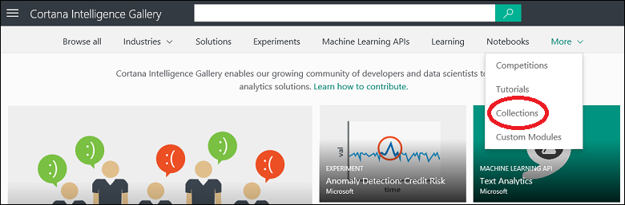

<properties
    pageTitle="Collections Cortana Intelligence galerie | Microsoft Azure"
    description="Découvrir et partager des collections de sites dans la galerie d’Intelligence Cortana."
    services="machine-learning"
    documentationCenter=""
    authors="garyericson"
    manager="jhubbard"
    editor="cgronlun"/>

<tags
    ms.service="machine-learning"
    ms.workload="data-services"
    ms.tgt_pltfrm="na"
    ms.devlang="na"
    ms.topic="article"
    ms.date="10/13/2016"
    ms.author="roopalik;garye"/>

# Découvrir et partager des collections de sites dans la galerie d’Intelligence Cortana

[AZURE.INCLUDE [machine-learning-gallery-item-selector](../../includes/machine-learning-gallery-item-selector.md)]

## Collections de sites

Une **[collection de sites](https://gallery.cortanaintelligence.com/collections)** permet de regrouper les expériences, API et autres éléments de la galerie qui répondent à une solution spécifique ou le concept. Ils peuvent être regroupés pour référence ultérieure, l’utilisation ou le partage.

## Découvrir

Pour parcourir les collections de sites dans la galerie, ouvrez la [Galerie](http://gallery.cortanaintelligence.com), pointez votre souris sur **plus** en haut de la page d’accueil de la galerie et sélectionnez **Collections**.

 Les **[Collections](https://gallery.cortanaintelligence.com/collections)** 
 page affiche une liste des collections plus récemment ajoutées et les plus populaires.
Cliquez sur **Afficher tout** pour afficher toutes les collections.
À partir de cette page, vous pouvez parcourir toutes les collections de sites dans la galerie, ou vous pouvez effectuer une recherche en sélectionnant des critères de filtre à gauche de la page et entrer des termes de recherche en haut.

 Cliquez sur n’importe quelle collection pour ouvrir la page Détails de la collection de sites et en savoir plus à ce sujet.
Dans cette page que vous pouvez effectuer des commentaires, fournir des commentaires ou poser des questions à la section commentaires. Vous pouvez même le partager avec vos amis ou collègues utilisant les fonctionnalités de partage de LinkedIn ou Twitter. Vous pouvez également envoyer un lien vers l’expérience pour inviter d’autres utilisateurs d’afficher la page.

## Collaboration

Vous pouvez créer une collection de sites qui contient des éléments dont vous êtes propriétaire ou qui ont été fournies par la Communauté. Elles peuvent être les éléments de la galerie qui répondent à une solution spécifique ou le concept

Par exemple, vous pouvez utiliser une collection de sites pour regrouper des articles sur un sujet spécifique, ou vous pouvez regrouper une expérience de plusieurs étapes permettant de résoudre un problème complexe.
Les collections initiales fournies par Microsoft se composent d’apprentissage expérience modèles pour la résolution des problèmes réels, tels que les détection de fraude en ligne, une classification de texte, prévisions de vente au détail et maintenance prédictive de l’ordinateur à plusieurs étapes.

### Créer une collection de sites

Suivez ces étapes pour créer et envoyer une collection de sites dans la galerie d’Intelligence Cortana :

1. Se connecter à la galerie à l’aide de votre compte Microsoft

- Votre image dans la partie supérieure de la fenêtre, puis cliquez sur le nom de votre

    

2. Cliquez sur **nouvel élément**

    

3. Sélectionnez **collection de sites** pour le **Type d’élément**, puis donnez à la collection un nom, un court résumé, une description et les balises qui aideront les utilisateurs de trouver la collection de sites

    

4. Cliquez sur **suivant** : vous pouvez télécharger un fichier image, ou sélectionner une image boursier, qui s’affichera avec la collection de sites ; Sélectionnez un élément qui aidera les utilisateurs à identifier le contenu et la fin de la collection de sites

    

5. Cliquez sur **suivant** : vous pouvez décider si la collection est **Public** (il peut être affiché par tout le monde) ou **non listé** (seules les personnes atteintes d’un lien direct peut afficher la collection de sites)

    > [AZURE.IMPORTANT] Une fois que vous définissez une collection de sites à tout le **monde**, vous pouvez le configurer pas à **non listé**.

    

6. Cliquez sur **créer**

Votre collection de sites fait désormais partie de la galerie d’Intelligence Cortana. Il doit être répertorié sur la page Mon compte sous l’onglet de la **collection de sites** .

### Ajouter des éléments à une collection de sites

Vous pouvez ajouter des éléments à votre collection de sites en ouvrant la collection de sites, en cliquant sur **Modifier**, puis puis en cliquant sur **Ajouter un élément**.

Vous allez indiqué une liste d’éléments que vous avez contribué à la galerie, ou vous pouvez rechercher dans la galerie des éléments à ajouter. Cliquez sur un élément pour le sélectionner. Chaque élément que vous sélectionnez est inclus dans l’ensemble des éléments à ajouter : le bouton **Ajouter** indique le nombre d’éléments ont été sélectionné.

Ou, si vous trouvez un élément lors de la navigation dans la galerie que vous voulez inclure, simplement ouvrir l’élément, cliquez sur **Ajouter à la collection de sites**et spécifier la collection de sites que vous voulez l’ajouter à.

Vous pouvez modifier la synthèse, description ou balises de votre collection de sites en ouvrant la collection de sites et en cliquant sur **Modifier**.
Pendant que vous modifiez votre collection de sites, vous pouvez également modifier l’ordre des éléments dans la collection de sites en utilisant les flèches en regard d’un élément pour le déplacer dans la liste. Et que vous ajoutez des notes pour les éléments dans votre collection de sites en cliquant sur le coin supérieur droit d’un élément et en sélectionnant **Ajouter/modifier une note**. Pour supprimer un élément de votre collection de sites, sélectionnez **Supprimer**.

**[Aller à la galerie >>](http://gallery.cortanaintelligence.com)**

[AZURE.INCLUDE [machine-learning-free-trial](../../includes/machine-learning-free-trial.md)]
