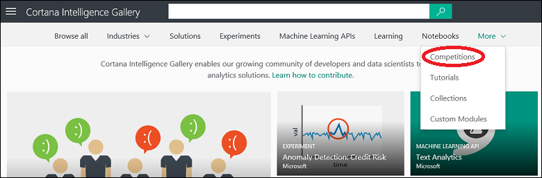

<properties
    pageTitle="Concours de Cortana Intelligence galerie | Microsoft Azure"
    description="Découvrez concours dans la galerie d’Intelligence Cortana."
    services="machine-learning"
    documentationCenter=""
    authors="garyericson"
    manager="jhubbard"
    editor="cgronlun"/>

<tags
    ms.service="machine-learning"
    ms.workload="data-services"
    ms.tgt_pltfrm="na"
    ms.devlang="na"
    ms.topic="article"
    ms.date="10/13/2016"
    ms.author="roopalik;garye"/>

# Découvrir concours dans la galerie d’Intelligence Cortana

[AZURE.INCLUDE [machine-learning-gallery-item-selector](../../includes/machine-learning-gallery-item-selector.md)]

## Cortana Intelligence concours

**[Concours](https://gallery.cortanaintelligence.com/competitions)** offrent une opportunité original à la compétition avec la Communauté des scientifiques de données pour résoudre les problèmes complexes à l’aide de Cortana Intelligence Suite.

## Découvrir

  Pour rechercher concours dans la galerie, ouvrez la [Galerie](http://gallery.cortanaintelligence.com), pointez votre souris sur **plus** en haut de la page d’accueil de la galerie et sélectionnez **concours**.

 Les **[concours](https://gallery.cortanaintelligence.com/competitions)** 
 page affiche une liste des concours les plus populaires.
Cliquez sur **Afficher tout** pour afficher tous les concours.
À partir de cette page, vous pouvez parcourir tous les concours dans la galerie, ou vous pouvez effectuer une recherche en sélectionnant des critères de filtre à gauche de la page et entrer des termes de recherche en haut.

 Cliquez sur toute concurrence pour ouvrir la page Détails de la concurrence et en savoir plus. Dans cette page que vous pouvez effectuer des commentaires, fournir des commentaires ou poser des questions à la section commentaires. Vous pouvez même le partager avec vos amis ou collègues utilisant les fonctionnalités de partage de LinkedIn ou Twitter. Vous pouvez également envoyer un lien vers la concurrence pour inviter d’autres utilisateurs d’afficher la page.

## Participer à notre concours

Si la concurrence est ouverte, l’état de la page Détails sera **Active**. Pour participer à la compétition, cliquez sur **Entrez la concurrence** et que vous aurez des instructions sur les ressources que nécessaires et les étapes à suivre.

Si la concurrence n’est plus ouverte, son statut dans la page Détails sera **terminé** et le lien de **La concurrence permet d’entrer** sera remplacé par le mot **terminé**.

**[Aller à la galerie >>](http://gallery.cortanaintelligence.com)**

[AZURE.INCLUDE [machine-learning-free-trial](../../includes/machine-learning-free-trial.md)]
