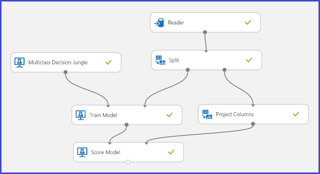

<properties
    pageTitle="Interpréter les résultats du modèle dans l’apprentissage automatique | Microsoft Azure"
    description="Comment choisir le paramètre optimal défini pour un algorithme à l’aide et la visualisation des sorties de modèle score."
    services="machine-learning"
    documentationCenter=""
    authors="bradsev"
    manager="jhubbard"
    editor="cgronlun"/>

<tags
    ms.service="machine-learning"
    ms.workload="data-services"
    ms.tgt_pltfrm="na"
    ms.devlang="na"
    ms.topic="article"
    ms.date="09/12/2016"
    ms.author="bradsev" />

# Interpréter les résultats du modèle dans l’apprentissage automatique Azure

Cette rubrique explique comment visualiser et interpréter les résultats des prévisions dans Azure Machine apprentissage Studio. Après avoir formé un modèle et terminé des prédictions par-dessus (« le modèle a obtenu »), vous devez comprendre et interpréter le résultat de prévision.

[AZURE.INCLUDE [machine-learning-free-trial](../../includes/machine-learning-free-trial.md)]

Il existe quatre types principaux d’apprentissage modèles dans Azure d’apprentissage automatique de l’ordinateur :

* Classification
* Mise en cluster
* Régression
* Systèmes de conseiller

Modules utilisés pour la prévision en haut de ces modèles sont :

* [Score modèle] [ score-model] module de classification et de régression
* [Attribuer aux Clusters] [ assign-to-clusters] module pour effectuer ces regroupements
* [Score allumettes conseiller] [ score-matchbox-recommender] pour les systèmes de recommandations

Ce document explique comment interpréter les résultats de la prévision pour chacun de ces modules. Pour une vue d’ensemble de ces modules, voir [comment choisir des paramètres afin d’optimiser vos algorithmes dans l’apprentissage automatique Azure](machine-learning-algorithm-parameters-optimize.md).

Cette rubrique concerne l’interprétation de prévision, mais pas l’interprétation du modèle. Pour plus d’informations sur la façon d’évaluer votre modèle, voir [l’évaluation des performances de modèle dans l’apprentissage automatique Azure](machine-learning-evaluate-model-performance.md).

Si vous débutez avec apprentissage automatique Azure et avez besoin d’aide pour créer une expérience simple pour commencer, voir [créer une expérience simple dans Azure Machine apprentissage Studio](machine-learning-create-experiment.md) dans Azure Machine apprentissage Studio.

## Classification ##
Il existe deux sous-catégories des problèmes de classification :

* Problèmes avec deux seules classes (classification deux cours ou binaire)
* Problèmes avec plus de deux classes (classification de classe à plusieurs)

Apprentissage automatique Azure propose différents modules de traiter chacun de ces types de classification, mais les méthodes pour l’interprétation des résultats de la prévision sont similaires.

### Deux cours classification###
**Expérience d’exemple**

Exemple d’un problème de classification de deux cours correspond à la classification de fleurs iris. La tâche consiste à classer fleurs iris en fonction de leurs caractéristiques. Le jeu de données Iris fourni dans l’apprentissage automatique Azure est un sous-ensemble du [jeu de données Iris](http://en.wikipedia.org/wiki/Iris_flower_data_set) populaires qui contient des instances d’uniquement deux espèce fleur (branches 0 et 1). Il existe quatre fonctionnalités pour chaque fleur (longueur sépales, sépales largeur, longueur pétales et la largeur des pétales).

Figure 1. Expérience de problème de classification de deux cours IRIS

Une expérience a été effectuée pour résoudre ce problème, comme illustré dans la Figure 1. Un modèle d’arborescence deux cours augmentée décision a été formé et un score. À présent, vous pouvez visualiser les résultats des prévisions à partir du [Modèle de Score] [ score-model] module en cliquant sur le port de sortie du [Modèle de Score] [ score-model] module, puis en cliquant sur **visualiser**.

Cela affiche les résultats de la notation comme indiqué dans la Figure 2.

Figure 2. Visualiser un résultat du modèle de score dans deux cours classification

**Interprétation des résultats**

Il existe six colonnes du tableau de résultats. Les quatre colonnes gauche sont les fonctionnalités de quatre. Les colonnes de deux vers la droite, a obtenu étiquettes et probabilités a obtenu, sont les résultats de la prévision. La colonne a obtenu probabilités montre la probabilité d’une fleur appartient à la classe positive (classe 1). Par exemple, le premier nombre dans la colonne (0.028571) signifie qu’il est 0.028571 probabilité que la première fleur appartient à la classe 1. La colonne a obtenu étiquettes montre la classe prévue pour chaque fleur. Ceci est basé sur la colonne a obtenu probabilités. Si la probabilité d’une fleur évaluée est supérieure à 0,5, il est prévu en tant que classe 1. Dans le cas contraire, il est prévu en tant que classe 0.

**Publication du service Web**

Une fois que les résultats de la prévision ont été entendus et jugées son, l’expérience peut être publiée comme un service web afin que vous pouvez déployer dans différentes applications et appelez-le pour obtenir des prédictions de cours sur les nouvelles fleur iris. Pour savoir comment changer une expérience de formation en une expérience score et publiez-le comme un service web, voir [Publier le service web apprentissage automatique Azure](machine-learning-walkthrough-5-publish-web-service.md). Cette procédure vous offre une expérience score comme indiqué dans la Figure 3.

Figure 3. Notation de l’expérience de problème de classification de deux cours iris

Désormais, vous devez définir l’entrée et la sortie du service web. L’entrée est le port d’entrée droite du [Modèle de Score][score-model], qui est la fleur Iris fonctionnalités d’entrée. Le choix de la sortie varie selon que vous êtes intéressé par la classe prévue (évaluée étiquette), la probabilité évaluée ou les deux. Dans cet exemple, il est supposé égal qui vous intéressez dans les deux. Pour sélectionner les colonnes de sortie souhaité, utilisez une [Sélection des colonnes dans le jeu de données] [ select-columns] module. Cliquez sur [Sélectionner les colonnes dans le jeu de données][select-columns], cliquez sur **lancer le sélecteur de colonne**, puis sélectionnez **a obtenu étiquettes** et **Probabilités a obtenu**. Après avoir défini le port de sortie de [Sélectionner des colonnes dans le jeu de données] [ select-columns] et exécutez à nouveau, vous devez être prêt à publier l’expérience score comme un service web en cliquant sur **Publier le SERVICE WEB**. L’expérience final ressemble à ceci Figure 4.

Figure 4. Expérience score final d’un problème de classification de deux cours iris

Une fois que vous exécutez le service web et entrez des valeurs de la fonctionnalité d’une instance de test, le résultat renvoie deux nombres. Le premier nombre est l’étiquette évaluée et le second est la probabilité évaluée. Cette fleur prédiction de classe 1 avec une probabilité 0.9655.

Figure 5. Résultat du service Web de classification de deux cours iris

### Classification de classe à plusieurs
**Expérience d’exemple**

Dans cette expérience, vous effectuez une tâche de reconnaissance vocale lettre comme un exemple de classification multiclass. Le classifieur tente de prédire une certaine lettre (classe), en fonction des valeurs d’attribut manuscrites extraites les images manuscrites.

Dans les données de formation, il existe 16 fonctionnalités extraites des images de lettre manuscrite. Notre 26 classes en conservant les 26 lettres. Figure 6 présente une expérience qui sera former un modèle de classement multiclass de reconnaissance de lettre et prévoir la même fonctionnalité définie sur une série de données de test.

Figure 6. Expérience de lettre reconnaissance classification multiclass problème

Visualiser les résultats à partir du [Modèle de Score] [ score-model] module en cliquant sur le port de sortie du [Modèle de Score] [ score-model] module, puis en cliquant sur **visualiser**, vous devez voir le contenu comme illustré dans la Figure 7.

Figure 7. Visualiser les résultats de modèle de note dans une classification de classe à plusieurs

**Interprétation des résultats**

Les 16 colonnes gauche représentent les valeurs de la fonctionnalité de l’ensemble de test. Les colonnes avec des noms comme un score probabilités de classe « XX » sont simplement tels que la colonne a obtenu probabilités dans le cas de deux cours. Ils affichent la probabilité que l’entrée correspondante se situe dans une certaine catégorie. Par exemple, pour la première entrée, il est probable 0.003571 qu’il s’agit d’un « A » 0.000451 probabilité qu’il est un « B » et ainsi de suite. La dernière colonne (a obtenu étiquettes) est identique à un score étiquettes dans le cas de deux cours. Il sélectionne la classe avec la plus grande probabilité évaluée comme la classe prévue de l’écriture correspondante. Par exemple, pour la première entrée, l’étiquette évaluée est « F » car l’option la plus grande probabilité d’être un « F » (0.916995).

**Publication du service Web**

Vous pouvez également ouvrir l’étiquette évaluée pour chaque entrée et de la probabilité de l’étiquette évaluée. La logique de base consiste à trouver la plus grande probabilité parmi tous les probabilités évaluées. Pour ce faire, vous devez utiliser le [Exécuter le Script R] [ execute-r-script] module. Le code R est affiché dans la Figure 8, le résultat de l’expérience est indiqué dans la Figure 9.

Figure 8. Code R permettant d’extraire a obtenu les étiquettes et les probabilités associées à des étiquettes

Figure 9. Expérience score final du problème classification multiclass reconnaissance de lettre

Une fois que vous publiez et exécuter le service web et entrez des valeurs de la fonctionnalité d’entrée, la résultat retourné ressemble Figure 10. Prédiction de cette lettre manuscrite avec ses 16 fonctionnalités extraites, soit un « T » avec une probabilité 0.9715.

Figure 10. Résultat du service Web de classification multiclass

## Régression

Problèmes de régression sont différents des problèmes de classification. Dans un problème de classification, que vous essayez de prédire discrètes classes, telles que les cours une fleur iris appartient. Mais comme vous pouvez le voir dans l’exemple suivant d’un problème de régression, que vous tentez de prédire une variable en continu, telles que le prix d’une voiture.

**Expérience d’exemple**

Utilisez prédiction de prix voiture que dans votre exemple de régression. Vous essayez de prédire le prix d’une voiture en fonction de ses fonctionnalités, notamment la marque, type de carburant, type de corps et roue lecteur. L’expérience est indiquée dans la Figure 11.

Figure 11. Expérience de problème de régression prix voiture

Visualiser le [Modèle de Score] [ score-model] module, le résultat apparaît comme Figure 12.

La figure 12. Notation de résultats pour le problème de prévision prix voiture

**Interprétation des résultats**

Étiquettes évaluées est la colonne résultat dans ce résultat score. Les nombres sont le prix prévu pour chaque voiture.

**Publication du service Web**

Vous pouvez publier l’expérience de régression dans un service web et appelez-le pour la prédiction de prix voiture de la même façon que dans le cas d’utilisation de classification de classe de deux.

Figure 13. Expérience d’un problème de régression prix voiture de notation

Exécution du service web, le résultat retourné ressemble à ceci Figure 14. Le prix prévu pour cette voiture est $15,085.52.

La figure 14. Résultat du service Web d’un problème de régression prix voiture

## Mise en cluster

**Expérience d’exemple**

Nous allons utiliser le jeu de données Iris à nouveau pour générer une expérience cluster. Ici, vous pouvez filtrer les étiquettes de classe dans l’ensemble de données afin qu’elle comporte des fonctionnalités uniquement et peut être utilisé pour effectuer ces regroupements. Dans cette iris cas d’utilisation, spécifiez le nombre de clusters à deux pendant le processus de formation, ce qui signifie que vous voulez regrouper les fleurs en deux classes. L’expérience est indiquée dans la Figure 15.

La figure 15. Problème cluster IRIS essayer

Cluster diffère de classification dans la mesure où le jeu de données formation n’aient des étiquettes de sol vérité par lui-même. Groupes cluster les instances de jeu de données de formation en clusters distincts. Pendant le processus de formation, le modèle présente les entrées par les différences entre les fonctionnalités d’apprentissage. Après cela, le modèle formé peut être utilisé pour classer les entrées futures. Il existe deux parties du résultat que nous intéressent au sein d’un problème cluster. La première partie est libellé le jeu de données de formation et le second est classer un nouveau jeu de données avec le modèle formé.

Visualisation de la première partie du résultat en cliquant sur le port de sortie gauche du [Modèle de cluster Train] [ train-clustering-model] , puis en cliquant sur **visualiser**. La visualisation est affichée dans la Figure 16.

La figure 16. Visualiser cluster le résultat de l’ensemble de données de formation

Le résultat de la deuxième partie, cluster nouvelles entrées avec le modèle de cluster formé, apparaît dans la Figure 17.

La figure 17. Visualiser cluster résultat sur un nouveau jeu de données

**Interprétation des résultats**

Bien que les résultats des deux parties proviennent d’expérience différentes étapes, ils ont le même aspect et interprétés de la même façon. Les quatre premières colonnes sont des fonctionnalités. La dernière colonne, affectations, est le résultat de prévision. Les entrées reçoivent le même numéro sont prédites se trouver dans le même cluster, c'est-à-dire, qu’ils partagent similitudes d’une façon quelconque (cette expérience utilise la mesure de la distance EUCLIDIENNE par défaut). Étant donné que vous avez spécifié le nombre de clusters est 2, les entrées dans les affectations sont étiquetées 0 ou 1.

**Publication du service Web**

Vous pouvez publier l’expérience cluster dans un service web et appelez-le pour effectuer ces regroupements des prédictions cas d’utilisation de la même façon que dans la classification deux cours.

La figure 18. Notation expérience d’un problème de cluster iris

Après avoir exécuté le service web, le résultat retourné ressemble à Figure 19. Prédiction de cette fleur dans un cluster 0.

La figure 19. Résultat du service Web de classification de deux cours iris

## Système de recommandation
**Expérience d’exemple**

Pour les systèmes de conseiller, vous pouvez utiliser le problème de recommandation restaurant par exemple : vous pouvez recommander restaurants pour les clients en fonction de leur historique d’évaluation. Les données d’entrée se composent de trois parties :

* Évaluations restaurant des clients
* Données de fonctionnalité client
* Données de la fonctionnalité restaurant

Il existe plusieurs choses que nous pouvons faire avec les [Conseils sur les allumettes Train] [ train-matchbox-recommender] module dans l’apprentissage automatique Azure :

- Prévoir des évaluations d’un utilisateur donné et un élément
- Vous recommandons d’éléments à un utilisateur donné
- Rechercher des utilisateurs liés à un utilisateur donné
- Rechercher des éléments associés à un élément donné

Vous pouvez choisir de ce que vous voulez faire en sélectionnant parmi les options dans le menu **type de prévision conseils sur les** quatre. Vous pouvez ici passez en revue les quatre scénarios.

Une expérience d’apprentissage automatique Azure par défaut pour un système de recommandation ressemble à ceci Figure 20. Pour plus d’informations sur l’utilisation de ces modules système conseiller, voir [conseils sur les allumettes Train] [ train-matchbox-recommender] et [conseils sur les allumettes Score][score-matchbox-recommender].

La figure 20. Expérience de système conseiller

**Interprétation des résultats**

**Prévoir des évaluations d’un utilisateur donné et un élément**

Lorsque vous sélectionnez **Évaluation prédiction** sous **type de prévision conseiller**, vous posez le système conseiller à prévoir le contrôle d’accès pour un utilisateur donné et un élément. La visualisation de la [Note allumettes conseiller] [ score-matchbox-recommender] sortie ressemble à Figure 21.

Figure 21. Visualiser le résultat score du système conseiller--évaluation de prévision

Les deux premières colonnes sont les paires élément utilisateur fournies par les données d’entrée. La troisième colonne contient l’évaluation prévue d’un utilisateur pour un certain article. Par exemple, dans la première ligne, client U1048 prédiction à restaurant taux 135026 en tant que 2.

**Vous recommandons d’éléments à un utilisateur donné**

En sélectionnant **Élément recommandation** sous **type de prévision conseiller**, vous demandez le système conseiller à recommander des éléments à un utilisateur donné. Le dernier paramètre à choisir dans ce scénario est *recommandé élément sélectionné*. L’option **D’évaluation éléments (pour l’évaluation de modèle)** est principalement pour l’évaluation de modèle au cours du processus de formation. Pour cette étape de prévision, nous choisissez **à partir de tous les éléments**. La visualisation de la [Note allumettes conseiller] [ score-matchbox-recommender] résultat se présente comme Figure 22.

La figure 22. Visualiser le résultat de score du système conseiller--élément recommandation

La première des six colonnes représente l’utilisateur donné ID à recommander des éléments, tel que fourni par les données d’entrée. Les cinq colonnes représentent les éléments recommandés à l’utilisateur dans l’ordre décroissant de pertinence. Par exemple, dans la première ligne, le restaurant plus recommandé pour client U1048 est 134986, suivie 135018, 134975, 135021 et 132862.

**Rechercher des utilisateurs liés à un utilisateur donné**

En sélectionnant **Utilisateurs connexes** sous **type de prévision conseiller**, vous demandez au système Conseiller de rechercher des utilisateurs associés à un utilisateur donné. Utilisateurs connexes sont les utilisateurs qui ont des préférences similaires. Le dernier paramètre à choisir dans ce scénario est *sélection utilisateur connexes*. L’option **D’utilisateurs qu’évaluation éléments (pour l’évaluation de modèle)** est principalement pour l’évaluation de modèle au cours du processus de formation. Sélectionnez **à partir de tous les utilisateurs** pour cette étape de prévision. La visualisation de la [Note allumettes conseiller] [ score-matchbox-recommender] sortie ressemble à Figure 23.

Figure 23. Visualiser les résultats score du système conseiller--utilisateurs connexes

La première des six colonnes indique l’utilisateur donné Qu'id nécessaires pour trouver des utilisateurs connexes, tel que fourni par les données d’entrée. Les cinq colonnes stockent les utilisateurs connexes prévues de l’utilisateur dans l’ordre décroissant de pertinence. Par exemple, dans la première ligne, le client plus pertinent pour client U1048 est U1051, suivi de U1066, U1044, U1017 et U1072.

**Rechercher des éléments associés à un élément donné**

En sélectionnant des **Éléments associés** sous **type de prévision conseiller**, vous posez le système conseiller pour rechercher des éléments associés à un élément donné. Éléments associés sont les éléments susceptibles d’être aimé par le même utilisateur. Le dernier paramètre à choisir dans ce scénario est la *sélection de l’élément associé*. L’option **D’évaluation éléments (pour l’évaluation de modèle)** est principalement pour l’évaluation de modèle au cours du processus de formation. Nous choisissez **à partir de tous les éléments** pour cette étape de prévision. La visualisation de la [Note allumettes conseiller] [ score-matchbox-recommender] sortie ressemble à Figure 24.

Figure 24. Visualiser les résultats score du système conseiller--éléments associés

Le premier des six colonnes représente les ID nécessaires pour rechercher des éléments associés, tel que fourni par les données d’entrée d’éléments donné. Les cinq colonnes stockent les éléments connexes prévues de l’élément dans l’ordre en termes de pertinence décroissant. Par exemple, dans la première ligne, l’élément plus pertinente pour l’élément 135026 est 135074, suivi de 135035, 132875, 135055 et 134992.

**Publication du service Web**

Le processus de publication ces expériences que les services web pour obtenir des prédictions est similaire pour chacun des quatre scénarios. Ici, nous prenons le second scénario (conseillé d’éléments à un utilisateur donné) par exemple. Vous pouvez suivre la procédure avec les trois autres.

L’enregistrement du système conseiller formé comme modèle formé et filtrer les données d’entrée à une colonne ID utilisateur unique comme demandé, vous pouvez sociaux l’expérience obtenus Figure 25 et publier en tant que service web.

Figure 25. Notation expérience du problème recommandation restaurant

Exécution du service web, le résultat retourné ressemble à ceci Figure 26. Les cinq restaurants recommandées pour l’utilisateur U1048 sont 134986, 135018, 134975, 135021 et 132862.

La figure 26. Résultat du service Web de problème de recommandation restaurant

<!-- Module References -->
[assign-to-clusters]: https://msdn.microsoft.com/library/azure/eed3ee76-e8aa-46e6-907c-9ca767f5c114/
[execute-r-script]: https://msdn.microsoft.com/library/azure/30806023-392b-42e0-94d6-6b775a6e0fd5/
[select-columns]: https://msdn.microsoft.com/library/azure/1ec722fa-b623-4e26-a44e-a50c6d726223/
[score-matchbox-recommender]: https://msdn.microsoft.com/library/azure/55544522-9a10-44bd-884f-9a91a9cec2cd/
[score-model]: https://msdn.microsoft.com/library/azure/401b4f92-e724-4d5a-be81-d5b0ff9bdb33/
[train-clustering-model]: https://msdn.microsoft.com/library/azure/bb43c744-f7fa-41d0-ae67-74ae75da3ffd/
[train-matchbox-recommender]: https://msdn.microsoft.com/library/azure/fa4aa69d-2f1c-4ba4-ad5f-90ea3a515b4c/
