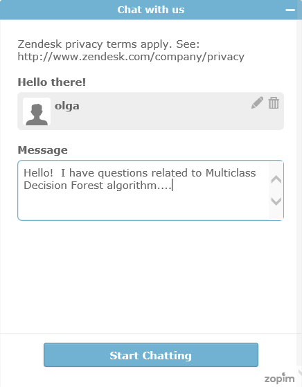

<properties 
    pageTitle="Obtenir de l’aide de Machine apprentissage support en direct | Microsoft Azure" 
    description="Obtenir de l’aide en temps réel d’apprentissage automatique dans le cloud avec la fonctionnalité de support en direct." 
    services="machine-learning" 
    documentationCenter="" 
    authors="garyericson" 
    manager="opapel" 
    editor="cgronlun"/>
<tags 
    ms.service="machine-learning" 
    ms.workload="data-services" 
    ms.tgt_pltfrm="na" 
    ms.devlang="na" 
    ms.topic="article" 
    ms.date="09/29/2016" 
    ms.author="garye"/>
#Obtenir de l’aide de Machine apprentissage support en direct

[Azure Machine d’apprentissage Studio](machine-learning-what-is-ml-studio.md) fournit une interface intuitive pour la création de modèles de formation des machines. Il existe une [Galerie](machine-learning-gallery-how-to-use-contribute-publish.md) et les [Forums](https://social.msdn.microsoft.com/forums/azure/home?forum=MachineLearning) vous guide tout au long cette procédure. 

Mais vous pouvez parfois simplement besoin poser une question rapide afin de débloquer vous. Dans [Studio](machine-learning-what-is-ml-studio.md) , recherchez l’icône conversation dans la barre de navigation supérieure.  Si cette icône apparaît, cela signifie que d’un membre de l’équipe de produit en ligne pour vous aider à en temps réel.

Tapez votre question et obtenir vos réponses !

## Vous ne voyez l’icône conversation Live ?
Membres de l’équipe sont réellement répondant à votre question. Si vous ne voyez pas l’icône conversation en direct, il est car il n’est pas visible en dehors des heures de travail. 

[AZURE.INCLUDE [machine-learning-free-trial](../../includes/machine-learning-free-trial.md)] 
