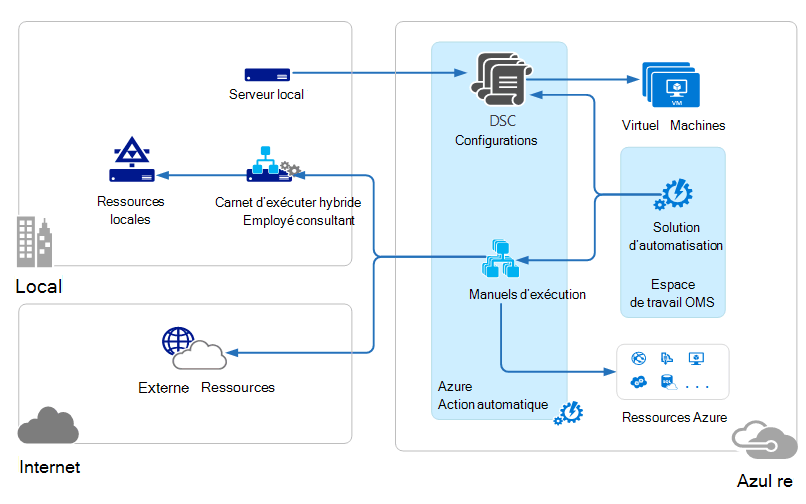

<properties 
   pageTitle="Architecture de gestion des Suite (OMS) opérations | Microsoft Azure"
   description="Suite de gestion des opérations Microsoft (OMS) est sur le nuage informatique solution de gestion qui vous permet de gérer et protéger vos localement et infrastructure en nuage. de Microsoft  Cet article identifie les différents services inclus dans OMS et fournit des liens vers leur description détaillée du contenu."
   services="operations-management-suite"
   documentationCenter=""
   authors="bwren"
   manager="jwhit"
   editor="tysonn" />
<tags 
   ms.service="operations-management-suite"
   ms.devlang="na"
   ms.topic="get-started-article"
   ms.tgt_pltfrm="na"
   ms.workload="infrastructure-services"
   ms.date="10/27/2016"
   ms.author="bwren" />

# Architecture OMS

[Suite de gestion des opérations (OMS)](https://azure.microsoft.com/documentation/services/operations-management-suite/) est un ensemble de services en nuage permettant de gérer votre en local et en nuage environnements.  Cet article décrit les différents en local et les composants de cloud de OMS et leur architecture informatique cloud niveau élevé.  Vous pouvez faire référence à la documentation pour chaque service pour plus de détails.

## Journal Analytique

Toutes les données collectées par [Analytique journal](https://azure.microsoft.com/documentation/services/log-analytics/) est stocké dans le référentiel OMS qui est hébergé dans Azure.  Sources connectées génèrent les données collectées dans le référentiel OMS.  Il existe actuellement trois types de sources connectées pris en charge.

- Un agent est installé sur un ordinateur [Windows](../log-analytics/log-analytics-windows-agents.md) ou [Linux](../log-analytics/log-analytics-linux-agents.md) connecté directement à OMS.
- Un groupe gestion System Center Operations Manager (SCOM) [connecté au journal Analytique](../log-analytics/log-analytics-om-agents.md) .  Agents SCOM continuent à communiquer avec les serveurs de gestion qui transfèrent des événements et les données de performance à journal Analytique.
- Un [compte de stockage Azure](../log-analytics/log-analytics-azure-storage.md) qui collecte des données [Azure Diagnostics](../cloud-services/cloud-services-dotnet-diagnostics.md) à partir d’un rôle de collaborateur, rôle web ou machine virtuelle dans Azure.

Sources de données définissent les données que journal Analytique collecte à partir de sources connectées, y compris les journaux d’événements et compteurs de performances.  Solutions ajoutent des fonctionnalités à OMS et facilement peuvent être ajoutées à votre espace de travail à partir de la [Galerie de Solutions OMS](../log-analytics/log-analytics-add-solutions.md).  Obtenir des solutions peuvent nécessiter une connexion directe au journal Analytique à partir d’agents SCOM tandis que d’autres personnes peuvent nécessiter agent supplémentaire doit être installé.

Journal Analytique a un portail web que vous pouvez utiliser pour gérer les ressources OMS, ajouter et configurer des solutions OMS et afficher et analyser des données dans le référentiel OMS.

## Automatisation Azure

[Procédures opérationnelles Azure Automation](http://azure.microsoft.com/documentation/services/automation) s’exécutent dans le cloud Azure et peuvent accéder aux ressources qui se trouvent dans Azure dans d’autres services de cloud ou accessibles à partir de l’Internet public.  Vous pouvez également désigner ordinateurs locaux dans votre centre de données locales à l’aide de [Hybride Runbook travail](../automation/automation-hybrid-runbook-worker.md) afin que les procédures opérationnelles peuvent accéder aux ressources locales.

[Configurations DSC](../automation/automation-dsc-overview.md) stockées dans Azure Automation peuvent être appliqués directement aux machines virtuelles Azure.  Autres machines physiques et virtuelles peuvent demander des configurations à partir du serveur extraire Azure Automation DSC.

Automatisation Azure dispose d’une solution OMS qui affiche les statistiques et des liens pour lancer le portail Azure pour toutes les opérations.

## Sauvegarde Azure

Données protégées dans [Azure sauvegarde](http://azure.microsoft.com/documentation/services/backup) sont stockées dans un archivage sécurisé sauvegarde situé dans une zone géographique.  Les données répliquées au sein de la même région et, selon le type de l’archivage sécurisé, peuvent également être répliquées vers une autre région redondance supplémentaire.

Sauvegarde Azure comporte trois scénarios fondamentaux.

- Ordinateur Windows avec l’agent de sauvegarde Azure.  Cela vous permet de sauvegarder des fichiers et dossiers à partir de n’importe quel Windows server ou client directement vers votre l’archivage sécurisé sauvegarde Azure.  
- System Center Data Protection Manager (DPM) ou serveur de sauvegarde de Microsoft Azure. Cela vous permet d’exploiter DPM ou Microsoft Azure sauvegarde Server pour sauvegarder les fichiers et dossiers en plus de charges d’applications telles que SQL et SharePoint sur le stockage local et puis répliquer vers votre l’archivage sécurisé sauvegarde Azure.
- Machine virtuelle Azure Extensions.  Cela vous permet de sauvegarder Azure machines virtuelles à votre l’archivage sécurisé sauvegarde Azure.

Sauvegarde Azure dispose d’une solution OMS qui affiche les statistiques et des liens pour lancer le portail Azure pour toutes les opérations.

## Récupération de Site Azure

[Récupération de Site Azure](http://azure.microsoft.com/documentation/services/site-recovery) orchestre réplication, de basculement et de restauration des machines virtuelles et des serveurs physiques. Données de la réplication sont échangées entre hôtes Hyper-V hyperviseurs VMware et des serveurs physiques dans des centres de données principaux et secondaires, ou entre le centre de données et le stockage Azure.  Récupération de site stocke les métadonnées à chambres fortes situés dans une zone géographique Azure. Aucune donnée répliquée est stockée par le service de récupération de Site.

Récupération de Site Azure contient trois scénarios de réplication fondamentaux.

**Réplication de machines virtuelles Hyper-V**
- Si machines virtuelles Hyper-V sont gérées dans nuages VMM, vous pouvez répliquer à un centre de données secondaire ou au stockage Azure.  La réplication vers Azure est via une connexion internet sécurisée.  La réplication vers un centre de données secondaire est sur le réseau local.
- Si machines virtuelles Hyper-V ne sont pas gérés par VMM, vous pouvez répliquer vers stockage Azure uniquement.  La réplication vers Azure est via une connexion internet sécurisée.
 
**Réplication de machines virtuelles VMWare**
- Vous pouvez répliquer machines virtuelles VMware sur un centre de données secondaire en cours d’exécution VMware ou au stockage Azure.  La réplication Azure peut se produire sur un site à VPN ou Azure ExpressRoute ou via une connexion Internet sécurisée. Réplication sur un centre de données secondaire a lieu sur le canal de données InMage Scout.
 
**Réplication de serveurs Windows et Linux physiques** 
- Vous pouvez répliquer serveurs physiques à un centre de données secondaire ou au stockage Azure. La réplication Azure peut se produire sur un site à VPN ou Azure ExpressRoute ou via une connexion Internet sécurisée. Réplication sur un centre de données secondaire a lieu sur le canal de données InMage Scout.  Récupération de Site Azure dispose d’une solution OMS qui affiche des statistiques, mais vous devez utiliser le portail Azure pour toutes les opérations.

## Étapes suivantes

- En savoir plus sur [journal Analytique](http://azure.microsoft.com/documentation/services/log-analytics).
- En savoir plus sur [automatisation Azure](https://azure.microsoft.com/documentation/services/automation).
- Obtenir des informations relatives à la [sauvegarde Azure](http://azure.microsoft.com/documentation/services/backup).
- Obtenir des informations sur la [récupération de Site Azure](http://azure.microsoft.com/documentation/services/site-recovery).
