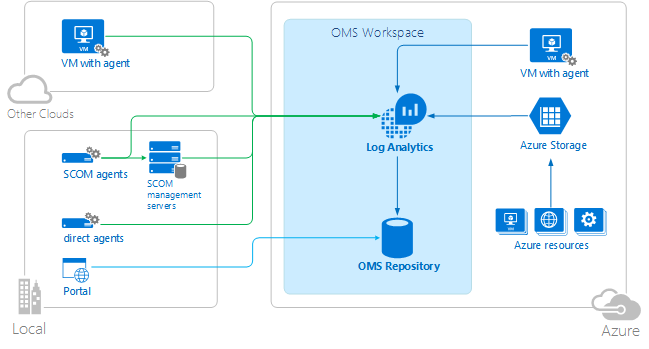

<properties 
   pageTitle="Microsoft analyse comparative | Microsoft Azure"
   description="Suite de gestion des opérations Microsoft (OMS) repose sur cloud de Microsoft solution de gestion informatique qui vous permet de gérer et protéger vos localement et infrastructure en nuage.  Cet article identifie les différents services inclus dans OMS et fournit des liens vers leur description détaillée du contenu."
   services="operations-management-suite"
   documentationCenter=""
   authors="bwren"
   manager="jwhit"
   editor="tysonn" />
<tags 
   ms.service="operations-management-suite"
   ms.devlang="na"
   ms.topic="article"
   ms.tgt_pltfrm="na"
   ms.workload="infrastructure-services"
   ms.date="10/27/2016"
   ms.author="bwren" />

# Comparaison des produits Microsoft surveillance

Cet article fournit une comparaison entre System Center Operations Manager (SCOM) et journal Analytique dans Suite de gestion des opérations (OMS) en termes de leur architecture, la logique de la façon dont ils surveillent les ressources, et comment ils effectuent analyse des données collectées.  Il s’agit afin de vous fournir une description détaillée de leurs différences et points forts relatifs.  

## Architecture de base
### System Center Operations Manager

Tous les composants SCOM sont installés dans votre centre de données.  [Agents sont installés](http://technet.microsoft.com/library/hh551142.aspx) sur des ordinateurs Windows et Linux qui sont gérés par SCOM.  Agents se connectent aux [Serveurs d’administration](https://technet.microsoft.com/library/hh301922.aspx) qui communiquer avec le magasin de base de données et données SCOM.  Agents s’appuient sur l’authentification de domaine pour vous connecter aux serveurs d’administration.  Ceux en dehors d’un domaine approuvé peuvent effectuer l’authentification par certificat ou se connecter à un [Serveur de passerelle](https://technet.microsoft.com/library/hh212823.aspx).

SCOM nécessite deux bases de données SQL, l’un des données opérationnelles, un autre data warehouse pour prendre en charge la création de rapports et analyse de données.  Un [Serveur de rapports](https://technet.microsoft.com/library/hh298611.aspx) s’exécute SQL Reporting Services pour créer un rapport sur les données à partir du magasin de données. 

SCOM pouvez surveiller les ressources de cloud à l’aide de packs d’administration pour les produits tels que [AWS](http://docs.aws.amazon.com/AWSEC2/latest/WindowsGuide/AWSManagementPack.html) [Azure](https://www.microsoft.com/download/details.aspx?id=38414)et [Office 365](https://www.microsoft.com/download/details.aspx?id=43708).  Ces packs d’administration utilisent un ou plusieurs agents locales comme proxys pour les flux de travail en cours d’exécution et ressources de cloud découverte mesurer les performances et la disponibilité.  Agents proxy permettent également de [surveillance des unités de réseau](https://technet.microsoft.com/library/hh212935.aspx) et autres ressources externes.

La Console d’opérations est une application Windows qui se connecte à l’un des serveurs d’administration et permet à l’administrateur afficher et analyser les données collectées et configurer l’environnement SCOM.  Une console basée sur le web peut être hébergée sur n’importe quel serveur IIS et fournit une analyse de données via un navigateur.

### Journal Analytique

La plupart des composants OMS sont dans le cloud Azure afin de pouvoir déployer et gérer à moindre coût et les tâches administratives.  Toutes les données collectées par Analytique journal est stocké dans le référentiel OMS.

Journal Analytique pouvez collecter les données d’une des trois sources :

- Machines physiques et virtuelles exécutant Windows et l' [Agent de surveillance de Microsoft (MMA)](https://technet.microsoft.com/library/mt484108.aspx) ou Linux et l' [Agent de Suite de gestion des opérations pour Linux](https://technet.microsoft.com/library/mt622052.aspx).  Ces ordinateurs peuvent être locale ou machines virtuelles Azure ou d’un autre cloud.
- Un compte de stockage Azure avec des données [Azure Diagnostics](../cloud-services/cloud-services-dotnet-diagnostics.md) collectées par le rôle de collaborateur Azure, rôle web ou machine virtuelle.
- [Connexion à un groupe d’administration SCOM](https://technet.microsoft.com/library/mt484104.aspx).  Dans cette configuration, les agents de communiquent avec les serveurs de gestion de SCOM qui fournissent les données à la base de données SCOM où il est ensuite remis au magasin de données OMS.
Les administrateurs analyser les données collectées et configurez journal Analytique grâce au portail OMS qui est hébergé dans Azure et sont accessibles à partir de n’importe quel navigateur.  Applications mobiles pour accéder à ces données sont disponibles pour les plateformes standards.

### Intégration SCOM et Analytique de journal

Lorsque SCOM est utilisé comme source de données pour le journal Analytique, vous pouvez exploiter les fonctionnalités de ces deux produits dans un environnement d’analyse de déploiement.  Vous pouvez configurer les agents SCOM existants via la Console opérations devant être gérés par OMS, en plus de continuer à exécuter les packs d’administration à partir de SCOM.  
Données à partir d’un groupe d’administration SCOM connecté sont remises au journal Analytique à l’aide d’une des quatre méthodes :

- Événements et les données de performance sont collectées par l’agent et remies dans SCOM.  Serveurs d’administration dans SCOM alors fournissent les données au journal Analytique.
- Certains événements tels que les journaux IIS et les événements de sécurité continuent à être remis directement au journal Analytique à partir de l’agent.
- Obtenir des solutions doit fournir des logiciels supplémentaires à l’agent ou exigent l’installation de logiciel pour collecter des données supplémentaires.  Ces données recevrez généralement directement au journal Analytique.
- Certaines solutions de collecte des données directement à partir de serveurs d’administration SCOM qui ne provient pas de l’agent.  Par exemple, la [solution de gestion des alertes](https://technet.microsoft.com/library/mt484092.aspx) collecte les alertes de SCOM après que qu’ils ont été créés.

## Logique de surveillance
SCOM et journal Analytique fonctionnent avec des données similaires collectées auprès des agents mais différences fondamentales dans leur définissant et mettre en œuvre leur logique pour la collecte de données et comment ils analyser les données collectées.

### Operations Manager
Logique de surveillance pour SCOM est activée dans [packs d’administration](https://technet.microsoft.com/library/hh457558.aspx) qui contiennent une logique de découvrir des composants à surveiller, mesure de l’état de ces composants et pour la collecte des données à analyser.  Données d’analyse peuvent être aussi simple que la collecte d’un compteur événement ou de performance, ou elle peut utiliser une logique complexe implémentée dans un script.  Packs d’administration qui comprennent la surveillance complètes sont disponibles pour une variété de [Microsoft et des applications tierces](http://go.microsoft.com/fwlink/?LinkId=82105) en plus des périphériques matériel et du réseau.  Vous pouvez [créer vos propres packs d’administration](http://aka.ms/mpauthor) pour les applications personnalisées.

Packs d’administration contiennent plusieurs flux de travail qui exécutent certaines fonction distinct surveillance comme un compteur de performances, vérifier l’état d’un service ou exécuter un script.  Chaque flux de travail s’exécute séparément et définit ses propres résultats tels que la base de données il écrit dans et qu’il génère une alerte. 

Vous pouvez ignorer les détails des flux de travail tels que la fréquence de que leur exécution, le seuil considèrent une erreur et la gravité de l’alerte qu’ils génèrent.  Vous pouvez également fournir des fonctionnalités supplémentaires en ajoutant votre propre flux de travail.

Packs d’administration sont installés dans la base de données Operations Manager et automatiquement distribués agents par des serveurs d’administration.  Chaque agent automatiquement télécharger les packs d’administration et charger les flux de travail pertinents pour les applications qu’ils ont installé.  Les données collectées par l’agent sont remises sur le serveur de gestion d’insertion dans le magasin de base de données et données SCOM.  La Console d’opérations vous permet d’afficher et analyser ces données par le biais des affichages personnalisés, les tableaux de bord et les rapports inclus dans le pack d’administration.

La distribution des packs d’administration est illustrée dans le diagramme suivant.

### Journal Analytique
#### Collection des performances et événement
Journal Analytique collecte des compteurs de performance et des événements à partir des systèmes de l’agent à l’aide de sources telles que le journal des événements Windows, les journaux IIS et journal système.  Vous pouvez définir des critères pour lequel les données sont collectées à partir du portail de journal Analytique et ensuite créer des requêtes de journal pour analyser les données collectées.  Un ensemble de critères standards est défini lorsque vous créez votre espace de travail OMS, et vous pouvez définir des données supplémentaires pour certaines applications. 

SCOM propose plusieurs flux de travail détaillées qui définissent généralement des critères spécifiques pour les données et l’action devant être effectuée en réponse, journal Analytique comporte des critères plus générales pour la collecte des données.  Les solutions et les requêtes de journal offrent plus les critères permettant l’analyse et d’agir sur des données spécifiques dans le cloud après sa collecte.

#### Solutions
Solutions fournissent quelque logique supplémentaire pour la collecte de données et analyse.  Vous pouvez sélectionner des solutions à ajouter à votre abonnement OMS à partir de la galerie de solutions.

Les solutions exécutent principalement dans le cloud fournir une analyse des événements et compteurs de performance collectés dans le référentiel OMS.  Ils peuvent également définir à collecter des données supplémentaires qui peuvent être analysées avec des requêtes de journal ou à une interface utilisateur supplémentaires fournies par la solution dans le tableau de bord OMS. 

Par exemple, la [solution de suivi des modifications](https://technet.microsoft.com/library/mt484099.aspx) détecte les modifications de configuration sur les systèmes de l’agent et écrit événements au référentiel OMS qui peut être analysé avec plusieurs vues graphiques qui synthétisent détecté des modifications.  Vous pouvez descendre dans l’affichage résumé dans les requêtes journaux qui affichent les données détaillées collectées par la solution.

Pendant que vous pouvez sélectionner les solutions qui vous ajoutez à votre abonnement, vous n’avez pas la possibilité de créer vos propres solutions actuellement.  Vous pouvez sélectionner les événements et les compteurs de performance pour collecter et créer des affichages personnalisés en fonction de vos propres requêtes journal.

La logique de surveillance pour Analytique journal est indiquée dans le diagramme suivant.

## Contrôle d’état
### Operations Manager
SCOM pouvez modéliser les différents composants d’une application et fournissez un état en temps réel pour chacun.  Cela vous permet non seulement afficher détecté les erreurs et les performances au fil du temps, mais également pour valider l’état d’une application ou système réel et chacun de ses composants à un moment donné.  Car il comprend les périodes de temps une application est disponible, le moteur d’intégrité dans SCOM prend également en charge Service niveau accords qui analyser et créer des rapports sur la disponibilité d’une application au fil du temps.

Par exemple, la vue ci-dessous montre l’état en temps réel des moteurs de base de données SQL contrôlés par SCOM.  L’état de chacun des bases de données pour un des moteurs de base de données s’affiche en bas de la vue.

L’Explorateur d’intégrité pour un des moteurs de base de données est indiqué ci-dessous avec les moniteurs qui permettent de déterminer son état général.  Ces moniteurs sont définis dans SQL management pack et exécuter sur tous les moteurs de base de données SQL découverts par SCOM.

Composants sur plusieurs systèmes peuvent être combinées pour mesurer l’état d’une application distribuée.  Cela peut être particulièrement utile pour des applications métier qui incluent plusieurs composants distribués.  Vous pouvez créer un modèle de l’état de chaque composant des mesures qui seront reportées dans disponibilité pour l’application.

Active Directory est un exemple d’un seul management pack qui propose un modèle pour analyser des composants distribués.  L’exemple de diagramme ci-dessous montre l’état de l’environnement général et la relation entre forêts, des domaines et superflus.  Chacun de ces composants comprend sous-composants et plusieurs moniteurs similaires à l’exemple SQL ci-dessus.

### Journal Analytique
OMS ne pas inclure un moteur commun aux applications de modèle ou mesurer leur santé en temps réel.  Solutions individuelles peuvent évaluer l’intégrité globale des services particuliers basés sur les données recueillies, et ils peuvent installer logique personnalisée sur l’agent pour effectuer une analyse en temps réel.  Comme solutions s’exécutent dans le nuage avec accès au référentiel OMS, elles peuvent souvent fournir une analyse plus approfondie qu’est généralement effectué par des packs d’administration. 

Par exemple, les [solutions d’évaluation AD et SQL évaluation](https://technet.microsoft.com/library/mt484102.aspx) analyser les données collectées et fournir une évaluation pour différents aspects de l’environnement.  Il inclut les recommandations pour les améliorations qui peuvent être effectuées pour améliorer la disponibilité et les performances de l’environnement.

## Analyse des données
SCOM et Analytique journal fournissent différentes fonctionnalités pour analyser les données collectées.  SCOM comporte les affichages et les tableaux de bord dans la Console d’analyse de données récentes dans divers formats et rapports pour présenter des données à partir du magasin de données sous forme de tableau.  Journal Analytique fournit une interface et le langage de requête journal complet d’analyse des données dans le référentiel OMS.  Lorsque SCOM est utilisé comme source de données pour le journal Analytique, le référentiel inclut les données collectées par SCOM afin que les outils de journal Analytique peuvent être utilisés pour analyser les données des deux systèmes.

### Operations Manager

#### Affichage
Les vues dans la Console permettent d’afficher différents types de données collectées par SCOM dans différents formats, généralement sous forme de tableau pour les événements, des alertes et des données sur l’état et de graphiques pour les données de performance de ligne.  Les vues effectuent consolidation des données ou une analyse minimale mais vous autorisent à filtrer selon des critères particuliers. 

Packs d’administration fournira généralement plusieurs vues prenant en charge l’application ou le système il surveille.  Cela peut inclure des affichages d’état pour les différents objets qui le pack d’administration découvre, affichages des alertes pour les problèmes détectés et les affichages de performances des compteurs.

Les vues sont particulièrement adaptées pour l’analyse de l’état actuel de l’environnement, y compris les alertes actives et l’état d’intégrité de systèmes contrôlés et d’objets.  Vous pouvez d’exploration détaillée événement ou une alerte de prise en charge afin de déterminer son cause des données de performance. De même, vous pouvez afficher les performances et le fonctionnement des différents composants d’une application pour évaluer son état actuel.

#### Tableaux de bord
Tableaux de bord de la Console d’opérations travailler principalement avec les mêmes données comme affichages mais davantage de possibilités et peuvent inclure des visualisations plus riches.  Un ensemble de tableaux de bord standard sont disponibles que vous pouvez facilement personnaliser selon vos besoins.  Vous pouvez également utiliser un widget PowerShell qui peut afficher les données renvoyées par une requête PowerShell.

Les développeurs ont la possibilité d’ajouter des composants personnalisés des tableaux de bord qu'ils incluent dans leurs packs d’administration.  Ces peuvent être hautement spécialisées à une application spécifique tel que le tableau de bord dans SQL management pack illustré ci-dessous.  Ce tableau de bord permet également en tant que modèle pour les versions personnalisées.

#### Rapports
Rapports dans SCOM analysent des données à partir du magasin de données sous forme de tableau.  Ils peuvent être imprimés et planifiées pour la remise automatisée dans différents formats de fichier PDF, CSV et Word inclus.  Rapports d’utilisent des données à partir du magasin de données afin qu’elles sont particulièrement adaptées pour une analyse des tendances à long terme.

Packs d’administration fournira généralement des rapports personnalisés pour une application spécifique.  Vous pouvez également sélectionner à partir d’une bibliothèque de rapports génériques que vous pouvez personnaliser pour vos propres applications ou pour effectuer une analyse ad hoc.

Voici un exemple de rapport de performance affichant les données collectées par Active Directory Management Pack.

### Journal Analytique
Journal Analytique possède un [langage de requête](https://technet.microsoft.com/library/mt484120.aspx) que vous pouvez utiliser pour effectuer une analyse les données provenant de plusieurs applications sans avoir besoin de créer un affichage personnalisé ou un état.  OMS étant implémentée dans le cloud, performances des requêtes et analyse des données ne sont pas soumis aux limitations matériel et pouvez analyser rapidement des requêtes, y compris des millions d’enregistrements. 

Requêtes de journal Analytique sont également fondement d’autres fonctionnalités.  Vous pouvez enregistrer une requête, son exporter vers Excel ou les exécuter à intervalles réguliers automatiquement et générer une alerte si ses résultats correspondent aux critères particuliers.  

Voici un exemple d’une requête Analytique journal.  Dans cet exemple, tous les événements avec « démarré » dans le nom sont retournés et regroupés par événement identifiant.  L’utilisateur fournit simplement la requête et Analytique journal génère dynamiquement l’interface utilisateur pour effectuer l’analyse.  Sélection d’un élément dans la liste renvoie les données d’événement détaillées.

Outre donnant analyse ad hoc, requêtes dans le journal Analytique peuvent être enregistrées pour une utilisation ultérieure et également ajoutés à votre [tableau de bord OMS](http://technet.microsoft.com/library/mt484090.aspx) comme indiqué dans l’exemple suivant.

## Étapes suivantes

- Déployer [System Center Operations Manager (SCOM)](https://technet.microsoft.com/library/hh205987.aspx).
- Inscrivez-vous à [Journal Analytique](https://azure.microsoft.com/documentation/services/log-analytics).  
