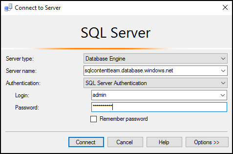

<properties
    pageTitle="Se connecter à la base de données SQL avec une requête c# | Microsoft Azure"
    description="Écrire un programme dans c# pour interroger et se connecter à la base de données SQL. Informations sur les adresses IP, chaînes de connexion, connexion sécurisée et Visual Studio gratuit."
    services="sql-database"
    keywords="c# requête de base de données, requête c#, se connecter à la base de données SQL C#"
    documentationCenter=""
    authors="stevestein"
    manager="jhubbard"
    editor=""/>

<tags
    ms.service="sql-database"
    ms.workload="data-management"
    ms.tgt_pltfrm="na"
    ms.devlang="dotnet"
    ms.topic="get-started-article"
    ms.date="08/17/2016"
    ms.author="stevestein"/>

# Se connecter à une base de données SQL avec Visual Studio

> [AZURE.SELECTOR]
- [Visual Studio](sql-database-connect-query.md)
- [SSMS](sql-database-connect-query-ssms.md)
- [Excel](sql-database-connect-excel.md)

Découvrez comment vous connecter à une base de données SQL Azure dans Visual Studio. 

## Conditions préalables

Pour vous connecter à une base de données SQL à l’aide de Visual Studio, vous devez les éléments suivants : 

- Une base de données SQL pour vous connecter à. Cet article utilise la base de données exemple **AdventureWorks** . Pour obtenir la base de données exemple AdventureWorks, voir [créer la base de données de démonstration](sql-database-get-started.md).

- Visual Studio 2013 mise à jour 4 (ou version ultérieure). Microsoft fournit maintenant Visual Studio communautaire *gratuit*.
 - [Communauté de Visual Studio, télécharger](http://www.visualstudio.com/products/visual-studio-community-vs)
 - [Plus d’options pour libérer Visual Studio](http://www.visualstudio.com/products/free-developer-offers-vs.aspx)

## Ouvrir Visual Studio à partir du portail Azure

1. Connectez-vous au [portail Azure](https://portal.azure.com/).

2. Cliquez sur **Autres Services** > **bases de données SQL**
3. Ouvrez la carte de base de données **AdventureWorks** en recherche en cliquant sur la base de données *AdventureWorks* .

6. Cliquez sur le bouton **Outils** dans la partie supérieure de la cuillère de base de données :

    

7. Cliquez sur **Ouvrir dans Visual Studio** (si vous avez besoin de Visual Studio, cliquez sur le lien de téléchargement) :

    

8. Visual Studio s’ouvre avec la fenêtre de **connexion au serveur** déjà configurée pour se connecter au serveur et base de données que vous avez sélectionné dans le portail.  (Cliquez sur **Options** pour vérifier que la connexion est définie sur la base de données correcte.) Tapez votre mot de passe administrateur serveur et cliquez sur **se connecter**.

    

8. Si vous n’avez pas une règle de pare-feu à définir pour l’adresse IP de votre ordinateur, vous obtenez un message *ne peut pas se connecter* ici. Pour créer une règle de pare-feu, voir [configurer une règle de pare-feu au niveau du serveur de base de données SQL Azure](sql-database-configure-firewall-settings.md).

9. Une fois connecté avec succès, la fenêtre **Explorateur d’objets SQL Server** s’ouvre avec une connexion à votre base de données.

    

## Exécuter un exemple de requête

À présent que nous avons connectés à la base de données, les étapes suivantes montrent comment exécuter une requête simple :

2. Avec le bouton droit de la base de données, puis sélectionnez **Nouvelle requête**.

    

3. Dans la fenêtre de requête, copiez et collez le code suivant.

        SELECT
        CustomerId
        ,Title
        ,FirstName
        ,LastName
        ,CompanyName
        FROM SalesLT.Customer;

4. Cliquez sur le bouton **exécuter** pour exécuter la requête :

    

## Étapes suivantes

- Ouverture de bases de données SQL dans Visual Studio utilise SQL Server Data Tools. Pour plus d’informations, voir [SQL Server Data Tools](https://msdn.microsoft.com/library/hh272686.aspx).
- Pour vous connecter à une base de données SQL à l’aide de code, voir [se connecter à la base de données SQL à l’aide de .NET (c#)](sql-database-develop-dotnet-simple.md).

