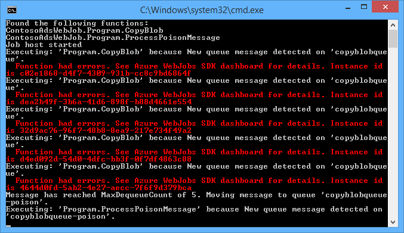

<properties
    pageTitle="Prise en main de stockage file d’attente et Visual Studio connecté services (WebJob projets) | Microsoft Azure"
    description="Comment faire pour commencer à utiliser stockage Azure file d’attente dans un projet WebJob après vous être connecté à un compte de stockage à l’aide de Visual Studio services connectés."
    services="storage"
    documentationCenter=""
    authors="TomArcher"
    manager="douge"
    editor=""/>

<tags
    ms.service="storage"
    ms.workload="web"
    ms.tgt_pltfrm="vs-getting-started"
    ms.devlang="na"
    ms.topic="article"
    ms.date="07/18/2016"
    ms.author="tarcher"/>

# Prise en main de stockage Azure file d’attente et Visual Studio connecté services (WebJob projets)

[AZURE.INCLUDE [storage-try-azure-tools-queues](../../includes/storage-try-azure-tools-queues.md)]

## Vue d’ensemble

Cet article décrit comment commencer à utiliser stockage Azure file d’attente dans un projet Visual Studio Azure WebJob une fois que vous avez créé ou référencé un compte de stockage Azure à l’aide de la boîte de dialogue Visual Studio **Ajouter les Services connectés** . Lorsque vous ajoutez un compte de stockage à un projet WebJob à l’aide de la boîte de dialogue Visual Studio **Ajouter les Services connectés** , les packages NuGet de stockage Azure appropriés sont installés, les références .NET appropriées sont ajoutés au projet et chaînes de connexion pour le compte de stockage sont mis à jour dans le fichier App.config.  

Cet article fournit des exemples de code c# qui montrent comment utiliser la version Azure WebJobs SDK 1.x avec le service de stockage Azure file d’attente.

Stockage de file d’attente Azure est un service pour stocker un grand nombre de messages qui sont accessibles à partir de n’importe où dans le monde via des appels authentifiés à l’aide de HTTP ou HTTPS. Un message file d’attente unique peut contenir jusqu'à 64 Ko et une file d’attente peut contenir des millions de messages, jusqu'à la limite de la capacité totale d’un compte de stockage. Pour plus d’informations, voir [prise en main Azure Queue Storage à l’aide de .NET](storage-dotnet-how-to-use-queues.md) . Pour plus d’informations sur ASP.NET, consultez [ASP.NET](http://www.asp.net).

## Comment faire pour déclencher la lecture d’une fonction lors de la réception d’un message file d’attente

Pour écrire une fonction qui le WebJobs SDK appelle lors de la réception d’un message file d’attente, utilisez l’attribut **QueueTrigger** . Le constructeur attribut prend un paramètre de chaîne qui spécifie le nom de la file d’attente d’interrogation. Pour savoir comment définir le nom de la file d’attente dynamiquement, Découvrez [comment définir les Options de Configuration](#how-to-set-configuration-options).

### Messages de chaîne file d’attente

Dans l’exemple suivant, la file d’attente contient un message de type chaîne, et donc **QueueTrigger** est appliqué à un paramètre de chaîne nommé **logMessage** qui contient le contenu du message file d’attente. La fonction [écrit un message de journal au tableau de bord](#how-to-write-logs).

        public static void ProcessQueueMessage([QueueTrigger("logqueue")] string logMessage, TextWriter logger)
        {
            logger.WriteLine(logMessage);
        }

Outre la **chaîne**, le paramètre peut être un tableau d’octets, un objet **CloudQueueMessage** ou un POCO que vous définissez.

### POCO [(simple objet CLR ancien](http://en.wikipedia.org/wiki/Plain_Old_CLR_Object)) messages en file d’attente

Dans l’exemple suivant, le message file d’attente contient JSON pour un objet **BlobInformation** qui inclut une propriété **BlobName** . Le Kit de développement désérialise automatiquement l’objet.

        public static void WriteLogPOCO([QueueTrigger("logqueue")] BlobInformation blobInfo, TextWriter logger)
        {
            logger.WriteLine("Queue message refers to blob: " + blobInfo.BlobName);
        }

Le Kit de développement utilise le [package Newtonsoft.Json NuGet](http://www.nuget.org/packages/Newtonsoft.Json) pour sérialiser et désérialiser les messages. Si vous créez des messages file d’attente dans un programme qui n’utilise pas le WebJobs SDK, vous pouvez écrire du code à l’exemple suivant pour créer un message de file d’attente POCO le Kit de développement peut analyser.

        BlobInformation blobInfo = new BlobInformation() { BlobName = "log.txt" };
        var queueMessage = new CloudQueueMessage(JsonConvert.SerializeObject(blobInfo));
        logQueue.AddMessage(queueMessage);

### Fonctions asynchrones

Le suivant asynchrone fonction [écrit un journal au tableau de bord](#how-to-write-logs).

        public async static Task ProcessQueueMessageAsync([QueueTrigger("logqueue")] string logMessage, TextWriter logger)
        {
            await logger.WriteLineAsync(logMessage);
        }

Fonctions asynchrones peuvent prendre un [jeton d’annulation](http://www.asp.net/mvc/overview/performance/using-asynchronous-methods-in-aspnet-mvc-4#CancelToken), comme le montre l’exemple suivant qui copie un blob. (Pour une explication de l’espace réservé **queueTrigger** , voir la section [objets BLOB](#how-to-read-and-write-blobs-and-tables-while-processing-a-queue-message) ).

        public async static Task ProcessQueueMessageAsyncCancellationToken(
            [QueueTrigger("blobcopyqueue")] string blobName,
            [Blob("textblobs/{queueTrigger}",FileAccess.Read)] Stream blobInput,
            [Blob("textblobs/{queueTrigger}-new",FileAccess.Write)] Stream blobOutput,
            CancellationToken token)
        {
            await blobInput.CopyToAsync(blobOutput, 4096, token);
        }

## Types d’avec que l’attribut QueueTrigger fonctionne

Vous pouvez utiliser **QueueTrigger** avec les types suivants :

* **chaîne**
* Un type de POCO sérialisé au format JSON
* **Byte]**
* **CloudQueueMessage**

## Algorithme de sondage

Le Kit de développement met en œuvre un exponentielle recul aléatoires pour réduire l’effet d’idle-file d’attente d’interrogation sur les coûts de stockage transaction.  Lorsqu’un message est détecté, le Kit de développement attend deux secondes, puis vérifie pour un autre message ; Lorsqu’aucun message n’est trouvé il attend environ quatre secondes avant de réessayer. Après avoir d’autres tentatives échecs pour obtenir un message file d’attente, le délai d’attente continue d’augmenter jusqu'à ce qu’elle atteigne la durée maximale par défaut, une minute. [Le délai d’attente maximal peut être configuré](#how-to-set-configuration-options).

## Plusieurs instances

Si votre application web s’exécute sur plusieurs instances, une WebJobs continue s’exécute sur chaque ordinateur et chaque ordinateur s’attendre déclencheurs et essayez d’exécuter des fonctions. Dans certains scénarios, que cela peut affecter certaines fonctions traite les mêmes données à deux reprises, donc fonctions doivent être idempotents (écrites, afin que les appelant à plusieurs reprises les mêmes données d’entrée ne produisent des résultats en double).  

## Exécution en parallèle

Si vous avez plusieurs fonctions à l’écoute sur différentes files d’attente, le Kit de développement appelle les en parallèle lorsque les messages sont reçus simultanément.

Vaut lorsque plusieurs messages sont reçus pour une seule file d’attente. Par défaut, le Kit de développement Obtient un lot de 16 messages file d’attente à un moment et exécute la fonction qui les traite en parallèle. [La taille du lot est configurable](#how-to-set-configuration-options). Lorsque le nombre en cours de traitement obtient vers le bas à la moitié de la taille du lot, le Kit de développement Obtient un autre lot et démarre le traitement des messages. Le nombre maximal de messages simultanées traitées par la fonction est donc la taille du lot une fois et demie. Cette limite s’applique séparément pour chaque fonction qui possède un attribut **QueueTrigger** . Si vous ne voulez pas l’exécution en parallèle pour les messages reçus sur une file d’attente, définissez la taille du lot 1.

## Obtenir la file d’attente ou les métadonnées de message file d’attente

Vous pouvez obtenir des propriétés de message suivantes en ajoutant des paramètres pour la signature de méthode :

* **DateTimeOffset** expirationTime
* **DateTimeOffset** insertionTime
* **DateTimeOffset** nextVisibleTime
* **chaîne** queueTrigger (contient le texte du message)
* id de **chaîne**
* **chaîne** popReceipt
* **int** dequeueCount

Si vous souhaitez travailler directement avec l’API de stockage Azure, vous pouvez également ajouter un paramètre **CloudStorageAccount** .

L’exemple suivant écrit toutes ces métadonnées à un enregistrement d’informations. Dans l’exemple, logMessage et queueTrigger contiennent le contenu du message file d’attente.

        public static void WriteLog([QueueTrigger("logqueue")] string logMessage,
            DateTimeOffset expirationTime,
            DateTimeOffset insertionTime,
            DateTimeOffset nextVisibleTime,
            string id,
            string popReceipt,
            int dequeueCount,
            string queueTrigger,
            CloudStorageAccount cloudStorageAccount,
            TextWriter logger)
        {
            logger.WriteLine(
                "logMessage={0}\n" +
            "expirationTime={1}\ninsertionTime={2}\n" +
                "nextVisibleTime={3}\n" +
                "id={4}\npopReceipt={5}\ndequeueCount={6}\n" +
                "queue endpoint={7} queueTrigger={8}",
                logMessage, expirationTime,
                insertionTime,
                nextVisibleTime, id,
                popReceipt, dequeueCount,
                cloudStorageAccount.QueueEndpoint,
                queueTrigger);
        }

Voici un exemple de journal rédigé par l’exemple de code :

        logMessage=Hello world!
        expirationTime=10/14/2014 10:31:04 PM +00:00
        insertionTime=10/7/2014 10:31:04 PM +00:00
        nextVisibleTime=10/7/2014 10:41:23 PM +00:00
        id=262e49cd-26d3-4303-ae88-33baf8796d91
        popReceipt=AgAAAAMAAAAAAAAAfc9H0n/izwE=
        dequeueCount=1
        queue endpoint=https://contosoads.queue.core.windows.net/
        queueTrigger=Hello world!

## Arrêt

Une fonction qui s’exécute dans une WebJob continue peut accepter un paramètre **CancellationToken** qui permet au système d’exploitation informer la fonction lorsque la WebJob est sur le point d’être arrêté. Vous pouvez utiliser cette notification pour vous assurer que la fonction n’arrêt inattendu d’une manière qui laisse les données dans un état n’est pas cohérente.

L’exemple suivant montre comment vérifier les frais de résiliation WebJob imminents dans une fonction.

    public static void GracefulShutdownDemo(
                [QueueTrigger("inputqueue")] string inputText,
                TextWriter logger,
                CancellationToken token)
    {
        for (int i = 0; i < 100; i++)
        {
            if (token.IsCancellationRequested)
            {
                logger.WriteLine("Function was cancelled at iteration {0}", i);
                break;
            }
            Thread.Sleep(1000);
            logger.WriteLine("Normal processing for queue message={0}", inputText);
        }
    }

**Remarque :** Le tableau de bord ne peut pas afficher correctement l’état et la sortie de fonctions qui ont été arrêtés.

Pour plus d’informations, voir [Arrêt WebJobs](http://blog.amitapple.com/post/2014/05/webjobs-graceful-shutdown/#.VCt1GXl0wpR).   

## Comment créer un message file d’attente pendant le traitement d’un message file d’attente

Pour écrire une fonction qui crée un nouveau message file d’attente, utilisez l’attribut **file d’attente** . Comme **QueueTrigger**, vous passez le nom de la file d’attente sous forme de chaîne, ou vous pouvez [définir le nom de la file d’attente dynamiquement](#how-to-set-configuration-options).

### Messages de chaîne file d’attente

L’exemple de code non asynchrone suivant crée un nouveau message file d’attente dans la file d’attente nommée « outputqueue » avec le même contenu que le message file d’attente reçu dans la file d’attente nommée « inputqueue ». (Pour une opération asynchrone fonctions utilisent **IAsyncCollector<T> ** comme indiqué plus loin dans cette section.)

        public static void CreateQueueMessage(
            [QueueTrigger("inputqueue")] string queueMessage,
            [Queue("outputqueue")] out string outputQueueMessage )
        {
            outputQueueMessage = queueMessage;
        }

### POCO [(simple objet CLR ancien](http://en.wikipedia.org/wiki/Plain_Old_CLR_Object)) messages en file d’attente

Pour créer un message file d’attente qui contient un POCO plutôt qu’une chaîne, passez le type POCO comme un paramètre de sortie au constructeur d’attribut **file d’attente** .

        public static void CreateQueueMessage(
            [QueueTrigger("inputqueue")] BlobInformation blobInfoInput,
            [Queue("outputqueue")] out BlobInformation blobInfoOutput )
        {
            blobInfoOutput = blobInfoInput;
        }

Le Kit de développement sérialise automatiquement l’objet en JSON. Un message file d’attente est toujours créé, même si l’objet est null.

### Créer plusieurs messages ou dans des fonctions asynchrones

Pour créer plusieurs messages, vérifiez le type de paramètre pour la file d’attente de sortie **ICollector<T> ** ou **IAsyncCollector<T>**, comme illustré dans l’exemple suivant.

        public static void CreateQueueMessages(
            [QueueTrigger("inputqueue")] string queueMessage,
            [Queue("outputqueue")] ICollector<string> outputQueueMessage,
            TextWriter logger)
        {
            logger.WriteLine("Creating 2 messages in outputqueue");
            outputQueueMessage.Add(queueMessage + "1");
            outputQueueMessage.Add(queueMessage + "2");
        }

Chaque message file d’attente est créée immédiatement lorsque la méthode **Add** est appelée.

### Types de fonctionnant avec l’attribut file d’attente

Vous pouvez utiliser l’attribut **file d’attente** sur les types de paramètre suivants :

* **chaîne** (crée message file d’attente si la valeur du paramètre n’est pas null expiration de la fonction)
* **absence byte]** (fonctionne de façon **chaîne**)
* **absence CloudQueueMessage** (fonctionne de façon **chaîne**)
* **absence POCO** (un type sérialisable, crée un message avec un objet null si le paramètre est null à la fin de la fonction)
* **ICollector**
* **IAsyncCollector**
* **CloudQueue** (pour la création des messages manuellement à l’aide de l’API de stockage Azure directement)

### Utiliser les attributs WebJobs SDK dans le corps d’une fonction

Si vous devez effectuer certaines tâches dans votre fonction avant d’utiliser un attribut WebJobs SDK comme **file d’attente**, **Blob**ou **Table**, vous pouvez utiliser l’interface **IBinder** .

L’exemple suivant prend un message file d’attente d’entrée et crée un nouveau message avec le même contenu dans une file d’attente de sortie. Le nom de file d’attente de sortie est défini par le code dans le corps de la fonction.

        public static void CreateQueueMessage(
            [QueueTrigger("inputqueue")] string queueMessage,
            IBinder binder)
        {
            string outputQueueName = "outputqueue" + DateTime.Now.Month.ToString();
            QueueAttribute queueAttribute = new QueueAttribute(outputQueueName);
            CloudQueue outputQueue = binder.Bind<CloudQueue>(queueAttribute);
            outputQueue.AddMessage(new CloudQueueMessage(queueMessage));
        }

L’interface **IBinder** peut également être utilisé avec les attributs de **Table** et des **objets Blob** .

## Comment lire et écrire des BLOB et les tables pendant le traitement d’un message file d’attente

Les attributs **Blob** et **Table** permettent de lire et écrire des tables et des objets BLOB. Les exemples de cette section s’applique aux objets BLOB. Pour les exemples de code qui montrent comment déclencher processus lorsque des objets BLOB sont créés ou mis à jour, voir [l’utilisation de stockage d’objets blob Azure avec le Kit de développement WebJobs](../app-service-web/websites-dotnet-webjobs-sdk-storage-blobs-how-to.md)et pour des exemples de code que lire et écrire des tables, voir [comment utiliser le stockage de table Azure avec le Kit de développement WebJobs](../app-service-web/websites-dotnet-webjobs-sdk-storage-tables-how-to.md).

### Messages de file d’attente chaîne déclenchement blob opérations

Pour un message file d’attente qui contient une chaîne, **queueTrigger** est un espace réservé que vous pouvez utiliser dans le paramètre **blobPath** de l’attribut **Blob** qui contient le texte du message.

L’exemple suivant utilise des objets de **flux de données** pour lire et écrire des objets BLOB. Le message file d’attente est le nom d’un objet blob situé dans le conteneur textblobs. Une copie du blob avec «-nouveau « ajouté au nom est créé dans le même conteneur.

        public static void ProcessQueueMessage(
            [QueueTrigger("blobcopyqueue")] string blobName,
            [Blob("textblobs/{queueTrigger}",FileAccess.Read)] Stream blobInput,
            [Blob("textblobs/{queueTrigger}-new",FileAccess.Write)] Stream blobOutput)
        {
            blobInput.CopyTo(blobOutput, 4096);
        }

Constructeur de l’attribut **Blob** prend un paramètre **blobPath** qui spécifie le conteneur et le nom de blob. Pour plus d’informations sur cet espace réservé, Découvrez [comment utiliser le stockage blob Azure avec le Kit de développement WebJobs](../app-service-web/websites-dotnet-webjobs-sdk-storage-blobs-how-to.md).

Lorsque l’attribut décoration un objet de **flux** , un autre paramètre constructeur spécifie le mode **FileAccess** en lecture, écriture ou en lecture/écriture.

L’exemple suivant utilise un objet **CloudBlockBlob** pour supprimer un objet blob. Le message file d’attente est le nom de l’objet blob.

        public static void DeleteBlob(
            [QueueTrigger("deleteblobqueue")] string blobName,
            [Blob("textblobs/{queueTrigger}")] CloudBlockBlob blobToDelete)
        {
            blobToDelete.Delete();
        }

### POCO [(simple objet CLR ancien](http://en.wikipedia.org/wiki/Plain_Old_CLR_Object)) messages en file d’attente

Pour un POCO stocké en tant que JSON dans le message file d’attente, vous pouvez utiliser des espaces réservés que propriétés nom de l’objet dans le paramètre de **blobPath** de l’attribut de la **file d’attente** . Vous pouvez également utiliser les noms de propriété de métadonnées files d’attente comme espaces réservés. Voir [obtenir file d’attente ou les métadonnées de message file d’attente](#get-queue-or-queue-message-metadata).

L’exemple suivant copie un blob dans un nouveau blob avec une extension différente. Le message file d’attente est un objet **BlobInformation** qui inclut des propriétés **BlobName** et **BlobNameWithoutExtension** . Les noms de propriété sont utilisés comme espaces réservés dans le chemin d’accès blob pour les attributs **d’objets Blob** .

        public static void CopyBlobPOCO(
            [QueueTrigger("copyblobqueue")] BlobInformation blobInfo,
            [Blob("textblobs/{BlobName}", FileAccess.Read)] Stream blobInput,
            [Blob("textblobs/{BlobNameWithoutExtension}.txt", FileAccess.Write)] Stream blobOutput)
        {
            blobInput.CopyTo(blobOutput, 4096);
        }

Le Kit de développement utilise le [package Newtonsoft.Json NuGet](http://www.nuget.org/packages/Newtonsoft.Json) pour sérialiser et désérialiser les messages. Si vous créez des messages file d’attente dans un programme qui n’utilise pas le WebJobs SDK, vous pouvez écrire du code à l’exemple suivant pour créer un message de file d’attente POCO le Kit de développement peut analyser.

        BlobInformation blobInfo = new BlobInformation() { BlobName = "boot.log", BlobNameWithoutExtension = "boot" };
        var queueMessage = new CloudQueueMessage(JsonConvert.SerializeObject(blobInfo));
        logQueue.AddMessage(queueMessage);

Si vous devez effectuer certaines tâches dans votre fonction avant de le lier un blob à un objet, vous pouvez utiliser l’attribut dans le corps de la fonction, comme indiqué dans les [attributs d’utiliser le Kit de développement WebJobs dans le corps d’une fonction](#use-webjobs-sdk-attributes-in-the-body-of-a-function).

###Vous pouvez utiliser l’attribut Blob avec les types

L’attribut **Blob** peut être utilisé avec les types suivants :

* **Flux de données** (lecture ou écriture, spécifié en utilisant le paramètre de constructeur FileAccess)
* **TextReader**
* **TextWriter**
* **chaîne** (lecture)
* **chaîne** (écrire ; crée un blob uniquement si le paramètre de chaîne n’est pas null lorsque la fonction retourne une valeur)
* POCO (lecture)
* absence POCO (écrire ; toujours crée un blob, crée en tant qu’objet null si POCO paramètre est null lorsque la fonction retourne une valeur)
* **CloudBlobStream** (écriture)
* **ICloudBlob** (lecture ou écriture)
* **CloudBlockBlob** (lecture ou écriture)
* **CloudPageBlob** (lecture ou écriture)

##Comment gérer les messages poison

Messages dont le contenu permet à une fonction échec sont appelés *messages poison*. En cas d’échec de la fonction, le message file d’attente n’est pas supprimé et finalement est sélectionné, à l’origine du cycle à répéter. Le Kit de développement peut interrompre automatiquement le cycle d’après un nombre limité d’itérations, ou vous pouvez le faire manuellement.

### Gestion des messages poison automatique

Le Kit de développement appelle une fonction jusqu'à 5 fois pour traiter un message file d’attente. Si la cinquième tentative échoue, le message est déplacé vers une file d’attente poison. Vous pouvez voir comment faire pour configurer le nombre maximal de nouvelles tentatives dans [la définition des options de configuration](#how-to-set-configuration-options).

La file d’attente poison nommé *{originalqueuename}*-poison. Vous pouvez écrire une fonction pour traiter les messages à partir de la file d’attente poison en vous connectant les ou envoyer une notification que l’attention manuelle est nécessaire.

Dans l’exemple suivant le **CopyBlob** fonction échoue lorsqu’un message file d’attente contient le nom d’un objet blob qui n’existe pas. Dans ce cas, le message est déplacé vers la file d’attente copyblobqueue poison à partir de la file d’attente copyblobqueue. La **ProcessPoisonMessage** puis consigne le message poison.

        public static void CopyBlob(
            [QueueTrigger("copyblobqueue")] string blobName,
            [Blob("textblobs/{queueTrigger}", FileAccess.Read)] Stream blobInput,
            [Blob("textblobs/{queueTrigger}-new", FileAccess.Write)] Stream blobOutput)
        {
            blobInput.CopyTo(blobOutput, 4096);
        }

        public static void ProcessPoisonMessage(
            [QueueTrigger("copyblobqueue-poison")] string blobName, TextWriter logger)
        {
            logger.WriteLine("Failed to copy blob, name=" + blobName);
        }

L’illustration suivante montre la sortie de la console à partir de ces fonctions lorsqu’un message poison est traité.

### Gestion des messages poison manuel

Vous pouvez obtenir le nombre de fois qu'un message a été sélectionné pour le traitement en ajoutant un paramètre **int** nommé **dequeueCount** à votre fonction. Vous pouvez vérifier le nombre de dequeue dans le code de la fonction et effectuer votre propre poison gestion des messages lorsque le nombre dépasse un seuil, comme le montre l’exemple suivant.

        public static void CopyBlob(
            [QueueTrigger("copyblobqueue")] string blobName, int dequeueCount,
            [Blob("textblobs/{queueTrigger}", FileAccess.Read)] Stream blobInput,
            [Blob("textblobs/{queueTrigger}-new", FileAccess.Write)] Stream blobOutput,
            TextWriter logger)
        {
            if (dequeueCount > 3)
            {
                logger.WriteLine("Failed to copy blob, name=" + blobName);
            }
            else
            {
            blobInput.CopyTo(blobOutput, 4096);
            }
        }

## Comment définir les options de configuration

Vous pouvez utiliser le type **JobHostConfiguration** pour définir les options de configuration suivantes :

* Définir les chaînes de connexion SDK dans le code.
* Configurer **QueueTrigger** paramètres tels que le nombre maximal retirer le nombre.
* Obtenir les noms de file d’attente de configuration.

###Définir des chaînes de connexion SDK dans le code

Définissant les chaînes de connexion SDK dans le code vous permet d’utiliser vos propres noms de chaîne de connexion dans les fichiers de configuration ou de variables d’environnement, comme le montre l’exemple suivant.

        static void Main(string[] args)
        {
            var _storageConn = ConfigurationManager
                .ConnectionStrings["MyStorageConnection"].ConnectionString;

            var _dashboardConn = ConfigurationManager
                .ConnectionStrings["MyDashboardConnection"].ConnectionString;

            var _serviceBusConn = ConfigurationManager
                .ConnectionStrings["MyServiceBusConnection"].ConnectionString;

            JobHostConfiguration config = new JobHostConfiguration();
            config.StorageConnectionString = _storageConn;
            config.DashboardConnectionString = _dashboardConn;
            config.ServiceBusConnectionString = _serviceBusConn;
            JobHost host = new JobHost(config);
            host.RunAndBlock();
        }

### Configurer les paramètres de QueueTrigger

Vous pouvez configurer les paramètres suivants s’appliquent au traitement file d’attente message :

- Le nombre maximal de file d’attente les messages qui sont pris en charge simultanément à exécuter en parallèle (valeur par défaut est 16).
- Le nombre maximal de nouvelles tentatives avant l’envoi d’un message file d’attente à une file d’attente poison (valeur par défaut est 5).
- La valeur maximale délai avant d’interroger à nouveau lorsqu’une file d’attente est vide (valeur par défaut est une minute).

L’exemple suivant montre comment configurer ces paramètres :

        static void Main(string[] args)
        {
            JobHostConfiguration config = new JobHostConfiguration();
            config.Queues.BatchSize = 8;
            config.Queues.MaxDequeueCount = 4;
            config.Queues.MaxPollingInterval = TimeSpan.FromSeconds(15);
            JobHost host = new JobHost(config);
            host.RunAndBlock();
        }

### Définir les valeurs pour WebJobs SDK paramètres constructeur dans le code

Parfois vous souhaitez spécifier un nom de file d’attente, un nom blob ou un conteneur ou un tableau nommez-la dans code plutôt que de coder en dur. Par exemple, vous souhaiterez peut-être spécifier le nom de file d’attente de **QueueTrigger** dans une variable d’environnement ou fichier de configuration.

Vous pouvez faire qui en passant un objet **NameResolver** au type de **JobHostConfiguration** . Vous incluez des espaces réservés spéciales délimitées par des signes de pourcentage (%) dans les paramètres de constructeur WebJobs SDK attribut, et votre code **NameResolver** spécifie les valeurs réelles devant être utilisé à la place de ces espaces réservés.

Par exemple, supposons que vous souhaitez utiliser une file d’attente nommé logqueuetest dans l’environnement de test et une logqueueprod nommée en production. Au lieu d’un nom codé en dur la file d’attente, vous souhaitez spécifier le nom d’une entrée dans la collection de **appSettings** que c’est le nom de la file d’attente réelle. Si la clé **appSettings** est logqueue, votre fonction peut ressembler à l’exemple suivant.

        public static void WriteLog([QueueTrigger("%logqueue%")] string logMessage)
        {
            Console.WriteLine(logMessage);
        }

Votre classe **NameResolver** peut se le nom de la file d’attente de **appSettings** comme le montre l’exemple suivant :

        public class QueueNameResolver : INameResolver
        {
            public string Resolve(string name)
            {
                return ConfigurationManager.AppSettings[name].ToString();
            }
        }

Vous passez à la classe **NameResolver** dans l’objet **JobHost** comme le montre l’exemple suivant.

        static void Main(string[] args)
        {
            JobHostConfiguration config = new JobHostConfiguration();
            config.NameResolver = new QueueNameResolver();
            JobHost host = new JobHost(config);
            host.RunAndBlock();
        }

**Remarque :** File d’attente, table et les noms d’objets blob sont résolus chaque fois qu’une fonction est appelée, mais blob conteneur noms sont résolus uniquement lorsque l’application démarre. Vous ne pouvez pas modifier le nom du conteneur blob pendant l’exécution de la tâche.

## Comment faire pour déclencher manuellement une fonction

Pour déclencher manuellement une fonction, utilisez la méthode **d’appel** ou **CallAsync** sur l’objet **JobHost** et l’attribut **NoAutomaticTrigger** sur la fonction, comme le montre l’exemple suivant.

        public class Program
        {
            static void Main(string[] args)
            {
                JobHost host = new JobHost();
                host.Call(typeof(Program).GetMethod("CreateQueueMessage"), new { value = "Hello world!" });
            }

            [NoAutomaticTrigger]
            public static void CreateQueueMessage(
                TextWriter logger,
                string value,
                [Queue("outputqueue")] out string message)
            {
                message = value;
                logger.WriteLine("Creating queue message: ", message);
            }
        }

## Comment écrire des journaux

Le tableau de bord affiche les journaux à deux endroits : la page de la WebJob et la page pour un appel WebJob particulier.

Sortie des méthodes de Console que vous appelez dans une fonction ou dans la méthode **Main()** s’affiche dans la page tableau de bord pour la WebJob, et non dans la page à un appel particulier. Sortie de l’objet TextWriter que vous obtenez à partir d’un paramètre dans votre signature de méthode apparaît dans la page tableau de bord à un appel.

Sortie de la console ne peut pas être liée à un appel de méthode particulier, car la Console est thread unique, tandis que de nombreuses fonctions peuvent être en cours d’exécution en même temps. C’est pourquoi le Kit de développement fournit chaque appel de la fonction avec son propre objet writer journal unique.

Pour écrire les [journaux de suivi d’application](web-sites-dotnet-troubleshoot-visual-studio.md#logsoverview), utilisez **Console.Out** (crée des journaux marquées comme INFO) et **Console.Error** (crée des journaux marquées comme erreur). Une alternative consiste à utiliser [Trace ou TraceSource](http://blogs.msdn.com/b/mcsuksoldev/archive/2014/09/04/adding-trace-to-azure-web-sites-and-web-jobs.aspx), qui fournit des niveaux de commentaires, d’avertissement et critique en plus des informations et d’erreur. Journaux de suivi application apparaissent dans les fichiers journaux application web, tables Azure, ou objets BLOB Azure selon la configuration de votre application web Azure. Comme c’est vrai pour toute la sortie Console, les journaux des 100 applications dernières apparaissent également dans la page tableau de bord pour la WebJob, et non dans la page pour un appel de fonction.

Sortie de la console s’affiche dans le tableau de bord uniquement si le programme est en cours d’exécution dans un WebJob Azure, pas si le programme s’exécute localement ou tout autre environnement.

Vous pouvez désactiver la journalisation en définissant la chaîne de connexion du tableau de bord sur null. Pour plus d’informations, voir [comment définir les Options de Configuration](#how-to-set-configuration-options).

L’exemple suivant affiche plusieurs méthodes pour écrire des journaux :

        public static void WriteLog(
            [QueueTrigger("logqueue")] string logMessage,
            TextWriter logger)
        {
            Console.WriteLine("Console.Write - " + logMessage);
            Console.Out.WriteLine("Console.Out - " + logMessage);
            Console.Error.WriteLine("Console.Error - " + logMessage);
            logger.WriteLine("TextWriter - " + logMessage);
        }

Dans le tableau de bord SDK WebJobs, le résultat de l’objet **TextWriter** apparaît lorsque vous accédez à la page pour un appel de fonction particulière, puis sélectionnez **Activer/désactiver sortie**:

Dans le tableau de bord SDK WebJobs, les 100 dernières lignes de Console représentation afficher vers le haut lorsque vous accédez à la page pour la WebJob (et non pour l’appel de la fonction), puis sélectionnez **Sortie bascule**.

Dans une WebJob continue, journaux des applications s’affichent dans/données/travaux/continue /*{webjobname}*/job_log.txt dans le système de fichiers d’application web.

        [09/26/2014 21:01:13 > 491e54: INFO] Console.Write - Hello world!
        [09/26/2014 21:01:13 > 491e54: ERR ] Console.Error - Hello world!
        [09/26/2014 21:01:13 > 491e54: INFO] Console.Out - Hello world!

Dans un Azure blob l’application journaux doit ressembler à cela : 2014-09-26T21:01:13,Information,contosoadsnew,491e54,635473620738373502,0,17404,17,Console.Write - Bonjour !, 2014-09-26T21:01:13,Error,contosoadsnew,491e54,635473620738373502,0,17404,19,Console.Error - Bonjour !, 2014-09-26T21:01:13,Information,contosoadsnew,491e54,635473620738529920,0,17404,17,Console.Out - Bonjour !,

Et dans un tableau Azure les journaux **Console.Out** et **Console.Error** ressemblent à ceci :

##Étapes suivantes

Cet article fournit des exemples de code qui montrent comment gérer des scénarios courants pour l’utilisation de files d’attente Azure. Pour plus d’informations sur l’utilisation d’Azure WebJobs et WebJobs SDK, consultez [ressources de documentation WebJobs Azure](http://go.microsoft.com/fwlink/?linkid=390226).
