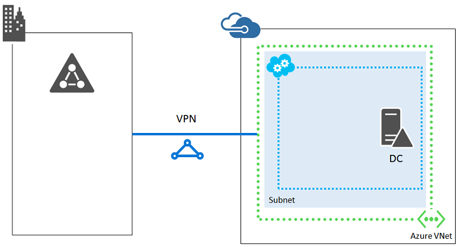

<properties
    pageTitle="Instructions d’une Infrastructure de réseau | Microsoft Azure"
    description="En savoir plus sur les instructions de conception et implémentation clées pour le déploiement d’un réseau virtuel dans les services d’infrastructure Azure."
    documentationCenter=""
    services="virtual-machines-linux"
    authors="iainfoulds"
    manager="timlt"
    editor=""
    tags="azure-resource-manager"/>

<tags
    ms.service="virtual-machines-linux"
    ms.workload="infrastructure-services"
    ms.tgt_pltfrm="vm-linux"
    ms.devlang="na"
    ms.topic="article"
    ms.date="09/08/2016"
    ms.author="iainfou"/>

# Instructions d’une infrastructure réseau

[AZURE.INCLUDE [virtual-machines-linux-infrastructure-guidelines-intro](../../includes/virtual-machines-linux-infrastructure-guidelines-intro.md)] 

Cet article se concentre sur comprendre les étapes de planification requis pour la mise en réseau virtuelle dans Azure et la connectivité entre les environnements local existants.

## Instructions d’implémentation pour les réseaux virtuels

Décisions :

- Quel type de réseau virtuel avez-vous besoin héberger votre charge de travail informatique ou infrastructure (exclusivement le nuage ou croisée local) ?
- Pour les réseaux virtuels entre local, la quantité d’espace adresse avez-vous besoin héberger les sous-réseaux et machines virtuelles maintenant et pour l’extension raisonnablement à l’avenir ?
- Vous allez créer des réseaux virtuels centralisés ou créer des réseaux virtuels individuels pour chaque groupe de ressources ?

Tâches :

- Définir l’espace d’adressage pour les réseaux virtuels à créer.
- Définir le jeu de sous-réseaux et l’espace d’adressage pour chacun.
- Pour les réseaux virtuels entre local, définir l’ensemble des espaces d’adressage réseau local pour les emplacements locaux que les ordinateurs virtuels dans le réseau virtuel amené à atteindre.
- Travail avec locaux équipe réseau afin de garantir l’acheminement approprié est configuré lors de la création de manière croisée locaux réseaux virtuels.
- Créer le réseau virtuel à l’aide de votre convention d’appellation.

## Réseaux virtuels

Réseaux virtuels sont nécessaires pour gérer les communications entre des machines virtuelles (machines virtuelles). Vous pouvez définir des sous-réseaux, adresses IP personnalisée, les paramètres DNS, filtrage de sécurité et l’équilibrage de charge, à l’instar de réseaux physiques. En utilisant une [Passerelle VPN](../vpn-gateway/vpn-gateway-about-vpngateways.md) ou [circuit Express itinéraire](../expressroute/expressroute-introduction.md), vous pouvez vous connecter à des réseaux virtuels Azure à vos réseaux locaux. Vous pouvez en savoir plus sur les [réseaux virtuels et leurs composants](../virtual-network/virtual-networks-overview.md).

À l’aide de groupes de ressources, vous disposez de souplesse dans la façon dont vous concevez vos composants réseau virtuels. Machines virtuelles peuvent se connecter à des réseaux virtuels en dehors de leur propre groupe de ressources. Une approche de conception courants serait pour créer des groupes de ressources centralisées contenant votre infrastructure réseau de base qui peut être géré par une équipe courantes. Machines virtuelles et leurs applications déployées sur groupes de ressources distincts. Cette approche permet d’application propriétaires accéder au groupe de ressources qui contient leurs machines virtuelles sans ouvrir accès à la configuration des plus large ressources réseau virtuels.

## Connectivité du site

### Réseaux virtuels exclusivement le nuage
Si les utilisateurs locaux et des ordinateurs ne nécessitent pas de connectivité continue à machines virtuelles dans un réseau virtuel Azure, votre conception virtuelle réseau est simple :

Cette approche est généralement pour les charges de travail avec accès Internet, par exemple un serveur web basées sur Internet. Vous pouvez gérer ces machines virtuelles à l’aide de SSH ou point-à-site VPN.

Car ils ne connectent pas à votre réseau local, réseaux virtuels Azure seule peuvent utiliser une partie de l’espace d’adressage IP privé. L’espace d’adressage peut être le même espace privé qui se trouve dans utilisation locale.

### Réseaux virtuels croisée locaux
Si les utilisateurs locaux et des ordinateurs nécessitent une connectivité en cours aux machines virtuelles dans un réseau virtuel Azure, créez un réseau virtuel croisée locaux. Connecter le réseau virtuel à votre réseau local avec une connexion de VPN de site à ou ExpressRoute.

Dans cette configuration, le réseau virtuel Azure est essentiellement une extension en nuage de votre réseau local.

Ils se connecter à votre réseau local, entre locaux réseaux virtuels doivent utiliser une partie de l’espace d’adressage utilisé par votre organisation est unique. Dans la même façon différents emplacements d’entreprise affectés un sous-réseau IP spécifique, Azure devient un autre emplacement comme étend votre réseau.

Pour autoriser les paquets à partir de votre réseau virtuel entre local à votre réseau local, vous devez configurer l’ensemble des préfixes d’adresse pertinents en local dans le cadre de la définition du réseau local pour le réseau virtuel. En fonction de l’espace d’adressage du réseau virtuel et l’ensemble des emplacements appropriés en local, on peut observer plusieurs préfixes d’adresse dans le réseau local.

Vous pouvez convertir un réseau virtuel exclusivement le nuage, à un réseau virtuel entre local, mais il est probable nécessite vous re IP votre espace d’adressage réseau virtuel et ressources Azure. Par conséquent, avec soin si un réseau virtuel doit être connecté à votre réseau local lorsque vous affectez un sous-réseau IP.

## Sous-réseaux
Sous-réseaux vous permettent d’organiser les ressources qui sont liées, soit logiquement (par exemple, un sous-réseau pour les machines virtuelles associées à la même application), ou physiquement (par exemple, un sous-réseau par groupe de ressources). Vous pouvez également utiliser des techniques telles isolement sous-réseau pour une sécurité accrue.

Pour les réseaux virtuels entre local, vous devez concevoir sous-réseaux avec les mêmes conventions que vous utilisez pour les ressources locales. **Azure toujours utilise les trois premières adresses IP de l’espace d’adressage de chaque sous réseau**. Pour déterminer le nombre d’adresses nécessaires pour le sous-réseau, commencez par pour compter le nombre de machines virtuelles dont vous avez besoin maintenant. Estimer pour la croissance future, puis utilisez le tableau suivant pour déterminer la taille du sous-réseau.

Nombre d’ordinateurs virtuels nécessité | Nombre de bits hôte nécessaire | Taille du sous-réseau
--- | --- | ---
1 à 3 | 3 | / 29
4-11     | 4 | / 28
12-27 | 5 | / 27
28 – 59 | 6 | / 26
60 – 123 | 7 | / 25

> [AZURE.NOTE] Pour sous-réseaux normal en local, le nombre maximal d’adresses hôte un sous-réseau avec bits n hôte est 2n -2. Pour un sous-réseau Azure, le nombre maximal d’adresses hôte un sous-réseau avec bits n hôte est 2n -5 (2 et 3 pour les adresses Azure utilise sur chaque sous-réseau).

Si vous choisissez une taille de sous-réseau est trop petite, vous devez ré-IP et redéployez les ordinateurs virtuels dans le sous-réseau.

## Groupes de sécurité réseau
Vous pouvez appliquer des règles de filtrage pour le trafic passe à vos réseaux virtuel à l’aide de groupes de sécurité réseau. Vous pouvez créer des règles de filtrage granulaires pour sécuriser votre environnement réseau virtuel, contrôler entrants et sortants le trafic source et destination plages d’adresses IP, autorisé les ports, etc.. Groupes de sécurité réseau peuvent être appliqués à sous-réseaux au sein d’un réseau virtuel ou directement à une interface réseau virtuel donné. Il est recommandé d’avoir un niveau de groupe de sécurité réseau filtrent le trafic sur vos réseaux virtuel. Vous pouvez en savoir plus sur les [Groupes de sécurité réseau](../virtual-network/virtual-networks-nsg.md).

## Autres composants réseau
Comme avec une infrastructure réseau physique local, un réseau virtuel Azure peut contenir plus que sous-réseaux et les adresses IP. Lorsque vous créez votre infrastructure d’application, vous souhaiterez peut-être incorporer certaines de ces composants supplémentaires :

- [Passerelles VPN](../vpn-gateway/vpn-gateway-about-vpngateways.md) - connectez Azure réseaux virtuels à d’autres réseaux virtuel Azure, ou à des réseaux local via une connexion VPN de Site à. Mettre en œuvre des connexions Express itinéraire dédiés. Vous pouvez également fournir un accès direct aux utilisateurs avec les connexions Point-à-Site VPN.
- [Équilibrage de charge](../load-balancer/load-balancer-overview.md) - fournit l’équilibrage de charge du trafic pour le trafic interne et externe comme vous le souhaitez.
- [Passerelle d’application](../application-gateway/application-gateway-introduction.md) - équilibrage de charge HTTP équilibrage de charge au niveau des applications, fournissant certains avantages supplémentaires pour les applications web plutôt que de déployer la Azure.
- [Gestionnaire de trafic](../traffic-manager/traffic-manager-overview.md) - distribution le trafic DNS afin de rediriger les utilisateurs finaux au point de terminaison application disponible le plus proche, ce qui vous permet d’héberger votre application déconnecter centres de données Azure dans différentes régions.

## Étapes suivantes

[AZURE.INCLUDE [virtual-machines-linux-infrastructure-guidelines-next-steps](../../includes/virtual-machines-linux-infrastructure-guidelines-next-steps.md)] 