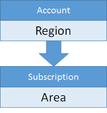
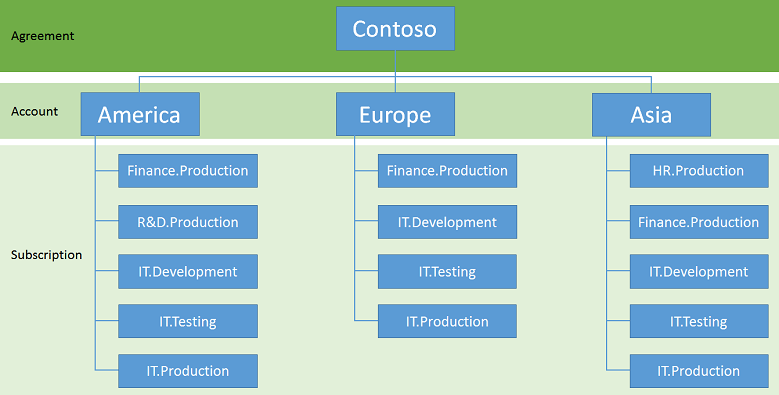

<properties
    pageTitle="Instructions relatives aux comptes et abonnement | Microsoft Azure"
    description="En savoir plus sur les instructions de conception et implémentation clées pour les comptes sur Azure et abonnements."
    documentationCenter=""
    services="virtual-machines-linux"
    authors="iainfoulds"
    manager="timlt"
    editor=""
    tags="azure-resource-manager"/>

<tags
    ms.service="virtual-machines-linux"
    ms.workload="infrastructure-services"
    ms.tgt_pltfrm="vm-linux"
    ms.devlang="na"
    ms.topic="article"
    ms.date="09/08/2016"
    ms.author="iainfou"/>

# Instructions d’abonnement et les comptes

[AZURE.INCLUDE [virtual-machines-linux-infrastructure-guidelines-intro](../../includes/virtual-machines-linux-infrastructure-guidelines-intro.md)] 

Cet article se concentre sur la compréhension de l’approche abonnement et gestion des comptes en tant que votre environnement et base d’utilisateurs augmente.

## Instructions d’implémentation pour les comptes et abonnements

Décisions :

- Le jeu d’abonnements, procédez de comptes vous avez besoin d’héberger votre charge de travail informatique ou infrastructure ?
- Comment faire pour décomposer la hiérarchie pour l’ajuster à votre organisation ?

Tâches :

- Définissent la hiérarchie logique que vous voulez gérer à partir d’un niveau d’abonnement.
- Pour faire correspondre cette hiérarchie logique, définissez les comptes requis et abonnements sous chaque compte.
- Créer l’ensemble des abonnements et les comptes à l’aide de votre convention d’appellation.

## Abonnements et les comptes

Pour travailler avec Azure, vous avez besoin d’un ou plusieurs abonnements Azure. Ressources telles que des machines virtuelles (machines virtuelles) ou des réseaux virtuels existent dans de ces abonnements.

- Les clients d’entreprise ont généralement une inscription d’entreprise, qui est la ressource plus haut dans la hiérarchie et est associé à un ou plusieurs comptes.
- Pour les particuliers et clients sans une inscription d’entreprise, la ressource plus haut est le compte.
- Abonnements sont associés aux comptes et il peut y avoir un ou plusieurs abonnements par compte. Enregistrements Azure informations au niveau de l’abonnement de facturation.

En raison de la limite de deux niveaux de hiérarchie de la relation compte/abonnement, il est important d’aligner la dénomination des comptes et des abonnements aux besoins facturation. Par exemple, si une société globale utilise Azure, ils peuvent choisir d’avoir un seul compte par région et aient abonnements gérés au niveau de la région :

Par exemple, vous pouvez utiliser la structure suivante :

Si une région décide d’avoir plusieurs abonnements associé à un groupe spécifique, la dénomination doit incorporer permet de coder les données supplémentaires sur le compte ou le nom de l’abonnement. Cette organisation permet de masser des données de facturation pour générer les nouveaux niveaux de hiérarchie au cours des notes de facturation :

L’organisation peut ressembler à ce qui suit :

Nous fournissons la facturation détaillée via un fichier téléchargeable pour un seul compte, ou pour tous les comptes dans un accord d’entreprise.

## Étapes suivantes

[AZURE.INCLUDE [virtual-machines-linux-infrastructure-guidelines-next-steps](../../includes/virtual-machines-linux-infrastructure-guidelines-next-steps.md)] 