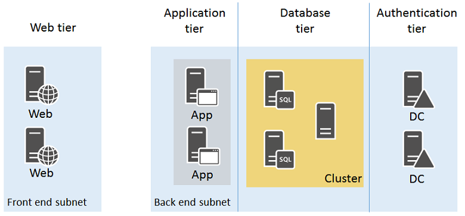

<properties
    pageTitle="Procédure pas à pas exemple Infrastructure | Microsoft Azure"
    description="En savoir plus sur les instructions de conception et implémentation clées pour le déploiement d’une infrastructure d’exemple dans Azure."
    documentationCenter=""
    services="virtual-machines-windows"
    authors="iainfoulds"
    manager="timlt"
    editor=""
    tags="azure-resource-manager"/>

<tags
    ms.service="virtual-machines-windows"
    ms.workload="infrastructure-services"
    ms.tgt_pltfrm="vm-windows"
    ms.devlang="na"
    ms.topic="article"
    ms.date="09/08/2016"
    ms.author="iainfou"/>

# Exemple Azure infrastructure procédure pas à pas

[AZURE.INCLUDE [virtual-machines-windows-infrastructure-guidelines-intro](../../includes/virtual-machines-windows-infrastructure-guidelines-intro.md)] 

Cet article décrit comment créer une infrastructure d’application exemple. Nous en détail concevoir une infrastructure pour un magasin en ligne simple qui regroupe toutes les instructions et décisions autour des conventions, ensembles de disponibilité, réseaux virtuels et des programmes d’équilibrage de charge et réellement déployer vos machines virtuelles (machines virtuelles).

## Charge de travail exemple

Adventure Works Cycles souhaite créer une application de magasin en ligne dans Azure qui se compose de :

- Deux serveurs IIS exécutant le client frontal niveau web
- Deux serveurs IIS traitement des données et les commandes dans un niveau de l’application
- Deux instances de Microsoft SQL Server avec les groupes de disponibilité AlwaysOn (deux serveurs SQL et un rappel de nœud majorité) pour le stockage des données sur les produits et les commandes dans un niveau de base de données
- Deux contrôleurs de domaine Active Directory pour les comptes clients et des fournisseurs dans un niveau d’authentification
- Tous les serveurs se trouvent dans deux sous-réseaux :
    - un sous-réseau pour les serveurs web frontaux 
    - un sous-réseau principale pour les serveurs d’applications, cluster SQL et superflus

Entrant sécurisé du trafic web doit être équilibrage de charge entre les serveurs web comme clients parcourir le magasin en ligne. Ordre de traitement de trafic sous la forme d’HTTP demande à partir du web serveurs doivent être équilibrées entre les serveurs d’applications. En outre, l’infrastructure doit être conçue de disponibilité.

La conception qui en résulte doit comporter :

- Un abonnement Azure et un compte
- Un groupe de ressources unique
- Comptes de stockage
- Un réseau virtuel avec deux sous-réseaux
- Disponibilité définit pour les ordinateurs virtuels avec un rôle similaire
- Machines virtuelles

Tout ce qui précède suivez ces conventions d’affectation de noms :

- Adventure Works Cycles utilise **[la charge informatique]-[emplacement]-[ressource Azure]** comme un préfixe
    - Dans cet exemple, «**azos**» (Azure en ligne Store) est le nom de la charge de travail informatique et «**utiliser**» (Extrême-Orient États-Unis 2) correspond à l’emplacement
- Utilisent des comptes de stockage adventureazosusesa**[description]**
    - « adventure » a été ajouté au préfixe à fournir unicité et noms de compte de stockage ne prennent pas en charge l’utilisation des traits d’union.
- Réseaux virtuels utilisent AZOS-utilisation-VN**[numéro]**
- Jeux de disponibilité utilisent azos-utiliser-comme-**[rôle]**
- Les noms de machine virtuelle utilisent azos-utiliser-machine virtuelle -**[vmname]**

## Comptes et abonnements azure

Adventure Works Cycles est à l’aide de son abonnement entreprise, nommé Adventure Works entreprise abonnement, à fournir facturation pour cette charge de travail informatique.

## Comptes de stockage

Adventure Works Cycles déterminé qu’ils ne nécessaires deux comptes de stockage :

- **adventureazosusesawebapp** pour le stockage standard les serveurs web, serveurs d’applications et contrôleur de domaine / leurs disques de données.
- **adventureazosusesasql** pour le stockage Premium des ordinateurs virtuels SQL Server et leurs disques de données.

## Sous-réseaux et réseau virtuel

Étant donné que le réseau virtuel n’a pas besoin en cours connectivité au réseau local Cycles de travail Adventure, ils décidé sur un réseau virtuel exclusivement le nuage.

Ils créé un réseau virtuel exclusivement le nuage, avec les paramètres suivants à l’aide du portail Azure :

- Nom : AZOS-utilisation-VN01
- Emplacement : États-Unis le 2
- Espace d’adressage réseau virtuel : 10.0.0.0/8
- Premier sous-réseau :
    - Nom : FrontEnd
    - Espace d’adressage : 10.0.1.0/24
- Deuxième sous-réseau :
    - Nom : principal
    - Espace d’adressage : 10.0.2.0/24

## Jeux de disponibilité

Pour conserver la disponibilité de tous les quatre niveaux de leur magasin en ligne, Adventure Works Cycles décidé sur les quatre jeux de disponibilité :

- **utiliser azos comme web** pour les serveurs web
- **Utilisez azos comme application** pour les serveurs d’applications
- **utiliser azos comme sql** pour les serveurs SQL
- **utiliser azos comme dc** pour le domaine

## Machines virtuelles

Adventure Works Cycles décidé sur les noms pour leurs machines virtuelles Azure suivants :

- **azos-utilisation-machine virtuelle-web01** pour le premier serveur web
- **azos-utilisation-machine virtuelle-web02** pour le deuxième serveur web
- **azos-utilisation-machine virtuelle-app01** pour le premier serveur de l’application
- **azos-utilisation-machine virtuelle-app02** pour le deuxième serveur d’applications
- **azos-utilisation-machine virtuelle-sql01** pour le premier serveur de SQL Server dans le cluster
- **azos-utilisation-machine virtuelle-sql02** pour le deuxième serveur de SQL Server dans le cluster
- **azos-utilisation-machine virtuelle-dc01** pour le premier contrôleur de domaine
- **azos-utilisation-machine virtuelle-dc02** sur le deuxième contrôleur de domaine

Voici la configuration qui en résulte.

Cette configuration comprend :

- Un réseau virtuel exclusivement le nuage, avec deux sous-réseaux (FrontEnd et serveur principal)
- Deux comptes de stockage
- Quatre jeux de disponibilité, une pour chaque niveau de la banque d’informations en ligne
- Machines virtuelles pour les quatre niveaux
- Un jeu d’équilibrage de charge externes pour le trafic web basées sur HTTPS à partir d’Internet vers les serveurs web
- Un ensemble pour le trafic web non chiffré à partir des serveurs web vers les serveurs d’applications d’équilibrage interne
- Un groupe de ressources unique

## Étapes suivantes

[AZURE.INCLUDE [virtual-machines-windows-infrastructure-guidelines-next-steps](../../includes/virtual-machines-windows-infrastructure-guidelines-next-steps.md)] 