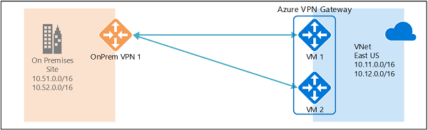

<properties
   pageTitle="Comment faire pour configurer les connexions VPN actif S2S avec des passerelles VPN Azure à l’aide du Gestionnaire de ressources Azure et PowerShell | Microsoft Azure"
   description="Cet article vous guide dans la configuration des connexions actif avec passerelles VPN Azure à l’aide du Gestionnaire de ressources Azure et PowerShell."
   services="vpn-gateway"
   documentationCenter="na"
   authors="yushwang"
   manager="rossort"
   editor=""
   tags="azure-resource-manager"/>

<tags
   ms.service="vpn-gateway"
   ms.devlang="na"
   ms.topic="article"
   ms.tgt_pltfrm="na"
   ms.workload="infrastructure-services"
   ms.date="09/26/2016"
   ms.author="yushwang"/>

# Configurer les connexions de S2S VPN actif avec les passerelles VPN Azure à l’aide du Gestionnaire de ressources Azure et PowerShell

Cet article décrit les étapes pour créer des connexions de VNet-VNet à l’aide du modèle de déploiement Gestionnaire de ressources et PowerShell et actif croisée locaux.

**À propos des modèles de déploiement d’Azure**

[AZURE.INCLUDE [vpn-gateway-clasic-rm](../../includes/vpn-gateway-classic-rm-include.md)] 

## À propos des connexions entre locaux hautement disponible

Pour obtenir une haute disponibilité pour croisée locaux et la connectivité de VNet à VNet, vous devez déployer plusieurs passerelles VPN et établir plusieurs connexions parallèles entre vos réseaux et Azure. Pour une vue d’ensemble des options de connectivité et la topologie, consultez [hautement disponible locaux croisée et connectivité VNet-VNet](./vpn-gateway-highlyavailable.md) .

Cet article fournit des instructions pour configurer une connexion VPN actif entre local et connexion actif entre deux réseaux virtuels :

- [Partie 1 : créer et configurer votre passerelle VPN Azure en mode actif](#aagateway)

- [Partie 2 - établir des connexions actif croisée locaux](#aacrossprem)

- [Partie 3 - établir des connexions de VNet-VNet actif](#aav2v)

- [Partie 4 - mettre à jour une passerelle existante entre actif et de secours actif](#aaupdate)

Vous pouvez combiner ces ensemble pour créer une topologie de réseau plus complexes, hautement disponible qui répond à vos besoins.

>[AZURE.IMPORTANT] Veuillez noter que le mode actif fonctionne uniquement dans HighPerformance SKU

## Partie 1 : créer et configurer des passerelles VPN actif

Les étapes suivantes configurera votre passerelle VPN Azure dans les modes actif. Les principales différences entre les passerelles actif et de secours actif :

- Vous devez créer deux configurations IP de la passerelle avec deux adresses IP publiques
- Vous devez définir l’indicateur EnableActiveActiveFeature
- La passerelle de référence (SKU) doit être bien

Les autres propriétés sont identiques en tant que les passerelles non actif. 

### Avant de commencer

- Vérifiez que vous avez un abonnement Azure. Si vous n’avez pas un abonnement Azure, vous pouvez activer votre [avantages d’abonné MSDN](https://azure.microsoft.com/pricing/member-offers/msdn-benefits-details/) ou inscrivez-vous vers le haut pour un [compte gratuit](https://azure.microsoft.com/pricing/free-trial/).
    
- Vous devez installer les applets de commande PowerShell de gestionnaire de ressources Azure. Découvrez [comment installer et configurer Azure PowerShell](../powershell-install-configure.md) pour plus d’informations sur l’installation les applets de commande PowerShell.

### Étape 1 : créer et configurer VNet1

#### 1. déclarer vos variables

Pour cet exercice, nous allons commencer par la déclaration de notre variables. L’exemple ci-dessous déclare les variables en utilisant les valeurs pour cet exercice. N’oubliez pas de remplacer les valeurs par votre propre lors de la configuration de production. Vous pouvez utiliser ces variables si vous exécutez les étapes pour vous familiariser avec ce type de configuration. Modifiez les variables, puis copiez et collez dans votre console PowerShell.

    $Sub1          = "Ross"
    $RG1           = "TestAARG1"
    $Location1     = "West US"
    $VNetName1     = "TestVNet1"
    $FESubName1    = "FrontEnd"
    $BESubName1    = "Backend"
    $GWSubName1    = "GatewaySubnet"
    $VNetPrefix11  = "10.11.0.0/16"
    $VNetPrefix12  = "10.12.0.0/16"
    $FESubPrefix1  = "10.11.0.0/24"
    $BESubPrefix1  = "10.12.0.0/24"
    $GWSubPrefix1  = "10.12.255.0/27"
    $VNet1ASN      = 65010
    $DNS1          = "8.8.8.8"
    $GWName1       = "VNet1GW"
    $GW1IPName1    = "VNet1GWIP1"
    $GW1IPName2    = "VNet1GWIP2"
    $GW1IPconf1    = "gw1ipconf1"
    $GW1IPconf2    = "gw1ipconf2"
    $Connection12  = "VNet1toVNet2"
    $Connection151 = "VNet1toSite5_1"
    $Connection152 = "VNet1toSite5_2"

#### 2. Connectez-vous à votre abonnement et créez un nouveau groupe de ressources

Vérifiez que vous passez en mode de PowerShell pour utiliser les applets de commande Gestionnaire de ressources. Pour plus d’informations, voir [Utilisation de Windows PowerShell avec le Gestionnaire de ressources](../powershell-azure-resource-manager.md).

Ouvrez votre console PowerShell et connectez-vous à votre compte. Pour vous aider à vous connecter, utilisez l’exemple suivant :

    Login-AzureRmAccount
    Select-AzureRmSubscription -SubscriptionName $Sub1
    New-AzureRmResourceGroup -Name $RG1 -Location $Location1

#### 3. créer des TestVNet1

L’exemple ci-dessous crée un réseau virtuel nommé TestVNet1 et trois sous-réseaux, une GatewaySubnet appelée, FrontEnd appelée une et un serveur principal appelé. Remplacer les valeurs, il est important que vous nommez toujours votre sous-réseau passerelle spécifiquement GatewaySubnet. Si vous nommez autre chose, la création de votre passerelle échouera. 

    $fesub1 = New-AzureRmVirtualNetworkSubnetConfig -Name $FESubName1 -AddressPrefix $FESubPrefix1
    $besub1 = New-AzureRmVirtualNetworkSubnetConfig -Name $BESubName1 -AddressPrefix $BESubPrefix1
    $gwsub1 = New-AzureRmVirtualNetworkSubnetConfig -Name $GWSubName1 -AddressPrefix $GWSubPrefix1

    New-AzureRmVirtualNetwork -Name $VNetName1 -ResourceGroupName $RG1 -Location $Location1 -AddressPrefix $VNetPrefix11,$VNetPrefix12 -Subnet $fesub1,$besub1,$gwsub1

### Étape 2 : créer la passerelle VPN pour TestVNet1 liés au mode actif

#### 1. créer les adresses IP et la passerelle public configurations IP

Demander deux adresses IP publiques à allouer à la passerelle, que vous allez créer pour votre VNet. Vous pouvez également définir le sous-réseau et les configurations IP requises. 

    $gw1pip1    = New-AzureRmPublicIpAddress -Name $GW1IPName1 -ResourceGroupName $RG1 -Location $Location1 -AllocationMethod Dynamic
    $gw1pip2    = New-AzureRmPublicIpAddress -Name $GW1IPName2 -ResourceGroupName $RG1 -Location $Location1 -AllocationMethod Dynamic

    $vnet1      = Get-AzureRmVirtualNetwork -Name $VNetName1 -ResourceGroupName $RG1
    $subnet1    = Get-AzureRmVirtualNetworkSubnetConfig -Name "GatewaySubnet" -VirtualNetwork $vnet1
    $gw1ipconf1 = New-AzureRmVirtualNetworkGatewayIpConfig -Name $GW1IPconf1 -Subnet $subnet1 -PublicIpAddress $gw1pip1
    $gw1ipconf2 = New-AzureRmVirtualNetworkGatewayIpConfig -Name $GW1IPconf2 -Subnet $subnet1 -PublicIpAddress $gw1pip2

#### 2. créer la passerelle VPN avec configuration actif

Créer la passerelle réseau virtuel pour TestVNet1. Notez qu’il existe deux entrées GatewayIpConfig, et l’indicateur EnableActiveActiveFeature est défini. Le mode actif nécessite une passerelle VPN basée sur un itinéraire de HighPerformance SKU. Création d’une passerelle peut prendre un certain temps (30 minutes ou plus).

    New-AzureRmVirtualNetworkGateway -Name $GWName1 -ResourceGroupName $RG1 -Location $Location1 -IpConfigurations $gw1ipconf1,$gw1ipconf2 -GatewayType Vpn -VpnType RouteBased -GatewaySku HighPerformance -Asn $VNet1ASN -EnableActiveActiveFeature -Debug

#### 3. obtenir les adresses IP publiques passerelle et l’adresse IP de homologue BGP

Une fois que la passerelle est créée, vous devrez obtenir l’adresse IP de homologue BGP sur la passerelle VPN Azure. Cette adresse est nécessaire pour configurer la passerelle VPN Azure comme un homologue BGP pour vos appareils VPN en local.

    $gw1pip1 = Get-AzureRmPublicIpAddress -Name $GW1IPName1 -ResourceGroupName $RG1
    $gw1pip2 = Get-AzureRmPublicIpAddress -Name $GW1IPName2 -ResourceGroupName $RG1
    $vnet1gw = Get-AzureRmVirtualNetworkGateway -Name $GWName1 -ResourceGroupName $RG1

Utiliser les applets de commande suivantes pour afficher les deux adresses IP publiques allouées à votre passerelle VPN et leurs adresses BGP homologue IP correspondants pour chaque instance de passerelle :

    PS D:\> $gw1pip1.IpAddress
    40.112.190.5

    PS D:\> $gw1pip2.IpAddress
    138.91.156.129

    PS D:\> $vnet1gw.BgpSettingsText
    {
      "Asn": 65010,
      "BgpPeeringAddress": "10.12.255.4,10.12.255.5",
      "PeerWeight": 0
    }

L’ordre de l’adresse IP publique adresses pour les instances de passerelle et les adresses correspondantes BGP Peering sont identiques. Dans cet exemple, la passerelle machine virtuelle avec adresse IP publique de 40.112.190.5 utilise 10.12.255.4 en tant que son adresse Peering BGP et la passerelle avec 138.91.156.129 utilisera 10.12.255.5. Ces informations sont nécessaires lorsque vous configurez vos périphériques VPN local sur se connecter à la passerelle actif. La passerelle est indiquée dans le schéma ci-dessous avec toutes les adresses :

Une fois que la passerelle est créée, vous pouvez utiliser cette passerelle pour établir actif croisée locaux ou VNet-VNet. Les sections suivantes guidera dans les étapes pour terminer l’exercice.

## Partie 2 - établir une connexion locale croisées actif

Pour établir une connexion entre local, vous devez créer une passerelle réseau Local pour représenter votre périphérique VPN en local et une connexion pour connecter la passerelle VPN Azure avec la passerelle réseau local. Dans cet exemple, la passerelle VPN Azure est en mode actif. Par conséquent, même s’il n'existe qu’un seul local périphérique VPN (passerelle réseau local) et des ressources d’une connexion, les deux instances de passerelle VPN Azure établir tunnel VPN S2S avec le périphérique local.

Avant de commencer, vérifiez que vous avez terminé la [partie 1](#aagateway) de cet exercice.

### Étape 1 : créer et configurer la passerelle réseau local

#### 1. déclarer vos variables

Cet exercice continueront à générer la configuration présentée dans l’illustration. N’oubliez pas de remplacer les valeurs par celles que vous souhaitez utiliser pour votre configuration.

    $RG5           = "TestAARG5"
    $Location5     = "West US"
    $LNGName51     = "Site5_1"
    $LNGPrefix51   = "10.52.255.253/32"
    $LNGIP51       = "131.107.72.22"
    $LNGASN5       = 65050
    $BGPPeerIP51   = "10.52.255.253"

Quelques éléments à noter en ce qui concerne les paramètres de la passerelle réseau local :

- La passerelle réseau local peut se trouver dans la même ou autre emplacement et un groupe de ressources en tant que la passerelle VPN. Cet exemple montre les dans différents groupes de ressources, mais dans le même emplacement Azure.

- S’il existe un seul périphérique VPN local comme indiqué ci-dessus, la connexion actif pouvez travailler avec ou sans protocole BGP. Cet exemple utilise BGP pour la connexion cross locaux.

- Si BGP est activée, le préfixe que vous avez besoin de déclarer pour la passerelle réseau local est l’adresse de l’hôte de votre adresse IP de homologue BGP sur votre appareil VPN. Dans ce cas, il est un /32 préfixe « 10.52.255.253/32 ».

- En tant que rappel, vous devez utiliser différents APE BGP entre vos réseaux en local et Azure VNet. Si elles sont identiques, vous devez modifier votre VNet ASN si votre appareil VPN local utilise déjà le ASN de pair avec d’autres voisin BGP.

#### 2. créer la passerelle réseau local pour Site5
    
Avant de poursuivre, vérifiez que vous êtes toujours connecté à 1 de l’abonnement. Créer le groupe de ressources s’il n’est pas encore créé.

    New-AzureRmResourceGroup       -Name $RG5 -Location $Location5
    New-AzureRmLocalNetworkGateway -Name $LNGName51 -ResourceGroupName $RG5 -Location $Location5 -GatewayIpAddress $LNGIP51 -AddressPrefix $LNGPrefix51 -Asn $LNGASN5 -BgpPeeringAddress $BGPPeerIP51

### Étape 2 : se connecter la passerelle VNet et la passerelle de réseau local

#### 1. optez pour les deux passerelles

    $vnet1gw = Get-AzureRmVirtualNetworkGateway -Name $GWName1  -ResourceGroupName $RG1
    $lng5gw1 = Get-AzureRmLocalNetworkGateway   -Name $LNGName51 -ResourceGroupName $RG5

#### 2. créer le TestVNet1 à Site5 connexion

Dans cette étape, vous allez créer la connexion à partir de TestVNet1 à Site5_1 avec « EnableBGP » est défini sur $True.

    New-AzureRmVirtualNetworkGatewayConnection -Name $Connection151 -ResourceGroupName $RG1 -VirtualNetworkGateway1 $vnet1gw -LocalNetworkGateway2 $lng5gw1 -Location $Location1 -ConnectionType IPsec -SharedKey 'AzureA1b2C3' -EnableBGP True

#### 3. VPN et BGP les paramètres de votre appareil VPN en local

L’exemple ci-dessous répertorie les paramètres que vous entrerez dans la section configuration BGP sur votre appareil VPN en local pour cet exercice :

    - Site5 ASN : 65050
    - Site5 BGP IP : 10.52.255.253
    - Les préfixes d’annoncer : (par exemple) 10.51.0.0/16 et 10.52.0.0/16
    - Azure ASN VNet : 65010
    - Azure VNet BGP IP 1 : 10.12.255.4 pour tunnel vers 40.112.190.5
    - Azure VNet BGP IP 2 : 10.12.255.5 pour tunnel vers 138.91.156.129
    - Itinéraires statiques : Destination 10.12.255.4/32, saut suivant le tunnel VPN interface 40.112.190.5 Destination 10.12.255.5/32, saut suivant le tunnel VPN interface 138.91.156.129
    - eBGP sauts multiples : Vérifiez que l’option « sauts multiples » eBGP est activé sur votre appareil si nécessaire

La connexion doit être établie après quelques minutes, et la session homologation BGP démarre une fois la connexion IPsec établie. Cet exemple jusqu'à présent a configuré qu’un seul périphérique VPN en local, résultant dans le schéma ci-dessous :

### Étape 3 : connecter deux appareils VPN locale à la passerelle VPN actif

Si vous avez deux appareils VPN au niveau du même réseau local, vous pouvez obtenir redondance double en vous connectant à la passerelle VPN Azure à l’appareil VPN deuxième.

#### 1. créer la deuxième passerelle réseau local pour Site5

Notez que l’adresse IP de passerelle, le préfixe d’adresse et l’adresse homologation BGP pour la deuxième passerelle réseau local doivent se chevauchent pas avec la précédente passerelle réseau local pour le même réseau local. 

    $LNGName52     = "Site5_2"
    $LNGPrefix52   = "10.52.255.254/32"
    $LNGIP52       = "131.107.72.23"
    $BGPPeerIP52   = "10.52.255.254"

    New-AzureRmLocalNetworkGateway -Name $LNGName52 -ResourceGroupName $RG5 -Location $Location5 -GatewayIpAddress $LNGIP52 -AddressPrefix $LNGPrefix52 -Asn $LNGASN5 -BgpPeeringAddress $BGPPeerIP52
 
#### 2. Connectez la passerelle VNet et la deuxième passerelle réseau local

Créer la connexion entre TestVNet1 et Site5_2 avec « EnableBGP » est défini sur $True

    $lng5gw2 = Get-AzureRmLocalNetworkGateway   -Name $LNGName52 -ResourceGroupName $RG5

    New-AzureRmVirtualNetworkGatewayConnection -Name $Connection152 -ResourceGroupName $RG1 -VirtualNetworkGateway1 $vnet1gw -LocalNetworkGateway2 $lng5gw2 -Location $Location1 -ConnectionType IPsec -SharedKey 'AzureA1b2C3' -EnableBGP True

#### 3. VPN et BGP les paramètres de votre appareil VPN local deuxième

De même, sous listes les paramètres vous entrerez dans le deuxième périphérique VPN :

    - Site5 ASN : 65050
    - Site5 BGP IP : 10.52.255.254
    - Les préfixes d’annoncer : (par exemple) 10.51.0.0/16 et 10.52.0.0/16
    - Azure ASN VNet : 65010
    - Azure VNet BGP IP 1 : 10.12.255.4 pour tunnel vers 40.112.190.5
    - Azure VNet BGP IP 2 : 10.12.255.5 pour tunnel vers 138.91.156.129
    - Itinéraires statiques : Destination 10.12.255.4/32, saut suivant le tunnel VPN interface 40.112.190.5 Destination 10.12.255.5/32, saut suivant le tunnel VPN interface 138.91.156.129
    - eBGP sauts multiples : Vérifiez que l’option « sauts multiples » eBGP est activé sur votre appareil si nécessaire

Une fois la connexion (par exemple) sont établie, vous aurez deux appareils VPN redondants et tunnel connectant votre réseau local et Azure :

## Partie 3 - établir une connexion de VNet-VNet actif

Cette section crée une connexion de VNet-VNet actif avec BGP. 

Les instructions ci-dessous continuer à partir de la procédure précédente décrite ci-dessus. Vous devez effectuer [partie 1](#aagateway) pour créer et configurer TestVNet1 et la passerelle VPN avec BGP. 

### Étape 1 : créer TestVNet2 et la passerelle VPN

Il est important de s’assurer que l’espace d’adressage IP du nouveau réseau virtuel, TestVNet2, ne chevauche pas d’un de vos plages VNet.

Dans cet exemple, les réseaux virtuels appartiennent à la même abonnement. Vous pouvez configurer les connexions VNet-VNet entre différents abonnements ; reportez-vous à [configurer une connexion VNet-VNet](./vpn-gateway-vnet-vnet-rm-ps.md) pour en savoir plus. Assurez-vous que vous ajoutez la «-EnableBgp $True » lorsque vous créez les connexions pour activer BGP.

#### 1. déclarer vos variables

N’oubliez pas de remplacer les valeurs par celles que vous souhaitez utiliser pour votre configuration.

    $RG2           = "TestAARG2"
    $Location2     = "East US"
    $VNetName2     = "TestVNet2"
    $FESubName2    = "FrontEnd"
    $BESubName2    = "Backend"
    $GWSubName2    = "GatewaySubnet"
    $VNetPrefix21  = "10.21.0.0/16"
    $VNetPrefix22  = "10.22.0.0/16"
    $FESubPrefix2  = "10.21.0.0/24"
    $BESubPrefix2  = "10.22.0.0/24"
    $GWSubPrefix2  = "10.22.255.0/27"
    $VNet2ASN      = 65020
    $DNS2          = "8.8.8.8"
    $GWName2       = "VNet2GW"
    $GW2IPName1    = "VNet2GWIP1"
    $GW2IPconf1    = "gw2ipconf1"
    $GW2IPName2    = "VNet2GWIP2"
    $GW2IPconf2    = "gw2ipconf2"
    $Connection21  = "VNet2toVNet1"
    $Connection12  = "VNet1toVNet2"

#### 2. créer TestVNet2 dans le nouveau groupe de ressources

    New-AzureRmResourceGroup -Name $RG2 -Location $Location2

    $fesub2 = New-AzureRmVirtualNetworkSubnetConfig -Name $FESubName2 -AddressPrefix $FESubPrefix2
    $besub2 = New-AzureRmVirtualNetworkSubnetConfig -Name $BESubName2 -AddressPrefix $BESubPrefix2
    $gwsub2 = New-AzureRmVirtualNetworkSubnetConfig -Name $GWSubName2 -AddressPrefix $GWSubPrefix2

    New-AzureRmVirtualNetwork -Name $VNetName2 -ResourceGroupName $RG2 -Location $Location2 -AddressPrefix $VNetPrefix21,$VNetPrefix22 -Subnet $fesub2,$besub2,$gwsub2

#### 3. créer la passerelle VPN actif pour TestVNet2

Demander deux adresses IP publiques à allouer à la passerelle, que vous allez créer pour votre VNet. Vous pouvez également définir le sous-réseau et les configurations IP requises. 

    $gw2pip1    = New-AzureRmPublicIpAddress -Name $GW2IPName1 -ResourceGroupName $RG2 -Location $Location2 -AllocationMethod Dynamic
    $gw2pip2    = New-AzureRmPublicIpAddress -Name $GW2IPName2 -ResourceGroupName $RG2 -Location $Location2 -AllocationMethod Dynamic

    $vnet2      = Get-AzureRmVirtualNetwork -Name $VNetName2 -ResourceGroupName $RG2
    $subnet2    = Get-AzureRmVirtualNetworkSubnetConfig -Name "GatewaySubnet" -VirtualNetwork $vnet2
    $gw2ipconf1 = New-AzureRmVirtualNetworkGatewayIpConfig -Name $GW2IPconf1 -Subnet $subnet2 -PublicIpAddress $gw2pip1
    $gw2ipconf2 = New-AzureRmVirtualNetworkGatewayIpConfig -Name $GW2IPconf2 -Subnet $subnet2 -PublicIpAddress $gw2pip2

Créer la passerelle VPN avec le numéro en tant qu’et l’indicateur « EnableActiveActiveFeature ». Notez que vous devez remplacer la valeur par défaut ASN vos passerelles VPN Azure. Les APE pour la VNets connecté doivent être différents pour activer BGP et le routage de voies.

    New-AzureRmVirtualNetworkGateway -Name $GWName2 -ResourceGroupName $RG2 -Location $Location2 -IpConfigurations $gw2ipconf1,$gw2ipconf2 -GatewayType Vpn -VpnType RouteBased -GatewaySku HighPerformance -Asn $VNet2ASN -EnableActiveActiveFeature

### Étape 2 : connecter les passerelles TestVNet1 et TestVNet2

Dans cet exemple, les deux passerelles sont dans le même abonnement. Vous pouvez effectuer cette étape de la même session PowerShell.

#### 1. optez pour les deux passerelles

Assurez-vous de vous connecter et se connectez à 1 de l’abonnement.

    $vnet1gw = Get-AzureRmVirtualNetworkGateway -Name $GWName1 -ResourceGroupName $RG1
    $vnet2gw = Get-AzureRmVirtualNetworkGateway -Name $GWName2 -ResourceGroupName $RG2
    
#### 2. créer les deux connexions

Dans cette étape, vous allez créer la connexion entre TestVNet1 et TestVNet2 et la connexion à partir de TestVNet2 à TestVNet1.

    New-AzureRmVirtualNetworkGatewayConnection -Name $Connection12 -ResourceGroupName $RG1 -VirtualNetworkGateway1 $vnet1gw -VirtualNetworkGateway2 $vnet2gw -Location $Location1 -ConnectionType Vnet2Vnet -SharedKey 'AzureA1b2C3' -EnableBgp $True

    New-AzureRmVirtualNetworkGatewayConnection -Name $Connection21 -ResourceGroupName $RG2 -VirtualNetworkGateway1 $vnet2gw -VirtualNetworkGateway2 $vnet1gw -Location $Location2 -ConnectionType Vnet2Vnet -SharedKey 'AzureA1b2C3' -EnableBgp $True

>[AZURE.IMPORTANT] Veillez à activer BGP pour les deux connexions.

Après avoir effectué ces étapes, la connexion va établir dans quelques minutes et le BGP session homologation sera la fois la connexion VNet-VNet est terminée avec redondance double :

## Partie 4 - mettre à jour une passerelle existante entre actif et de secours actif

La dernière section décrit comment vous pouvez configurer une passerelle VPN Azure existante à partir de la mise en veille actif en mode actif, ou vice versa.

>[AZURE.IMPORTANT] Veuillez noter que le mode actif fonctionne uniquement dans HighPerformance SKU

### Configuration d’une passerelle active-de réserve passerelle actif

#### 1. paramètres de la passerelle

L’exemple suivant convertit une passerelle active-de réserve une passerelle actif. Vous devez créer une autre adresse IP publique, puis ajoutez une deuxième configuration IP de la passerelle. Ci-dessous présente les paramètres utilisés :

    $GWName     = "TestVNetAA1GW"
    $VNetName   = "TestVNetAA1"
    $RG         = "TestVPNActiveActive01"
    $GWIPName2  = "gwpip2"
    $GWIPconf2  = "gw1ipconf2"

    $vnet       = Get-AzureRmVirtualNetwork -Name $VNetName -ResourceGroupName $RG
    $subnet     = Get-AzureRmVirtualNetworkSubnetConfig -Name 'GatewaySubnet' -VirtualNetwork $vnet
    $gw         = Get-AzureRmVirtualNetworkGateway -Name $GWName -ResourceGroupName $RG
    $location   = $gw.Location

#### 2. Créez l’adresse IP, puis ajoutez la seconde configuration IP passerelle

    $gwpip2     = New-AzureRmPublicIpAddress -Name $GWIPName2 -ResourceGroupName $RG -Location $location -AllocationMethod Dynamic
    Add-AzureRmVirtualNetworkGatewayIpConfig -VirtualNetworkGateway $gw -Name $GWIPconf2 -Subnet $subnet -PublicIpAddress $gwpip2 

#### 3. activer le mode actif et mettre à jour de la passerelle

Vous devez définir l’objet de la passerelle dans PowerShell pour déclencher l’instruction update. La référence (SKU) de l’objet passerelle doit également être modifié pour bien dans la mesure où il a été créé précédemment en Standard.

    Set-AzureRmVirtualNetworkGateway -VirtualNetworkGateway $gw -EnableActiveActiveFeature -GatewaySku HighPerformance

Cette mise à jour peut prendre 30 à 45 minutes.

### Configuration d’une passerelle actif active-de réserve passerelle

#### 1. paramètres de la passerelle

Utiliser les mêmes paramètres qu’auparavant, obtenir le nom de la configuration d’IP que vous voulez supprimer.

    $GWName     = "TestVNetAA1GW"
    $RG         = "TestVPNActiveActive01"

    $gw         = Get-AzureRmVirtualNetworkGateway -Name $GWName -ResourceGroupName $RG
    $ipconfname = $gw.IpConfigurations[1].Name

#### 2. supprimer la configuration de la passerelle IP et désactiver le mode actif

De même, vous devez définir l’objet de la passerelle dans PowerShell pour déclencher l’instruction update.

    Remove-AzureRmVirtualNetworkGatewayIpConfig -Name $ipconfname -VirtualNetworkGateway $gw
    Set-AzureRmVirtualNetworkGateway -VirtualNetworkGateway $gw -DisableActiveActiveFeature

Cette mise à jour peut prendre jusqu'à 30 à 45 minutes.

## Étapes suivantes

Une fois que votre connexion est terminée, vous pouvez ajouter des machines virtuelles à vos réseaux virtuel. Pour obtenir la procédure, voir [créer une Machine virtuelle](../virtual-machines/virtual-machines-windows-hero-tutorial.md) .

