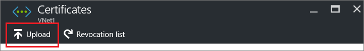
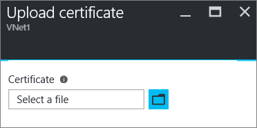

<properties
   pageTitle="Configurer une connexion de passerelle Point-à-Site VPN à un réseau virtuel Azure à l’aide du portail Azure | Microsoft Azure"
   description="Connecter de façon sécurisée à votre réseau virtuel Azure en créant une connexion de passerelle VPN Point-à-Site à l’aide du portail Azure."
   services="vpn-gateway"
   documentationCenter="na"
   authors="cherylmc"
   manager="carmonm"
   editor=""
   tags="azure-service-management"/>

<tags
   ms.service="vpn-gateway"
   ms.devlang="na"
   ms.topic="hero-article"
   ms.tgt_pltfrm="na"
   ms.workload="infrastructure-services"
   ms.date="10/17/2016"
   ms.author="cherylmc"/>

# Configurer une connexion Point-à-Site à un VNet à l’aide du portail Azure

> [AZURE.SELECTOR]
- [Responsable de ressources - portail Azure](vpn-gateway-howto-point-to-site-resource-manager-portal.md)
- [Responsable de ressources - PowerShell](vpn-gateway-howto-point-to-site-rm-ps.md)
- [Classique - portail Azure](vpn-gateway-howto-point-to-site-classic-azure-portal.md)

Cet article vous guide dans la création d’un VNet avec une connexion Point-à-Site dans le modèle de déploiement classique à l’aide du portail Azure. Configuration d’un Point de Site (P2S) vous permet de créer une connexion sécurisée à partir d’un ordinateur client à un réseau virtuel. Une connexion P2S est utile lorsque vous voulez vous connecter à votre VNet depuis un emplacement distant, tels que d’accueil ou d’une conférence. Ou bien, lorsque vous n’avez que quelques clients qui doivent se connecter à un réseau virtuel.

Connexions point-à-Site ne nécessitent pas un périphérique VPN ou une adresse IP au public pour l’utiliser. Une connexion VPN est établie en démarrant la connexion à partir de l’ordinateur client. Pour plus d’informations sur les connexions Point-à-Site, voir le [Forum aux questions de la passerelle VPN](vpn-gateway-vpn-faq.md#point-to-site-connections) et [Sur VPN passerelle](vpn-gateway-about-vpngateways.md#point-to-site).

### Modèles de déploiement et méthodes pour les connexions P2S

[AZURE.INCLUDE [deployment models](../../includes/vpn-gateway-deployment-models-include.md)] 

Le tableau suivant montre les deux modèles de déploiement et les méthodes de déploiement disponibles pour les configurations P2S. Lorsqu’un article avec des étapes de configuration est disponible, nous attacher directement à partir de ce tableau.

[AZURE.INCLUDE [vpn-gateway-clasic-rm](../../includes/vpn-gateway-table-point-to-site-include.md)] 

## Flux de travail 

![Point-à-Site-diagramme] (./media/vpn-gateway-howto-point-to-site-rm-ps/p2srm.png "point-à-site")

Les sections suivantes décrivent les étapes pour créer une connexion Point-à-Site sécurisée à un réseau virtuel. 

1. Créer un réseau virtuel et passerelle VPN
2. Générer des certificats
3. Téléchargez le fichier .cer
4. Générer le package de configuration du client VPN
5. Configurer l’ordinateur client
6. Se connecter à Azure

### Exemples de paramètres

Vous pouvez utiliser les paramètres de l’exemple suivant :

- **Nom : VNet1**
- **Espace d’adressage : 192.168.0.0/16**
- **Nom du sous-réseau : FrontEnd**
- **Plage d’adresses sous-réseau : 192.168.1.0/24**
- **Abonnement :** Si vous avez plusieurs abonnements, vérifiez que vous utilisez celui qui convient.
- **Groupe de ressources : TestRG**
- **Emplacement : États-Unis l'**
- **Type de connexion : Point-à-site**
- **Espace d’adressage client : 172.16.201.0/24**. Les clients VPN qui se connectent à la VNet à l’aide de cette connexion Point-à-Site reçoivent une adresse IP du pool spécifié.
- **GatewaySubnet : 192.168.200.0/24**. Le sous-réseau passerelle doit utiliser le nom « GatewaySubnet ».
- **Taille :** Sélectionnez la passerelle de référence (SKU) que vous voulez utiliser.
- **Type de routage : dynamique**

## Section 1 : créer un réseau virtuel et une passerelle VPN

### Partie 1 : Créer un réseau virtuel

Si vous n’avez pas déjà un réseau virtuel, créez-en un. Captures d’écran sont fournies comme exemples. N’oubliez pas de remplacer les valeurs par votre propre. Pour créer un VNet à l’aide du portail Azure, procédez comme suit : 

1. À partir d’un navigateur, accédez au [portail Azure](http://portal.azure.com) et, si nécessaire, connectez-vous avec votre compte Azure.

2. Cliquez sur **Nouveau**. Dans le champ de **recherche sur le marché** , tapez « Réseau virtuel ». Recherchez **Réseau virtuel** de la liste retournée et cliquez sur pour ouvrir la carte **Réseau virtuel** .

    ![Recherchez la carte réseau virtuel] (./media/vpn-gateway-howto-point-to-site-classic-azure-portal/newvnetportal700.png "Recherchez la carte réseau virtuel")

3. Près du bas de la carte réseau virtuel, dans la liste **Sélectionner un modèle de déploiement** , sélectionnez **classique**, puis cliquez sur **créer**.

    ![Sélectionnez le modèle de déploiement] (./media/vpn-gateway-howto-point-to-site-classic-azure-portal/selectmodel.png "Sélectionnez le modèle de déploiement")

4. Sur la carte **réseau virtuel créer** , configurer les paramètres VNet. Dans cette carte, vous allez ajouter votre premier espace d’adressage et une plage d’adresses sous-réseau unique. Après avoir créé le VNet, vous pouvez revenir en arrière et ajouter des sous-réseaux supplémentaires et espaces d’adresse.

    ![Carte de réseau virtuel créer] (./media/vpn-gateway-howto-point-to-site-classic-azure-portal/vnet125.png "Carte de réseau virtuel créer")

5. Vérifiez que l' **abonnement** est correcte. Vous pouvez modifier les abonnements à l’aide de la liste déroulante.

6. Cliquez sur **groupe de ressources** et soit sélectionnez un groupe de ressources existant ou créez-en une en tapant un nom pour votre nouveau groupe de ressources. Si vous créez un nouveau groupe, nommez le groupe de ressources en fonction des valeurs de votre configuration planifiée. Pour plus d’informations sur les groupes de ressources, consultez [Vue d’ensemble du Gestionnaire de ressources Azure](azure-resource-manager/resource-group-overview.md#resource-groups).

7. Ensuite, sélectionnez les paramètres **d’emplacement** pour votre VNet. Détermine l’emplacement dans lequel se trouve les ressources que vous déployez sur ce VNet.

8. Sélectionnez **Ajouter au tableau de bord** si vous voulez être en mesure de trouver facilement votre VNet du tableau de bord, puis cliquez sur **créer**.
    
    ![Épingler au tableau de bord] (./media/vpn-gateway-howto-point-to-site-classic-azure-portal/pintodashboard150.png "Épingler au tableau de bord")

9. Après avoir cliqué sur Créer, vous verrez une vignette dans votre tableau de bord qui reflète la progression de votre VNet. La vignette change à mesure que le VNet est créé.

    ![Vignette de réseau virtuel création] (./media/vpn-gateway-howto-point-to-site-classic-azure-portal/deploying150.png "Vignette de réseau virtuel création")

10. Après avoir créé votre réseau virtuel, vous pouvez ajouter l’adresse IP d’un serveur DNS afin de gérer la résolution de noms. Ouvrir les paramètres de votre réseau virtuel, cliquez sur DNS servers et ajoutez l’adresse IP du serveur DNS que vous voulez utiliser. Ce paramètre ne crée pas un nouveau serveur DNS. Veillez à ajouter un serveur DNS capable de communiquer avec vos ressources.

Une fois que votre réseau virtuel a été créé, vous verrez **que créé** répertorié sous **statut** sur la page réseaux dans le portail classique Azure.

### Partie 2 : Créer une passerelle sous-réseau et une passerelle routage dynamique

Dans cette étape, vous allez créer un sous-réseau passerelle et une passerelle routage dynamique. Dans le portail Azure pour le modèle de déploiement classique, la création du sous-réseau passerelle et la passerelle peut être effectuée via les mêmes cartes de configuration.

1. Dans le portail, accédez au réseau virtuel pour lequel vous souhaitez créer une passerelle.

2. Dans la carte pour votre réseau virtuel, sur la carte de **vue d’ensemble** , dans la section de connexions VPN, cliquez sur **passerelle**.

    ![Cliquez ici pour créer une passerelle] (./media/vpn-gateway-howto-point-to-site-classic-azure-portal/beforegw125.png "Cliquez ici pour créer une passerelle")

3. Dans la carte de la **Nouvelle connexion VPN** , sélectionnez **Point-à-site**.

    ![Type de connexion P2S] (./media/vpn-gateway-howto-point-to-site-classic-azure-portal/newvpnconnect.png "Type de connexion P2S")

4. Pour l' **Espace d’adressage Client**, ajoutez la plage d’adresses IP. Il s’agit de la plage à partir de laquelle les clients VPN reçoivent une adresse IP lors de la connexion. Supprimer la plage de remplissage automatique et ajoutez vos propres.

    ![Espace d’adressage client] (./media/vpn-gateway-howto-point-to-site-classic-azure-portal/clientaddress.png "Espace d’adressage client")

5. Activez la case à cocher **créer passerelle immédiatement** .

    ![Passerelle créer immédiatement] (./media/vpn-gateway-howto-point-to-site-classic-azure-portal/creategwimm.png "Passerelle créer immédiatement")

6. Cliquez sur la **configuration de la passerelle facultatif** pour ouvrir la carte de **configuration de la passerelle** .

    ![Cliquez sur configuration de la passerelle facultatif] (./media/vpn-gateway-howto-point-to-site-classic-azure-portal/optsubnet125.png "Cliquez sur configuration de la passerelle facultatif")

7. Cliquez sur **sous-réseau configurer les paramètres requis** pour ajouter le **sous-réseau passerelle**. Bien qu’il soit possible de créer un sous-réseau passerelle aussi petite que /29, nous vous recommandons de créer un sous-réseau plus grand incluant plusieurs adresses en sélectionnant au moins /28 ou /27. Cette option permet de suffisamment d’adresses pour accueillir les configurations possibles supplémentaires que vous souhaiterez peut-être à l’avenir.

    >[AZURE.IMPORTANT] Lorsque vous travaillez avec des sous-réseaux passerelle, évitez d’association d’un groupe de sécurité réseau (NSG) au sous-réseau passerelle. Associer un groupe de sécurité réseau vers ce sous-réseau peut entraîner votre passerelle VPN arrêter fonctionne comme prévu. Pour plus d’informations sur les groupes de sécurité réseau, voir [qu’est un groupe de sécurité réseau ?](../articles/virtual-network/virtual-networks-nsg.md)

    ![Ajouter GatewaySubnet] (./media/vpn-gateway-howto-point-to-site-classic-azure-portal/gwsubnet125.png "Ajouter GatewaySubnet")

8. Sélectionnez la **taille**de la passerelle. Il s’agit de la passerelle de référence (SKU) que vous utiliserez pour créer votre passerelle réseau virtuel. Dans le portail, la référence par défaut est **simple**. Pour plus d’informations sur la passerelle références SKU, consultez [VPN passerelle paramètres](../articles/vpn-gateway/vpn-gateway-about-vpn-gateway-settings.md#gwsku).

    

9. Sélectionnez le **Type de routage** de la passerelle. Configurations P2S nécessitent un type de routage **dynamique** . Cliquez sur **OK** lorsque vous avez terminé de configurer cette carte.

    ![Configurer un type de routage] (./media/vpn-gateway-howto-point-to-site-classic-azure-portal/routingtype125.png "Configurer un type de routage")

10. Dans la carte de la **Nouvelle connexion VPN** , cliquez sur **OK** dans la partie inférieure de la cuillère pour commencer à créer votre passerelle réseau virtuel. Cela peut prendre jusqu'à 45 minutes. 

## Section 2 : générer des certificats

Certificats sont utilisés par Azure pour authentifier les clients VPN pour Point-à-Site VPN. Vous exportez des données de certificat public (pas la clé privée) en tant que Base-64 codé X.509 .cer fichier à partir d’un certificat racine générés par une solution certificat d’entreprise, ou un certificat auto-signé. Vous ensuite importez les données du certificat public à partir du certificat racine vers Azure. En outre, vous devez générer un certificat client à partir du certificat racine pour les clients. Chaque client qui souhaite se connecter au réseau virtuel à l’aide d’une connexion P2S doit avoir un certificat client installé qui a été généré à partir du certificat racine.

### Partie 1 : Obtenir le fichier .cer pour le certificat racine

Si vous utilisez une solution d’entreprise, vous pouvez utiliser votre chaîne du certificat existant. Si vous n’utilisez pas une solution autorité de certification d’entreprise, vous pouvez créer un certificat auto-signé racine. Méthode de création d’un certificat auto-signé est makecert.

- Si vous utilisez un système de certificat d’entreprise, procurez-vous le fichier .cer pour le certificat racine que vous voulez utiliser. 

- Si vous n’utilisez pas une solution certificat d’entreprise, vous devez créer un certificat auto-signé. Pour obtenir la procédure Windows 10, vous pouvez faire référence à [l’utilisation des certificats racine auto-signé configurations Point-à-Site](vpn-gateway-certificates-point-to-site.md).

1. Pour obtenir un fichier .cer à partir d’un certificat, ouvrez **certmgr.msc** et recherchez le certificat racine. Cliquez sur le certificat auto-signé racine et cliquez sur **toutes les tâches**, puis cliquez sur **Exporter**. Cette action ouvre l' **Assistant Exportation de certificat**.

2. Dans l’Assistant, cliquez sur **suivant**, sélectionnez **non, ne pas exporter la clé privée**, puis sur **suivant**.

3. Dans la page **Format de fichier d’exportation** , sélectionnez **Base 64 codé X.509 (. Limitée).** Ensuite, cliquez sur **suivant**. 

4. Sur le **fichier à exporter**, **accédez** à l’emplacement auquel vous voulez exporter le certificat. Pour **nom de fichier**, nommez le fichier de certificat. Cliquez sur **suivant**.

5. Cliquez sur **Terminer** pour exporter le certificat.

### Partie 2 : Générer un certificat client

Vous pouvez soit générer un certificat unique pour chaque client qui va se connecter ou vous pouvez utiliser le même certificat sur plusieurs clients. La génération de certificats client unique a la possibilité de révoquer un certificat unique si nécessaire. Dans le cas contraire, si tout le monde utilise le même certificat client et que vous deviez révoquer le certificat pour un client, vous devrez générer et installer de nouveaux certificats pour tous les clients qui utilisent ce certificat s’authentifier.

- Si vous utilisez une solution certificat d’entreprise, générer un certificat client avec le format de valeur nom courant 'name@yourdomain.com', plutôt que la mise en forme « DOMAINE\nom d’utilisateur ». 

- Si vous utilisez un certificat auto-signé, voir [utilisation des certificats racine auto-signé configurations Point-à-Site](vpn-gateway-certificates-point-to-site.md) pour générer un certificat client.

### Partie 3 : Exporter le certificat client

Installer un certificat client sur chaque ordinateur sur lequel vous voulez vous connecter au réseau virtuel. Un certificat client est requis pour l’authentification. Vous pouvez automatiser l’installation du certificat client, ou vous pouvez l’installer manuellement. Les étapes suivantes vous aide à l’exportation et d’installer le certificat client manuellement.

1. Pour exporter un certificat client, vous pouvez utiliser *certmgr.msc*. Clic droit sur le certificat client que vous voulez exporter, cliquez sur **toutes les tâches**, puis cliquez sur **Exporter**.
2. Exportez le certificat client avec la clé privée. Il s’agit d’un fichier *.pfx* . Veillez à enregistrer ou de mémoriser le mot de passe (clé) que vous avez défini pour ce certificat.

## Section 3 : télécharger le fichier .cer de certificat racine

Une fois que la passerelle a été créée, vous pouvez télécharger le fichier .cer pour un certificat racine de confiance sur Azure. Vous pouvez télécharger des fichiers pour jusqu'à 20 certificats racine. Vous ne pas Téléchargez la clé privée pour le certificat racine vers Azure. Une fois le fichier .cer est téléchargé, Azure utilise pour authentifier les clients qui se connectent au réseau virtuel.

1. Dans la section **connexions VPN** de la cuillère pour votre VNet, cliquez sur le graphique de **clients** pour ouvrir la **Point-à-site VPN connexion** carte.

    ![Clients] (./media/vpn-gateway-howto-point-to-site-classic-azure-portal/clients125.png "Clients")

2. Sur la connexion **Point-à-site** carte, cliquez sur **Gérer les certificats** pour ouvrir la carte de **certificats** . 

      

3. Dans la carte de **certificats** , cliquez sur **Télécharger** pour ouvrir la carte de **Télécharger le certificat** . 

     

4. Cliquez sur le graphique de dossier pour rechercher le fichier .cer. Sélectionnez le fichier, puis cliquez sur **OK**. Actualisez la page pour afficher le certificat téléchargé dans la carte de **certificats** .

     
    

## Section 4 : générer le package de configuration du client VPN

Pour vous connecter au réseau virtuel, vous devez également configurer un client VPN. L’ordinateur client requiert un certificat client et le package de configuration du client VPN approprié pour se connecter.

Le package de client VPN contient des informations de configuration pour configurer le logiciel client VPN intégré à Windows. Le package n’installe pas de logiciel supplémentaire. Les paramètres sont spécifiques au réseau virtuel que vous voulez vous connecter. Pour la liste des systèmes d’exploitation pris en charge, consultez les connexions [Point-à-Site](vpn-gateway-vpn-faq.md#point-to-site-connections) section le Forum aux questions de la passerelle VPN. 

### Pour générer le package de configuration du client VPN

1. Dans le portail Azure, dans la carte de **présentation** pour votre VNet, des **connexions VPN**, cliquez sur le graphique de client pour ouvrir la **Point-à-site VPN connexion** carte.
2. En haut de la **Point-à-site VPN connexion** carte, cliquez sur le package de téléchargement qui correspond au système d’exploitation client sur lequel il sera installé :

 - Pour les clients 64 bits, sélectionnez **Client VPN (64 bits)**.
 - Pour les clients 32 bits, sélectionnez **Client VPN (32 bits)**.

     

3. Vous verrez un message que Azure génère le package de configuration du client VPN pour le réseau virtuel. Après quelques minutes, le package est généré et vous verrez un message sur votre ordinateur local que le package a été téléchargé. Enregistrez le fichier de package de configuration. Vous allez l’installer sur chaque ordinateur client qui se connecteront au réseau virtuel à l’aide de P2S.

## Section 5 : configurer l’ordinateur client

### Partie 1 : Installer le certificat client

Chaque ordinateur client doit disposer d’un certificat client afin de s’authentifier. Lorsque vous installez le certificat client, vous devez le mot de passe qui a été créé lorsque le certificat client a été exporté.

1. Copiez le fichier .pfx sur l’ordinateur client.
2. Double-cliquez sur le fichier .pfx pour l’installer. Ne modifiez pas l’emplacement d’installation.

### Partie 2 : Installer le module de configuration de client VPN

Vous pouvez utiliser le même package de configuration de client VPN sur chaque ordinateur client, si la version correspondant à l’architecture pour le client.

1. Copiez le fichier de configuration localement sur l’ordinateur que vous voulez vous connecter à votre réseau virtuel et double-cliquez sur le fichier .exe. 

2. Une fois que le package a installé, vous pouvez démarrer la connexion VPN. Le package de configuration n’est pas signé par Microsoft. Vous pouvez pour signer le package à l’aide du service de signature de votre organisation ou se vous-même à l’aide de [SignTool]( http://go.microsoft.com/fwlink/p/?LinkId=699327). Il est OK à utiliser le package sans vous connecter. Toutefois, si le package n’est pas connecté, un avertissement s’affiche lorsque vous installez le package.

3. Sur l’ordinateur client, accédez aux **Paramètres du réseau** et cliquez sur **VPN**. Vous verrez la connexion répertoriée. Il affiche le nom du réseau virtuel qu’il doit se connecter et doit ressembler à ceci : 

    ![Client VPN] (./media/vpn-gateway-howto-point-to-site-classic-azure-portal/vpn.png "Client VPN VNet")

## Section 6 : se connecter à Azure

### Se connecter à votre VNet

1. Pour vous connecter à votre VNet, sur l’ordinateur client, accédez à connexions VPN, puis recherchez la connexion VPN que vous avez créé. Il porte le même nom que votre réseau virtuel. Cliquez sur **se connecter**. Affichage d’un message peut s’afficher qui fait référence à l’aide du certificat. Dans ce cas, cliquez sur **Continuer** pour utiliser des privilèges élevés. 

2. Dans la page d’état de **connexion** , cliquez sur **se connecter** pour démarrer la connexion. Si vous voyez un écran **Sélectionner un certificat** , vérifiez que le certificat client affichant est celle que vous souhaitez utiliser pour vous connecter. Si elle n’est pas le cas, utilisez la flèche déroulante pour sélectionner le certificat approprié, puis cliquez sur **OK**.

    ![Se connecter] (./media/vpn-gateway-howto-point-to-site-classic-azure-portal/clientconnect.png "Connexion du client VPN")

3. Votre connexion doit maintenant être établie.

    ![Connexion établie] (./media/vpn-gateway-howto-point-to-site-classic-azure-portal/connected.png "Établir la connexion")

### Vérifiez la connexion VPN

1. Pour vérifier que votre connexion VPN est active, ouvrez une invite de commandes avec élévation de privilèges et exécutez *ipconfig/all*.
2. Afficher les résultats. Notez que l’adresse IP que vous avez reçu est une des adresses dans la plage d’adresses de connectivité Point-à-Site que vous avez spécifié lorsque vous avez créé votre VNet. Les résultats doivent être doit ressembler à ceci :

Exemple :

    PPP adapter VNet1:
        Connection-specific DNS Suffix .:
        Description.....................: VNet1
        Physical Address................:
        DHCP Enabled....................: No
        Autoconfiguration Enabled.......: Yes
        IPv4 Address....................: 192.168.130.2(Preferred)
        Subnet Mask.....................: 255.255.255.255
        Default Gateway.................:
        NetBIOS over Tcpip..............: Enabled

## Étapes suivantes

Vous pouvez ajouter des machines virtuelles à votre réseau virtuel. Découvrez [comment créer une machine virtuelle personnalisée](../virtual-machines/virtual-machines-windows-classic-createportal.md).