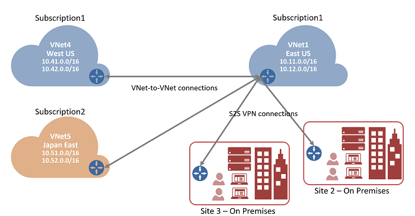

<properties
   pageTitle="Contacter VNets Azure passerelle VPN et PowerShell | Microsoft Azure"
   description="Cet article vous guide tout au long de relier des réseaux virtuels en utilisant le Gestionnaire de ressources Azure et PowerShell."
   services="vpn-gateway"
   documentationCenter="na"
   authors="cherylmc"
   manager="carmonm"
   editor=""
   tags="azure-resource-manager"/>

<tags
   ms.service="vpn-gateway"
   ms.devlang="na"
   ms.topic="get-started-article"
   ms.tgt_pltfrm="na"
   ms.workload="infrastructure-services"
   ms.date="08/31/2016"
   ms.author="cherylmc"/>

# Configurer une connexion VNet-VNet pour le Gestionnaire de ressources à l’aide de PowerShell

> [AZURE.SELECTOR]
- [Responsable de ressources - portail Azure](vpn-gateway-howto-vnet-vnet-resource-manager-portal.md)
- [Responsable de ressources - PowerShell](vpn-gateway-vnet-vnet-rm-ps.md)
- [Classique - portail classique](virtual-networks-configure-vnet-to-vnet-connection.md)

Cet article vous explique comment procéder pour créer une connexion entre VNets dans le modèle de déploiement Gestionnaire de ressources à l’aide de passerelle VPN. Les réseaux virtuels peuvent être dans les régions identiques ou différentes et à partir d’abonnements identiques ou différents.

### Modèles de déploiement et méthodes pour les connexions VNet-VNet

[AZURE.INCLUDE [deployment models](../../includes/vpn-gateway-deployment-models-include.md)]

Le tableau suivant indique les modèles de déploiement actuellement disponibles et les méthodes pour les configurations VNet-VNet. Lorsqu’un article avec des étapes de configuration est disponible, nous attacher directement à partir de ce tableau.

[AZURE.INCLUDE [vpn-gateway-table-vnet-vnet](../../includes/vpn-gateway-table-vnet-to-vnet-include.md)]

#### VNet peering

[AZURE.INCLUDE [vpn-gateway-vnetpeeringlink](../../includes/vpn-gateway-vnetpeeringlink-include.md)]

## À propos des connexions VNet-VNet

Connexion d’un réseau virtuel à un autre réseau virtuel (VNet-VNet) est similaire à connecter un VNet à un emplacement de site local. Les deux types de connectivité permet de fournir un tunnel sécurisé à l’aide de IPsec/IKE une passerelle VPN Azure. La VNets que vous vous connectez peut être dans différentes régions. Ou dans différents abonnements. Vous pouvez même combiner VNet-VNet communication avec des configurations sur plusieurs sites. Cela vous permet de vous établissez topologies réseau combiner croisée locaux connectivité avec la connectivité réseau entre virtuel, comme le montre l’illustration suivante :

 
### Pourquoi connecter réseaux virtuels ?

Vous souhaiterez peut-être connecter des réseaux virtuels pour les raisons suivantes :

- **Région croisée geo-redondance et geo présence**
    - Vous pouvez configurer votre propre geo-réplication ou de synchronisation avec une connexion sécurisée sans passer par les points de terminaison via Internet.
    - Avec Azure le trafic responsable et équilibrage de charge, vous pouvez configurer la charge de travail hautement disponible avec geo redondance dans plusieurs régions Azure. Exemple importantes, vous pouvez configurer SQL toujours dans des groupes de disponibilité répartition sur plusieurs régions Azure.

- **Applications à plusieurs niveaux régionale avec isolement ou limite administrative**
    - Dans la zone de même, vous pouvez configurer des applications multicouches avec plusieurs réseaux virtuels interconnectés en raison d’isolement ou besoins d’administration.

### Forum aux questions VNet-VNet

[AZURE.INCLUDE [vpn-gateway-vnet-vnet-faq](../../includes/vpn-gateway-vnet-vnet-faq-include.md)] 

## L’ensemble des étapes dois-je utiliser ?

Dans cet article, vous voyez deux séries différentes étapes. Un d’ensemble des étapes pour [VNets qui se trouvent dans le même abonnement](#samesub)et l’autre pour [VNets qui se trouvent dans différents abonnements](#difsub). La différence entre les jeux de clé est que vous pouvez créer et configurer tous les réseau virtuel et ressources de la passerelle dans la même session PowerShell.

Les étapes décrites dans cet article utilisent des variables qui sont déclarées au début de chaque section. Si vous travaillez déjà avec VNets existants, modifiez les variables pour refléter les paramètres de votre environnement. 

## Comment se connecter VNets qui se trouvent dans le même abonnement

### Avant de commencer
    
Avant de commencer, vous devez installer les applets de commande PowerShell de gestionnaire de ressources Azure. Découvrez [comment installer et configurer Azure PowerShell](../powershell-install-configure.md) pour plus d’informations sur l’installation les applets de commande PowerShell.

### Étape 1 : planifier votre plages d’adresses IP

Dans la procédure suivante, nous créons deux réseaux virtuels ainsi que leurs sous-réseaux respectifs passerelle et les configurations. Nous puis créez une connexion VPN entre les deux VNets. Il est important de planifier les plages d’adresses IP pour la configuration de votre réseau. N’oubliez pas que vous devez vous assurer qu’aucune des votre VNet plages ou des plages de réseau local se chevauchent d’aucune manière.

Nous utilisons les valeurs suivantes dans les exemples :

**Valeurs pour TestVNet1 :**

- Nom de VNet : TestVNet1
- Groupe de ressources : TestRG1
- Emplacement : États-Unis l'
- TestVNet1 : 10.11.0.0/16 & 10.12.0.0/16
- FrontEnd : 10.11.0.0/24
- Serveur principal : 10.12.0.0/24
- GatewaySubnet : 10.12.255.0/27
- Serveur DNS : 8.8.8.8
- Nom de la passerelle : VNet1GW
- Adresse IP publique : VNet1GWIP
- VPNType : RouteBased
- Connection(1to4) : VNet1toVNet4
- Connection(1to5) : VNet1toVNet5
- ConnectionType : VNet2VNet

**Valeurs pour TestVNet4 :**

- Nom de VNet : TestVNet4
- TestVNet2 : 10.41.0.0/16 & 10.42.0.0/16
- FrontEnd : 10.41.0.0/24
- Serveur principal : 10.42.0.0/24
- GatewaySubnet : 10.42.255.0/27
- Groupe de ressources : TestRG4
- Emplacement : États-Unis Ouest
- Serveur DNS : 8.8.8.8
- Nom de la passerelle : VNet4GW
- Adresse IP publique : VNet4GWIP
- VPNType : RouteBased
- Connexion : VNet4toVNet1
- ConnectionType : VNet2VNet

### Étape 2 : créer et configurer TestVNet1

1. Déclarer vos variables

    Commencez par déclaration des variables. Cet exemple déclare les variables en utilisant les valeurs pour cet exercice. Dans la plupart des cas, vous devez remplacer les valeurs par la vôtre. Toutefois, vous pouvez utiliser ces variables si vous exécutez les étapes pour vous familiariser avec ce type de configuration. Modifiez les variables si nécessaire, puis copiez et collez-les dans votre console PowerShell.

        $Sub1 = "Replace_With_Your_Subcription_Name"
        $RG1 = "TestRG1"
        $Location1 = "East US"
        $VNetName1 = "TestVNet1"
        $FESubName1 = "FrontEnd"
        $BESubName1 = "Backend"
        $GWSubName1 = "GatewaySubnet"
        $VNetPrefix11 = "10.11.0.0/16"
        $VNetPrefix12 = "10.12.0.0/16"
        $FESubPrefix1 = "10.11.0.0/24"
        $BESubPrefix1 = "10.12.0.0/24"
        $GWSubPrefix1 = "10.12.255.0/27"
        $DNS1 = "8.8.8.8"
        $GWName1 = "VNet1GW"
        $GWIPName1 = "VNet1GWIP"
        $GWIPconfName1 = "gwipconf1"
        $Connection14 = "VNet1toVNet4"
        $Connection15 = "VNet1toVNet5"

2. Se connecter à votre abonnement

    Basculer en mode de PowerShell pour utiliser les applets de commande Gestionnaire de ressources. Ouvrez votre console PowerShell et connectez-vous à votre compte. Pour vous aider à vous connecter, utilisez l’exemple suivant :

        Login-AzureRmAccount

    Vérifier les abonnements pour le compte.

        Get-AzureRmSubscription 

    Spécifier l’abonnement que vous voulez utiliser.

        Select-AzureRmSubscription -SubscriptionName $Sub1

3. Créer un nouveau groupe de ressources

        New-AzureRmResourceGroup -Name $RG1 -Location $Location1

4. Créer les configurations sous-réseau pour TestVNet1

    Cet exemple crée un réseau virtuel nommé TestVNet1 et trois sous-réseaux, une GatewaySubnet appelée, FrontEnd appelée une et un serveur principal appelé. Remplacer les valeurs, il est important que vous nommez toujours votre sous-réseau passerelle spécifiquement GatewaySubnet. Si vous nommez autre chose, la création de votre passerelle échouera. 

    L’exemple suivant utilise les variables que vous avez défini précédemment. Dans cet exemple, le sous-réseau passerelle est en utilisant un /27. Bien qu’il soit possible de créer un sous-réseau passerelle aussi petite que /29, nous vous recommandons de créer un sous-réseau plus grand incluant plusieurs adresses en sélectionnant au moins /28 ou /27. Cette option permet de suffisamment d’adresses pour accueillir les configurations possibles supplémentaires que vous souhaiterez peut-être à l’avenir. 

        $fesub1 = New-AzureRmVirtualNetworkSubnetConfig -Name $FESubName1 -AddressPrefix $FESubPrefix1
        $besub1 = New-AzureRmVirtualNetworkSubnetConfig -Name $BESubName1 -AddressPrefix $BESubPrefix1
        $gwsub1 = New-AzureRmVirtualNetworkSubnetConfig -Name $GWSubName1 -AddressPrefix $GWSubPrefix1

5. Créer TestVNet1

        New-AzureRmVirtualNetwork -Name $VNetName1 -ResourceGroupName $RG1 `
        -Location $Location1 -AddressPrefix $VNetPrefix11,$VNetPrefix12 -Subnet $fesub1,$besub1,$gwsub1

6. Demander une adresse IP publique

    Demander une adresse IP publique à allouer à la passerelle, que vous allez créer pour votre VNet. Notez que la AllocationMethod est dynamique. Vous ne pouvez pas spécifier l’adresse IP que vous souhaitez utiliser. Il est affectée dynamiquement à votre passerelle. 

        $gwpip1 = New-AzureRmPublicIpAddress -Name $GWIPName1 -ResourceGroupName $RG1 `
        -Location $Location1 -AllocationMethod Dynamic

7. Créer la configuration de la passerelle

    La configuration de passerelle définit le sous-réseau et l’adresse IP à utiliser. L’exemple permet de créer votre configuration de la passerelle. 

        $vnet1 = Get-AzureRmVirtualNetwork -Name $VNetName1 -ResourceGroupName $RG1
        $subnet1 = Get-AzureRmVirtualNetworkSubnetConfig -Name "GatewaySubnet" -VirtualNetwork $vnet1
        $gwipconf1 = New-AzureRmVirtualNetworkGatewayIpConfig -Name $GWIPconfName1 `
        -Subnet $subnet1 -PublicIpAddress $gwpip1

8. Créer la passerelle pour TestVNet1

    Dans cette étape, vous créez la passerelle réseau virtuel pour votre TestVNet1. Configurations VNet-VNet nécessitent une RouteBased VpnType. Création d’une passerelle peut prendre un certain temps (45 minutes ou plus).

        New-AzureRmVirtualNetworkGateway -Name $GWName1 -ResourceGroupName $RG1 `
        -Location $Location1 -IpConfigurations $gwipconf1 -GatewayType Vpn `
        -VpnType RouteBased -GatewaySku Standard

### Étape 3 : créer et configurer TestVNet4

Une fois que vous avez configuré TestVNet1, créez TestVNet4. Suivez les étapes ci-dessous, en remplaçant les valeurs par votre propre lorsque cela est nécessaire. Cette étape peut être effectuée dans la même session PowerShell, car il se trouve dans le même abonnement.

1. Déclarer vos variables

    N’oubliez pas de remplacer les valeurs par celles que vous souhaitez utiliser pour votre configuration.

        $RG4 = "TestRG4"
        $Location4 = "West US"
        $VnetName4 = "TestVNet4"
        $FESubName4 = "FrontEnd"
        $BESubName4 = "Backend"
        $GWSubName4 = "GatewaySubnet"
        $VnetPrefix41 = "10.41.0.0/16"
        $VnetPrefix42 = "10.42.0.0/16"
        $FESubPrefix4 = "10.41.0.0/24"
        $BESubPrefix4 = "10.42.0.0/24"
        $GWSubPrefix4 = "10.42.255.0/27"
        $DNS4 = "8.8.8.8"
        $GWName4 = "VNet4GW"
        $GWIPName4 = "VNet4GWIP"
        $GWIPconfName4 = "gwipconf4"
        $Connection41 = "VNet4toVNet1"

    Avant de poursuivre, vérifiez que vous êtes toujours connecté à 1 de l’abonnement.

2. Créer un nouveau groupe de ressources

        New-AzureRmResourceGroup -Name $RG4 -Location $Location4

3. Créer les configurations sous-réseau pour TestVNet4

        $fesub4 = New-AzureRmVirtualNetworkSubnetConfig -Name $FESubName4 -AddressPrefix $FESubPrefix4
        $besub4 = New-AzureRmVirtualNetworkSubnetConfig -Name $BESubName4 -AddressPrefix $BESubPrefix4
        $gwsub4 = New-AzureRmVirtualNetworkSubnetConfig -Name $GWSubName4 -AddressPrefix $GWSubPrefix4

4. Créer TestVNet4

        New-AzureRmVirtualNetwork -Name $VnetName4 -ResourceGroupName $RG4 `
        -Location $Location4 -AddressPrefix $VnetPrefix41,$VnetPrefix42 -Subnet $fesub4,$besub4,$gwsub4

5. Demander une adresse IP publique

        $gwpip4 = New-AzureRmPublicIpAddress -Name $GWIPName4 -ResourceGroupName $RG4 `
        -Location $Location4 -AllocationMethod Dynamic

6. Créer la configuration de la passerelle

        $vnet4 = Get-AzureRmVirtualNetwork -Name $VnetName4 -ResourceGroupName $RG4
        $subnet4 = Get-AzureRmVirtualNetworkSubnetConfig -Name "GatewaySubnet" -VirtualNetwork $vnet4
        $gwipconf4 = New-AzureRmVirtualNetworkGatewayIpConfig -Name $GWIPconfName4 -Subnet $subnet4 -PublicIpAddress $gwpip4

7. Création de la passerelle TestVNet4

        New-AzureRmVirtualNetworkGateway -Name $GWName4 -ResourceGroupName $RG4 `
        -Location $Location4 -IpConfigurations $gwipconf4 -GatewayType Vpn `
        -VpnType RouteBased -GatewaySku Standard

### Étape 4 : connecter les passerelles

1. Obtenir les deux passerelles réseau virtuel

    Dans cet exemple, car les deux passerelles se trouvent dans le même abonnement, cette étape peut être effectuée dans la même session PowerShell.

        $vnet1gw = Get-AzureRmVirtualNetworkGateway -Name $GWName1 -ResourceGroupName $RG1
        $vnet4gw = Get-AzureRmVirtualNetworkGateway -Name $GWName4 -ResourceGroupName $RG4

2. Créer le TestVNet1 à TestVNet4 connexion

    Dans cette étape, vous créez la connexion entre TestVNet1 et TestVNet4. Vous verrez une clé partagée référencée dans les exemples. Vous pouvez utiliser vos propres valeurs pour la clé partagée. Il est important que la clé partagée doit correspondre pour les deux connexions. Création d’une connexion peut prendre quelques instants pour terminer.

        New-AzureRmVirtualNetworkGatewayConnection -Name $Connection14 -ResourceGroupName $RG1 `
        -VirtualNetworkGateway1 $vnet1gw -VirtualNetworkGateway2 $vnet4gw -Location $Location1 `
        -ConnectionType Vnet2Vnet -SharedKey 'AzureA1b2C3'

3. Créer le TestVNet4 à TestVNet1 connexion

    Cette étape est semblable à celui ci-dessus, sauf que vous créez la connexion à partir de TestVNet4 à TestVNet1. Vérifiez que les clés partagés correspondent.

        New-AzureRmVirtualNetworkGatewayConnection -Name $Connection41 -ResourceGroupName $RG4 `
        -VirtualNetworkGateway1 $vnet4gw -VirtualNetworkGateway2 $vnet1gw -Location $Location4 `
        -ConnectionType Vnet2Vnet -SharedKey 'AzureA1b2C3'

    La connexion doit être établie après quelques minutes.

4. Vérifiez votre connexion. Consultez la section [comment vérifier votre connexion](#verify).

## Comment se connecter VNets qui se trouvent dans différents abonnements

Dans ce scénario, nous connecter TestVNet1 et TestVNet5. TestVNet1 et TestVNet5 se trouvent dans un autre abonnement. Les étapes pour cette configuration ajoutent une connexion VNet-VNet supplémentaire afin de connecter TestVNet1 à TestVNet5. 

La différence est que certaines des étapes de configuration doivent être effectuées dans une session PowerShell distincte dans le contexte de la deuxième abonnement. En particulier lorsque les deux abonnements appartiennent à des organisations différentes. 

Les instructions continuer à partir de la procédure précédente décrite ci-dessus. Vous devez effectuer [étape 1](#Step1) et [l’étape 2](#Step2) pour créer et configurer TestVNet1 et la passerelle VPN pour TestVNet1. Une fois que vous avez terminé l’étape 1 et l’étape 2, passez à l’étape 5 pour créer TestVNet5.

### Étape 5 : vérifier les plages d’adresses IP supplémentaires

Il est important de s’assurer que l’espace d’adressage IP du nouveau réseau virtuel, TestVNet5, ne chevauche pas d’un de vos VNet plages ou des plages de passerelle réseau local. 

Dans cet exemple, les réseaux virtuels peuvent appartenir à des organisations différentes. Pour cela, vous pouvez utiliser les valeurs suivantes pour le TestVNet5 :

**Valeurs pour TestVNet5 :**

- Nom de VNet : TestVNet5
- Groupe de ressources : TestRG5
- Emplacement : Japon Extrême-Orient
- TestVNet5 : 10.51.0.0/16 & 10.52.0.0/16
- FrontEnd : 10.51.0.0/24
- Serveur principal : 10.52.0.0/24
- GatewaySubnet : 10.52.255.0.0/27
- Serveur DNS : 8.8.8.8
- Nom de la passerelle : VNet5GW
- Adresse IP publique : VNet5GWIP
- VPNType : RouteBased
- Connexion : VNet5toVNet1
- ConnectionType : VNet2VNet

**Valeurs supplémentaires pour TestVNet1 :**

- Connexion : VNet1toVNet5

### Étape 6 : créer et configurer TestVNet5

Cette étape doit être effectuée dans le contexte du nouvel abonnement. Cette partie peut être effectuée par l’administrateur dans une autre organisation propriétaire de l’abonnement.

1. Déclarer vos variables

    N’oubliez pas de remplacer les valeurs par celles que vous souhaitez utiliser pour votre configuration.

        $Sub5 = "Replace_With_the_New_Subcription_Name"
        $RG5 = "TestRG5"
        $Location5 = "Japan East"
        $VnetName5 = "TestVNet5"
        $FESubName5 = "FrontEnd"
        $BESubName5 = "Backend"
        $GWSubName5 = "GatewaySubnet"
        $VnetPrefix51 = "10.51.0.0/16"
        $VnetPrefix52 = "10.52.0.0/16"
        $FESubPrefix5 = "10.51.0.0/24"
        $BESubPrefix5 = "10.52.0.0/24"
        $GWSubPrefix5 = "10.52.255.0/27"
        $DNS5 = "8.8.8.8"
        $GWName5 = "VNet5GW"
        $GWIPName5 = "VNet5GWIP"
        $GWIPconfName5 = "gwipconf5"
        $Connection51 = "VNet5toVNet1"

2. Se connecter à l’abonnement 5

    Ouvrez votre console PowerShell et connectez-vous à votre compte. Pour vous aider à vous connecter, utilisez l’exemple suivant :

        Login-AzureRmAccount

    Vérifier les abonnements pour le compte.

        Get-AzureRmSubscription 

    Spécifier l’abonnement que vous voulez utiliser.

        Select-AzureRmSubscription -SubscriptionName $Sub5

3. Créer un nouveau groupe de ressources

        New-AzureRmResourceGroup -Name $RG5 -Location $Location5

4. Créer les configurations sous-réseau pour TestVNet4
    
        $fesub5 = New-AzureRmVirtualNetworkSubnetConfig -Name $FESubName5 -AddressPrefix $FESubPrefix5
        $besub5 = New-AzureRmVirtualNetworkSubnetConfig -Name $BESubName5 -AddressPrefix $BESubPrefix5
        $gwsub5 = New-AzureRmVirtualNetworkSubnetConfig -Name $GWSubName5 -AddressPrefix $GWSubPrefix5

5. Créer TestVNet5

        New-AzureRmVirtualNetwork -Name $VnetName5 -ResourceGroupName $RG5 -Location $Location5 `
        -AddressPrefix $VnetPrefix51,$VnetPrefix52 -Subnet $fesub5,$besub5,$gwsub5

6. Demander une adresse IP publique

        $gwpip5 = New-AzureRmPublicIpAddress -Name $GWIPName5 -ResourceGroupName $RG5 `
        -Location $Location5 -AllocationMethod Dynamic

7. Créer la configuration de la passerelle

        $vnet5 = Get-AzureRmVirtualNetwork -Name $VnetName5 -ResourceGroupName $RG5
        $subnet5  = Get-AzureRmVirtualNetworkSubnetConfig -Name "GatewaySubnet" -VirtualNetwork $vnet5
        $gwipconf5 = New-AzureRmVirtualNetworkGatewayIpConfig -Name $GWIPconfName5 -Subnet $subnet5 -PublicIpAddress $gwpip5

8. Création de la passerelle TestVNet5

        New-AzureRmVirtualNetworkGateway -Name $GWName5 -ResourceGroupName $RG5 -Location $Location5 `
        -IpConfigurations $gwipconf5 -GatewayType Vpn -VpnType RouteBased -GatewaySku Standard

### Étape 7 : connecter les passerelles

Dans cet exemple, car les passerelles se trouvent dans les différents abonnements, nous avons fractionner cette étape en deux sessions PowerShell marquées comme [abonnement 1] et [abonnement 5].

1. **[Abonnement 1]** Obtenir la passerelle réseau virtuel pour 1 abonnement

    Assurez-vous de vous connecter et se connectez à 1 de l’abonnement.

        $vnet1gw = Get-AzureRmVirtualNetworkGateway -Name $GWName1 -ResourceGroupName $RG1

    Copier la sortie des éléments suivants et d’envoyer ces notes à l’administrateur d’abonnement 5 par courrier électronique ou une autre méthode.

        $vnet1gw.Name
        $vnet1gw.Id

    Ces deux éléments auront valeurs similaires à la sortie de l’exemple suivant :

        PS D:\> $vnet1gw.Name
        VNet1GW
        PS D:\> $vnet1gw.Id
        /subscriptions/b636ca99-6f88-4df4-a7c3-2f8dc4545509/resourceGroupsTestRG1/providers/Microsoft.Network/virtualNetworkGateways/VNet1GW

2. **[Abonnement 5]** Obtenir la passerelle réseau virtuel pour 5 de l’abonnement

    Assurez-vous de vous connecter et se connectez à 5 de l’abonnement.

        $vnet5gw = Get-AzureRmVirtualNetworkGateway -Name $GWName5 -ResourceGroupName $RG5

    Copier la sortie des éléments suivants et d’envoyer ces notes à l’administrateur de 1 abonnement par courrier électronique ou une autre méthode.

        $vnet5gw.Name
        $vnet5gw.Id

    Ces deux éléments auront valeurs similaires à la sortie de l’exemple suivant :

        PS C:\> $vnet5gw.Name
        VNet5GW
        PS C:\> $vnet5gw.Id
        /subscriptions/66c8e4f1-ecd6-47ed-9de7-7e530de23994/resourceGroups/TestRG5/providers/Microsoft.Network/virtualNetworkGateways/VNet5GW

3. **[Abonnement 1]** Créer le TestVNet1 à TestVNet5 connexion

    Dans cette étape, vous créez la connexion entre TestVNet1 et TestVNet5. La différence est que vnet5gw $ ne peut pas être obtenues directement car il se trouve dans un autre abonnement. Vous devrez créer un nouvel objet PowerShell avec les valeurs transmises par abonnement 1 dans la procédure ci-dessus. Utilisez l’exemple ci-dessous. Remplacez le nom, Id et clé partagée par vos propres valeurs. Il est important que la clé partagée doit correspondre pour les deux connexions. Création d’une connexion peut prendre quelques instants pour terminer.

    Vérifiez que vous vous connectez à 1 de l’abonnement. 
    
        $vnet5gw = New-Object Microsoft.Azure.Commands.Network.Models.PSVirtualNetworkGateway
        $vnet5gw.Name = "VNet5GW"
        $vnet5gw.Id   = "/subscriptions/66c8e4f1-ecd6-47ed-9de7-7e530de23994/resourceGroups/TestRG5/providers/Microsoft.Network/virtualNetworkGateways/VNet5GW"
        $Connection15 = "VNet1toVNet5"
        New-AzureRmVirtualNetworkGatewayConnection -Name $Connection15 -ResourceGroupName $RG1 -VirtualNetworkGateway1 $vnet1gw -VirtualNetworkGateway2 $vnet5gw -Location $Location1 -ConnectionType Vnet2Vnet -SharedKey 'AzureA1b2C3'

4. **[Abonnement 5]** Créer le TestVNet5 à TestVNet1 connexion

    Cette étape est semblable à celui ci-dessus, sauf que vous créez la connexion à partir de TestVNet5 à TestVNet1. La même procédure de création d’un objet PowerShell basé sur les valeurs obtenues à partir de 1 abonnement s’applique ici également. Dans cette étape, n’oubliez pas que les clés partagés correspondent.

    Vérifiez que vous vous connectez à 5 de l’abonnement.

        $vnet1gw = New-Object Microsoft.Azure.Commands.Network.Models.PSVirtualNetworkGateway
        $vnet1gw.Name = "VNet1GW"
        $vnet1gw.Id = "/subscriptions/b636ca99-6f88-4df4-a7c3-2f8dc4545509/resourceGroups/TestRG1/providers/Microsoft.Network/virtualNetworkGateways/VNet1GW "
        New-AzureRmVirtualNetworkGatewayConnection -Name $Connection51 -ResourceGroupName $RG5 -VirtualNetworkGateway1 $vnet5gw -VirtualNetworkGateway2 $vnet1gw -Location $Location5 -ConnectionType Vnet2Vnet -SharedKey 'AzureA1b2C3'

## Comment faire pour vérifier une connexion

[AZURE.INCLUDE [vpn-gateway-no-nsg-include](../../includes/vpn-gateway-no-nsg-include.md)]

[AZURE.INCLUDE [verify connection powershell](../../includes/vpn-gateway-verify-connection-ps-rm-include.md)] 

## Étapes suivantes

- Une fois que votre connexion est terminée, vous pouvez ajouter des machines virtuelles à vos réseaux virtuel. Pour obtenir la procédure, voir [créer une Machine virtuelle](../virtual-machines/virtual-machines-windows-hero-tutorial.md) .
- Pour plus d’informations sur BGP, consultez la [Vue d’ensemble BGP](vpn-gateway-bgp-overview.md) et [comment configurer BGP](vpn-gateway-bgp-resource-manager-ps.md). 

