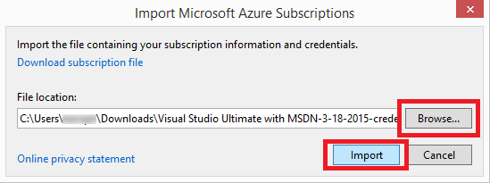

<properties 
   pageTitle="Accéder à nuages Azure privés avec Visual Studio | Microsoft Azure"
   description="Découvrez comment accéder aux ressources de cloud privé à l’aide de Visual Studio."
   services="visual-studio-online"
   documentationCenter="na"
   authors="TomArcher"
   manager="douge"
   editor="" />
<tags 
   ms.service="multiple"
   ms.devlang="dotnet"
   ms.topic="article"
   ms.tgt_pltfrm="na"
   ms.workload="multiple"
   ms.date="08/15/2016"
   ms.author="tarcher" />

# Accéder à nuages Azure privés avec Visual Studio

##Vue d’ensemble

Par défaut, Visual Studio prend en charge les points de terminaison REST cloud Azure public. Cela peut être un problème, cependant, si vous utilisez Visual Studio avec un Azure cloud privé. Vous pouvez utiliser des certificats pour configurer Visual Studio pour accéder aux points de terminaison REST cloud Azure privé. Vous pouvez obtenir ces certificats via votre Azure publier le fichier de configuration.

## Pour accéder à un Azure privé cloud dans Visual Studio

1. Dans le [portail classique Azure](http://go.microsoft.com/fwlink/?LinkID=213885) pour le cloud privé, téléchargez votre fichier de paramètres de publication, ou contactez votre administrateur pour un fichier de paramètres de publication. Dans la version publique d’Azure, le lien télécharger ce fichier est [https://manage.windowsazure.com/publishsettings/](https://manage.windowsazure.com/publishsettings/). (Le fichier que vous téléchargez doit avoir une extension .publishsettings.)

1. Dans l' **Explorateur de serveurs** dans Visual Studio, choisissez le nœud **Azure** et, dans le menu contextuel, sélectionnez la commande **Gérer les abonnements** .

    

1. Dans la boîte de dialogue **Gérer les abonnements Microsoft Azure** , sélectionnez l’onglet **certificats** , puis le bouton **Importer** .

    

1. Dans la boîte de dialogue **Importer les abonnements Azure Microsoft** , accédez au dossier dans lequel vous avez enregistré le fichier de paramètres de publication et choisissez le fichier, puis cliquez sur le bouton **Importer** . Cela permet d’importer les certificats dans le fichier de paramètres de publication dans Visual Studio. Vous devriez maintenant pouvoir interagir avec vos ressources de cloud privé.

    

## Étapes suivantes

[Publication d’un Service Cloud Azure à partir de Visual Studio](https://msdn.microsoft.com/library/azure/ee460772.aspx)

[Comment : Téléchargez et importer publier des paramètres et informations sur l’abonnement](https://msdn.microsoft.com/library/dn385850(v=nav.70).aspx)

