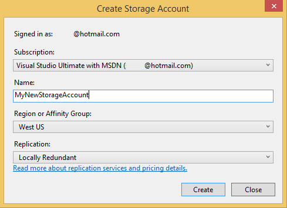

<properties
   pageTitle="Préparer la publier ou déployer une application à partir de Visual Studio Azure | Microsoft Azure"
   description="Découvrez les procédures pour configurer les services compte cloud et le stockage et configurer votre application Azure."
   services="visual-studio-online"
   documentationCenter="na"
   authors="TomArcher"
   manager="douge"
   editor="" />
<tags
   ms.service="multiple"
   ms.devlang="dotnet"
   ms.topic="article"
   ms.tgt_pltfrm="na"
   ms.workload="multiple"
   ms.date="08/15/2016"
   ms.author="tarcher" />

# Préparer la publier ou déployer une Application à partir de Visual Studio Azure

## Vue d’ensemble

Avant de pouvoir publier un projet de service cloud, vous devez configurer les services suivants :

- Un **service cloud** pour exécuter des rôles dans l’environnement Azure

- Un **compte de stockage** qui permet d’accéder aux services Blob, file d’attente et Table.

Utilisez les procédures suivantes pour configurer ces services et configurer votre application

## Créer un service cloud

Pour publier un service cloud sur Azure, vous devez d’abord créer un service cloud, qui s’exécute vos rôles dans l’environnement Azure. Vous pouvez créer un service cloud dans le [portail classique Azure](http://go.microsoft.com/fwlink/?LinkID=213885), comme décrit dans la section **pour créer un service cloud à l’aide du portail classique Azure**, plus loin dans cette rubrique. Vous pouvez également créer un service cloud dans Visual Studio à l’aide de l’Assistant de publication.

### Créer un service cloud à l’aide de Visual Studio

1. Ouvrir le menu contextuel pour le projet Azure et choisissez **Publier**.

    

1. Si vous n’avez pas connecté, connectez-vous avec votre nom d’utilisateur et mot de passe pour le compte Microsoft ou le compte d’organisation associée à votre abonnement Azure.

1. Cliquez sur le bouton **suivant** pour passer à la page **paramètres** .

    

1. Dans la liste des **Services en nuage** , sélectionnez **Créer un nouveau**. La boîte de dialogue **Créer Azure Services** s’affiche.

1. Entrez le nom de votre service cloud. Le nom fait partie de l’URL de votre service et doit donc être globalement unique. Le nom n’est pas sensible à la casse.

### Créer un service cloud à l’aide du portail classique Azure

1. Connectez-vous au [portail classique Azure](http://go.microsoft.com/fwlink/?LinkId=253103) sur le site Web Microsoft.

1. (facultatif) Pour afficher une liste des services en nuage que vous avez déjà créé, cliquez sur le lien Cloud Services sur le côté gauche de la page.

1. Choisissez le **+** icône dans le coin inférieur gauche de coin et cliquez sur **Service Cloud** dans le menu qui s’affiche. Un autre écran avec deux options : **Création rapide** et **Personnalisée créer**, s’affiche. Si vous choisissez **Création rapide**, vous pouvez créer un service cloud en spécifiant son URL et la région dans lequel il sera physiquement hébergée seulement. Si vous choisissez de **Créer personnalisé**, vous pouvez publier immédiatement un service cloud en spécifiant un package (fichier .cspkg), un fichier de configuration (.cscfg) et un certificat. Créer personnalisé n’est pas obligatoire si vous souhaitez publier votre service cloud à l’aide de la commande **Publier** dans un projet Azure. La commande **Publier** est disponible dans le menu contextuel pour un projet d’Azure.

1. Choisissez **Création rapide** ultérieurement publier votre service cloud à l’aide de Visual Studio.

1. Attribuez un nom à votre service cloud. L’URL complète apparaît en regard du nom.

1. Dans la liste, sélectionnez la zone où se trouvent la plupart de vos utilisateurs.

1. Dans la partie inférieure de la fenêtre, cliquez sur le lien **Créer un Service Cloud** .

## Créer un compte de stockage

Un compte de stockage permet d’accéder aux services Blob, file d’attente et Table. Vous pouvez créer un compte de stockage à l’aide de Visual Studio ou du [portail classique Azure](http://go.microsoft.com/fwlink/?LinkId=253103).

### Créer un compte de stockage à l’aide de Visual Studio

1. Dans l' **Explorateur de solutions**, ouvrez le menu contextuel pour le nœud de **stockage** , puis sur **Créer un compte de stockage**.

    

1. Sélectionnez ou entrez les informations suivantes pour le nouveau compte de stockage dans la boîte de dialogue **Créer un compte de stockage** .
    - L’abonnement Azure auquel vous souhaitez ajouter le compte de stockage.
    - Le nom que vous voulez utiliser pour le nouveau compte de stockage.
    - La région ou un groupe d’affinité (par exemple, US Ouest ou Extrême-Orient).
    - Le type de réplication que vous souhaitez utiliser pour le compte de stockage, par exemple Geo redondants.

1. Lorsque vous avez terminé, cliquez sur **créer**. Le nouveau compte de stockage apparaît dans la liste de **stockage** dans **l’Explorateur de serveur**.

### Créer un compte de stockage à l’aide du portail classique Azure

1. Connectez-vous au [portail classique Azure](http://go.microsoft.com/fwlink/?LinkId=253103) sur le site Web Microsoft.

1. (Facultatif) Pour afficher vos comptes de stockage, cliquez sur le lien **d’espace de stockage** dans le panneau de configuration sur le côté gauche de la page.

1. Dans le coin inférieur gauche de la page, choisissez la **+** icône.

1. Dans le menu qui apparaît, sélectionnez **stockage**, puis **Création rapide**.

1. Nommez le compte de stockage qui entraînera une url unique.

1. Donnez un nom à votre service cloud. L’URL complète apparaît en regard du nom.

1. Dans la liste des régions, choisissez une région où se trouvent la plupart de vos utilisateurs.

1. Spécifiez si vous souhaitez activer geo réplication. Si vous activez geo réplication, vos données seront enregistrées dans plusieurs emplacements physiques afin de réduire les risques de perte. Cette fonction permet de stockage plus cher, mais vous pouvez réduire le coût en activant géolocalisation lorsque vous créez le compte de stockage au lieu de l’ajout ultérieur de la fonctionnalité. Pour plus d’informations, voir [Geo réplication](http://go.microsoft.com/fwlink/?LinkId=253108).

1. Dans la partie inférieure de la fenêtre, cliquez sur le lien **Créer un compte de stockage** .

Après avoir créé votre compte de stockage, vous verrez les URL que vous pouvez utiliser pour accéder aux ressources dans chacune des services de stockage Azure, ainsi que les touches d’accès principal et secondaire pour votre compte. Vous utilisez ces touches pour authentifier des demandes faites contre les services de stockage.

>[AZURE.NOTE] La touche d’accès secondaire fournit le même niveau d’accès à votre compte de stockage comme clé primaire access et est générée comme une sauvegarde si votre clé primaire access doit être compromis. En outre, il est recommandé de régénérer votre touches d’accès rapide à intervalles réguliers. Vous pouvez modifier un paramètre de chaîne de connexion à utiliser la clé secondaire lorsque vous régénérez la clé primaire, puis vous pouvez le modifier pour utiliser la clé primaire régénérée lorsque vous régénérez la clé secondaire.

## Configurer votre application pour utiliser les services fournis par le compte de stockage

Vous devez configurer n’importe quel rôle qui accède à des services de stockage afin d’utiliser les services de stockage Azure que vous avez créé. Pour ce faire, vous pouvez utiliser plusieurs configurations de service pour votre projet Azure. Par défaut, deux sont créés dans votre projet Azure. À l’aide de plusieurs configurations de service, vous pouvez utiliser la même chaîne de connexion dans votre code, mais ont une valeur différente pour une chaîne de connexion dans chaque configuration du service. Par exemple, vous pouvez utiliser une configuration du service d’exécution et déboguer votre application localement à l’aide de l’émulateur de stockage Azure et une configuration de services différente pour publier votre application sur Azure. Pour plus d’informations sur les configurations de service, voir [Configurer votre Azure Project à l’aide de plusieurs Configurations de Service](vs-azure-tools-multiple-services-project-configurations.md).

### Pour configurer votre application pour utiliser les services fournissant du compte de stockage

1. Dans Visual Studio, ouvrez votre solution Azure. Dans l’Explorateur de solutions, ouvrez le menu contextuel pour chaque rôle dans votre projet Azure qui accède aux services de stockage et sélectionnez **Propriétés**. Une page avec le nom du rôle s’affiche dans l’éditeur Visual Studio. La page affiche les champs de l’onglet **Configuration** .

1. Dans les pages de propriétés pour le rôle, cliquez sur **paramètres**.

1. Dans la liste de **Configuration du Service** , sélectionnez le nom de la configuration du service que vous voulez modifier. Si vous souhaitez apporter des modifications à toutes les configurations de service pour ce rôle, vous pouvez choisir **Toutes les Configurations**.  Pour plus d’informations sur la mise à jour des configurations de service, consultez la section **Gérer les chaînes de connexion pour les comptes de stockage** dans la rubrique [configurer les rôles d’un Service Cloud Azure avec Visual Studio](vs-azure-tools-configure-roles-for-cloud-service.md).

1. Pour modifier les paramètres de chaîne de connexion, cliquez sur le bouton **...** bouton en regard du paramètre. La boîte de dialogue **Créer une chaîne de connexion stockage** s’affiche.

1. Sous **se connecter en utilisant**, activez l’option de **votre abonnement** .

1. Dans la liste des **abonnements** , sélectionnez votre abonnement. Si la liste des abonnements n’inclut pas celle que vous souhaitez, cliquez sur le lien **Télécharger les paramètres de publication** .

1. Dans la liste **nom du compte** , sélectionnez le nom de votre compte de stockage. Outils Azure obtient automatiquement des informations d’identification du compte de stockage en utilisant le fichier .publishsettings. Pour spécifier vos informations d’identification du compte de stockage manuellement, choisissez l’option **entré manuellement les informations d’identification** , puis poursuivez cette procédure. Vous pouvez obtenir votre nom de compte de stockage et de la clé primaire à partir du [portail classique Azure](http://go.microsoft.com/fwlink/p/?LinkID=213885). Si vous ne voulez pas spécifier de stockage de vos paramètres de compte manuellement, cliquez sur le bouton **OK** pour fermer la boîte de dialogue.

1. Cliquez sur le lien d’informations d’identification de **compte de stockage d’entrée** .

1. Dans la zone **nom du compte** , entrez le nom de votre compte de stockage.

    >[AZURE.NOTE] Se connecter au [portail classique Azure](http://go.microsoft.com/fwlink/?LinkID=213885), puis cliquez sur le bouton de **stockage** . Le portail affiche une liste des comptes de stockage. Si vous choisissez un compte, une page pour qu’elle s’ouvre. Vous pouvez copier le nom du compte de stockage à partir de cette page. Si vous utilisez une version précédente du portail classique, le nom de votre compte de stockage s’affiche dans l’affichage des **Comptes de stockage** . Pour copier ce nom, mettez-la en surbrillance dans la fenêtre des **Propriétés** de cet affichage, puis cliquez sur les touches Ctrl + C. Pour coller le nom dans Visual Studio, sélectionnez la zone de texte **nom du compte** , puis les touches Ctrl + V.

1. Dans la zone **clé de compte** , entrez votre clé primaire, ou copier et coller à partir du [portail classique Azure](http://go.microsoft.com/fwlink/?LinkID=213885).
    Pour copier cette clé :

    1. En bas de la page du compte de stockage approprié, cliquez sur le bouton **Gérer les clés** .

    1. Dans la page **Gérer les accès clés** , sélectionnez le texte de la clé primaire access, puis les touches Ctrl + C.

    1. Dans outils Azure, collez la clé dans la zone **clé de compte** .

    1. Vous devez sélectionner une des options suivantes pour déterminer la façon dont le service accédera du compte de stockage :
        - **Utiliser HTTP**. Il s’agit de l’option standard. Par exemple, `http://<account name>.blob.core.windows.net`.
        - **Utiliser HTTPS** pour une connexion sécurisée. Par exemple, `https://<accountname>.blob.core.windows.net`.
        - **Spécifier les points de terminaison personnalisés** pour chacune des trois services. Vous pouvez ensuite taper ces points de terminaison dans le champ pour le service spécifique.

        >[AZURE.NOTE] Si vous créez des points de terminaison personnalisés, vous pouvez créer une chaîne de connexion plus complexe. Lorsque vous utilisez ce format de chaîne, vous pouvez spécifier des points de terminaison stockage services qui incluent un nom de domaine personnalisé que vous avez enregistrés pour votre compte de stockage avec le service d’objets Blob. Vous pouvez également accorder l’accès uniquement aux ressources blob dans un seul conteneur via une signature accès partagé. Pour plus d’informations sur la création des points de terminaison personnalisés, voir [Configurer les chaînes de connexion stockage Azure](storage-configure-connection-string.md).

1. Pour enregistrer les modifications de chaîne de connexion, cliquez sur le bouton **OK** , puis sur le bouton **Enregistrer** dans la barre d’outils. Après avoir enregistré ces modifications, vous pouvez obtenir la valeur de cette chaîne de connexion dans votre code à l’aide de [GetConfigurationSettingValue](https://msdn.microsoft.com/library/azure/microsoft.windowsazure.serviceruntime.roleenvironment.getconfigurationsettingvalue.aspx). Lorsque vous publiez votre application Azure, choisissez la configuration du service qui contient le compte de stockage Azure pour la chaîne de connexion. Une fois que votre application est publiée, vérifiez que l’application fonctionne comme prévu contre les services de stockage Azure

## Étapes suivantes

Pour en savoir plus sur la publication d’applications vers Azure à partir de Visual Studio, voir [publication d’un Service de nuage en utilisant les outils Azure](vs-azure-tools-publishing-a-cloud-service.md).
