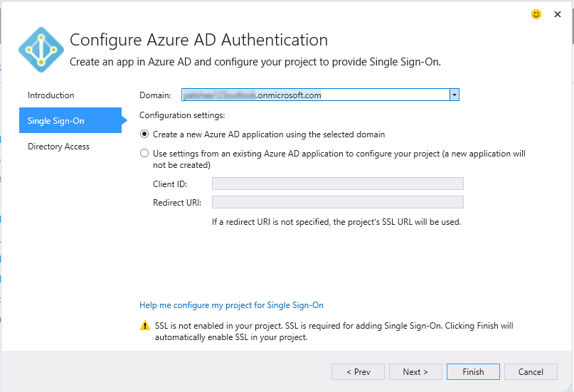

<properties 
   pageTitle="Ajout d’un serveur Azure Active Directory à l’aide de Services connectés dans Visual Studio | Microsoft Azure"
   description="Ajouter un Azure Active Directory à l’aide de la boîte de dialogue Visual Studio ajouter Services connectés"
   services="visual-studio-online"
   documentationCenter="na"
   authors="TomArcher"
   manager="douge"
   editor="" />
<tags 
   ms.service="active-directory"
   ms.devlang="multiple"
   ms.topic="article"
   ms.tgt_pltfrm="na"
   ms.workload="na"
   ms.date="08/15/2016"
   ms.author="tarcher" />

# Ajout d’un serveur Azure Active Directory à l’aide de Services connectés dans Visual Studio 

##Vue d’ensemble
En utilisant Azure Active Directory (AD Azure), vous pouvez prend en charge authentification unique (SSO) pour les applications web ASP.NET MVC ou l’authentification Active Directory dans les services Web API. Avec l’authentification Active Directory Azure, vos utilisateurs peuvent utiliser leurs comptes à partir d’Azure AD pour vous connecter à vos applications web. Les avantages de l’authentification Active Directory Azure avec l’API Web sont sécurité renforcée des données lorsque vous exposez une API à partir d’une application web. Avec Azure Active Directory, vous n’êtes pas obligé de gérer un système d’authentification distinct avec sa propre gestion des comptes et utilisateur.

## Types de projets pris en charge

Vous pouvez utiliser la boîte de dialogue Services connectés pour vous connecter à Azure AD dans les types suivants de projet.

- Projets ASP.NET MVC

- Projets d’API Web ASP.NET

### Connexion à Azure Active Directory à l’aide de la boîte de dialogue Services connectés

1. Vérifiez que vous avez un compte Azure. Si vous n’avez pas un compte Azure, vous pouvez vous inscrire à une [version d’évaluation gratuite](http://go.microsoft.com/fwlink/?LinkId=518146).

1. Dans Visual Studio, ouvrez le menu contextuel du nœud **références** dans votre projet, puis sélectionnez **Ajouter les Services connectés**.
1. Sélectionnez **l’authentification Active Directory Azure** , puis choisissez **configurer**.

    

1. Sur la première page de l' **l’authentification configurer Azure Active Directory**, vérifiez **configurer de l’authentification unique à l’aide d’Azure AD**.

    Si votre projet est configuré avec un autre configuration de l’authentification, l’Assistant vous avertit que continuer désactive la configuration précédente.

    

1.  Dans la deuxième page, sélectionnez un domaine dans la liste déroulante de **domaine** . La liste des domaines contient tous les domaines accessibles par les comptes répertoriés dans la boîte de dialogue Paramètres du compte. Comme alternative, vous pouvez entrer un nom de domaine si vous ne trouvez pas celui que vous recherchez, par exemple mydomain.onmicrosoft.com. Vous pouvez choisir l’option pour créer une nouvelle application Azure AD ou utilisez les paramètres d’une application Azure Active Directory existante. 

    

1. Dans la troisième page de l’Assistant, vérifiez que la case **lire les données de l’annuaire** est activée. L’Assistant renseigne le **secret Client**. 

    

1. Cliquez sur **Terminer** . La boîte de dialogue ajoute le code de configuration nécessaires et les références pour activer votre projet pour l’authentification Azure Active Directory. Vous pouvez voir le domaine AD dans le [portail Azure](http://go.microsoft.com/fwlink/p/?LinkID=525040).

1. Passez en revue la page prise en main qui s’affiche dans votre navigateur pour obtenir des idées sur les étapes suivantes et la page où est passée pour voir comment votre projet a été modifié. Si vous voulez vérifier que tout fonctionne, ouvrez un des fichiers de configuration modifié et vérifiez que les paramètres mentionnés dans où est passée sont y. Par exemple, le fichier web.config principal dans un projet ASP.NET MVC aura ces paramètres ajoutés :

        <appSettings> 
            <add key="ida:ClientId" value="ClientId from the new Azure AD App" />
            <add key="ida:AADInstance" value="https://login.windows.net/" />
            <add key="ida:Domain" value="Your selected domain" />
            <add key="ida:TenantId" value="The Id of your selected Azure AD Tenant" />
            <add key="ida:PostLogoutRedirectUri" value="The default redirect URI from the project" />
        </appSettings>

## Comment votre projet a été modifié

Lorsque vous exécutez l’Assistant, Visual Studio ajoute Azure AD et associé à des références à votre projet. Fichiers de configuration et de fichiers de code dans votre projet sont également modifiés pour prendre en charge Azure AD. Les modifications spécifiques que Visual Studio apporte dépendent du type de projet. Pour plus d’informations sur la façon dont les projets ASP.NET MVC sont modifiés, voir [Quels projets MVC survenu –](http://go.microsoft.com/fwlink/p/?LinkID=513809). Pour les projets d’API Web, voir [qu’est devenue – les projets d’API Web](http://go.microsoft.com/fwlink/p/?LinkId=513810).

##Étapes suivantes

Poser des questions et obtenir de l’aide.

 - [Forum MSDN : Azure AD](https://social.msdn.microsoft.com/forums/azure/home?forum=WindowsAzureAD)

 - [Documentation présentée sous d’Azure AD](https://azure.microsoft.com/documentation/services/active-directory/)

 - [Billet de blog : Introduction à Azure Active Directory](http://blogs.msdn.com/b/brunoterkaly/archive/2014/03/03/introduction-to-windows-azure-active-directory.aspx)

