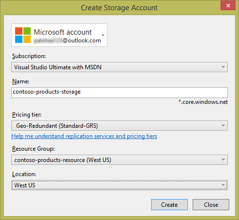
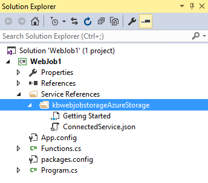

<properties 
   pageTitle="Ajouter un stockage Azure à l’aide de Services connectés dans Visual Studio | Microsoft Azure"
   description="Ajouter un stockage Azure à votre application à l’aide de la boîte de dialogue Visual Studio ajouter Services connectés"
   services="visual-studio-online"
   documentationCenter="na"
   authors="TomArcher"
   manager="douge"
   editor="" />
<tags 
   ms.service="storage"
   ms.devlang="na"
   ms.topic="article"
   ms.tgt_pltfrm="na"
   ms.workload="na"
   ms.date="08/15/2016"
   ms.author="tarcher" />

# Ajout d’un stockage Azure à l’aide de Visual Studio connecté Services

## Vue d’ensemble

Avec Visual Studio 2015, vous pouvez vous connecter n’importe quel service de nuage c#, service mobile en aval .NET, site Web ASP.NET ou service, service ASP.NET 5 ou Azure WebJob au stockage Azure à l’aide de la boîte de dialogue **Ajouter des Services connectés** . La fonctionnalité du service connecté ajoute toutes les références requises et le code de connexion et modifie vos fichiers de configuration de manière appropriée. La boîte de dialogue vous permet également d’accéder à la documentation qui vous indique quelles sont les étapes suivantes pour démarrer le stockage blob, files d’attente et les tables.

## Types de projets pris en charge

Vous pouvez utiliser la boîte de dialogue Services connectés pour vous connecter au stockage Azure dans les types suivants de projet.

- Projets Web ASP.NET

- ASP.NET 5 projets

- Rôle de .NET cloud Service Web et des projets de rôle de collaborateur

- Projets de Services mobiles .NET

- Projets WebJob Azure

## Se connecter au stockage Azure à l’aide de la boîte de dialogue Services connectés

1. Vérifiez que vous avez un compte Azure. Si vous n’avez pas un compte Azure, vous pouvez vous inscrire à une [version d’évaluation gratuite](http://go.microsoft.com/fwlink/?LinkId=518146). Une fois que vous avez un compte Azure, vous pouvez créer des comptes de stockage, créer des services mobiles et configurer Azure Active Directory.

1. Ouvrez votre projet dans Visual Studio, ouvrir le menu contextuel pour le nœud de **références** dans l’Explorateur, puis sur **Ajouter un Service connecté**.

    

1. Dans la boîte de dialogue **Ajouter un Service connecté** , sélectionnez **Le stockage Azure**, puis le bouton **configurer** . Vous pouvez être invité à vous connecter à Azure si vous n’avez pas déjà fait.

    

1. Dans la boîte de dialogue **Stockage Azure** , sélectionnez un compte de stockage existant, puis sélectionnez **Ajouter**.

    Si vous avez besoin créer un nouveau compte de stockage, accédez à l’étape suivante. Dans le cas contraire, passez à l’étape 6.

    

1. Pour créer un nouveau compte de stockage : 

    1. Cliquez sur le bouton **créer un nouveau compte de stockage** en bas de la boîte de dialogue stockage Azure.

    1. Remplissez la boîte de dialogue **Créer un compte de stockage** , puis sélectionnez le bouton **créer** .
    
        

        Lorsque vous êtes dans la boîte de dialogue **Stockage Azure** , le nouveau stockage apparaît dans la liste.

    1. Sélectionnez le nouveau stockage dans la liste, puis sélectionnez **Ajouter**.

1. Le service de stockage connecté apparaît sous le nœud de références de Service de votre projet WebJob.

    

1. Examinez la page prise en main qui s’affiche et découvrez comment votre projet a été modifié. Une page mise en route apparaît dans votre navigateur chaque fois que vous ajoutez un service connecté. Vous pouvez passer en revue les étapes suivantes suggérées et exemples de code, ou passer à la page où est passée pour afficher les références ont été ajoutés à votre projet, et comment vos fichiers de code et de configuration ont été modifiés.

## Comment votre projet a été modifié

Lorsque vous avez terminé la boîte de dialogue, Visual Studio ajoute des références et modifie certains fichiers de configuration. Les modifications spécifiques varient selon le type de projet. 

 - Pour les projets ASP.NET, voir [qu’est devenue – projets ASP.NET](http://go.microsoft.com/fwlink/p/?LinkId=513126). 
 - Pour les projets ASP.NET 5, voir [qu’est devenue – ASP.NET 5 projets](http://go.microsoft.com/fwlink/p/?LinkId=513124). 
 - Pour cloud projets de service (rôles web et les rôles de travail), voir [qu’est devenue – projets de Service Cloud](http://go.microsoft.com/fwlink/p/?LinkId=516965). 
 - Pour les projets WebJob, voir [qu’est devenue - WebJob projets](./storage/vs-storage-webjobs-what-happened.md).

## Étapes suivantes

1. En utilisant les exemples de code prise en main comme un repère, créer le type de stockage que vous voulez et puis commencer à écrire du code pour accéder à votre compte de stockage !

1. Poser des questions et obtenir de l’aide
     - [Forum MSDN : Stockage Azure](https://social.msdn.microsoft.com/forums/azure/home?forum=windowsazuredata)

     - [Blog de l’équipe stockage Azure](http://blogs.msdn.com/b/windowsazurestorage/)

     - [Stockage en azure.microsoft.com](https://azure.microsoft.com/services/storage/)

     - [Documentation du stockage en azure.microsoft.com](https://azure.microsoft.com/documentation/services/storage/)

