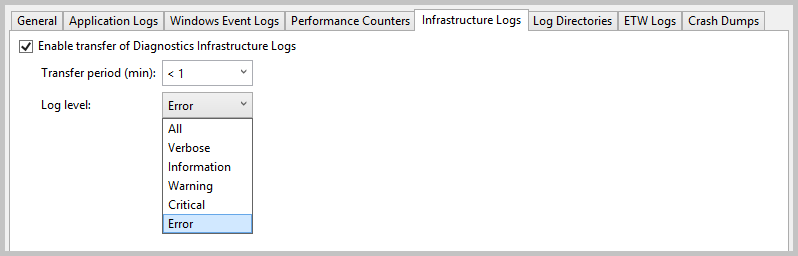
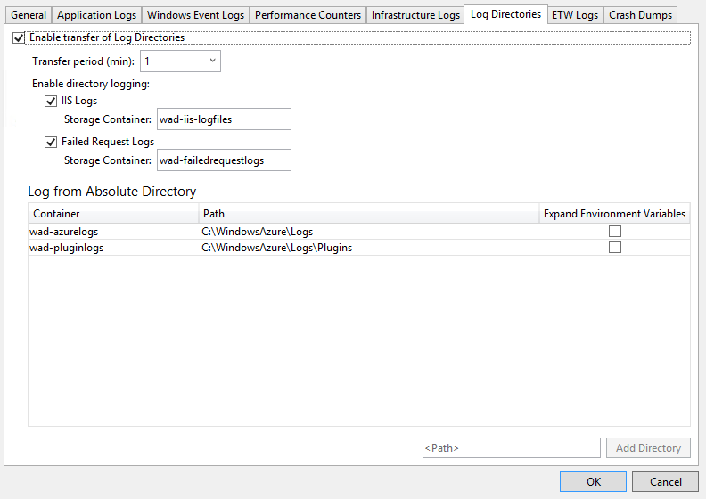

<properties
   pageTitle="Configuration des Diagnostics pour les Services de Cloud Azure et Machines virtuelles | Microsoft Azure"
   description="Décrit comment configurer les informations de diagnostic pour le débogage cloude Azure services et machines virtuelles (machines virtuelles) dans Visual Studio."
   services="visual-studio-online"
   documentationCenter="na"
   authors="TomArcher"
   manager="douge"
   editor="" />
<tags
   ms.service="multiple"
   ms.devlang="dotnet"
   ms.topic="article"
   ms.tgt_pltfrm="na"
   ms.workload="multiple"
   ms.date="08/15/2016"
   ms.author="tarcher" />

# <a name="configuring-diagnostics-for-azure-cloud-services-and-virtual-machines"></a>Configuration des Diagnostics pour les Services de Cloud Azure et Machines virtuelles

Lorsque vous avez besoin résoudre les problèmes d’un service cloud Azure ou Azure machine virtuelle, vous pouvez configurer plus facilement les diagnostics de Windows Azure à l’aide de Visual Studio. Diagnostics de Windows Azure capture les données du système et enregistrement des données sur les machines virtuelles et les instances de machine virtuelle qui s’exécutent votre service cloud et transfère ces données dans un compte de stockage de votre choix. Pour plus d’informations sur l’enregistrement dans Azure des diagnostics, consultez [Activer l’enregistrement des diagnostics pour les applications web dans le Service d’application Azure](./app-service-web/web-sites-enable-diagnostic-log.md) .

Cette rubrique vous montre comment activer et configurer les diagnostics de Windows Azure dans Visual Studio, à la fois avant et après le déploiement, ainsi que sur des machines virtuelles Azure. Il vous montre également comment sélectionner les types d’informations de diagnostic pour collecter et comment afficher les informations après sa collecte.

Vous pouvez configurer Azure Diagnostics des façons suivantes :

- Vous pouvez modifier les paramètres de configuration diagnostics via la boîte de dialogue **Configuration des Diagnostics** dans Visual Studio. Les paramètres sont enregistrés dans un fichier nommé diagnostics.wadcfgx (diagnostics.wadcfg dans Azure SDK 2.4 ou version antérieure). Vous pouvez également modifier directement le fichier de configuration. Si vous mettre à jour manuellement le fichier, les modifications de configuration prendront effet la prochaine fois que vous déployez le cloud service vers Azure ou exécuter le service dans l’émulateur.

- Utiliser **Cloud Explorer** ou **l’Explorateur de serveurs** dans Visual Studio pour modifier les paramètres des diagnostics pour une exécution d’un service cloud ou machine virtuelle.

## <a name="azure-26-diagnostics-changes"></a>Modifications des diagnostics Azure 2.6

Pour les projets Azure SDK 2.6 dans Visual Studio, les modifications suivantes ont été apportées. (Ces modifications s’appliquent également à ses versions ultérieures Azure SDK.)

- L’émulateur local prend désormais en charge les diagnostics. Cela signifie que vous pouvez collecter des données de diagnostics et vérifiez que votre application consiste à créer les traces droite pendant que vous êtes développer et tester dans Visual Studio. La chaîne de connexion `UseDevelopmentStorage=true` permet de collecte de données de diagnostic pendant que vous exécutez votre projet de service cloud dans Visual Studio à l’aide de l’émulateur de stockage Azure. Toutes les données de diagnostic sont collectées dans le compte de stockage (stockage de développement).

- La chaîne de connexion de compte diagnostics stockage (Microsoft.WindowsAzure.Plugins.Diagnostics.ConnectionString) est stockée une nouvelle fois dans le fichier de configuration (.cscfg) service. Le compte de stockage diagnostics Azure SDK 2.5 a été spécifié dans le fichier diagnostics.wadcfgx.

Il existe certaines différences importantes entre comment la chaîne de connexion a travaillé dans Azure SDK 2.4 et antérieures et son fonctionnement dans Azure SDK 2.6 et versions ultérieures.

- Azure SDK 2.4 et les versions antérieures, la chaîne de connexion a été utilisée comme un runtime par le plug-in diagnostics pour obtenir les informations de compte de stockage pour transférer les journaux de diagnostics.

- Azure SDK 2.6 et versions ultérieures, la chaîne de connexion diagnostics est utilisée par Visual Studio pour configurer l’extension diagnostics avec les informations de compte de stockage approprié lors de la publication. La chaîne de connexion vous permet de définir des comptes de stockage différents pour les configurations de services différentes que Visual Studio utilisera lors de la publication. Toutefois, étant donné que le plug-in diagnostics n’est plus disponible (après avoir Azure SDK 2.5), le fichier .cscfg par lui-même ne peut pas activer l’Extension Diagnostics. Vous devez activer l’extension séparément par le biais d’outils tels que Visual Studio ou PowerShell.

- Pour simplifier le processus de configuration de l’extension diagnostics avec PowerShell, la sortie du package à partir de Visual Studio contienne également la configuration publique XML pour l’extension diagnostics pour chaque rôle. Visual Studio utilise la chaîne de connexion diagnostics pour renseigner les informations de compte de stockage présentes dans la configuration du publique. Les fichiers de configuration public sont créés dans le dossier Extensions et suivent le modèle PaaSDiagnostics. &lt;RoleName >. PubConfig.xml. Les déploiements PowerShell basé peuvent utiliser ce modèle pour mapper chaque configuration à un rôle.

- La chaîne de connexion dans le fichier .cscfg est également utilisée par le [portail Azure](http://go.microsoft.com/fwlink/p/?LinkID=525040) pour accéder aux données diagnostics afin qu’il peut apparaître dans l’onglet **analyse** . La chaîne de connexion est nécessaire pour configurer le service pour afficher les données d’analyse détaillées dans le portail.

## <a name="migrating-projects-to-azure-sdk-26-and-later"></a>Migration des projets à Azure SDK 2.6 et versions ultérieures

Lors de la migration à partir d’Azure SDK 2.5 à Azure SDK 2.6 ou version ultérieure, si vous avez un compte de stockage diagnostics spécifié dans le fichier .wadcfgx, puis il restera il. Pour tirer parti de la flexibilité d’utilisation de stockage différents comptes pour les configurations de stockage différents, vous devrez ajouter manuellement la chaîne de connexion à votre projet. Si vous migrez un projet à partir d’Azure SDK 2.4 ou version antérieure vers Azure SDK 2.6, les chaînes de connexion diagnostics sont conservés. Toutefois, notez les modifications dans comment les chaînes de connexion sont traités dans Azure SDK 2.6 comme indiqué dans la section précédente.

### <a name="how-visual-studio-determines-the-diagnostics-storage-account"></a>Comment Visual Studio détermine le compte de stockage diagnostics

- Si une chaîne de connexion diagnostics spécifiée dans le fichier .cscfg, Visual Studio utilise pour configurer l’extension diagnostics lors de la publication et lors de la création de fichiers xml de configuration public lors de l’emballage.

- Si aucune chaîne de connexion diagnostics ne spécifié dans le fichier .cscfg, puis Visual Studio revient à l’aide du compte de stockage spécifié dans le fichier .wadcfgx pour configurer l’extension diagnostics lors de la publication et générer les fichiers xml public configuration lors de la compression.

- La chaîne de connexion diagnostics dans le fichier .cscfg est prioritaire sur le compte de stockage dans le fichier .wadcfgx. Si une chaîne de connexion diagnostics est spécifiée dans le fichier .cscfg, puis Visual Studio qui utilise et ignore le compte de stockage dans .wadcfgx.

### <a name="what-does-the-update-development-storage-connection-strings-checkbox-do"></a>Que signifie les « mise à jour développement stockage chaînes de connexion... » case à cocher faire ?

La case à cocher pour les **chaînes de connexion de stockage de développement mise à jour pour les Diagnostics et de mise en cache des informations d’identification de compte de stockage Microsoft Azure lors de la publication de Microsoft Azure** vous donne un moyen pratique pour mettre à jour les chaînes de connexion de compte de stockage développement avec le compte de stockage Azure spécifié lors de la publication.

Par exemple, supposons que vous activez cette case à cocher et la chaîne de connexion diagnostics indique `UseDevelopmentStorage=true`. Lorsque vous publiez le projet sur Azure, Visual Studio met automatiquement à jour la chaîne de connexion diagnostics avec le compte de stockage que vous avez spécifié dans l’Assistant Publication. Toutefois, si un compte de stockage réel a été spécifié en tant que la chaîne de connexion diagnostics, ce compte est utilisé à la place.

## <a name="diagnostics-functionality-differences-between-azure-sdk-24-and-earlier-and-azure-sdk-25-and-later"></a>Différences de fonctionnalités Diagnostics entre Azure SDK 2.4 et antérieur et Azure SDK 2,5 et versions ultérieur

Si vous mettez à niveau votre projet à partir d’Azure SDK 2.4 à Azure SDK 2.5 ou version ultérieure, vous devez garder à l’esprit les différences de fonctionnalité diagnostics suivantes.

- **API de configuration sont déconseillées** – configuration par programme de diagnostics n’est disponible dans Azure SDK 2.4 ou les versions antérieures, mais est déconseillée dans Azure SDK 2.5 et versions ultérieures. Si votre configuration diagnostics est actuellement définie dans le code, vous devez reconfigurer ces paramètres de toutes pièces dans le projet a été déplacée dans l’ordre des diagnostics pour continuer à travailler. Le fichier de configuration de diagnostics pour Azure SDK 2.4 est diagnostics.wadcfg et diagnostics.wadcfgx pour Azure SDK 2.5 et versions ultérieures.

- **Diagnostics pour les applications de service cloud peut uniquement être configuré au niveau du rôle et non au niveau de l’instance.**

- **Chaque fois que vous déployez votre application, la configuration de diagnostics est mis à jour** – cela peut entraîner des problèmes de disparités qui existent si vous modifiez votre configuration diagnostics à partir de l’Explorateur de serveurs, puis redéployez votre application.

- **Dans Azure SDK 2.5 et une version ultérieures, impact images complètes sont configurés dans le fichier de configuration diagnostics pas dans le code** – si vous disposez d’images de blocage configurés dans le code, vous devrez transférer manuellement la configuration de code vers le fichier de configuration, car le vidage de blocage ne sont pas transférées lors de la migration vers Azure SDK 2.6.

## <a name="enable-diagnostics-in-cloud-service-projects-before-deploying-them"></a>Activer les diagnostics de projets de service cloud avant de les déployer

Dans Visual Studio, vous pouvez choisir recueillir des données de diagnostic pour les rôles qui s’exécutent dans Azure, lorsque vous exécutez le service dans l’émulateur avant de le déployer. Toutes les modifications apportées aux paramètres des diagnostics dans Visual Studio sont enregistrées dans le fichier de configuration diagnostics.wadcfgx. Ces paramètres de configuration de spécifient le compte de stockage dans lequel les données de diagnostic sont enregistrées lorsque vous déployez votre service cloud.

### <a name="to-enable-diagnostics-in-visual-studio-before-deployment"></a>Pour activer des diagnostics dans Visual Studio avant le déploiement

1. Dans le menu contextuel pour le rôle qui vous intéresse, sélectionnez **Propriétés**, puis l’onglet **Configuration** dans la fenêtre de **Propriétés** du rôle.

1. Dans la section **Diagnostics** , vérifiez que la case à cocher **Activer les Diagnostics** est sélectionnée.

    

1. Cliquez sur le bouton points de suspension (...) pour spécifier le compte de stockage où vous souhaitez les données diagnostics stocké. Le compte de stockage que vous choisissez sera l’emplacement de stockage de données de diagnostic.

    

1. Dans la boîte de dialogue **Créer une chaîne de connexion stockage** , spécifiez si vous voulez vous connecter à l’aide de l’émulateur de stockage Azure, un abonnement Azure, ou entré manuellement les informations d’identification.

    

  - Si vous choisissez Microsoft Azure émulateur de stockage option, la chaîne de connexion est défini sur UseDevelopmentStorage = true.

  - Si vous choisissez l’option de votre abonnement, vous pouvez choisir l’abonnement Azure que vous souhaitez utiliser et le nom du compte. Vous pouvez choisir le bouton Gérer les comptes pour gérer vos abonnements Azure.

  - Si vous choisissez l’option des informations d’identification entré manuellement, vous êtes invité à entrer le nom et la clé du compte Azure que vous voulez utiliser.

1. Cliquez sur le bouton **configurer** pour afficher la boîte de dialogue **configuration des Diagnostics** . Chaque onglet (à l’exception des **Général** et des **Répertoires de journal**) représente une source de données de diagnostic que vous pouvez collecter. L’onglet par défaut, **Général**, vous propose les options de collecte de données diagnostics suivantes : **uniquement les erreurs**, **toutes les informations**et **plan personnalisé**. L’option par défaut, **uniquement les erreurs**, prend la quantité de stockage minimum, car il ne transférer avertissements ou le suivi des messages. L’option toutes les informations transfère le plus d’informations et est, par conséquent, l’option plus cher en termes de stockage.

    

1. Dans cet exemple, sélectionnez l’option **plan personnalisé** afin que vous pouvez personnaliser les données collectées.

1. La zone de **Quota de disque en Mo** spécifie la quantité d’espace que vous souhaitez affecter dans votre compte de stockage pour les données de diagnostic. Vous pouvez modifier la valeur par défaut si vous voulez.

1. Sous chaque onglet de données diagnostics à collecter, sélectionnez son **Activer les transferts de <log type> ** case à cocher. Par exemple, si vous voulez collecte des journaux d’application, sélectionnez la case à cocher **Activer le transfert des journaux d’Application** sous l’onglet **Journaux des applications** . En outre, spécifiez toute autre information requise par chaque type de données de diagnostic. Consultez la section **configurer des sources de données diagnostics** plus loin dans cette rubrique pour plus d’informations de configuration sous chaque onglet.

1. Une fois que vous avez activé la collection de toutes les données de diagnostics souhaité, cliquez sur le bouton **OK** .

1. Exécuter votre projet de service cloud Azure dans Visual Studio comme d’habitude. Lorsque vous utilisez votre application, les informations du journal que vous avez activé sont enregistrées dans le compte de stockage Azure spécifié.

## <a name="enable-diagnostics-in-azure-virtual-machines"></a>Activer les diagnostics sur des machines virtuelles Azure

Dans Visual Studio, vous pouvez choisir recueillir des données de diagnostic pour les machines virtuelles Azure.

### <a name="to-enable-diagnostics-in-azure-virtual-machines"></a>Pour activer les diagnostics de machines virtuelles Azure

1. Dans l' **Explorateur de serveurs**, choisissez le nœud Azure, puis connectez-vous à votre abonnement Azure, si vous n’êtes pas déjà connecté.

1. Développez le nœud **Machines virtuelles** . Vous pouvez créer une nouvelle machine virtuelle ou sélectionnez-en un qui s’y trouve déjà.

1. Dans le menu contextuel de la machine virtuelle qui vous intéresse, cliquez sur **configurer**. Affiche la boîte de dialogue configuration machine virtuelle.

    

1. S’il n’est pas déjà installé, ajoutez l’extension Microsoft surveillance Agent Diagnostics. Cette extension vous permet de collecter les données de diagnostic pour la machine virtuelle Azure. Dans la liste Extensions installées, sélectionnez la sélectionner un menu déroulant extension disponibles, puis sélectionnez Microsoft surveillance Agent Diagnostics.

    

    >[AZURE.NOTE] Autres extensions diagnostics sont disponibles pour vos machines virtuelles. Pour plus d’informations, voir Azure machine virtuelle Extensions et fonctionnalités.

1. Cliquez sur le bouton **Ajouter** pour ajouter l’extension et afficher sa boîte de dialogue **configuration des Diagnostics** .

1. Cliquez sur le bouton **configurer** permettent de spécifier un compte de stockage et cliquez sur le bouton **OK** .

    Chaque onglet (à l’exception des **Général** et des **Répertoires de journal**) représente une source de données de diagnostic que vous pouvez collecter.

    

    L’onglet par défaut, **Général**, vous propose les options de collecte de données diagnostics suivantes : **uniquement les erreurs**, **toutes les informations**et **plan personnalisé**. L’option par défaut, **uniquement les erreurs**, prend la quantité de stockage minimum, car il ne transférer avertissements ou le suivi des messages. L’option **toutes les informations** transfère le plus d’informations et est, par conséquent, l’option plus cher en termes de stockage.

1. Dans cet exemple, sélectionnez l’option **plan personnalisé** afin que vous pouvez personnaliser les données collectées.

1. La zone de **Quota de disque en Mo** spécifie la quantité d’espace que vous souhaitez affecter dans votre compte de stockage pour les données de diagnostic. Vous pouvez modifier la valeur par défaut si vous voulez.

1. Sous chaque onglet de données diagnostics à collecter, sélectionnez son **Activer les transferts de <log type> ** case à cocher.

    Par exemple, si vous voulez collecte des journaux d’application, sélectionnez la case à cocher **Activer le transfert des journaux d’Application** sous l’onglet **Journaux des applications** . En outre, spécifiez toute autre information requise par chaque type de données de diagnostic. Consultez la section **configurer des sources de données diagnostics** plus loin dans cette rubrique pour plus d’informations de configuration sous chaque onglet.

1. Une fois que vous avez activé la collection de toutes les données de diagnostics souhaité, cliquez sur le bouton **OK** .

1. Enregistrez le projet mis à jour.

    Vous voyez un message dans la fenêtre du **Journal d’activité Microsoft Azure** que la machine virtuelle a été mis à jour.

## <a name="configure-diagnostics-data-sources"></a>Configurer les sources de données de diagnostic

Après avoir activé la collecte de données diagnostics, vous pouvez choisir exactement quelles sources de données à collecter et quelles informations sont collectées. Voici une liste des onglets dans la boîte de dialogue **configuration de Diagnostics** et signifie quels chaque option de configuration.

### <a name="application-logs"></a>Journaux d’application

**Journaux d’application** contiennent les informations de diagnostic obtenues par une application web. Si vous voulez capturer des journaux d’application, sélectionnez la case à cocher **Activer le transfert de journaux d’applications** . Vous pouvez augmenter ou diminuer le nombre de minutes lorsque les journaux des applications sont transférés à votre compte de stockage en modifiant la valeur de la **Période de transférer (min)** . Vous pouvez également modifier la quantité d’informations capturées dans le journal en définissant la valeur de niveau de journal. Par exemple, vous pouvez choisir des **commentaires** pour obtenir plus d’informations ou choisissez **critique** pour capturer uniquement les erreurs critiques. Si vous avez un fournisseur diagnostics spécifiques qui émet des journaux d’application, vous pouvez les capturer en ajoutant GUID du fournisseur dans la zone **Fournisseur GUID** .

  

  Pour plus d’informations sur les journaux d’application, consultez [Activer l’enregistrement des diagnostics pour les applications web dans le Service d’application Azure](./app-service-web/web-sites-enable-diagnostic-log.md) .

### <a name="windows-event-logs"></a>Journaux d’événements Windows

Si vous voulez capturer les journaux d’événements Windows, activez la case à cocher **Activer le transfert des journaux des événements Windows** . Vous pouvez augmenter ou diminuer le nombre de minutes lorsque les journaux d’événements sont transférés à votre compte de stockage en modifiant la valeur de la **Période de transférer (min)** . Activez les cases à cocher pour les types d’événements que vous voulez effectuer le suivi.

  

Si vous utilisez Azure SDK 2.6 ou version ultérieur et que vous voulez spécifier une source de données personnalisée, entrez-le dans le **<Data source name>** texte zone, puis sélectionnez le bouton **Ajouter** en regard de celle-ci. La source de données est ajoutée au fichier diagnostics.cfcfg.

Si vous utilisez Azure SDK 2.5 et que vous voulez spécifier une source de données personnalisée, vous pouvez l’ajouter à la `WindowsEventLog` fichier section de la diagnostics.wadcfgx, comme dans l’exemple suivant.

```
<WindowsEventLog scheduledTransferPeriod="PT1M">
   <DataSource name="Application!*" />
   <DataSource name="CustomDataSource!*" />
</WindowsEventLog>
```
### <a name="performance-counters"></a>Compteurs de performance

Informations compteur de performance peuvent vous aider à trouver les engorgements du système et ajuster les performances du système et d’application. Pour plus d’informations, voir [créer et utiliser les compteurs de performances dans une Application Azure](https://msdn.microsoft.com/library/azure/hh411542.aspx) . Si vous voulez capturer des compteurs de performances, activez la case à cocher **Activer le transfert des compteurs de Performance** . Vous pouvez augmenter ou diminuer le nombre de minutes lorsque les journaux d’événements sont transférés à votre compte de stockage en modifiant la valeur de la **Période de transférer (min)** . Activez les cases à cocher des compteurs de performances que vous voulez effectuer le suivi.

  

Pour effectuer le suivi d’un compteur de performance qui n’est pas répertorié, entrez-le en utilisant la syntaxe suggérée, puis sur le bouton **Ajouter** . Le système d’exploitation sur l’ordinateur virtuel détermine quels compteurs de performance que vous pouvez effectuer le suivi. Pour plus d’informations sur la syntaxe, voir [spécifier un chemin de compteur](https://msdn.microsoft.com/library/windows/desktop/aa373193.aspx).

### <a name="infrastructure-logs"></a>Journaux d’infrastructure

Si vous voulez capturer les journaux d’infrastructure, qui contiennent des informations sur l’infrastructure de diagnostic Azure, le module d’accès à distance et le module RemoteForwarder, activez la case à cocher **Activer le transfert des journaux d’Infrastructure** . Vous pouvez augmenter ou diminuer le nombre de minutes lorsque les journaux sont transférés à votre compte de stockage en modifiant la valeur de période transférer (min).

  

  Pour plus d’informations, voir [Collecter les données journalisation par à l’aide de diagnostic Azure](https://msdn.microsoft.com/library/azure/gg433048.aspx) .

### <a name="log-directories"></a>Répertoires des journaux

Si vous voulez capturer des répertoires de journal, qui contiennent les données collectées à partir des répertoires de journal pour les demandes d’Internet Information Services (IIS), demandes qui ont échoué ou dossiers que vous choisissez, activez la case à cocher **Activer transfert des répertoires des journaux** . Vous pouvez augmenter ou diminuer le nombre de minutes lorsque les journaux sont transférés à votre compte de stockage en modifiant la valeur de la **Période de transférer (min)** .

Vous pouvez sélectionner les cases des journaux à collecter, tels que les **Journaux IIS** et **Échec de la demande** . Noms de conteneurs de stockage par défaut sont fournis, mais vous pouvez modifier les noms si vous voulez.

En outre, vous pouvez capturer les journaux à partir de n’importe quel dossier. Il suffit de spécifier le chemin d’accès dans la section **journal de répertoire absolu** , puis sélectionnez le bouton **Ajouter un répertoire** . Les journaux seront capturées pour les conteneurs spécifiés.

  

### <a name="etw-logs"></a>Journaux ETW

Si vous utilisez [Event Tracing for Windows](https://msdn.microsoft.com/library/windows/desktop/bb968803(v=vs.85).aspx) (ETW) et que vous voulez capturer les journaux ETW, activez la case à cocher **Activer le transfert de journaux ETW** . Vous pouvez augmenter ou diminuer le nombre de minutes lorsque les journaux sont transférés à votre compte de stockage en modifiant la valeur de la **Période de transférer (min)** .

Les événements sont capturés à partir de sources d’événements et les fichiers manifestes d’événements que vous spécifiez. Pour spécifier une source d’événements, entrez un nom dans la section **Sources d’événements** , puis sur le bouton **Ajouter une Source d’événement** . De même, vous pouvez spécifier un manifeste d’événements dans la section **Événements manifestes** et puis cliquez sur le bouton **Ajouter un événement manifeste** .

  

  Le cadre d’ETW est pris en charge dans ASP.NET via les classes dans [System.Diagnostics.aspx] (espace de noms https://msdn.microsoft.com/library/system.diagnostics (v=vs.110). L’espace de noms Microsoft.WindowsAzure.Diagnostics qui hérite et étend standard [System.Diagnostics.aspx] (https://msdn.microsoft.com/library/system.diagnostics (v=vs.110) classes, autorise l’utilisation de [System.Diagnostics.aspx] (https://msdn.microsoft.com/library/system.diagnostics (v=vs.110) comme une structure de journalisation dans l’environnement Azure. Pour plus d’informations, voir [prendre le contrôle de journalisation et suivi dans Microsoft Azure](https://msdn.microsoft.com/magazine/ff714589.aspx) et les [Diagnostics de l’activation dans Azure Cloud Services et Machines virtuelles](./cloud-services/cloud-services-dotnet-diagnostics.md).

### <a name="crash-dumps"></a>Vidage sur incident

Si vous voulez capturer des informations sur quand une instance de rôle se bloque, activez la case à cocher **Activer le transfert de se bloquer vide** . (Parce que ASP.NET gère la plupart des exceptions, il est généralement utile que pour les rôles de travail). Vous pouvez augmenter ou diminuer le pourcentage d’espace de stockage consacrée au vidage de blocage en modifiant la valeur de **Quota de répertoire (%)** . Vous pouvez modifier le conteneur de stockage où les images complètes blocage sont stockées, et vous pouvez indiquer si vous voulez capturer une image **complète** ou **Mini** .

Les processus est suivis actuellement sont répertoriés. Activez les cases à cocher pour les processus que vous voulez capturer. Pour ajouter un autre processus à la liste, entrez le nom du processus, puis sur le bouton **Ajouter le processus** .

  

  Voir [prendre le contrôle de journalisation et de traçage dans Microsoft Azure](https://msdn.microsoft.com/magazine/ff714589.aspx) et [Microsoft Azure Diagnostics partie 4 : composants de journalisation personnalisés et Azure Diagnostics 1.3 modifications](http://justazure.com/microsoft-azure-diagnostics-part-4-custom-logging-components-azure-diagnostics-1-3-changes/) pour plus d’informations.

## <a name="view-the-diagnostics-data"></a>Afficher les données de diagnostic

Après avoir recueilli les données de diagnostic pour un service cloud ou une machine virtuelle, vous pouvez l’afficher.

### <a name="to-view-cloud-service-diagnostics-data"></a>Pour afficher les données de diagnostics service cloud

1. Déployez votre service cloud normalement, puis exécutez-le.

1. Vous pouvez afficher les données de diagnostic dans un rapport que Visual Studio génère ou des tableaux dans votre compte de stockage. Pour afficher les données dans un état, ouvrez **L’Explorateur Cloud** ou **Explorateur de serveurs**, ouvrir le menu contextuel du nœud pour le rôle qui vous intéresse, puis choisissez **Afficher les données de Diagnostic**.

    

    Un état qui affiche les données disponibles s’affiche.

    

    Si les données les plus récentes ne s’affiche pas, vous devrez peut-être patienter pour la période de transfert s’écouler.

    Cliquez sur le lien **Actualiser** pour mettre à jour immédiatement les données ou choisissez un intervalle dans la zone de liste déroulante **Actualisation automatique** à utiliser les données mises à jour automatiquement. Pour exporter les données d’erreur, cliquez sur le bouton **Exporter au format CSV** pour créer un fichier de valeurs séparées par des virgules que vous pouvez ouvrir dans une feuille de calcul.

    Dans **Cloud Explorer** ou **Explorateur de serveurs**, ouvrez le compte de stockage associée le déploiement.

1. Ouvrez les tables diagnostics dans la visionneuse de table et puis passez en revue les données que vous avez collectées. Pour les journaux IIS et les journaux personnalisés, vous pouvez ouvrir un conteneur blob. En consultant le tableau suivant, vous pouvez trouver le conteneur de tableau ou blob qui contient les données qui vous intéressent. Outre les données de ce fichier journal, les entrées du tableau contiennent EventTickCount, DeploymentId, rôle et RoleInstance pour vous aider à identifier quelles machine virtuelle et rôle généré les données et à quel moment. 

  	|Données de diagnostic|Description|Emplacement|
  	|---|---|---|
  	|Journaux d’application|Journaux votre code génère en appelant des méthodes de la classe System.Diagnostics.Trace.|WADLogsTable|
  	|Journaux d’événements|Ces données proviennent les journaux des événements Windows sur les ordinateurs virtuels. Windows stocke des informations dans ces fichiers journaux, mais les applications et services également les utiliser pour signaler des erreurs ou enregistrement des informations.|WADWindowsEventLogsTable|
  	|Compteurs de performance|Vous pouvez collecter des données sur n’importe quel compteur de performances est disponible sur l’ordinateur virtuel. Le système d’exploitation fournit des compteurs de performances, qui incluent des statistiques telles que le temps processeur et l’utilisation de mémoire.|WADPerformanceCountersTable|
  	|Journaux d’infrastructure|Ces fichiers journaux est générés à partir de l’infrastructure de diagnostics elle-même.|WADDiagnosticInfrastructureLogsTable|
  	|Journaux IIS|Ces fichiers journaux d’enregistrement des requêtes web. Si votre service cloud Obtient une quantité importante de trafic, ces journaux peuvent être très longues, il est conseillé collecter et stocker ces données uniquement lorsque vous en avez besoin.|Vous pouvez trouver les journaux des demande a échoué dans le conteneur blob sous wad-iis-failedreqlogs sous un chemin d’accès pour ce déploiement, les rôles et instance. Vous pouvez trouver les journaux complètes sous wad-iis-fichiers journaux. Entrées pour chaque fichier sont créées dans la table WADDirectories.|
  	|Vidage sur incident|Ces informations fournissent des images binaires du processus de votre service cloud (généralement un rôle de collaborateur).|conteneur blob WAD-écrasement-images|
  	|Fichiers journaux personnalisé|Journaux de données que vous avez prédéfinies.|Vous pouvez spécifier dans le code de l’emplacement des fichiers journaux personnalisés dans votre compte de stockage. Par exemple, vous pouvez spécifier un conteneur blob personnalisé.|

1. Si les données de n’importe quel type sont tronquées, vous pouvez essayer d’augmenter la mémoire tampon pour que les données de type ou de réduction de l’intervalle entre les transferts de données à partir de la machine virtuelle à votre compte de stockage.

1. (facultatif) Éliminer les données à partir du compte de stockage occasionnellement pour réduire les coûts de stockage globales.

1. Lorsque vous effectuez un déploiement complet, le fichier diagnostics.cscfg (.wadcfgx pour Azure SDK 2.5) est mis à jour dans Azure et votre service cloud capte toute modification apportée à votre configuration diagnostics. Si vous, à la place, mettre à jour un déploiement existant, le fichier .cscfg n’est pas mis à jour dans Azure. Vous pouvez toujours modifier les paramètres des diagnostics, cependant, en suivant les étapes décrites dans la section suivante. Pour plus d’informations sur l’exécution d’un déploiement complè et mise à jour d’un déploiement existant, voir [Publier Assistant Création d’applications Azure](vs-azure-tools-publish-azure-application-wizard.md).

### <a name="to-view-virtual-machine-diagnostics-data"></a>Pour afficher les données de diagnostic machine virtuelle

1. Dans le menu contextuel de la machine virtuelle, sélectionnez **Afficher les données de diagnostic**.

    

    Cette action ouvre la fenêtre **Diagnostics résumé** .

      

    Si les données les plus récentes ne s’affiche pas, vous devrez peut-être patienter pour la période de transfert s’écouler.

    Cliquez sur le lien **Actualiser** pour mettre à jour immédiatement les données ou choisissez un intervalle dans la zone de liste déroulante **Actualisation automatique** à utiliser les données mises à jour automatiquement. Pour exporter les données d’erreur, cliquez sur le bouton **Exporter au format CSV** pour créer un fichier de valeurs séparées par des virgules que vous pouvez ouvrir dans une feuille de calcul.

## <a name="configure-cloud-service-diagnostics-after-deployment"></a>Configurer les diagnostics de service cloud après le déploiement

Si vous avez des recherches sur un problème avec un nuage ce déjà en cours d’exécution du service, vous souhaiterez peut-être collecter les données que vous n’avez pas spécifié avant que vous avez déployé à l’origine du rôle. Dans ce cas, vous pouvez commencer à recueillir des données en utilisant les paramètres dans l’Explorateur de serveur. Vous pouvez configurer des diagnostics pour une instance unique ou toutes les instances dans un rôle, selon que vous ouvrez la boîte de dialogue Configuration des Diagnostics dans le menu contextuel pour l’instance ou le rôle. Si vous configurez le nœud de rôle, les modifications s’appliquent à toutes les instances. Si vous configurez le nœud de l’instance, toutes les modifications s’appliquent à cette occurrence uniquement.

### <a name="to-configure-diagnostics-for-a-running-cloud-service"></a>Pour configurer des diagnostics pour un service cloud en cours d’exécution

1. Dans l’Explorateur de serveurs, développez le nœud de **Services de Cloud** et puis développez les nœuds pour localiser le rôle ou instance que vous souhaitez examiner ou les deux.

    

1. Dans le menu contextuel pour un nœud instance ou un rôle, sélectionnez **Mettre à jour les paramètres des Diagnostics**, puis les paramètres des diagnostics que vous souhaitez collecter.

    Pour plus d’informations sur les paramètres de configuration, voir **configurer des sources de données diagnostics** dans cette rubrique. Pour savoir comment afficher les données de diagnostic, voir **Afficher les données de diagnostic** dans cette rubrique.

    Si vous changez la collecte de données dans **l’Explorateur de serveurs**, ces modifications restent en vigueur jusqu'à ce que vous redéployez entièrement votre service cloud. Si vous utilisez la valeur par défaut, paramètres de publication, les modifications ne sont pas remplacées, étant donné que la valeur par défaut publier paramètre consiste à mettre à jour le déploiement existant, au lieu d’effectuer un redéploiement complè. Pour vous assurer que les paramètres désactivez au moment du déploiement, accédez à l’onglet **Paramètres avancés** dans l’Assistant Publication et désactivez la case à cocher **mettre à jour du déploiement** . Lorsque vous redéployez avec cette case à cocher désactivée, les paramètres de nouveau à celles figurant dans le fichier .wadcfgx (ou .wadcfg) en tant que groupe à l’aide du rôle de l’éditeur de propriétés. Si vous mettez à jour votre déploiement, Azure conserve les anciens paramètres.

## <a name="troubleshoot-azure-cloud-service-issues"></a>Résolution des problèmes de service cloud Azure

Si vous rencontrez des problèmes avec vos projets de service cloud, par exemple un rôle coincé dans un état « occupé », à plusieurs reprises réutilise ou génère une erreur interne du serveur, il existe des outils et techniques que vous pouvez utiliser pour diagnostiquer et réparer ces problèmes. Pour des exemples spécifiques illustrant les problèmes courants et solutions, ainsi que d’une vue d’ensemble des concepts et des outils permettant de diagnostiquer et de résoudre ces erreurs, voir [PaaS Azure calculer des données de diagnostic](http://blogs.msdn.com/b/kwill/archive/2013/08/09/windows-azure-paas-compute-diagnostics-data.aspx).

## <a name="q--a"></a>Q & A

**Quelle est la taille de la mémoire tampon, et la largeur il convient ?**

Sur chaque instance machine virtuelle, les quotas de limitent la quantité de données des diagnostics peut être stockée sur le système de fichiers local. En outre, vous spécifiez une taille de mémoire tampon pour chaque type de données de diagnostic ne sont disponibles. Cette taille de la mémoire tampon se comporte comme un quota individuel pour ce type de données. En vérifiant la partie inférieure de la boîte de dialogue, vous pouvez déterminer le quota global et la quantité de mémoire est conservé. Si vous spécifiez plus grands tampons ou davantage de types de données, vous allez aborder le quota global. Vous pouvez modifier le quota global en modifiant le fichier de configuration diagnostics.wadcfg/.wadcfgx. Les données de diagnostic se trouve sur le même système de fichiers sous forme de données de votre application, afin que si votre application utilise un grand nombre d’espace disque, vous ne devez pas augmenter le quota de diagnostics globale.

**Quelle est la période de transfert et combien de temps il convient ?**

La période de transfert est le nombre d’heures qui s’écoule entre des données capture. Après chaque période de transfert, les données sont déplacées à partir du système de fichiers local sur une machine virtuelle vers des tableaux dans votre compte de stockage. Si la quantité de données qui sont collectées dépasse le quota avant la fin d’une période de transfert, données antérieures sont ignorées. Vous souhaiterez peut-être réduire la période de transfert si vous êtes perte de données étant donné que vos données dépassent la taille de la mémoire tampon ou le quota global.

**Quel fuseau horaire sont les horodatages dans ?**

Les horodatages se trouvent dans le fuseau horaire local du centre de données qui héberge votre service cloud. Trois colonnes horodatage suivantes dans les tables du journal sont utilisés.

  - **PreciseTimeStamp** est l’horodatage ETW de l’événement. Autrement dit, l’heure de l’événement est enregistré à partir du client.

  - **Horodatage** est PreciseTimeStamp arrondi à la limite de fréquence de téléchargement. Par conséquent, si votre fréquence de téléchargement est 5 minutes et l’événement heure 00:17:12, horodatage sera 15:00:00.

  - **Horodatage** est l’horodatage à partir duquel l’entité a été créée dans la table Azure.

**Comment gérer les coûts lors de la collecte des informations de diagnostic ?**

Les paramètres par défaut (**niveau de journalisation** est défini sur **erreur** et **Transférer période** définie sur **1 minute**) sont conçus pour réduire les coûts. Vos coûts cluster augmente si vous collecter les données de diagnostics plus ou réduisez la période de transfert. Ne collecte plus de données que vous avez besoin et n’oubliez pas de désactiver la collecte de données lorsque vous n’avez plus besoin. Vous pouvez toujours l’activer à nouveau, même en cours d’exécution, comme indiqué dans la section précédente.

**Comment collecter les journaux d’échec de la demande à partir de IIS ?**

Par défaut, IIS ne collecter les journaux de demandes a échoué. Vous pouvez configurer IIS pour collecter les si vous modifiez le fichier web.config pour votre rôle web.

**Informations de suivi des messages que je reçois pas à partir de méthodes RoleEntryPoint comme OnStart. Qu'est-ce qui ne va pas ?**

Les méthodes de RoleEntryPoint sont appelées dans le contexte de WAIISHost.exe, pas IIS. Par conséquent, les informations de configuration dans web.config active le traçage ne s’applique pas normalement. Pour résoudre ce problème, ajoutez un fichier .config à votre projet de rôle web et nommez le fichier pour mettre en correspondance l’assembly de sortie qui contient le code RoleEntryPoint. Dans le projet de rôle web par défaut, le nom du fichier .config serait WAIISHost.exe.config. Ajoutez ensuite les lignes suivantes à ce fichier :

```
<system.diagnostics>
  <trace>
      <listeners>
          <add name “AzureDiagnostics” type=”Microsoft.WindowsAzure.Diagnostics.DiagnosticMonitorTraceListener”>
              <filter type=”” />
          </add>
      </listeners>
  </trace>
</system.diagnostics>
```

À présent, dans la fenêtre **Propriétés** , définissez la propriété de **Copier dans le répertoire de sortie** à **toujours copier**.

## <a name="next-steps"></a>Étapes suivantes

Pour en savoir plus sur l’enregistrement dans Azure des diagnostics, voir [Activation des Diagnostics dans Azure Cloud Services et Machines virtuelles](./cloud-services/cloud-services-dotnet-diagnostics.md) et [Activer l’enregistrement des diagnostics pour les applications web dans le Service d’application Azure](./app-service-web/web-sites-enable-diagnostic-log.md).
