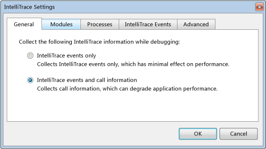

<properties 
   pageTitle="Débogage d’un service cloud publiés avec IntelliTrace et Visual Studio | Microsoft Azure"
   description="Débogage d’un service cloud publiés avec IntelliTrace et Visual Studio"
   services="visual-studio-online"
   documentationCenter="n/a"
   authors="TomArcher"
   manager="douge"
   editor="" />
<tags 
   ms.service="visual-studio-online"
   ms.devlang="multiple"
   ms.topic="article"
   ms.tgt_pltfrm="multiple"
   ms.workload="na"
   ms.date="08/15/2016"
   ms.author="tarcher" />

# Débogage d’un service cloud publiés avec IntelliTrace et Visual Studio

##Vue d’ensemble

Avec IntelliTrace, vous pouvez enregistrer des informations détaillées de débogage pour une instance de rôle lorsqu’il s’exécute dans Azure. Si vous avez besoin rechercher l’origine d’un problème, vous pouvez utiliser les journaux IntelliTrace pour parcourir votre code de Visual Studio, comme s’il était exécuté dans Azure. En vigueur, IntelliTrace enregistrements clés l’exécution de code et données d’environnement lorsque votre application Azure s’exécute comme un service cloud dans Azure et vous permet de relire les données enregistrées à partir de Visual Studio. Comme alternative, vous pouvez utiliser le débogage distant pour joindre directement à un service cloud qui s’exécute dans Azure. Voir [Déboguer des Services Cloud](http://go.microsoft.com/fwlink/p/?LinkId=623041).

>[AZURE.IMPORTANT] IntelliTrace est destiné uniquement aux scénarios déboguer et ne doit pas être utilisé pour un déploiement de production.

>[AZURE.NOTE] Vous pouvez utiliser IntelliTrace si vous avez Visual Studio Enterprise installé et votre application Azure cible .NET Framework 4 ou version ultérieure. IntelliTrace collecte des informations pour vos rôles Azure. Machines virtuelles pour ces rôles toujours exécutés les systèmes d’exploitation 64 bits.

## Pour configurer une application Azure pour IntelliTrace

Pour permettre à IntelliTrace pour une application Azure, vous devez créer et publier l’application à partir d’un projet Visual Studio Azure. Vous devez configurer IntelliTrace pour votre application Azure avant de publier sur Azure. Si vous publiez votre application sans configurer IntelliTrace mais décidez ensuite que vous voulez faire, vous devez publier l’application à partir de Visual Studio. Pour plus d’informations, voir [publication d’un Service de nuage en utilisant les outils Azure](http://go.microsoft.com/fwlink/p/?LinkId=623012).

1. Lorsque vous êtes prêt à déployer votre application Azure, vérifiez que votre projet génération cible est définis pour **Déboguer**.

1. Ouvrir le menu contextuel pour le projet Azure dans l’Explorateur de solutions et choisissez **Publier**.
 
    L’Assistant Publier Azure Application s’affiche.

1. Pour collecter les fichiers journaux IntelliTrace pour votre application lorsqu’il est publié dans le nuage, activez la case à cocher **Activer IntelliTrace** .

    >[AZURE.NOTE] Vous pouvez activer IntelliTrace ou profil lorsque vous publiez votre application Azure. Vous ne pouvez pas activer les deux.

1. Pour personnaliser la configuration de IntelliTrace base, cliquez sur le lien **paramètres** .

    La boîte de dialogue paramètres IntelliTrace s’affiche, comme illustré dans l’illustration suivante. Vous pouvez spécifier les événements à un journal, si vous souhaitez recueillir des informations sur les appels, quels modules et processus pour collecter les journaux pour et la quantité d’espace à allouer à l’enregistrement. Pour plus d’informations sur IntelliTrace, consultez [débogage avec IntelliTrace](http://go.microsoft.com/fwlink/?LinkId=214468).

    

Le journal IntelliTrace est un fichier journal circulaire de la taille maximale spécifiée dans les paramètres IntelliTrace (la taille par défaut est de 250 Mo). Les fichiers journaux IntelliTrace sont collectées dans un fichier dans le système de fichiers de la machine virtuelle. Lorsque vous demandez les journaux, un instantané est considérée à ce stade et téléchargé sur votre ordinateur local.

Une fois que l’application Azure a été publiée sur Azure, vous pouvez déterminer si IntelliTrace a été activée dans le nœud Azure calculer dans l’Explorateur de serveurs, comme le montre l’image suivante :

## Téléchargement de fichiers journaux IntelliTrace pour une Instance de rôle

Vous pouvez télécharger les fichiers journaux IntelliTrace pour une instance de rôle à partir du nœud **Services Cloud** dans **l’Explorateur de serveur**. Développez le nœud **Services Cloud** jusqu'à ce que vous trouviez l’instance que qui vous intéresse, ouvrez le menu contextuel pour cette instance et sélectionnez **Afficher les journaux IntelliTrace**. Les journaux IntelliTrace sont téléchargés vers un fichier dans un répertoire sur votre ordinateur local. Chaque fois que vous demandez la IntelliTrace se connecte, une nouvelle capture instantanée est créée.

Lorsque les journaux sont téléchargés, Visual Studio affiche la progression de l’opération dans la fenêtre du journal d’activité Azure. Comme indiqué dans l’illustration suivante, vous pouvez développer la ligne de facturation pour l’opération afficher plus en détail.

Vous pouvez continuer à travailler dans Visual Studio tandis que les journaux IntelliTrace téléchargent. Lorsque le journal de téléchargement est terminé, il s’ouvrent automatiquement dans Visual Studio.

>[AZURE.NOTE] Les journaux IntelliTrace peuvent contenir des exceptions que l’infrastructure génère et gère par la suite. Code interne framework génère ces exceptions dans le cadre normal du démarrage d’un rôle, afin que vous pouvez les ignorer.

## Voir aussi

[Services de Cloud débogage](https://msdn.microsoft.com/library/ee405479.aspx)

